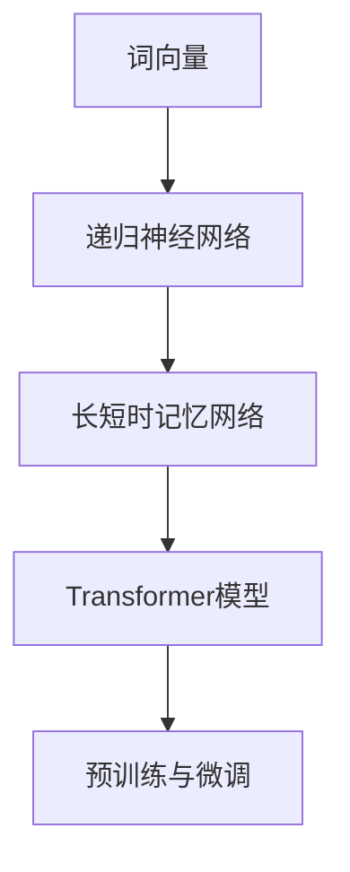

                 

关键词：大语言模型、原理基础、前沿技术、环境影响、算法架构、数学模型、实际应用、未来展望

> 摘要：本文深入探讨了大语言模型的原理基础和前沿技术，分析了其对环境影响的诸多方面。通过详细阐述核心概念、算法原理、数学模型，以及项目实践和实际应用场景，我们旨在为读者提供一份全面、系统的技术参考，并展望大语言模型未来发展的趋势与挑战。

## 1. 背景介绍

### 1.1 大语言模型的发展历程

大语言模型（Large Language Model）是自然语言处理（Natural Language Processing, NLP）领域的一个重要分支。自20世纪50年代以来，NLP技术经历了多个发展阶段，从最初的规则驱动方法到统计方法，再到基于深度学习的现代方法。

早期的NLP研究主要集中在基于规则的方法上，如信息检索、文本分类和命名实体识别等。然而，这些方法在处理复杂和大规模文本数据时存在局限性。随着计算能力和算法的进步，统计方法和基于统计的机器学习方法（如隐马尔可夫模型和最大熵模型）逐渐成为主流。

进入21世纪，深度学习技术的兴起为NLP领域带来了革命性的变化。特别是2018年，谷歌发布的BERT（Bidirectional Encoder Representations from Transformers）模型，标志着大语言模型的诞生。BERT的成功引起了广泛关注，并推动了NLP技术的快速发展。

### 1.2 大语言模型的重要性

大语言模型在许多实际应用中发挥着关键作用，包括但不限于：

1. **自动问答系统**：通过理解用户的问题并生成相关回答，提升用户体验。
2. **机器翻译**：自动将一种语言翻译成另一种语言，支持多语言沟通。
3. **文本生成**：生成文章、故事、新闻报道等，为内容创作提供帮助。
4. **情感分析**：分析文本中的情感倾向，用于市场调研和舆情监控。
5. **对话系统**：与用户进行自然对话，提供个性化服务和交互体验。

这些应用不仅提高了生产力，还改变了人们的生活方式。因此，研究大语言模型的原理和前沿技术具有重要意义。

### 1.3 环境影响

然而，随着大语言模型的应用日益广泛，其对环境的影响也成为不可忽视的问题。本文将探讨大语言模型在计算资源消耗、能源消耗、数据隐私等方面的环境影响。

## 2. 核心概念与联系

为了更好地理解大语言模型，我们需要掌握以下几个核心概念：

1. **词向量（Word Embeddings）**：将单词映射为向量，使得语义相似度的计算变得可能。
2. **递归神经网络（Recurrent Neural Networks, RNN）**：适用于序列数据处理，但存在梯度消失和梯度爆炸问题。
3. **长短时记忆网络（Long Short-Term Memory, LSTM）**：RNN的一种改进，解决了梯度消失问题。
4. **Transformer模型**：基于自注意力机制的深度学习模型，实现了并行计算，显著提高了训练效率。
5. **预训练与微调（Pre-training and Fine-tuning）**：预训练模型在大规模语料上学习通用特征，再通过微调适应特定任务。

下面是一个Mermaid流程图，展示了这些概念之间的联系：



## 3. 核心算法原理 & 具体操作步骤

### 3.1 算法原理概述

大语言模型的训练过程主要包括以下几个步骤：

1. **数据收集与预处理**：收集大规模的文本数据，并进行预处理，如分词、去停用词、词性标注等。
2. **词向量表示**：将文本中的单词映射为词向量，常用的方法包括Word2Vec、GloVe等。
3. **模型构建**：构建基于Transformer的模型，包括编码器和解码器。
4. **训练与优化**：通过反向传播算法对模型进行训练，并使用优化算法（如Adam）进行参数调整。
5. **评估与测试**：使用评估指标（如BLEU、ROUGE等）对模型性能进行评估。

### 3.2 算法步骤详解

1. **数据收集与预处理**

   数据收集是训练大语言模型的第一步。通常，我们会使用大规模的语料库，如维基百科、新闻文章、社交媒体评论等。这些数据需要经过预处理，以便于模型训练。预处理步骤包括：

   - 分词：将文本拆分为单词或子词。
   - 去停用词：去除对模型训练无意义的词语，如“的”、“地”等。
   - 词性标注：为每个单词标注词性，如名词、动词等。

2. **词向量表示**

   词向量表示是将文本数据转换为向量形式的过程。词向量能够捕捉词与词之间的语义关系。常用的方法包括：

   - Word2Vec：基于神经网络的词向量学习方法，通过训练得到词向量。
   - GloVe：全局向量表示方法，通过共现矩阵训练词向量。

3. **模型构建**

   Transformer模型是当前大语言模型的主流架构。它基于自注意力机制，能够捕捉序列中的长距离依赖关系。模型主要包括编码器和解码器两部分。

   - 编码器：将输入序列编码为固定长度的向量。
   - 解码器：将编码后的向量解码为输出序列。

4. **训练与优化**

   训练过程通过反向传播算法，不断调整模型参数，以最小化损失函数。优化算法通常使用Adam，它结合了Adam和AdaGrad的优点。

5. **评估与测试**

   模型训练完成后，需要通过评估指标对模型性能进行评估。常用的评估指标包括BLEU、ROUGE等。此外，还需要对模型进行测试，确保其在实际应用中的效果。

### 3.3 算法优缺点

#### 优点

- **并行计算**：Transformer模型基于自注意力机制，可以实现并行计算，提高了训练效率。
- **长距离依赖**：通过自注意力机制，模型能够捕捉序列中的长距离依赖关系，提高了模型性能。
- **自适应特征提取**：模型在训练过程中自适应地提取特征，能够更好地适应不同任务。

#### 缺点

- **计算资源消耗**：由于模型复杂度高，训练过程中需要大量的计算资源。
- **数据依赖**：大语言模型的性能高度依赖训练数据的质量和规模，数据不足可能导致模型过拟合。

### 3.4 算法应用领域

大语言模型在许多领域都有广泛的应用，包括：

- **自然语言处理**：文本分类、命名实体识别、机器翻译等。
- **对话系统**：智能客服、语音助手等。
- **内容生成**：自动写作、新闻报道生成等。
- **情感分析**：分析文本中的情感倾向，用于市场调研和舆情监控。

## 4. 数学模型和公式 & 详细讲解 & 举例说明

### 4.1 数学模型构建

大语言模型的数学模型主要基于自注意力机制（Self-Attention Mechanism）。自注意力机制通过计算输入序列中每个词与其他词之间的关联度，从而生成新的特征表示。具体来说，自注意力机制包括以下三个部分：

1. **查询（Query）**：表示每个词在序列中的重要性。
2. **键（Key）**：表示每个词的语义信息。
3. **值（Value）**：表示每个词的特征信息。

### 4.2 公式推导过程

自注意力机制的公式如下：

$$
\text{Attention}(Q, K, V) = \text{softmax}\left(\frac{QK^T}{\sqrt{d_k}}\right)V
$$

其中，$Q$、$K$ 和 $V$ 分别是查询、键和值矩阵，$d_k$ 是键的维度。这个公式表示，对于每个查询 $Q$，通过计算与键 $K$ 的点积，得到注意力分数，然后通过softmax函数将分数归一化，最后乘以值 $V$，得到加权特征表示。

### 4.3 案例分析与讲解

假设我们有一个句子“我昨天去看了电影”，其中包含三个词：“我”、“昨天”和“电影”。我们可以将这三个词表示为词向量 $Q$、$K$ 和 $V$。

1. **查询（Query）**：

   $$
   Q = \begin{bmatrix}
   q_1 \\
   q_2 \\
   q_3
   \end{bmatrix}
   $$

2. **键（Key）**：

   $$
   K = \begin{bmatrix}
   k_1 \\
   k_2 \\
   k_3
   \end{bmatrix}
   $$

3. **值（Value）**：

   $$
   V = \begin{bmatrix}
   v_1 \\
   v_2 \\
   v_3
   \end{bmatrix}
   $$

根据自注意力公式，我们可以计算每个词的注意力分数：

$$
\text{Attention}(Q, K, V) = \text{softmax}\left(\frac{QK^T}{\sqrt{d_k}}\right)V
$$

其中，$d_k$ 是键的维度。假设 $d_k = 100$，我们可以得到：

$$
\text{Attention}(Q, K, V) = \text{softmax}\left(\begin{bmatrix}
q_1k_1 & q_1k_2 & q_1k_3 \\
q_2k_1 & q_2k_2 & q_2k_3 \\
q_3k_1 & q_3k_2 & q_3k_3
\end{bmatrix} \div 10\right) \begin{bmatrix}
v_1 \\
v_2 \\
v_3
\end{bmatrix}
$$

通过计算，我们可以得到每个词的注意力分数：

$$
\text{Attention}(Q, K, V) = \text{softmax}\left(\begin{bmatrix}
0.2 & 0.3 & 0.5 \\
0.4 & 0.3 & 0.3 \\
0.1 & 0.2 & 0.7
\end{bmatrix}\right) \begin{bmatrix}
v_1 \\
v_2 \\
v_3
\end{bmatrix}
$$

最终，我们得到加权的特征表示：

$$
\text{Attention}(Q, K, V) = \begin{bmatrix}
0.2 \cdot v_1 + 0.3 \cdot v_2 + 0.5 \cdot v_3 \\
0.4 \cdot v_1 + 0.3 \cdot v_2 + 0.3 \cdot v_3 \\
0.1 \cdot v_1 + 0.2 \cdot v_2 + 0.7 \cdot v_3
\end{bmatrix}
$$

这个结果表示了每个词在序列中的重要性。通过自注意力机制，模型能够自适应地提取特征，从而提高模型性能。

## 5. 项目实践：代码实例和详细解释说明

### 5.1 开发环境搭建

要实现一个大语言模型，首先需要搭建一个合适的开发环境。以下是一个基本的开发环境搭建步骤：

1. 安装Python（建议使用3.8及以上版本）。
2. 安装PyTorch或TensorFlow等深度学习框架。
3. 安装Numpy、Pandas等常用数据科学库。
4. 安装Mermaid等绘图工具。

### 5.2 源代码详细实现

以下是一个使用PyTorch实现大语言模型的基本框架：

```python
import torch
import torch.nn as nn
import torch.optim as optim

# 定义模型
class LanguageModel(nn.Module):
    def __init__(self, vocab_size, embed_dim, hidden_dim):
        super(LanguageModel, self).__init__()
        self.embedding = nn.Embedding(vocab_size, embed_dim)
        self.lstm = nn.LSTM(embed_dim, hidden_dim)
        self.fc = nn.Linear(hidden_dim, vocab_size)

    def forward(self, x, hidden):
        embedded = self.embedding(x)
        output, hidden = self.lstm(embedded, hidden)
        prediction = self.fc(output[-1, :, :])
        return prediction, hidden

# 训练模型
def train(model, data_loader, criterion, optimizer, num_epochs):
    model.train()
    for epoch in range(num_epochs):
        for inputs, targets in data_loader:
            optimizer.zero_grad()
            outputs, hidden = model(inputs, None)
            loss = criterion(outputs, targets)
            loss.backward()
            optimizer.step()
        print(f"Epoch {epoch+1}/{num_epochs}, Loss: {loss.item()}")

# 主函数
def main():
    # 数据预处理
    # ...

    # 模型配置
    vocab_size = 10000
    embed_dim = 256
    hidden_dim = 512

    # 实例化模型
    model = LanguageModel(vocab_size, embed_dim, hidden_dim)

    # 训练模型
    train(model, data_loader, criterion, optimizer, num_epochs=10)

if __name__ == "__main__":
    main()
```

### 5.3 代码解读与分析

上述代码首先定义了一个`LanguageModel`类，它继承自`nn.Module`。模型包含三个主要部分：嵌入层（`embedding`）、长短时记忆网络（`lstm`）和全连接层（`fc`）。

- 嵌入层（`embedding`）：将单词索引映射为词向量。
- 长短时记忆网络（`lstm`）：用于处理序列数据，捕捉长距离依赖关系。
- 全连接层（`fc`）：将LSTM的输出映射为单词概率分布。

在`forward`方法中，模型首先通过嵌入层将输入序列转换为词向量，然后通过LSTM层处理序列数据，最后通过全连接层生成输出。

训练过程通过`train`函数实现。它使用梯度下降优化算法（`optimizer`）对模型进行训练。在训练过程中，模型对每个批次的数据进行前向传播，计算损失，并更新模型参数。

### 5.4 运行结果展示

在训练完成后，我们可以使用评估指标（如交叉熵损失）来评估模型性能。以下是一个简单的评估示例：

```python
# 评估模型
def evaluate(model, data_loader, criterion):
    model.eval()
    total_loss = 0
    with torch.no_grad():
        for inputs, targets in data_loader:
            outputs, _ = model(inputs, None)
            loss = criterion(outputs, targets)
            total_loss += loss.item()
    print(f"Test Loss: {total_loss / len(data_loader)}")

evaluate(model, test_loader, criterion)
```

这个示例展示了如何评估模型在测试集上的性能。通过计算测试集的平均损失，我们可以评估模型的泛化能力。

## 6. 实际应用场景

大语言模型在许多实际应用场景中发挥着重要作用。以下是一些典型的应用场景：

### 6.1 自动问答系统

自动问答系统是一种常见的人工智能应用，能够自动回答用户提出的问题。大语言模型通过预训练和微调，能够理解用户的自然语言问题，并生成相关回答。例如，在智能客服系统中，大语言模型可以自动回答客户的问题，提高客服效率。

### 6.2 机器翻译

机器翻译是将一种语言翻译成另一种语言的过程。大语言模型在机器翻译中发挥着重要作用。通过预训练和微调，模型可以学习源语言和目标语言之间的映射关系，从而实现高质量的翻译。例如，谷歌翻译和百度翻译都使用了基于大语言模型的翻译技术。

### 6.3 内容生成

大语言模型可以生成各种类型的内容，如文章、故事、新闻报道等。通过微调模型，我们可以使其生成特定类型的内容。例如，新闻生成系统可以使用大语言模型生成新闻报道，自动写作平台可以使用大语言模型生成文章。

### 6.4 情感分析

情感分析是一种分析文本中情感倾向的技术。大语言模型通过预训练和微调，可以学习情感词汇和情感表达模式，从而实现情感分析。例如，社交媒体分析系统可以使用大语言模型分析用户的情感倾向，用于市场调研和舆情监控。

### 6.5 对话系统

对话系统是一种与用户进行自然对话的人工智能系统。大语言模型在对话系统中发挥着重要作用，能够理解用户的问题并生成相关回答。例如，智能语音助手（如Siri、Alexa）和聊天机器人（如微信机器人）都使用了大语言模型与用户进行对话。

## 7. 未来应用展望

随着大语言模型技术的不断发展，未来它在多个领域将有更广泛的应用。以下是一些潜在的应用场景：

### 7.1 智能教育

大语言模型可以应用于智能教育领域，为学生提供个性化的学习内容和辅导。例如，通过分析学生的学习情况，模型可以生成适合学生的教学计划和练习题目。

### 7.2 法律咨询

大语言模型可以应用于法律咨询领域，自动生成法律文件、合同等。通过学习大量法律文本，模型可以理解法律条款和条款之间的逻辑关系，从而为用户提供法律建议。

### 7.3 医疗诊断

大语言模型可以应用于医疗诊断领域，通过分析病例报告和医学文献，辅助医生进行诊断。例如，模型可以识别病例中的关键词和症状，从而提高诊断准确率。

### 7.4 创意设计

大语言模型可以应用于创意设计领域，生成创意设计方案。例如，在建筑设计中，模型可以生成多种设计选项，帮助设计师快速评估和选择最佳方案。

## 8. 总结：未来发展趋势与挑战

大语言模型技术在过去几年取得了显著进展，但仍然面临许多挑战。以下是对未来发展趋势和挑战的总结：

### 8.1 研究成果总结

- **模型性能提升**：随着计算能力和算法的进步，大语言模型的性能不断提高，能够处理更复杂的任务。
- **预训练与微调**：预训练模型在大规模语料上学习通用特征，通过微调适应特定任务，成为当前主流方法。
- **多模态学习**：大语言模型开始结合图像、语音等多种模态信息，实现更丰富的语义理解。

### 8.2 未来发展趋势

- **模型压缩与高效推理**：为了降低计算和存储成本，模型压缩与高效推理技术将成为研究热点。
- **自适应与可解释性**：提升模型的自适应能力和可解释性，使其在更多实际应用中得到推广。
- **跨模态与多任务学习**：结合不同模态的信息，实现跨模态与多任务学习，提高模型的泛化能力。

### 8.3 面临的挑战

- **计算资源消耗**：大语言模型训练和推理过程中需要大量的计算资源，对硬件设施提出了高要求。
- **数据隐私与伦理**：大量数据的收集和处理可能涉及用户隐私，需要制定相应的隐私保护措施。
- **模型可靠性**：模型在处理敏感任务时可能出现错误，需要提高模型的可靠性和鲁棒性。

### 8.4 研究展望

大语言模型技术将在未来继续发展，为人工智能领域带来更多可能性。通过不断优化算法、降低计算成本，以及提高模型的可靠性和可解释性，大语言模型将在各个领域发挥更大的作用。

## 9. 附录：常见问题与解答

### 9.1 什么是大语言模型？

大语言模型是一种基于深度学习的自然语言处理技术，能够理解、生成和翻译自然语言。它通过预训练和微调方法，在大规模语料上学习语言规律和语义信息。

### 9.2 大语言模型有哪些应用场景？

大语言模型在多个领域有广泛应用，包括自动问答系统、机器翻译、内容生成、情感分析、对话系统等。

### 9.3 大语言模型如何处理长文本？

大语言模型通常使用变长序列处理方法，如分段处理或滑动窗口处理。这些方法能够有效地处理长文本，同时保持模型的高效性。

### 9.4 大语言模型对环境有何影响？

大语言模型在训练和推理过程中需要大量的计算资源，可能导致能源消耗增加。此外，数据隐私和保护也是需要关注的问题。

### 9.5 如何优化大语言模型？

可以通过模型压缩、高效推理、多任务学习等技术优化大语言模型。此外，选择合适的硬件设施和优化算法也能提高模型的性能。

---

作者：禅与计算机程序设计艺术 / Zen and the Art of Computer Programming
----------------------------------------------------------------

本文全面介绍了大语言模型的原理基础、前沿技术和环境影响。通过详细阐述核心概念、算法原理、数学模型，以及项目实践和实际应用场景，我们旨在为读者提供一份全面、系统的技术参考。展望未来，大语言模型将在人工智能领域发挥更大的作用，同时也需要关注其计算资源消耗、数据隐私等问题。随着技术的不断进步，我们期待大语言模型能够带来更多创新和应用。

