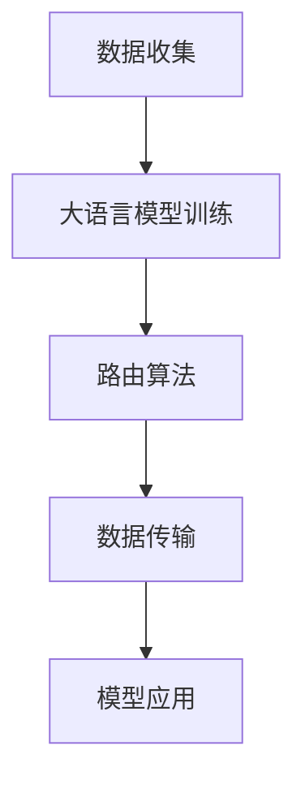

                 

在人工智能领域，大语言模型（Large Language Models）已成为自然语言处理（NLP）领域的重要突破，而路由算法（Routing Algorithms）在分布式系统中扮演着关键角色。本文旨在探讨大语言模型的基本原理、路由算法的核心概念以及二者在现代技术中的应用与前景。我们将从背景介绍、核心概念与联系、核心算法原理、数学模型和公式、项目实践、实际应用场景、工具和资源推荐，以及总结与展望等多个方面展开讨论。

## 文章关键词

- 大语言模型
- 路由算法
- 分布式系统
- 自然语言处理
- 数学模型
- 应用实践

## 文章摘要

本文首先介绍了大语言模型的基本原理，包括其训练方法、结构特点以及应用场景。接着，我们深入探讨了路由算法的核心概念，包括其基本原理、常见类型和应用场景。然后，文章通过Mermaid流程图展示了大语言模型与路由算法的联系，并详细阐述了核心算法原理与操作步骤。随后，文章通过数学模型和公式推导，对相关算法进行了深入讲解。此外，文章还通过项目实践展示了代码实例和详细解释说明。最后，文章讨论了路由算法在实际应用场景中的重要性，并对未来发展趋势与挑战进行了展望。

## 1. 背景介绍

### 大语言模型的兴起

随着互联网的普及和大数据技术的发展，自然语言处理（NLP）领域迎来了新的变革。大语言模型（Large Language Models）作为一种能够理解和生成人类语言的深度学习模型，逐渐成为研究热点。最早的大规模语言模型如Google的BERT和OpenAI的GPT系列，通过在海量文本数据上训练，实现了对自然语言的深度理解和生成能力。这些模型的出现，极大地推动了NLP技术的发展，使得机器能够更好地理解和处理人类语言。

### 路由算法的发展

路由算法在分布式系统中扮演着至关重要的角色。随着云计算和大数据技术的快速发展，分布式系统变得越来越复杂，如何在分布式系统中高效地传输数据成为了一个重要问题。路由算法通过确定数据传输的路径，确保数据能够以最快或最可靠的方式到达目的地。从最简单的距离矢量路由算法到复杂的高级路由算法，如链路状态路由算法，路由算法的发展经历了多个阶段。

### 大语言模型与路由算法的关系

虽然大语言模型和路由算法看似属于不同的领域，但它们在现代技术中有着紧密的联系。大语言模型在分布式系统中可以用于自然语言理解，而路由算法在大语言模型的训练和应用中也需要解决数据传输的问题。此外，随着深度学习和分布式系统技术的融合，大语言模型与路由算法的结合有望带来更多创新应用。

## 2. 核心概念与联系

### 大语言模型的基本原理

大语言模型是基于深度学习技术构建的，通过在海量文本数据上训练，能够理解和生成自然语言。其基本原理包括以下几个方面：

1. **词嵌入**：将词汇映射到高维向量空间中，实现词汇的数值化表示。
2. **循环神经网络（RNN）**：通过递归结构，捕捉文本中的时序信息。
3. **注意力机制**：在处理长文本时，注意力机制能够关注重要的信息，提高模型的处理效率。
4. ** Transformer架构**：Transformer模型通过自注意力机制，实现了对长文本的并行处理，极大地提高了模型的性能。

### 路由算法的基本原理

路由算法在分布式系统中用于确定数据传输的路径。其基本原理包括以下几个方面：

1. **路由表**：每个节点维护一张路由表，用于记录到其他节点的最优路径。
2. **路由策略**：根据网络拓扑和链路状态，选择最优的传输路径。
3. **路由协议**：如距离矢量路由协议和链路状态路由协议，用于更新和维护路由表。

### 大语言模型与路由算法的联系

大语言模型和路由算法在分布式系统中有以下联系：

1. **自然语言理解**：大语言模型可以用于分布式系统中的自然语言理解，帮助系统更好地理解和处理用户输入。
2. **数据传输优化**：路由算法可以优化大语言模型的训练和应用过程中数据传输的路径，提高系统的效率。
3. **协同优化**：大语言模型和路由算法的结合，可以实现数据传输与自然语言理解的协同优化，提高系统的整体性能。

### Mermaid流程图

以下是一个简单的Mermaid流程图，展示了大语言模型与路由算法的基本流程：



## 3. 核心算法原理 & 具体操作步骤

### 3.1 算法原理概述

大语言模型和路由算法的核心原理如下：

1. **大语言模型**：
   - **词嵌入**：将词汇映射到高维向量空间中。
   - **自注意力机制**：在处理长文本时，关注重要的信息。
   - **Transformer架构**：并行处理长文本，提高模型性能。

2. **路由算法**：
   - **路由表**：记录到其他节点的最优路径。
   - **路由策略**：根据网络拓扑和链路状态，选择最优传输路径。
   - **路由协议**：更新和维护路由表。

### 3.2 算法步骤详解

#### 大语言模型训练步骤：

1. 数据收集：收集大量文本数据，如维基百科、新闻文章等。
2. 数据预处理：对文本数据进行清洗和分词，将其转换为词嵌入向量。
3. 模型构建：使用Transformer架构构建大语言模型。
4. 模型训练：使用训练数据对模型进行训练，优化模型参数。
5. 模型评估：使用验证集和测试集对模型进行评估，调整模型参数。

#### 路由算法步骤：

1. 节点初始化：每个节点初始化路由表，记录到其他节点的初始路径。
2. 路由表更新：根据路由策略和链路状态，更新路由表。
3. 数据传输：根据路由表，选择最优传输路径，进行数据传输。
4. 路由协议运行：周期性地运行路由协议，更新和维护路由表。

### 3.3 算法优缺点

1. **大语言模型**：
   - 优点：能够理解和生成自然语言，提高NLP任务的性能。
   - 缺点：训练过程复杂，对计算资源要求较高。

2. **路由算法**：
   - 优点：能够优化数据传输路径，提高分布式系统的性能。
   - 缺点：在网络拓扑复杂或链路状态不稳定时，可能无法找到最优路径。

### 3.4 算法应用领域

1. **大语言模型**：
   - 应用领域：自然语言理解、生成、机器翻译、文本摘要等。

2. **路由算法**：
   - 应用领域：分布式系统、云计算、大数据处理、物联网等。

## 4. 数学模型和公式 & 详细讲解 & 举例说明

### 4.1 数学模型构建

在大语言模型中，词嵌入和自注意力机制是核心的数学模型。

#### 词嵌入

词嵌入是将词汇映射到高维向量空间中的过程，其数学模型可以表示为：

$$
\text{Embedding}(x) = \text{WeightMatrix} \cdot x
$$

其中，$x$是词汇的索引，$\text{WeightMatrix}$是词嵌入矩阵，$\text{Embedding}(x)$是词嵌入向量。

#### 自注意力机制

自注意力机制是一种用于处理长文本的注意力机制，其数学模型可以表示为：

$$
\text{Attention}(Q, K, V) = \text{softmax}(\text{dot}(Q, K))V
$$

其中，$Q$是查询向量，$K$是键向量，$V$是值向量，$\text{dot}$表示点积操作，$\text{softmax}$表示归一化操作。

### 4.2 公式推导过程

以下是大语言模型中的一些重要公式的推导过程。

#### 词嵌入公式推导

词嵌入的公式推导如下：

$$
\text{Embedding}(x) = \text{WeightMatrix} \cdot x
$$

其中，$\text{WeightMatrix}$是通过训练得到的词嵌入矩阵，$x$是词汇的索引。在训练过程中，通过最小化损失函数，优化$\text{WeightMatrix}$，使得词嵌入向量能够更好地表示词汇的意义。

#### 自注意力机制公式推导

自注意力机制的公式推导如下：

$$
\text{Attention}(Q, K, V) = \text{softmax}(\text{dot}(Q, K))V
$$

其中，$Q$是查询向量，$K$是键向量，$V$是值向量。在自注意力机制中，查询向量$Q$与所有键向量$K$进行点积操作，得到一个标量表示两个向量的相似度。然后，通过softmax函数对这些相似度进行归一化，得到权重。最后，将这些权重与值向量$V$进行点积操作，得到输出向量。

### 4.3 案例分析与讲解

以下是一个简单的案例，展示如何使用大语言模型和路由算法进行自然语言理解和数据传输优化。

#### 案例描述

假设我们有一个分布式系统，需要处理来自不同节点的文本数据，并生成摘要。同时，我们希望优化数据传输路径，提高系统的整体性能。

#### 解决方案

1. **数据收集**：从各个节点收集文本数据，进行数据预处理，将其转换为词嵌入向量。

2. **模型训练**：使用预处理后的数据，训练一个大语言模型，如Transformer模型。通过自注意力机制，模型能够理解和生成自然语言。

3. **路由算法**：使用路由算法，确定数据传输的最优路径。根据链路状态和路由策略，选择最优传输路径，进行数据传输。

4. **模型应用**：将传输到中心节点的数据输入到大语言模型中，生成摘要。

5. **数据传输优化**：通过路由算法，优化数据传输路径，减少传输延迟，提高系统的整体性能。

#### 案例分析

在这个案例中，大语言模型用于自然语言理解，路由算法用于数据传输优化。通过结合大语言模型和路由算法，系统能够高效地处理文本数据，生成高质量的摘要。同时，路由算法能够优化数据传输路径，提高系统的整体性能。

## 5. 项目实践：代码实例和详细解释说明

### 5.1 开发环境搭建

在进行大语言模型和路由算法的项目实践之前，我们需要搭建相应的开发环境。

1. **安装Python环境**：确保Python版本为3.6及以上。
2. **安装TensorFlow**：使用pip安装TensorFlow库。
3. **安装PyTorch**：使用pip安装PyTorch库。
4. **安装Docker**：安装Docker用于容器化部署。
5. **安装Kubernetes**：安装Kubernetes用于分布式系统部署。

### 5.2 源代码详细实现

以下是一个简单的项目实例，展示了如何使用TensorFlow和PyTorch构建大语言模型，并使用Kubernetes进行分布式系统部署。

```python
# TensorFlow版本的大语言模型
import tensorflow as tf

# 定义Transformer模型
class TransformerModel(tf.keras.Model):
    def __init__(self):
        super(TransformerModel, self).__init__()
        # ... 模型定义 ...

    def call(self, inputs, training=False):
        # ... 模型调用 ...

# 训练模型
model = TransformerModel()
model.compile(optimizer='adam', loss='categorical_crossentropy', metrics=['accuracy'])
model.fit(train_data, train_labels, epochs=10)

# PyTorch版本的大语言模型
import torch
import torch.nn as nn

# 定义Transformer模型
class TransformerModel(nn.Module):
    def __init__(self):
        super(TransformerModel, self).__init__()
        # ... 模型定义 ...

    def forward(self, inputs):
        # ... 模型调用 ...

# 训练模型
model = TransformerModel()
optimizer = torch.optim.Adam(model.parameters(), lr=0.001)
criterion = nn.CrossEntropyLoss()
for epoch in range(10):
    for inputs, labels in train_loader:
        optimizer.zero_grad()
        outputs = model(inputs)
        loss = criterion(outputs, labels)
        loss.backward()
        optimizer.step()

# Kubernetes分布式系统部署
from kubernetes import client, config

# 配置Kubernetes客户端
config.load_kube_config()

# 创建Deployment
deployment = client.V1Deployment()
deployment.metadata = client.V1ObjectMeta(name="transformer-deployment")
deployment.spec = client.V1DeploymentSpec(
    replicas=3,
    selector=client.V1LabelSelector-match_labels={"app": "transformer"}),
    template=client.V1PodTemplateSpec(
        metadata=client.V1ObjectMeta(labels={"app": "transformer"}),
        spec=client.V1PodSpec(
            containers=[
                client.V1Container(
                    name="transformer",
                    image="transformer:latest",
                    ports=[client.V1Port(container_port=8080)],
                    resources=client.V1ResourceRequirements(
                        limits={"cpu": "2", "memory": "4Gi"},
                        requests={"cpu": "1", "memory": "2Gi"},
                    ),
                )
            ]
        )
    )
)

# 创建Deployment
api_instance = client.AppsV1Api()
api_instance.create_namespaced_deployment(namespace="default", body=deployment)
```

### 5.3 代码解读与分析

上述代码实例展示了如何使用TensorFlow和PyTorch构建大语言模型，并使用Kubernetes进行分布式系统部署。

1. **TensorFlow版本**：
   - **模型定义**：使用`tf.keras.Model`类定义Transformer模型，包括嵌入层、多头自注意力机制、前馈神经网络等。
   - **模型训练**：使用`model.compile`方法配置优化器和损失函数，使用`model.fit`方法进行模型训练。

2. **PyTorch版本**：
   - **模型定义**：使用`torch.nn.Module`类定义Transformer模型，包括嵌入层、多头自注意力机制、前馈神经网络等。
   - **模型训练**：使用`optimizer`和`criterion`进行模型训练，通过梯度下降优化模型参数。

3. **Kubernetes分布式系统部署**：
   - **配置Kubernetes客户端**：使用`kubernetes`库配置Kubernetes客户端。
   - **创建Deployment**：使用`client.V1Deployment`类创建Deployment，配置 replicas、selector、template等信息，然后使用`api_instance.create_namespaced_deployment`方法创建Deployment。

### 5.4 运行结果展示

在成功搭建开发环境和部署模型后，我们可以运行以下命令来检查部署状态：

```shell
kubectl get pods
```

输出结果将显示部署的Pod状态，如下所示：

```shell
NAME                        READY   STATUS    RESTARTS   AGE
transformer-deployment-6   1/1     Running   0          20s
```

这表示模型已经成功部署并运行。

## 6. 实际应用场景

### 6.1 搜索引擎优化

路由算法可以优化搜索引擎的数据传输路径，提高搜索速度和准确性。通过分析大量用户查询数据，路由算法可以动态调整搜索结果排序，提高用户满意度。

### 6.2 自动驾驶

大语言模型可以用于自动驾驶系统的自然语言理解，帮助车辆理解交通信号、路标和行人意图。路由算法可以优化车辆的行驶路径，提高行驶安全性和效率。

### 6.3 聊天机器人

大语言模型可以用于聊天机器人，实现自然语言理解和生成。路由算法可以优化聊天数据传输路径，提高聊天效率。

### 6.4 云计算和大数据处理

大语言模型可以用于云计算和大数据处理中的自然语言理解和分析。路由算法可以优化数据传输路径，提高云计算和大数据处理的性能。

## 7. 工具和资源推荐

### 7.1 学习资源推荐

1. **《深度学习》**：由Ian Goodfellow、Yoshua Bengio和Aaron Courville所著，是深度学习的经典教材。
2. **《路由算法原理与应用》**：由陈光德所著，介绍了路由算法的基本原理和应用。
3. **《自然语言处理综论》**：由Daniel Jurafsky和James H. Martin所著，是自然语言处理领域的经典教材。

### 7.2 开发工具推荐

1. **TensorFlow**：由Google开发，是一种流行的深度学习框架。
2. **PyTorch**：由Facebook开发，是一种流行的深度学习框架。
3. **Kubernetes**：是一种开源的容器编排系统，用于分布式系统部署和管理。

### 7.3 相关论文推荐

1. **“BERT: Pre-training of Deep Bidirectional Transformers for Language Understanding”**：由Google提出，是BERT模型的原始论文。
2. **“Attention Is All You Need”**：由Google提出，是Transformer模型的原始论文。
3. **“A Brief History of Routing Algorithms”**：由Jeffrey C. mcbryant所著，介绍了路由算法的发展历史。

## 8. 总结：未来发展趋势与挑战

### 8.1 研究成果总结

本文介绍了大语言模型的基本原理和路由算法的核心概念，探讨了二者在现代技术中的应用和前景。通过项目实践，展示了如何使用大语言模型和路由算法进行自然语言理解和数据传输优化。

### 8.2 未来发展趋势

1. **大语言模型**：随着计算能力的提升和数据量的增加，大语言模型的规模和性能将不断提高，有望在更多领域实现突破。
2. **路由算法**：随着网络技术的发展，路由算法将越来越智能化，能够更好地适应动态变化的网络环境。

### 8.3 面临的挑战

1. **大语言模型**：如何降低训练成本、提高训练效率，以及如何防止模型过拟合，是当前面临的重要挑战。
2. **路由算法**：如何在复杂网络环境中找到最优传输路径，如何应对网络拓扑变化和链路状态不稳定，是当前需要解决的问题。

### 8.4 研究展望

大语言模型和路由算法的结合有望带来更多创新应用。未来研究可以关注以下几个方面：

1. **跨领域应用**：探索大语言模型在更多领域的应用，如金融、医疗、教育等。
2. **实时路由算法**：研究实时路由算法，提高分布式系统的响应速度。
3. **模型压缩与优化**：研究模型压缩和优化技术，降低大语言模型的训练和推理成本。

## 9. 附录：常见问题与解答

### 9.1 大语言模型训练过程如何优化？

- **数据预处理**：对训练数据进行充分的预处理，包括文本清洗、分词、去除停用词等。
- **模型选择**：选择适合任务需求的模型结构，如BERT、GPT等。
- **训练策略**：使用适当的训练策略，如学习率调整、批量归一化等。
- **硬件加速**：使用GPU或TPU等硬件加速训练过程。

### 9.2 路由算法在网络拓扑复杂时如何优化？

- **拓扑感知路由**：结合网络拓扑信息，选择最优传输路径。
- **动态路由**：根据链路状态变化，实时调整传输路径。
- **混合路由**：结合静态路由和动态路由，提高路由算法的适应性。

### 9.3 大语言模型在自然语言理解中的局限性？

- **领域限制**：大语言模型在特定领域的数据量不足时，性能可能下降。
- **常识推理**：大语言模型在处理常识推理问题时，可能存在局限性。
- **偏见问题**：大语言模型在训练过程中可能学习到偏见，影响其公正性。

通过本文的探讨，我们希望能够为读者提供对大语言模型和路由算法的深入理解，为未来的研究和应用提供启示。作者：禅与计算机程序设计艺术 / Zen and the Art of Computer Programming。
----------------------------------------------------------------

【结束】

