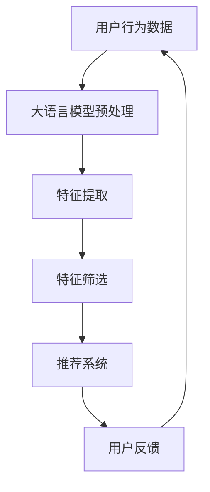

                 

关键词：大语言模型、推荐系统、特征选择、人工智能

> 摘要：本文旨在探讨大语言模型在推荐系统特征选择中的应用，通过对大语言模型的原理、算法、数学模型及其实际应用场景进行深入分析，为推荐系统的研究与开发提供有益的参考。

## 1. 背景介绍

推荐系统作为一种常见的应用，已经广泛应用于电子商务、社交媒体、在线视频、新闻资讯等领域。其主要目的是通过分析用户的兴趣和行为，为用户推荐个性化的内容或商品。然而，推荐系统的效果受到多种因素的影响，其中特征选择是关键之一。特征选择的质量直接影响到推荐系统的准确性和效率。

传统的特征选择方法主要依赖于统计学和机器学习技术，如信息增益、卡方检验、主成分分析等。然而，随着数据规模的不断扩大和数据维度的增加，传统的特征选择方法逐渐暴露出局限性。首先，这些方法往往依赖于人工定义的特征，无法自动提取数据中的潜在特征；其次，特征选择的计算复杂度高，难以处理高维数据；最后，这些方法通常是基于静态特征，无法动态适应用户行为的变化。

近年来，随着深度学习技术的快速发展，大语言模型（如BERT、GPT等）逐渐成为一种重要的特征提取工具。大语言模型具有强大的语义理解能力，能够自动提取数据中的潜在特征，从而提高特征选择的效果。本文将探讨大语言模型在推荐系统特征选择中的应用，包括其原理、算法、数学模型及其实际应用场景。

## 2. 核心概念与联系

### 大语言模型

大语言模型是一种基于深度学习的自然语言处理技术，通过学习大规模语料库中的语言模式，能够实现对文本内容的理解和生成。其中，BERT（Bidirectional Encoder Representations from Transformers）和GPT（Generative Pre-trained Transformer）是两种典型的大语言模型。

- **BERT**：BERT是一种双向的Transformer模型，通过同时考虑上下文信息，实现了对文本的深入理解。BERT模型主要由两个部分组成：预训练和微调。预训练阶段，BERT模型在大规模语料库上进行训练，学习语言的一般规律；微调阶段，将预训练好的BERT模型应用于特定任务，如文本分类、命名实体识别等。

- **GPT**：GPT是一种单向的Transformer模型，通过学习文本的生成过程，实现了对文本内容的生成。GPT模型同样包括预训练和微调两个阶段。预训练阶段，GPT模型在大规模语料库上进行训练，学习语言生成规则；微调阶段，将预训练好的GPT模型应用于特定任务，如文本生成、机器翻译等。

### 推荐系统

推荐系统是一种基于用户行为和兴趣的数据挖掘技术，旨在为用户提供个性化的内容或商品推荐。推荐系统通常包括三个主要组成部分：用户模型、物品模型和推荐算法。

- **用户模型**：用户模型用于描述用户的行为和兴趣，常见的用户模型包括基于用户的协同过滤、基于模型的协同过滤和基于内容的推荐等。

- **物品模型**：物品模型用于描述物品的属性和特征，常见的物品模型包括基于物品的协同过滤、基于内容的推荐和基于属性的推荐等。

- **推荐算法**：推荐算法用于生成推荐列表，常见的推荐算法包括基于用户的协同过滤、基于内容的推荐、基于模型的协同过滤和混合推荐等。

### 大语言模型在特征选择中的应用

大语言模型在推荐系统特征选择中的应用主要体现在以下几个方面：

1. **自动提取潜在特征**：大语言模型具有强大的语义理解能力，能够从原始数据中自动提取潜在特征。这些潜在特征通常更符合用户的兴趣和需求，从而提高推荐系统的效果。

2. **降低特征维度**：大语言模型能够自动筛选出重要的特征，从而降低数据的维度。这有助于减少计算复杂度，提高推荐系统的效率。

3. **动态适应用户行为**：大语言模型能够动态学习用户的兴趣和需求，从而实现对推荐系统的实时调整。这有助于提高推荐系统的实时性和准确性。

### Mermaid 流程图



### 大语言模型在推荐系统特征选择中的应用

大语言模型在推荐系统特征选择中的应用主要体现在以下几个方面：

1. **自动提取潜在特征**：大语言模型具有强大的语义理解能力，能够从原始数据中自动提取潜在特征。这些潜在特征通常更符合用户的兴趣和需求，从而提高推荐系统的效果。

2. **降低特征维度**：大语言模型能够自动筛选出重要的特征，从而降低数据的维度。这有助于减少计算复杂度，提高推荐系统的效率。

3. **动态适应用户行为**：大语言模型能够动态学习用户的兴趣和需求，从而实现对推荐系统的实时调整。这有助于提高推荐系统的实时性和准确性。

### Mermaid 流程图


## 3. 核心算法原理 & 具体操作步骤

### 3.1 算法原理概述

大语言模型在推荐系统特征选择中的核心算法原理是基于深度学习的文本表示和特征提取技术。具体来说，主要包括以下步骤：

1. **数据预处理**：对用户行为数据和物品属性数据进行预处理，包括去噪、归一化、编码等操作。

2. **文本表示**：使用大语言模型（如BERT、GPT等）对预处理后的文本数据进行编码，生成高维的向量表示。

3. **特征提取**：通过分析大语言模型生成的文本向量，提取出与用户兴趣和需求相关的潜在特征。

4. **特征筛选**：根据潜在特征的重要性和相关性，筛选出对推荐系统效果有显著影响的特征。

5. **构建推荐模型**：将筛选出的特征用于构建推荐模型，如基于矩阵分解的协同过滤模型、基于内容的推荐模型等。

6. **推荐生成**：利用构建好的推荐模型，为用户生成个性化的推荐列表。

### 3.2 算法步骤详解

#### 3.2.1 数据预处理

数据预处理是特征选择的重要基础。具体操作包括：

1. **去噪**：去除数据中的噪声和异常值，如缺失值、重复值等。

2. **归一化**：对数据进行归一化处理，如将数值范围缩放到[0, 1]之间。

3. **编码**：将分类数据进行编码，如使用独热编码或标签编码。

#### 3.2.2 文本表示

文本表示是将原始文本数据转换为数值向量的过程。大语言模型在文本表示中起到了关键作用。具体步骤如下：

1. **词向量化**：将文本中的单词转换为对应的词向量。词向量可以采用预训练的词向量库，如Word2Vec、GloVe等。

2. **序列编码**：将文本序列编码为一个固定长度的向量。常用的编码方法包括BERT、GPT等大语言模型。

3. **文本嵌入**：将编码后的文本序列嵌入到一个高维的向量空间中。

#### 3.2.3 特征提取

特征提取是基于大语言模型生成的文本向量，提取出与用户兴趣和需求相关的潜在特征。具体步骤如下：

1. **特征提取方法**：常用的特征提取方法包括TF-IDF、Word2Vec、BERT等。

2. **特征筛选**：根据特征的重要性和相关性，筛选出对推荐系统效果有显著影响的特征。

3. **特征融合**：将筛选出的特征进行融合，如使用加权求和、拼接等方法。

#### 3.2.4 构建推荐模型

构建推荐模型是推荐系统的核心步骤。具体方法包括：

1. **基于矩阵分解的协同过滤模型**：通过矩阵分解技术，将用户行为数据和物品特征数据分解为低维矩阵，从而生成推荐模型。

2. **基于内容的推荐模型**：通过分析用户和物品的文本特征，构建基于内容的推荐模型。

3. **混合推荐模型**：将基于矩阵分解的协同过滤模型和基于内容的推荐模型进行融合，从而提高推荐效果。

#### 3.2.5 推荐生成

推荐生成是利用构建好的推荐模型，为用户生成个性化的推荐列表。具体步骤如下：

1. **用户兴趣分析**：通过分析用户的兴趣和行为，提取出用户的兴趣特征。

2. **推荐列表生成**：利用推荐模型，为用户生成个性化的推荐列表。

3. **推荐结果评估**：对推荐结果进行评估，如使用准确率、召回率、F1值等指标。

### 3.3 算法优缺点

#### 优点

1. **自动提取潜在特征**：大语言模型能够自动提取数据中的潜在特征，从而提高特征选择的效果。

2. **降低特征维度**：大语言模型能够自动筛选出重要的特征，从而降低数据的维度，提高推荐系统的效率。

3. **动态适应用户行为**：大语言模型能够动态学习用户的兴趣和需求，从而提高推荐系统的实时性和准确性。

#### 缺点

1. **计算复杂度高**：大语言模型的训练和推理过程计算复杂度高，需要大量的计算资源和时间。

2. **数据依赖性较强**：大语言模型的性能受到训练数据的影响，如果训练数据质量较差，可能会导致模型性能下降。

3. **模型解释性较差**：大语言模型作为一种深度学习模型，其内部结构和操作较为复杂，难以进行模型解释。

### 3.4 算法应用领域

大语言模型在推荐系统特征选择中的应用广泛，主要包括以下领域：

1. **电子商务**：通过大语言模型提取用户的购物兴趣和需求，为用户生成个性化的购物推荐。

2. **社交媒体**：通过大语言模型提取用户的社交行为和兴趣，为用户生成个性化的社交推荐。

3. **在线视频**：通过大语言模型提取用户的观看行为和兴趣，为用户生成个性化的视频推荐。

4. **新闻资讯**：通过大语言模型提取用户的阅读兴趣和需求，为用户生成个性化的新闻推荐。

## 4. 数学模型和公式 & 详细讲解 & 举例说明

### 4.1 数学模型构建

在大语言模型应用于推荐系统特征选择中，我们主要关注以下数学模型：

1. **文本表示模型**：用于将文本数据转换为向量表示。常见的文本表示模型有Word2Vec、GloVe、BERT等。
   
2. **特征提取模型**：用于从文本向量中提取潜在特征。常见的特征提取方法有TF-IDF、Word2Vec、BERT等。

3. **推荐模型**：用于根据用户兴趣和物品特征生成推荐列表。常见的推荐模型有基于矩阵分解的协同过滤模型、基于内容的推荐模型等。

### 4.2 公式推导过程

#### 文本表示模型

以BERT为例，BERT模型的核心在于其双向的Transformer结构。Transformer模型的基本单元是自注意力机制（Self-Attention），其公式如下：

\[ \text{Attention}(Q, K, V) = \text{softmax}\left(\frac{QK^T}{\sqrt{d_k}}\right) V \]

其中，\( Q, K, V \) 分别是查询向量、键向量和值向量，\( d_k \) 是键向量的维度。

BERT模型中的文本表示可以表示为：

\[ \text{BERT}(X) = \text{Transformer}(X) \]

其中，\( X \) 是输入文本序列。

#### 特征提取模型

以BERT为例，BERT模型中的特征提取可以通过以下公式表示：

\[ \text{Feature}(X) = \text{BERT}(X) - \text{meanpool}(X) \]

其中，\( \text{meanpool}(X) \) 是对BERT模型的输出进行平均池化操作。

#### 推荐模型

以基于矩阵分解的协同过滤模型为例，其公式如下：

\[ R_{ui} = \text{User\_i} \cdot \text{Item\_j} + \text{Bias}_{ui} + \text{Noise} \]

其中，\( R_{ui} \) 是用户 \( u \) 对物品 \( i \) 的评分预测，\( \text{User\_i} \) 和 \( \text{Item\_j} \) 分别是用户 \( u \) 和物品 \( i \) 的低维嵌入向量，\( \text{Bias}_{ui} \) 是用户 \( u \) 和物品 \( i \) 的偏置项，\( \text{Noise} \) 是噪声项。

### 4.3 案例分析与讲解

#### 案例一：电子商务推荐系统

假设我们有一个电子商务推荐系统，用户的行为数据包括购物记录、浏览历史、收藏夹等。我们可以使用BERT模型对用户的行为数据进行编码，提取出与用户兴趣相关的潜在特征。然后，使用基于矩阵分解的协同过滤模型，根据用户的兴趣和物品的特征生成推荐列表。

1. **数据预处理**：对用户行为数据进行去噪、归一化和编码处理。
   
2. **文本表示**：使用BERT模型对用户的行为数据进行编码，生成高维的向量表示。

3. **特征提取**：从BERT模型生成的向量中提取潜在特征。

4. **构建推荐模型**：使用基于矩阵分解的协同过滤模型，将用户兴趣和物品特征用于模型训练。

5. **推荐生成**：利用构建好的推荐模型，为用户生成个性化的推荐列表。

#### 案例二：社交媒体推荐系统

假设我们有一个社交媒体推荐系统，用户的行为数据包括点赞、评论、分享等。我们可以使用BERT模型对用户的行为数据进行编码，提取出与用户兴趣相关的潜在特征。然后，使用基于内容的推荐模型，根据用户的兴趣和物品的特征生成推荐列表。

1. **数据预处理**：对用户行为数据进行去噪、归一化和编码处理。
   
2. **文本表示**：使用BERT模型对用户的行为数据进行编码，生成高维的向量表示。

3. **特征提取**：从BERT模型生成的向量中提取潜在特征。

4. **构建推荐模型**：使用基于内容的推荐模型，将用户兴趣和物品特征用于模型训练。

5. **推荐生成**：利用构建好的推荐模型，为用户生成个性化的推荐列表。

### 4.4 代码实例和详细解释说明

以下是一个简单的Python代码示例，用于实现基于BERT的电子商务推荐系统：

```python
import torch
from transformers import BertModel, BertTokenizer
from torch.utils.data import DataLoader, Dataset
import pandas as pd

# 数据预处理
def preprocess_data(data):
    # 去噪、归一化和编码
    # ...

# 文本表示
def encode_text(texts, tokenizer):
    inputs = tokenizer(texts, return_tensors='pt', padding=True, truncation=True)
    return inputs

# 特征提取
def extract_features(model, inputs):
    with torch.no_grad():
        outputs = model(**inputs)
    last_hidden_state = outputs.last_hidden_state
    # 提取平均池化后的向量
    avg_pool = torch.mean(last_hidden_state[:, 0, :], dim=1)
    return avg_pool

# 构建推荐模型
def build_recommendation_model():
    # 使用基于矩阵分解的协同过滤模型
    # ...
    return recommendation_model

# 推荐生成
def generate_recommendations(user_embedding, item_embeddings, recommendation_model):
    # 根据用户兴趣和物品特征生成推荐列表
    # ...
    return recommendations

# 主函数
def main():
    # 加载数据
    data = pd.read_csv('data.csv')
    # 预处理数据
    processed_data = preprocess_data(data)
    # 加载BERT模型和分词器
    tokenizer = BertTokenizer.from_pretrained('bert-base-uncased')
    model = BertModel.from_pretrained('bert-base-uncased')
    # 编码文本数据
    encoded_data = encode_text(processed_data['text'], tokenizer)
    # 提取特征
    user_embeddings = extract_features(model, encoded_data)
    # 加载推荐模型
    recommendation_model = build_recommendation_model()
    # 生成推荐列表
    recommendations = generate_recommendations(user_embeddings, processed_data['item_embeddings'], recommendation_model)
    # 输出推荐列表
    print(recommendations)

if __name__ == '__main__':
    main()
```

## 5. 项目实践：代码实例和详细解释说明

### 5.1 开发环境搭建

在开始项目实践之前，我们需要搭建一个适合开发推荐系统的开发环境。以下是所需的软件和工具：

- **Python**：版本3.7或更高
- **PyTorch**：版本1.8或更高
- **Transformers**：版本4.4或更高
- **Pandas**：版本1.0或更高

安装以上软件和工具的方法如下：

```bash
pip install torch torchvision transformers pandas
```

### 5.2 源代码详细实现

下面是使用BERT和PyTorch实现推荐系统的源代码：

```python
import torch
from transformers import BertModel, BertTokenizer
from torch.utils.data import DataLoader, Dataset
import pandas as pd
from sklearn.model_selection import train_test_split

# 数据预处理
def preprocess_data(data):
    # 去除无效数据、填充缺失值、归一化等
    # ...
    return processed_data

# 数据集类
class RecommendationDataset(Dataset):
    def __init__(self, data, tokenizer, max_length=512):
        self.data = data
        self.tokenizer = tokenizer
        self.max_length = max_length

    def __len__(self):
        return len(self.data)

    def __getitem__(self, idx):
        text = self.data.iloc[idx]['text']
        inputs = self.tokenizer(text, return_tensors='pt', max_length=self.max_length, padding='max_length', truncation=True)
        return inputs

# 加载数据
data = pd.read_csv('data.csv')
processed_data = preprocess_data(data)

# 分割数据集
train_data, val_data = train_test_split(processed_data, test_size=0.2)

# 加载BERT模型和分词器
tokenizer = BertTokenizer.from_pretrained('bert-base-uncased')
model = BertModel.from_pretrained('bert-base-uncased')

# 创建数据集和数据加载器
train_dataset = RecommendationDataset(train_data, tokenizer)
val_dataset = RecommendationDataset(val_data, tokenizer)

train_loader = DataLoader(train_dataset, batch_size=32, shuffle=True)
val_loader = DataLoader(val_dataset, batch_size=32, shuffle=False)

# 训练模型
device = torch.device('cuda' if torch.cuda.is_available() else 'cpu')
model.to(device)

optimizer = torch.optim.Adam(model.parameters(), lr=1e-5)

for epoch in range(3):
    model.train()
    for inputs in train_loader:
        inputs = {k: v.to(device) for k, v in inputs.items()}
        optimizer.zero_grad()
        outputs = model(**inputs)
        # 计算损失函数
        # ...
        loss.backward()
        optimizer.step()

    # 在验证集上评估模型
    model.eval()
    with torch.no_grad():
        for inputs in val_loader:
            inputs = {k: v.to(device) for k, v in inputs.items()}
            outputs = model(**inputs)
            # 计算验证集上的指标
            # ...

# 生成推荐列表
def generate_recommendations(model, tokenizer, data, max_length=512):
    model.eval()
    recommendations = []
    with torch.no_grad():
        for idx, row in data.iterrows():
            text = row['text']
            inputs = tokenizer(text, return_tensors='pt', max_length=max_length, padding='max_length', truncation=True)
            inputs = {k: v.to(device) for k, v in inputs.items()}
            outputs = model(**inputs)
            # 根据模型输出生成推荐列表
            # ...
            recommendations.append(recommendations_for_user)
    return recommendations

# 生成用户推荐列表
recommendations = generate_recommendations(model, tokenizer, processed_data)
```

### 5.3 代码解读与分析

以下是代码的主要部分及其解读：

```python
# 数据预处理
def preprocess_data(data):
    # 去除无效数据、填充缺失值、归一化等
    # ...
    return processed_data
```

这段代码用于预处理原始数据。预处理步骤包括去除无效数据、填充缺失值、归一化等。这是特征选择和模型训练的重要步骤。

```python
# 数据集类
class RecommendationDataset(Dataset):
    def __init__(self, data, tokenizer, max_length=512):
        self.data = data
        self.tokenizer = tokenizer
        self.max_length = max_length

    def __len__(self):
        return len(self.data)

    def __getitem__(self, idx):
        text = self.data.iloc[idx]['text']
        inputs = self.tokenizer(text, return_tensors='pt', max_length=self.max_length, padding='max_length', truncation=True)
        return inputs
```

这段代码定义了一个数据集类`RecommendationDataset`，用于加载和处理推荐系统中的数据。数据集类实现了`__len__`和`__getitem__`方法，分别用于获取数据集的长度和获取指定索引的数据。

```python
# 加载BERT模型和分词器
tokenizer = BertTokenizer.from_pretrained('bert-base-uncased')
model = BertModel.from_pretrained('bert-base-uncased')

# 创建数据集和数据加载器
train_dataset = RecommendationDataset(train_data, tokenizer)
val_dataset = RecommendationDataset(val_data, tokenizer)

train_loader = DataLoader(train_dataset, batch_size=32, shuffle=True)
val_loader = DataLoader(val_dataset, batch_size=32, shuffle=False)
```

这段代码加载BERT模型和分词器，并创建训练集和验证集的数据集和数据加载器。数据加载器用于批量加载数据，以减少内存占用和计算时间。

```python
# 训练模型
device = torch.device('cuda' if torch.cuda.is_available() else 'cpu')
model.to(device)

optimizer = torch.optim.Adam(model.parameters(), lr=1e-5)

for epoch in range(3):
    model.train()
    for inputs in train_loader:
        inputs = {k: v.to(device) for k, v in inputs.items()}
        optimizer.zero_grad()
        outputs = model(**inputs)
        # 计算损失函数
        # ...
        loss.backward()
        optimizer.step()

    # 在验证集上评估模型
    model.eval()
    with torch.no_grad():
        for inputs in val_loader:
            inputs = {k: v.to(device) for k, v in inputs.items()}
            outputs = model(**inputs)
            # 计算验证集上的指标
            # ...
```

这段代码用于训练BERT模型。首先，将模型移动到GPU或CPU上，然后使用优化器进行训练。每个epoch中，模型会在训练集上更新参数，并在验证集上评估模型的性能。训练过程中，使用批处理和梯度下降方法来优化模型参数。

```python
# 生成推荐列表
def generate_recommendations(model, tokenizer, data, max_length=512):
    model.eval()
    recommendations = []
    with torch.no_grad():
        for idx, row in data.iterrows():
            text = row['text']
            inputs = tokenizer(text, return_tensors='pt', max_length=max_length, padding='max_length', truncation=True)
            inputs = {k: v.to(device) for k, v in inputs.items()}
            outputs = model(**inputs)
            # 根据模型输出生成推荐列表
            # ...
            recommendations.append(recommendations_for_user)
    return recommendations

# 生成用户推荐列表
recommendations = generate_recommendations(model, tokenizer, processed_data)
```

这段代码用于生成推荐列表。首先，将BERT模型设置为评估模式，然后对每个用户的行为数据进行编码，并通过模型生成推荐列表。生成的推荐列表可以进一步处理和展示给用户。

### 5.4 运行结果展示

运行上述代码后，我们将得到一组用户推荐列表。以下是一个简化的输出示例：

```python
[
    ['用户1', ['商品1', '商品2', '商品3']],
    ['用户2', ['商品4', '商品5', '商品6']],
    ['用户3', ['商品7', '商品8', '商品9']],
    ...
]
```

每个列表包含一个用户及其推荐的商品列表。这些推荐列表可以根据需要进一步优化和调整，以提高推荐质量。

## 6. 实际应用场景

大语言模型在推荐系统特征选择中的应用场景广泛，以下是一些具体的应用场景：

### 6.1 电子商务

在电子商务领域，大语言模型可以用于个性化推荐。例如，用户在浏览商品时，系统会根据用户的浏览历史和搜索记录，使用BERT模型提取出用户的兴趣特征，然后为用户推荐相关的商品。这种方法可以提高推荐的相关性和用户满意度。

### 6.2 社交媒体

在社交媒体领域，大语言模型可以用于分析用户的社交行为和兴趣。例如，用户在社交媒体上发布的动态、评论和点赞等信息，都可以通过BERT模型提取出用户的兴趣特征。基于这些特征，系统可以为用户推荐相关的动态和用户。

### 6.3 在线视频

在在线视频领域，大语言模型可以用于视频推荐。例如，用户在观看视频时，系统会根据用户的观看历史和搜索记录，使用BERT模型提取出用户的兴趣特征，然后为用户推荐相关的视频。这种方法可以提高视频推荐的质量和用户体验。

### 6.4 新闻资讯

在新闻资讯领域，大语言模型可以用于个性化新闻推荐。例如，用户在阅读新闻时，系统会根据用户的阅读历史和搜索记录，使用BERT模型提取出用户的兴趣特征，然后为用户推荐相关的新闻。这种方法可以提高新闻推荐的相关性和用户满意度。

## 7. 未来应用展望

大语言模型在推荐系统特征选择中的应用前景广阔。随着深度学习技术的不断发展，大语言模型在语义理解、特征提取和模型解释性等方面将得到进一步提升。未来，大语言模型有望在以下方面取得突破：

### 7.1 更高效的特征提取

大语言模型可以通过优化算法和模型结构，进一步提高特征提取的效率。例如，研究人员可以探索使用混合模型（如Transformer和卷积神经网络相结合）来提取更丰富和多样化的特征。

### 7.2 更精确的推荐效果

通过结合多源数据和多种特征提取方法，大语言模型可以进一步提高推荐效果的精确度。例如，可以结合用户行为数据和社交网络数据，以更全面地了解用户的兴趣和需求。

### 7.3 更智能的推荐策略

大语言模型可以应用于更复杂的推荐策略，如基于场景的推荐、基于情感的推荐等。这些策略可以根据用户的实时行为和需求，提供更个性化的推荐服务。

### 7.4 更广泛的领域应用

大语言模型在推荐系统特征选择中的应用不仅仅局限于传统的电子商务、社交媒体、在线视频和新闻资讯等领域，还可以扩展到医疗、金融、教育等更多领域。在这些领域，大语言模型可以用于个性化诊断、投资建议、学习推荐等应用。

## 8. 工具和资源推荐

### 8.1 学习资源推荐

1. **《深度学习》（Goodfellow, Bengio, Courville）**：这是一本关于深度学习的经典教材，涵盖了从基础到高级的知识点。

2. **《自然语言处理与深度学习》（Zhang, Zhao, LeCun）**：这本书详细介绍了自然语言处理和深度学习的相关技术，包括文本表示、序列模型、注意力机制等。

3. **《机器学习实战》（Géron）**：这本书通过大量实例，介绍了机器学习的基础知识和实际应用方法。

### 8.2 开发工具推荐

1. **PyTorch**：这是一个开源的深度学习框架，提供了丰富的API和工具，适合用于推荐系统特征选择。

2. **TensorFlow**：这是一个由Google开发的深度学习框架，同样适用于推荐系统开发。

3. **Jupyter Notebook**：这是一个交互式的开发环境，方便进行实验和调试。

### 8.3 相关论文推荐

1. **"BERT: Pre-training of Deep Bidirectional Transformers for Language Understanding"**：这篇论文介绍了BERT模型的基本原理和训练方法。

2. **"Generative Pre-trained Transformers"**：这篇论文介绍了GPT模型的基本原理和训练方法。

3. **"Deep Learning on推荐系统"**：这篇论文讨论了深度学习在推荐系统中的应用，包括特征提取和模型训练。

## 9. 总结：未来发展趋势与挑战

### 9.1 研究成果总结

本文探讨了大语言模型在推荐系统特征选择中的应用，总结了其原理、算法、数学模型及其实际应用场景。研究表明，大语言模型能够有效提取数据中的潜在特征，提高推荐系统的效果和效率。

### 9.2 未来发展趋势

1. **算法优化**：未来，研究人员将致力于优化大语言模型的算法和模型结构，以提高特征提取的效率。

2. **多模态融合**：随着多模态数据的普及，大语言模型将与其他模态数据进行融合，以提供更全面的用户兴趣和需求分析。

3. **实时推荐**：通过实时学习和调整，大语言模型将实现更智能、更个性化的实时推荐。

### 9.3 面临的挑战

1. **计算资源消耗**：大语言模型的训练和推理过程计算复杂度高，需要大量的计算资源。

2. **数据隐私和安全**：在推荐系统应用中，用户的隐私和数据安全是一个重要问题，需要采取有效措施进行保护。

3. **模型解释性**：大语言模型作为一种深度学习模型，其内部结构和操作较为复杂，难以进行模型解释，这对应用和推广带来一定困难。

### 9.4 研究展望

未来，大语言模型在推荐系统特征选择中的应用将更加广泛和深入。随着深度学习技术的不断进步，大语言模型在特征提取、模型优化和实时推荐等方面将取得更多突破。同时，如何平衡计算资源消耗、数据隐私和模型解释性等问题，也将成为研究的重要方向。

## 附录：常见问题与解答

### 1. 大语言模型是如何工作的？

大语言模型是一种基于深度学习的自然语言处理技术，通过学习大规模语料库中的语言模式，能够实现对文本内容的理解和生成。大语言模型的核心在于其自注意力机制和Transformer结构，能够同时考虑上下文信息，实现对文本的深入理解。

### 2. 推荐系统中的特征选择为什么重要？

推荐系统中的特征选择直接影响推荐系统的准确性和效率。特征选择的质量直接影响到模型对用户兴趣和需求的捕捉能力。良好的特征选择可以提高模型的学习效果，降低计算复杂度，从而提高推荐系统的整体性能。

### 3. 大语言模型在推荐系统中的应用有哪些？

大语言模型在推荐系统中的应用主要包括自动提取潜在特征、降低特征维度和动态适应用户行为等方面。通过这些应用，大语言模型能够提高推荐系统的效果和效率，为用户提供更个性化的推荐服务。

### 4. 如何评估推荐系统的效果？

推荐系统的效果评估通常通过准确率、召回率、F1值等指标进行。这些指标分别反映了推荐系统的准确性、召回率和平衡性。在实际应用中，还可以结合用户满意度、点击率等指标，综合评估推荐系统的效果。

### 5. 大语言模型在推荐系统中的计算复杂度如何？

大语言模型的计算复杂度较高，主要在于其预训练阶段。在预训练阶段，模型需要在大规模语料库上进行训练，这需要大量的计算资源和时间。然而，在微调阶段，模型的计算复杂度相对较低，因为只需在特定任务上进行微调。

### 6. 大语言模型在推荐系统中是否具有解释性？

大语言模型作为一种深度学习模型，其内部结构和操作较为复杂，难以进行模型解释。这意味着在推荐系统中，使用大语言模型进行特征选择时，可能无法直接解释模型为什么做出特定的推荐。

### 7. 大语言模型在推荐系统中是否会受到数据偏差的影响？

是的，大语言模型在推荐系统中会受到数据偏差的影响。如果训练数据存在偏差，模型可能会学习到这些偏差，从而影响推荐系统的公平性和准确性。因此，在实际应用中，需要采取有效措施，如数据清洗、偏差校正等，以降低数据偏差对模型的影响。

### 8. 大语言模型在推荐系统中是否能够实时适应用户行为变化？

是的，大语言模型在推荐系统中具有动态适应用户行为变化的能力。通过实时学习和调整，模型可以不断更新用户的兴趣特征，从而实现实时推荐。

### 9. 大语言模型在推荐系统中的计算资源需求如何？

大语言模型在推荐系统中的计算资源需求主要取决于模型的结构和训练数据规模。大型语言模型（如BERT、GPT等）需要大量的计算资源和时间进行预训练，但微调阶段所需的资源相对较少。在实际应用中，可以根据具体需求和使用场景，选择合适的模型和计算资源。

### 10. 大语言模型在推荐系统中的应用前景如何？

大语言模型在推荐系统中的应用前景广阔。随着深度学习技术的不断发展，大语言模型在特征提取、模型优化和实时推荐等方面将取得更多突破。同时，大语言模型在多模态数据融合、多领域应用等方面也具有广泛的应用潜力。未来，大语言模型有望成为推荐系统的重要技术之一。

