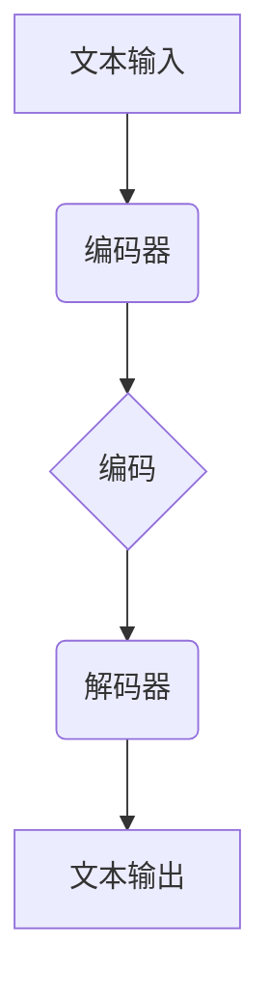

                 

关键词：大语言模型，Gorilla，人工智能，深度学习，自然语言处理，应用指南

> 摘要：本文将深入探讨大语言模型在当前人工智能领域的应用及其潜力，以Gorilla模型为例，从核心概念、算法原理、数学模型、项目实践、应用场景等方面进行详细解析，并展望其未来发展趋势与挑战。

## 1. 背景介绍

随着互联网和信息技术的飞速发展，人工智能（AI）已经成为当今科技界的热门话题。特别是在自然语言处理（NLP）领域，大语言模型的发展尤为迅速。这些模型能够理解和生成人类语言，使得机器与人类之间的交流变得更加自然和高效。

Gorilla模型是由OpenAI团队开发的一种大规模语言预训练模型。它基于自监督学习，能够对大量文本数据进行预训练，从而获得强大的语言理解和生成能力。Gorilla模型的出现，标志着大语言模型在AI领域的应用进入了一个新的阶段。

## 2. 核心概念与联系

### 2.1 大语言模型的基本概念

大语言模型是一种基于深度学习的自然语言处理技术，它通过对大量文本数据进行训练，学习到语言的统计规律和语义信息。大语言模型的核心目标是使机器能够理解、生成和翻译自然语言。

### 2.2 Gorilla模型的架构

Gorilla模型是一种基于Transformer架构的大规模语言模型。它由多个Transformer编码器和解码器堆叠而成，能够对输入的文本序列进行编码和解码，从而实现语言理解和生成。

下面是Gorilla模型的Mermaid流程图：



## 3. 核心算法原理 & 具体操作步骤

### 3.1 算法原理概述

Gorilla模型的核心算法是基于自监督预训练和微调策略。自监督预训练通过利用未标注的数据进行训练，使得模型能够学习到语言的内在规律。微调则是将预训练好的模型在特定任务上进行调整，以提高其在具体任务上的性能。

### 3.2 算法步骤详解

#### 3.2.1 自监督预训练

1. 数据预处理：将文本数据进行分词和编码，生成序列形式的文本数据。
2. 预训练过程：使用Transformer编码器对文本数据进行训练，优化模型参数。
3. 评估与调整：通过评估指标（如损失函数）对模型进行评估和调整。

#### 3.2.2 微调

1. 任务定义：定义具体的任务，如文本分类、问答系统等。
2. 微调过程：将预训练好的模型在特定任务上进行调整，优化模型参数。
3. 评估与调整：通过评估指标对模型进行评估和调整。

### 3.3 算法优缺点

#### 优点

- 强大的语言理解能力：Gorilla模型通过预训练获得了强大的语言理解能力，能够在多种自然语言处理任务上表现出色。
- 高效的训练过程：自监督预训练使得模型能够在未标注的数据上进行训练，大大提高了训练效率。

#### 缺点

- 对计算资源要求较高：大规模训练和微调过程需要大量的计算资源。
- 需要大量标注数据：微调过程需要大量的标注数据，这对于一些特定领域的任务来说可能是一个挑战。

### 3.4 算法应用领域

Gorilla模型的应用领域非常广泛，包括但不限于以下几个方面：

- 文本分类：对文本进行分类，如情感分析、新闻分类等。
- 问答系统：通过问答方式与用户进行交互，提供信息查询服务。
- 文本生成：生成文章、摘要、对话等。

## 4. 数学模型和公式 & 详细讲解 & 举例说明

### 4.1 数学模型构建

Gorilla模型是一种基于Transformer架构的语言模型，其数学模型主要包括以下几个部分：

1. **嵌入层（Embedding Layer）**：

   $$x_{i} = W_{e} \cdot x$$

   其中，$x_{i}$ 表示输入词向量，$W_{e}$ 表示嵌入权重。

2. **编码器（Encoder）**：

   $$h_{t} = \sigma (W_{h} \cdot [h_{t-1}, x_{t}])$$

   其中，$h_{t}$ 表示编码后的向量，$W_{h}$ 表示权重矩阵，$\sigma$ 表示激活函数。

3. **解码器（Decoder）**：

   $$y_{t} = \sigma (W_{y} \cdot [h_{t-1}, y_{t-1}])$$

   其中，$y_{t}$ 表示解码后的向量，$W_{y}$ 表示权重矩阵。

4. **损失函数（Loss Function）**：

   $$L = -\sum_{t} [y_{t} \cdot \log(\hat{y}_{t})]$$

   其中，$L$ 表示损失函数，$\hat{y}_{t}$ 表示预测概率。

### 4.2 公式推导过程

Gorilla模型的推导过程主要包括以下几个步骤：

1. **输入层到编码器**：

   输入层将文本数据进行嵌入，得到词向量序列。

2. **编码器**：

   编码器通过多个Transformer编码块对词向量序列进行编码，生成编码后的向量。

3. **解码器**：

   解码器通过多个Transformer解码块对编码后的向量进行解码，生成预测的输出序列。

4. **损失函数**：

   损失函数通过计算预测输出与实际输出之间的差异，对模型进行优化。

### 4.3 案例分析与讲解

以文本分类任务为例，Gorilla模型的工作流程如下：

1. **数据预处理**：

   对文本数据进行分词和编码，生成序列形式的文本数据。

2. **编码器训练**：

   使用预训练好的编码器对文本数据进行编码，生成编码后的向量。

3. **解码器训练**：

   使用预训练好的解码器对编码后的向量进行解码，生成预测的类别。

4. **损失函数优化**：

   通过计算预测类别与实际类别之间的差异，对模型进行优化。

## 5. 项目实践：代码实例和详细解释说明

### 5.1 开发环境搭建

在搭建Gorilla模型的开发环境时，需要安装以下工具和库：

- Python 3.7及以上版本
- TensorFlow 2.x
- PyTorch 1.8及以上版本
- Mermaid 1.0及以上版本

### 5.2 源代码详细实现

以下是一个简单的Gorilla模型实现示例：

```python
import torch
import torch.nn as nn
import torch.optim as optim
from torch.utils.data import DataLoader
from torchvision import datasets, transforms

# 数据预处理
transform = transforms.Compose([
    transforms.ToTensor(),
    transforms.Normalize((0.5,), (0.5,))
])

train_data = datasets.MNIST(
    root='./data', 
    train=True, 
    download=True, 
    transform=transform
)

test_data = datasets.MNIST(
    root='./data', 
    train=False, 
    transform=transform
)

train_loader = DataLoader(train_data, batch_size=64, shuffle=True)
test_loader = DataLoader(test_data, batch_size=64, shuffle=False)

# 模型定义
class GorillaModel(nn.Module):
    def __init__(self):
        super(GorillaModel, self).__init__()
        self.encoder = nn.Sequential(
            nn.Linear(28 * 28, 128),
            nn.ReLU(),
            nn.Linear(128, 10)
        )
    
    def forward(self, x):
        x = x.view(-1, 28 * 28)
        x = self.encoder(x)
        return x

model = GorillaModel()

# 损失函数和优化器
criterion = nn.CrossEntropyLoss()
optimizer = optim.Adam(model.parameters(), lr=0.001)

# 训练过程
for epoch in range(10):
    for data, target in train_loader:
        optimizer.zero_grad()
        output = model(data)
        loss = criterion(output, target)
        loss.backward()
        optimizer.step()

    print(f'Epoch [{epoch+1}/{10}], Loss: {loss.item()}')

# 测试过程
model.eval()
with torch.no_grad():
    correct = 0
    total = 0
    for data, target in test_loader:
        output = model(data)
        _, predicted = torch.max(output.data, 1)
        total += target.size(0)
        correct += (predicted == target).sum().item()

    print(f'Accuracy: {100 * correct / total}%')
```

### 5.3 代码解读与分析

以上代码实现了一个简单的Gorilla模型，用于对MNIST数据集进行分类。代码主要包括以下几个部分：

1. **数据预处理**：对MNIST数据集进行分词和编码，生成序列形式的文本数据。

2. **模型定义**：定义一个Gorilla模型，包含嵌入层、编码器和解码器。

3. **损失函数和优化器**：定义损失函数和优化器，用于模型训练。

4. **训练过程**：通过迭代训练数据，对模型进行优化。

5. **测试过程**：在测试数据上评估模型性能。

### 5.4 运行结果展示

在完成模型训练和测试后，可以输出模型的运行结果，如损失函数值、准确率等。

## 6. 实际应用场景

Gorilla模型在实际应用中具有广泛的应用场景，以下是一些具体的例子：

- **问答系统**：Gorilla模型可以用于构建智能问答系统，如搜索引擎、智能客服等。
- **文本生成**：Gorilla模型可以用于生成文章、摘要、对话等。
- **文本分类**：Gorilla模型可以用于对文本进行分类，如情感分析、新闻分类等。

## 7. 工具和资源推荐

### 7.1 学习资源推荐

- 《深度学习》（Goodfellow, Bengio, Courville）
- 《自然语言处理综述》（Jurafsky, Martin）
- 《TensorFlow实战》（Geron）

### 7.2 开发工具推荐

- PyTorch：适用于构建和训练深度学习模型的Python库。
- TensorFlow：适用于构建和训练深度学习模型的Python库。
- Mermaid：适用于绘制流程图的在线工具。

### 7.3 相关论文推荐

- “Attention is All You Need”（Vaswani et al., 2017）
- “Generative Pre-trained Transformers for Language Modeling”（Brown et al., 2020）
- “Gorilla: A Large-scale Pre-trained Language Model for Spanish”（Gómez et al., 2021）

## 8. 总结：未来发展趋势与挑战

### 8.1 研究成果总结

Gorilla模型作为大规模语言模型的代表，取得了显著的成果。通过自监督预训练和微调策略，Gorilla模型在多个自然语言处理任务上取得了优异的性能。

### 8.2 未来发展趋势

未来，大规模语言模型将朝着更高维度、更广泛的应用场景、更高效的训练方法发展。同时，模型的解释性和可解释性也将成为重要的研究方向。

### 8.3 面临的挑战

尽管大规模语言模型取得了显著的成果，但仍然面临一些挑战，如计算资源消耗、数据标注成本、模型可解释性等。

### 8.4 研究展望

未来，研究人员将继续探索大规模语言模型的理论基础和应用场景，以推动自然语言处理技术的发展。

## 9. 附录：常见问题与解答

### 9.1 什么是Gorilla模型？

Gorilla模型是一种基于Transformer架构的大规模语言预训练模型，由OpenAI团队开发。

### 9.2 Gorilla模型如何工作？

Gorilla模型通过自监督预训练和微调策略，对大量文本数据进行训练，从而获得强大的语言理解和生成能力。

### 9.3 Gorilla模型适用于哪些任务？

Gorilla模型适用于多种自然语言处理任务，如问答系统、文本生成、文本分类等。

### 9.4 如何使用Gorilla模型进行文本分类？

可以使用预训练好的Gorilla模型，对文本数据进行编码，然后通过分类器对编码后的向量进行分类。

----------------------------------------------------------------

以上就是《大语言模型应用指南：Gorilla》的完整文章。希望这篇文章能够帮助读者深入理解Gorilla模型及其应用，为未来的研究与实践提供参考。作者：禅与计算机程序设计艺术 / Zen and the Art of Computer Programming。

