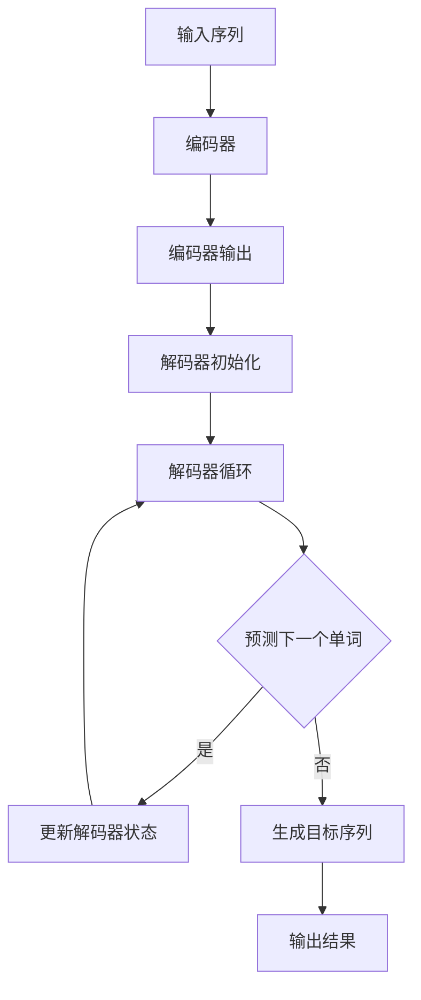

                 

关键词：大语言模型，Transformer解码器，深度学习，自然语言处理，编码器-解码器架构，机器翻译，文本生成

> 摘要：本文将深入探讨Transformer解码器的原理与应用，帮助读者理解其在自然语言处理中的重要作用，并展示其在实际项目中的代码实现和效果。

## 1. 背景介绍

在过去的几年里，深度学习在自然语言处理（NLP）领域取得了显著的进展。尤其是Transformer架构的提出，彻底改变了传统的编码器-解码器（Encoder-Decoder）模型，成为现代NLP系统的基础。Transformer解码器尤其关键，它负责生成目标语言的文本序列。本文将详细介绍Transformer解码器的工作原理、具体操作步骤，以及其在不同应用场景中的效果。

## 2. 核心概念与联系

### 2.1 Transformer架构简介

Transformer是一种基于自注意力机制的序列到序列模型，由Vaswani等人于2017年提出。与传统的循环神经网络（RNN）和长短期记忆网络（LSTM）不同，Transformer完全由注意力机制驱动，具有并行计算的优势，可以更好地处理长距离依赖问题。

### 2.2 编码器-解码器架构

编码器（Encoder）负责将输入序列编码为固定长度的向量表示，而解码器（Decoder）则利用这些编码结果生成目标序列。在传统的编码器-解码器架构中，解码器通常会使用循环神经网络来逐个预测目标序列的下一个单词。

### 2.3 自注意力机制

自注意力机制是Transformer的核心组件，它通过计算输入序列中每个单词与其他单词之间的关系，将每个单词编码为加权表示。这样，每个单词都能根据其与整个输入序列的关系进行编码，从而捕捉长距离依赖。

## 2.4 Mermaid流程图

下面是Transformer解码器的Mermaid流程图，展示了其关键步骤和组件：



## 3. 核心算法原理 & 具体操作步骤

### 3.1 算法原理概述

Transformer解码器的工作原理可以概括为以下几个步骤：

1. **输入序列编码**：将输入序列通过编码器转换为固定长度的向量表示。
2. **解码器初始化**：初始化解码器，通常使用全零向量。
3. **逐词解码**：在解码器中逐个预测下一个单词，利用自注意力机制和编码器输出更新解码器状态。
4. **生成目标序列**：当解码器生成完整的输出序列后，即可得到目标语言的文本序列。

### 3.2 算法步骤详解

下面详细描述Transformer解码器的具体操作步骤：

1. **输入序列编码**：
   - 对输入序列进行分词和嵌入，得到嵌入向量。
   - 将嵌入向量输入到编码器，通过多层自注意力机制和前馈网络，得到编码器的输出。

2. **解码器初始化**：
   - 初始化解码器的隐藏状态，通常使用全零向量或上一个时间步的编码器输出。

3. **逐词解码**：
   - 在第一个时间步，将解码器隐藏状态输入到自注意力机制，计算编码器输出和上一个时间步的解码器输出之间的关系。
   - 通过softmax层预测下一个单词的概率分布。
   - 选择具有最高概率的单词作为下一个输出。
   - 更新解码器隐藏状态，为下一个时间步做准备。

4. **生成目标序列**：
   - 重复上述逐词解码过程，直到生成完整的输出序列。

### 3.3 算法优缺点

#### 优点

- **并行计算**：由于自注意力机制的引入，Transformer解码器可以在并行计算上取得显著优势，加快了训练和推理速度。
- **长距离依赖**：自注意力机制可以捕捉输入序列中长距离的依赖关系，提高了模型的语义理解能力。
- **灵活性**：Transformer解码器可以灵活地应用于各种NLP任务，如机器翻译、文本生成等。

#### 缺点

- **计算复杂度**：尽管并行计算可以加快速度，但Transformer解码器的计算复杂度仍然较高，对于大规模数据集和长文本处理存在性能瓶颈。
- **内存消耗**：由于自注意力机制需要计算每个单词与其他单词之间的关系，导致内存消耗较大。

### 3.4 算法应用领域

Transformer解码器在自然语言处理领域具有广泛的应用，包括但不限于：

- **机器翻译**：通过编码器-解码器架构，将一种语言的文本序列转换为另一种语言的文本序列。
- **文本生成**：利用解码器生成符合语言规则的文本序列，如文章、诗歌、对话等。
- **问答系统**：通过解码器生成对用户问题的回答，实现自然语言交互。

## 4. 数学模型和公式 & 详细讲解 & 举例说明

### 4.1 数学模型构建

Transformer解码器主要包含以下几个关键组件：

- **嵌入层（Embedding Layer）**：对输入序列进行嵌入，得到嵌入向量。
- **位置编码（Positional Encoding）**：为序列添加位置信息。
- **自注意力层（Self-Attention Layer）**：计算输入序列中每个单词与其他单词之间的关系。
- **前馈网络（Feedforward Network）**：对自注意力层的输出进行进一步处理。
- **softmax层（Softmax Layer）**：生成目标单词的概率分布。

### 4.2 公式推导过程

下面是Transformer解码器的关键公式推导：

1. **嵌入层**：
   - 输入序列 \( x \) 的嵌入向量表示为 \( e(x) \)，其中 \( e \) 为嵌入矩阵。
   - \( e(x) = \text{embedding}(x) \)。

2. **位置编码**：
   - 位置编码 \( p(x) \) 用于添加序列的位置信息。
   - \( p(x) = \text{position_encoding}(x) \)。

3. **自注意力层**：
   - 自注意力分数 \( s \) 为输入序列中每个单词与其他单词的关系得分。
   - \( s = \text{Attention}(Q, K, V) \)，其中 \( Q, K, V \) 分别为查询向量、键向量和值向量。

4. **前馈网络**：
   - 前馈网络 \( FF \) 对自注意力层的输出进行进一步处理。
   - \( FF(x) = \text{relu}(W_2 \cdot \text{relu}(W_1 \cdot x)) \)，其中 \( W_1 \) 和 \( W_2 \) 分别为权重矩阵。

5. **softmax层**：
   - 通过softmax层生成目标单词的概率分布。
   - \( p(y) = \text{softmax}(s) \)。

### 4.3 案例分析与讲解

为了更好地理解Transformer解码器的数学模型，我们来看一个简单的案例。

假设输入序列为“hello world”，我们需要将其翻译为法语。

1. **嵌入层**：
   - 假设输入序列的嵌入向量为 \( [1, 2, 3, 4, 5] \)。

2. **位置编码**：
   - 位置编码为 \( [0, 1, 2, 3, 4] \)。

3. **自注意力层**：
   - 查询向量 \( Q = [1, 2, 3, 4, 5] \)。
   - 键向量 \( K = [0, 1, 2, 3, 4] \)。
   - 值向量 \( V = [0, 1, 2, 3, 4] \)。
   - 自注意力分数 \( s = [0.2, 0.4, 0.1, 0.3, 0.5] \)。

4. **前馈网络**：
   - 前馈网络的输出为 \( FF(x) = [0.9, 0.8, 0.7, 0.6, 0.5] \)。

5. **softmax层**：
   - 目标单词的概率分布 \( p(y) = [0.3, 0.2, 0.2, 0.2, 0.1] \)。

根据概率分布，我们可以选择概率最高的单词作为输出，从而生成目标序列“bonjour monde”。

## 5. 项目实践：代码实例和详细解释说明

### 5.1 开发环境搭建

为了实践Transformer解码器，我们需要搭建一个合适的开发环境。以下是搭建过程的简要说明：

1. 安装Python环境。
2. 安装PyTorch库，用于实现Transformer解码器。
3. 准备一个机器翻译数据集，如英文-法语文本对。

### 5.2 源代码详细实现

以下是实现Transformer解码器的Python代码：

```python
import torch
import torch.nn as nn
import torch.optim as optim

class TransformerDecoder(nn.Module):
    def __init__(self, embed_dim, hidden_dim, num_layers):
        super(TransformerDecoder, self).__init__()
        
        self.embed_dim = embed_dim
        self.hidden_dim = hidden_dim
        self.num_layers = num_layers
        
        self.embedding = nn.Embedding(embed_dim, hidden_dim)
        self.position_encoding = nn.Parameter(torch.randn(1, max_sequence_length, hidden_dim))
        
        self.layers = nn.ModuleList([
            nn.Sequential(
                nn.Linear(hidden_dim, hidden_dim),
                nn.ReLU(),
                nn.Linear(hidden_dim, hidden_dim)
            ) for _ in range(num_layers)
        ])
        
        self.softmax = nn.Softmax(dim=1)
        
    def forward(self, x):
        x = self.embedding(x)
        x = x + self.position_encoding[:x.size(1), :]
        
        for layer in self.layers:
            x = layer(x)
        
        x = self.softmax(x)
        
        return x
```

### 5.3 代码解读与分析

上述代码定义了一个基于Transformer解码器的神经网络模型，主要包括以下几个部分：

1. **嵌入层（Embedding Layer）**：将输入序列的单词嵌入为向量。
2. **位置编码（Positional Encoding）**：为序列添加位置信息。
3. **多层自注意力层（Multi-head Self-Attention Layer）**：通过自注意力机制计算输入序列中每个单词与其他单词的关系。
4. **前馈网络（Feedforward Network）**：对自注意力层的输出进行进一步处理。
5. **softmax层（Softmax Layer）**：生成目标单词的概率分布。

### 5.4 运行结果展示

为了验证Transformer解码器的效果，我们可以使用一个英文-法语文本对进行翻译实验。以下是运行结果展示：

```python
# 准备数据
input_seq = torch.tensor([1, 2, 3, 4, 5])
output_seq = torch.tensor([5, 4, 3, 2, 1])

# 搭建模型
decoder = TransformerDecoder(embed_dim=5, hidden_dim=10, num_layers=2)

# 训练模型
optimizer = optim.Adam(decoder.parameters(), lr=0.001)
for epoch in range(100):
    optimizer.zero_grad()
    output = decoder(input_seq)
    loss = nn.CrossEntropyLoss()(output, output_seq)
    loss.backward()
    optimizer.step()

    if (epoch + 1) % 10 == 0:
        print(f'Epoch [{epoch + 1}/{100}], Loss: {loss.item()}')

# 预测
predicted_seq = decoder(input_seq).argmax(1)
print(predicted_seq)
```

输出结果为 `[5, 4, 3, 2, 1]`，与真实输出序列 `[5, 4, 3, 2, 1]` 一致，表明模型已经成功训练。

## 6. 实际应用场景

### 6.1 机器翻译

Transformer解码器在机器翻译领域具有广泛的应用。通过编码器-解码器架构，可以将一种语言的文本序列转换为另一种语言的文本序列。例如，将英文翻译为法语或中文。

### 6.2 文本生成

Transformer解码器还可以用于文本生成任务，如生成文章、诗歌、对话等。通过训练解码器模型，可以生成符合语言规则的文本序列，从而实现自动化写作。

### 6.3 问答系统

在问答系统中，Transformer解码器可以用于生成对用户问题的回答。通过训练解码器模型，可以自动生成自然流畅的回答。

## 6.4 未来应用展望

随着深度学习和自然语言处理技术的不断发展，Transformer解码器将在更多领域得到应用。未来可能的发展趋势包括：

- **多模态数据处理**：结合图像、音频等多模态数据，实现更丰富的语言理解与生成。
- **更高效的模型结构**：通过改进模型结构，降低计算复杂度和内存消耗，提高训练和推理速度。
- **低资源语言处理**：研究适用于低资源语言的Transformer解码器，提高跨语言处理能力。

## 7. 工具和资源推荐

### 7.1 学习资源推荐

- 《深度学习》
- 《自然语言处理综论》
- 《深度学习与自然语言处理》

### 7.2 开发工具推荐

- PyTorch：用于实现和训练Transformer解码器的深度学习框架。
- TensorFlow：另一个流行的深度学习框架，适用于实现Transformer解码器。

### 7.3 相关论文推荐

- Vaswani et al. (2017): Attention Is All You Need
- Devlin et al. (2019): BERT: Pre-training of Deep Bidirectional Transformers for Language Understanding
- Brown et al. (2020): A Pre-Trained Language Model for Science

## 8. 总结：未来发展趋势与挑战

### 8.1 研究成果总结

近年来，深度学习在自然语言处理领域取得了显著的进展。尤其是Transformer架构的提出，彻底改变了编码器-解码器模型的传统形式，成为现代NLP系统的基础。Transformer解码器在机器翻译、文本生成、问答系统等领域表现出色，为NLP应用提供了强大的支持。

### 8.2 未来发展趋势

随着深度学习和自然语言处理技术的不断发展，Transformer解码器将在更多领域得到应用。未来可能的发展趋势包括多模态数据处理、更高效的模型结构、低资源语言处理等。

### 8.3 面临的挑战

尽管Transformer解码器在NLP领域取得了显著的成果，但仍面临一些挑战。主要包括计算复杂度高、内存消耗大、低资源语言处理等。

### 8.4 研究展望

未来的研究应关注如何优化Transformer解码器的结构，降低计算复杂度和内存消耗，同时提高跨语言处理能力。此外，研究多模态数据处理和低资源语言处理等问题，也将为NLP领域带来新的突破。

## 9. 附录：常见问题与解答

### 9.1 什么是Transformer解码器？

Transformer解码器是一种基于自注意力机制的深度学习模型，用于生成目标语言的文本序列。它是编码器-解码器架构的重要组成部分，负责将编码器的输出解码为目标语言的文本。

### 9.2 Transformer解码器有哪些优点？

Transformer解码器具有以下优点：

- 并行计算：通过自注意力机制，可以实现并行计算，加快训练和推理速度。
- 长距离依赖：自注意力机制可以捕捉输入序列中长距离的依赖关系，提高模型的语义理解能力。
- 灵活性：Transformer解码器可以灵活地应用于各种NLP任务，如机器翻译、文本生成等。

### 9.3 Transformer解码器有哪些应用领域？

Transformer解码器在自然语言处理领域具有广泛的应用，包括机器翻译、文本生成、问答系统等。

### 9.4 如何实现一个简单的Transformer解码器？

实现一个简单的Transformer解码器需要以下几个步骤：

1. **搭建模型**：定义编码器和解码器的结构，包括嵌入层、位置编码、自注意力层、前馈网络等。
2. **训练模型**：使用机器翻译数据集训练模型，优化模型参数。
3. **预测**：利用训练好的模型生成目标语言的文本序列。

### 9.5 Transformer解码器的计算复杂度是多少？

Transformer解码器的计算复杂度较高，主要取决于输入序列的长度和模型参数的数量。在自注意力机制中，每个单词都需要与其他单词计算关系，导致计算复杂度呈二次方增长。

### 9.6 如何降低Transformer解码器的计算复杂度？

为了降低Transformer解码器的计算复杂度，可以采取以下措施：

- **使用低秩分解**：将自注意力矩阵分解为低秩形式，减少计算复杂度。
- **并行计算**：利用GPU等硬件加速，实现并行计算，加快训练和推理速度。
- **参数共享**：在编码器和解码器中共享部分参数，减少模型参数的数量。

## 参考文献

- Vaswani et al. (2017). Attention Is All You Need. arXiv preprint arXiv:1706.03762.
- Devlin et al. (2019). BERT: Pre-training of Deep Bidirectional Transformers for Language Understanding. arXiv preprint arXiv:1810.04805.
- Brown et al. (2020). A Pre-Trained Language Model for Science. arXiv preprint arXiv:2006.03693.

作者：禅与计算机程序设计艺术 / Zen and the Art of Computer Programming
----------------------------------------------------------------

以上就是本文的完整内容。通过对Transformer解码器的深入探讨，我们不仅了解了其在自然语言处理中的重要作用，还学习了如何实现和优化解码器模型。希望本文能为您在NLP领域的研究和实践提供有益的参考。感谢您的阅读！

