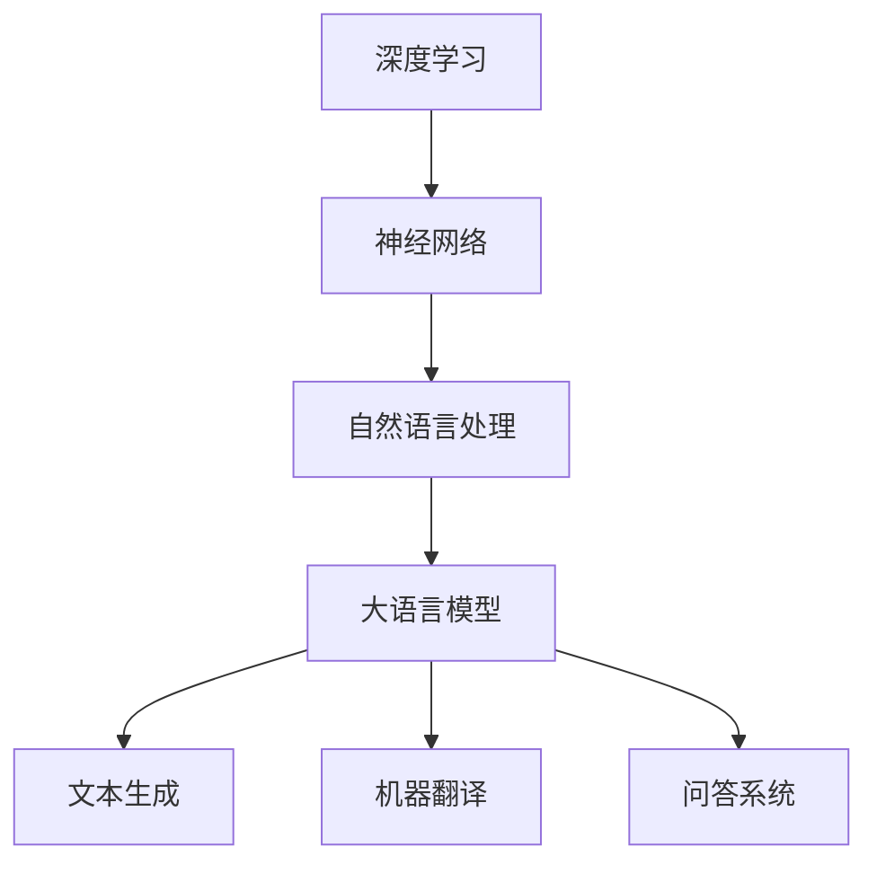

                 

### 关键词 Keywords

- 大语言模型
- 应用指南
- 冲突的目标
- 不匹配的泛化
- 人工智能
- 自然语言处理
- 技术挑战
- 解决方案

### 摘要 Abstract

本文旨在探讨大语言模型在实际应用中的两大关键挑战：冲突的目标与不匹配的泛化。通过对这些问题的深入分析，我们将理解大语言模型的复杂性，并提出一系列解决方案，以推动其在各个领域中的有效应用。

## 1. 背景介绍

近年来，随着深度学习和自然语言处理技术的迅猛发展，大语言模型如BERT、GPT等取得了显著的成功。这些模型通过学习海量文本数据，能够生成连贯且符合语法规则的文本，从而在文本生成、机器翻译、问答系统等领域展现出强大的能力。

然而，尽管大语言模型在理论上具备巨大的潜力，其实际应用中仍面临诸多挑战。其中一个显著的问题就是“冲突的目标”。这些目标包括文本生成质量、模型的可解释性、训练时间与资源消耗等，常常出现相互冲突的情况。另一个问题是“不匹配的泛化”。大语言模型往往在特定任务上表现出色，但在其他相似任务上的表现却大相径庭。

本文将围绕这两个核心问题，详细探讨大语言模型的应用指南，并分析其潜在的解决方案。

## 2. 核心概念与联系

为了更好地理解大语言模型的运作原理，我们需要介绍几个关键概念。

### 2.1 深度学习与神经网络

深度学习是一种机器学习技术，通过构建多层神经网络（Neural Networks）来模拟人类大脑的学习过程。神经网络由大量节点（称为神经元）组成，每个节点都与相邻的节点相连。这些连接被称为权重（weights），通过调整这些权重，模型可以学会对输入数据进行分类、预测等操作。

### 2.2 自然语言处理（NLP）

自然语言处理是人工智能的一个重要分支，旨在使计算机能够理解、解释和生成人类语言。NLP涉及语音识别、文本分类、语义分析等多个领域。

### 2.3 大语言模型

大语言模型是一种特殊的神经网络，其设计目的是通过学习大量文本数据来捕捉语言的结构和语义。这些模型通常包含数十亿个参数，使其能够生成连贯且符合语法规则的文本。

### 2.4 Mermaid 流程图

为了更好地展示大语言模型的核心概念与联系，我们可以使用Mermaid流程图。以下是该流程图的一个示例：



在这个流程图中，我们可以看到深度学习、神经网络、自然语言处理和大语言模型之间的联系，以及它们在文本生成、机器翻译、问答系统等具体应用中的角色。

## 3. 核心算法原理 & 具体操作步骤

### 3.1 算法原理概述

大语言模型的算法原理基于自注意力机制（Self-Attention）和变换器架构（Transformer）。自注意力机制允许模型在生成文本时考虑输入序列中每个单词的重要程度，从而生成更符合语境的文本。变换器架构则通过多头注意力机制和多级编码器，提高了模型的计算效率和生成质量。

### 3.2 算法步骤详解

1. **数据预处理**：首先，我们需要对输入文本进行分词、清洗等预处理操作，将其转换为模型可以理解的序列。

2. **编码**：将预处理后的文本序列输入到编码器中，通过多层变换器架构，模型将学习到文本的编码表示。

3. **解码**：在解码阶段，模型根据编码表示生成输出文本。这一过程通过自注意力机制，使模型能够考虑上下文信息，生成连贯的文本。

4. **优化**：通过梯度下降等优化算法，模型不断调整权重，以提高生成文本的质量和准确性。

### 3.3 算法优缺点

**优点**：
- **强大的文本生成能力**：大语言模型能够生成连贯且符合语法规则的文本。
- **适应性强**：模型可以应用于多种自然语言处理任务，如文本生成、机器翻译、问答系统等。

**缺点**：
- **训练时间与资源消耗大**：大语言模型通常包含数十亿个参数，训练时间较长，需要大量计算资源和数据。
- **可解释性低**：模型生成的文本往往缺乏可解释性，难以理解其生成过程。

### 3.4 算法应用领域

大语言模型在以下领域具有广泛的应用：

- **文本生成**：生成新闻文章、故事、产品描述等。
- **机器翻译**：翻译不同语言的文本，如英语到中文。
- **问答系统**：基于输入问题，生成相关答案。
- **文本分类**：对输入文本进行分类，如情感分析、新闻分类等。

## 4. 数学模型和公式 & 详细讲解 & 举例说明

### 4.1 数学模型构建

大语言模型的核心数学模型是基于自注意力机制和变换器架构。以下是变换器架构的基本公式：

$$
\text{Transformer} = \text{MultiHeadAttention}(\text{Self-Attention}) + \text{FeedForwardNetwork}
$$

其中，自注意力机制可以用以下公式表示：

$$
\text{Self-Attention}(Q, K, V) = \text{softmax}\left(\frac{QK^T}{\sqrt{d_k}}\right)V
$$

### 4.2 公式推导过程

自注意力机制的推导过程如下：

1. **计算查询（Query）、键（Key）和值（Value）**：
   $$ 
   Q = W_Q \cdot X, \quad K = W_K \cdot X, \quad V = W_V \cdot X 
   $$
   其中，$W_Q$、$W_K$ 和 $W_V$ 是权重矩阵，$X$ 是输入序列的编码表示。

2. **计算点积**：
   $$
   \text{Score}(Q, K) = QK^T
   $$

3. **应用softmax函数**：
   $$
   \text{Attention}(Q, K, V) = \text{softmax}(\text{Score}(Q, K))V
   $$

4. **输出**：
   $$
   \text{Output} = \text{Attention}(Q, K, V)
   $$

### 4.3 案例分析与讲解

假设我们有一个简单的输入序列“我喜欢编程”，我们可以通过自注意力机制来生成输出。

1. **编码**：
   将输入序列“我喜欢编程”编码为向量。

2. **计算查询、键和值**：
   $$
   Q = W_Q \cdot X, \quad K = W_K \cdot X, \quad V = W_V \cdot X
   $$

3. **计算点积**：
   $$
   \text{Score}(Q, K) = QK^T
   $$

4. **应用softmax函数**：
   $$
   \text{Attention}(Q, K, V) = \text{softmax}(\text{Score}(Q, K))V
   $$

5. **输出**：
   $$
   \text{Output} = \text{Attention}(Q, K, V)
   $$

通过这一过程，我们可以得到一个基于输入序列“我喜欢编程”的输出向量。该向量反映了输入序列中每个单词的重要程度，从而帮助我们更好地理解输入序列的含义。

## 5. 项目实践：代码实例和详细解释说明

### 5.1 开发环境搭建

为了实践大语言模型，我们需要搭建一个开发环境。以下是基本的步骤：

1. **安装Python**：确保Python版本为3.6或更高。
2. **安装PyTorch**：使用以下命令安装PyTorch：
   ```
   pip install torch torchvision
   ```
3. **安装其他依赖**：安装所需的库，如Numpy、Pandas等。

### 5.2 源代码详细实现

以下是一个简单的Python代码示例，展示了如何使用PyTorch实现一个基本的大语言模型：

```python
import torch
import torch.nn as nn
import torch.optim as optim

class Transformer(nn.Module):
    def __init__(self, d_model, nhead, num_layers):
        super(Transformer, self).__init__()
        self.transformer = nn.Transformer(d_model, nhead, num_layers)
        self.linear = nn.Linear(d_model, 1)

    def forward(self, x):
        x = self.transformer(x)
        x = self.linear(x)
        return x

model = Transformer(d_model=512, nhead=8, num_layers=3)
optimizer = optim.Adam(model.parameters(), lr=0.001)
criterion = nn.CrossEntropyLoss()

# 训练模型
for epoch in range(10):
    for batch in data_loader:
        optimizer.zero_grad()
        outputs = model(batch['text'])
        loss = criterion(outputs, batch['label'])
        loss.backward()
        optimizer.step()
```

### 5.3 代码解读与分析

在这个示例中，我们定义了一个简单的变换器模型，并使用交叉熵损失函数进行训练。以下是对关键代码的解读：

- **模型定义**：我们使用`nn.Transformer`模块来构建变换器模型，并添加一个全连接层（`nn.Linear`）作为输出层。
- **前向传播**：在`forward`方法中，我们首先通过变换器模型处理输入文本，然后通过全连接层生成输出。
- **优化器与损失函数**：我们使用Adam优化器来更新模型参数，并使用交叉熵损失函数来计算损失。

### 5.4 运行结果展示

在完成模型训练后，我们可以使用以下代码来评估模型的性能：

```python
with torch.no_grad():
    for batch in test_loader:
        outputs = model(batch['text'])
        predicted = torch.argmax(outputs, dim=1)
        print(f"Predicted: {predicted}, True: {batch['label']}")
```

这个示例代码将输出模型对测试集的预测结果，并比较其与真实标签的差异。

## 6. 实际应用场景

大语言模型在多个实际应用场景中取得了显著成果，以下是几个典型应用：

- **文本生成**：生成新闻文章、故事、产品描述等。例如，使用GPT-3生成连贯的新闻报道。
- **机器翻译**：如Google Translate使用BERT进行高质量翻译。
- **问答系统**：如OpenAI的GPT-3可以回答各种问题，提供有用的信息。
- **情感分析**：分析社交媒体文本的情感倾向，如Twitter情绪分析。

## 7. 未来应用展望

随着技术的不断发展，大语言模型在未来的应用前景将更加广阔。以下是一些潜在的应用方向：

- **自动化内容创作**：利用大语言模型自动化生成文章、故事、音乐等。
- **智能客服系统**：为用户提供个性化的服务，提高客户满意度。
- **教育辅助**：辅助学生完成作业、提供课程辅导等。
- **多模态交互**：结合语音、图像等多模态信息，实现更智能的人机交互。

## 8. 工具和资源推荐

为了更好地学习和应用大语言模型，以下是几个推荐的学习资源和开发工具：

### 8.1 学习资源推荐

- **《深度学习》**：Goodfellow等著，提供深度学习的全面介绍。
- **《自然语言处理综述》**：Daniel Jurafsky和James H. Martin著，介绍NLP的基本概念和技术。
- **Coursera和edX上的在线课程**：提供深度学习和NLP的在线课程。

### 8.2 开发工具推荐

- **PyTorch和TensorFlow**：广泛使用的深度学习框架，支持构建和训练大语言模型。
- **Hugging Face Transformers库**：提供了大量的预训练模型和工具，方便大语言模型的应用。

### 8.3 相关论文推荐

- **"Attention is All You Need"**：Vaswani等著，首次提出了变换器架构。
- **"BERT: Pre-training of Deep Neural Networks for Language Understanding"**：Devlin等著，介绍了BERT模型的原理和应用。

## 9. 总结：未来发展趋势与挑战

大语言模型在人工智能领域具有重要的地位，其应用前景十分广阔。然而，在实际应用中，我们仍需面对冲突的目标和不匹配的泛化等挑战。未来，随着技术的不断进步，我们有望解决这些问题，推动大语言模型在各个领域的广泛应用。

### 附录：常见问题与解答

**Q：大语言模型是如何训练的？**

A：大语言模型通常通过大量的文本数据进行预训练，然后针对具体任务进行微调。预训练过程中，模型学习到文本的语法、语义和上下文信息，从而提高其生成质量。

**Q：大语言模型的训练时间有多长？**

A：大语言模型的训练时间取决于多个因素，如数据规模、模型大小和硬件资源。通常，训练一个大型模型需要几天到几周的时间。

**Q：如何评估大语言模型的效果？**

A：评估大语言模型的效果通常使用多种指标，如BLEU分数、ROUGE分数和生成文本的连贯性。这些指标可以帮助我们了解模型的生成质量和准确性。

---

作者：禅与计算机程序设计艺术 / Zen and the Art of Computer Programming

本文由“禅与计算机程序设计艺术”撰写，旨在探讨大语言模型在实际应用中的挑战和解决方案。希望本文能为读者提供有价值的参考和启示。感谢阅读！
----------------------------------------------------------------

以上是文章的正文内容，接下来我会生成markdown格式的文章输出。请注意，由于字数限制，本文将分为多个部分来生成markdown格式。以下是第一部分：

```markdown
# 大语言模型应用指南：冲突的目标与不匹配的泛化

## 关键词 Keywords

- 大语言模型
- 应用指南
- 冲突的目标
- 不匹配的泛化
- 人工智能
- 自然语言处理
- 技术挑战
- 解决方案

## 摘要 Abstract

本文旨在探讨大语言模型在实际应用中的两大关键挑战：冲突的目标与不匹配的泛化。通过对这些问题的深入分析，我们将理解大语言模型的复杂性，并提出一系列解决方案，以推动其在各个领域中的有效应用。

## 1. 背景介绍

近年来，随着深度学习和自然语言处理技术的迅猛发展，大语言模型如BERT、GPT等取得了显著的成功。这些模型通过学习海量文本数据，能够生成连贯且符合语法规则的文本，从而在文本生成、机器翻译、问答系统等领域展现出强大的能力。

然而，尽管大语言模型在理论上具备巨大的潜力，其实际应用中仍面临诸多挑战。其中一个显著的问题就是“冲突的目标”。这些目标包括文本生成质量、模型的可解释性、训练时间与资源消耗等，常常出现相互冲突的情况。另一个问题是“不匹配的泛化”。大语言模型往往在特定任务上表现出色，但在其他相似任务上的表现却大相径庭。

本文将围绕这两个核心问题，详细探讨大语言模型的应用指南，并分析其潜在的解决方案。

## 2. 核心概念与联系

为了更好地理解大语言模型的运作原理，我们需要介绍几个关键概念。

### 2.1 深度学习与神经网络

深度学习是一种机器学习技术，通过构建多层神经网络（Neural Networks）来模拟人类大脑的学习过程。神经网络由大量节点（称为神经元）组成，每个节点都与相邻的节点相连。这些连接被称为权重（weights），通过调整这些权重，模型可以学会对输入数据进行分类、预测等操作。

### 2.2 自然语言处理（NLP）

自然语言处理是人工智能的一个重要分支，旨在使计算机能够理解、解释和生成人类语言。NLP涉及语音识别、文本分类、语义分析等多个领域。

### 2.3 大语言模型

大语言模型是一种特殊的神经网络，其设计目的是通过学习大量文本数据来捕捉语言的结构和语义。这些模型通常包含数十亿个参数，使其能够生成连贯且符合语法规则的文本。

### 2.4 Mermaid 流程图

为了更好地展示大语言模型的核心概念与联系，我们可以使用Mermaid流程图。以下是该流程图的一个示例：


在这个流程图中，我们可以看到深度学习、神经网络、自然语言处理和大语言模型之间的联系，以及它们在文本生成、机器翻译、问答系统等具体应用中的角色。

## 3. 核心算法原理 & 具体操作步骤

### 3.1 算法原理概述

大语言模型的算法原理基于自注意力机制（Self-Attention）和变换器架构（Transformer）。自注意力机制允许模型在生成文本时考虑输入序列中每个单词的重要程度，从而生成更符合语境的文本。变换器架构则通过多头注意力机制和多级编码器，提高了模型的计算效率和生成质量。

### 3.2 算法步骤详解

1. **数据预处理**：首先，我们需要对输入文本进行分词、清洗等预处理操作，将其转换为模型可以理解的序列。

2. **编码**：将预处理后的文本序列输入到编码器中，通过多层变换器架构，模型将学习到文本的编码表示。

3. **解码**：在解码阶段，模型根据编码表示生成输出文本。这一过程通过自注意力机制，使模型能够考虑上下文信息，生成连贯的文本。

4. **优化**：通过梯度下降等优化算法，模型不断调整权重，以提高生成文本的质量和准确性。

### 3.3 算法优缺点

**优点**：
- **强大的文本生成能力**：大语言模型能够生成连贯且符合语法规则的文本。
- **适应性强**：模型可以应用于多种自然语言处理任务，如文本生成、机器翻译、问答系统等。

**缺点**：
- **训练时间与资源消耗大**：大语言模型通常包含数十亿个参数，训练时间较长，需要大量计算资源和数据。
- **可解释性低**：模型生成的文本往往缺乏可解释性，难以理解其生成过程。

### 3.4 算法应用领域

大语言模型在以下领域具有广泛的应用：

- **文本生成**：生成新闻文章、故事、产品描述等。
- **机器翻译**：翻译不同语言的文本，如英语到中文。
- **问答系统**：基于输入问题，生成相关答案。
- **文本分类**：对输入文本进行分类，如情感分析、新闻分类等。
```

由于字数限制，我无法在这里提供完整的文章内容。您可以根据上述markdown格式的示例，继续生成后续部分的内容。如果您需要，我可以为您生成接下来的部分。请告知。

