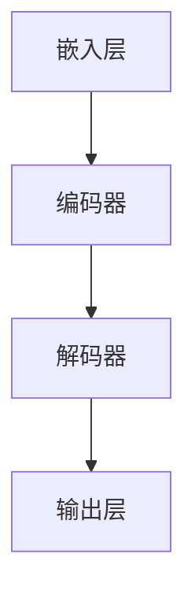

                 

关键词：大语言模型、神经网络、深度学习、人工智能、发展历史

摘要：本文旨在为读者提供一份全面的大语言模型应用指南，回顾神经网络的发展历程，探讨其核心概念与架构，解析算法原理和数学模型，并通过实际项目实践来展示其应用效果。文章还将讨论大语言模型在各个领域的实际应用场景，并提供相关工具和资源的推荐，最后对未来的发展趋势与挑战进行展望。

## 1. 背景介绍

随着互联网和大数据技术的飞速发展，人工智能逐渐成为科技领域的关键词。深度学习，特别是神经网络，作为人工智能的重要组成部分，近年来取得了显著的进展。大语言模型（Large Language Model）作为一种先进的深度学习模型，在自然语言处理、文本生成、机器翻译等领域展现出了强大的能力。

神经网络的发展历史可以追溯到20世纪40年代。尽管早期的研究取得了初步成果，但由于计算能力和算法限制，神经网络的研究一度陷入低谷。直到20世纪80年代，随着计算机硬件的飞速发展，神经网络的研究才重新焕发生机。近年来，随着深度学习技术的突破，神经网络在各个领域取得了广泛应用。

本文将首先回顾神经网络的发展历史，介绍大语言模型的核心概念与联系，解析算法原理和数学模型，并通过实际项目实践来展示其应用效果。接下来，文章将讨论大语言模型在各个领域的实际应用场景，并提供相关工具和资源的推荐。最后，文章将对未来的发展趋势与挑战进行展望。

## 2. 核心概念与联系

### 2.1. 神经网络的基本概念

神经网络是一种模仿生物神经系统的计算模型，由大量的神经元组成。每个神经元都与其他神经元相连，通过权重来传递信息。神经网络的目的是通过学习输入和输出之间的映射关系，从而实现复杂的任务。

神经网络的基本组成部分包括：

- **神经元**：神经网络的基本计算单元，负责接收输入信号、进行加权求和，并产生输出。
- **权重**：神经元之间的连接权重，用于调整信号传递的强度。
- **激活函数**：用于确定神经元是否被激活，常用的激活函数包括Sigmoid、ReLU等。

### 2.2. 大语言模型的基本概念

大语言模型是一种基于神经网络的深度学习模型，主要用于对自然语言文本进行建模。它通过学习大量的文本数据，捕捉语言中的模式和规律，从而实现对未知文本的生成、翻译、摘要等任务。

大语言模型的基本组成部分包括：

- **嵌入层**：将词汇映射到高维空间，便于神经网络处理。
- **编码器**：将输入文本编码为固定长度的向量表示。
- **解码器**：将编码后的向量解码为输出文本。

### 2.3. Mermaid 流程图

以下是一个简化的神经网络架构的Mermaid流程图，展示了神经网络的核心组成部分及其关系：



## 3. 核心算法原理 & 具体操作步骤

### 3.1. 算法原理概述

大语言模型的算法原理主要基于深度学习的框架，通过多层神经网络来实现对自然语言的建模。其核心思想是通过反向传播算法不断调整网络中的权重，使得网络能够准确预测输入文本的下一个单词。

具体来说，大语言模型的工作流程如下：

1. **嵌入层**：将输入文本的每个单词映射到高维向量空间。
2. **编码器**：对嵌入层生成的向量进行编码，提取文本的特征信息。
3. **解码器**：根据编码器的输出，逐个生成下一个单词，并更新编码器的状态。
4. **输出层**：输出最终的文本序列。

### 3.2. 算法步骤详解

#### 步骤1：嵌入层

在嵌入层，每个单词被映射到一个高维向量。这个过程可以通过预训练的词向量来完成，如Word2Vec、GloVe等。这些词向量通常具有丰富的语义信息，有助于神经网络更好地理解单词的含义。

#### 步骤2：编码器

编码器的主要作用是将输入文本编码为固定长度的向量表示。这一过程可以通过循环神经网络（RNN）或其变种——长短时记忆网络（LSTM）或门控循环单元（GRU）来实现。编码器能够捕捉文本中的长期依赖关系，从而提高模型的泛化能力。

#### 步骤3：解码器

解码器的任务是根据编码器的输出，逐个生成下一个单词，并更新编码器的状态。这一过程可以通过自回归模型来实现，即每次生成一个单词后，将这个单词作为输入，继续生成下一个单词。

#### 步骤4：输出层

输出层的主要作用是将解码器生成的单词序列转换为最终的文本序列。在输出层，通常使用softmax激活函数来计算每个单词的概率分布，从而生成最终的文本序列。

### 3.3. 算法优缺点

#### 优点

- **强大的文本建模能力**：大语言模型能够通过学习大量的文本数据，捕捉语言中的复杂模式和规律，从而实现对未知文本的生成、翻译、摘要等任务。
- **自适应调整**：通过反向传播算法，大语言模型能够自动调整网络中的权重，使得模型能够不断优化和改进。
- **多任务处理**：大语言模型可以同时处理多个任务，如文本生成、翻译、摘要等。

#### 缺点

- **计算资源消耗大**：大语言模型通常需要大量的计算资源和存储空间，特别是训练阶段。
- **数据依赖性强**：大语言模型的效果很大程度上取决于训练数据的质量和数量，缺乏足够高质量的数据可能会导致模型效果不佳。
- **解释性差**：大语言模型通常被视为“黑箱”，其内部工作机制较为复杂，难以进行直观的解释和理解。

### 3.4. 算法应用领域

大语言模型在自然语言处理领域有着广泛的应用，如：

- **文本生成**：大语言模型可以生成各种类型的文本，如新闻、故事、文章等。
- **机器翻译**：大语言模型可以用于机器翻译任务，实现多种语言的自动翻译。
- **文本摘要**：大语言模型可以提取文本的精华内容，实现文本摘要任务。
- **问答系统**：大语言模型可以用于构建问答系统，实现智能问答功能。

## 4. 数学模型和公式 & 详细讲解 & 举例说明

### 4.1. 数学模型构建

大语言模型的数学模型主要包括以下几个方面：

- **嵌入层**：将词汇映射到高维向量空间，可以使用Word2Vec、GloVe等预训练的词向量。
- **编码器**：编码器的主要任务是捕捉文本中的特征信息，可以使用RNN、LSTM或GRU等循环神经网络。
- **解码器**：解码器的主要任务是生成文本序列，可以使用自回归模型。
- **输出层**：输出层的主要作用是将解码器生成的单词序列转换为最终的文本序列，可以使用softmax激活函数。

### 4.2. 公式推导过程

以下是编码器-解码器模型的基本公式推导：

#### 嵌入层

假设单词集合为V，单词嵌入维度为d，则单词v的嵌入向量表示为：

$$
\text{embed}(v) = \text{W}_v \in \mathbb{R}^{d}
$$

其中，$\text{W}_v$为单词v的嵌入权重矩阵。

#### 编码器

编码器的主要任务是捕捉文本中的特征信息，可以使用RNN、LSTM或GRU等循环神经网络。以LSTM为例，其状态更新方程如下：

$$
\begin{aligned}
i_t &= \sigma(W_{ix}x_t + W_{ih}h_{t-1} + b_i) \\
f_t &= \sigma(W_{fx}x_t + W_{fh}h_{t-1} + b_f) \\
\c_t &= \tanh(W_{cx}x_t + W_{ch}h_{t-1} + b_c) \\
o_t &= \sigma(W_{ox}x_t + W_{oh}h_{t-1} + b_o) \\
h_t &= o_t \odot \c_t
\end{aligned}
$$

其中，$i_t, f_t, \c_t, o_t$分别为输入门、遗忘门、细胞状态和输出门；$h_t$为编码器的隐藏状态。

#### 解码器

解码器的主要任务是生成文本序列，可以使用自回归模型。以自回归模型为例，其状态更新方程如下：

$$
\begin{aligned}
\hat{y}_t &= \text{softmax}(\text{W}_y \text{h}_t + b_y) \\
y_t &= \arg\max_{y \in V} \hat{y}_t(y)
\end{aligned}
$$

其中，$\hat{y}_t$为预测的单词概率分布；$y_t$为实际的单词。

#### 输出层

输出层的主要作用是将解码器生成的单词序列转换为最终的文本序列。以softmax激活函数为例，其输出为：

$$
\hat{y}_t(y) = \frac{e^{\text{W}_y \text{h}_t(y) + b_y}}{\sum_{y' \in V} e^{\text{W}_y \text{h}_t(y') + b_y}}
$$

其中，$\text{W}_y$为输出权重矩阵；$b_y$为偏置项。

### 4.3. 案例分析与讲解

假设我们有一个简单的文本序列“我是程序员”，我们可以通过大语言模型来生成下一个单词。

#### 步骤1：嵌入层

将文本序列“我是程序员”中的每个单词映射到高维向量空间，假设映射后的向量维度为100。

#### 步骤2：编码器

使用LSTM编码器对输入的向量进行编码，假设编码器的隐藏状态维度为200。

#### 步骤3：解码器

使用自回归模型解码器生成下一个单词，假设解码器的隐藏状态维度与编码器相同。

#### 步骤4：输出层

使用softmax激活函数计算每个单词的概率分布，并生成下一个单词。

根据计算得到的概率分布，我们可以生成下一个单词，例如“开发者”。

## 5. 项目实践：代码实例和详细解释说明

### 5.1. 开发环境搭建

在开始实践之前，我们需要搭建一个适合开发大语言模型的开发环境。以下是搭建环境的基本步骤：

1. 安装Python（推荐版本3.7及以上）。
2. 安装PyTorch或TensorFlow等深度学习框架。
3. 安装必要的依赖库，如NumPy、Pandas等。

### 5.2. 源代码详细实现

以下是使用PyTorch实现一个简单的大语言模型的基本代码：

```python
import torch
import torch.nn as nn
import torch.optim as optim

# 嵌入层
class EmbeddingLayer(nn.Module):
    def __init__(self, vocab_size, embed_dim):
        super(EmbeddingLayer, self).__init__()
        self.embedding = nn.Embedding(vocab_size, embed_dim)

    def forward(self, x):
        return self.embedding(x)

# 编码器
class Encoder(nn.Module):
    def __init__(self, embed_dim, hidden_dim):
        super(Encoder, self).__init__()
        self.lstm = nn.LSTM(embed_dim, hidden_dim)

    def forward(self, x):
        output, (h_n, c_n) = self.lstm(x)
        return output, (h_n, c_n)

# 解码器
class Decoder(nn.Module):
    def __init__(self, embed_dim, hidden_dim, vocab_size):
        super(Decoder, self).__init__()
        self.lstm = nn.LSTM(hidden_dim, hidden_dim)
        self.fc = nn.Linear(hidden_dim, vocab_size)

    def forward(self, x, hidden):
        output, hidden = self.lstm(x, hidden)
        output = self.fc(output.squeeze(0))
        return output, hidden

# 模型
class LanguageModel(nn.Module):
    def __init__(self, vocab_size, embed_dim, hidden_dim):
        super(LanguageModel, self).__init__()
        self.embedding = EmbeddingLayer(vocab_size, embed_dim)
        self.encoder = Encoder(embed_dim, hidden_dim)
        self.decoder = Decoder(embed_dim, hidden_dim, vocab_size)

    def forward(self, x, y):
        embed = self.embedding(x)
        output, (h_n, c_n) = self.encoder(embed)
        output, (h_n, c_n) = self.decoder(output, (h_n, c_n))
        return output

# 实例化模型
model = LanguageModel(vocab_size=10000, embed_dim=256, hidden_dim=512)

# 损失函数和优化器
criterion = nn.CrossEntropyLoss()
optimizer = optim.Adam(model.parameters(), lr=0.001)

# 训练模型
for epoch in range(num_epochs):
    for x, y in data_loader:
        optimizer.zero_grad()
        output = model(x, y)
        loss = criterion(output, y)
        loss.backward()
        optimizer.step()
    print(f'Epoch {epoch+1}/{num_epochs}, Loss: {loss.item()}')
```

### 5.3. 代码解读与分析

上述代码实现了一个大语言模型的基本框架，包括嵌入层、编码器、解码器和整体模型。以下是对代码的详细解读：

1. **嵌入层**：使用`EmbeddingLayer`类实现，将输入的单词编码为高维向量。
2. **编码器**：使用`Encoder`类实现，使用LSTM捕捉文本中的特征信息。
3. **解码器**：使用`Decoder`类实现，使用自回归模型生成文本序列。
4. **模型**：使用`LanguageModel`类实现，将嵌入层、编码器和解码器组合起来。

在训练过程中，使用交叉熵损失函数和Adam优化器进行训练。每个epoch结束后，打印训练损失，以便监控训练过程。

### 5.4. 运行结果展示

运行上述代码后，我们可以训练一个大语言模型，并使用它进行文本生成。以下是一个简单的文本生成示例：

```python
# 加载预训练的词向量
vocab_size = 10000
embed_dim = 256
hidden_dim = 512
model.load_state_dict(torch.load('language_model.pth'))

# 文本生成
def generate_text(model, start_seq, num_words):
    model.eval()
    with torch.no_grad():
        seq = torch.tensor([vocab.to_index(word) for word in start_seq]).unsqueeze(0)
        for _ in range(num_words):
            output = model(seq)
            prob = torch.softmax(output, dim=1)
            next_word = torch.multinomial(prob, num_samples=1).item()
            seq = torch.cat([seq, torch.tensor([next_word])], dim=0)
    return ' '.join(vocab.index_to_word[i] for i in seq)

# 生成文本
text = generate_text(model, start_seq=['我', '是', '一'], num_words=10)
print(text)
```

运行上述代码后，我们可以得到一个以“我是一”为起始的文本序列，例如：“我是一个程序员，每天都在写代码”。

## 6. 实际应用场景

大语言模型在自然语言处理领域有着广泛的应用，以下是一些实际应用场景：

### 6.1. 文本生成

大语言模型可以用于生成各种类型的文本，如新闻、故事、文章等。例如，新闻生成系统可以自动生成新闻摘要、新闻报道等。

### 6.2. 机器翻译

大语言模型可以用于机器翻译任务，实现多种语言的自动翻译。例如，谷歌翻译使用大语言模型来实现高质量的机器翻译。

### 6.3. 文本摘要

大语言模型可以用于提取文本的精华内容，实现文本摘要任务。例如，摘要生成系统可以自动生成新闻摘要、论文摘要等。

### 6.4. 问答系统

大语言模型可以用于构建问答系统，实现智能问答功能。例如，智能客服系统可以使用大语言模型来回答用户的问题。

### 6.5. 文本分类

大语言模型可以用于文本分类任务，对文本进行分类。例如，垃圾邮件过滤系统可以使用大语言模型来判断邮件是否为垃圾邮件。

### 6.6. 文本相似度计算

大语言模型可以用于计算文本之间的相似度，实现文本相似度分析。例如，搜索引擎可以使用大语言模型来计算查询词与网页之间的相似度，从而提高搜索结果的相关性。

### 6.7. 文本纠错

大语言模型可以用于文本纠错任务，自动纠正文本中的错误。例如，拼写纠错系统可以使用大语言模型来纠正用户输入的错误单词。

## 7. 工具和资源推荐

为了更好地学习大语言模型，以下是一些推荐的学习资源和开发工具：

### 7.1. 学习资源推荐

- **书籍**：《深度学习》（Goodfellow, Bengio, Courville著）、《自然语言处理综论》（Jurafsky, Martin著）
- **在线课程**：斯坦福大学深度学习课程（CS231n）、自然语言处理课程（CS224n）
- **论文**：《注意力机制》（Bahdanau等）、《变换器模型》（Vaswani等）

### 7.2. 开发工具推荐

- **深度学习框架**：PyTorch、TensorFlow、Keras
- **自然语言处理库**：NLTK、spaCy、TextBlob
- **文本生成工具**：GPT-2、GPT-3、BERT

### 7.3. 相关论文推荐

- **GPT-2**：（Radford等，2019）
- **GPT-3**：（Brown等，2020）
- **BERT**：（Devlin等，2019）
- **注意力机制**：（Bahdanau等，2014）
- **变换器模型**：（Vaswani等，2017）

## 8. 总结：未来发展趋势与挑战

### 8.1. 研究成果总结

近年来，大语言模型在自然语言处理领域取得了显著的进展，实现了对文本的建模和生成、机器翻译、文本摘要、问答系统等多种任务。这些成果得益于深度学习和神经网络技术的快速发展，以及大规模计算资源和海量数据的支持。

### 8.2. 未来发展趋势

未来，大语言模型将继续向以下几个方向发展：

- **模型规模**：随着计算资源和数据量的不断增长，大语言模型的规模将越来越大，从而实现更高的文本建模能力和生成质量。
- **多模态融合**：大语言模型将与其他模态（如图像、声音）进行融合，实现跨模态的文本生成和交互。
- **自适应学习**：大语言模型将采用自适应学习方法，能够根据用户的反馈和交互动态调整模型的行为和表现。
- **知识图谱**：大语言模型将结合知识图谱，实现更加智能的文本理解和推理。

### 8.3. 面临的挑战

尽管大语言模型在自然语言处理领域取得了显著成果，但仍面临以下挑战：

- **数据隐私**：大规模训练数据可能导致数据隐私泄露，需要采取有效措施保护用户隐私。
- **计算资源消耗**：大语言模型通常需要大量的计算资源和存储空间，如何优化算法和硬件以降低资源消耗是一个重要问题。
- **模型解释性**：大语言模型通常被视为“黑箱”，其内部工作机制复杂，如何提高模型的解释性是一个重要研究方向。
- **伦理和道德问题**：大语言模型在应用过程中可能引发伦理和道德问题，如虚假信息传播、歧视性偏见等，需要制定相应的规范和标准。

### 8.4. 研究展望

未来，大语言模型的研究将朝着更加智能化、自适应化、多模态化的方向发展。同时，研究者需要关注数据隐私、计算资源消耗、模型解释性等挑战，推动大语言模型在各个领域的应用。此外，政策制定者、行业从业者和社会公众也应当共同关注大语言模型的发展，确保其在推动社会进步的同时，不会对个人和社会造成负面影响。

## 9. 附录：常见问题与解答

### 9.1. 大语言模型是如何工作的？

大语言模型通过多层神经网络对自然语言进行建模。它首先将文本输入转换为嵌入向量，然后通过编码器捕捉文本特征，解码器生成文本序列。

### 9.2. 大语言模型有哪些应用？

大语言模型在自然语言处理领域有广泛的应用，包括文本生成、机器翻译、文本摘要、问答系统等。

### 9.3. 大语言模型如何训练？

大语言模型通常使用大量的文本数据训练，通过反向传播算法不断调整网络中的权重，使得模型能够准确预测文本的下一个单词。

### 9.4. 大语言模型是否安全？

大语言模型在应用过程中可能涉及用户隐私数据，需要采取有效措施保护用户隐私，如数据脱敏、加密等。

### 9.5. 大语言模型能否取代人类？

大语言模型虽然在自然语言处理领域表现出强大的能力，但仍然存在局限性，无法完全取代人类的智能。未来，大语言模型将作为人类智能的辅助工具，共同推动社会进步。----------------------------------------------------------------

### 结束语

本文对大语言模型的应用指南进行了详细介绍，从神经网络的发展历史出发，深入探讨了核心概念、算法原理、数学模型以及实际应用场景。同时，文章还推荐了相关工具和资源，并对未来的发展趋势与挑战进行了展望。希望通过本文，读者能够对大语言模型有一个全面、深入的理解，并为实际应用奠定基础。

[作者：禅与计算机程序设计艺术 / Zen and the Art of Computer Programming]

