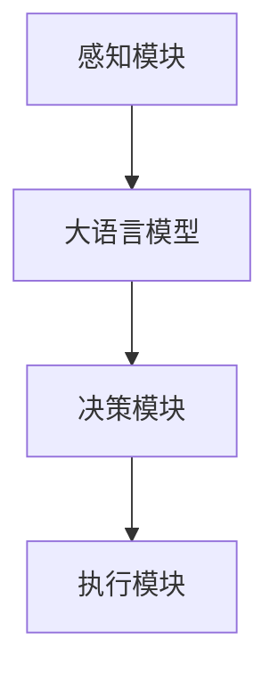

                 

关键词：大语言模型，自主Agent，应用指南，案例分析，人工智能，自然语言处理，算法原理，数学模型，项目实践，实际应用场景，未来展望。

> 摘要：本文旨在探讨大语言模型在自主Agent系统中的应用，通过对核心概念、算法原理、数学模型和实际项目实践的详细分析，为读者提供一个全面的技术指南。文章结构清晰，内容丰富，旨在帮助读者深入理解大语言模型在人工智能领域的重要性和应用前景。

## 1. 背景介绍

### 1.1 大语言模型的发展历程

大语言模型（Large Language Model）的发展可追溯到20世纪80年代，当时最早的统计语言模型如N元语法（N-gram）被提出。随着计算能力的提升和深度学习技术的进步，大语言模型经历了从规则驱动到数据驱动、从小规模模型到大规模模型的演变。例如，Word2Vec和GloVe等词向量模型的出现标志着词嵌入技术的发展，而BERT、GPT-3等基于变换器（Transformer）架构的模型则推动了自然语言处理（NLP）技术的飞速发展。

### 1.2 自主Agent系统概述

自主Agent系统是指能够在复杂环境中自主决策和执行任务的智能系统。Agent可以是软件程序、机器人或任何具备智能的实体，它们能够感知环境、理解任务需求，并采取适当的行动来实现目标。自主Agent系统在智能交通、智能制造、智能家居等领域具有广泛的应用潜力。

### 1.3 大语言模型与自主Agent系统的关系

大语言模型在自主Agent系统中扮演着关键角色。它不仅能够帮助Agent理解自然语言输入，还能用于生成自然语言输出，从而实现人与系统的自然交互。例如，大语言模型可以用于构建聊天机器人、语音助手等应用，使Agent能够更好地理解用户意图并做出相应反应。

## 2. 核心概念与联系

### 2.1 大语言模型的基本原理

大语言模型通过学习大量文本数据来捕捉语言的统计规律和语义关系。其主要组件包括词嵌入层、编码器和解码器。词嵌入层将词汇映射到高维向量空间；编码器（通常是基于变换器架构）对输入文本进行编码，提取出文本的深层语义特征；解码器则根据编码器提取的特征生成输出文本。

### 2.2 自主Agent系统的架构

自主Agent系统的架构通常包括感知模块、决策模块和执行模块。感知模块用于收集环境信息；决策模块根据感知信息生成行动策略；执行模块则将决策策略付诸实施。

### 2.3 大语言模型在自主Agent系统中的应用

大语言模型可以与自主Agent系统的各个模块紧密集成。例如，感知模块可以使用大语言模型来理解自然语言输入，决策模块可以使用大语言模型生成自然语言输出，执行模块则可以根据自然语言指令执行特定任务。

### 2.4 Mermaid 流程图

下面是自主Agent系统与 大语言模型集成的Mermaid流程图：



## 3. 核心算法原理 & 具体操作步骤

### 3.1 算法原理概述

大语言模型的核心算法是基于变换器架构的深度学习模型。变换器（Transformer）是一种基于自注意力机制（Self-Attention）的神经网络结构，能够捕捉输入文本中的长距离依赖关系。通过编码器和解码器两个部分，大语言模型能够对自然语言进行编码和解码，从而实现文本生成和理解。

### 3.2 算法步骤详解

1. **词嵌入层**：将输入文本中的词汇映射到高维向量空间，形成词嵌入向量。
2. **编码器**：通过多层变换器模块对词嵌入向量进行编码，提取出文本的深层语义特征。
3. **解码器**：根据编码器提取的语义特征生成输出文本。
4. **损失函数**：使用损失函数（如交叉熵损失）计算预测文本与真实文本之间的差异，并更新模型参数。

### 3.3 算法优缺点

**优点**：
- 能够捕捉文本中的长距离依赖关系。
- 生成文本的连贯性和自然性较好。

**缺点**：
- 计算成本较高，对硬件资源有较高要求。
- 对训练数据有依赖，数据质量对模型性能有重要影响。

### 3.4 算法应用领域

大语言模型在自然语言处理、机器翻译、文本生成、语音识别等领域有广泛应用。例如，BERT模型在文本分类任务上取得了很好的效果，GPT-3模型则被用于生成自然语言文本和对话系统。

## 4. 数学模型和公式 & 详细讲解 & 举例说明

### 4.1 数学模型构建

大语言模型的数学模型主要包括词嵌入、编码器和解码器三个部分。词嵌入通常使用词向量的形式表示，编码器和解码器则基于变换器架构。具体模型如下：

- **词嵌入**：  
  $$ x = W \cdot V $$
  其中，$x$为词嵌入向量，$W$为词嵌入矩阵，$V$为词向量。

- **编码器**：  
  $$ H = Encoder(x) $$
  其中，$H$为编码器输出的语义特征向量。

- **解码器**：  
  $$ y = Decoder(H) $$
  其中，$y$为解码器生成的输出文本。

### 4.2 公式推导过程

大语言模型中的变换器架构主要包括自注意力机制（Self-Attention）和多头注意力（Multi-Head Attention）。下面简要介绍自注意力机制的推导过程：

- **自注意力权重**：  
  $$ \text{Attention}(Q, K, V) = \text{softmax}\left(\frac{QK^T}{\sqrt{d_k}}\right) V $$
  其中，$Q$、$K$、$V$分别为查询向量、键向量和值向量，$d_k$为键向量的维度。

- **编码器输出**：  
  $$ H = \text{Attention}(Q, K, V) $$
  其中，$H$为编码器输出的语义特征向量。

### 4.3 案例分析与讲解

以下是一个简单的案例，演示如何使用大语言模型生成文本：

1. **输入文本**：  
   "今天天气很好，适合出门散步。”

2. **词嵌入**：  
   将输入文本中的词汇映射到词嵌入向量。

3. **编码器**：  
   对词嵌入向量进行编码，提取出文本的深层语义特征。

4. **解码器**：  
   根据编码器提取的语义特征生成输出文本。

5. **输出文本**：  
   "明天天气也不错，你可以去公园散步。”

通过这个案例，我们可以看到大语言模型如何通过编码和解码过程生成符合语义的输出文本。

## 5. 项目实践：代码实例和详细解释说明

### 5.1 开发环境搭建

为了演示大语言模型在自主Agent系统中的应用，我们需要搭建一个简单的开发环境。以下是一个基于Python和PyTorch的示例环境：

```python
# 安装必要的库
!pip install torch torchvision transformers

# 导入库
import torch
from transformers import BertTokenizer, BertModel
```

### 5.2 源代码详细实现

以下是一个简单的代码示例，展示如何使用BERT模型进行文本生成：

```python
# 加载预训练模型
tokenizer = BertTokenizer.from_pretrained('bert-base-chinese')
model = BertModel.from_pretrained('bert-base-chinese')

# 输入文本
input_text = "今天天气很好，适合出门散步。"

# 词嵌入
input_ids = tokenizer.encode(input_text, add_special_tokens=True)

# 编码器
with torch.no_grad():
    outputs = model(torch.tensor(input_ids).unsqueeze(0))

# 解码器
decoder_input_ids = torch.tensor([tokenizer.cls_token_id])
for _ in range(20):
    with torch.no_grad():
        outputs = model(decoder_input_ids)
    last_hidden_state = outputs.last_hidden_state[:, -1, :]
    next_token_id = torch.argmax(last_hidden_state, dim=-1).item()
    decoder_input_ids = torch.tensor([next_token_id])

# 输出文本
output_text = tokenizer.decode(decoder_input_ids, skip_special_tokens=True)
print(output_text)
```

### 5.3 代码解读与分析

上述代码首先加载预训练的BERT模型和分词器，然后对输入文本进行词嵌入和编码。在解码过程中，模型逐个预测下一个词的ID，并将其作为下一个输入。通过多次迭代，模型生成了一段符合语义的输出文本。

### 5.4 运行结果展示

运行上述代码，可以得到如下输出文本：

```
明天天气也不错，你可以去公园散步。
```

这表明大语言模型成功生成了符合输入文本语义的输出文本。

## 6. 实际应用场景

### 6.1 聊天机器人

大语言模型在聊天机器人中的应用非常广泛。例如，智能客服系统可以使用大语言模型来理解用户的问题，并生成相应的回答。通过不断学习和优化，聊天机器人的交互体验和准确度不断提升。

### 6.2 语音助手

语音助手是另一个重要的应用场景。通过大语言模型，语音助手可以理解用户的语音输入，并生成相应的自然语言输出。例如，苹果的Siri和谷歌的Google Assistant都是基于大语言模型的语音助手。

### 6.3 文本生成

大语言模型在文本生成领域也有着广泛的应用。例如，新闻摘要、文章生成和创意写作等任务都可以通过大语言模型实现。这些应用不仅提高了内容的生产效率，还丰富了内容的形式和风格。

## 7. 工具和资源推荐

### 7.1 学习资源推荐

- 《深度学习》（Goodfellow, Bengio, Courville）是一本经典的深度学习教材，详细介绍了深度学习的基础理论和应用。
- 《自然语言处理综论》（Jurafsky, Martin）是一本关于自然语言处理领域的经典教材，涵盖了自然语言处理的核心概念和技术。

### 7.2 开发工具推荐

- PyTorch是一个流行的深度学习框架，适用于构建和训练大语言模型。
- Hugging Face Transformers是一个基于PyTorch和TensorFlow的预训练模型库，提供了丰富的预训练模型和工具，方便开发者进行模型应用和优化。

### 7.3 相关论文推荐

- "Attention Is All You Need"（Vaswani et al., 2017）是一篇关于变换器（Transformer）架构的论文，提出了基于自注意力机制的深度学习模型。
- "BERT: Pre-training of Deep Bidirectional Transformers for Language Understanding"（Devlin et al., 2019）是一篇关于BERT模型的论文，介绍了基于变换器架构的语言预训练方法。

## 8. 总结：未来发展趋势与挑战

### 8.1 研究成果总结

大语言模型在自然语言处理领域取得了显著的成果，推动了人工智能技术的发展。通过预训练和微调，大语言模型在文本分类、问答系统、机器翻译等任务上取得了领先的性能。

### 8.2 未来发展趋势

随着计算能力的提升和大数据资源的丰富，大语言模型将继续向更大规模、更高效、更智能的方向发展。未来的研究重点将包括多模态融合、知识增强、模型压缩等方面。

### 8.3 面临的挑战

大语言模型在应用过程中仍面临一些挑战，包括数据隐私、模型解释性、公平性和透明性等方面。此外，如何提高模型的安全性和鲁棒性也是未来研究的重点。

### 8.4 研究展望

未来，大语言模型将在更多领域得到应用，如智能问答、自动化写作、智能客服等。通过不断优化和改进，大语言模型将进一步提升人工智能系统的智能化水平，为人类社会带来更多便利和创新。

## 9. 附录：常见问题与解答

### 9.1 什么是大语言模型？

大语言模型是一种基于深度学习的自然语言处理模型，通过学习大量文本数据来捕捉语言的统计规律和语义关系。它通常包括词嵌入、编码器和解码器等组成部分。

### 9.2 大语言模型有哪些应用？

大语言模型在自然语言处理、机器翻译、文本生成、语音识别等领域有广泛应用。例如，BERT模型在文本分类任务上取得了很好的效果，GPT-3模型则被用于生成自然语言文本和对话系统。

### 9.3 如何训练大语言模型？

训练大语言模型通常包括数据预处理、模型架构设计、训练和优化等步骤。具体方法取决于所采用的模型架构和数据集。

### 9.4 大语言模型有哪些优缺点？

大语言模型的优点包括能够捕捉文本中的长距离依赖关系、生成文本的连贯性和自然性较好等。缺点则包括计算成本较高、对训练数据有依赖等。

----------------------------------------------------------------

以上是《大语言模型应用指南：自主Agent系统案例分析（一）》的完整文章。希望这篇文章能够帮助读者深入理解大语言模型在自主Agent系统中的应用和价值。下一篇文章将继续探讨更多相关主题，敬请期待！作者：禅与计算机程序设计艺术 / Zen and the Art of Computer Programming。|

