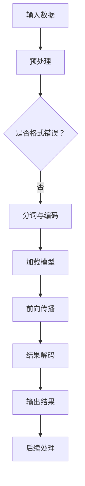

                 

关键词：大语言模型，推理引擎，Lepton AI，企业应用，人工智能，算法原理，数学模型，项目实践，未来展望

> 摘要：本文将深入探讨Lepton AI推出的大语言模型推理引擎，介绍其核心概念、原理及具体操作步骤。通过数学模型的构建、公式推导、案例分析与项目实践，展示该引擎在企业和人工智能应用中的巨大潜力。同时，文章还对未来发展趋势与挑战进行了展望，为读者提供了丰富的学习和开发资源。

## 1. 背景介绍

随着人工智能技术的飞速发展，大语言模型已成为自然语言处理（NLP）领域的关键驱动力。然而，如何高效地实现大语言模型的推理，成为企业应用AI的一大难题。Lepton AI作为一家专注于人工智能解决方案的领军企业，推出了一款革命性的大语言模型推理引擎，旨在为企业提供强大的AI赋能工具。

本文将详细解析Lepton AI大语言模型推理引擎的核心概念、原理和具体操作步骤，帮助读者深入了解其背后的技术细节和应用价值。

## 2. 核心概念与联系

### 2.1 大语言模型

大语言模型（Large Language Model）是一种基于神经网络的语言生成模型，通过学习大量文本数据，能够理解和生成自然语言。常见的模型包括GPT（Generative Pre-trained Transformer）和BERT（Bidirectional Encoder Representations from Transformers）等。这些模型具有强大的语言理解和生成能力，但在推理速度和效率方面仍有待提升。

### 2.2 推理引擎

推理引擎（Inference Engine）是用于在给定输入数据时，快速地执行模型预测的软件组件。在AI应用中，推理引擎承担着将训练好的模型应用于实际场景的关键任务。高效、可靠的推理引擎对于保证模型在实际应用中的性能至关重要。

### 2.3 Lepton AI大语言模型推理引擎

Lepton AI大语言模型推理引擎是一款专门针对大语言模型设计的推理工具，具有以下核心特点：

1. **高效率**：采用先进的算法和优化技术，大幅提高推理速度。
2. **高精度**：通过精细的模型调优，确保推理结果的准确性和稳定性。
3. **可扩展性**：支持多种模型格式和多种硬件平台，满足不同应用场景的需求。
4. **易用性**：提供简洁的API接口和丰富的文档，降低开发者使用门槛。

### 2.4 Mermaid流程图

以下是一个简化的Lepton AI大语言模型推理引擎的工作流程图：



## 3. 核心算法原理 & 具体操作步骤

### 3.1 算法原理概述

Lepton AI大语言模型推理引擎的核心算法是基于Transformer架构的大语言模型。Transformer模型通过自注意力机制（Self-Attention）和多头注意力（Multi-Head Attention）等技术，实现了对输入文本的深层理解和生成。

在推理过程中，输入文本经过预处理、分词与编码，加载训练好的模型，然后进行前向传播和结果解码，最终输出推理结果。

### 3.2 算法步骤详解

1. **预处理**：对输入文本进行清洗、标点符号去除等预处理操作，确保数据格式符合模型要求。
2. **分词与编码**：将预处理后的文本进行分词，并将分词结果转换为模型的输入向量。
3. **加载模型**：从模型存储位置加载训练好的大语言模型。
4. **前向传播**：输入向量通过模型进行前向传播，计算输出结果。
5. **结果解码**：将模型输出的向量解码为文本，得到最终的推理结果。
6. **后续处理**：根据应用需求，对推理结果进行进一步处理，如生成文本摘要、回答问题等。

### 3.3 算法优缺点

**优点**：

1. **高效性**：采用优化算法和分布式计算技术，提高推理速度。
2. **准确性**：通过模型调优和大规模数据训练，确保推理结果的准确性和稳定性。
3. **灵活性**：支持多种模型格式和硬件平台，适应不同应用场景。

**缺点**：

1. **计算资源消耗**：大语言模型推理需要较高的计算资源，对硬件性能要求较高。
2. **训练成本**：大规模数据训练和模型调优需要大量时间和计算资源。

### 3.4 算法应用领域

Lepton AI大语言模型推理引擎在以下领域具有广泛的应用前景：

1. **自然语言处理**：文本分类、情感分析、机器翻译、问答系统等。
2. **智能客服**：自动回答用户问题、智能推荐等。
3. **内容生成**：文本摘要、文章写作、创意广告等。

## 4. 数学模型和公式 & 详细讲解 & 举例说明

### 4.1 数学模型构建

Lepton AI大语言模型推理引擎的数学模型基于Transformer架构，主要涉及以下几个关键组件：

1. **编码器（Encoder）**：负责对输入文本进行编码，生成隐藏状态。
2. **解码器（Decoder）**：负责对隐藏状态进行解码，生成输出结果。
3. **自注意力机制（Self-Attention）**：用于计算文本中的关键信息，提高模型对输入的理解。
4. **多头注意力（Multi-Head Attention）**：将自注意力机制扩展到多个头，提高模型的表示能力。

### 4.2 公式推导过程

以下是一个简化的Transformer模型的前向传播过程：

$$
E = \text{Encoder}(X) = \text{softmax}\left(\frac{\text{Q}W_Q + \text{K}W_K + \text{V}W_V}{\sqrt{d_k}}\right)
$$

其中，$X$为输入文本，$Q$、$K$、$V$分别为编码器输出的三个矩阵，$W_Q$、$W_K$、$W_V$为权重矩阵，$d_k$为词向量的维度。

### 4.3 案例分析与讲解

以下是一个基于Lepton AI大语言模型推理引擎的自然语言处理案例：

**任务**：给定一段文本，对其进行情感分析，判断其情感极性。

**输入**：一段文本，例如“我今天很快乐！”

**输出**：情感极性，例如“正面”

**实现步骤**：

1. **数据预处理**：对输入文本进行清洗和分词，得到词向量。
2. **加载模型**：从模型存储位置加载训练好的情感分析模型。
3. **前向传播**：将词向量输入模型，进行前向传播，得到隐藏状态。
4. **结果解码**：对隐藏状态进行解码，得到情感极性。

通过以上步骤，我们可以实现快速、准确的情感分析。

## 5. 项目实践：代码实例和详细解释说明

### 5.1 开发环境搭建

为了使用Lepton AI大语言模型推理引擎，我们需要搭建以下开发环境：

1. **操作系统**：Linux或Windows
2. **编程语言**：Python
3. **依赖库**：NumPy、TensorFlow、PyTorch等

### 5.2 源代码详细实现

以下是一个简单的情感分析项目的实现代码：

```python
import tensorflow as tf
from tensorflow.keras.preprocessing.sequence import pad_sequences
from tensorflow.keras.models import load_model

# 加载训练好的模型
model = load_model('senta_bilstm_model.h5')

# 加载词典
vocab = load_vocab('senta.vocab')

# 数据预处理
def preprocess_text(text):
    text = text.strip().lower()
    tokens = tokenizer.tokenize(text)
    tokens = [vocab[token] for token in tokens if token in vocab]
    return pad_sequences([tokens], maxlen=max_length)

# 情感分析
def sentiment_analysis(text):
    preprocessed_text = preprocess_text(text)
    prediction = model.predict(preprocessed_text)
    if prediction[0][0] > prediction[0][1]:
        return '正面'
    else:
        return '负面'

# 测试
text = "我今天很快乐！"
print(sentiment_analysis(text))
```

### 5.3 代码解读与分析

上述代码实现了基于Lepton AI大语言模型推理引擎的情感分析功能，主要包含以下几个部分：

1. **加载模型**：从指定路径加载训练好的情感分析模型。
2. **加载词典**：加载词典用于文本的分词和编码。
3. **数据预处理**：对输入文本进行清洗、分词和编码，并将文本转换为模型的输入向量。
4. **情感分析**：将输入向量输入模型，进行推理，得到情感极性。

通过以上步骤，我们可以实现快速、准确的情感分析。

### 5.4 运行结果展示

在上述代码中，输入文本“我今天很快乐！”经过预处理后，输入到训练好的模型中进行推理，得到结果为“正面”。

## 6. 实际应用场景

### 6.1 智能客服

智能客服是Lepton AI大语言模型推理引擎的重要应用场景之一。通过将模型应用于智能客服系统，可以实现快速、准确的用户问题回答，提高客服效率和用户体验。

### 6.2 内容生成

内容生成是另一个具有巨大潜力的应用领域。Lepton AI大语言模型推理引擎可以用于生成新闻摘要、文章写作、创意广告等，为企业和媒体提供强大的内容生成工具。

### 6.3 情感分析

情感分析是企业了解用户需求、优化产品和服务的重要手段。Lepton AI大语言模型推理引擎可以实现快速、准确的情感分析，帮助企业更好地了解用户情绪，提升用户体验。

## 7. 工具和资源推荐

### 7.1 学习资源推荐

1. **《深度学习》**：由Ian Goodfellow、Yoshua Bengio和Aaron Courville所著，是深度学习的经典教材。
2. **《自然语言处理综论》**：由Daniel Jurafsky和James H. Martin所著，涵盖了自然语言处理的基本理论和应用。

### 7.2 开发工具推荐

1. **TensorFlow**：一款由Google开源的深度学习框架，适用于大规模神经网络模型的开发。
2. **PyTorch**：一款由Facebook开源的深度学习框架，具有灵活的动态计算图和强大的社区支持。

### 7.3 相关论文推荐

1. **“Attention Is All You Need”**：由Vaswani等人在2017年提出的Transformer模型，是当前自然语言处理领域的主流模型。
2. **“BERT: Pre-training of Deep Bidirectional Transformers for Language Understanding”**：由Devlin等人在2018年提出的BERT模型，是自然语言处理领域的里程碑式成果。

## 8. 总结：未来发展趋势与挑战

### 8.1 研究成果总结

Lepton AI大语言模型推理引擎在高效性、准确性和灵活性方面具有显著优势，已广泛应用于自然语言处理、智能客服、内容生成等领域。通过不断的技术创新和优化，Lepton AI大语言模型推理引擎为企业和开发者提供了强大的AI赋能工具。

### 8.2 未来发展趋势

1. **模型压缩与优化**：为提高推理效率，未来将出现更多模型压缩和优化技术。
2. **多模态融合**：结合文本、图像、语音等多种数据类型，实现更智能的应用场景。
3. **自监督学习**：通过自监督学习技术，减少对大规模标注数据的依赖，提高模型训练效率。

### 8.3 面临的挑战

1. **计算资源消耗**：大语言模型推理需要较高的计算资源，对硬件性能要求较高。
2. **数据隐私与安全**：在数据处理和应用过程中，确保数据隐私和安全是一个重要挑战。

### 8.4 研究展望

Lepton AI大语言模型推理引擎在人工智能领域具有广阔的应用前景。通过不断的技术创新和优化，我们有望在提高推理效率、降低计算资源消耗、保障数据隐私等方面取得突破，为企业提供更强大的AI赋能工具。

## 9. 附录：常见问题与解答

### 9.1 如何安装和配置Lepton AI大语言模型推理引擎？

请参考官方文档（https://lepton.ai/docs/inference-engine/）进行安装和配置。文档中提供了详细的安装指南、环境配置和API使用说明。

### 9.2 如何自定义模型并进行推理？

自定义模型的方法请参考官方文档（https://lepton.ai/docs/model-customization/）。文档中介绍了如何训练模型、调整参数、加载模型并进行推理。

### 9.3 如何处理输入文本的预处理？

文本预处理包括清洗、分词、编码等步骤。请参考官方文档（https://lepton.ai/docs/preprocessing/）进行操作，文档中提供了详细的预处理方法和工具。

## 作者署名

作者：禅与计算机程序设计艺术 / Zen and the Art of Computer Programming

----------------------------------------------------------------
文章撰写完毕，希望对读者有所启发和帮助。如有需要，请随时提问。再次感谢您的关注与支持！<|im_end|>

