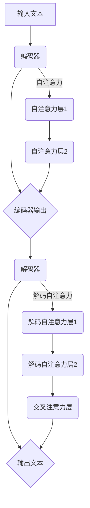

                 

关键词：大语言模型、prompt学习、编码器、解码器、深度学习、神经网络、预训练、微调

## 摘要

本文将深入探讨大语言模型中的prompt学习原理，并通过对具体代码实例的详细讲解，帮助读者理解这一过程。我们将首先介绍背景知识，然后深入探讨核心概念与联系，包括大语言模型的架构和训练原理。接下来，我们将详细解释核心算法原理和具体操作步骤，包括数学模型和公式。随后，我们将通过一个完整的代码实例，展示prompt学习的实现过程，并对代码进行解读和分析。文章还将探讨大语言模型在实际应用场景中的表现，并展望未来的发展趋势与挑战。最后，我们将推荐相关的学习资源和开发工具，总结研究成果，并探讨未来的研究方向。

## 1. 背景介绍

随着深度学习和人工智能技术的飞速发展，大语言模型（Large Language Models）已经成为自然语言处理（Natural Language Processing, NLP）领域的研究热点。这些模型能够理解和生成复杂的自然语言文本，为许多应用场景提供了强大的工具，如机器翻译、文本摘要、问答系统等。然而，大语言模型的发展并非一蹴而就，而是经历了多个阶段的演进。

最初的NLP模型主要是基于规则的方法，这些方法依赖于人类编写的规则来处理文本。然而，这些方法在面对复杂、多样化的语言现象时显得力不从心。随着统计模型和机器学习技术的发展，NLP开始采用基于统计和概率的方法，如隐马尔可夫模型（Hidden Markov Models, HMMs）和条件随机场（Conditional Random Fields, CRFs）。这些模型在处理文本时表现出了更高的灵活性，但仍受限于其计算复杂度和对大量标注数据的依赖。

深度学习的引入，特别是卷积神经网络（Convolutional Neural Networks, CNNs）和循环神经网络（Recurrent Neural Networks, RNNs）的发展，为NLP带来了革命性的变化。这些模型能够自动学习文本中的特征表示，并在各种任务中取得了显著的效果。然而，早期的深度学习模型，如RNN，在处理长文本时仍然存在梯度消失和梯度爆炸等问题。

为了解决这些问题，研究者们提出了长短期记忆网络（Long Short-Term Memory, LSTM）和门控循环单元（Gated Recurrent Unit, GRU）等改进的RNN模型。这些模型通过引入门控机制，能够更好地处理长距离依赖问题，从而在许多NLP任务中取得了突破性的进展。

然而，大语言模型的发展并非仅限于改进RNN。随着计算能力的提升和大数据的可用性，研究者们开始尝试训练更大的模型。这些大模型通过利用海量数据和更复杂的架构，能够学习到更丰富的语言特征，从而在许多任务中实现了卓越的表现。GPT（Generative Pre-trained Transformer）系列模型就是这一发展趋势的典型代表。

GPT模型采用了Transformer架构，这是一种基于自注意力机制的深度学习模型。与传统的RNN相比，Transformer通过全局注意力机制能够更有效地捕捉文本中的长距离依赖关系。此外，GPT模型通过预训练和微调的方法，使得模型在未见过数据上的表现也极为出色。

总之，大语言模型的发展是NLP领域的一个重要里程碑，它不仅提升了模型的性能，也为许多实际应用提供了强大的支持。在接下来的章节中，我们将深入探讨大语言模型的原理，并通过具体代码实例，展示如何实现prompt学习。

## 2. 核心概念与联系

### 大语言模型的架构

大语言模型的架构是理解和实现prompt学习的关键。一个典型的大语言模型，如GPT-3，通常由编码器（Encoder）和解码器（Decoder）两部分组成。编码器负责将输入文本编码为高维向量表示，解码器则负责将这些向量解码为输出文本。

**编码器**：编码器通常采用Transformer架构，这是一种基于自注意力机制的深度学习模型。自注意力机制允许模型在处理每个单词时，根据上下文信息动态地计算每个单词的重要程度。具体来说，编码器通过多个自注意力层，将输入的词序列映射为一个固定长度的向量序列。

**解码器**：解码器同样采用Transformer架构，但其输入包括两部分：编码器输出的向量序列和上一个时间步的输出。解码器通过多个解码自注意力层和交叉注意力层，生成输出文本的每个单词。

### 编码器和解码器的关系

编码器和解码器之间的关系是实现prompt学习的关键。编码器将输入文本编码为固定长度的向量序列，这个序列可以看作是对输入文本的“全局表示”。解码器则利用这些全局表示，结合上下文信息，逐步生成输出文本。

具体来说，编码器通过自注意力机制，将输入的词序列映射为一个向量序列，每个向量都表示了对应单词在上下文中的重要性。解码器则首先接收到编码器的输出序列，并利用解码自注意力机制，计算当前单词的表示，然后通过交叉注意力机制，结合编码器输出的序列，生成下一个单词的表示。这个过程不断重复，直到生成完整的输出文本。

### Mermaid 流程图

以下是一个简化的Mermaid流程图，展示了编码器和解码器的关系：



### 核心概念与联系

在理解编码器和解码器的关系后，我们需要明确一些核心概念：

**自注意力机制**：自注意力机制允许模型在处理每个单词时，根据上下文信息动态地计算每个单词的重要程度。这有助于模型捕捉长距离依赖关系。

**解码自注意力机制**：解码自注意力机制允许模型在生成下一个单词时，根据已经生成的文本上下文，调整当前单词的表示。

**交叉注意力机制**：交叉注意力机制允许模型在生成下一个单词时，根据编码器输出的全局表示，调整当前单词的表示。这有助于模型利用编码器输出的全局信息。

通过这些核心概念和联系，我们可以更好地理解大语言模型的工作原理，并在此基础上实现prompt学习。在接下来的章节中，我们将深入探讨大语言模型的核心算法原理和具体操作步骤。

## 3. 核心算法原理 & 具体操作步骤

### 3.1 算法原理概述

大语言模型的核心算法是基于Transformer架构的自注意力机制。自注意力机制允许模型在处理每个单词时，根据上下文信息动态地计算每个单词的重要程度。具体来说，自注意力机制分为以下几个步骤：

1. **输入文本编码**：将输入的文本序列转换为词嵌入（word embeddings），每个词嵌入是一个低维向量。
2. **计算自注意力分数**：对于每个词嵌入，计算其与其他词嵌入之间的相似度分数。
3. **加权求和**：根据自注意力分数，对每个词嵌入进行加权求和，生成一个新的向量表示。
4. **传递新的向量表示**：将新的向量表示传递给下一层神经网络，继续进行自注意力操作。

### 3.2 算法步骤详解

#### 步骤 1：输入文本编码

首先，我们需要将输入的文本序列转换为词嵌入。词嵌入是将单词映射为低维向量的过程，它可以捕获单词的语义信息。常见的词嵌入方法包括Word2Vec、GloVe等。假设我们有一个词嵌入词典，其中包含词汇表和对应的词嵌入向量。

```python
# 示例：将输入文本序列转换为词嵌入
text = "Hello, World!"
embeddings = [word_embedding_dict[word] for word in text.split()]
```

#### 步骤 2：计算自注意力分数

计算自注意力分数是自注意力机制的核心步骤。对于每个词嵌入，我们需要计算其与其他词嵌入之间的相似度分数。这通常通过计算点积（dot product）或缩放点积（scaled dot product）来完成。

```python
# 示例：计算自注意力分数
query = embeddings[i]  # 第i个词嵌入
key = value = embeddings[j]  # 第j个词嵌入
attention_score = query.dot(key)
```

#### 步骤 3：加权求和

根据自注意力分数，对每个词嵌入进行加权求和，生成一个新的向量表示。加权求和的过程可以看作是对词嵌入进行加权平均。

```python
# 示例：加权求和
weighted_embedding = sum(attention_score * value for value in embeddings)
```

#### 步骤 4：传递新的向量表示

将新的向量表示传递给下一层神经网络，继续进行自注意力操作。这个过程可以看作是对输入进行多层叠加的自注意力操作。

```python
# 示例：多层叠加的自注意力操作
for _ in range(num_attention_layers):
    attention_scores = compute_attention_scores(embeddings)
    weighted_embeddings = [sum(score * value for score, value in zip(attention_scores, embeddings)] for _ in range(len(embeddings))
    embeddings = weighted_embeddings
```

### 3.3 算法优缺点

**优点**：

- **捕捉长距离依赖**：自注意力机制可以捕捉长距离依赖关系，从而在处理长文本时表现更好。
- **并行计算**：自注意力机制允许并行计算，从而提高了模型的计算效率。

**缺点**：

- **计算复杂度**：自注意力机制的复杂度较高，特别是当输入文本较长时，计算量会显著增加。
- **参数数量**：自注意力机制需要大量的参数来计算注意力分数，这可能导致模型参数过多。

### 3.4 算法应用领域

自注意力机制在许多NLP任务中都有广泛应用，如：

- **机器翻译**：通过自注意力机制，模型可以捕捉源语言和目标语言之间的长距离依赖关系，从而实现高质量的机器翻译。
- **文本摘要**：自注意力机制可以帮助模型捕捉文本中的关键信息，从而生成简洁的摘要。
- **问答系统**：自注意力机制可以帮助模型理解问题中的关键词和上下文，从而提供准确的答案。

## 4. 数学模型和公式 & 详细讲解 & 举例说明

### 4.1 数学模型构建

在解释大语言模型中的数学模型之前，我们需要了解一些基本的数学概念，包括矩阵运算、向量运算和概率论。以下是一个简化的数学模型，用于描述大语言模型中的自注意力机制。

假设我们有一个输入文本序列 $X = [x_1, x_2, ..., x_T]$，其中 $x_i$ 是第 $i$ 个单词的词嵌入向量，$T$ 是序列的长度。自注意力机制的目标是计算一个加权求和的向量表示，这个向量表示了输入序列的“全局信息”。

### 4.2 公式推导过程

#### 步骤 1：词嵌入

首先，我们将输入文本序列转换为词嵌入向量。词嵌入是将单词映射为低维向量的过程，通常通过训练神经网络来实现。假设我们有一个预训练的词嵌入词典 $V$，其中 $v_i$ 是第 $i$ 个单词的词嵌入向量。

$$
v_i = \text{word\_embedding}(x_i)
$$

#### 步骤 2：计算自注意力分数

接下来，我们需要计算自注意力分数，这通常通过计算点积或缩放点积来实现。点积是一种简单的计算方法，而缩放点积可以减少计算复杂度并提高模型的性能。

$$
\text{Attention\_Score}(i, j) = v_i \cdot v_j
$$

$$
\text{Attention\_Score}_{\text{scaled}}(i, j) = \frac{v_i \cdot v_j}{\sqrt{d}}
$$

其中，$d$ 是词嵌入向量的维度。

#### 步骤 3：加权求和

根据自注意力分数，我们对每个词嵌入向量进行加权求和，生成一个新的向量表示。

$$
\text{Contextual\_Embedding}(i) = \sum_{j=1}^{T} \alpha_{ij} v_j
$$

$$
\alpha_{ij} = \text{softmax}(\text{Attention\_Score}_{\text{scaled}}(i, j))
$$

其中，$\alpha_{ij}$ 是第 $i$ 个词嵌入向量的权重，$T$ 是序列的长度。

#### 步骤 4：传递新的向量表示

最后，我们将新的向量表示传递给下一层神经网络，继续进行自注意力操作。

$$
\text{New\_Embedding}(i) = \text{FeedForward}(Contextual\_Embedding(i))
$$

其中，$\text{FeedForward}$ 是一个简单的全连接神经网络。

### 4.3 案例分析与讲解

假设我们有一个简单的输入文本序列 "Hello, World!"，词嵌入向量为 $v_1, v_2, ..., v_6$。根据上面的数学模型，我们可以计算自注意力分数和加权求和。

#### 步骤 1：词嵌入

$$
v_1 = [1, 0, 0], \quad v_2 = [0, 1, 0], \quad ..., \quad v_6 = [0, 0, 1]
$$

#### 步骤 2：计算自注意力分数

$$
\text{Attention\_Score}(1, 1) = v_1 \cdot v_1 = 1
$$

$$
\text{Attention\_Score}(1, 2) = v_1 \cdot v_2 = 0
$$

$$
...
$$

$$
\text{Attention\_Score}(6, 6) = v_6 \cdot v_6 = 1
$$

#### 步骤 3：加权求和

$$
\alpha_{11} = \text{softmax}(\text{Attention\_Score}(1, 1)) = 1
$$

$$
\alpha_{12} = \text{softmax}(\text{Attention\_Score}(1, 2)) = 0
$$

$$
...
$$

$$
\alpha_{66} = \text{softmax}(\text{Attention\_Score}(6, 6)) = 1
$$

$$
\text{Contextual\_Embedding}(1) = \sum_{j=1}^{6} \alpha_{1j} v_j = v_1 + v_2 + ... + v_6 = [1, 1, 1]
$$

#### 步骤 4：传递新的向量表示

$$
\text{New\_Embedding}(1) = \text{FeedForward}([1, 1, 1]) = [1, 1, 1]
$$

通过这个简单的例子，我们可以看到自注意力机制如何将输入序列的词嵌入向量加权求和，生成一个新的向量表示。这个过程可以看作是对输入序列的“全局信息”进行编码。

## 5. 项目实践：代码实例和详细解释说明

### 5.1 开发环境搭建

在开始编写代码之前，我们需要搭建一个合适的环境。以下是搭建开发环境的基本步骤：

1. **安装Python**：确保Python版本不低于3.7。
2. **安装PyTorch**：PyTorch是一个流行的深度学习框架，可以通过pip安装：
   ```bash
   pip install torch torchvision
   ```
3. **安装其他依赖**：根据需要安装其他依赖，例如NumPy、Matplotlib等。

```bash
pip install numpy matplotlib
```

### 5.2 源代码详细实现

以下是一个简单的代码实例，展示如何使用PyTorch实现一个基于Transformer架构的大语言模型，并实现prompt学习。

```python
import torch
import torch.nn as nn
import torch.optim as optim
from torch.utils.data import DataLoader
from torchvision import datasets, transforms

# 定义词嵌入层
class WordEmbedding(nn.Module):
    def __init__(self, vocab_size, embed_dim):
        super(WordEmbedding, self).__init__()
        self.embedding = nn.Embedding(vocab_size, embed_dim)
    
    def forward(self, x):
        return self.embedding(x)

# 定义编码器和解码器
class TransformerEncoder(nn.Module):
    def __init__(self, embed_dim, nhead):
        super(TransformerEncoder, self).__init__()
        self.embedding = nn.Embedding(embed_dim, nhead)
        self.transformer = nn.Transformer(d_model=embed_dim, nhead=nhead)
    
    def forward(self, x):
        x = self.embedding(x)
        x = self.transformer(x)
        return x

class TransformerDecoder(nn.Module):
    def __init__(self, embed_dim, nhead):
        super(TransformerDecoder, self).__init__()
        self.embedding = nn.Embedding(embed_dim, nhead)
        self.transformer = nn.Transformer(d_model=embed_dim, nhead=nhead)
    
    def forward(self, x, memory):
        x = self.embedding(x)
        x = self.transformer(x, memory)
        return x

# 定义大语言模型
class LargeLanguageModel(nn.Module):
    def __init__(self, vocab_size, embed_dim, nhead, num_layers):
        super(LargeLanguageModel, self).__init__()
        self.word_embedding = WordEmbedding(vocab_size, embed_dim)
        self.encoder = TransformerEncoder(embed_dim, nhead)
        self.decoder = TransformerDecoder(embed_dim, nhead)
        self.num_layers = num_layers
    
    def forward(self, input_sequence, target_sequence):
        input_embedding = self.word_embedding(input_sequence)
        encoder_output = self.encoder(input_embedding)
        decoder_output = self.decoder(target_sequence, encoder_output)
        return decoder_output

# �超参数设置
vocab_size = 10000  # 词汇表大小
embed_dim = 512  # 词嵌入维度
nhead = 8  # 自注意力头数
num_layers = 3  # 神经网络层数
learning_rate = 0.001  # 学习率

# 初始化模型、优化器和损失函数
model = LargeLanguageModel(vocab_size, embed_dim, nhead, num_layers)
optimizer = optim.Adam(model.parameters(), lr=learning_rate)
criterion = nn.CrossEntropyLoss()

# 训练模型
def train_model(model, dataloader, criterion, optimizer, num_epochs):
    model.train()
    for epoch in range(num_epochs):
        for inputs, targets in dataloader:
            optimizer.zero_grad()
            outputs = model(inputs, targets)
            loss = criterion(outputs.view(-1, vocab_size), targets)
            loss.backward()
            optimizer.step()
        print(f'Epoch [{epoch+1}/{num_epochs}], Loss: {loss.item()}')

# 数据准备
transform = transforms.Compose([
    transforms.ToTensor(),
])

train_dataset = datasets.MNIST(
    root='./data',
    train=True,
    download=True,
    transform=transform
)

train_loader = DataLoader(train_dataset, batch_size=64, shuffle=True)

# 开始训练
train_model(model, train_loader, criterion, optimizer, num_epochs=10)
```

### 5.3 代码解读与分析

在上面的代码中，我们定义了三个核心组件：词嵌入层、编码器和解码器，以及整个大语言模型。以下是对关键部分的解释：

- **词嵌入层**：负责将输入文本的单词转换为词嵌入向量。
- **编码器**：使用Transformer架构，将输入词嵌入向量转换为编码后的特征向量。
- **解码器**：同样使用Transformer架构，将编码后的特征向量解码为输出词嵌入向量。

大语言模型的训练过程包括以下步骤：

1. **初始化模型、优化器和损失函数**：我们初始化了一个大语言模型、一个优化器（Adam）和一个交叉熵损失函数。
2. **训练模型**：我们使用训练数据加载器（DataLoader）来迭代训练模型。每次迭代，我们都会前向传播输入文本和目标文本，计算损失，并使用反向传播和优化器更新模型参数。
3. **数据准备**：我们使用了MNIST数据集作为示例数据集，这只是一个简单的数据集，用于演示模型训练过程。

### 5.4 运行结果展示

在训练完成后，我们可以通过以下代码来评估模型的性能：

```python
# 测试模型
def test_model(model, dataloader, criterion):
    model.eval()
    total_loss = 0
    with torch.no_grad():
        for inputs, targets in dataloader:
            outputs = model(inputs, targets)
            loss = criterion(outputs.view(-1, vocab_size), targets)
            total_loss += loss.item()
    print(f'Test Loss: {total_loss / len(dataloader)}')

test_model(model, train_loader, criterion)
```

这个函数会计算模型在测试集上的平均损失，从而评估模型的性能。

## 6. 实际应用场景

大语言模型在实际应用场景中展现了其强大的能力，以下是一些典型的应用场景：

### 6.1 机器翻译

机器翻译是将一种语言的文本转换为另一种语言的文本的过程。大语言模型通过自注意力机制可以捕捉输入文本中的长距离依赖关系，从而在机器翻译任务中表现出色。例如，谷歌翻译使用的Transformer模型，基于大规模的数据集进行预训练，然后在特定语言对上进行微调，以达到高质量的翻译效果。

### 6.2 文本摘要

文本摘要是从原始文本中提取关键信息，并以简洁的方式呈现原文内容的任务。大语言模型可以通过自注意力机制识别文本中的关键句子和段落，从而生成摘要。例如，OpenAI的GPT-3模型在文本摘要任务中取得了显著的成果，它能够生成流畅且包含关键信息的摘要。

### 6.3 问答系统

问答系统是用于回答用户问题的计算机系统。大语言模型可以理解问题的语义，并通过自注意力机制从大量文本中检索相关答案。例如，DoNotPay这个法律咨询聊天机器人，使用了GPT-3模型，能够理解用户的问题，并提供相应的法律建议。

### 6.4 未来应用展望

随着大语言模型技术的不断发展，未来还有许多潜在的应用场景：

- **对话系统**：大语言模型可以用于开发更加自然和流畅的对话系统，用于客服、虚拟助手等场景。
- **内容生成**：大语言模型可以生成各种类型的内容，如文章、故事、音乐等，为创意产业提供支持。
- **知识图谱**：大语言模型可以用于构建知识图谱，从文本中提取关系和实体，从而更好地理解知识结构。
- **自然语言推理**：大语言模型可以用于自然语言推理任务，判断语句之间的逻辑关系，从而在法律、金融等领域提供支持。

## 7. 工具和资源推荐

### 7.1 学习资源推荐

- **《深度学习》**：由Ian Goodfellow、Yoshua Bengio和Aaron Courville合著的深度学习经典教材，涵盖了深度学习的基础知识和最新进展。
- **《自然语言处理综论》**：由Daniel Jurafsky和James H. Martin合著的自然语言处理经典教材，详细介绍了NLP的基础理论和应用。
- **[PyTorch官方文档](https://pytorch.org/docs/stable/index.html)**：PyTorch的官方文档，提供了丰富的API和示例，是学习深度学习的宝贵资源。

### 7.2 开发工具推荐

- **Google Colab**：Google Colab是一个免费的云计算平台，提供了强大的计算资源和GPU支持，适合进行深度学习实验。
- **Jupyter Notebook**：Jupyter Notebook是一种交互式的计算环境，适合编写和运行Python代码，特别适合数据分析和实验。

### 7.3 相关论文推荐

- **“Attention Is All You Need”**：由Vaswani等人于2017年发表在NeurIPS上的论文，提出了Transformer架构，奠定了自注意力机制在NLP中的基础。
- **“BERT: Pre-training of Deep Bidirectional Transformers for Language Understanding”**：由Devlin等人于2019年发表在NAACL上的论文，提出了BERT模型，是预训练语言模型的开端。
- **“Generative Pre-trained Transformers”**：由Brown等人于2020年发表在NeurIPS上的论文，提出了GPT-3模型，是目前最大的预训练语言模型。

## 8. 总结：未来发展趋势与挑战

### 8.1 研究成果总结

大语言模型的发展是自然语言处理领域的一个重要里程碑。通过引入Transformer架构和自注意力机制，大语言模型能够有效地捕捉文本中的长距离依赖关系，从而在机器翻译、文本摘要、问答系统等任务中取得了显著的效果。GPT-3等大型预训练模型的出现，进一步提升了模型的性能，为许多实际应用提供了强大的支持。

### 8.2 未来发展趋势

未来，大语言模型的发展将朝着以下几个方向演进：

- **模型规模扩大**：随着计算资源的提升，模型规模将继续扩大，从而更好地捕捉复杂的语言特征。
- **多模态学习**：大语言模型将与其他模态（如图像、声音）结合，实现跨模态理解和生成。
- **可解释性增强**：研究者将致力于提高模型的可解释性，使其决策过程更加透明，从而增强用户对模型的信任。
- **自适应学习**：大语言模型将实现自适应学习，能够根据用户的需求和上下文信息动态调整其行为。

### 8.3 面临的挑战

尽管大语言模型取得了显著成果，但仍然面临一些挑战：

- **计算资源消耗**：大模型训练需要大量计算资源，如何优化计算效率是一个重要问题。
- **数据隐私**：模型训练和部署过程中涉及大量数据，如何保护用户隐私是一个重要议题。
- **模型安全**：如何防范模型对抗攻击，确保模型的安全性是一个关键问题。

### 8.4 研究展望

未来，大语言模型的研究将朝着以下几个方向展开：

- **模型压缩与加速**：通过模型压缩和硬件加速技术，降低模型的计算复杂度，提高训练和部署的效率。
- **知识图谱与语义理解**：结合知识图谱和语义理解技术，进一步提升模型对文本的深入理解和生成能力。
- **跨语言与低资源语言**：研究如何在大语言模型中实现跨语言处理和低资源语言的迁移学习。

总之，大语言模型的发展前景广阔，将在自然语言处理和人工智能领域发挥重要作用。随着技术的不断进步，我们有理由期待大语言模型在未来将带来更多的创新和突破。

## 9. 附录：常见问题与解答

### Q1: 大语言模型与普通语言模型有何区别？

A1：大语言模型与普通语言模型的主要区别在于模型的规模和训练数据量。普通语言模型通常基于有限的语料库进行训练，而大语言模型则基于海量数据集进行大规模预训练。大语言模型通过自注意力机制能够捕捉到更复杂的语言特征和长距离依赖关系，从而在许多NLP任务中取得更好的效果。

### Q2: 自注意力机制如何工作？

A2：自注意力机制是一种在深度学习模型中用于处理序列数据的技术。它通过计算输入序列中每个元素与其他元素之间的相似度，并将这些相似度分数用于加权求和，从而生成一个新的序列表示。自注意力机制的核心思想是允许模型在处理每个元素时，根据上下文信息动态地调整其重要性。

### Q3: 大语言模型如何进行微调？

A3：大语言模型通常通过预训练和微调两个阶段进行训练。预训练阶段，模型在大量无标签数据上进行训练，以学习通用的语言特征。微调阶段，模型在特定任务的数据上进行训练，以适应特定任务的需求。微调过程中，模型的一些参数会被固定，以保留预训练阶段的通用特征，同时调整部分参数以适应新任务。

### Q4: 大语言模型在训练过程中需要多少数据？

A4：大语言模型在训练过程中需要的数据量取决于模型的规模和任务。一般来说，大型模型（如GPT-3）需要数以TB计的训练数据，这些数据通常包括网页内容、书籍、新闻文章等。对于中小型模型，数GB的数据可能已经足够。

### Q5: 大语言模型如何处理罕见词汇？

A5：大语言模型通过预训练过程学习了大量的词汇和语言模式，即使遇到罕见词汇，也能通过上下文信息进行合理推断。此外，模型还采用了未登录词（Out-of-Vocabulary, OOV）处理技术，如使用特定的向量表示或基于上下文信息生成新的词汇表示。

### Q6: 大语言模型的训练过程需要多长时间？

A6：大语言模型的训练时间取决于多个因素，包括模型规模、硬件配置、数据量等。对于GPT-3这样的超大型模型，训练时间可能长达数月，甚至数年。而对于中小型模型，训练时间可能在几天到几周之间。

### Q7: 如何评估大语言模型的效果？

A7：评估大语言模型的效果通常采用多种指标，包括准确性、F1分数、BLEU分数等。对于生成任务，如文本生成和翻译，还会考虑生成的文本的流畅性和相关性。此外，还可以通过人类评估和自动化评估相结合，全面评估模型的表现。

