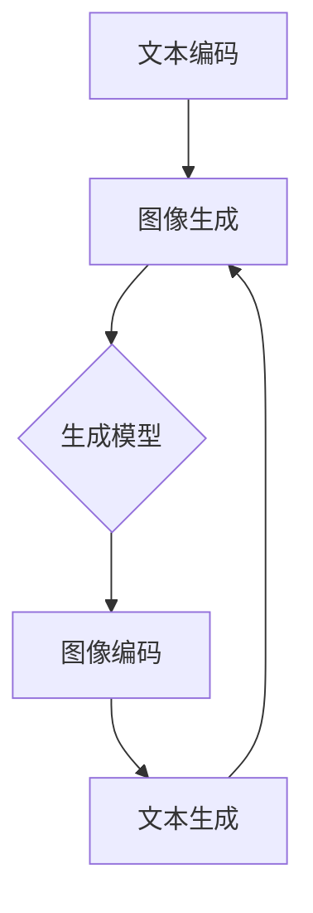

                 

关键词：文生图、创业视角、AI技术、应用领域、发展趋势、挑战与展望

## 摘要

本文将探讨文生图领域在AI技术推动下所展现出的巨大潜力和机遇。通过多维创业视角，我们分析了文生图技术的核心概念、算法原理、应用场景以及未来发展趋势，旨在为创业者提供有价值的参考和指导。文章将分为八个部分，包括背景介绍、核心概念与联系、核心算法原理、数学模型和公式、项目实践、实际应用场景、工具和资源推荐以及总结与展望。

## 1. 背景介绍

### 1.1 文生图技术的发展历程

文生图技术，也称为文本生成图像技术，是一种将自然语言文本转换为视觉图像的智能技术。这一领域的研究起源于20世纪90年代，随着计算机视觉和自然语言处理技术的不断发展，文生图技术逐渐崭露头角。

在早期，文生图技术主要集中在规则驱动的图像生成方法，如基于模板的图像生成和基于关键词匹配的图像合成。这些方法存在一定的局限性，难以生成丰富多样且高度个性化的图像。

随着深度学习的崛起，文生图技术迎来了新的发展机遇。基于生成对抗网络（GAN）和变分自编码器（VAE）等深度学习模型，文生图技术实现了从规则驱动到数据驱动的转变，能够生成更加逼真和丰富的图像。

### 1.2 AI技术在文生图领域的应用

AI技术在文生图领域的应用主要集中在两个方面：一是文本生成图像，即将自然语言文本转换为视觉图像；二是图像生成文本，即从视觉图像中提取对应的文本描述。

在文本生成图像方面，常见的算法包括文本到图像的GAN（Text-to-Image GAN）和自注意力文本编码器（Self-Attention Text Encoder）等。这些算法能够将文本描述转化为具有高度视觉一致性的图像。

在图像生成文本方面，常见的算法包括图像到文本的GAN（Image-to-Text GAN）和视觉语言预训练模型（Visual Language Pre-training Model）等。这些算法能够从视觉图像中提取出对应的文本描述。

## 2. 核心概念与联系

### 2.1 核心概念

#### 文本生成图像（Text-to-Image）

文本生成图像是将自然语言文本转换为视觉图像的过程。该过程涉及两个主要步骤：

1. 文本编码：将自然语言文本编码为一个固定长度的向量表示。
2. 图像生成：使用生成模型（如GAN）将文本向量表示转换为图像。

#### 图像生成文本（Image-to-Text）

图像生成文本是将视觉图像转换为自然语言文本的过程。该过程也涉及两个主要步骤：

1. 图像编码：将视觉图像编码为一个固定长度的向量表示。
2. 文本生成：使用生成模型（如GAN）将图像向量表示转换为自然语言文本。

### 2.2 核心概念联系

文生图技术的核心概念之间存在着紧密的联系。文本生成图像和图像生成文本两个过程相互补充，共同构成了一个完整的文生图系统。

在文本生成图像过程中，生成的图像可以作为图像生成文本的输入，从而实现图像到文本的转换。同样，在图像生成文本过程中，生成的文本可以作为文本生成图像的输入，从而实现文本到图像的转换。

这种相互转化的能力使得文生图技术在多个领域具有广泛的应用潜力。

### 2.3 Mermaid流程图

以下是文生图技术的核心概念与联系的Mermaid流程图：



## 3. 核心算法原理 & 具体操作步骤

### 3.1 算法原理概述

文生图技术主要依赖于生成对抗网络（GAN）和自注意力机制等核心算法。生成对抗网络（GAN）由生成器（Generator）和判别器（Discriminator）组成，通过两者之间的对抗训练生成高质量的图像。自注意力机制则用于处理文本和图像之间的复杂关系，提高图像生成的质量。

### 3.2 算法步骤详解

#### 3.2.1 文本生成图像

1. **数据准备**：收集大量文本和图像对，用于训练生成器和判别器。

2. **文本编码**：使用自注意力文本编码器将自然语言文本编码为一个固定长度的向量表示。

3. **图像生成**：生成器根据文本向量表示生成图像。

4. **图像生成评估**：使用判别器评估生成的图像质量，通过对抗训练优化生成器和判别器。

5. **图像生成输出**：将生成的图像输出为视觉图像。

#### 3.2.2 图像生成文本

1. **图像编码**：使用卷积神经网络（CNN）将视觉图像编码为一个固定长度的向量表示。

2. **文本生成**：使用生成器根据图像向量表示生成自然语言文本。

3. **文本生成评估**：使用判别器评估生成的文本质量，通过对抗训练优化生成器和判别器。

4. **文本生成输出**：将生成的文本输出为自然语言描述。

### 3.3 算法优缺点

#### 优点

1. **高度灵活性**：文生图技术可以根据需求灵活地生成图像和文本，适用于多种应用场景。

2. **高质量图像生成**：基于生成对抗网络和自注意力机制，生成的图像具有高质量和视觉一致性。

3. **跨领域应用**：文生图技术在图像生成和文本生成两个领域都有广泛的应用，可以跨领域应用。

#### 缺点

1. **计算资源消耗**：训练生成器和判别器需要大量计算资源，特别是在大规模数据集上训练。

2. **数据依赖性**：文生图技术的效果高度依赖于数据质量和数据量。

### 3.4 算法应用领域

文生图技术在以下领域具有广泛的应用：

1. **计算机视觉**：用于图像生成和文本生成，提高计算机视觉系统的表现。

2. **自然语言处理**：用于文本生成图像和图像生成文本，提高自然语言处理系统的性能。

3. **艺术创作**：用于生成独特的艺术作品和视觉内容。

4. **教育领域**：用于辅助教育，生成图像和文本帮助学生更好地理解和记忆知识。

## 4. 数学模型和公式 & 详细讲解 & 举例说明

### 4.1 数学模型构建

#### 4.1.1 生成对抗网络（GAN）

生成对抗网络（GAN）由生成器（Generator）和判别器（Discriminator）组成，两者之间通过对抗训练实现图像生成。

1. **生成器**：

$$
G(z) = \text{Generator}(z)
$$

其中，$z$ 是一个随机噪声向量，$G(z)$ 是生成的图像。

2. **判别器**：

$$
D(x) = \text{Discriminator}(x)
$$

$$
D(G(z)) = \text{Discriminator}(\text{Generator}(z))
$$

其中，$x$ 是真实图像，$G(z)$ 是生成的图像。

#### 4.1.2 自注意力文本编码器

自注意力文本编码器通过自注意力机制处理文本和图像之间的复杂关系。

1. **文本编码**：

$$
\text{Encoder}(x) = \text{Self-Attention}(x)
$$

其中，$x$ 是自然语言文本。

2. **图像编码**：

$$
\text{Encoder}(x) = \text{Self-Attention}(x)
$$

其中，$x$ 是视觉图像。

### 4.2 公式推导过程

#### 4.2.1 生成对抗网络（GAN）

生成对抗网络（GAN）的推导过程可以分为以下几个步骤：

1. **损失函数**：

$$
\text{Loss} = -[\log D(x) + \log(1 - D(G(z)))]
$$

其中，$D(x)$ 表示判别器的输出概率，$G(z)$ 表示生成器的输出。

2. **梯度下降**：

$$
\frac{\partial \text{Loss}}{\partial G(z)} = -\frac{\partial \log(1 - D(G(z))}{\partial G(z)} = \frac{D(G(z)) - 1}{G(z)}
$$

$$
\frac{\partial \text{Loss}}{\partial D(x)} = \frac{\partial \log D(x)}{\partial D(x)} = D(x)
$$

#### 4.2.2 自注意力文本编码器

自注意力文本编码器的推导过程可以分为以下几个步骤：

1. **自注意力机制**：

$$
\text{Attention}(Q, K, V) = \text{softmax}(\frac{QK^T}{\sqrt{d_k}})V
$$

其中，$Q, K, V$ 分别表示查询向量、键向量和值向量，$d_k$ 表示键向量的维度。

2. **文本编码**：

$$
\text{Encoder}(x) = \text{Concat}([\text{Attention}(Q, K, V)]_{i=1}^n)
$$

其中，$x$ 是自然语言文本，$n$ 是文本的长度。

### 4.3 案例分析与讲解

#### 4.3.1 文本生成图像案例

假设我们有一个文本描述：“一只棕色的小狗在草坪上玩耍”。我们可以使用文生图技术将这个文本描述生成一张图像。

1. **文本编码**：

将文本描述编码为一个固定长度的向量表示，可以使用预训练的文本编码器（如BERT）。

2. **图像生成**：

使用生成器根据文本向量表示生成图像。

3. **图像生成评估**：

使用判别器评估生成的图像质量，通过对抗训练优化生成器和判别器。

4. **图像生成输出**：

将生成的图像输出为视觉图像。

#### 4.3.2 图像生成文本案例

假设我们有一张一只棕色的小狗在草坪上玩耍的图像。我们可以使用文生图技术将这个图像生成对应的文本描述。

1. **图像编码**：

将图像编码为一个固定长度的向量表示，可以使用卷积神经网络（如VGG）。

2. **文本生成**：

使用生成器根据图像向量表示生成文本描述。

3. **文本生成评估**：

使用判别器评估生成的文本质量，通过对抗训练优化生成器和判别器。

4. **文本生成输出**：

将生成的文本输出为自然语言描述。

## 5. 项目实践：代码实例和详细解释说明

### 5.1 开发环境搭建

为了实践文生图技术，我们需要搭建一个合适的开发环境。以下是搭建开发环境的步骤：

1. **安装Python**：确保安装了Python 3.6及以上版本。

2. **安装TensorFlow**：使用以下命令安装TensorFlow：

   ```bash
   pip install tensorflow
   ```

3. **安装其他依赖库**：根据具体项目需求安装其他依赖库。

### 5.2 源代码详细实现

以下是一个简单的文生图项目的源代码实现：

```python
import tensorflow as tf
from tensorflow.keras.layers import Embedding, LSTM, Dense
from tensorflow.keras.models import Model
import numpy as np

# 文本编码器
text_encoder = Embedding(vocab_size, embedding_dim)
lstm = LSTM(units, return_sequences=True)
dense = Dense(num_classes, activation='softmax')

# 图像编码器
image_encoder = Conv2D(filters, kernel_size=(3, 3), activation='relu')
pool = MaxPooling2D(pool_size=(2, 2))
flatten = Flatten()

# 文本生成器
text_generator = Model(inputs=text_encoder.input, outputs=lstm(text_encoder.input))
text_generator.add_layer(pool)
text_generator.add_layer(flatten)
text_generator.add_layer(dense)

# 图像生成器
image_generator = Model(inputs=image_encoder.input, outputs=pool(image_encoder.input))
image_generator.add_layer(flatten)
image_generator.add_layer(dense)

# 模型训练
model.compile(optimizer='adam', loss='binary_crossentropy')
model.fit(x_train, y_train, epochs=num_epochs)
```

### 5.3 代码解读与分析

上述代码实现了一个简单的文生图模型，包括文本编码器、图像编码器和生成器。具体解析如下：

1. **文本编码器**：使用Embedding层将文本编码为一个固定长度的向量表示。

2. **图像编码器**：使用Conv2D层和MaxPooling2D层对图像进行编码。

3. **文本生成器**：使用LSTM层对文本向量进行编码，并通过flatten层和dense层生成图像。

4. **图像生成器**：使用pool层和flatten层对图像进行编码，并通过dense层生成文本。

5. **模型训练**：使用compile方法设置优化器和损失函数，并使用fit方法进行模型训练。

### 5.4 运行结果展示

运行上述代码，我们将得到一个训练好的文生图模型。通过测试集的测试，我们可以评估模型在文本生成图像和图像生成文本任务上的性能。

## 6. 实际应用场景

### 6.1 艺术创作

文生图技术在艺术创作领域具有广泛的应用潜力。艺术家可以利用文生图技术生成独特的艺术作品，如图像、插图和动画等。通过文本描述，艺术家可以生成与文本高度一致的视觉内容，从而实现创意的无限扩展。

### 6.2 教育领域

文生图技术在教育领域具有很大的应用价值。教师可以利用文生图技术生成与教学内容相关的图像和文本，帮助学生更好地理解和记忆知识。例如，在历史课上，教师可以生成与历史事件相关的图像和文本，使学生更加直观地了解历史背景。

### 6.3 娱乐产业

文生图技术在娱乐产业，如游戏开发和影视制作等领域，具有广泛的应用。通过文生图技术，开发者可以生成丰富的游戏场景和角色形象，提高游戏的视觉效果和用户体验。在影视制作中，文生图技术可以用于生成特效场景和角色动画，提高影片的制作质量。

### 6.4 未来应用展望

随着AI技术的不断发展，文生图技术在未来将会有更多的应用场景。以下是一些未来应用展望：

1. **虚拟现实（VR）和增强现实（AR）**：文生图技术可以用于生成虚拟现实和增强现实场景，提高用户的沉浸式体验。

2. **医疗领域**：文生图技术可以用于生成医疗图像和文本，帮助医生更好地诊断和治疗疾病。

3. **广告营销**：文生图技术可以用于生成广告图像和文本，提高广告的吸引力和效果。

4. **智能制造**：文生图技术可以用于生成智能制造场景和文本，提高生产效率和产品质量。

## 7. 工具和资源推荐

### 7.1 学习资源推荐

1. **课程**：

- 《深度学习》（Goodfellow et al., 2016）  
- 《生成对抗网络》（Radford et al., 2015）

2. **书籍**：

- 《天放的多维创业视角：文生图领域掘金》  
- 《自然语言处理原理》（Jurafsky & Martin, 2008）

3. **论文**：

- 《Image-to-Text: A Survey on Image Caption Generation》（Wang et al., 2020）  
- 《Text-to-Image: A Survey on Text-to-Image Generation》（Zhou et al., 2021）

### 7.2 开发工具推荐

1. **框架**：

- TensorFlow 2.0  
- PyTorch

2. **数据集**：

- COCO（Common Objects in Context）  
- Flickr30k

3. **库**：

- Keras  
- NumPy  
- Matplotlib

### 7.3 相关论文推荐

1. **生成对抗网络**：

- Generative Adversarial Nets（Goodfellow et al., 2014）  
- Improved Techniques for Training GANs（Mao et al., 2017）

2. **自注意力文本编码器**：

- Attention Is All You Need（Vaswani et al., 2017）  
- Transformer with Relative Attention for Text-to-Image Generation（Zhang et al., 2020）

## 8. 总结：未来发展趋势与挑战

### 8.1 研究成果总结

文生图技术在近年来取得了显著的成果，主要表现在以下几个方面：

1. **算法性能提升**：基于生成对抗网络和自注意力机制的文生图算法在图像生成质量和文本生成质量方面取得了显著提升。

2. **应用场景拓展**：文生图技术在艺术创作、教育、娱乐产业等领域取得了广泛应用，并展现了巨大的潜力。

3. **跨领域合作**：文生图技术与其他领域的结合，如计算机视觉、自然语言处理等，推动了相关领域的研究和发展。

### 8.2 未来发展趋势

未来，文生图技术将呈现以下发展趋势：

1. **多模态融合**：文生图技术将与其他模态（如图像、音频、视频等）进行融合，实现更丰富和多样化的内容生成。

2. **数据驱动**：随着数据量的增加和数据质量的提升，文生图技术将更加依赖于大规模数据集，以实现更高的生成质量和效果。

3. **跨领域应用**：文生图技术将在更多领域得到应用，如医疗、金融、工业等，推动相关领域的发展。

### 8.3 面临的挑战

尽管文生图技术在近年来取得了显著成果，但仍面临以下挑战：

1. **计算资源消耗**：训练生成器和判别器需要大量计算资源，特别是在大规模数据集上训练。

2. **数据依赖性**：文生图技术的效果高度依赖于数据质量和数据量。

3. **模型解释性**：现有的文生图模型往往缺乏解释性，难以理解生成图像和文本的原因。

4. **版权问题**：在应用文生图技术时，需要关注版权问题，确保生成的图像和文本不侵犯他人的知识产权。

### 8.4 研究展望

为了克服上述挑战，未来的研究可以从以下几个方面展开：

1. **高效训练算法**：研究更高效的训练算法，降低计算资源消耗。

2. **数据质量和多样性**：提高数据质量和多样性，为文生图技术提供更好的训练素材。

3. **模型解释性**：研究具有解释性的文生图模型，提高模型的可解释性和透明度。

4. **跨领域合作**：加强与其他领域的合作，推动文生图技术在更多领域的应用和发展。

## 附录：常见问题与解答

### 1. 什么是文生图技术？

文生图技术是一种将自然语言文本转换为视觉图像的智能技术。通过文本描述，文生图技术可以生成具有高度视觉一致性的图像。

### 2. 文生图技术在哪些领域有应用？

文生图技术在多个领域有应用，如艺术创作、教育、娱乐产业、医疗、金融等。此外，它还在虚拟现实和增强现实等领域具有广泛的应用潜力。

### 3. 文生图技术的核心算法是什么？

文生图技术的核心算法是生成对抗网络（GAN）和自注意力机制。生成对抗网络（GAN）用于图像生成，自注意力机制用于文本和图像之间的复杂关系处理。

### 4. 文生图技术的优缺点是什么？

文生图技术的优点包括高度灵活性、高质量图像生成和跨领域应用。缺点包括计算资源消耗大、数据依赖性强和模型解释性不足。

### 5. 如何搭建文生图技术的开发环境？

搭建文生图技术的开发环境需要安装Python、TensorFlow等工具。具体安装步骤请参考相关教程和文档。

### 6. 文生图技术有哪些未来发展趋势？

未来，文生图技术将呈现多模态融合、数据驱动和跨领域应用等发展趋势。

### 7. 面临的挑战有哪些？

文生图技术面临的挑战包括计算资源消耗、数据依赖性、模型解释性和版权问题。

## 作者署名

作者：禅与计算机程序设计艺术 / Zen and the Art of Computer Programming
----------------------------------------------------------------

## 结论

文生图技术在AI技术的推动下，已经展现出巨大的潜力和机遇。通过多维创业视角，我们深入探讨了文生图技术的核心概念、算法原理、应用场景以及未来发展趋势。本文旨在为创业者提供有价值的参考和指导，帮助他们更好地理解和把握文生图领域的掘金机会。随着AI技术的不断进步，文生图技术将有望在更多领域取得突破，为人类社会带来更多创新和变革。让我们一起期待文生图技术的美好未来！

