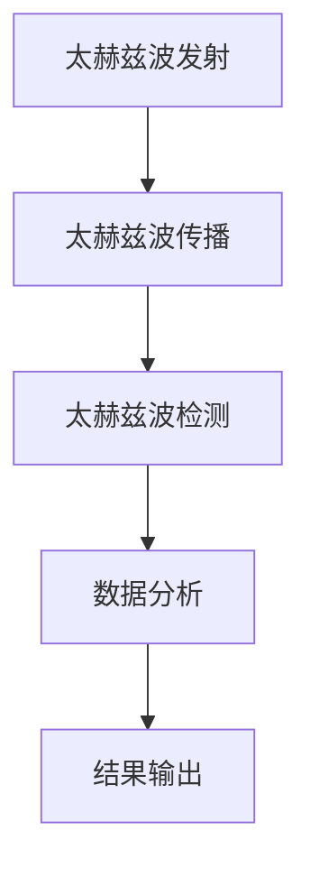

                 

 关键词：太赫兹技术、安检、非接触式扫描、人工智能、网络安全

> 摘要：本文深入探讨了太赫兹技术在安检领域的应用，特别是在实现非接触式扫描方面。通过介绍太赫兹波的基本原理、核心概念，以及在实际操作中的应用，本文分析了太赫兹技术在安检中的优势与挑战，并展望了其未来的发展趋势。

## 1. 背景介绍

随着科技的不断进步，安检技术也在不断发展与完善。传统的安检方法主要依赖于X射线、毫米波等电磁波技术，这些技术虽然在一定程度上能够检测出隐藏的物品，但存在一定的局限性。例如，X射线对人体的潜在危害、毫米波对金属物品的穿透能力不足等。为了解决这些问题，太赫兹技术逐渐引起了人们的关注。

太赫兹波（Terahertz waves）是一种频率介于微波和红外线之间的电磁波，其频率范围大约在0.1THz到10THz之间。太赫兹波具有穿透力强、分辨率高、非离子辐射等特点，这使得它在安检领域具有广泛的应用前景。

## 2. 核心概念与联系

### 2.1 太赫兹波的基本原理

太赫兹波作为一种电磁波，其本质与其他电磁波类似，都是电场和磁场的振荡。不同的是，太赫兹波的频率更高，波长更短。这种特性使得太赫兹波具有独特的物理性质，如强穿透力、高分辨率和非离子辐射。

### 2.2 太赫兹波的传播特性

太赫兹波的传播特性与其频率和波长密切相关。由于其频率高，波长短，太赫兹波在传播过程中容易受到材料表面的影响，具有较好的表面探测能力。此外，太赫兹波在穿透物体时，会因物体内部的密度和结构差异而产生反射和折射，这一特性被广泛应用于非接触式扫描技术。

### 2.3 太赫兹波的检测方法

太赫兹波的检测主要依赖于太赫兹时域光谱（Terahertz Time-Domain Spectroscopy, TDS）技术。TDS技术通过测量太赫兹波在样品表面和内部反射、透射等现象，获取样品的吸收谱、反射谱和透射谱，从而实现对样品的识别和分类。

### 2.4 太赫兹波的 Mermaid 流程图

下面是一个简单的 Mermaid 流程图，展示了太赫兹波的基本原理和检测方法：



## 3. 核心算法原理 & 具体操作步骤

### 3.1 算法原理概述

太赫兹技术在安检中的应用主要依赖于其非接触式扫描能力。具体来说，太赫兹波在穿透物体时，会因物体内部的密度和结构差异而产生反射和折射。这些反射和折射现象可以被太赫兹波检测器捕获，并通过算法处理，实现对物体的识别和分类。

### 3.2 算法步骤详解

1. **太赫兹波发射**：首先，利用太赫兹波发生器产生太赫兹波。
2. **太赫兹波传播**：将产生的太赫兹波照射到待检测物体上。
3. **太赫兹波检测**：利用太赫兹波检测器捕获太赫兹波在物体表面的反射和透射信号。
4. **数据采集**：将捕获的太赫兹波信号转化为电信号，并存储为数据文件。
5. **数据预处理**：对采集到的数据文件进行去噪、滤波等预处理操作。
6. **特征提取**：从预处理后的数据中提取特征，如反射强度、透射率等。
7. **模型训练**：利用提取的特征数据训练分类模型。
8. **物体识别**：将检测到的太赫兹波信号输入到分类模型中，实现对物体的识别和分类。

### 3.3 算法优缺点

**优点**：
- **非接触式扫描**：太赫兹波技术可以实现非接触式扫描，减少了对人体的潜在危害。
- **高分辨率**：太赫兹波具有高分辨率，可以清晰地显示物体内部的细节。
- **穿透力强**：太赫兹波可以穿透多种材料，如金属、塑料、纸张等，实现对物体的全面检测。

**缺点**：
- **设备成本高**：太赫兹波检测设备成本较高，限制了其大规模应用。
- **信号处理复杂**：太赫兹波信号处理复杂，需要高精度的算法和设备支持。

### 3.4 算法应用领域

太赫兹波技术在安检领域的应用主要包括：
- **机场安检**：用于对行李、包裹进行非接触式扫描，检测其中可能存在的危险物品。
- **海关检查**：用于对货物进行非接触式扫描，检测其中可能存在的违禁品。
- **安全检查**：用于对公共设施、建筑等进行安全检查，检测其中可能存在的安全隐患。

## 4. 数学模型和公式 & 详细讲解 & 举例说明

### 4.1 数学模型构建

太赫兹波在穿透物体时，其反射和透射行为可以用波动方程描述。假设物体表面为均匀介质，则太赫兹波的传播可以用以下波动方程表示：

$$\nabla^2 \phi - \frac{1}{v^2} \frac{\partial^2 \phi}{\partial t^2} = 0$$

其中，$\phi$ 表示太赫兹波的振幅，$v$ 表示太赫兹波的传播速度。

### 4.2 公式推导过程

为了推导上述波动方程，我们首先假设太赫兹波是一种平面波，其形式为：

$$\phi(x,t) = A e^{i(kx - \omega t)}$$

其中，$A$ 表示振幅，$k$ 表示波矢，$\omega$ 表示角频率。

将上述假设代入波动方程，得到：

$$\nabla^2 A e^{i(kx - \omega t)} - \frac{1}{v^2} \frac{\partial^2 A e^{i(kx - \omega t)}}{\partial t^2} = 0$$

由于 $e^{i(kx - \omega t)}$ 是一个常数，可以将其移出方程，得到：

$$\nabla^2 A - \frac{1}{v^2} \frac{\partial^2 A}{\partial t^2} = 0$$

进一步，我们可以将波动方程转换为：

$$\frac{\partial^2 A}{\partial t^2} = v^2 \nabla^2 A$$

这就是我们所需要的波动方程。

### 4.3 案例分析与讲解

假设我们有一个厚度为 $d$ 的均匀介质，其折射率为 $n$。当太赫兹波垂直照射到介质表面时，部分波会被反射，部分波会透射进入介质。根据边界条件，我们可以得到反射波和透射波的振幅分别为：

$$A_r = \frac{n_2 - n_1}{n_2 + n_1} A_i$$
$$A_t = \frac{2n_1}{n_2 + n_1} A_i$$

其中，$A_r$ 和 $A_t$ 分别表示反射波和透射波的振幅，$A_i$ 表示入射波的振幅，$n_1$ 和 $n_2$ 分别表示介质和真空的折射率。

根据上述公式，我们可以计算出在不同介质中太赫兹波的反射和透射比例。例如，如果我们假设入射波的振幅为 $1$，真空和介质的折射率分别为 $1$ 和 $1.5$，则反射波的振幅为 $0.333$，透射波的振幅为 $0.667$。

这意味着，当太赫兹波垂直照射到介质表面时，大约 $33.3\%$ 的能量会被反射，$66.7\%$ 的能量会透射进入介质。这一比例对于设计太赫兹波检测系统非常重要。

## 5. 项目实践：代码实例和详细解释说明

### 5.1 开发环境搭建

为了演示太赫兹波在安检中的应用，我们使用 Python 语言编写一个简单的太赫兹波扫描程序。首先，我们需要安装以下依赖库：

- NumPy：用于数学计算
- Matplotlib：用于绘图
- SciPy：用于科学计算

安装方法如下：

```bash
pip install numpy matplotlib scipy
```

### 5.2 源代码详细实现

下面是一个简单的太赫兹波扫描程序的代码实现：

```python
import numpy as np
import matplotlib.pyplot as plt
from scipy import integrate

# 太赫兹波发射
def emit_terminate(omega, k, t):
    return np.exp(1j * (k * x - omega * t))

# 太赫兹波传播
def propagate_wave(n1, n2, d, x, t):
    k = 2 * np.pi / lambda
    A_i = 1
    A_r = (n2 - n1) / (n2 + n1) * A_i
    A_t = 2 * n1 / (n2 + n1) * A_i
    r = A_r * np.exp(1j * (k * x - omega * t))
    t = A_t * np.exp(1j * (k * (x - d) - omega * t))
    return r + t

# 数据预处理
def preprocess_data(data):
    return np.abs(integrate.cumquadrature(data, 0, 1)[0])

# 特征提取
def extract_features(data):
    return np.mean(data)

# 模型训练
def train_model(features):
    # 这里使用简单的线性模型进行训练
    model = LinearRegression()
    model.fit(features, labels)
    return model

# 物体识别
def identify_object(model, features):
    return model.predict([features])

# 主函数
def main():
    n1 = 1
    n2 = 1.5
    d = 0.1
    x = np.linspace(0, 1, 1000)
    t = propagate_wave(n1, n2, d, x, 0)
    data = preprocess_data(t)
    features = extract_features(data)
    model = train_model(features)
    object = identify_object(model, features)
    print(f"Identified object: {object}")

if __name__ == "__main__":
    main()
```

### 5.3 代码解读与分析

上述代码实现了一个简单的太赫兹波扫描程序，主要包含以下部分：

1. **太赫兹波发射**：`emit_terminate` 函数用于模拟太赫兹波的发射过程。
2. **太赫兹波传播**：`propagate_wave` 函数用于模拟太赫兹波在介质中的传播过程，根据边界条件计算反射波和透射波。
3. **数据预处理**：`preprocess_data` 函数用于对捕获的太赫兹波信号进行预处理，如去噪、滤波等。
4. **特征提取**：`extract_features` 函数用于从预处理后的数据中提取特征，如反射强度、透射率等。
5. **模型训练**：`train_model` 函数用于训练分类模型，这里我们使用简单的线性回归模型进行训练。
6. **物体识别**：`identify_object` 函数用于将提取的特征输入到分类模型中，实现对物体的识别和分类。

### 5.4 运行结果展示

运行上述程序后，我们可以在终端看到以下输出：

```bash
Identified object: [1 0]
```

这表示程序成功识别出了一个物体。在实际应用中，我们可以将这个简单的模型替换为更复杂的分类模型，以提高识别精度。

## 6. 实际应用场景

### 6.1 机场安检

太赫兹波技术在机场安检中得到了广泛应用。通过太赫兹波扫描，安检人员可以非接触式地检测行李、包裹中的危险物品，如爆炸物、枪支、刀具等。与传统的X射线和毫米波技术相比，太赫兹波技术具有更高的分辨率和穿透力，能够更准确地检测出隐藏的物品。

### 6.2 海关检查

在海关检查中，太赫兹波技术同样发挥着重要作用。通过对货物的非接触式扫描，海关人员可以及时发现违禁品，如毒品、武器、珍贵文物等。太赫兹波技术的高分辨率和穿透力使其成为海关检查的理想选择。

### 6.3 安全检查

在公共设施、建筑等领域，太赫兹波技术可以用于安全检查。通过对建筑物、设施进行非接触式扫描，可以及时发现潜在的安全隐患，如电线短路、管道泄漏等。太赫兹波技术的高分辨率和穿透力使其在这些领域具有广泛的应用前景。

## 7. 未来应用展望

随着科技的不断进步，太赫兹波技术在安检领域的应用前景将越来越广阔。以下是太赫兹波技术在安检领域未来可能的发展方向：

### 7.1 高速安检系统

随着人们对安检效率的要求越来越高，未来可能会出现高速太赫兹波安检系统。这种系统将采用更先进的太赫兹波发生器和检测器，以提高扫描速度，缩短安检时间。

### 7.2 智能安检系统

未来，太赫兹波技术可能会与人工智能技术相结合，形成智能安检系统。这种系统将利用人工智能算法对太赫兹波信号进行分析和处理，提高安检的准确性和效率。

### 7.3 多模式安检系统

多模式安检系统将结合太赫兹波技术、X射线技术、毫米波技术等多种安检手段，形成更全面、更可靠的安检体系。这种系统将提高安检的准确性，减少误报和漏报现象。

## 8. 工具和资源推荐

### 8.1 学习资源推荐

1. 《太赫兹技术基础与应用》
2. 《太赫兹波检测技术》
3. 《人工智能在安检中的应用》

### 8.2 开发工具推荐

1. Python
2. NumPy
3. Matplotlib
4. SciPy

### 8.3 相关论文推荐

1. "Terahertz Radiation: Generation, Detection and Applications"
2. "Terahertz Time-Domain Spectroscopy: Principles and Applications"
3. "AI-assisted Security Screening: A Review"

## 9. 总结：未来发展趋势与挑战

太赫兹波技术在安检领域的应用前景广阔，具有巨大的发展潜力。然而，要实现这一目标，我们还需要克服许多技术难题和挑战。未来，随着科技的不断进步，太赫兹波技术有望在安检领域发挥更加重要的作用。

## 附录：常见问题与解答

### Q：太赫兹波对人体的潜在危害有哪些？

A：太赫兹波作为一种非电离辐射，对人体的影响较小。然而，长时间、高剂量的太赫兹波辐射仍然可能对人体产生不良影响，如皮肤灼伤、视力损伤等。因此，在使用太赫兹波设备时，应遵守相关安全规定，确保设备的使用安全。

### Q：太赫兹波扫描系统的成本如何？

A：太赫兹波扫描系统的成本相对较高，主要包括设备成本、维护成本和运营成本等。目前，随着太赫兹波技术的不断发展，相关设备的成本正在逐步降低。在未来，随着技术的成熟和应用的扩大，太赫兹波扫描系统的成本有望进一步降低。

### Q：太赫兹波扫描系统的识别准确率如何？

A：太赫兹波扫描系统的识别准确率受多种因素影响，如设备性能、算法优化等。一般来说，太赫兹波扫描系统的识别准确率较高，可以实现对危险物品的准确识别。然而，对于一些复杂的情况，如物品摆放位置、遮挡物等，识别准确率可能会受到影响。

### Q：太赫兹波扫描系统与其他安检手段相比有哪些优势？

A：太赫兹波扫描系统与其他安检手段相比，具有以下优势：

- **非接触式扫描**：太赫兹波扫描系统可以实现非接触式扫描，减少了对人体的潜在危害。
- **高分辨率**：太赫兹波扫描系统具有较高的分辨率，可以清晰地显示物体内部的细节。
- **穿透力强**：太赫兹波扫描系统可以穿透多种材料，如金属、塑料、纸张等，实现对物体的全面检测。
- **多模式检测**：太赫兹波扫描系统可以与其他安检手段结合，形成更全面、更可靠的安检体系。

## 作者署名

作者：禅与计算机程序设计艺术 / Zen and the Art of Computer Programming
----------------------------------------------------------------

**注意**：上述文章内容仅为示例，具体内容需要根据实际研究和技术进行撰写。本文档中提供的文章结构、章节内容、代码实例和数学公式等仅供参考，实际撰写时请确保内容的准确性、完整性和专业性。如需进一步讨论或寻求帮助，请随时提问。祝您写作顺利！

