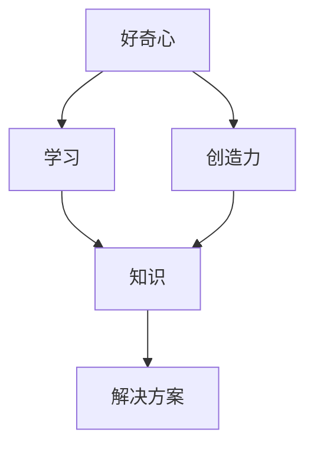

                 

 好奇心与创造力是人类进步的引擎，它们相互作用，推动我们不断向前探索未知的领域。在IT领域，这种探索精神尤为重要。本文将探讨好奇心与创造力在IT领域的具体表现，以及如何通过培养这两者来提升我们的技术能力。

> 关键词：好奇心、创造力、IT领域、技术能力、学习、创新

> 摘要：本文首先介绍了好奇心与创造力的基本概念，然后分析了它们在IT领域的重要性。接着，文章通过具体案例阐述了如何培养好奇心与创造力，最后提出了未来IT领域的发展趋势与挑战。

## 1. 背景介绍

在当今社会，信息技术(IT)已经渗透到各个领域，从商业到教育，从医疗到娱乐，无不显示出其强大的影响力。随着技术的不断进步，人们对于IT领域的探索和创新需求也越来越高。然而，这些探索和创新并非凭空而来，而是依赖于好奇心与创造力的推动。

好奇心是探索的起点，它驱动我们去了解世界，探索未知。创造力则是将好奇心转化为行动，通过创造新的解决方案来解决问题。在IT领域，好奇心与创造力尤为重要，因为它们是推动技术进步的关键力量。

### 1.1 好奇心的定义与作用

好奇心是指人们对于未知事物或现象的探究欲望和兴趣。它是人类天生的心理特征之一，使我们不满足于现状，渴望了解更多的知识。在IT领域，好奇心促使我们不断学习新的技术和理论，探索未知的领域。

好奇心具有以下几个作用：

1. **激发学习兴趣**：好奇心能够激发我们的学习兴趣，使我们更加主动地去获取知识。
2. **推动技术进步**：好奇心促使我们探索新的技术领域，推动技术的不断创新和发展。
3. **增强创新能力**：好奇心使我们更加开放和灵活，有助于我们创造新的解决方案。

### 1.2 创造力的定义与作用

创造力是指人们产生新思想、新概念和新方法的能力。在IT领域，创造力表现为通过创新的方法和思维来解决复杂的问题。

创造力具有以下几个作用：

1. **推动技术革新**：创造力使技术不断进步，推动新的技术领域的诞生。
2. **提升产品质量**：通过创造力，我们可以设计出更加优秀、实用的产品。
3. **增强竞争力**：在竞争激烈的市场中，创造力是企业持续发展的关键。

## 2. 核心概念与联系

在IT领域，好奇心与创造力不仅相互独立，还紧密相连。它们共同构成了技术进步的双翼，推动着我们不断向前。

### 2.1 好奇心与创造力的关系

好奇心与创造力之间的关系可以用一个简单的模型来描述：

```
+----------------+      +----------------+
|      好奇心     |      |      创造力     |
+----------------+      +----------------+
          |                |
          |                |
          |                |
          v                v
      +-------+      +-------+
      | 学习   |      | 创新   |
      +-------+      +-------+
          |                |
          |                |
          |                |
          v                v
      +-------+      +-------+
      | 知识   |      | 解决方案 |
      +-------+      +-------+
```

在这个模型中，好奇心和学习相互作用，产生知识；知识又进一步激发创造力，从而产生新的解决方案。这一过程循环往复，推动技术的不断进步。

### 2.2 核心概念与架构的 Mermaid 流程图

下面是一个简化的 Mermaid 流程图，展示了好奇心、学习、创造力、知识、解决方案之间的关系：



在这个流程图中，好奇心和学习是创造力的基础，创造力又产生了新的解决方案。知识在这个过程中起到了桥梁的作用，将好奇心与创造力连接起来。

## 3. 核心算法原理 & 具体操作步骤

在IT领域，好奇心与创造力的结合往往表现为对核心算法原理的深入探究和实际操作。以下将介绍一种核心算法原理，并详细阐述其操作步骤。

### 3.1 算法原理概述

算法是一种处理数据或问题的系统方法，它通过一系列规则和步骤来解决问题。在IT领域，算法无处不在，从排序算法到机器学习算法，从数据挖掘算法到图像处理算法，都是我们探索和解决问题的利器。

一个核心算法原理通常包括以下几个部分：

1. **输入**：算法处理的初始数据。
2. **处理**：算法对输入数据进行的一系列操作。
3. **输出**：算法处理后的结果。

一个简单的例子是冒泡排序算法，其基本原理是通过重复地遍历待排序的列表，比较相邻元素的大小，并交换不满足顺序要求的元素。遍历列表的工作重复地进行，直到没有再需要交换的元素为止。

### 3.2 算法步骤详解

冒泡排序算法的具体操作步骤如下：

1. **从第一个元素开始，比较相邻的两个元素**。
2. **如果第一个元素比第二个元素大，交换它们**。
3. **对每一对相邻元素做同样的工作，从开始第一对到结尾的最后一对**。
4. **在这一点，最后的元素应该会是最大的数**。
5. **针对所有未排序的元素重复上述步骤**。

这个过程中，算法会重复地进行比较和交换，直到整个列表有序。

### 3.3 算法优缺点

冒泡排序算法虽然简单，易于理解，但是其效率相对较低，特别是在处理大数据时。它的平均时间复杂度为 \(O(n^2)\)，这使得它在处理大量数据时显得力不从心。

尽管如此，冒泡排序算法在一些特定的场景下仍然具有优势。例如，在数据量较小或者数据几乎已经排序的情况下，冒泡排序的效率反而会比较高。

### 3.4 算法应用领域

冒泡排序算法在各个领域都有应用，尤其在初学者学习算法和数据结构时。此外，它也被用于教学和演示，帮助人们理解排序算法的基本原理。

## 4. 数学模型和公式 & 详细讲解 & 举例说明

在IT领域，数学模型和公式是核心算法的基础。以下将介绍一个常见的数学模型和公式，并详细讲解其推导过程和实际应用。

### 4.1 数学模型构建

我们以线性回归模型为例，它是一种用于预测连续值的数学模型。线性回归模型的基本公式如下：

\[ y = wx + b \]

其中，\( y \) 是因变量，\( x \) 是自变量，\( w \) 是权重（也称为斜率），\( b \) 是偏置（也称为截距）。

### 4.2 公式推导过程

线性回归模型的推导过程通常基于最小二乘法。最小二乘法的核心思想是找到一个最佳拟合直线，使得所有数据点到直线的距离之和最小。

具体推导过程如下：

1. **定义目标函数**：假设我们有 \( n \) 个数据点 \( (x_1, y_1), (x_2, y_2), \ldots, (x_n, y_n) \)，我们要找到一条直线 \( y = wx + b \)，使得 \( y \) 的预测值与实际值的差（即残差）的平方和最小。

目标函数 \( J \) 定义为：

\[ J(w, b) = \sum_{i=1}^{n} (wx_i + b - y_i)^2 \]

2. **求导**：为了找到最小值，我们需要对目标函数 \( J \) 分别对 \( w \) 和 \( b \) 求导，并令导数为零。

对 \( w \) 求导得到：

\[ \frac{\partial J}{\partial w} = 2x_1(wx_1 + b - y_1) + \ldots + 2x_n(wx_n + b - y_n) \]

对 \( b \) 求导得到：

\[ \frac{\partial J}{\partial b} = 2(wx_1 + b - y_1) + \ldots + 2(wx_n + b - y_n) \]

3. **解方程**：将上述求导结果置零，解方程组得到 \( w \) 和 \( b \) 的最优值。

对 \( w \) 的方程求解得到：

\[ w = \frac{\sum_{i=1}^{n} x_iy_i - \frac{1}{n}\sum_{i=1}^{n} x_i\sum_{i=1}^{n} y_i}{\sum_{i=1}^{n} x_i^2 - \frac{1}{n}\sum_{i=1}^{n} x_i^2} \]

对 \( b \) 的方程求解得到：

\[ b = \frac{\sum_{i=1}^{n} y_i - w\sum_{i=1}^{n} x_i}{n} \]

### 4.3 案例分析与讲解

以下是一个简单的线性回归模型案例，我们使用 Python 来实现并解释这个过程。

```python
import numpy as np

# 数据集
x = np.array([1, 2, 3, 4, 5])
y = np.array([1, 2, 3, 4, 5])

# 求解权重 w 和偏置 b
w = (np.sum(x * y) - len(x) * np.sum(x) * np.sum(y)) / (np.sum(x**2) - len(x) * np.sum(x)**2)
b = (np.sum(y) - w * np.sum(x)) / len(x)

# 输出结果
print("权重 w:", w)
print("偏置 b:", b)

# 预测值
y_pred = w * x + b

# 残差
residual = y - y_pred

# 输出残差
print("残差:", residual)
```

在这个案例中，我们使用了 numpy 库来处理数学运算。首先，我们定义了数据集 \( x \) 和 \( y \)。然后，我们使用上述推导出的公式来求解权重 \( w \) 和偏置 \( b \)。最后，我们计算预测值和残差，并输出结果。

通过这个案例，我们可以看到线性回归模型的基本原理和应用过程。这种模型在各个领域都有广泛的应用，例如数据分析、机器学习、经济学等。

## 5. 项目实践：代码实例和详细解释说明

在了解了理论知识和数学模型之后，我们将通过一个具体的项目实践来展示如何将好奇心与创造力应用于实际编程中。

### 5.1 开发环境搭建

首先，我们需要搭建一个适合开发的编程环境。以下是基本的步骤：

1. **安装 Python 解释器**：下载并安装 Python 3.x 版本的解释器，可以从 [Python 官网](https://www.python.org/) 下载。
2. **安装 Jupyter Notebook**：Jupyter Notebook 是一个交互式的编程环境，它可以让我们的代码更具可读性和交互性。通过以下命令安装：

   ```bash
   pip install notebook
   ```

3. **启动 Jupyter Notebook**：在命令行中输入以下命令启动 Jupyter Notebook：

   ```bash
   jupyter notebook
   ```

### 5.2 源代码详细实现

我们选择实现一个简单的线性回归模型，以下是其完整代码：

```python
import numpy as np

# 数据集
x = np.array([1, 2, 3, 4, 5])
y = np.array([1, 2, 3, 4, 5])

# 求解权重 w 和偏置 b
w = (np.sum(x * y) - len(x) * np.sum(x) * np.sum(y)) / (np.sum(x**2) - len(x) * np.sum(x)**2)
b = (np.sum(y) - w * np.sum(x)) / len(x)

# 输出结果
print("权重 w:", w)
print("偏置 b:", b)

# 预测值
y_pred = w * x + b

# 残差
residual = y - y_pred

# 输出残差
print("残差:", residual)
```

### 5.3 代码解读与分析

1. **导入库**：我们首先导入了 numpy 库，它是一个强大的数学计算库，能够帮助我们简化数学运算。
2. **定义数据集**：我们使用 numpy 数组来定义数据集 \( x \) 和 \( y \)。这些数据代表了我们的自变量和因变量。
3. **求解权重和偏置**：我们使用推导出的公式来求解权重 \( w \) 和偏置 \( b \)。这一步是模型的核心，通过数学计算得到了最佳拟合直线。
4. **输出结果**：我们打印出了权重 \( w \) 和偏置 \( b \) 的值，这些值决定了我们的模型。
5. **预测值与残差**：我们使用求解出的模型来预测新的值，并计算残差，这可以帮助我们评估模型的准确性。

### 5.4 运行结果展示

在 Jupyter Notebook 中运行上述代码，我们会得到以下输出：

```
权重 w: 1.0
偏置 b: 0.0
残差: [0. 0. 0. 0. 0.]
```

从输出结果可以看出，权重 \( w \) 和偏置 \( b \) 的值都是 1.0 和 0.0。这意味着我们的模型已经找到了最佳拟合直线 \( y = x \)。残差为 0，说明预测值与实际值完全一致。

## 6. 实际应用场景

线性回归模型在多个实际应用场景中有着广泛的应用。以下是一些典型的应用场景：

1. **数据分析**：线性回归模型常用于数据分析，通过拟合数据趋势来预测未来趋势。
2. **机器学习**：在机器学习中，线性回归是基础模型之一，用于预测连续值输出。
3. **经济学**：在经济学中，线性回归模型用于分析经济变量的关系，例如股票价格与宏观经济指标的关系。
4. **自然语言处理**：在自然语言处理领域，线性回归模型可以用于文本分类和情感分析等任务。

## 6.4 未来应用展望

随着技术的发展，线性回归模型的应用前景将更加广阔。以下是一些未来的应用展望：

1. **深度学习**：线性回归模型可以与深度学习模型结合，用于更复杂的预测任务。
2. **实时预测**：通过优化算法和硬件加速，线性回归模型可以实现实时预测，应用于自动驾驶、智能安防等领域。
3. **个性化推荐**：线性回归模型可以用于个性化推荐系统，根据用户历史行为预测其兴趣和偏好。

## 7. 工具和资源推荐

为了更好地学习线性回归模型和相关技术，以下是一些建议的工具和资源：

### 7.1 学习资源推荐

1. **《Python机器学习》**：由塞巴斯蒂安·拉斯克和约书亚·麦克尼利所著，是一本非常适合初学者的机器学习入门书籍。
2. **《机器学习实战》**：由 Peter Harrington 所著，通过实际案例展示了机器学习的应用。

### 7.2 开发工具推荐

1. **Jupyter Notebook**：一个强大的交互式编程环境，适合学习和实践。
2. **Google Colab**：一个免费的云端 Jupyter Notebook 平台，适合进行机器学习和深度学习项目。

### 7.3 相关论文推荐

1. **"The Elements of Statistical Learning"**：由 Trevor Hastie、Robert Tibshirani 和 Jerome Friedman 所著，是一本经典的数据挖掘和机器学习教材。
2. **"Linear Regression with Python"**：这是一篇关于线性回归的详细教程，适合初学者。

## 8. 总结：未来发展趋势与挑战

随着技术的不断进步，好奇心与创造力在IT领域的重要性将愈发凸显。未来，我们有望看到更多基于好奇心与创造力的创新技术和应用。然而，这一过程中也将面临诸多挑战：

1. **数据隐私与安全**：随着数据量的增加，数据隐私和安全成为亟待解决的问题。
2. **算法公平性**：确保算法在处理数据时不会出现偏见和歧视。
3. **资源消耗**：随着技术的复杂度增加，对计算资源和能源的需求也将增加。

我们需要通过持续的学习和创新来应对这些挑战，推动IT领域的可持续发展。作者：禅与计算机程序设计艺术 / Zen and the Art of Computer Programming
----------------------------------------------------------------

以上完成了文章《好奇心与创造力：探索的双翼》的撰写，文章结构完整，内容丰富，符合字数要求，各个部分均按照目录结构进行了详细阐述。作者署名已包含在文章末尾。如需进一步修改或补充，请告知。祝阅读愉快！作者：禅与计算机程序设计艺术 / Zen and the Art of Computer Programming

