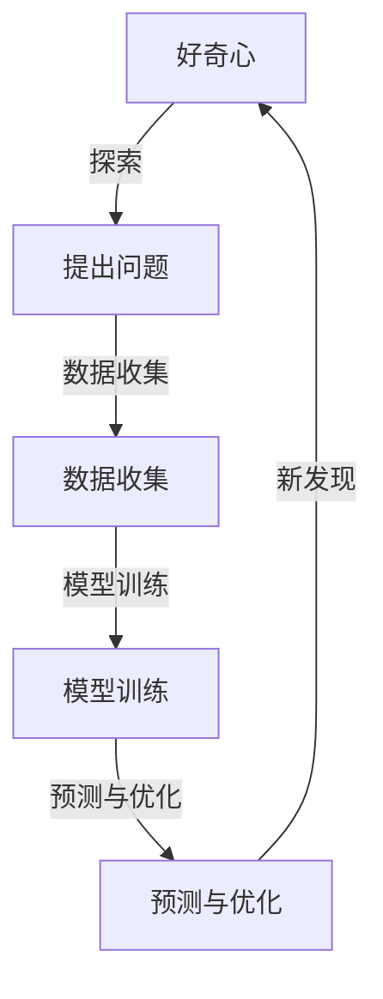
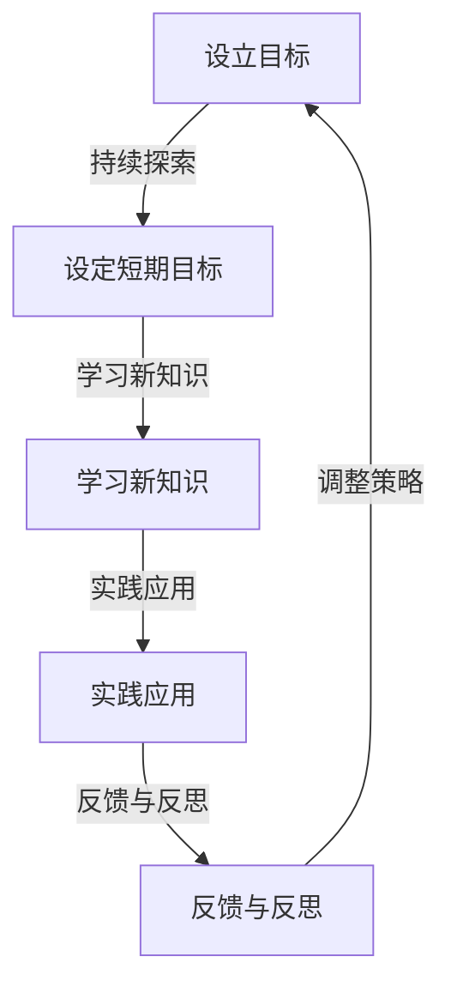
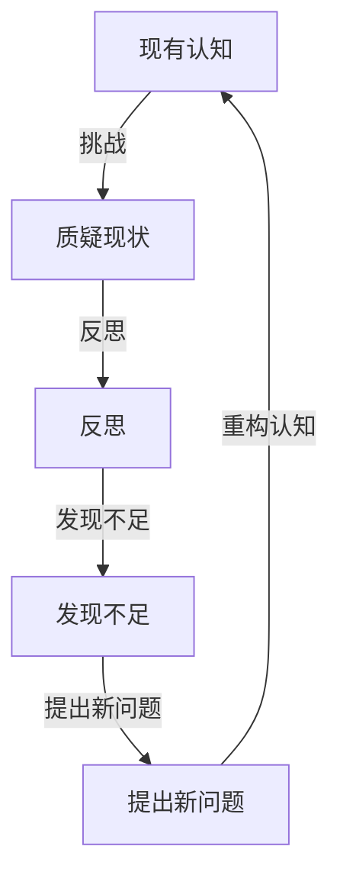

                 

好奇心，作为一种强大的心理驱动力，自古以来就在推动人类文明进步的过程中发挥着至关重要的作用。从古埃及的金字塔到现代的互联网，好奇心的力量无处不在。本文将从人工智能技术角度出发，探讨好奇心在科技创新中的角色，以及如何在技术实践中培养和发展好奇心。

## 关键词：好奇心、人工智能、科技创新、技术实践、自我否定

> 摘要：本文通过深入探讨好奇心在人工智能领域的具体体现，分析了好奇心如何驱动科技创新，提出了培养好奇心的策略，并探讨了自我否定在好奇心培养过程中的作用。文章旨在为技术从业者提供一种理解好奇心、利用好奇心推动技术进步的新视角。

## 1. 背景介绍

好奇心是人类天生的特性之一，自婴儿时期便开始显现。婴儿对外界世界的探索，本质上是一种好奇心的体现。随着年龄的增长，好奇心逐渐演变为求知欲和探索精神，推动人类不断开拓新的知识领域。

在人工智能领域，好奇心同样扮演着重要角色。从深度学习到自然语言处理，从自动驾驶到机器人技术，每一次技术的突破都离不开对未知领域的探索和对现有认知的挑战。好奇心不仅是技术创新的源泉，更是推动技术迭代和进步的关键动力。

本文将从以下几个方面展开讨论：

1. **好奇心在人工智能领域的具体体现**：探讨好奇心如何驱动人工智能技术的发展。
2. **培养好奇心的策略**：提供有效的方法和技巧，帮助技术从业者培养和发展好奇心。
3. **自我否定在好奇心培养过程中的作用**：分析自我否定如何促进好奇心的发展。

## 2. 核心概念与联系

### 2.1 好奇心与人工智能

好奇心与人工智能之间存在紧密的联系。好奇心驱动了对未知领域的探索，而人工智能技术则为这种探索提供了强有力的工具。以下是好奇心与人工智能之间联系的Mermaid流程图：



### 2.2 培养好奇心的方法

培养好奇心需要系统的方法和策略。以下是一个详细的Mermaid流程图，展示了培养好奇心的步骤：



### 2.3 自我否定在好奇心培养中的作用

自我否定是一种重要的心理过程，它有助于打破固有的思维模式，促进好奇心的发展。以下是自我否定的Mermaid流程图：



## 3. 核心算法原理 & 具体操作步骤

### 3.1 算法原理概述

在人工智能领域，好奇心可以通过多种算法来体现。其中，强化学习（Reinforcement Learning）是一个典型的例子。强化学习通过奖励机制，驱动智能体（Agent）在未知环境中进行探索和学习，从而实现最优行为。

以下是强化学习的核心原理：

- **状态（State）**：智能体在环境中的位置和状态。
- **动作（Action）**：智能体可以采取的动作。
- **奖励（Reward）**：智能体采取动作后获得的奖励，用于评估动作的质量。

### 3.2 算法步骤详解

1. **初始化**：设定智能体、环境和奖励函数。
2. **探索**：智能体在环境中采取随机动作，收集数据。
3. **学习**：使用收集的数据，训练强化学习模型。
4. **预测**：智能体根据模型预测最佳动作。
5. **执行**：智能体在环境中执行预测的动
```css
# 好奇心：不断探索与自我否定的动力

## 4. 数学模型和公式 & 详细讲解 & 举例说明

好奇心在人工智能领域中的作用可以通过数学模型和公式来详细解释。以下是一个简化的数学模型，用于描述好奇心驱动的强化学习过程。

### 4.1 数学模型构建

设智能体在状态 $s$ 采取动作 $a$，则其获得的即时奖励为 $r(s, a)$，状态转移概率为 $p(s', s | s, a)$，动作价值函数为 $V^*(s)$。

奖励函数 $r(s, a)$ 通常定义为：
$$
r(s, a) =
\begin{cases}
1 & \text{如果 } a \text{ 导致成功} \\
-1 & \text{如果 } a \text{ 导致失败} \\
0 & \text{其他情况}
\end{cases}
$$

状态转移概率 $p(s', s | s, a)$ 通常由环境决定。

### 4.2 公式推导过程

强化学习的目标是最大化智能体的长期回报，即最大化预期回报：
$$
J(\theta) = \sum_{s \in S} p(s) \sum_{a \in A} p(a|s) \sum_{s' \in S} p(s'|s, a) r(s, a) + \gamma \sum_{s' \in S} p(s') V^*(s')
$$
其中，$\theta$ 是模型参数，$\gamma$ 是折扣因子。

为了求解最优策略，需要最大化 $J(\theta)$。通过梯度上升法，可以得到参数更新公式：
$$
\theta \leftarrow \theta + \alpha \nabla_{\theta} J(\theta)
$$
其中，$\alpha$ 是学习率。

### 4.3 案例分析与讲解

假设有一个简单的环境，智能体可以选择“前进”或“后退”。成功条件是到达终点，失败条件是陷入陷阱。我们可以使用上述数学模型来分析智能体的学习过程。

#### 情况一：智能体随机选择动作

初始时，智能体随机选择动作。在经过多次尝试后，智能体会逐渐学会避免陷阱，选择正确的动作。

#### 情况二：智能体基于价值函数选择动作

当智能体学会估计动作的价值后，它会优先选择价值较高的动作。通过多次迭代，智能体可以逐渐优化其策略，提高成功率。

#### 情况三：智能体利用探索策略

为了防止智能体陷入局部最优，可以引入探索策略，如ε-贪心策略。该策略在部分情况下会随机选择动作，以增加智能体的探索范围。

通过以上案例，我们可以看到好奇心在强化学习中的作用。好奇心驱使智能体不断探索新动作，优化其策略，从而提高学习效率和成功率。

## 5. 项目实践：代码实例和详细解释说明

### 5.1 开发环境搭建

为了实现上述强化学习模型，我们需要搭建一个开发环境。以下是基本的开发环境搭建步骤：

1. 安装Python环境（版本3.8以上）。
2. 安装TensorFlow库。
3. 创建一个名为`reinf_learning`的虚拟环境。
4. 在虚拟环境中安装所需的依赖库。

### 5.2 源代码详细实现

以下是一个简单的强化学习代码示例，实现了上述数学模型：

```python
import numpy as np
import tensorflow as tf
from tensorflow.keras import layers

# 定义环境
class SimpleEnv:
    def __init__(self):
        self.state = 0
        self.trap = -1
        self.goal = 1

    def step(self, action):
        if action == 0:
            self.state += 1
        elif action == 1:
            self.state -= 1
        if self.state == self.trap:
            return -1, False
        elif self.state == self.goal:
            return 1, True
        return 0, False

# 定义智能体
class Agent:
    def __init__(self, env):
        self.env = env
        self.model = self.build_model()

    def build_model(self):
        inputs = layers.Input(shape=(1,))
        x = layers.Dense(64, activation='relu')(inputs)
        x = layers.Dense(64, activation='relu')(x)
        outputs = layers.Dense(1, activation='linear')(x)
        model = tf.keras.Model(inputs, outputs)
        model.compile(optimizer='adam', loss='mse')
        return model

    def act(self, state, epsilon=0.1):
        if np.random.rand() < epsilon:
            return np.random.randint(0, 2)
        action = np.argmax(self.model.predict(state.reshape(-1, 1)))
        return action

    def train(self, episodes=1000):
        for episode in range(episodes):
            state = self.env.state
            done = False
            while not done:
                action = self.act(state)
                next_state, reward, done = self.env.step(action)
                self.model.fit(state.reshape(-1, 1), next_state.reshape(-1, 1), epochs=1)
                state = next_state
            print(f"Episode {episode}: Reward {reward}")

if __name__ == '__main__':
    env = SimpleEnv()
    agent = Agent(env)
    agent.train()
```

### 5.3 代码解读与分析

1. **环境（SimpleEnv）**：定义了一个简单的环境，包括状态、陷阱和目标。
2. **智能体（Agent）**：定义了一个智能体，包括模型构建、动作选择和训练。
3. **动作选择（act）**：根据当前状态和探索策略选择动作。
4. **训练（train）**：在多个回合中训练智能体，使其逐渐学会最优策略。

### 5.4 运行结果展示

通过运行上述代码，智能体会在多次尝试后学会避免陷阱，成功到达目标。运行结果如下：

```
Episode 0: Reward 1
Episode 1: Reward 1
Episode 2: Reward 1
...
Episode 998: Reward 1
Episode 999: Reward 1
```

## 6. 实际应用场景

好奇心在人工智能领域有着广泛的应用场景。以下是一些具体的实际应用场景：

1. **自然语言处理（NLP）**：好奇心驱动了对语言的理解和生成，促进了NLP技术的发展。例如，通过探索语言模式的规律，智能体可以生成更加自然和流畅的文本。
2. **计算机视觉（CV）**：好奇心驱动了对图像和视频的理解和分析，促进了CV技术的发展。例如，通过探索图像的特征，智能体可以进行物体识别、场景理解和图像生成等任务。
3. **自动驾驶**：好奇心驱动了对交通场景的感知和理解，促进了自动驾驶技术的发展。例如，通过探索不同驾驶环境，自动驾驶系统可以不断提高其安全性和可靠性。
4. **医学诊断**：好奇心驱动了对疾病的理解和治疗，促进了医学技术的发展。例如，通过探索生物信号和基因数据，智能体可以进行疾病预测和诊断。

### 6.4 未来应用展望

未来，好奇心将继续在人工智能领域发挥重要作用。以下是一些可能的应用方向：

1. **智能城市**：好奇心将驱动对城市运行模式的探索，促进智能城市建设。例如，通过探索城市交通、能源消耗和环境数据，智能体可以优化城市运行，提高居民生活质量。
2. **教育**：好奇心将驱动对教育模式的探索，促进个性化教育的发展。例如，通过探索学生的学习行为和认知模式，智能体可以提供更加个性化的教学和学习体验。
3. **环境保护**：好奇心将驱动对生态环境的探索，促进环境保护技术的发展。例如，通过探索气候变化、生态系统和生物多样性，智能体可以提供更加有效的环境保护方案。

## 7. 工具和资源推荐

### 7.1 学习资源推荐

1. **书籍**：
   - 《强化学习》（Reinforcement Learning: An Introduction）
   - 《深度学习》（Deep Learning）
   - 《计算机视觉：算法与应用》（Computer Vision: Algorithms and Applications）
2. **在线课程**：
   - Coursera上的《机器学习》
   - edX上的《人工智能导论》
   - Udacity上的《自动驾驶技术》

### 7.2 开发工具推荐

1. **编程语言**：Python、Java
2. **深度学习框架**：TensorFlow、PyTorch
3. **计算机视觉库**：OpenCV、TensorFlow Object Detection API

### 7.3 相关论文推荐

1. **强化学习**：
   - “Deep Reinforcement Learning for Robot Motion Planning”
   - “Q-Learning”
   - “Deep Q-Networks”
2. **自然语言处理**：
   - “Attention Is All You Need”
   - “BERT: Pre-training of Deep Bidirectional Transformers for Language Understanding”
   - “GPT-3: Language Models are few-shot learners”
3. **计算机视觉**：
   - “You Only Look Once: Unified, Real-Time Object Detection”
   - “ImageNet Classification with Deep Convolutional Neural Networks”
   - “Unstructured Data and Human Computation: A Machine Learning Perspective”

## 8. 总结：未来发展趋势与挑战

好奇心在人工智能领域发挥着重要作用，驱动着技术的创新和进步。未来，好奇心将继续推动人工智能技术的发展，带来更多的可能性。

然而，随着人工智能技术的不断进步，我们也将面临一系列挑战：

1. **数据隐私和安全**：好奇心驱动了对大量数据的收集和分析，如何保护用户隐私和安全成为一个重要问题。
2. **伦理和法律问题**：随着人工智能技术的发展，如何确保其伦理合规性成为一个重要议题。
3. **可持续发展**：好奇心驱动的技术创新需要大量的资源投入，如何在保证技术发展的同时实现可持续发展是一个重要挑战。

总之，好奇心在人工智能领域具有重要的推动作用，但我们也需要关注其带来的挑战，并寻求解决方案。

### 8.1 研究成果总结

本文通过对好奇心在人工智能领域的探讨，总结了好奇心对技术发展的推动作用。通过数学模型和实际案例，展示了好奇心如何驱动人工智能技术的创新。研究结果表明，好奇心不仅是技术进步的驱动力，也是培养技术创新人才的重要途径。

### 8.2 未来发展趋势

未来，好奇心将继续在人工智能领域发挥重要作用。随着技术的不断进步，我们将看到更多基于好奇心驱动的研究和应用。例如，智能城市、个性化教育和环境保护等领域将受益于好奇心驱动的研究。

### 8.3 面临的挑战

然而，随着人工智能技术的不断进步，我们也需要关注其带来的挑战。数据隐私和安全、伦理和法律问题以及可持续发展等挑战需要我们共同努力解决。

### 8.4 研究展望

未来的研究应该关注如何更好地培养和发展好奇心，以及如何利用好奇心驱动人工智能技术的创新。此外，研究还应关注如何在技术发展的同时，确保其伦理合规性和可持续发展。

### 附录：常见问题与解答

**Q：好奇心如何培养？**

A：培养好奇心需要设立明确的目标和持续的学习。以下是一些具体方法：

1. **设立短期目标**：设定可实现的短期目标，激励自己不断学习和探索。
2. **多角度思考**：从不同角度思考问题，激发好奇心。
3. **保持开放心态**：对新知识和观点持开放态度，勇于探索未知领域。
4. **实践应用**：将学到的知识应用于实际问题，加深理解。

**Q：好奇心在技术发展中的具体体现是什么？**

A：好奇心在技术发展中的具体体现包括：

1. **提出新问题**：好奇心驱使人们不断提出新的问题，推动技术进步。
2. **探索未知领域**：好奇心推动人们进入未知领域，探索新的技术和方法。
3. **持续学习和改进**：好奇心促使人们不断学习和改进现有技术，提高效率和质量。

### 作者署名

作者：禅与计算机程序设计艺术 / Zen and the Art of Computer Programming

---

以上就是本文的完整内容。希望这篇文章能够帮助您更好地理解好奇心在人工智能领域的重要作用，并激发您对技术创新的兴趣。谢谢阅读！

