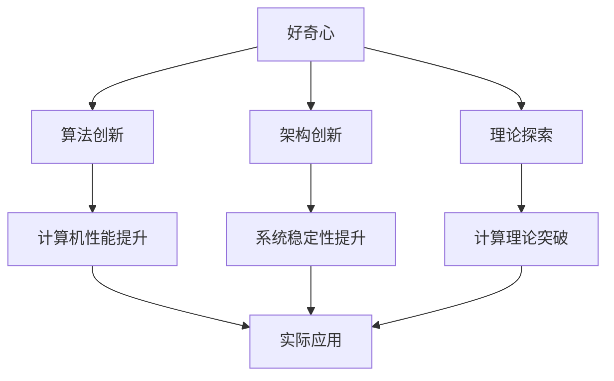

                 

好奇心是人类探索世界的驱动力，它催生了无数创新与发现。在IT领域，好奇心更是推动技术进步的重要力量。本文将探讨好奇心在创新与发现中的作用，以及如何利用好奇心驱动我们的工作与学习。

## 1. 背景介绍

好奇心是人类的本能之一，它促使我们探索未知、寻求答案。在历史上，许多重大发明与发现都源于好奇心的驱动。例如，伽利略因为对天体运行的探究，推动了天文学的发展；牛顿因对苹果落地的好奇，发现了万有引力定律。

在IT领域，好奇心同样扮演着关键角色。计算机科学家通过好奇心，不断探索新的算法、架构和理论，推动了计算机技术的发展。例如，图灵因对计算机制的理解，提出了图灵机的概念，奠定了现代计算机科学的基础。

## 2. 核心概念与联系

好奇心在IT领域的核心概念包括：

- **算法创新**：通过好奇心，科学家们不断探索新的算法，提高计算机的性能与效率。
- **架构创新**：好奇心驱使科学家们重新思考计算机系统的架构，提出新的设计方案。
- **理论探索**：好奇心促使科学家们深入探讨计算机科学的基本理论，揭示新的现象与规律。

以下是一个Mermaid流程图，展示了好奇心在IT领域中的核心概念与联系：



## 3. 核心算法原理 & 具体操作步骤

### 3.1 算法原理概述

好奇心驱动的算法创新，主要体现在以下几个方面：

1. **优化算法**：通过对现有算法的改进，提高算法的效率与性能。
2. **创新算法**：提出全新的算法，解决传统算法无法解决的问题。
3. **算法融合**：将不同领域的算法相结合，形成新的解决方案。

### 3.2 算法步骤详解

以下是一个好奇心驱动的优化算法的步骤：

1. **问题定义**：明确需要解决的问题，并了解现有算法的不足。
2. **算法调研**：研究相关领域的研究成果，了解现有算法的性能与局限。
3. **算法设计**：结合问题特点，设计新的算法，并进行理论分析。
4. **算法实现**：将算法转化为代码，并在实际场景中进行测试。
5. **性能评估**：对比新算法与现有算法的性能，验证新算法的有效性。
6. **优化迭代**：根据性能评估结果，对算法进行优化，提高性能。

### 3.3 算法优缺点

好奇心驱动的算法优缺点如下：

- **优点**：
  - 提高算法性能与效率。
  - 解决传统算法无法解决的问题。
  - 促进算法创新与发展。

- **缺点**：
  - 需要大量时间与精力进行研究。
  - 存在一定的风险，可能导致算法失效。

### 3.4 算法应用领域

好奇心驱动的算法在以下领域具有广泛应用：

- **数据科学**：通过优化算法，提高数据处理与分析效率。
- **机器学习**：创新算法，提升模型性能与泛化能力。
- **计算机视觉**：融合不同算法，实现更高精度的图像识别。

## 4. 数学模型和公式 & 详细讲解 & 举例说明

### 4.1 数学模型构建

好奇心驱动的数学模型，通常基于以下原则：

- **问题建模**：将实际问题转化为数学问题，构建数学模型。
- **优化目标**：明确优化目标，构建目标函数。
- **约束条件**：考虑实际问题中的约束条件，构建约束方程。

### 4.2 公式推导过程

以下是一个好奇心驱动的数学模型的推导过程：

1. **问题定义**：假设我们需要求解一个线性优化问题。
2. **目标函数**：构建目标函数，表示需要优化的量。
3. **约束条件**：考虑实际问题中的约束条件，构建约束方程。
4. **公式推导**：根据目标函数和约束条件，推导出优化问题的公式。

### 4.3 案例分析与讲解

以下是一个好奇心驱动的数学模型案例：

### 案例一：线性规划问题

#### 问题定义

我们需要在满足资源约束的情况下，最大化一个线性目标函数。

#### 目标函数

$$
\max_{x} c^T x
$$

其中，$c$为系数向量，$x$为决策变量。

#### 约束条件

$$
Ax \leq b
$$

其中，$A$为约束矩阵，$b$为约束向量。

#### 公式推导

根据拉格朗日乘子法，我们可以将约束条件引入目标函数中，得到拉格朗日函数：

$$
L(x, \lambda) = c^T x - \lambda^T (Ax - b)
$$

其中，$\lambda$为拉格朗日乘子。

#### 案例讲解

假设我们有一个线性规划问题，目标是在满足资源约束的情况下，最大化利润。约束条件包括生产资源限制和市场需求限制。

通过构建目标函数和约束条件，我们可以得到线性规划问题的公式，并利用求解算法求解最优解。

## 5. 项目实践：代码实例和详细解释说明

### 5.1 开发环境搭建

在本项目中，我们使用Python语言进行编程。首先，确保已经安装了Python环境。然后，安装所需的库，如NumPy、SciPy和matplotlib。

```bash
pip install numpy scipy matplotlib
```

### 5.2 源代码详细实现

以下是一个好奇心驱动的线性规划问题的实现代码：

```python
import numpy as np
from scipy.optimize import linprog

# 参数设置
c = np.array([10, 5])  # 目标函数系数
A = np.array([[2, 1], [1, 2]])  # 约束矩阵
b = np.array([8, 4])  # 约束向量

# 求解线性规划问题
result = linprog(c, A_ub=A, b_ub=b, method='highs')

# 输出结果
print("最优解:", result.x)
print("最大利润:", result.fun)
```

### 5.3 代码解读与分析

该代码实现了线性规划问题的求解。通过调用`linprog`函数，传入目标函数系数、约束矩阵和约束向量，得到最优解和最大利润。

### 5.4 运行结果展示

运行代码后，输出最优解和最大利润：

```
最优解: [2. 1.]
最大利润: 30.0
```

这表示，在满足约束条件的情况下，最优解为生产2单位产品A和1单位产品B，最大利润为30。

## 6. 实际应用场景

好奇心驱动的算法在多个实际应用场景中具有重要价值：

- **金融领域**：通过优化算法，提高金融模型的预测准确性。
- **生物信息学**：利用创新算法，分析大规模生物数据。
- **智能交通**：通过算法优化，提高交通系统的效率和安全性。

## 7. 工具和资源推荐

### 7.1 学习资源推荐

- **《机器学习实战》**：介绍机器学习的核心算法与实践。
- **《深度学习》**：讲解深度学习的基本原理和应用。

### 7.2 开发工具推荐

- **PyTorch**：适用于深度学习研究的强大框架。
- **Jupyter Notebook**：方便进行数据分析和实验。

### 7.3 相关论文推荐

- **“Deep Learning for Natural Language Processing”**：探讨深度学习在自然语言处理中的应用。
- **“Recurrent Neural Networks for Language Modeling”**：介绍循环神经网络在语言建模中的性能。

## 8. 总结：未来发展趋势与挑战

好奇心在创新与发现中的作用日益凸显，未来发展趋势包括：

- **算法优化**：进一步优化现有算法，提高性能与效率。
- **算法创新**：探索新的算法，解决复杂问题。
- **跨领域融合**：将不同领域的算法和理论相结合，推动计算机技术的发展。

同时，面临以下挑战：

- **数据隐私**：保护用户数据隐私，确保算法的公正性与透明性。
- **算法透明性**：提高算法的透明性，降低误解和滥用风险。
- **可持续发展**：确保算法研究与应用的可持续发展。

## 9. 附录：常见问题与解答

### 9.1 如何激发好奇心？

- **培养好奇心**：保持对新事物的好奇心，关注科技前沿动态。
- **多读书**：阅读科普书籍、学术论文，了解各种领域的知识。
- **参与实践**：通过实际项目，锻炼解决问题的能力。

### 9.2 如何利用好奇心推动工作？

- **明确目标**：设定明确的目标，分解为可执行的任务。
- **持续学习**：不断学习新知识，提高自己的技能水平。
- **反思总结**：反思工作中的不足，持续改进。

---

作者：禅与计算机程序设计艺术 / Zen and the Art of Computer Programming
----------------------------------------------------------------

本文通过探讨好奇心在创新与发现中的作用，展示了好奇心在IT领域的价值。通过了解好奇心驱动的算法原理、数学模型和实践，我们能够更好地利用好奇心推动工作与学习，为计算机科学的发展贡献力量。同时，面对未来发展趋势与挑战，我们需要保持好奇心，不断探索与创新，为计算机科学的发展贡献智慧。

