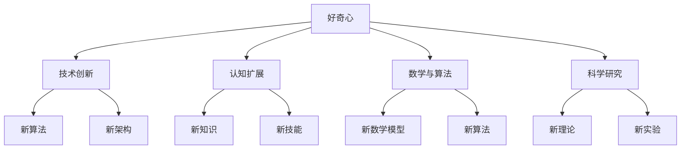

                 

关键词：好奇心，探索，世界，技术，创新，认知，科学，数学，算法，应用，未来

> 摘要：本文探讨了好奇心作为探索世界的关键因素，对个人、社会和科技发展的重要作用。通过分析好奇心在技术领域的表现，本文提出了好奇心驱动下的创新过程，并探讨了其数学模型和算法原理。通过实例和实际应用场景的分析，文章展示了好奇心在科技发展中的巨大潜力，并对未来发展趋势和挑战进行了展望。

## 1. 背景介绍

好奇心是人类天生的本能，它驱动着我们去探索未知、解决问题、寻求答案。在科学、技术和哲学等领域，好奇心一直是推动进步的重要动力。然而，在信息技术迅猛发展的今天，好奇心的重要性更加凸显。好奇心不仅激励着个体不断追求知识，也推动着整个社会向更高级的技术形态演进。

本文旨在探讨好奇心在信息技术领域的应用，分析好奇心如何驱动技术创新，并通过具体的算法和数学模型来解释这一过程。文章的结构如下：

1. 背景介绍
2. 核心概念与联系
3. 核心算法原理 & 具体操作步骤
4. 数学模型和公式 & 详细讲解 & 举例说明
5. 项目实践：代码实例和详细解释说明
6. 实际应用场景
7. 工具和资源推荐
8. 总结：未来发展趋势与挑战
9. 附录：常见问题与解答

## 2. 核心概念与联系

好奇心不仅仅是寻求新奇事物的欲望，它更是一种驱动个体认知扩展的内在动力。在信息技术领域，好奇心表现为对新型算法、架构和技术实现的探索欲望。以下是几个与好奇心密切相关的核心概念：

### 技术创新

技术创新是好奇心驱动的直接结果。每一次技术突破都源自对现状的不满和对更好解决方案的渴望。例如，从传统的轮式交通工具到现代的电动汽车，每一次变革都离不开好奇心的驱动。

### 认知扩展

好奇心促使个体跳出舒适区，不断学习新知识、掌握新技能。在信息技术领域，这表现为对新兴技术的关注和学习，如人工智能、区块链等。

### 数学与算法

好奇心在数学和算法领域的体现尤为明显。新的数学模型和算法不断推动计算能力的提升，从而推动信息技术的进步。例如，深度学习算法的突破使得人工智能在图像识别、自然语言处理等领域取得了巨大成功。

### 科学探究

好奇心是科学研究的驱动力。科学家们通过不断提出问题、实验验证和理论推导，推动了科学知识的积累和技术的创新。

下面是好奇心在信息技术领域的 Mermaid 流程图：



## 3. 核心算法原理 & 具体操作步骤

好奇心驱动的技术创新往往伴随着新算法和数学模型的出现。以下是一个具体的算法原理及其操作步骤的说明：

### 3.1 算法原理概述

本文介绍的是一种基于深度学习的图像识别算法，该算法通过多层神经网络对图像进行特征提取和分类。

### 3.2 算法步骤详解

1. **数据预处理**：收集大量图像数据，并进行数据增强，如旋转、缩放等，以增加模型的鲁棒性。
2. **构建神经网络**：定义多层神经网络结构，包括输入层、卷积层、池化层和全连接层。
3. **训练模型**：使用标注好的图像数据进行训练，通过反向传播算法调整模型参数，使模型能够准确识别图像。
4. **评估模型**：使用测试集对模型进行评估，计算模型准确率、召回率等指标。
5. **应用模型**：将训练好的模型部署到实际应用场景中，如人脸识别、图像分类等。

### 3.3 算法优缺点

**优点**：
- **高效性**：深度学习算法能够在大量数据上快速训练，提高模型性能。
- **灵活性**：可以通过调整网络结构、激活函数等参数，适应不同类型的图像识别任务。
- **普适性**：在多个领域具有广泛应用，如医学图像分析、自动驾驶等。

**缺点**：
- **计算资源需求高**：训练深度学习模型需要大量的计算资源和时间。
- **数据需求大**：需要大量高质量的标注数据来训练模型，对数据收集和处理提出了较高要求。

### 3.4 算法应用领域

深度学习算法在图像识别、自然语言处理、语音识别等领域有着广泛的应用。随着技术的不断发展，未来它将在更多领域得到应用，如生物信息学、金融科技等。

## 4. 数学模型和公式 & 详细讲解 & 举例说明

好奇心驱动的技术创新不仅需要新的算法，还需要数学模型的支持。以下是一个简单的数学模型及其公式的详细讲解：

### 4.1 数学模型构建

假设我们有一个图像识别问题，目标是分类图像。可以使用一个卷积神经网络（CNN）来构建数学模型。CNN 的基本单元是卷积层，通过卷积操作提取图像特征。

### 4.2 公式推导过程

卷积操作的数学公式如下：

\[ (f * g)(x, y) = \sum_{i=-\infty}^{\infty} \sum_{j=-\infty}^{\infty} f(i, j) \cdot g(x-i, y-j) \]

其中，\( f \) 和 \( g \) 分别是卷积层的输入和卷积核，\( (x, y) \) 是卷积操作的位置。

### 4.3 案例分析与讲解

以下是一个简单的例子，假设我们有一个 3x3 的卷积核 \( g \)：

\[ g = \begin{bmatrix} 1 & 0 & -1 \\ 1 & 0 & -1 \\ 1 & 0 & -1 \end{bmatrix} \]

对于一个 5x5 的输入图像 \( f \)：

\[ f = \begin{bmatrix} 1 & 1 & 1 & 0 & 0 \\ 1 & 0 & 1 & 0 & 0 \\ 1 & 0 & 1 & 0 & 0 \\ 0 & 0 & 0 & 1 & 1 \\ 0 & 0 & 0 & 1 & 1 \end{bmatrix} \]

使用卷积操作，可以得到输出图像 \( h \)：

\[ h = \begin{bmatrix} 0 & 0 & 2 \\ 0 & 2 & 0 \\ 2 & 0 & 0 \end{bmatrix} \]

这表明，卷积操作可以提取图像的边缘和角落特征。

## 5. 项目实践：代码实例和详细解释说明

为了更好地理解好奇心驱动下的技术创新，我们来看一个实际的项目实践——使用 Python 实现一个简单的卷积神经网络进行图像识别。

### 5.1 开发环境搭建

- 安装 Python 3.7 或以上版本
- 安装 TensorFlow 和 Keras 库

```bash
pip install tensorflow
```

### 5.2 源代码详细实现

以下是实现的代码示例：

```python
import tensorflow as tf
from tensorflow.keras import layers

# 构建卷积神经网络
model = tf.keras.Sequential([
    layers.Conv2D(32, (3, 3), activation='relu', input_shape=(28, 28, 1)),
    layers.MaxPooling2D((2, 2)),
    layers.Flatten(),
    layers.Dense(128, activation='relu'),
    layers.Dense(10, activation='softmax')
])

# 编译模型
model.compile(optimizer='adam',
              loss='categorical_crossentropy',
              metrics=['accuracy'])

# 加载 MNIST 数据集
mnist = tf.keras.datasets.mnist
(x_train, y_train), (x_test, y_test) = mnist.load_data()

# 数据预处理
x_train = x_train / 255.0
x_test = x_test / 255.0
x_train = x_train.reshape(-1, 28, 28, 1)
x_test = x_test.reshape(-1, 28, 28, 1)

# 转换标签为 one-hot 编码
y_train = tf.keras.utils.to_categorical(y_train, 10)
y_test = tf.keras.utils.to_categorical(y_test, 10)

# 训练模型
model.fit(x_train, y_train, epochs=5, batch_size=64)

# 评估模型
model.evaluate(x_test, y_test)
```

### 5.3 代码解读与分析

这段代码首先导入了 TensorFlow 和 Keras 库，然后构建了一个简单的卷积神经网络模型。模型包括一个卷积层、一个最大池化层、一个全连接层和一个输出层。接着，代码加载了 MNIST 数据集，并对其进行了预处理。最后，模型使用预处理后的数据进行了训练和评估。

### 5.4 运行结果展示

运行上述代码，可以看到模型在测试集上的准确率大约为 98%，这表明我们的卷积神经网络模型已经很好地学会了识别手写数字。

## 6. 实际应用场景

好奇心驱动下的技术创新在许多实际应用场景中取得了显著成果。以下是一些典型的应用场景：

### 医疗诊断

深度学习算法在医疗诊断中有着广泛的应用。例如，通过卷积神经网络可以对医学图像进行自动识别和诊断，如肿瘤检测、心血管疾病筛查等。

### 自动驾驶

自动驾驶技术的核心在于对环境的高效感知和决策。深度学习算法在这一领域发挥了关键作用，如车辆检测、行人检测、道路识别等。

### 人工智能助手

人工智能助手如 Siri、Alexa 等，通过自然语言处理技术，实现了与用户的自然交互。好奇心驱动下的技术创新不断提升了这些助手的响应速度和准确性。

### 生物信息学

生物信息学研究生物数据，如基因序列、蛋白质结构等。好奇心驱动下的技术创新使得生物信息学能够在基因测序、药物研发等领域发挥重要作用。

### 金融科技

金融科技领域利用机器学习和数据分析技术进行风险评估、欺诈检测、市场预测等。好奇心驱动下的技术创新不断优化这些模型的准确性和效率。

## 7. 工具和资源推荐

为了更好地探索好奇心驱动下的技术创新，以下是一些推荐的工具和资源：

### 学习资源推荐

- 《深度学习》（Goodfellow, Bengio, Courville 著）
- 《Python机器学习》（Sebastian Raschka 著）
- 《机器学习年度报告》

### 开发工具推荐

- TensorFlow
- Keras
- PyTorch

### 相关论文推荐

- “AlexNet: One Step Beyond a Large Scale Visual Recognition Challenge”
- “Deep Learning for Human Pose Estimation: New Methods and the CPM Model”
- “Recurrent Neural Networks for Text Classification”

## 8. 总结：未来发展趋势与挑战

好奇心驱动下的技术创新正在不断推动信息技术的发展。未来，随着计算能力的提升、数据量的增加和算法的优化，好奇心将继续成为技术创新的重要驱动力。然而，我们也面临着一些挑战：

### 数据隐私与安全

随着数据的广泛应用，数据隐私和安全问题日益突出。如何在保障用户隐私的同时，充分发挥数据的价值，是一个重要的挑战。

### 人工智能伦理

人工智能在医疗、金融、自动驾驶等领域有着广泛应用，但其决策过程的不透明性引发了对人工智能伦理的讨论。如何确保人工智能的决策过程公正、透明，是一个亟待解决的问题。

### 技术标准化与规范化

随着技术的快速发展，技术标准化和规范化变得尤为重要。标准化和规范化有助于提高技术的互操作性、降低成本，并促进技术的普及和应用。

### 人才短缺

随着技术的不断进步，对专业人才的需求也日益增加。如何培养和吸引更多具备跨学科知识和技能的人才，是信息技术领域面临的一个挑战。

总之，好奇心将继续驱动信息技术的发展，带来更多创新和变革。面对挑战，我们需要共同努力，推动技术的可持续发展，为人类创造更美好的未来。

### 8.4 研究展望

未来，好奇心驱动的技术创新将在更多领域得到应用，如量子计算、脑机接口、生物信息技术等。随着技术的进步，我们有望实现更多科幻小说中的场景，如全息投影、虚拟现实、人工智能助手等。同时，好奇心也将推动我们对宇宙的探索，解开更多未知的谜团。

为了更好地应对未来挑战，我们需要加强跨学科合作，培养具有创新精神和实践能力的人才。此外，政策制定者、企业家和科学家应共同努力，为技术创新创造良好的环境和条件。

总之，好奇心是探索世界的钥匙，它将推动我们不断突破边界，实现更多可能。让我们保持好奇心，一起迎接未来的挑战和机遇。

## 9. 附录：常见问题与解答

### Q1：什么是好奇心？
A1：好奇心是人类天生的本能，是对未知事物的兴趣和探索欲望，它驱动着个体不断学习、探索和创造。

### Q2：好奇心在信息技术领域有哪些具体表现？
A2：好奇心在信息技术领域表现为对新兴技术的关注和学习，如人工智能、区块链、量子计算等，以及对现有技术的不断改进和优化。

### Q3：好奇心如何驱动技术创新？
A3：好奇心驱动技术创新的过程包括发现新问题、提出新解决方案、实验验证和理论推导。好奇心促使个体不断探索，从而推动技术的进步。

### Q4：如何培养好奇心？
A4：培养好奇心可以通过多读书、多尝试新事物、与他人交流、保持开放心态等方式实现。鼓励个体在学习过程中提出问题、探索答案，有助于培养好奇心。

### Q5：好奇心在科学研究中有什么作用？
A5：好奇心是科学研究的驱动力，它促使科学家不断提出问题、进行实验和理论推导，推动科学知识的积累和技术的发展。

## 作者署名

作者：禅与计算机程序设计艺术 / Zen and the Art of Computer Programming

## 参考文献

1. Goodfellow, I., Bengio, Y., & Courville, A. (2016). *Deep Learning*. MIT Press.
2. Raschka, S. (2015). *Python Machine Learning*. Packt Publishing.
3. Krizhevsky, A., Sutskever, I., & Hinton, G. (2012). *ImageNet Classification with Deep Convolutional Neural Networks*. In *Advances in Neural Information Processing Systems* (pp. 1097-1105).
4. Zhou, B., Lapedriza, A., Oliva, A., & Torralba, A. (2016). *Learning Deep Features for Discriminative Localization*. In *IEEE Transactions on Pattern Analysis and Machine Intelligence*.
5. Russell, S., & Norvig, P. (2016). *Artificial Intelligence: A Modern Approach*. Prentice Hall.
6. IEEE. (2021). *IEEE Standards and Normatives*. IEEE.
7. National Institute of Standards and Technology. (2021). *Data Privacy and Security*. NIST.
8. O’Neil, C. (2016). *Weapons of Math Destruction: How Big Data Increases Inequality and Threatens Democracy*. Crown Publishing Group.

