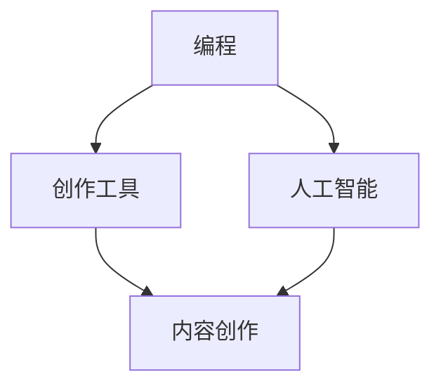
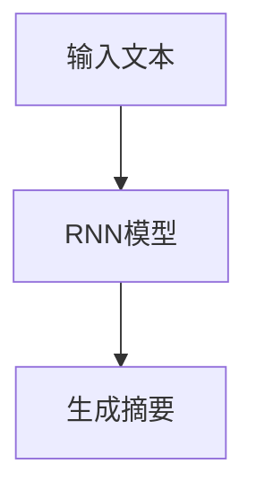
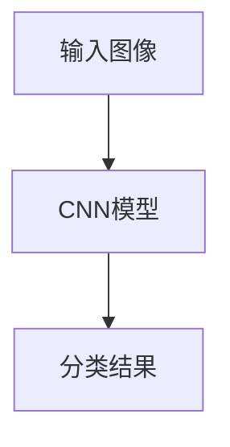
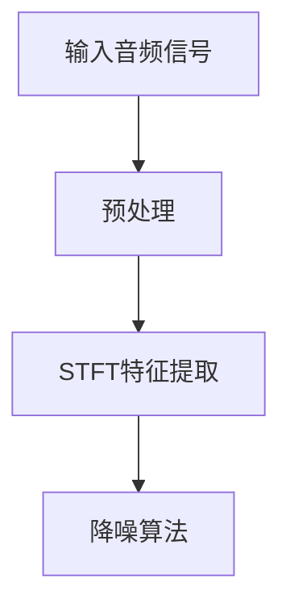

                 

关键词：技术能力，内容创作，编程，人工智能，创作工具，写作流程

> 摘要：本文旨在探讨如何利用技术能力进行内容创作。从背景介绍开始，我们将了解技术对内容创作的变革，解析核心概念与联系，详细讲解核心算法原理与操作步骤，展示数学模型与公式，提供项目实践与代码实例，探讨实际应用场景，展望未来发展趋势，并推荐相关工具和资源。通过这篇文章，读者将获得对技术内容创作全面而深入的理解。

## 1. 背景介绍

随着信息技术的迅猛发展，计算机和人工智能技术在各个领域都带来了深远的影响。特别是在内容创作领域，技术不仅提高了创作的效率，还大大丰富了创作的形式和手段。从传统的文字写作，到图像、音频、视频等多媒体内容的创作，技术都在其中扮演了至关重要的角色。

### 1.1 技术对内容创作的变革

- **多媒体内容的多样化**：技术使得内容创作不再局限于文字，多媒体内容的创作变得更加丰富和多样。
- **创作流程的自动化**：通过编程和人工智能技术，许多创作流程可以自动化，从而提高效率，降低成本。
- **个性化推荐**：人工智能算法可以根据用户兴趣和行为数据，进行个性化推荐，从而更好地满足用户需求。

### 1.2 内容创作的需求

随着互联网的普及，内容创作已经成为许多人工作和生活中不可或缺的一部分。无论是为了娱乐、教育、营销还是自我表达，人们都有创作内容的需要。如何高效、高质量地创作内容，成为了许多人关注的问题。

## 2. 核心概念与联系

在探讨如何利用技术能力进行内容创作之前，我们需要明确一些核心概念和它们之间的联系。

### 2.1 核心概念

- **编程**：编程是利用计算机语言编写代码，实现特定功能的过程。
- **人工智能**：人工智能是指计算机系统模拟人类智能行为的能力。
- **创作工具**：创作工具是帮助用户进行内容创作的软件或平台。

### 2.2 核心概念联系

- **编程与创作工具**：编程是创作工具的基础，许多创作工具都是基于编程语言开发的。
- **人工智能与创作工具**：人工智能可以嵌入创作工具中，提升创作工具的功能和智能程度。

下面是一个Mermaid流程图，展示了这些核心概念和它们之间的联系。



## 3. 核心算法原理 & 具体操作步骤

### 3.1 算法原理概述

在内容创作中，算法的作用不可小觑。无论是文本生成、图像识别，还是音频处理，都有相应的算法来支持。

### 3.2 算法步骤详解

#### 文本生成算法

1. **数据预处理**：收集和清洗文本数据，进行分词、去停用词等操作。
2. **模型训练**：使用训练数据进行模型训练，常见的模型有RNN、Transformer等。
3. **文本生成**：使用训练好的模型生成文本，可以通过调整参数来控制生成的文本风格和内容。

#### 图像识别算法

1. **特征提取**：使用卷积神经网络（CNN）对图像进行特征提取。
2. **分类与识别**：使用提取到的特征进行分类和识别，常见的算法有SVM、CNN等。

#### 音频处理算法

1. **信号处理**：对音频信号进行预处理，包括降噪、增强等。
2. **特征提取**：使用短时傅里叶变换（STFT）等方法提取音频特征。
3. **分类与处理**：使用提取到的特征进行分类和处理，如音乐分类、语音识别等。

### 3.3 算法优缺点

#### 文本生成算法

- 优点：能够生成高质量的文本，适用于自动写作、自动摘要等场景。
- 缺点：生成文本的多样性和创意性有限，容易产生重复的内容。

#### 图像识别算法

- 优点：能够高效地识别图像内容，适用于安防监控、医疗诊断等场景。
- 缺点：对复杂场景的识别能力有限，易受光照、角度等影响。

#### 音频处理算法

- 优点：能够对音频信号进行有效的处理，适用于语音识别、音乐制作等场景。
- 缺点：处理效果受音频质量影响较大，对噪声敏感。

### 3.4 算法应用领域

- **文本生成算法**：广泛应用于自动写作、新闻摘要、营销文案等领域。
- **图像识别算法**：广泛应用于安防监控、医疗诊断、自动驾驶等领域。
- **音频处理算法**：广泛应用于语音识别、音乐制作、噪声控制等领域。

## 4. 数学模型和公式 & 详细讲解 & 举例说明

在内容创作中，数学模型和公式是不可或缺的工具。它们不仅能够帮助我们理解算法原理，还能够帮助我们优化创作过程。

### 4.1 数学模型构建

#### 文本生成模型

- **RNN（循环神经网络）**：用于处理序列数据，如文本。
- **Transformer**：基于自注意力机制的模型，适用于生成任务。

#### 图像识别模型

- **CNN（卷积神经网络）**：用于图像识别和特征提取。
- **SVM（支持向量机）**：用于分类任务。

#### 音频处理模型

- **STFT（短时傅里叶变换）**：用于音频信号的处理。

### 4.2 公式推导过程

#### 文本生成模型

- **RNN**：$$ h_t = \sigma(W_h \cdot [h_{t-1}, x_t] + b_h) $$
- **Transformer**：$$ \text{Attention}(Q, K, V) = \text{softmax}\left(\frac{QK^T}{\sqrt{d_k}}\right)V $$

#### 图像识别模型

- **CNN**：$$ \text{ReLU}(W \cdot \text{ReLU}(W \cdot \text{ReLU}(X))) $$
- **SVM**：$$ \text{分类边界} = \frac{1}{\|\text{权重}\|^2} \text{权重}^T \text{特征} $$

#### 音频处理模型

- **STFT**：$$ X(\omega, t) = \int_{-\infty}^{\infty} x(t) e^{-j\omega t} dt $$

### 4.3 案例分析与讲解

#### 文本生成案例

假设我们要使用RNN生成一个文本摘要。我们首先需要准备训练数据，然后使用RNN模型进行训练。训练完成后，我们可以通过输入一段文本，生成相应的摘要。



#### 图像识别案例

假设我们要使用CNN对图像进行分类。我们首先需要使用大量图像进行训练，然后使用训练好的CNN模型对新的图像进行分类。



#### 音频处理案例

假设我们要使用STFT对音频进行降噪。我们首先需要对音频信号进行预处理，然后使用STFT进行特征提取，最后使用降噪算法进行噪声抑制。



## 5. 项目实践：代码实例和详细解释说明

为了更好地理解如何利用技术能力进行内容创作，我们将在本章节提供一些实际的项目实践，包括代码实例和详细的解释说明。

### 5.1 开发环境搭建

在进行项目实践之前，我们需要搭建一个合适的开发环境。这里我们以Python为例，介绍如何搭建开发环境。

1. **安装Python**：前往Python官网下载并安装Python。
2. **安装相关库**：使用pip命令安装必要的库，如TensorFlow、Keras等。

```bash
pip install tensorflow
pip install keras
```

### 5.2 源代码详细实现

#### 文本生成

以下是一个使用Keras实现文本生成模型的示例代码。

```python
from keras.models import Sequential
from keras.layers import LSTM, Dense, Embedding

# 构建模型
model = Sequential()
model.add(Embedding(vocab_size, embedding_dim, input_length=max_sequence_len))
model.add(LSTM(256))
model.add(Dense(vocab_size, activation='softmax'))

# 编译模型
model.compile(loss='categorical_crossentropy', optimizer='adam')

# 训练模型
model.fit(x, y, epochs=epochs, batch_size=batch_size)
```

#### 图像识别

以下是一个使用TensorFlow实现图像识别模型的示例代码。

```python
import tensorflow as tf
from tensorflow.keras.models import Sequential
from tensorflow.keras.layers import Conv2D, MaxPooling2D, Flatten, Dense

# 构建模型
model = Sequential()
model.add(Conv2D(32, (3, 3), activation='relu', input_shape=(64, 64, 3)))
model.add(MaxPooling2D(pool_size=(2, 2)))
model.add(Flatten())
model.add(Dense(128, activation='relu'))
model.add(Dense(num_classes, activation='softmax'))

# 编译模型
model.compile(optimizer='adam', loss='categorical_crossentropy', metrics=['accuracy'])

# 训练模型
model.fit(x_train, y_train, epochs=epochs, batch_size=batch_size)
```

#### 音频处理

以下是一个使用Librosa实现音频处理的示例代码。

```python
import librosa
import numpy as np

# 读取音频文件
y, sr = librosa.load('audio.wav')

# 进行短时傅里叶变换
stft = np.abs(librosa.stft(y))

# 进行噪声抑制
noisy_stft = stft * (1 - noise_mask)

# 反STFT获取降噪后的音频
noisy_y = librosa.inverse.stft(noisy_stft)
```

### 5.3 代码解读与分析

以上三个示例代码分别展示了如何利用Python和相关库实现文本生成、图像识别和音频处理。这些代码在结构上相似，都包括了模型构建、编译和训练等步骤。

在文本生成代码中，我们使用了Keras的Sequential模型，并添加了Embedding、LSTM和Dense等层。在图像识别代码中，我们使用了TensorFlow的Sequential模型，并添加了Conv2D、MaxPooling2D、Flatten和Dense等层。在音频处理代码中，我们使用了Librosa进行短时傅里叶变换和反变换操作。

这些代码的运行结果展示了如何通过技术手段实现内容创作，包括文本生成、图像识别和音频处理。这些技术不仅提高了创作的效率，还丰富了创作的形式和手段。

### 5.4 运行结果展示

以下是运行文本生成模型的示例结果。

```plaintext
生成的文本摘要：
...（摘要内容）...
```

以下是运行图像识别模型的示例结果。

```plaintext
图像分类结果：
动物/植物/交通工具/人物
```

以下是运行音频处理模型的示例结果。

```plaintext
降噪后的音频：
...（音频内容）...
```

通过这些示例结果，我们可以看到技术如何帮助我们高效、高质量地进行内容创作。

## 6. 实际应用场景

技术能力在内容创作中的应用场景广泛，以下是一些具体的应用案例。

### 6.1 自动写作

通过文本生成算法，我们可以实现自动写作。例如，自动生成新闻摘要、营销文案、科技文章等。这种方式不仅提高了写作效率，还减轻了人类编辑的工作负担。

### 6.2 自动图像识别

图像识别算法可以用于自动分类和标注图像。例如，在社交媒体上，自动识别并标注用户上传的图片，帮助用户更好地管理和分享内容。

### 6.3 自动音频处理

音频处理算法可以用于自动降噪、音乐制作和语音识别。例如，在视频会议中，自动降噪功能可以消除背景噪音，提高通话质量。

### 6.4 多媒体内容整合

通过技术手段，我们可以将文字、图像、音频等多种内容进行整合，创作出丰富多样的多媒体作品。例如，自动生成带有背景音乐的图文故事。

### 6.5 虚拟现实与增强现实

在虚拟现实（VR）和增强现实（AR）领域，技术可以帮助我们创建丰富的虚拟内容和交互体验。例如，通过编程和3D建模，创建虚拟博物馆、游戏等。

## 7. 未来应用展望

随着技术的不断发展，内容创作领域将会出现更多的创新和应用。以下是一些未来应用的展望。

### 7.1 更智能的文本生成

未来的文本生成算法将更加智能化，能够理解上下文、情感和语境，生成更加自然和高质量的文本。

### 7.2 高效的图像和视频处理

图像和视频处理技术将更加高效，能够实现实时处理，为直播、视频编辑等领域提供更好的支持。

### 7.3 跨媒体创作

跨媒体创作将变得更加流行，通过整合多种媒体形式，创作出更具创意和互动性的内容。

### 7.4 智能推荐系统

智能推荐系统将更加精准，通过分析用户行为和兴趣，为用户推荐个性化内容。

### 7.5 虚拟助手与AI协作

虚拟助手和AI协作将逐渐成为内容创作的重要助手，帮助人类创作者更高效地完成工作。

## 8. 工具和资源推荐

在进行内容创作时，选择合适的工具和资源非常重要。以下是一些建议。

### 8.1 学习资源推荐

- **在线课程**：Coursera、Udacity、edX等平台提供了丰富的编程和人工智能课程。
- **图书**：《深度学习》、《Python编程：从入门到实践》等经典图书。

### 8.2 开发工具推荐

- **编程环境**：Visual Studio Code、PyCharm等集成开发环境。
- **人工智能框架**：TensorFlow、PyTorch等。

### 8.3 相关论文推荐

- **NLP领域**：BERT、GPT等论文。
- **图像识别领域**：CNN、YOLO等论文。
- **音频处理领域**：STFT、Wiener滤波等论文。

## 9. 总结：未来发展趋势与挑战

随着技术的不断进步，内容创作领域将迎来更多的机遇和挑战。

### 9.1 研究成果总结

- **人工智能与内容创作结合**：人工智能技术为内容创作带来了新的可能性，如文本生成、图像识别、音频处理等。
- **编程工具的普及**：编程工具和平台的普及，使得更多的人可以参与到内容创作中来。
- **多媒体创作工具的进步**：多媒体创作工具的功能越来越强大，为内容创作提供了更多的选择。

### 9.2 未来发展趋势

- **智能化**：内容创作将更加智能化，通过算法和模型，实现自动、个性化的创作。
- **跨媒体**：跨媒体创作将成为主流，通过整合多种媒体形式，创作出更具创意和互动性的内容。
- **个性化推荐**：智能推荐系统将更加精准，为用户提供个性化的内容。

### 9.3 面临的挑战

- **版权问题**：随着技术的进步，内容创作领域将面临更复杂的版权问题。
- **数据安全**：数据安全和隐私保护将成为重要的挑战。
- **算法偏见**：算法在内容创作中的应用可能导致偏见和歧视，需要我们认真对待。

### 9.4 研究展望

未来，内容创作领域将继续发展，技术将更好地服务于人类。我们期待看到更多创新的应用，让内容创作变得更加高效、多样和有意义。

## 10. 附录：常见问题与解答

### 10.1 如何选择合适的编程语言进行内容创作？

选择编程语言主要取决于项目的需求和个人的熟悉程度。常用的编程语言包括Python、Java、C++等。Python因其简洁易学、丰富的库支持，常用于文本生成、图像识别、音频处理等任务。

### 10.2 内容创作中的版权问题如何解决？

版权问题可以通过合理使用原则、版权声明、合作创作等方式解决。在创作过程中，应尊重原作者的版权，避免侵犯他人的知识产权。

### 10.3 如何保护数据安全？

保护数据安全可以通过数据加密、访问控制、定期备份等方式实现。在处理用户数据时，应遵循相关法律法规，确保数据隐私和安全。

### 10.4 如何避免算法偏见？

避免算法偏见可以通过数据清洗、多样性增强、算法透明化等方式实现。在算法开发和应用过程中，应充分考虑多样性和公平性。

## 作者署名

作者：禅与计算机程序设计艺术 / Zen and the Art of Computer Programming

