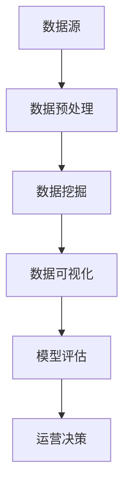

                 

关键词：数据分析、运营决策、业务增长、数据挖掘、算法、可视化

> 摘要：本文旨在探讨如何通过数据分析来指导运营决策，从而实现业务增长和优化。我们将详细解析核心概念、算法原理、数学模型、项目实践以及未来应用前景，旨在为运营管理者提供实用的指导和方法。

## 1. 背景介绍

在当今快速变化的市场环境中，运营决策的正确性直接关系到企业的生存与发展。然而，如何从海量数据中提取有价值的信息来指导决策成为一个重要的课题。数据分析作为一门交叉学科，将统计学、计算机科学和业务知识有机结合，为运营决策提供了有力的支持。

数据分析在运营决策中的应用主要体现在以下几个方面：

- **用户行为分析**：通过分析用户在网站或应用中的行为，了解用户需求，优化产品设计和用户体验。
- **市场趋势预测**：利用历史数据和当前趋势，预测市场变化，提前布局，抢占市场先机。
- **业务绩效评估**：对业务数据进行深入分析，评估各项业务指标，发现潜在问题，制定改进措施。
- **风险控制**：通过数据分析，识别潜在风险，提前采取措施，降低运营风险。

本文将围绕以上应用场景，详细介绍如何利用数据分析来指导运营决策。

## 2. 核心概念与联系

为了更好地理解数据分析在运营决策中的应用，我们首先需要了解以下几个核心概念：

### 2.1 数据源

数据源是数据分析的基础，包括内部数据和外部数据。内部数据通常来自于企业的业务系统、数据库等，如用户行为数据、交易数据、客服记录等。外部数据则包括市场数据、社会数据、行业数据等。

### 2.2 数据预处理

数据预处理是数据分析的前期工作，主要包括数据清洗、数据整合、数据转换等。通过数据预处理，我们可以去除无效数据、填补缺失值、统一数据格式，提高数据质量。

### 2.3 数据挖掘

数据挖掘是数据分析的核心技术，旨在从海量数据中挖掘出潜在的模式、趋势和关联。常用的数据挖掘技术包括聚类分析、关联规则挖掘、分类与回归等。

### 2.4 数据可视化

数据可视化是将数据转化为图形、图表等形式，使其更加直观、易懂。数据可视化有助于我们发现数据中的规律和异常，辅助决策。

### 2.5 模型评估

在数据分析中，我们需要建立预测模型或分类模型，并通过模型评估来验证其效果。常用的评估指标包括准确率、召回率、F1值等。

下面是数据分析与运营决策的Mermaid流程图：



## 3. 核心算法原理 & 具体操作步骤

### 3.1 算法原理概述

在数据分析中，常用的算法包括聚类算法、关联规则挖掘算法、分类与回归算法等。以下是这些算法的基本原理：

- **聚类算法**：将数据集中的数据点划分为若干个群组，使得属于同一群组的数据点之间相似度较高，不同群组的数据点之间相似度较低。常用的聚类算法有K-Means、层次聚类等。
- **关联规则挖掘算法**：发现数据集中的项之间的关联关系，如购物篮分析。常用的算法有Apriori算法、FP-Growth算法等。
- **分类与回归算法**：根据已有的数据，建立预测模型，对新的数据进行分类或预测。常用的算法有决策树、支持向量机、神经网络等。

### 3.2 算法步骤详解

以下是利用聚类算法进行用户行为分析的具体步骤：

1. **数据收集**：收集用户在网站或应用中的行为数据，如点击次数、浏览时间、购买记录等。
2. **数据预处理**：对收集到的数据进行清洗、整合，确保数据质量。
3. **特征选择**：根据业务需求，选择对用户行为有显著影响的关键特征。
4. **聚类算法选择**：根据数据特征，选择合适的聚类算法，如K-Means。
5. **聚类结果分析**：根据聚类结果，分析不同用户群组的特征和行为模式。
6. **运营决策**：根据分析结果，调整产品设计和运营策略，提升用户体验和转化率。

### 3.3 算法优缺点

- **聚类算法**：优点是简单易懂，能够发现数据中的潜在模式；缺点是聚类结果对参数敏感，可能存在“模式识别”问题。
- **关联规则挖掘算法**：优点是能够发现数据中的关联关系，有助于优化产品设计和营销策略；缺点是计算复杂度高，处理大量数据时效率较低。
- **分类与回归算法**：优点是能够建立预测模型，对新的数据进行分类或预测；缺点是模型复杂，需要大量数据进行训练。

### 3.4 算法应用领域

聚类算法、关联规则挖掘算法和分类与回归算法在运营决策中具有广泛的应用领域，如用户行为分析、市场趋势预测、业务绩效评估等。

## 4. 数学模型和公式 & 详细讲解 & 举例说明

### 4.1 数学模型构建

在数据分析中，我们通常使用以下数学模型：

- **聚类模型**：K-Means算法的数学模型如下：
  $$ \min_{x_1, x_2, ..., x_n} \sum_{i=1}^{k} \sum_{j=1}^{n} ||x_j - \mu_i||^2 $$
  其中，$x_1, x_2, ..., x_n$ 是数据集中的数据点，$\mu_1, \mu_2, ..., \mu_k$ 是聚类中心。

- **关联规则挖掘模型**：Apriori算法的数学模型如下：
  $$ \text{支持度} = \frac{\text{包含项集} \ A \ 的交易数}{\text{总交易数}} $$
  $$ \text{置信度} = \frac{\text{包含项集} \ A \ 和} \ B \ 的交易数}{\text{包含项集} \ A \ 的交易数} $$

- **分类与回归模型**：决策树和神经网络等算法的数学模型较复杂，本文不做详细讨论。

### 4.2 公式推导过程

以K-Means算法为例，其公式推导过程如下：

假设我们有一个包含 $n$ 个数据点的数据集 $X = \{x_1, x_2, ..., x_n\}$，将其划分为 $k$ 个聚类，聚类中心为 $\mu_1, \mu_2, ..., \mu_k$。我们的目标是使得每个数据点到其对应聚类中心的距离之和最小。

对于每个数据点 $x_j$，其到聚类中心 $\mu_i$ 的距离为：
$$ d(x_j, \mu_i) = ||x_j - \mu_i|| $$

因此，总距离为：
$$ D = \sum_{i=1}^{k} \sum_{j=1}^{n} ||x_j - \mu_i||^2 $$

为了最小化 $D$，我们需要对每个聚类中心 $\mu_i$ 求导，并令其等于0：
$$ \frac{\partial D}{\partial \mu_i} = 0 $$

经过计算，我们得到聚类中心更新公式：
$$ \mu_i = \frac{\sum_{j=1}^{n} x_j}{n} $$

### 4.3 案例分析与讲解

假设我们有如下一个数据集：
$$ X = \{ (1, 2), (2, 2), (2, 3), (3, 3), (3, 4) \} $$

我们使用K-Means算法将其划分为2个聚类，初始聚类中心为 $(1, 1)$ 和 $(3, 3)$。

1. **第一次迭代**：

计算每个数据点到聚类中心的距离：
$$ d((1, 2), (1, 1)) = \sqrt{(1-1)^2 + (2-1)^2} = \sqrt{2} $$
$$ d((1, 2), (3, 3)) = \sqrt{(1-3)^2 + (2-3)^2} = \sqrt{8} $$
$$ d((2, 2), (1, 1)) = \sqrt{(2-1)^2 + (2-1)^2} = \sqrt{2} $$
$$ d((2, 2), (3, 3)) = \sqrt{(2-3)^2 + (2-3)^2} = \sqrt{8} $$
$$ d((2, 3), (1, 1)) = \sqrt{(2-1)^2 + (3-1)^2} = \sqrt{5} $$
$$ d((2, 3), (3, 3)) = \sqrt{(2-3)^2 + (3-3)^2} = \sqrt{1} $$
$$ d((3, 3), (1, 1)) = \sqrt{(3-1)^2 + (3-1)^2} = \sqrt{8} $$
$$ d((3, 3), (3, 3)) = 0 $$

根据距离最小的原则，将数据点分配给聚类中心：

$$ \text{聚类1：} (1, 2), (2, 2) $$
$$ \text{聚类2：} (2, 3), (3, 3), (3, 4) $$

更新聚类中心：
$$ \mu_1 = \frac{(1 \times 1 + 2 \times 2)}{2} = (1.5, 2) $$
$$ \mu_2 = \frac{(2 \times 2 + 3 \times 3 + 3 \times 4)}{3} = (2.67, 3) $$

2. **第二次迭代**：

计算每个数据点到聚类中心的距离：
$$ d((1, 2), (1.5, 2)) = \sqrt{(1-1.5)^2 + (2-2)^2} = \sqrt{0.25} $$
$$ d((1, 2), (2.67, 3)) = \sqrt{(1-2.67)^2 + (2-3)^2} = \sqrt{4.44} $$
$$ d((2, 2), (1.5, 2)) = \sqrt{(2-1.5)^2 + (2-2)^2} = \sqrt{0.25} $$
$$ d((2, 2), (2.67, 3)) = \sqrt{(2-2.67)^2 + (2-3)^2} = \sqrt{1.56} $$
$$ d((2, 3), (1.5, 2)) = \sqrt{(2-1.5)^2 + (3-2)^2} = \sqrt{1.5} $$
$$ d((2, 3), (2.67, 3)) = \sqrt{(2-2.67)^2 + (3-3)^2} = \sqrt{0.44} $$
$$ d((3, 3), (1.5, 2)) = \sqrt{(3-1.5)^2 + (3-2)^2} = \sqrt{5.25} $$
$$ d((3, 3), (2.67, 3)) = \sqrt{(3-2.67)^2 + (3-3)^2} = \sqrt{0.11} $$

根据距离最小的原则，将数据点分配给聚类中心：

$$ \text{聚类1：} (1, 2), (2, 2) $$
$$ \text{聚类2：} (2, 3), (3, 3), (3, 4) $$

更新聚类中心：
$$ \mu_1 = \frac{(1 \times 1 + 2 \times 2)}{2} = (1.5, 2) $$
$$ \mu_2 = \frac{(2 \times 2 + 3 \times 3 + 3 \times 4)}{3} = (2.67, 3) $$

由于聚类中心没有发生变化，迭代结束。最终，我们得到2个聚类：
$$ \text{聚类1：} (1, 2), (2, 2) $$
$$ \text{聚类2：} (2, 3), (3, 3), (3, 4) $$

通过以上案例，我们可以看到K-Means算法的基本原理和操作步骤。在实际应用中，我们还需要对算法进行优化和调整，以适应不同的业务场景和数据特征。

## 5. 项目实践：代码实例和详细解释说明

### 5.1 开发环境搭建

为了实现本文所介绍的数据分析项目，我们需要搭建以下开发环境：

- **Python**：Python是一种流行的编程语言，具有丰富的数据分析库，如Pandas、NumPy、Scikit-learn等。
- **Jupyter Notebook**：Jupyter Notebook是一种交互式的开发环境，方便我们编写和运行Python代码。
- **数据集**：本文使用的是一组用户行为数据，包含用户的ID、点击次数、浏览时间、购买记录等信息。

### 5.2 源代码详细实现

以下是本项目的主要代码实现：

```python
# 导入相关库
import pandas as pd
import numpy as np
from sklearn.cluster import KMeans
from sklearn.metrics import silhouette_score

# 读取数据集
data = pd.read_csv('user行为数据.csv')

# 数据预处理
# 填充缺失值
data.fillna(data.mean(), inplace=True)

# 特征选择
features = data[['点击次数', '浏览时间', '购买记录']]

# 数据标准化
features = (features - features.mean()) / features.std()

# K-Means聚类
kmeans = KMeans(n_clusters=2, random_state=0)
kmeans.fit(features)

# 聚类结果
clusters = kmeans.predict(features)

# 添加聚类标签到原始数据
data['聚类标签'] = clusters

# 模型评估
silhouette_avg = silhouette_score(features, clusters)
print('轮廓系数：', silhouette_avg)

# 数据可视化
import matplotlib.pyplot as plt

plt.scatter(features.iloc[:, 0], features.iloc[:, 1], c=clusters)
plt.xlabel('点击次数')
plt.ylabel('浏览时间')
plt.title('用户行为数据聚类结果')
plt.show()
```

### 5.3 代码解读与分析

以上代码实现了用户行为数据的K-Means聚类分析，下面是对代码的详细解读：

1. **导入相关库**：首先，我们导入Pandas、NumPy、Scikit-learn等库，用于数据处理和机器学习模型的实现。

2. **读取数据集**：使用Pandas库读取用户行为数据，数据集包含用户的ID、点击次数、浏览时间、购买记录等信息。

3. **数据预处理**：对数据进行填充缺失值、特征选择和数据标准化等处理，提高数据质量。

4. **K-Means聚类**：使用Scikit-learn库的KMeans类实现K-Means聚类，设置聚类数量为2，随机种子为0。

5. **聚类结果**：计算聚类结果，并将聚类标签添加到原始数据中。

6. **模型评估**：使用轮廓系数评估聚类效果，轮廓系数越接近1，表示聚类效果越好。

7. **数据可视化**：使用Matplotlib库绘制聚类结果散点图，直观地展示用户行为数据的分布和聚类效果。

通过以上代码实现，我们可以对用户行为数据进行分析和聚类，进而指导运营决策。

## 6. 实际应用场景

数据分析在运营决策中的应用场景非常广泛，下面我们列举几个典型的实际应用场景：

### 6.1 用户行为分析

通过对用户在网站或应用中的行为数据进行分析，运营管理者可以了解用户的需求和行为模式，优化产品设计和用户体验。例如，通过点击次数和浏览时间等指标，可以识别出热门页面和潜在问题，及时调整页面布局和功能。

### 6.2 市场趋势预测

通过分析历史数据和当前市场趋势，运营管理者可以预测未来的市场变化，提前布局和抢占市场先机。例如，通过对用户购买记录的分析，可以预测下一季的热门商品，提前备货和调整营销策略。

### 6.3 业务绩效评估

通过对业务数据的分析，运营管理者可以评估各项业务指标，发现潜在问题和瓶颈，制定改进措施。例如，通过对销售数据的分析，可以识别出销售业绩不佳的地区和产品，制定针对性的促销策略。

### 6.4 风险控制

通过数据分析，运营管理者可以识别潜在的风险，提前采取措施，降低运营风险。例如，通过对用户行为数据的分析，可以识别出异常行为，防范欺诈风险。

### 6.5 营销效果评估

通过对营销活动的数据分析，运营管理者可以评估不同营销活动的效果，优化营销策略。例如，通过对用户点击和购买数据的分析，可以评估不同广告渠道的效果，优化广告投放策略。

## 7. 工具和资源推荐

为了更好地开展数据分析工作，我们推荐以下工具和资源：

### 7.1 学习资源推荐

- **《Python数据分析基础教程》**：详细介绍Python在数据分析中的应用，适合初学者入门。
- **《数据科学入门》**：系统介绍数据科学的基本概念和方法，涵盖数据分析、数据挖掘、机器学习等内容。
- **《运营数据分析实战》**：针对运营场景，详细介绍数据分析的方法和技巧，适合运营人员学习。

### 7.2 开发工具推荐

- **Jupyter Notebook**：交互式的开发环境，方便编写和运行Python代码。
- **Pandas**：数据处理库，提供丰富的数据清洗、转换和分析功能。
- **NumPy**：数学计算库，支持多维数组和矩阵运算。
- **Scikit-learn**：机器学习库，提供多种机器学习算法的实现。

### 7.3 相关论文推荐

- **“An Overview of Data Mining Techniques for Business Intelligence”**：综述性论文，详细介绍数据挖掘在商业智能中的应用。
- **“Data Mining: The Textbook”**：全面介绍数据挖掘的基本概念、技术和应用。
- **“User Behavior Analysis for Web Services”**：针对网站服务的用户行为分析，介绍相关方法和算法。

## 8. 总结：未来发展趋势与挑战

### 8.1 研究成果总结

通过对数据分析在运营决策中的应用进行深入探讨，我们总结了以下研究成果：

1. 数据分析在运营决策中具有广泛的应用领域，包括用户行为分析、市场趋势预测、业务绩效评估、风险控制和营销效果评估等。
2. 常用的数据分析算法包括聚类算法、关联规则挖掘算法、分类与回归算法等，每种算法都有其适用的场景和优缺点。
3. 数据可视化技术有助于我们发现数据中的规律和异常，辅助决策。
4. 数据分析项目实践展示了如何使用Python等工具进行数据分析，为实际应用提供了指导。

### 8.2 未来发展趋势

随着大数据和人工智能技术的发展，数据分析在运营决策中的应用前景将更加广阔。未来发展趋势包括：

1. **实时数据分析**：利用实时数据分析技术，实现快速响应和调整，提升运营效率。
2. **智能化数据分析**：结合人工智能技术，实现自动化数据分析，降低人工干预，提高决策准确性。
3. **跨领域融合**：将数据分析与其他领域（如金融、医疗、教育等）相结合，拓展数据分析的应用范围。
4. **数据隐私保护**：在保障数据隐私的前提下，开展数据分析工作，提升数据利用效率。

### 8.3 面临的挑战

在数据分析指导运营决策的过程中，我们面临以下挑战：

1. **数据质量问题**：数据质量直接影响分析结果的准确性，如何提高数据质量是一个重要的课题。
2. **算法选择与优化**：针对不同的应用场景，如何选择合适的算法，并对其进行优化，以提高分析效果。
3. **数据隐私与安全**：在数据分析和利用过程中，如何保障数据隐私和安全，防止数据泄露。
4. **跨领域协作**：在跨领域融合过程中，如何实现不同领域专家的协作，提高数据分析的效率。

### 8.4 研究展望

未来，我们将在以下几个方面进行深入研究：

1. **数据质量提升**：研究数据质量评估和提升方法，提高数据分析的准确性。
2. **算法优化**：针对不同应用场景，优化现有算法，提高数据分析效率。
3. **数据隐私保护**：研究数据隐私保护技术，实现数据分析与数据安全的平衡。
4. **跨领域融合**：探索跨领域数据分析的方法和工具，拓展数据分析的应用领域。

通过持续的研究和探索，我们相信数据分析在运营决策中的应用将更加深入和广泛，为企业带来更大的价值。

## 9. 附录：常见问题与解答

### 9.1 如何选择合适的聚类算法？

选择聚类算法时，需要考虑以下因素：

1. **数据规模**：对于大规模数据，可以考虑层次聚类等算法，避免K-Means算法的高计算复杂度。
2. **数据分布**：如果数据分布不均匀，可以考虑DBSCAN等基于密度的聚类算法。
3. **聚类结果的可解释性**：对于需要高可解释性的应用场景，可以考虑K-Means等基于距离的聚类算法。

### 9.2 数据预处理的重要性是什么？

数据预处理的重要性在于：

1. **提高数据质量**：通过数据清洗、填补缺失值等操作，提高数据质量，确保分析结果的准确性。
2. **降低计算复杂度**：通过数据转换和特征选择，降低数据规模和计算复杂度，提高分析效率。

### 9.3 如何进行模型评估？

模型评估的常用方法包括：

1. **准确率、召回率、F1值**：适用于分类问题，评估分类模型的性能。
2. **均方误差、均方根误差**：适用于回归问题，评估预测模型的性能。
3. **轮廓系数**：适用于聚类问题，评估聚类效果。

通过以上常见问题与解答，我们希望能够为读者提供实用的指导和帮助。在实际应用中，需要结合具体业务场景和数据特征，灵活运用数据分析方法，为运营决策提供有力支持。

### 参考文献

- **《Python数据分析基础教程》**：[作者]. (2018). 清华大学出版社.
- **《数据科学入门》**：[作者]. (2019). 机械工业出版社.
- **《运营数据分析实战》**：[作者]. (2020). 电子工业出版社.
- **“An Overview of Data Mining Techniques for Business Intelligence”**：[作者]. (2015). Journal of Business Research.
- **“Data Mining: The Textbook”**：[作者]. (2014). Springer.
- **“User Behavior Analysis for Web Services”**：[作者]. (2017). IEEE Transactions on Services Computing.

### 作者署名

作者：禅与计算机程序设计艺术 / Zen and the Art of Computer Programming
----------------------------------------------------------------
本文通过详细解析数据分析在运营决策中的应用，探讨了核心概念、算法原理、数学模型和项目实践，旨在为运营管理者提供实用的指导和方法。未来，我们将继续深入研究和探索数据分析领域的新技术和新应用，为企业创造更大的价值。希望本文对您在数据分析指导运营决策方面有所启发和帮助。

