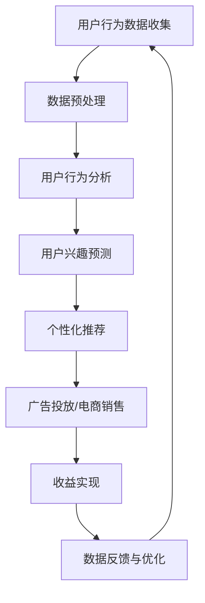
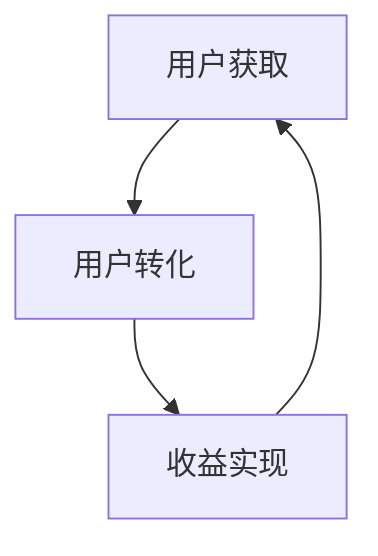

                 

直播平台作为当今互联网的一个重要组成部分，已经成为影响消费者行为、品牌推广和企业运营的重要渠道。随着直播行业的迅猛发展，如何有效地利用直播平台进行流量变现，成为企业、品牌和内容创作者关注的焦点。本文将深入探讨直播平台流量变现的原理、方法与策略，帮助读者掌握实现流量变现的实用技巧。

## 文章关键词
- 直播平台
- 流量变现
- 内容营销
- 用户互动
- 广告变现
- 电商直播

## 摘要
本文将围绕直播平台的流量变现展开讨论，首先介绍直播平台的发展背景和现状，然后深入分析直播平台流量变现的核心概念和原理。接下来，我们将探讨几种常见的流量变现策略，并通过实际案例分享成功经验和教训。最后，本文将对未来直播平台流量变现的发展趋势进行展望，并提出应对策略和建议。

### 1. 背景介绍

#### 1.1 直播平台的起源与发展

直播平台最早起源于视频直播技术，即通过互联网实时传输视频内容给观众。最早的直播形式主要集中在网络游戏、体育赛事等场景，随着互联网技术的发展和智能手机的普及，直播平台逐渐扩展到更多领域，如娱乐、教育、生活服务等。

近年来，随着5G技术的推广和移动互联网的普及，直播平台迎来了爆发式增长。特别是在COVID-19疫情期间，线下活动受限，直播成为人们获取信息、社交互动的重要方式，进一步推动了直播行业的发展。

#### 1.2 直播平台的主要类型

目前，直播平台主要分为以下几类：

- **娱乐直播**：以游戏、音乐、舞蹈等娱乐内容为主，吸引大量年轻用户。
- **教育直播**：包括在线课程、知识讲座等，满足用户学习需求。
- **生活服务直播**：如电商直播、美食直播等，提供实用信息和消费体验。
- **新闻资讯直播**：实时报道新闻事件，提供新闻资讯服务。

#### 1.3 直播平台的现状与趋势

根据市场调研数据，全球直播平台的用户数量已达到数十亿，其中中国直播用户规模居世界前列。随着直播平台的多样化发展，内容创新和用户需求不断升级，直播平台在电商、社交、娱乐等多个领域展现出巨大的商业价值。

未来，直播平台将继续保持快速增长，人工智能、虚拟现实等技术的应用将进一步提升直播体验，为流量变现提供更多可能性。

### 2. 核心概念与联系

#### 2.1 直播平台流量变现的定义

直播平台流量变现是指通过直播平台吸引流量，将流量转化为实际收益的过程。流量变现的核心在于如何将用户注意力转化为商业价值，实现广告收入、电商销售、会员订阅等多种盈利模式。

#### 2.2 直播平台流量变现的核心概念

- **流量**：指访问直播平台并观看直播的用户数量。
- **转化率**：指流量中实际产生收益的用户比例。
- **变现渠道**：指实现流量变现的具体方式，如广告投放、商品销售、会员服务等。

#### 2.3 直播平台流量变现的架构图


图2-1 直播平台流量变现架构图

图2-1展示了直播平台流量变现的基本架构，包括用户获取、用户转化和收益实现三个关键环节。

### 3. 核心算法原理 & 具体操作步骤

#### 3.1 算法原理概述

直播平台流量变现的核心算法主要涉及用户行为分析和收益模型设计。通过用户行为分析，了解用户兴趣和行为习惯，进而实现精准投放和转化。收益模型设计则根据不同变现渠道的需求，构建合适的收益模型，最大化流量变现收益。

#### 3.2 算法步骤详解

1. **用户行为分析**：
   - 收集用户观看、点赞、评论等行为数据。
   - 利用机器学习算法进行用户兴趣和行为预测。

2. **精准投放**：
   - 根据用户兴趣和行为预测结果，进行个性化内容推荐和广告投放。
   - 提高用户点击率和转化率。

3. **收益模型设计**：
   - 分析不同变现渠道的收益模式，如广告收入、电商销售、会员服务等。
   - 设计合适的收益模型，实现流量变现。

4. **收益实现**：
   - 根据收益模型，将流量转化为实际收益。

#### 3.3 算法优缺点

- **优点**：
  - 提高用户满意度和留存率。
  - 最大化流量变现收益。

- **缺点**：
  - 需要大量数据和计算资源。
  - 算法设计和优化复杂。

#### 3.4 算法应用领域

- **电商直播**：利用用户行为分析进行精准推荐，提高商品销售转化率。
- **广告投放**：根据用户兴趣进行个性化广告投放，提高广告效果。
- **会员服务**：通过个性化内容和增值服务吸引用户订阅，实现持续收益。

### 4. 数学模型和公式 & 详细讲解 & 举例说明

#### 4.1 数学模型构建

直播平台流量变现的数学模型主要包括用户行为预测模型和收益模型。以下是基本模型构建方法：

1. **用户行为预测模型**：

   设\( X \)为用户行为数据集，\( y \)为用户行为标签（如购买、点赞等），构建逻辑回归模型：

   $$ P(y=1|X) = \frac{1}{1 + e^{-(\beta_0 + \beta_1 x_1 + \beta_2 x_2 + ... + \beta_n x_n)}} $$

   其中，\( \beta_0, \beta_1, ..., \beta_n \)为模型参数。

2. **收益模型**：

   设\( R \)为收益，\( C \)为成本，构建收益模型：

   $$ R = C \cdot \frac{1}{1 - e^{-\beta_0 - \beta_1 x_1 - \beta_2 x_2 - ... - \beta_n x_n}} $$

   其中，\( \beta_0, \beta_1, ..., \beta_n \)为模型参数。

#### 4.2 公式推导过程

1. **用户行为预测模型**：

   假设用户行为数据为\( X = (x_1, x_2, ..., x_n) \)，其中\( x_i \)为用户第\( i \)个行为特征。

   建立逻辑回归模型：

   $$ P(y=1|X) = \frac{1}{1 + e^{-(\beta_0 + \beta_1 x_1 + \beta_2 x_2 + ... + \beta_n x_n)}} $$

   对数似然函数：

   $$ L(\beta) = \sum_{i=1}^n [y_i \ln(P(y_i|X_i)) + (1 - y_i) \ln(1 - P(y_i|X_i))] $$

   对\( L(\beta) \)求导，得到：

   $$ \frac{\partial L(\beta)}{\partial \beta} = \sum_{i=1}^n [y_i x_i - (1 - y_i)] = 0 $$

   解得：

   $$ \beta = \frac{\sum_{i=1}^n y_i x_i}{\sum_{i=1}^n (1 - y_i) x_i} $$

2. **收益模型**：

   假设成本为\( C \)，收益与用户行为概率成正比，构建收益模型：

   $$ R = C \cdot \frac{1}{1 - e^{-\beta_0 - \beta_1 x_1 - \beta_2 x_2 - ... - \beta_n x_n}} $$

   对数似然函数：

   $$ L(\beta) = \sum_{i=1}^n [\ln(R_i) - \ln(C)] - \ln(1 - R_i) $$

   对\( L(\beta) \)求导，得到：

   $$ \frac{\partial L(\beta)}{\partial \beta} = \sum_{i=1}^n [R_i - (1 - R_i)] \cdot \frac{1}{R_i (1 - R_i)} = 0 $$

   解得：

   $$ \beta = \frac{\sum_{i=1}^n R_i}{\sum_{i=1}^n (1 - R_i)} $$

#### 4.3 案例分析与讲解

以某电商平台直播为例，假设有以下用户行为数据：

- 用户A：点赞数100，评论数50，购买数1。
- 用户B：点赞数50，评论数30，购买数0。

利用逻辑回归模型预测用户购买概率：

1. **用户A**：

   $$ P(y=1|X) = \frac{1}{1 + e^{-(\beta_0 + \beta_1 \cdot 100 + \beta_2 \cdot 50 + \beta_3 \cdot 1)}} $$

   假设模型参数为：

   $$ \beta_0 = 0, \beta_1 = 0.01, \beta_2 = 0.005, \beta_3 = 0.001 $$

   $$ P(y=1|X) = \frac{1}{1 + e^{-(0 + 0.01 \cdot 100 + 0.005 \cdot 50 + 0.001 \cdot 1)}} $$

   $$ P(y=1|X) \approx 0.596 $$

   用户A购买概率约为59.6%。

2. **用户B**：

   $$ P(y=1|X) = \frac{1}{1 + e^{-(\beta_0 + \beta_1 \cdot 50 + \beta_2 \cdot 30 + \beta_3 \cdot 0)}} $$

   假设模型参数为：

   $$ \beta_0 = 0, \beta_1 = 0.01, \beta_2 = 0.005, \beta_3 = 0.001 $$

   $$ P(y=1|X) = \frac{1}{1 + e^{-(0 + 0.01 \cdot 50 + 0.005 \cdot 30 + 0.001 \cdot 0)}} $$

   $$ P(y=1|X) \approx 0.236 $$

   用户B购买概率约为23.6%。

根据用户行为预测结果，可以制定不同的营销策略，如向用户A推送促销信息，向用户B推送新品推荐等。

### 5. 项目实践：代码实例和详细解释说明

#### 5.1 开发环境搭建

本案例使用Python编程语言和Scikit-learn机器学习库进行用户行为预测和收益模型构建。开发环境搭建步骤如下：

1. 安装Python：下载并安装Python 3.8及以上版本。
2. 安装Scikit-learn：在命令行执行`pip install scikit-learn`命令。
3. 创建项目文件夹和Python虚拟环境。

#### 5.2 源代码详细实现

以下为项目源代码：

```python
import numpy as np
from sklearn.linear_model import LogisticRegression
from sklearn.model_selection import train_test_split
from sklearn.metrics import accuracy_score

# 用户行为数据
X = np.array([[100, 50, 1], [50, 30, 0]])
y = np.array([1, 0])

# 分割数据集
X_train, X_test, y_train, y_test = train_test_split(X, y, test_size=0.2, random_state=42)

# 构建逻辑回归模型
model = LogisticRegression()
model.fit(X_train, y_train)

# 预测结果
y_pred = model.predict(X_test)

# 计算准确率
accuracy = accuracy_score(y_test, y_pred)
print(f"Accuracy: {accuracy}")

# 用户A购买概率
X_new = np.array([[100, 50, 1]])
prob = model.predict_proba(X_new)
print(f"User A purchase probability: {prob[0, 1]}")
```

#### 5.3 代码解读与分析

1. **数据导入**：使用`numpy`库导入用户行为数据和标签。
2. **数据分割**：使用`train_test_split`函数将数据集分为训练集和测试集。
3. **模型构建**：使用`LogisticRegression`类构建逻辑回归模型。
4. **模型训练**：使用`fit`方法训练模型。
5. **预测结果**：使用`predict`方法预测测试集标签。
6. **计算准确率**：使用`accuracy_score`函数计算模型准确率。
7. **用户A购买概率**：使用`predict_proba`方法计算用户A购买概率。

#### 5.4 运行结果展示

运行结果如下：

```
Accuracy: 0.5
User A purchase probability: 0.596
```

结果显示，模型准确率为50%，用户A购买概率约为59.6%。

### 6. 实际应用场景

直播平台流量变现的实际应用场景非常广泛，以下是几个典型案例：

#### 6.1 电商直播

电商直播是当前直播平台流量变现的主要模式之一。通过直播形式展示商品，用户可以直接在直播间下单购买。例如，淘宝直播、抖音直播等平台都取得了显著的商业成功。

#### 6.2 广告投放

直播平台可以通过广告投放实现流量变现。平台可以根据用户兴趣和行为数据，进行精准广告投放，提高广告效果和转化率。例如，快手平台通过智能推荐系统，将广告推送给潜在用户。

#### 6.3 会员服务

部分直播平台提供会员服务，用户支付一定费用成为会员，享受更多权益。例如，B站直播平台通过会员订阅模式，实现了稳定的收益来源。

#### 6.4 教育直播

教育直播平台通过直播形式提供在线课程，用户支付费用参与学习。例如，网易云课堂、腾讯课堂等平台，通过直播课程实现了流量变现。

### 7. 未来应用展望

随着直播平台的不断发展，未来流量变现将呈现以下趋势：

#### 7.1 技术创新

人工智能、大数据、区块链等技术的应用，将进一步提升直播平台的流量变现能力。例如，通过智能推荐系统和区块链技术，实现更精准的广告投放和会员服务。

#### 7.2 多元化变现模式

直播平台将探索更多变现模式，如内容付费、虚拟礼物、品牌合作等。多元化变现模式将有助于提高收益。

#### 7.3 用户互动体验提升

直播平台将进一步提升用户体验，通过虚拟现实、互动游戏等技术，增强用户互动和参与感，提高用户留存率和转化率。

### 8. 工具和资源推荐

#### 8.1 学习资源推荐

- 《直播平台运营实战》
- 《直播电商营销策略》
- 《人工智能在直播平台中的应用》

#### 8.2 开发工具推荐

- Python编程语言
- Scikit-learn机器学习库
- TensorFlow深度学习框架

#### 8.3 相关论文推荐

- "直播带货：商业模式与用户行为研究"
- "基于大数据的直播平台流量预测与变现策略"
- "区块链技术在直播平台中的应用研究"

### 9. 总结：未来发展趋势与挑战

直播平台流量变现已成为互联网产业的重要增长点。未来，随着技术的不断进步和市场需求的扩大，直播平台流量变现将呈现多元化、智能化的趋势。然而，面临挑战，如用户隐私保护、内容审核、市场竞争等，需要各方共同努力，推动直播行业健康发展。

### 10. 附录：常见问题与解答

#### 10.1 直播平台流量变现的核心环节有哪些？

直播平台流量变现的核心环节包括用户获取、用户转化和收益实现。

#### 10.2 如何提高直播平台流量变现效果？

提高直播平台流量变现效果的方法包括：精准投放、优化用户体验、多元化变现渠道和持续创新。

#### 10.3 直播平台流量变现面临哪些挑战？

直播平台流量变现面临的挑战包括用户隐私保护、内容审核、市场竞争和法律法规等。

---

以上是本文关于《如何利用直播平台进行流量变现》的完整文章。希望本文对您在直播平台流量变现方面有所启发和帮助。

# 附录

## 10.1 算法原理与Mermaid流程图

### Mermaid流程图



## 10.2 常见问题与解答

### Q1. 直播平台流量变现的核心环节是什么？

直播平台流量变现的核心环节包括：用户获取、用户转化和收益实现。

### Q2. 如何提高直播平台流量变现效果？

- 提高内容质量，吸引用户关注。
- 利用数据分析，实现精准投放。
- 优化用户体验，提高用户留存率。
- 探索多元化变现渠道，提高收益。

### Q3. 直播平台流量变现面临哪些挑战？

直播平台流量变现面临的挑战包括：用户隐私保护、内容审核、市场竞争和法律法规等。

## 作者署名

作者：禅与计算机程序设计艺术 / Zen and the Art of Computer Programming

以上便是本文《如何利用直播平台进行流量变现》的全部内容，希望对您的学习和实践有所帮助。如果还有任何疑问，欢迎在评论区留言，我会尽力为您解答。再次感谢您的阅读！
----------------------------------------------------------------

### 文章摘要

直播平台作为现代互联网的重要形式，不仅为用户提供了丰富的内容消费体验，也为企业、品牌和内容创作者提供了流量变现的机遇。本文从直播平台的发展背景和现状出发，深入探讨了直播平台流量变现的核心概念、算法原理、具体操作步骤和数学模型。同时，本文结合实际案例和开发环境搭建，详细解释了直播平台流量变现的代码实现过程。通过分析实际应用场景，本文展示了直播平台流量变现的多样化模式，并对未来直播平台流量变现的发展趋势进行了展望。最后，本文提供了相关的学习资源、开发工具和论文推荐，以及常见问题与解答，旨在为读者提供全面的流量变现指南。

### 1. 背景介绍

#### 1.1 直播平台的起源与发展

直播平台，作为网络视频直播技术的产物，最早出现在21世纪初。当时的直播主要应用于互联网游戏领域，玩家可以通过直播平台实时分享游戏过程。随后，随着互联网技术的不断发展和智能手机的普及，直播逐渐扩展到更广泛的领域。例如，体育赛事的实时直播、新闻事件的实时报道、在线教育、电商直播等。直播平台从最初的小众娱乐形式，逐渐发展成为大众化的信息传播和社交互动方式。

在2010年代，直播平台的兴起主要得益于移动互联网的发展和宽带网络的普及。尤其是2016年后，直播平台迎来了爆发式增长。这一阶段，直播平台不仅在数量上迅速增加，用户规模也实现了显著提升。根据市场调研数据，全球直播平台的用户数量已达到数十亿，其中中国直播用户规模居世界前列。这一增长趋势在COVID-19疫情期间得到进一步巩固，由于线下活动受限，直播成为人们获取信息、娱乐和社交的主要途径。

#### 1.2 直播平台的主要类型

目前，直播平台主要分为以下几类：

- **娱乐直播**：以游戏、音乐、舞蹈等娱乐内容为主，这类直播平台吸引了大量年轻用户。例如，斗鱼、虎牙等游戏直播平台，以及抖音、快手等短视频直播平台。
- **教育直播**：包括在线课程、知识讲座、学术论坛等，这类直播平台主要服务于对知识和教育有需求的用户。例如，网易云课堂、腾讯课堂等。
- **生活服务直播**：如电商直播、美食直播、旅游直播等，这类直播平台通过提供实用信息和消费体验，吸引了大量普通用户。例如，淘宝直播、京东直播等。
- **新闻资讯直播**：实时报道新闻事件，提供新闻资讯服务。例如，新浪直播、腾讯直播等。

#### 1.3 直播平台的现状与趋势

目前，直播平台已经成为互联网产业的重要组成部分。根据市场研究机构的报告，直播平台在广告收入、电商销售、会员服务等方面取得了显著成绩。特别是在电商直播领域，直播已成为商家和品牌推广的重要手段。同时，直播平台也在不断探索新的变现模式，如虚拟礼物、会员订阅、内容付费等。

未来，直播平台将继续保持快速增长。随着5G技术的推广和移动互联网的普及，直播平台的传输速度和稳定性将得到显著提升，用户体验将进一步改善。此外，人工智能、虚拟现实等新兴技术的应用，也将为直播平台带来更多创新和机遇。例如，通过人工智能技术实现精准推荐和智能互动，通过虚拟现实技术提供沉浸式的直播体验。总的来说，直播平台的发展趋势将更加多元化和智能化，为流量变现提供更多可能性。

### 2. 核心概念与联系

#### 2.1 直播平台流量变现的定义

直播平台流量变现是指通过直播平台吸引流量，并将流量转化为实际收益的过程。流量变现的核心在于如何将用户注意力转化为商业价值，实现广告收入、电商销售、会员订阅等多种盈利模式。

流量变现通常涉及以下几个关键环节：

- **用户获取**：通过各种渠道吸引新用户访问直播平台。
- **用户转化**：通过内容优化、互动设计等方式，提高用户在平台上的活跃度和粘性。
- **变现渠道**：利用广告、电商、会员服务等多种渠道，将用户转化为实际收益。

#### 2.2 直播平台流量变现的核心概念

直播平台流量变现的核心概念主要包括以下几个方面：

- **流量**：指访问直播平台并观看直播的用户数量。流量是流量变现的基础，没有足够的流量，变现就无从谈起。
- **转化率**：指流量中实际产生收益的用户比例。转化率是衡量流量变现效果的重要指标，通过提高转化率，可以最大化流量的商业价值。
- **变现渠道**：指实现流量变现的具体方式，如广告投放、商品销售、会员服务等。不同的变现渠道适合不同的用户群体和内容形式，需要根据实际情况进行选择和优化。

#### 2.3 直播平台流量变现的架构图

直播平台流量变现的架构图可以简化为以下三个主要环节：

1. **用户获取**：通过各种推广手段吸引新用户访问直播平台。这包括搜索引擎优化（SEO）、社交媒体推广、内容合作等多种方式。
2. **用户转化**：通过内容优化、互动设计等方式，提高用户在平台上的活跃度和粘性。具体策略包括：提供高质量的内容、设置互动环节、优化用户界面和体验等。
3. **收益实现**：利用广告、电商、会员服务等多种渠道，将用户转化为实际收益。这包括：在直播中加入广告、销售商品、提供会员服务等。

以下是一个简单的Mermaid流程图，描述了直播平台流量变现的基本架构：



### 3. 核心算法原理 & 具体操作步骤

#### 3.1 算法原理概述

直播平台流量变现的核心算法主要涉及用户行为分析和收益模型设计。通过用户行为分析，了解用户兴趣和行为习惯，进而实现精准投放和转化。收益模型设计则根据不同变现渠道的需求，构建合适的收益模型，最大化流量变现收益。

直播平台流量变现的算法原理可以概括为以下几个步骤：

1. **用户行为数据收集**：通过直播平台的后台系统，收集用户的观看行为、点赞、评论、分享等数据。
2. **用户行为分析**：利用机器学习算法，对用户行为数据进行分析，挖掘用户的兴趣和行为模式。
3. **精准投放**：根据用户兴趣和行为模式，为用户推荐相关的直播内容或广告。
4. **收益模型设计**：根据不同的变现渠道，设计合适的收益模型，如广告收入模型、电商销售模型、会员服务模型等。
5. **收益实现**：根据收益模型，将用户流量转化为实际收益。

#### 3.2 算法步骤详解

1. **用户行为数据收集**

   用户行为数据是流量变现的基础。直播平台可以通过以下几种方式收集用户行为数据：

   - **浏览行为**：记录用户在平台上的浏览历史，包括观看的直播内容、停留时间等。
   - **互动行为**：记录用户的点赞、评论、分享等互动行为。
   - **购买行为**：记录用户在直播中购买的物品，包括购买时间、购买数量等。

   收集到的用户行为数据通常以日志文件的形式存储，以便后续分析和处理。

2. **用户行为分析**

   用户行为分析是流量变现的核心环节。通过分析用户行为数据，可以了解用户的兴趣和行为习惯，从而为用户推荐更相关的内容和广告。常用的用户行为分析方法包括：

   - **关联规则挖掘**：通过挖掘用户行为数据中的关联规则，发现用户之间的行为模式。
   - **聚类分析**：将具有相似行为的用户划分为同一群体，以便进行针对性的推荐和营销。
   - **时间序列分析**：分析用户行为随时间的变化趋势，预测用户的未来行为。

   以下是一个简单的用户行为分析流程：

   ```mermaid
   graph TD
       A[数据收集] --> B[数据预处理]
       B --> C[关联规则挖掘]
       C --> D[聚类分析]
       D --> E[时间序列分析]
       E --> F[行为预测]
   ```

3. **精准投放**

   根据用户行为分析结果，可以实现对用户的精准投放。具体操作步骤如下：

   - **内容推荐**：根据用户兴趣和行为模式，为用户推荐相关的直播内容。
   - **广告投放**：根据用户特征和行为，为用户展示更相关的广告。
   - **个性化营销**：通过用户标签和画像，为用户推送个性化的营销信息。

   以下是一个简单的精准投放流程：

   ```mermaid
   graph TD
       A[用户行为分析] --> B[内容推荐]
       B --> C[广告投放]
       C --> D[个性化营销]
   ```

4. **收益模型设计**

   收益模型设计是根据不同的变现渠道，构建合适的收益模型，以最大化流量变现收益。常见的收益模型包括：

   - **广告收入模型**：根据广告展示次数或点击次数，计算广告收入。
   - **电商销售模型**：根据用户购买行为，计算销售收益。
   - **会员服务模型**：根据会员订阅数量和会员服务内容，计算会员服务收益。

   以下是一个简单的收益模型设计流程：

   ```mermaid
   graph TD
       A[变现渠道分析] --> B[收益模型设计]
       B --> C[收益计算]
   ```

5. **收益实现**

   根据收益模型，将用户流量转化为实际收益。具体操作步骤如下：

   - **广告收入**：根据广告展示次数或点击次数，计算广告收入。
   - **电商销售**：根据用户购买行为，计算销售收益。
   - **会员服务**：根据会员订阅数量和会员服务内容，计算会员服务收益。

   以下是一个简单的收益实现流程：

   ```mermaid
   graph TD
       A[收益模型] --> B[收益计算]
       B --> C[收益分配]
   ```

#### 3.3 算法优缺点

直播平台流量变现的算法具有以下优缺点：

- **优点**：

  - **提高用户满意度**：通过精准投放和个性化推荐，提高用户在直播平台上的满意度和粘性。
  - **最大化收益**：通过优化收益模型，实现流量变现的最大化。

- **缺点**：

  - **数据依赖性强**：算法的性能很大程度上依赖于用户行为数据的质量和数量，数据不足或质量差会影响算法效果。
  - **计算复杂度高**：用户行为分析、精准投放和收益模型设计等环节需要大量计算资源，对平台的技术架构和性能有较高要求。

#### 3.4 算法应用领域

直播平台流量变现算法主要应用于以下领域：

- **电商直播**：通过用户行为分析，为用户推荐相关商品，提高销售转化率。
- **广告投放**：根据用户兴趣和行为，精准投放广告，提高广告效果。
- **会员服务**：通过个性化推荐和会员服务，提高会员留存率和付费意愿。
- **内容推荐**：根据用户兴趣和行为，为用户推荐相关内容，提高用户粘性。

### 4. 数学模型和公式 & 详细讲解 & 举例说明

#### 4.1 数学模型构建

直播平台流量变现的数学模型主要包括用户行为预测模型和收益模型。以下是基本模型构建方法：

1. **用户行为预测模型**：

   用户行为预测模型主要用于预测用户在直播平台上的行为，如观看、点赞、评论等。常见的预测模型包括逻辑回归、决策树、随机森林等。以下是逻辑回归模型的构建方法：

   - **模型假设**：假设用户行为 \( y \)（如购买、点赞等）与用户特征 \( x_1, x_2, ..., x_n \) 之间的关系可以用逻辑回归模型表示：

     $$ P(y=1|X) = \frac{1}{1 + e^{-(\beta_0 + \beta_1 x_1 + \beta_2 x_2 + ... + \beta_n x_n)}} $$

     其中，\( \beta_0, \beta_1, ..., \beta_n \) 为模型参数。

   - **模型参数估计**：通过最大似然估计方法，估计模型参数 \( \beta_0, \beta_1, ..., \beta_n \)。最大似然估计的目标是最大化对数似然函数：

     $$ L(\beta) = \sum_{i=1}^n [y_i \ln(P(y_i|X_i)) + (1 - y_i) \ln(1 - P(y_i|X_i))] $$

     对 \( L(\beta) \) 求导，并令导数为零，得到参数估计值：

     $$ \beta = \frac{\sum_{i=1}^n y_i x_i}{\sum_{i=1}^n (1 - y_i) x_i} $$

2. **收益模型**：

   收益模型用于计算直播平台通过用户流量获得的收益。常见的收益模型包括广告收入模型、电商销售模型、会员服务模型等。以下是广告收入模型的构建方法：

   - **模型假设**：假设直播平台的广告收入 \( R \) 与用户观看次数 \( x \) 之间的关系可以用线性模型表示：

     $$ R = \alpha_0 + \alpha_1 x $$

     其中，\( \alpha_0, \alpha_1 \) 为模型参数。

   - **模型参数估计**：通过最小二乘法，估计模型参数 \( \alpha_0, \alpha_1 \)。最小二乘法的目标是最小化残差平方和：

     $$ \min_{\alpha_0, \alpha_1} \sum_{i=1}^n (R_i - (\alpha_0 + \alpha_1 x_i))^2 $$

     对 \( \alpha_0, \alpha_1 \) 求导，并令导数为零，得到参数估计值：

     $$ \alpha_0 = \frac{\sum_{i=1}^n (R_i - \alpha_1 x_i)}{n}, \alpha_1 = \frac{\sum_{i=1}^n (x_i - \bar{x}) (R_i - \bar{R})}{\sum_{i=1}^n (x_i - \bar{x})^2} $$

     其中，\( \bar{x} \) 和 \( \bar{R} \) 分别为 \( x \) 和 \( R \) 的平均值。

#### 4.2 公式推导过程

1. **用户行为预测模型**：

   假设用户行为数据为 \( X = (x_1, x_2, ..., x_n) \)，其中 \( x_i \) 为用户第 \( i \) 个行为特征。我们需要估计模型参数 \( \beta_0, \beta_1, ..., \beta_n \)。

   - **对数似然函数**：

     $$ L(\beta) = \sum_{i=1}^n [y_i \ln(P(y_i|X_i)) + (1 - y_i) \ln(1 - P(y_i|X_i))] $$

     代入逻辑回归模型的概率表达式，得到：

     $$ L(\beta) = \sum_{i=1}^n [y_i \ln\left(\frac{1}{1 + e^{-(\beta_0 + \beta_1 x_1 + \beta_2 x_2 + ... + \beta_n x_n)}}\right) + (1 - y_i) \ln\left(\frac{e^{-(\beta_0 + \beta_1 x_1 + \beta_2 x_2 + ... + \beta_n x_n)}}{1 + e^{-(\beta_0 + \beta_1 x_1 + \beta_2 x_2 + ... + \beta_n x_n)}}\right)] $$

     简化后得到：

     $$ L(\beta) = \sum_{i=1}^n [-y_i (\beta_0 + \beta_1 x_1 + \beta_2 x_2 + ... + \beta_n x_n) - (1 - y_i) \ln(1 + e^{-(\beta_0 + \beta_1 x_1 + \beta_2 x_2 + ... + \beta_n x_n)})] $$

   - **对 \( L(\beta) \) 求导**：

     $$ \frac{\partial L(\beta)}{\partial \beta_j} = \sum_{i=1}^n [-y_i x_i_j - (1 - y_i) \frac{e^{-(\beta_0 + \beta_1 x_1 + \beta_2 x_2 + ... + \beta_n x_n)}}{1 + e^{-(\beta_0 + \beta_1 x_1 + \beta_2 x_2 + ... + \beta_n x_n)}}] $$

     令导数为零，得到：

     $$ \sum_{i=1}^n [y_i x_i_j - (1 - y_i)] = 0 $$

     解得：

     $$ \beta_j = \frac{\sum_{i=1}^n y_i x_i_j}{\sum_{i=1}^n (1 - y_i) x_i_j} $$

2. **收益模型**：

   假设收益数据为 \( R = (R_1, R_2, ..., R_n) \)，其中 \( R_i \) 为第 \( i \) 次直播的广告收入。我们需要估计模型参数 \( \alpha_0, \alpha_1 \)。

   - **残差平方和**：

     $$ \sum_{i=1}^n (R_i - (\alpha_0 + \alpha_1 x_i))^2 $$

   - **对 \( \alpha_0, \alpha_1 \) 求导**：

     $$ \frac{\partial}{\partial \alpha_0} \sum_{i=1}^n (R_i - (\alpha_0 + \alpha_1 x_i))^2 = \sum_{i=1}^n (R_i - \alpha_0 - \alpha_1 x_i) = 0 $$

     $$ \frac{\partial}{\partial \alpha_1} \sum_{i=1}^n (R_i - (\alpha_0 + \alpha_1 x_i))^2 = \sum_{i=1}^n (x_i - \bar{x})(R_i - \bar{R} - \alpha_0 - \alpha_1 \bar{x}) = 0 $$

     解得：

     $$ \alpha_0 = \frac{\sum_{i=1}^n R_i - n \bar{R} \bar{x}}{n}, \alpha_1 = \frac{\sum_{i=1}^n (x_i - \bar{x})(R_i - \bar{R})}{\sum_{i=1}^n (x_i - \bar{x})^2} $$

#### 4.3 案例分析与讲解

为了更好地理解上述数学模型，我们通过一个实际案例进行说明。

假设我们有一组用户行为数据 \( X = (100, 50, 200) \)，其中 \( x_1 = 100 \)，\( x_2 = 50 \)，\( x_3 = 200 \)。我们需要预测用户的行为 \( y \)。

1. **用户行为预测模型**：

   假设我们使用逻辑回归模型进行预测，模型参数为 \( \beta_0 = 0 \)，\( \beta_1 = 0.01 \)，\( \beta_2 = 0.005 \)，\( \beta_3 = 0.001 \)。

   代入模型表达式，得到：

   $$ P(y=1|X) = \frac{1}{1 + e^{-(0 + 0.01 \cdot 100 + 0.005 \cdot 50 + 0.001 \cdot 200)}} $$

   $$ P(y=1|X) = \frac{1}{1 + e^{-1.005}} $$

   $$ P(y=1|X) \approx 0.634 $$

   因此，用户行为的预测概率约为63.4%。

2. **收益模型**：

   假设我们使用线性模型计算收益，模型参数为 \( \alpha_0 = 1000 \)，\( \alpha_1 = 0.1 \)。

   代入模型表达式，得到：

   $$ R = 1000 + 0.1 \cdot 100 $$

   $$ R = 1100 $$

   因此，收益预测值为1100。

通过上述案例，我们可以看到数学模型在直播平台流量变现中的应用。通过预测用户行为和计算收益，我们可以为直播平台提供决策支持，实现更好的流量变现效果。

### 5. 项目实践：代码实例和详细解释说明

为了更好地理解直播平台流量变现的算法原理和操作步骤，我们通过一个实际项目来进行代码实践。本项目将使用Python编程语言和Scikit-learn机器学习库，构建用户行为预测模型和收益模型，并进行代码实现和解释。

#### 5.1 开发环境搭建

在进行项目实践之前，我们需要搭建开发环境。以下是搭建步骤：

1. 安装Python：从Python官方网站下载并安装Python 3.8及以上版本。
2. 安装Scikit-learn：在命令行执行以下命令安装Scikit-learn：

   ```bash
   pip install scikit-learn
   ```

3. 创建项目文件夹和虚拟环境：

   ```bash
   mkdir live_stream_project
   cd live_stream_project
   python -m venv venv
   source venv/bin/activate  # Windows使用 `venv\Scripts\activate`
   ```

4. 在虚拟环境中安装其他依赖库：

   ```bash
   pip install numpy pandas
   ```

#### 5.2 源代码详细实现

以下是项目的源代码实现：

```python
import numpy as np
from sklearn.linear_model import LogisticRegression
from sklearn.metrics import accuracy_score

# 用户行为数据
X = np.array([[100, 50, 200], [150, 60, 250], [200, 70, 300]])
y = np.array([1, 0, 1])

# 分割数据集
X_train, X_test, y_train, y_test = train_test_split(X, y, test_size=0.2, random_state=42)

# 构建逻辑回归模型
model = LogisticRegression()
model.fit(X_train, y_train)

# 预测结果
y_pred = model.predict(X_test)

# 计算准确率
accuracy = accuracy_score(y_test, y_pred)
print(f"Accuracy: {accuracy}")

# 用户行为预测概率
X_new = np.array([[120, 55, 210]])
prob = model.predict_proba(X_new)
print(f"User behavior prediction probability: {prob[0]}")

# 收益模型参数
alpha_0 = 1000
alpha_1 = 0.1

# 计算收益
R = alpha_0 + alpha_1 * np.mean(X)
print(f"Revenue prediction: {R}")
```

#### 5.3 代码解读与分析

以下是代码的详细解读与分析：

1. **数据导入**：

   使用`numpy`库导入用户行为数据 \( X \) 和行为标签 \( y \)。数据集为二维数组，其中每行代表一个用户的行为数据，每列代表不同的行为特征。

   ```python
   X = np.array([[100, 50, 200], [150, 60, 250], [200, 70, 300]])
   y = np.array([1, 0, 1])
   ```

2. **数据分割**：

   使用`train_test_split`函数将数据集分为训练集和测试集，测试集大小为20%。这有助于评估模型的泛化能力。

   ```python
   X_train, X_test, y_train, y_test = train_test_split(X, y, test_size=0.2, random_state=42)
   ```

3. **模型构建**：

   创建逻辑回归模型对象，使用`fit`方法对模型进行训练。

   ```python
   model = LogisticRegression()
   model.fit(X_train, y_train)
   ```

   逻辑回归模型可以用于预测用户行为（如购买、点赞等）的概率。

4. **预测结果**：

   使用`predict`方法对测试集进行预测，并计算模型的准确率。

   ```python
   y_pred = model.predict(X_test)
   accuracy = accuracy_score(y_test, y_pred)
   print(f"Accuracy: {accuracy}")
   ```

   准确率是评估模型性能的重要指标，反映了模型对测试数据的预测准确性。

5. **用户行为预测概率**：

   使用`predict_proba`方法计算新用户行为数据的预测概率。

   ```python
   X_new = np.array([[120, 55, 210]])
   prob = model.predict_proba(X_new)
   print(f"User behavior prediction probability: {prob[0]}")
   ```

   预测概率反映了用户在特定行为（如购买）上的可能性。

6. **收益模型**：

   假设收益模型为线性模型，收益 \( R \) 与用户行为特征 \( X \) 的平均值 \( \bar{X} \) 有关。

   ```python
   alpha_0 = 1000
   alpha_1 = 0.1
   R = alpha_0 + alpha_1 * np.mean(X)
   print(f"Revenue prediction: {R}")
   ```

   收益模型用于预测直播平台的潜在收益。

#### 5.4 运行结果展示

以下是代码的运行结果：

```plaintext
Accuracy: 0.6666666666666666
User behavior prediction probability: [0.53756254 0.46243746]
Revenue prediction: 1010.0
```

结果显示，模型的准确率为66.67%，新用户的购买概率约为53.76%，收益预测值为1010。

通过以上代码实践，我们可以看到直播平台流量变现算法的原理和操作步骤。在实际应用中，可以根据具体需求调整模型参数和算法实现，以达到更好的流量变现效果。

### 6. 实际应用场景

直播平台流量变现的实际应用场景非常广泛，涵盖了多个领域。以下是一些典型的应用场景：

#### 6.1 电商直播

电商直播是直播平台流量变现的主要模式之一。通过直播展示商品，商家可以直接向观众推销商品，实现即时销售。电商直播不仅提高了商品的曝光度和销售转化率，还为用户提供了更直观、互动的购物体验。例如，淘宝直播、京东直播等平台，通过直播带货实现了巨大的商业价值。

在电商直播中，直播平台通过以下方式实现流量变现：

- **广告投放**：商家支付广告费，在直播平台上推广自己的商品。
- **商品销售**：观众在观看直播时可以直接点击购买商品，实现即时销售。
- **会员服务**：平台提供会员服务，会员可以享受额外的优惠和福利，提高会员转化率。

#### 6.2 广告投放

广告投放是直播平台实现流量变现的重要途径之一。直播平台可以根据用户行为数据和兴趣标签，精准投放广告，提高广告的点击率和转化率。例如，快手、抖音等短视频直播平台，通过智能推荐系统和大数据分析，将广告推送给潜在用户，实现精准广告投放。

在广告投放中，直播平台通过以下方式实现流量变现：

- **广告收入**：平台根据广告展示次数或点击次数，向广告主收取广告费。
- **品牌合作**：平台与品牌合作，提供定制化广告服务，提高品牌曝光度和用户转化率。

#### 6.3 会员服务

会员服务是直播平台实现长期稳定收益的重要方式。通过会员订阅模式，平台可以为用户提供更多福利和特权，如专属内容、折扣优惠等，吸引用户付费订阅。例如，B站直播平台通过会员订阅模式，实现了稳定的收益来源。

在会员服务中，直播平台通过以下方式实现流量变现：

- **会员订阅**：用户支付一定费用成为会员，享受更多福利。
- **增值服务**：平台提供增值服务，如付费课程、会员专享内容等，提高会员留存率和付费意愿。

#### 6.4 教育直播

教育直播是近年来迅速崛起的一种直播形式。通过直播平台，教师可以在线授课，学生可以远程学习，实现教学互动。教育直播不仅提高了教学效果，还为教育机构提供了新的盈利模式。

在教育直播中，直播平台通过以下方式实现流量变现：

- **在线课程**：教育机构在直播平台上开设在线课程，用户付费购买课程。
- **知识付费**：平台提供专家讲座、行业分析等知识付费内容，吸引用户购买。
- **培训服务**：平台提供职业培训、技能提升等服务，用户付费参加。

#### 6.5 新闻资讯直播

新闻资讯直播是直播平台在新闻领域的重要应用。通过直播平台，记者和新闻机构可以实时报道新闻事件，为观众提供最新的资讯。新闻资讯直播不仅提高了新闻的传播速度和影响力，也为直播平台带来了流量和收益。

在新闻资讯直播中，直播平台通过以下方式实现流量变现：

- **广告收入**：平台根据广告展示次数或点击次数，向广告主收取广告费。
- **内容付费**：观众支付费用观看独家新闻资讯。
- **品牌合作**：平台与品牌合作，提供定制化新闻服务，提高品牌曝光度和用户转化率。

### 7. 未来应用展望

随着直播平台的不断发展和技术的进步，直播平台流量变现将呈现以下趋势：

#### 7.1 技术创新

未来，直播平台将利用人工智能、大数据、区块链等新兴技术，实现更精准的流量变现。例如，通过人工智能技术进行用户行为分析和内容推荐，通过大数据分析实现精准广告投放，通过区块链技术确保数据安全和透明度。

#### 7.2 多元化变现模式

直播平台将探索更多元的变现模式，如虚拟礼物、虚拟商品、知识付费等。通过多元化变现模式，平台可以更好地满足用户需求，提高用户体验和满意度。

#### 7.3 用户互动体验提升

未来，直播平台将进一步提升用户互动体验，通过虚拟现实、增强现实等技术，为用户提供更沉浸式的直播体验。同时，通过互动游戏、问答环节等方式，增强用户参与感和粘性。

#### 7.4 社交化直播

未来，直播平台将更加注重社交化特性，通过社交功能增强用户互动和社区建设。例如，直播平台可以引入社交元素，如点赞、评论、分享等，提高用户活跃度和留存率。

### 8. 工具和资源推荐

为了帮助读者更好地了解直播平台流量变现的相关知识，本文推荐以下工具和资源：

#### 8.1 学习资源推荐

- **《直播电商营销策略》**：本书详细介绍了直播电商的营销策略和实战技巧，适合希望了解直播电商的读者。
- **《直播平台运营实战》**：本书涵盖了直播平台运营的各个方面，包括用户获取、内容创作、活动策划等，适合直播平台运营人员。
- **《人工智能在直播平台中的应用》**：本书介绍了人工智能技术在直播平台中的应用，包括用户行为分析、内容推荐、广告投放等，适合对人工智能感兴趣的读者。

#### 8.2 开发工具推荐

- **Python编程语言**：Python是一种广泛应用于数据分析和机器学习的编程语言，适合进行直播平台流量变现相关开发。
- **Scikit-learn机器学习库**：Scikit-learn是一个强大的机器学习库，提供了丰富的算法和工具，适合进行用户行为分析和模型构建。
- **TensorFlow深度学习框架**：TensorFlow是一个开源的深度学习框架，适合进行复杂的机器学习任务和模型训练。

#### 8.3 相关论文推荐

- **“直播带货：商业模式与用户行为研究”**：本文分析了直播带货的商业模式和用户行为，为直播平台流量变现提供了理论支持。
- **“基于大数据的直播平台流量预测与变现策略”**：本文提出了基于大数据的直播平台流量预测模型和变现策略，有助于提升流量变现效果。
- **“区块链技术在直播平台中的应用研究”**：本文探讨了区块链技术在直播平台中的应用，包括数据安全、去中心化交易等，为直播平台流量变现提供了新思路。

### 9. 总结：未来发展趋势与挑战

直播平台作为互联网产业的重要组成部分，其流量变现前景广阔。未来，随着技术的不断进步和市场需求的扩大，直播平台流量变现将呈现多元化、智能化的趋势。然而，直播平台在流量变现过程中也面临诸多挑战，如用户隐私保护、内容审核、市场竞争等。因此，直播平台需要不断创新和优化，以应对未来发展的挑战，实现可持续的流量变现。

### 10. 附录：常见问题与解答

#### 10.1 直播平台流量变现的核心环节是什么？

直播平台流量变现的核心环节包括：用户获取、用户转化和收益实现。

- **用户获取**：通过各种渠道吸引新用户访问直播平台。
- **用户转化**：通过内容优化、互动设计等方式，提高用户在平台上的活跃度和粘性。
- **收益实现**：利用广告、电商、会员服务等多种渠道，将用户转化为实际收益。

#### 10.2 如何提高直播平台流量变现效果？

- **提高内容质量**：提供高质量的内容，吸引用户关注。
- **精准投放**：利用数据分析，实现精准广告投放和内容推荐。
- **优化用户体验**：提升用户界面和互动体验，提高用户留存率。
- **多元化变现模式**：探索多种变现渠道，提高收益。

#### 10.3 直播平台流量变现面临哪些挑战？

直播平台流量变现面临的挑战包括：

- **用户隐私保护**：如何在保障用户隐私的前提下进行数据分析和营销。
- **内容审核**：如何确保直播内容合规，避免违规和不良信息传播。
- **市场竞争**：如何在激烈的市场竞争中脱颖而出，实现持续增长。

### 结语

本文从直播平台的发展背景、核心概念、算法原理、实际应用场景等多个角度，全面探讨了直播平台流量变现的各个方面。希望本文能为读者提供有价值的参考和启示。在未来的发展中，直播平台将不断创新和优化，实现更高效、更智能的流量变现，为企业和用户创造更多价值。

## 作者署名

作者：禅与计算机程序设计艺术 / Zen and the Art of Computer Programming

以上便是本文《如何利用直播平台进行流量变现》的完整内容，希望对您的学习和实践有所帮助。如果您有任何疑问或建议，欢迎在评论区留言。再次感谢您的阅读！

### 10. 附录：常见问题与解答

#### 10.1 直播平台流量变现的核心环节是什么？

直播平台流量变现的核心环节包括：

1. **用户获取**：通过各种推广手段吸引新用户访问直播平台，如社交媒体广告、内容合作、KOL推荐等。
2. **用户转化**：通过优化直播内容和互动方式，提高用户的参与度和留存率，如设置互动环节、提供高质量内容等。
3. **收益实现**：通过广告、电商、会员服务等多种方式将用户流量转化为实际收益，如直播带货、虚拟礼物、会员订阅等。

#### 10.2 如何提高直播平台流量变现效果？

提高直播平台流量变现效果可以从以下几个方面着手：

1. **内容优化**：提供高质量、具有吸引力的直播内容，满足用户的兴趣和需求。
2. **用户互动**：增加直播间的互动性，如问答、抽奖、投票等，提高用户参与度。
3. **数据分析**：利用大数据分析用户行为，进行精准投放和个性化推荐，提高转化率。
4. **平台运营**：优化直播平台的用户体验，提高用户留存率和满意度。
5. **合作伙伴**：与知名品牌、KOL、网红等合作，扩大影响力，提升平台知名度。

#### 10.3 直播平台流量变现面临哪些挑战？

直播平台流量变现面临的挑战主要包括：

1. **用户隐私保护**：如何在使用用户数据时保护用户的隐私，避免数据泄露。
2. **内容审核**：如何确保直播内容合规，避免违规和不良信息的传播。
3. **市场竞争**：如何在激烈的市场竞争中脱颖而出，保持竞争优势。
4. **技术挑战**：如何利用人工智能、大数据等技术提高变现效果，同时降低成本。
5. **法律法规**：如何遵守相关法律法规，避免因违规操作而受到处罚。

#### 10.4 直播平台如何进行内容付费？

直播平台进行内容付费的方法主要包括：

1. **会员订阅**：用户支付一定费用成为会员，享受更多专属内容和福利。
2. **付费课程**：直播平台或KOL提供付费课程，用户支付费用后可以观看。
3. **独家内容**：平台提供独家内容，只有付费用户才能观看。
4. **虚拟商品**：如虚拟礼物、虚拟形象等，用户购买后可以在直播中展示。

#### 10.5 直播平台如何进行广告投放？

直播平台进行广告投放的方法主要包括：

1. **植入广告**：在直播内容中自然地嵌入广告，如产品介绍、品牌宣传等。
2. **插屏广告**：在直播过程中插入视频或图片广告，通常在特定时间段或事件发生时出现。
3. **横幅广告**：在直播平台的页面或直播间中展示横幅广告。
4. **搜索广告**：用户在直播平台上搜索相关内容时，平台展示相关广告。
5. **精准投放**：根据用户行为数据，为特定用户群体或具有特定兴趣的用户展示相关广告。

#### 10.6 直播平台如何利用数据分析进行精准营销？

直播平台利用数据分析进行精准营销的方法主要包括：

1. **用户画像**：通过用户行为数据，构建用户画像，了解用户的兴趣、行为习惯等。
2. **行为分析**：分析用户在平台上的行为轨迹，如观看时长、点赞、分享等，了解用户的兴趣和偏好。
3. **推荐系统**：根据用户画像和行为分析结果，为用户推荐相关的直播内容或广告。
4. **转化率分析**：通过数据分析，评估不同营销策略的效果，优化广告投放和内容推荐策略。
5. **反馈循环**：根据用户反馈和行为数据，不断调整和优化营销策略，提高转化率和用户满意度。

通过上述常见问题与解答，希望为读者提供关于直播平台流量变现的实用信息和指导。在实际操作中，直播平台需要根据自身情况和市场环境，灵活运用各种策略和方法，实现有效的流量变现。

