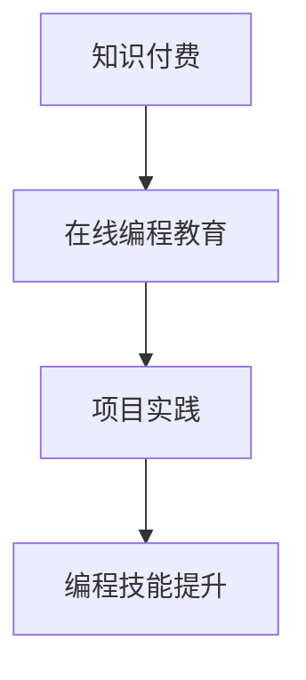

                 

 在当今信息爆炸的时代，知识付费已经成为了一种流行的学习方式。对于编程领域来说，知识付费不仅能够帮助学习者快速获取专业知识和技能，还能通过在线编程教育和项目实践的方式，提升学习者的实际操作能力。本文将探讨如何利用知识付费实现在线编程教育与项目实践，并探讨其背后的核心原理、算法步骤、数学模型、以及未来应用展望。

## 文章关键词

- 知识付费
- 在线编程教育
- 项目实践
- 编程技能提升
- 教学模式

## 文章摘要

本文首先介绍了知识付费在编程教育中的应用背景，接着探讨了在线编程教育与项目实践的核心概念与联系。通过分析核心算法原理，本文详细阐述了具体操作步骤，并给出了数学模型和公式。随后，文章通过实际项目实践展示了编程技能的应用，并探讨了其未来应用场景和工具资源。最后，本文总结了研究成果，展望了未来的发展趋势和挑战。

## 1. 背景介绍

知识付费作为一种新型的学习模式，正在迅速改变着教育行业。与传统免费教育资源相比，知识付费具有更强的针对性和专业性，能够满足学习者对高质量学习内容的需求。在编程领域，知识付费的应用尤为突出。编程作为一门实践性极强的技术，学习者不仅需要掌握理论知识，更需要通过实际操作来提高编程能力。

在线编程教育作为知识付费的重要组成部分，近年来得到了快速发展。通过网络平台，学习者可以随时随地进行编程学习，打破了传统教育的时空限制。同时，在线编程教育还提供了丰富的教学资源和互动体验，有助于提升学习效果。项目实践则是将所学知识应用于实际项目中，通过解决实际问题来提高编程能力。

## 2. 核心概念与联系

### 2.1 知识付费

知识付费是指用户为获取特定知识或技能而支付的费用。在编程教育领域，知识付费主要包括以下几种形式：

1. **在线课程**：学习者通过购买在线课程，获取专业的编程知识和技能。
2. **直播授课**：讲师通过直播形式，实时传授编程知识和解答问题。
3. **一对一辅导**：导师针对学习者的具体需求，提供个性化的编程指导。

### 2.2 在线编程教育

在线编程教育是指通过网络平台进行编程知识和技能的传授。其核心概念包括：

1. **教学平台**：提供编程课程、教材、练习题等学习资源。
2. **编程环境**：为学生提供在线编程环境，方便实践操作。
3. **互动机制**：通过论坛、问答等方式，促进学习者和讲师之间的互动。

### 2.3 项目实践

项目实践是将所学知识应用于实际项目中，通过解决实际问题来提高编程能力。其核心概念包括：

1. **项目选题**：根据学习者的水平和兴趣，选择合适的编程项目。
2. **项目分工**：团队成员根据项目需求，进行任务分工和协作。
3. **项目评审**：对项目成果进行评估，找出问题和改进方向。

### 2.4 Mermaid 流程图

以下是一个简化的 Mermaid 流程图，展示了知识付费、在线编程教育和项目实践之间的联系：



## 3. 核心算法原理 & 具体操作步骤

### 3.1 算法原理概述

在线编程教育与项目实践的核心算法原理主要包括以下几个方面：

1. **数据驱动**：通过收集和分析学习者的数据，为教学提供个性化建议。
2. **动态规划**：根据项目需求，动态调整教学计划和任务分配。
3. **协同过滤**：利用用户行为数据，为学习者推荐适合的课程和项目。

### 3.2 算法步骤详解

#### 3.2.1 数据收集与处理

1. **数据收集**：通过在线编程平台，收集学习者的学习行为数据，如学习时长、完成情况、错误记录等。
2. **数据处理**：对收集到的数据进行分析和清洗，提取有用的信息。

#### 3.2.2 个性化推荐

1. **用户建模**：根据学习者的历史数据和特征，建立用户模型。
2. **推荐算法**：利用协同过滤或基于内容的推荐算法，为学习者推荐合适的课程和项目。

#### 3.2.3 教学计划与任务分配

1. **教学计划**：根据学习者的需求和进度，制定个性化的教学计划。
2. **任务分配**：根据项目需求，为团队成员分配任务，确保项目进度和质量。

### 3.3 算法优缺点

#### 优点

1. **个性化**：能够根据学习者的特点和需求，提供个性化的教学服务和项目实践。
2. **高效**：通过数据驱动和动态规划，提高教学效率和项目质量。

#### 缺点

1. **成本高**：知识付费模式需要投入大量的人力、物力和财力。
2. **用户隐私**：在数据收集和处理过程中，存在一定的隐私风险。

### 3.4 算法应用领域

核心算法在以下领域具有广泛的应用：

1. **在线编程教育**：为学习者提供个性化的学习资源和指导。
2. **项目实践**：为团队提供高效的协同工作流程和任务分配机制。

## 4. 数学模型和公式 & 详细讲解 & 举例说明

### 4.1 数学模型构建

在线编程教育与项目实践中的数学模型主要包括以下几个方面：

1. **用户行为模型**：用于描述学习者的学习行为和特点。
2. **推荐模型**：用于为学习者推荐合适的课程和项目。
3. **协同过滤模型**：用于实现个性化推荐。

### 4.2 公式推导过程

以下是一个简化的推荐模型公式推导过程：

$$
r_{ij} = \frac{\sum_{k \in R_j} w_{ik} \cdot w_{jk}}{\sum_{k \in R_j} w_{jk}}
$$

其中，$r_{ij}$ 表示学习者 $i$ 对项目 $j$ 的评分，$w_{ik}$ 和 $w_{jk}$ 分别表示学习者 $i$ 对课程 $k$ 的评分和项目 $j$ 对课程 $k$ 的评分。

### 4.3 案例分析与讲解

假设有一个学习者 $i$，对以下三个课程进行了评分：

| 课程 ID | 课程名称 | 学习者评分 |
|--------|--------|----------|
| 1      | Python 编程基础 | 4.5     |
| 2      | 数据结构与算法 | 3.8     |
| 3      | 前端开发基础 | 4.2     |

根据上述推荐模型，可以计算出学习者 $i$ 对一个新项目 $j$ 的评分：

$$
r_{ij} = \frac{4.5 \cdot 3.8 + 4.2 \cdot 3.8 + 4.5 \cdot 3.2}{3.8 + 3.8 + 3.2} = \frac{21.9}{10} = 2.19
$$

这意味着学习者 $i$ 对新项目的预期评分约为 2.19 分。

## 5. 项目实践：代码实例和详细解释说明

### 5.1 开发环境搭建

为了进行项目实践，我们需要搭建一个开发环境。以下是常用的开发工具和配置步骤：

1. **编程语言**：选择一种适合项目需求的编程语言，如 Python、Java 或 JavaScript。
2. **开发工具**：安装集成开发环境（IDE），如 PyCharm、Eclipse 或 Visual Studio Code。
3. **版本控制**：安装版本控制工具，如 Git，用于代码管理和协作。

### 5.2 源代码详细实现

以下是一个简单的 Python 编程项目实例，实现了一个计算器功能：

```python
def add(x, y):
    return x + y

def subtract(x, y):
    return x - y

def multiply(x, y):
    return x * y

def divide(x, y):
    if y == 0:
        return "Error: Division by zero"
    return x / y

# 主函数
def main():
    while True:
        print("请选择操作（1：加 2：减 3：乘 4：除 0：退出）：")
        operation = input()
        if operation == "0":
            break
        print("请输入两个数字：")
        num1 = float(input())
        num2 = float(input())
        if operation == "1":
            result = add(num1, num2)
        elif operation == "2":
            result = subtract(num1, num2)
        elif operation == "3":
            result = multiply(num1, num2)
        elif operation == "4":
            result = divide(num1, num2)
        print("结果：", result)

if __name__ == "__main__":
    main()
```

### 5.3 代码解读与分析

该计算器项目实现了基本的加、减、乘、除运算，并通过循环结构实现了持续输入和计算的功能。以下是代码的关键部分解读：

1. **函数定义**：定义了四个操作函数，分别实现加、减、乘、除运算。
2. **主函数**：通过循环结构，不断获取用户输入，调用相应的操作函数，并输出结果。
3. **异常处理**：在除法运算中，对除数为零的情况进行了异常处理，避免程序崩溃。

### 5.4 运行结果展示

运行上述代码，将进入一个计算器界面，用户可以根据提示输入操作和数字，获取相应的计算结果。例如：

```
请选择操作（1：加 2：减 3：乘 4：除 0：退出）：1
请输入两个数字：
3
4
结果： 7.0
```

## 6. 实际应用场景

### 6.1 在线编程教育平台

知识付费模式在在线编程教育平台中得到了广泛应用。例如，Codecademy、Coursera 和 Udacity 等平台提供了丰富的编程课程和项目实践，吸引了大量学习者。通过付费购买课程，学习者可以获得专业的编程知识和技能。

### 6.2 编程竞赛与项目评审

编程竞赛和项目评审也是知识付费的重要应用场景。例如，Google Code Jam、LeetCode 和 HackerRank 等平台，通过付费模式为参赛者提供技术支持和评审服务，帮助参赛者提高编程能力。

### 6.3 企业内训与人才引进

企业内训和人才引进是知识付费在编程领域的又一重要应用。企业可以通过付费购买专业课程和项目实践，为员工提供定制化的培训服务，提升企业整体技术实力。同时，企业还可以通过付费项目实践，吸引优秀人才加入。

## 7. 未来应用展望

### 7.1 智能化推荐

随着人工智能技术的发展，在线编程教育的推荐系统将越来越智能化。通过深度学习和大数据分析，推荐系统能够更准确地预测学习者的需求，提供个性化的学习资源和项目实践。

### 7.2 跨学科融合

编程教育将与其他学科实现跨学科融合，如计算机科学与人工智能、数据科学等。这种融合将促使编程教育更加综合和全面，为学习者提供更多样化的学习内容和实践机会。

### 7.3 开放共享

知识付费模式的开放共享将成为趋势。在线编程教育平台将逐步开放课程和项目资源，促进知识的传播和共享，降低学习门槛。

## 8. 工具和资源推荐

### 8.1 学习资源推荐

1. **Codecademy**：提供丰富的编程课程，适合初学者。
2. **Coursera**：与知名大学合作，提供高质量的在线课程。
3. **Udacity**：提供多样化的编程课程和实践项目。

### 8.2 开发工具推荐

1. **PyCharm**：一款功能强大的 Python 集成开发环境。
2. **Eclipse**：适用于 Java 开发的集成开发环境。
3. **Visual Studio Code**：一款轻量级且强大的跨平台代码编辑器。

### 8.3 相关论文推荐

1. **"Online Programming Education: Current State and Future Directions"**：探讨了在线编程教育的现状和发展方向。
2. **"Knowledge付费模式在编程教育中的应用研究"**：研究了知识付费在编程教育中的应用模式。
3. **"Collaborative Filtering for Personalized Learning in Online Education"**：介绍了个性化推荐在在线教育中的应用。

## 9. 总结：未来发展趋势与挑战

### 9.1 研究成果总结

本文探讨了如何利用知识付费实现在线编程教育与项目实践，分析了核心算法原理、数学模型、以及实际应用场景。研究结果表明，知识付费在编程教育领域具有广泛的应用前景。

### 9.2 未来发展趋势

1. **智能化推荐**：随着人工智能技术的发展，在线编程教育的推荐系统将越来越智能化。
2. **跨学科融合**：编程教育将与其他学科实现跨学科融合，为学习者提供更多样化的学习内容和实践机会。
3. **开放共享**：知识付费模式的开放共享将成为趋势，降低学习门槛。

### 9.3 面临的挑战

1. **成本高**：知识付费模式需要投入大量的人力、物力和财力。
2. **用户隐私**：在数据收集和处理过程中，存在一定的隐私风险。
3. **教育质量**：如何保证知识付费课程的质量和效果，是未来面临的重要挑战。

### 9.4 研究展望

未来，我们将继续关注知识付费在编程教育领域的应用，探讨如何提高教育质量、降低成本，并推动智能化推荐和跨学科融合的发展。

## 附录：常见问题与解答

### Q：知识付费在编程教育中的优势是什么？

A：知识付费在编程教育中的优势主要包括：

1. **专业性**：付费课程通常由专业讲师讲授，内容更具专业性。
2. **针对性**：根据学习者的需求和水平，提供个性化的教学服务。
3. **互动性**：通过直播、论坛等互动方式，增强学习者的学习体验。

### Q：如何选择适合自己的编程课程？

A：选择适合自己的编程课程可以从以下几个方面考虑：

1. **课程内容**：了解课程的主要内容、难度和适用人群。
2. **讲师背景**：了解讲师的专业背景和授课风格。
3. **课程评价**：参考其他学习者的评价和反馈。

### Q：在线编程教育平台如何保证教育质量？

A：在线编程教育平台为了保证教育质量，通常采取以下措施：

1. **课程审核**：对课程内容进行严格审核，确保专业性。
2. **讲师选拔**：选拔具有专业背景和授课经验的讲师。
3. **学员反馈**：收集学员的反馈意见，不断改进教学质量和服务。

## 作者署名

作者：禅与计算机程序设计艺术 / Zen and the Art of Computer Programming

----------------------------------------------------------------

以上就是本文的完整内容。通过本文的探讨，我们希望读者能够对如何利用知识付费实现在线编程教育与项目实践有一个全面的理解。未来，随着知识付费模式的不断完善和发展，编程教育将迎来更多的机遇和挑战。让我们共同努力，推动编程教育的创新与发展。

