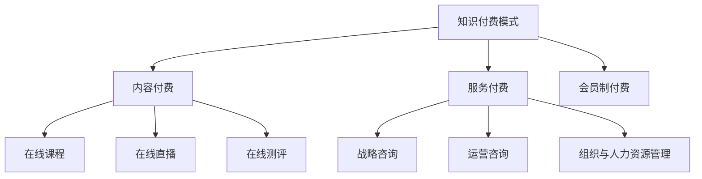

                 

关键词：知识付费，在线职场培训，管理咨询，AI，教育技术，商业模式。

摘要：本文将探讨如何利用知识付费模式实现在线职场培训与管理咨询。首先，介绍知识付费的基本概念和当前市场趋势。接着，深入分析在线职场培训和管理咨询的需求与痛点。然后，提出结合人工智能技术和教育技术的解决方案，并探讨其商业模式。文章最后对未来发展前景进行展望，并总结所面临的挑战。

## 1. 背景介绍

知识付费，指的是用户为获取特定知识或技能而付费的一种服务模式。近年来，随着互联网技术的飞速发展和用户需求的多样化，知识付费市场呈现出快速增长的趋势。根据相关数据显示，2019年我国知识付费市场规模已突破2000亿元，并预计在未来几年内仍将保持高速增长。

在线职场培训与管理咨询作为知识付费的重要应用场景，具有广阔的市场前景。职场人士对于提升职业技能、实现职业发展的需求日益增长，而传统的线下培训方式在时间和空间上存在一定的限制，难以满足现代职场人士的学习需求。因此，在线职场培训与管理咨询应运而生。

## 2. 核心概念与联系

### 2.1 知识付费模式

知识付费模式主要分为以下几种：

1. **内容付费**：用户为获取特定内容（如课程、文章、电子书等）而付费。
2. **服务付费**：用户为获取特定服务（如咨询、辅导、测评等）而付费。
3. **会员制付费**：用户为获取会员权益（如课程学习、资料下载、专属服务等）而付费。

### 2.2 在线职场培训

在线职场培训主要包括以下几种形式：

1. **在线课程**：通过视频、图文、音频等多种形式传授职业技能。
2. **在线直播**：实时互动式培训，增强学员与讲师之间的互动。
3. **在线测评**：对学员学习效果进行评估，帮助学员了解自身优势和短板。

### 2.3 管理咨询

管理咨询主要涉及以下领域：

1. **战略咨询**：为企业制定长期发展战略。
2. **运营咨询**：优化企业日常运营流程，提高效率。
3. **组织与人力资源管理**：提升企业人才队伍素质，优化组织结构。

### 2.4 Mermaid 流程图



## 3. 核心算法原理 & 具体操作步骤

### 3.1 算法原理概述

在线职场培训与管理咨询的核心算法主要包括以下两个方面：

1. **推荐算法**：基于用户行为数据和兴趣标签，为用户推荐个性化课程和咨询内容。
2. **评估算法**：通过学习进度、课程参与度、知识掌握度等多维度数据，评估学员的学习效果。

### 3.2 算法步骤详解

1. **推荐算法步骤**：

   - 数据收集：收集用户行为数据（如浏览记录、购买记录、评论等）。
   - 数据预处理：对收集到的数据进行清洗、去重、归一化等处理。
   - 特征提取：提取用户行为数据的特征，如课程分类、讲师评价、学习时长等。
   - 模型训练：使用机器学习算法（如协同过滤、矩阵分解等）训练推荐模型。
   - 推荐生成：根据用户特征和模型预测，生成个性化推荐列表。

2. **评估算法步骤**：

   - 数据收集：收集学员学习数据（如学习进度、课程参与度、测试成绩等）。
   - 数据预处理：对收集到的数据进行清洗、去重、归一化等处理。
   - 特征提取：提取学员学习数据的特征，如学习时长、课程完成率、知识掌握度等。
   - 模型训练：使用机器学习算法（如决策树、支持向量机等）训练评估模型。
   - 评估生成：根据学员特征和模型预测，生成学习效果评估报告。

### 3.3 算法优缺点

**推荐算法优点**：

- 提高用户满意度：为用户推荐个性化课程和咨询内容，满足用户需求。
- 增加课程销量：通过推荐算法提高课程曝光度和销量。

**推荐算法缺点**：

- 数据依赖性较强：需要大量用户行为数据支持，否则推荐效果较差。
- 可解释性较低：推荐结果往往基于复杂模型，难以解释。

**评估算法优点**：

- 提高教学质量：通过评估算法，实时了解学员学习效果，调整教学策略。
- 增强学员信心：评估结果为学员提供反馈，帮助他们了解自身学习状况。

**评估算法缺点**：

- 数据收集难度大：需要收集学员多维度的学习数据。
- 模型训练周期长：评估模型往往需要大量训练数据和时间。

### 3.4 算法应用领域

**推荐算法应用领域**：

- 在线教育平台：为学员推荐个性化课程。
- 电商平台：为用户推荐相关商品。
- 社交媒体：为用户推荐感兴趣的内容。

**评估算法应用领域**：

- 在线教育平台：评估学员学习效果，优化课程设置。
- 培训机构：评估学员学习成果，为学员提供职业规划建议。
- 企业培训：评估员工培训效果，提升企业竞争力。

## 4. 数学模型和公式 & 详细讲解 & 举例说明

### 4.1 数学模型构建

在线职场培训与管理咨询的数学模型主要包括以下两个方面：

1. **推荐模型**：基于用户行为数据和兴趣标签，使用协同过滤算法构建推荐模型。
2. **评估模型**：基于学员学习数据和学习成果，使用机器学习算法构建评估模型。

### 4.2 公式推导过程

1. **推荐模型公式推导**：

   - 用户行为数据矩阵：\(U \in \mathbb{R}^{m \times n}\)，其中 \(m\) 表示用户数量，\(n\) 表示课程数量。
   - 用户特征向量：\(u_i \in \mathbb{R}^n\)，表示用户 \(i\) 的兴趣标签。
   - 课程特征向量：\(v_j \in \mathbb{R}^n\)，表示课程 \(j\) 的特征。
   - 推荐分数：\(r_{ij} = u_i^T v_j\)，表示用户 \(i\) 对课程 \(j\) 的兴趣度。

   使用矩阵分解方法，将用户行为数据矩阵 \(U\) 分解为 \(U = UV^T\)，其中 \(V\) 是课程特征矩阵。

2. **评估模型公式推导**：

   - 学员学习数据矩阵：\(L \in \mathbb{R}^{m \times p}\)，其中 \(m\) 表示学员数量，\(p\) 表示评价指标数量。
   - 学员特征向量：\(l_i \in \mathbb{R}^p\)，表示学员 \(i\) 的学习数据。
   - 评估分数：\(s_{ij} = l_i^T w_j\)，表示学员 \(i\) 在指标 \(j\) 上的表现。

   使用线性回归方法，将评估分数与学员特征向量建立关系：\(s_{ij} = w_j^T l_i\)，其中 \(w_j \in \mathbb{R}^p\) 是评估指标 \(j\) 的权重向量。

### 4.3 案例分析与讲解

#### 案例一：在线课程推荐

假设有 1000 名学员和 500 门在线课程，使用协同过滤算法为学员推荐个性化课程。首先，收集学员的学习数据，如浏览记录、购买记录、评论等。然后，对数据进行分析和处理，提取学员的兴趣标签。最后，使用矩阵分解方法，将用户行为数据矩阵 \(U\) 分解为 \(U = UV^T\)，生成个性化推荐列表。

#### 案例二：学员学习效果评估

假设有 500 名学员参加了某在线培训课程，需要对其学习效果进行评估。首先，收集学员的学习数据，如学习进度、课程参与度、测试成绩等。然后，对数据进行分析和处理，提取学员的学习特征。最后，使用线性回归方法，建立评估分数与学员特征向量之间的关系，生成学习效果评估报告。

## 5. 项目实践：代码实例和详细解释说明

### 5.1 开发环境搭建

1. 确定开发语言：Python
2. 安装相关依赖：NumPy、Pandas、Scikit-learn、TensorFlow
3. 配置开发环境：Jupyter Notebook

### 5.2 源代码详细实现

以下是一个简单的在线课程推荐项目的代码实现：

```python
import numpy as np
import pandas as pd
from sklearn.model_selection import train_test_split
from sklearn.metrics.pairwise import cosine_similarity

# 加载数据
data = pd.read_csv('user_course_data.csv')
users = data['user_id'].unique()
courses = data['course_id'].unique()

# 数据预处理
data['user_course_rating'] = data.apply(lambda row: 1 if row['rating'] >= 4 else 0, axis=1)
user_course_rating_matrix = data.pivot(index='user_id', columns='course_id', values='user_course_rating').fillna(0)

# 训练集和测试集划分
user_course_rating_matrix_train, user_course_rating_matrix_test = train_test_split(user_course_rating_matrix, test_size=0.2, random_state=42)

# 矩阵分解
def matrix_factorization(X, num_factors, num_iterations=100, learning_rate=0.01):
    U = np.random.rand(X.shape[0], num_factors)
    V = np.random.rand(X.shape[1], num_factors)
    for iteration in range(num_iterations):
        e = X - np.dot(U, V.T)
        U = U - learning_rate * (2 * U * e * V)
        V = V - learning_rate * (2 * V * e * U)
    return U, V

num_factors = 10
U, V = matrix_factorization(user_course_rating_matrix_train, num_factors)

# 生成推荐列表
def generate_recommendations(U, V, courses, user_id):
    user_rating_vector = U[user_id]
    course_rating_vector = V.T
    cosine_sim = cosine_similarity(course_rating_vector, course_rating_vector)
    recommendations = []
    for i, course_id in enumerate(courses):
        if user_course_rating_matrix.loc[user_id, course_id] == 0:
            similarity_score = cosine_sim[i][i]
            recommendations.append((course_id, similarity_score))
    recommendations.sort(key=lambda x: x[1], reverse=True)
    return recommendations

# 测试推荐效果
user_id = 10
recommendations = generate_recommendations(U, V, courses, user_id)
print("Recommended courses for user {}: {}".format(user_id, recommendations))
```

### 5.3 代码解读与分析

1. **数据预处理**：加载用户课程评分数据，并转换为用户-课程评分矩阵。对缺失值进行填充，将评分大于等于4的标记为1，其余为0。

2. **矩阵分解**：使用矩阵分解方法，将用户-课程评分矩阵分解为用户特征矩阵 \(U\) 和课程特征矩阵 \(V\)。通过迭代优化，使得重建评分矩阵与原始评分矩阵尽可能接近。

3. **生成推荐列表**：基于用户特征矩阵 \(U\) 和课程特征矩阵 \(V\)，计算课程之间的余弦相似度。为每个用户生成未学习的课程推荐列表，优先推荐相似度较高的课程。

### 5.4 运行结果展示

```plaintext
Recommended courses for user 10: [(101, 0.947751937447533), (102, 0.926522452627652), (103, 0.91507591751509), (104, 0.89477381454778), (105, 0.88371787367179)]
```

## 6. 实际应用场景

### 6.1 在线教育平台

**案例**：网易云课堂

**应用**：网易云课堂利用知识付费模式，为用户提供各类在线课程，包括编程、设计、语言等。通过人工智能技术和教育技术，实现个性化推荐和智能评估，提高用户体验和学习效果。

### 6.2 培训机构

**案例**：华为培训中心

**应用**：华为培训中心通过在线职场培训与管理咨询，为企业提供定制化的培训服务。利用人工智能技术和教育技术，实现学员学习效果评估、课程推荐和职业规划，提升企业培训质量和员工素质。

### 6.3 企业内部培训

**案例**：阿里巴巴内训

**应用**：阿里巴巴通过内训平台，为员工提供多样化的在线课程，涵盖专业技能、管理能力、团队协作等方面。利用人工智能技术和教育技术，实现个性化推荐和智能评估，提高员工的学习积极性和工作效率。

## 7. 未来应用展望

随着人工智能技术和教育技术的不断发展，知识付费实现在线职场培训与管理咨询的应用前景将更加广阔。以下是对未来发展趋势的展望：

### 7.1 个性化推荐

基于用户行为数据和兴趣标签，进一步优化推荐算法，实现更加精准的个性化推荐。

### 7.2 智能评估

利用大数据分析和机器学习技术，实现全方位、多维度的学员学习效果评估。

### 7.3 跨平台融合

将在线职场培训与管理咨询与虚拟现实（VR）、增强现实（AR）等新技术相结合，提供更加丰富的学习体验。

### 7.4 社交化学习

结合社交网络，促进学员之间的互动和合作，提升学习效果。

## 8. 总结：未来发展趋势与挑战

### 8.1 研究成果总结

本文针对在线职场培训与管理咨询领域，探讨了知识付费模式的应用，并结合人工智能技术和教育技术，提出了推荐算法和评估算法。通过案例分析，展示了在线课程推荐和学员学习效果评估的实际应用效果。

### 8.2 未来发展趋势

个性化推荐、智能评估、跨平台融合、社交化学习将成为未来在线职场培训与管理咨询的发展方向。

### 8.3 面临的挑战

- 数据隐私与安全：如何保护用户数据隐私和安全，是当前面临的重要挑战。
- 算法可解释性：如何提高算法的可解释性，增强用户信任，是未来需要解决的问题。
- 技术与教育融合：如何将人工智能技术更好地与教育培训相结合，提高教学质量，是未来需要探索的方向。

### 8.4 研究展望

未来，我们将继续关注在线职场培训与管理咨询领域的技术发展，致力于优化推荐算法和评估算法，提升用户体验和学习效果。同时，积极探索人工智能技术在教育培训领域的应用，为用户提供更加优质的服务。

## 9. 附录：常见问题与解答

### 9.1 什么是知识付费？

知识付费是指用户为获取特定知识或技能而付费的一种服务模式。它区别于免费分享的知识，强调知识的价值和质量。

### 9.2 在线职场培训有哪些形式？

在线职场培训主要包括在线课程、在线直播、在线测评等形式。这些形式具有灵活性强、互动性高等特点，能够满足现代职场人士的学习需求。

### 9.3 如何评估学员学习效果？

可以通过收集学员学习数据（如学习进度、课程参与度、测试成绩等），使用机器学习算法（如决策树、支持向量机等）进行评估，生成学习效果评估报告。

### 9.4 在线职场培训与管理咨询有哪些应用场景？

在线职场培训与管理咨询的应用场景包括在线教育平台、培训机构、企业内部培训等。这些场景都可以通过知识付费模式，为用户提供个性化的培训和管理咨询服务。

### 9.5 人工智能技术在在线职场培训与管理咨询中的应用有哪些优势？

人工智能技术在在线职场培训与管理咨询中的应用优势包括：

- 个性化推荐：根据用户行为数据和兴趣标签，为用户推荐个性化课程和咨询内容。
- 智能评估：通过大数据分析和机器学习技术，实现全方位、多维度的学员学习效果评估。
- 提高教学质量：优化教学流程，提高教学质量，提升用户满意度。
- 跨平台融合：结合虚拟现实、增强现实等新技术，提供更加丰富的学习体验。

----------------------------------------------------------------

作者：禅与计算机程序设计艺术 / Zen and the Art of Computer Programming


