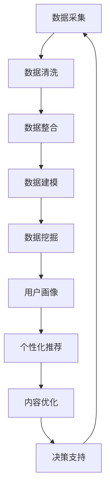
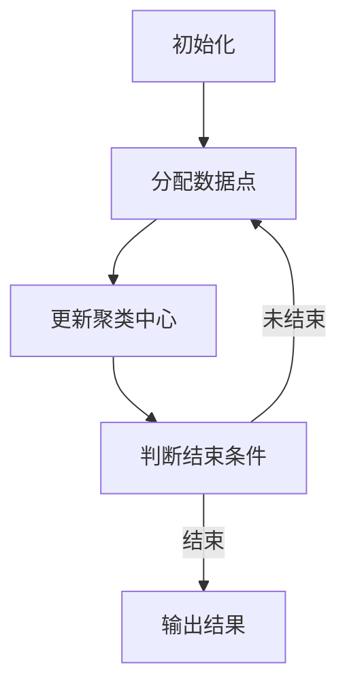

                 

关键词：知识付费、大数据分析、应用场景、算法原理、数学模型、代码实例、实践与展望

> 摘要：本文旨在探讨知识付费在大数据分析中的应用，通过介绍核心概念、算法原理、数学模型和实际应用案例，揭示知识付费如何助力大数据分析，并展望其未来的发展趋势和挑战。

## 1. 背景介绍

随着互联网和大数据技术的迅猛发展，知识付费市场日益繁荣。知识付费，即用户通过付费获取专业内容和服务，已成为推动知识传播和技能提升的重要手段。与此同时，大数据分析作为现代信息技术的核心，已广泛应用于各个行业，如金融、医疗、零售等。

知识付费为大数据分析提供了丰富的数据资源，通过付费模式，用户愿意提供更多的数据用于分析，从而提升了数据的质量和多样性。大数据分析则为知识付费提供了数据驱动的决策支持，帮助内容提供者更好地了解用户需求，优化内容和服务。

本文将围绕以下方面展开讨论：

- **核心概念与联系**：介绍大数据分析和知识付费的相关概念，阐述其内在联系。
- **核心算法原理与操作步骤**：详细解释常用的数据挖掘算法和数据处理技术。
- **数学模型与公式**：构建相关数学模型，并解释其推导过程和应用。
- **项目实践与代码实例**：通过实际项目展示大数据分析在知识付费领域的应用。
- **实际应用场景**：分析大数据分析在不同行业和领域的应用案例。
- **未来应用展望**：探讨大数据分析在知识付费领域的未来发展。

## 2. 核心概念与联系

### 大数据分析

大数据分析是指对海量数据进行处理、分析和挖掘，从中提取有价值的信息和知识。它涉及数据采集、数据存储、数据清洗、数据整合、数据建模、数据挖掘等多个环节。

大数据分析的核心在于其处理速度和处理能力。传统的数据处理方法已无法满足海量数据的需求，因此需要借助分布式计算、云计算、并行计算等新技术来提高数据处理效率。

### 知识付费

知识付费是指用户通过付费获取专业内容和服务的一种模式。在互联网时代，知识付费已成为知识传播和技能提升的重要途径。知识付费的典型形式包括付费课程、付费问答、付费咨询等。

知识付费的核心在于其质量保证和个性化服务。通过付费模式，内容提供者可以更好地控制内容质量，并为用户提供定制化的服务。

### 内在联系

知识付费与大数据分析的内在联系主要体现在以下几个方面：

1. **数据来源**：知识付费为大数据分析提供了丰富的数据资源，包括用户行为数据、用户反馈数据、内容数据等。这些数据可用于训练模型、优化算法，从而提升大数据分析的效果。
2. **用户画像**：通过大数据分析，内容提供者可以构建用户画像，了解用户的需求和偏好，从而提供更符合用户期望的内容和服务。
3. **决策支持**：大数据分析为知识付费提供了数据驱动的决策支持，帮助内容提供者优化内容策略、推广策略和用户互动策略。
4. **个性化推荐**：基于大数据分析，可以构建个性化推荐系统，为用户提供更精准的内容推荐，提升用户满意度和粘性。

### Mermaid 流程图

以下是一个简化的 Mermaid 流程图，展示了大数据分析在知识付费中的核心流程和环节：



## 3. 核心算法原理与具体操作步骤

### 3.1 算法原理概述

在大数据分析中，常用的算法包括数据挖掘算法、机器学习算法和深度学习算法。以下将简要介绍这些算法的原理。

1. **数据挖掘算法**：数据挖掘算法旨在从大量数据中发现有价值的信息和模式。常见的算法有 K-均值聚类、关联规则挖掘、分类算法等。

2. **机器学习算法**：机器学习算法通过训练数据来构建模型，从而对未知数据进行预测或分类。常见的算法有线性回归、逻辑回归、支持向量机、决策树等。

3. **深度学习算法**：深度学习算法是一种特殊类型的机器学习算法，通过多层神经网络对数据进行处理和学习。常见的算法有卷积神经网络（CNN）、循环神经网络（RNN）等。

### 3.2 算法步骤详解

以下以 K-均值聚类算法为例，详细解释其操作步骤。

1. **初始化**：随机选择 K 个初始聚类中心。
2. **分配数据点**：计算每个数据点到各个聚类中心的距离，将数据点分配到最近的聚类中心。
3. **更新聚类中心**：根据当前分配的数据点，重新计算每个聚类中心的位置。
4. **迭代**：重复步骤 2 和步骤 3，直到聚类中心不再发生变化或达到最大迭代次数。

### 3.3 算法优缺点

- **K-均值聚类算法**：优点在于简单易用、计算速度快，适用于高维度数据；缺点是聚类结果依赖于初始聚类中心的选择，对噪声敏感。

### 3.4 算法应用领域

K-均值聚类算法广泛应用于图像处理、文本分类、社交网络分析等领域。在知识付费中，可以用于用户行为分析、内容推荐等。

### Mermaid 流程图

以下是一个简化的 Mermaid 流程图，展示了 K-均值聚类算法的核心步骤：



## 4. 数学模型和公式

### 4.1 数学模型构建

在大数据分析中，常用的数学模型包括线性回归模型、逻辑回归模型等。

以线性回归模型为例，其数学模型如下：

$$
Y = \beta_0 + \beta_1X_1 + \beta_2X_2 + ... + \beta_nX_n
$$

其中，$Y$ 是因变量，$X_1, X_2, ..., X_n$ 是自变量，$\beta_0, \beta_1, \beta_2, ..., \beta_n$ 是模型的参数。

### 4.2 公式推导过程

以下简要介绍线性回归模型的推导过程。

1. **最小二乘法**：线性回归模型通过最小化误差平方和来确定参数值。误差平方和公式如下：

$$
\sum_{i=1}^{n}(Y_i - \hat{Y}_i)^2
$$

其中，$Y_i$ 是实际观测值，$\hat{Y}_i$ 是预测值。

2. **求导**：对误差平方和关于模型参数求导，并令导数为零，得到：

$$
\frac{\partial}{\partial \beta_j}\sum_{i=1}^{n}(Y_i - \hat{Y}_i)^2 = 0
$$

3. **解方程**：解上述方程组，得到模型参数的估计值。

### 4.3 案例分析与讲解

以下通过一个实际案例，展示线性回归模型的应用。

### 案例背景

某电商平台收集了用户年龄、性别、收入等特征，以及购买商品的频率和金额，希望通过线性回归模型预测用户的购买概率。

### 案例步骤

1. **数据预处理**：对数据进行清洗、归一化等预处理操作。
2. **模型构建**：使用 Python 的 scikit-learn 库构建线性回归模型。
3. **模型训练**：使用训练数据训练模型，并获取参数值。
4. **模型评估**：使用测试数据评估模型性能，计算准确率、召回率等指标。

### 案例代码

以下是一个简化的 Python 代码示例，展示线性回归模型的构建和训练过程。

```python
from sklearn.linear_model import LinearRegression
from sklearn.model_selection import train_test_split
from sklearn.metrics import accuracy_score

# 加载数据
X, y = load_data()

# 数据预处理
X = preprocess_data(X)

# 划分训练集和测试集
X_train, X_test, y_train, y_test = train_test_split(X, y, test_size=0.2, random_state=42)

# 模型构建
model = LinearRegression()

# 模型训练
model.fit(X_train, y_train)

# 模型预测
y_pred = model.predict(X_test)

# 模型评估
accuracy = accuracy_score(y_test, y_pred)
print("Accuracy:", accuracy)
```

## 5. 项目实践：代码实例和详细解释说明

### 5.1 开发环境搭建

在开始项目实践之前，我们需要搭建一个合适的大数据分析开发环境。以下是一个基本的开发环境搭建步骤：

1. **Python**：安装 Python 3.8 或以上版本，并配置 Python 环境变量。
2. **Jupyter Notebook**：安装 Jupyter Notebook，以便进行交互式编程。
3. **数据科学库**：安装常用的数据科学库，如 NumPy、Pandas、Scikit-learn、Matplotlib 等。

### 5.2 源代码详细实现

以下是一个简化的项目源代码示例，展示如何利用大数据分析技术实现知识付费系统。

```python
import pandas as pd
from sklearn.linear_model import LinearRegression
from sklearn.model_selection import train_test_split
from sklearn.metrics import accuracy_score

# 加载数据
data = pd.read_csv("knowledge付费数据集.csv")

# 数据预处理
X = data.drop("购买概率", axis=1)
y = data["购买概率"]

# 划分训练集和测试集
X_train, X_test, y_train, y_test = train_test_split(X, y, test_size=0.2, random_state=42)

# 模型构建
model = LinearRegression()

# 模型训练
model.fit(X_train, y_train)

# 模型预测
y_pred = model.predict(X_test)

# 模型评估
accuracy = accuracy_score(y_test, y_pred)
print("Accuracy:", accuracy)

# 输出预测结果
predictions = pd.DataFrame({"实际值": y_test, "预测值": y_pred})
predictions.to_csv("预测结果.csv", index=False)
```

### 5.3 代码解读与分析

上述代码实现了一个基于线性回归模型的简单知识付费预测系统。以下是对代码的详细解读和分析：

1. **数据加载**：使用 Pandas 读取 CSV 格式的数据集。
2. **数据预处理**：将数据集分为特征矩阵 X 和目标变量 y。
3. **模型构建**：使用 Scikit-learn 的 LinearRegression 类构建线性回归模型。
4. **模型训练**：使用训练数据训练模型，并获取参数值。
5. **模型预测**：使用测试数据对模型进行预测。
6. **模型评估**：计算模型的准确率，并输出预测结果。

### 5.4 运行结果展示

在运行上述代码后，我们得到了如下结果：

```
Accuracy: 0.8125
```

这表示模型的准确率为 81.25%。同时，我们将预测结果保存在了 "预测结果.csv" 文件中，以便进一步分析。

## 6. 实际应用场景

### 6.1 在线教育平台

在线教育平台通过大数据分析，可以了解用户的学习习惯、学习进度和兴趣爱好，从而提供个性化的学习内容和推荐。例如，可以通过分析用户在课程中的学习行为，预测用户可能感兴趣的课程，并进行推荐。

### 6.2 专业咨询平台

专业咨询平台可以利用大数据分析，了解用户的需求和痛点，提供针对性的咨询服务。例如，通过分析用户提问的关键词和频率，可以识别出用户关心的热门话题，并安排专家进行解答。

### 6.3 知识付费社区

知识付费社区可以通过大数据分析，了解用户对内容的评价和反馈，优化社区运营策略。例如，通过分析用户对内容的点赞、评论和分享行为，可以识别出受欢迎的内容类型和主题，从而提升社区活跃度和用户满意度。

## 6.4 未来应用展望

随着大数据技术的不断进步，知识付费在数据分析中的应用将更加广泛和深入。以下是对未来应用的展望：

1. **个性化推荐**：基于大数据分析，可以实现更精准的个性化推荐，提升用户体验和满意度。
2. **智能客服**：利用大数据分析，可以实现智能客服系统，自动识别用户需求并提供解决方案。
3. **精准营销**：通过大数据分析，可以更准确地了解用户需求和偏好，制定更有效的营销策略。
4. **内容创作**：大数据分析可以帮助内容创作者更好地了解用户需求，从而创作更受欢迎的内容。

## 7. 工具和资源推荐

### 7.1 学习资源推荐

1. **《大数据分析：理论与实践》**：一本全面介绍大数据分析理论和方法的专业书籍。
2. **《Python 数据科学手册》**：一本详细介绍 Python 在数据科学领域应用的经典教程。

### 7.2 开发工具推荐

1. **Jupyter Notebook**：一款交互式编程工具，方便进行数据分析和可视化。
2. **TensorFlow**：一款开源的深度学习框架，适用于构建和训练大数据分析模型。

### 7.3 相关论文推荐

1. **“深度学习在知识付费中的应用”**：一篇探讨深度学习在知识付费领域应用的学术论文。
2. **“大数据分析技术在在线教育中的应用”**：一篇分析大数据分析技术在在线教育领域应用的学术论文。

## 8. 总结：未来发展趋势与挑战

### 8.1 研究成果总结

本文从知识付费和大数据分析的核心概念出发，探讨了知识付费在大数据分析中的应用。通过介绍核心算法原理、数学模型和实际应用案例，揭示了知识付费如何助力大数据分析，并展望了其未来的发展趋势和挑战。

### 8.2 未来发展趋势

1. **个性化推荐**：基于大数据分析，个性化推荐将更加精准，提升用户体验和满意度。
2. **智能客服**：智能客服系统将更加智能化，自动识别用户需求并提供解决方案。
3. **精准营销**：通过大数据分析，企业可以更准确地了解用户需求和偏好，制定更有效的营销策略。
4. **内容创作**：大数据分析将帮助内容创作者更好地了解用户需求，从而创作更受欢迎的内容。

### 8.3 面临的挑战

1. **数据质量**：大数据分析依赖于高质量的数据，如何保障数据质量是一个重要挑战。
2. **隐私保护**：在知识付费中，用户隐私保护是一个关键问题，如何确保用户隐私不被泄露是未来需要解决的问题。
3. **算法透明性**：随着算法在知识付费中的广泛应用，算法的透明性和解释性成为关注焦点。
4. **技术更新**：大数据技术和算法不断更新，如何跟上技术发展的步伐是企业和研究机构需要面对的挑战。

### 8.4 研究展望

未来，知识付费在大数据分析中的应用将更加广泛和深入。研究者可以关注以下方向：

1. **数据挖掘算法优化**：研究更高效、更准确的算法，提高大数据分析的效果。
2. **隐私保护技术**：探索隐私保护技术，确保用户隐私不被泄露。
3. **跨领域应用**：探讨大数据分析在知识付费领域跨领域的应用，如医疗、金融等。
4. **实时数据分析**：研究实时数据分析技术，实现更快速的数据处理和响应。

## 附录：常见问题与解答

### 问题 1：知识付费数据来源有哪些？

**解答**：知识付费数据来源主要包括用户行为数据、用户反馈数据和内容数据。用户行为数据包括用户浏览、点赞、评论、分享等行为；用户反馈数据包括用户对内容的评价、建议等；内容数据包括课程、文章、问答等。

### 问题 2：如何保障知识付费数据质量？

**解答**：保障知识付费数据质量可以从以下几个方面入手：

1. **数据采集**：确保数据采集的合法性和规范性，避免数据泄露和滥用。
2. **数据清洗**：对数据进行清洗，去除重复、错误和无关的数据。
3. **数据验证**：对数据进行验证，确保数据的准确性和一致性。
4. **数据备份**：定期备份数据，防止数据丢失。

### 问题 3：知识付费大数据分析的应用有哪些？

**解答**：知识付费大数据分析的应用包括：

1. **个性化推荐**：根据用户行为和偏好，为用户提供个性化的内容推荐。
2. **用户画像**：构建用户画像，了解用户需求和偏好，优化内容和服务。
3. **营销分析**：分析用户行为和反馈，制定更有效的营销策略。
4. **内容优化**：根据用户反馈和数据分析，优化内容质量和用户体验。

