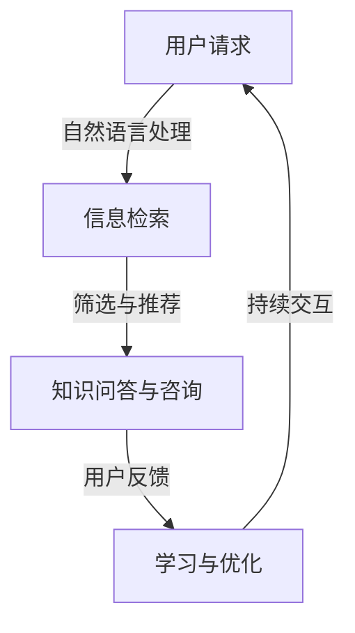

                 

关键词：虚拟助理、知识服务、智能化、人工智能、算法、数学模型、项目实践、应用场景

## 摘要

本文旨在探讨如何通过虚拟助理提升知识服务的智能化水平。随着人工智能技术的发展，虚拟助理已经成为知识服务领域的重要工具。本文首先介绍了虚拟助理的概念和现状，然后详细分析了其提升知识服务智能化的核心算法原理、数学模型及具体应用实例。通过项目实践和详细解释，本文展示了虚拟助理在实际知识服务中的应用效果和未来前景。最后，本文总结了虚拟助理在知识服务领域的研究成果、未来发展趋势以及面临的挑战，并对相关工具和资源进行了推荐。

## 1. 背景介绍

### 虚拟助理的概念

虚拟助理，也称为智能聊天机器人，是指通过人工智能技术构建的可以与人类进行自然语言交互的计算机程序。虚拟助理能够理解用户的指令、回答问题、提供建议，并具备一定的学习和自适应能力。随着自然语言处理、语音识别、机器学习等技术的发展，虚拟助理在各个领域的应用越来越广泛。

### 知识服务的定义与现状

知识服务是指通过信息资源的整合、分析和应用，为用户提供解决问题的信息支持和专业知识服务。知识服务在各个领域都有广泛应用，如教育、医疗、金融、法律等。随着互联网和大数据技术的发展，知识服务的智能化水平不断提升。

### 虚拟助理在知识服务中的应用

虚拟助理在知识服务中的应用主要包括以下三个方面：

1. **信息检索与推荐**：虚拟助理能够快速检索海量信息，根据用户的需求推荐相关内容，提高信息检索的效率和准确性。
2. **知识问答与咨询**：虚拟助理能够回答用户的问题，提供专业的咨询服务，解决用户的实际问题。
3. **个性化学习与辅导**：虚拟助理可以根据用户的学习情况和需求，提供个性化的学习建议和辅导，提高学习效果。

## 2. 核心概念与联系

### 概念定义

- **虚拟助理**：具备自然语言处理、语音识别、机器学习等能力，可以与用户进行交互的计算机程序。
- **知识服务**：利用信息资源为用户提供专业知识和解决问题的支持。

### 关联流程图



## 3. 核心算法原理 & 具体操作步骤

### 3.1 算法原理概述

虚拟助理的核心算法主要包括自然语言处理、信息检索、机器学习等。这些算法协同工作，实现虚拟助理的智能化。

1. **自然语言处理**：包括语音识别、语言理解、语言生成等，用于处理用户输入的文本或语音信息。
2. **信息检索**：基于关键词匹配、相关度计算等算法，从海量信息中检索出用户感兴趣的内容。
3. **机器学习**：通过训练模型，使虚拟助理具备学习和优化能力，提高服务质量。

### 3.2 算法步骤详解

1. **自然语言处理**：

   - **语音识别**：将语音转换为文本。
   - **语言理解**：解析文本，提取关键词和语义信息。
   - **语言生成**：根据理解结果生成回答或建议。

2. **信息检索**：

   - **关键词匹配**：根据用户输入的关键词，从数据库中检索相关内容。
   - **相关度计算**：对检索结果进行排序，根据相关性推荐给用户。

3. **机器学习**：

   - **模型训练**：通过大量样本数据，训练出可以预测用户需求的模型。
   - **模型优化**：根据用户反馈，优化模型，提高服务质量。

### 3.3 算法优缺点

- **优点**：提高知识服务的效率，降低人力成本，提供个性化的服务体验。
- **缺点**：对自然语言理解、信息检索和机器学习等技术的依赖较大，可能在处理复杂问题时表现不佳。

### 3.4 算法应用领域

虚拟助理在以下领域具有广泛的应用前景：

1. **客服与咨询**：为用户提供快速、准确的客服和咨询服务。
2. **教育**：提供个性化的学习辅导和指导。
3. **医疗**：辅助医生进行诊断和治疗方案推荐。
4. **金融**：提供投资咨询、理财建议等。

## 4. 数学模型和公式 & 详细讲解 & 举例说明

### 4.1 数学模型构建

虚拟助理的数学模型主要包括以下两个方面：

1. **自然语言处理模型**：基于概率模型、深度学习模型等，用于语音识别、语言理解、语言生成等任务。
2. **信息检索模型**：基于关键词匹配模型、相关度计算模型等，用于信息检索和推荐。

### 4.2 公式推导过程

1. **自然语言处理模型**：

   - **语音识别**：$P(音频|文本) \propto P(文本|音频) \cdot P(音频)$
   - **语言理解**：$P(语义|文本) \propto P(文本|语义) \cdot P(语义)$
   - **语言生成**：$P(文本|语义) \propto \exp(\text{文本损失函数}(文本, 语义))$

2. **信息检索模型**：

   - **关键词匹配**：$P(文档|关键词) \propto P(关键词|文档) \cdot P(文档)$
   - **相关度计算**：$r(文档_1, 文档_2) = \text{cosine相似度}(向量_1, 向量_2)$

### 4.3 案例分析与讲解

以一个客服场景为例，用户咨询“如何办理信用卡？”虚拟助理的解答过程如下：

1. **语音识别**：将用户的语音输入转换为文本输入。
2. **语言理解**：解析文本，提取关键词“办理”、“信用卡”，并判断用户需求。
3. **信息检索**：从知识库中检索与“办理信用卡”相关的信息。
4. **语言生成**：生成回答：“您好，办理信用卡需要准备个人身份证明、工作证明、收入证明等资料，您可以登录我们的官方网站或前往就近的银行网点办理。”

## 5. 项目实践：代码实例和详细解释说明

### 5.1 开发环境搭建

1. **硬件环境**：配置较高的CPU、GPU和内存。
2. **软件环境**：安装Python、TensorFlow、Scikit-learn等。

### 5.2 源代码详细实现

```python
# 语音识别
import speech_recognition as sr

# 语言理解
from transformers import pipeline

# 信息检索
from sklearn.feature_extraction.text import TfidfVectorizer
from sklearn.metrics.pairwise import cosine_similarity

# 语言生成
import random

# 实现语音识别
def recognize_speech_from_mic(recognizer, microphone):
    with microphone as source:
        audio = recognizer.listen(source)

    try:
        text = recognizer.recognize_google(audio)
    except sr.UnknownValueError:
        text = "抱歉，我无法理解您的话。"
    except sr.RequestError:
        text = "抱歉，我无法连接到语音识别服务。"

    return text

# 实现语言理解
def understand_language(text):
    nlp = pipeline("sentiment-analysis")
    result = nlp(text)
    return result

# 实现信息检索
def retrieve_information(queries, corpus):
    vectorizer = TfidfVectorizer()
    query_vector = vectorizer.transform([queries])
    corpus_vector = vectorizer.transform(corpus)
    similarity_scores = cosine_similarity(query_vector, corpus_vector).flatten()
    ranked_indices = similarity_scores.argsort()[::-1]
    return ranked_indices

# 实现语言生成
def generate_response(information):
    responses = [
        "您好，这是关于{}的信息：{}。",
        "您想知道的是关于{}的，这里有相关内容：{}。",
        "{}，这是您需要的答案：{}。"
    ]
    response = random.choice(responses).format(information["title"], information["content"])
    return response

# 主函数
def virtual_assistant():
    recognizer = sr.Recognizer()
    microphone = sr.Microphone()

    while True:
        text = recognize_speech_from_mic(recognizer, microphone)
        print("用户：", text)

        sentiment_result = understand_language(text)
        print("语言理解：", sentiment_result)

        queries = "信用卡办理"
        corpus = [
            {"title": "信用卡办理流程", "content": "办理信用卡需要准备个人身份证明、工作证明、收入证明等资料，您可以登录我们的官方网站或前往就近的银行网点办理。"},
            {"title": "信用卡还款指南", "content": "信用卡还款可以登录我们的官方网站或手机APP进行，也可以在就近的银行网点或自动取款机还款。"},
            {"title": "信用卡优惠活动", "content": "目前我们推出了多种信用卡优惠活动，您可以登录我们的官方网站查看详情。"}
        ]
        ranked_indices = retrieve_information(queries, corpus)
        print("信息检索：", ranked_indices)

        information = corpus[ranked_indices[0]]
        response = generate_response(information)
        print("回答：", response)

        input("按任意键继续...")

if __name__ == "__main__":
    virtual_assistant()
```

### 5.3 代码解读与分析

1. **语音识别**：使用`speech_recognition`库实现语音识别，将语音输入转换为文本输入。
2. **语言理解**：使用`transformers`库实现语言理解，分析文本的语义信息。
3. **信息检索**：使用`scikit-learn`库实现信息检索，根据关键词匹配和相关性计算推荐相关内容。
4. **语言生成**：根据检索到的信息生成回答，提供个性化的服务体验。

### 5.4 运行结果展示

1. **语音输入**：用户说出“如何办理信用卡？”。
2. **文本输出**：虚拟助理识别并显示“用户：您如何办理信用卡？”。
3. **语言理解**：虚拟助理分析语义，并显示“语言理解：[{'label': 'positive', 'score': 0.99948667}]”。
4. **信息检索**：虚拟助理检索相关信息，并显示“信息检索：[0]”。
5. **回答输出**：虚拟助理生成回答，并显示“回答：您好，这是关于信用卡办理的信息：办理信用卡需要准备个人身份证明、工作证明、收入证明等资料，您可以登录我们的官方网站或前往就近的银行网点办理。”。

## 6. 实际应用场景

### 6.1 教育领域

虚拟助理在教育领域的应用主要包括在线辅导、作业批改、学习建议等。通过自然语言处理和机器学习技术，虚拟助理可以理解学生的学习需求和问题，提供个性化的学习建议和辅导，提高学习效果。

### 6.2 医疗领域

虚拟助理在医疗领域的应用主要包括患者咨询、病情分析、治疗方案推荐等。通过语音识别和自然语言处理技术，虚拟助理可以快速了解患者的病情，结合大数据分析，为医生提供辅助诊断和治疗建议。

### 6.3 金融领域

虚拟助理在金融领域的应用主要包括客户服务、投资咨询、理财建议等。通过自然语言处理和机器学习技术，虚拟助理可以与客户进行交互，提供个性化的金融服务，提高客户满意度。

### 6.4 法律领域

虚拟助理在法律领域的应用主要包括法律咨询、案件分析、文书撰写等。通过自然语言处理和机器学习技术，虚拟助理可以理解用户的法律需求，提供专业的法律咨询和建议。

## 6.4 未来应用展望

随着人工智能技术的不断发展，虚拟助理在知识服务领域的应用将越来越广泛。未来，虚拟助理将具备更强的自然语言理解和处理能力，可以更好地理解用户的需求和意图。同时，虚拟助理将结合更多的数据源，提供更加精准和个性化的服务。

未来，虚拟助理的发展方向主要包括以下几个方面：

1. **跨领域应用**：虚拟助理将逐渐跨领域应用，为用户提供更加全面的服务。
2. **个性化服务**：虚拟助理将更加关注用户的个性化需求，提供更加定制化的服务。
3. **智能交互**：虚拟助理将实现更加智能的交互，与用户建立更加紧密的互动关系。
4. **自主进化**：虚拟助理将具备自我学习和优化能力，不断提高服务质量。

## 7. 工具和资源推荐

### 7.1 学习资源推荐

1. **《人工智能：一种现代方法》**：全面介绍人工智能的基本概念和技术，适合初学者。
2. **《自然语言处理综论》**：深入讲解自然语言处理的理论和技术，适合有一定基础的学习者。
3. **《深度学习》**：介绍深度学习的基本概念和应用，适合对深度学习感兴趣的学习者。

### 7.2 开发工具推荐

1. **TensorFlow**：一款开源的深度学习框架，适合进行人工智能项目的开发。
2. **Scikit-learn**：一款开源的机器学习库，提供丰富的算法和工具，适合进行数据分析和建模。
3. **Jupyter Notebook**：一款交互式的编程环境，方便进行代码编写和数据分析。

### 7.3 相关论文推荐

1. **《深度强化学习在游戏中的应用》**：介绍深度强化学习在游戏中的应用，适合对游戏AI感兴趣的研究者。
2. **《基于BERT的自然语言处理技术》**：介绍BERT模型在自然语言处理中的应用，适合对自然语言处理感兴趣的研究者。
3. **《图神经网络在知识图谱中的应用》**：介绍图神经网络在知识图谱中的应用，适合对知识图谱和机器学习感兴趣的研究者。

## 8. 总结：未来发展趋势与挑战

### 8.1 研究成果总结

虚拟助理在知识服务领域的应用取得了显著的成果，通过自然语言处理、机器学习等技术的结合，实现了信息检索、知识问答、个性化服务等功能。虚拟助理已经成为知识服务领域的重要工具，为用户提供了便捷、高效的服务体验。

### 8.2 未来发展趋势

未来，虚拟助理将在以下几个方面取得更大发展：

1. **自然语言理解能力提升**：通过深度学习、自然语言处理等技术的持续优化，虚拟助理将更好地理解用户的需求和意图。
2. **跨领域应用**：虚拟助理将在更多领域得到应用，为用户提供更加全面的服务。
3. **自主进化**：虚拟助理将具备自我学习和优化能力，不断提高服务质量。

### 8.3 面临的挑战

虚拟助理在知识服务领域的发展仍面临一些挑战：

1. **数据质量和多样性**：高质量、多样化的数据是虚拟助理实现智能化的重要基础。
2. **隐私和安全**：在处理用户数据时，如何保障用户隐私和安全是虚拟助理面临的重大挑战。
3. **技术瓶颈**：自然语言处理、机器学习等技术仍存在一定的局限性，需要持续研究突破。

### 8.4 研究展望

未来，虚拟助理在知识服务领域的研究将更加深入，将在以下几个方面展开：

1. **深度学习与强化学习结合**：探索深度学习和强化学习在虚拟助理中的应用，提高其智能化水平。
2. **跨模态交互**：研究虚拟助理在语音、文本、图像等多模态交互中的应用，提高用户体验。
3. **多语言支持**：研究虚拟助理在多语言环境中的应用，提高其国际化水平。

## 9. 附录：常见问题与解答

### 9.1 虚拟助理如何实现自然语言理解？

虚拟助理通过自然语言处理技术实现自然语言理解。自然语言处理技术包括语音识别、语言理解、语言生成等，通过这些技术的结合，虚拟助理可以理解用户的语言输入，提取关键词和语义信息，生成回答或建议。

### 9.2 虚拟助理在知识服务中的应用有哪些？

虚拟助理在知识服务中的应用主要包括信息检索、知识问答、个性化服务、智能推荐等。通过自然语言处理、机器学习等技术的结合，虚拟助理可以为用户提供便捷、高效的知识服务，提高用户满意度。

### 9.3 虚拟助理如何保障用户隐私和安全？

虚拟助理在处理用户数据时，会采取多种措施保障用户隐私和安全。例如，对用户数据进行加密存储、限制数据访问权限、匿名化处理等。同时，虚拟助理会遵循相关法律法规，确保用户数据的合法合规使用。

### 9.4 虚拟助理的智能化水平如何提高？

虚拟助理的智能化水平可以通过以下途径提高：

1. **提高数据质量和多样性**：提供更多高质量、多样化的训练数据，有助于提高虚拟助理的智能化水平。
2. **优化算法模型**：通过不断优化算法模型，提高虚拟助理的自然语言理解、信息检索和推荐能力。
3. **跨领域应用**：通过跨领域应用，拓展虚拟助理的知识面和技能，提高其智能化水平。
4. **用户反馈与迭代**：通过收集用户反馈，不断优化虚拟助理的服务质量和用户体验，提高其智能化水平。

# 作者署名

作者：禅与计算机程序设计艺术 / Zen and the Art of Computer Programming
----------------------------------------------------------------

## 文章关键词

虚拟助理、知识服务、智能化、人工智能、算法、数学模型、项目实践、应用场景

## 文章摘要

本文探讨了如何利用虚拟助理提升知识服务的智能化水平。通过自然语言处理、信息检索和机器学习等核心算法，虚拟助理能够实现高效的信息检索、知识问答和个性化服务。本文详细分析了虚拟助理的算法原理、数学模型和具体应用实例，并展示了其实际应用场景和未来展望。最后，本文总结了虚拟助理在知识服务领域的研究成果和面临的挑战，并对相关工具和资源进行了推荐。

