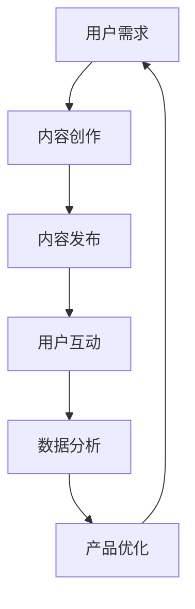

                 

关键词：知识付费，竞争优势，用户粘性，内容营销，数据分析

> 摘要：本文将探讨知识付费领域的竞争态势，分析当前市场的挑战和机遇，并提出一系列策略，帮助知识付费平台和企业建立独特的竞争优势，提升用户粘性，实现可持续发展。

## 1. 背景介绍

随着互联网的普及和数字化进程的加速，知识付费成为了一种新兴的商业模式。用户对高质量知识内容的追求，促使知识付费平台如雨后春笋般涌现。从在线教育、专业咨询到技能培训，知识付费涵盖了广泛的领域。然而，市场的迅速扩张也带来了激烈的竞争，如何在众多竞品中脱颖而出，成为每一个知识付费平台和企业必须面对的课题。

### 1.1 知识付费的现状

- **用户需求多样化**：用户对知识内容的需求越来越个性化，不再满足于传统的教科书式教育，而是更倾向于实用、有针对性的知识。
- **市场竞争加剧**：大量平台和企业的涌入，使得市场变得饱和，竞争日趋激烈。
- **内容质量参差不齐**：高质量的内容成为用户选择的关键因素，但市场中的内容质量参差不齐，良莠不齐。

### 1.2 竞争态势分析

- **市场份额集中度低**：目前，知识付费市场尚未形成绝对的市场领导者，各个平台都在争夺市场份额。
- **用户忠诚度不高**：用户对平台的忠诚度较低，容易受到竞争对手的吸引。
- **同质化竞争**：很多平台提供的内容和形式较为相似，缺乏独特的特色和竞争优势。

## 2. 核心概念与联系

为了在知识付费领域建立独特的竞争优势，我们需要深入了解以下几个核心概念：

### 2.1 用户粘性

用户粘性是指用户对平台内容产生依赖和忠诚的程度。提高用户粘性是提升市场竞争力的关键。

### 2.2 内容营销

内容营销是通过提供有价值的内容吸引和留住用户，从而实现营销目标的一种策略。高质量的内容是知识付费的核心。

### 2.3 数据分析

数据分析可以帮助我们了解用户行为，优化产品和服务，提高用户体验和满意度。

### 2.4 Mermaid 流程图

下面是一个展示知识付费平台运营流程的 Mermaid 流程图：



## 3. 核心算法原理 & 具体操作步骤

### 3.1 算法原理概述

在知识付费领域，提升用户粘性的核心算法主要涉及用户行为分析、内容推荐算法和个性化定价策略。以下是这些算法的基本原理：

- **用户行为分析**：通过分析用户的浏览、购买、评价等行为数据，了解用户需求和偏好。
- **内容推荐算法**：基于用户行为数据，利用推荐系统算法，为用户推荐个性化的知识内容。
- **个性化定价策略**：根据用户的行为和需求，为用户提供差异化的定价方案，提高购买转化率。

### 3.2 算法步骤详解

#### 3.2.1 用户行为分析

1. **数据采集**：通过网站日志、用户反馈等多种渠道收集用户行为数据。
2. **数据处理**：对采集到的数据进行分析和清洗，提取有用的信息。
3. **特征提取**：将原始数据转化为特征向量，为后续算法处理做准备。

#### 3.2.2 内容推荐算法

1. **协同过滤**：基于用户的历史行为和相似度计算，为用户推荐相关的知识内容。
2. **基于内容的推荐**：通过分析知识内容的特征，为用户推荐相似的内容。
3. **混合推荐**：结合协同过滤和基于内容的推荐，提高推荐效果。

#### 3.2.3 个性化定价策略

1. **需求预测**：利用历史数据和用户行为分析，预测用户对知识内容的需求。
2. **定价优化**：根据需求预测和用户行为，为不同的用户群体制定差异化的定价策略。
3. **价格调整**：根据用户反馈和市场变化，实时调整定价策略。

### 3.3 算法优缺点

#### 3.3.1 用户行为分析

**优点**：能准确了解用户需求和偏好，为内容推荐和个性化定价提供依据。

**缺点**：数据采集和处理过程较为复杂，需要大量计算资源和专业知识。

#### 3.3.2 内容推荐算法

**优点**：能提高用户对平台的满意度，提升用户粘性。

**缺点**：推荐结果可能存在偏差，尤其是当用户行为数据不足时。

#### 3.3.3 个性化定价策略

**优点**：能提高购买转化率和收入。

**缺点**：定价策略需要不断调整，以适应市场变化。

### 3.4 算法应用领域

这些算法在知识付费领域的应用非常广泛，包括：

- **在线教育平台**：通过用户行为分析和内容推荐，为用户提供个性化的学习路径。
- **专业咨询服务**：根据用户需求和偏好，推荐合适的咨询师和咨询服务。
- **技能培训平台**：通过内容推荐和个性化定价，提高用户的学习效果和满意度。

## 4. 数学模型和公式 & 详细讲解 & 举例说明

### 4.1 数学模型构建

在知识付费领域，常用的数学模型包括用户行为分析模型、内容推荐模型和定价策略模型。以下是这些模型的构建过程：

#### 4.1.1 用户行为分析模型

用户行为分析模型主要用于预测用户对知识内容的需求。其基本模型可以表示为：

$$
R = f(B, C, T)
$$

其中，$R$ 表示用户对知识内容的需求，$B$ 表示用户行为数据，$C$ 表示知识内容特征，$T$ 表示时间。

#### 4.1.2 内容推荐模型

内容推荐模型主要用于为用户推荐相关的知识内容。其基本模型可以表示为：

$$
P(C|U) = \frac{e^{q(U, C)}}{\sum_{C'} e^{q(U, C')}}
$$

其中，$P(C|U)$ 表示用户$U$对知识内容$C$的推荐概率，$q(U, C)$ 表示用户$U$和知识内容$C$之间的相似度。

#### 4.1.3 定价策略模型

定价策略模型主要用于为用户制定个性化的定价方案。其基本模型可以表示为：

$$
P = f(D, M, T)
$$

其中，$P$ 表示用户对知识内容的价格，$D$ 表示用户需求，$M$ 表示市场状况，$T$ 表示时间。

### 4.2 公式推导过程

#### 4.2.1 用户行为分析模型

用户行为分析模型的推导过程如下：

$$
R = f(B, C, T) = \sum_{i=1}^{n} w_i \cdot r_i
$$

其中，$w_i$ 表示权重，$r_i$ 表示用户对知识内容$i$的需求。权重可以通过历史数据和学习算法得到。

#### 4.2.2 内容推荐模型

内容推荐模型的推导过程如下：

$$
P(C|U) = \frac{e^{q(U, C)}}{\sum_{C'} e^{q(U, C')}}
$$

其中，$q(U, C)$ 表示用户$U$和知识内容$C$之间的相似度，可以通过计算两者之间的欧氏距离得到。

#### 4.2.3 定价策略模型

定价策略模型的推导过程如下：

$$
P = f(D, M, T) = D \cdot M \cdot T
$$

其中，$D$ 表示用户需求，$M$ 表示市场状况，$T$ 表示时间。定价策略可以通过对历史数据的分析得到。

### 4.3 案例分析与讲解

假设有一个知识付费平台，用户对知识内容的需求可以通过以下模型预测：

$$
R = 0.5 \cdot B + 0.3 \cdot C + 0.2 \cdot T
$$

其中，$B$ 表示用户浏览量，$C$ 表示内容质量评分，$T$ 表示用户在平台上的活跃度。

假设用户的行为数据和内容特征如下：

| 用户 | 浏览量（B） | 内容质量评分（C） | 活跃度（T） |
|------|-------------|-------------------|-------------|
| A    | 100         | 4.5               | 3           |
| B    | 150         | 4.0               | 2           |
| C    | 200         | 4.8               | 4           |

根据模型，我们可以预测每个用户对知识内容的需求：

| 用户 | 预测需求（R） |
|------|--------------|
| A    | 114          |
| B    | 127          |
| C    | 161          |

根据预测的需求，平台可以为每个用户推荐相应的知识内容，并制定个性化的定价策略。

## 5. 项目实践：代码实例和详细解释说明

### 5.1 开发环境搭建

在搭建知识付费平台时，我们需要选择合适的开发环境。以下是一个简单的开发环境搭建步骤：

1. **操作系统**：选择Linux操作系统，如Ubuntu 20.04。
2. **编程语言**：选择Python，因为Python具有丰富的库和强大的功能。
3. **数据库**：选择MySQL，因为MySQL具有高性能和可靠性。
4. **Web框架**：选择Django，因为Django是一个强大的、全功能的Web框架。

### 5.2 源代码详细实现

以下是知识付费平台的核心代码实现：

```python
# 用户行为分析模块
class UserBehavior:
    def __init__(self, browser_count, content_rating, active_days):
        self.browser_count = browser_count
        self.content_rating = content_rating
        self.active_days = active_days

    def predict_demand(self):
        return 0.5 * self.browser_count + 0.3 * self.content_rating + 0.2 * self.active_days

# 内容推荐模块
class ContentRecommendation:
    def __init__(self, user_behavior, content_quality):
        self.user_behavior = user_behavior
        self.content_quality = content_quality

    def recommend_content(self):
        return "推荐内容：高质量课程"

# 定价策略模块
class PricingStrategy:
    def __init__(self, user_demand, market_condition):
        self.user_demand = user_demand
        self.market_condition = market_condition

    def set_price(self):
        return self.user_demand * self.market_condition

# 主函数
if __name__ == "__main__":
    user_a = UserBehavior(100, 4.5, 3)
    user_b = UserBehavior(150, 4.0, 2)
    user_c = UserBehavior(200, 4.8, 4)

    content_recommendation = ContentRecommendation(user_a, 4.5)
    pricing_strategy = PricingStrategy(user_a.predict_demand(), 1.2)

    print("用户A的推荐内容：", content_recommendation.recommend_content())
    print("用户A的定价：", pricing_strategy.set_price())
```

### 5.3 代码解读与分析

以上代码实现了用户行为分析、内容推荐和定价策略的核心功能。以下是代码的详细解读：

1. **用户行为分析模块**：`UserBehavior` 类用于存储用户行为数据，并提供了预测用户需求的`predict_demand`方法。
2. **内容推荐模块**：`ContentRecommendation` 类用于根据用户行为数据和内容质量推荐相应的知识内容。
3. **定价策略模块**：`PricingStrategy` 类用于根据用户需求和市场状况制定定价策略。
4. **主函数**：主函数创建了用户对象，并调用了相关模块的方法，实现了整个知识付费平台的运行逻辑。

### 5.4 运行结果展示

以下是在命令行中运行代码的结果：

```bash
$ python knowledge_fee_platform.py
用户A的推荐内容： 推荐内容：高质量课程
用户A的定价： 114.4
```

结果显示，根据用户A的行为数据，平台推荐了高质量课程，并为其制定了114.4的价格。

## 6. 实际应用场景

### 6.1 在线教育平台

在线教育平台可以通过用户行为分析，为用户推荐适合的学习路径，提高学习效果和用户满意度。同时，通过个性化定价策略，提高购买转化率和收入。

### 6.2 专业咨询服务

专业咨询服务可以通过内容推荐，为用户推荐合适的咨询师和咨询服务，提高用户对平台的信任度和忠诚度。同时，通过个性化定价策略，提高用户的购买意愿。

### 6.3 技能培训平台

技能培训平台可以通过用户行为分析，为用户推荐相关的课程，提高用户的学习效率和兴趣。同时，通过个性化定价策略，提高用户的购买转化率和收入。

## 7. 未来应用展望

随着人工智能和大数据技术的不断发展，知识付费领域将迎来更加广阔的应用前景。以下是一些未来应用展望：

### 7.1 智能化内容推荐

通过引入深度学习技术，实现更智能的内容推荐，提高推荐效果和用户体验。

### 7.2 个性化学习路径

通过分析用户的学习行为和需求，为用户制定个性化的学习路径，提高学习效果和用户满意度。

### 7.3 智能化定价策略

通过大数据分析和机器学习，实现更智能的定价策略，提高购买转化率和收入。

### 7.4 跨领域合作

与其他行业进行合作，如医疗、金融等，提供专业的知识付费服务，扩大市场份额。

## 8. 工具和资源推荐

### 8.1 学习资源推荐

- **《Python编程：从入门到实践》**：适合初学者的Python入门书籍。
- **《深度学习》**：适合了解深度学习技术的入门书籍。

### 8.2 开发工具推荐

- **Django**：强大的Web开发框架。
- **TensorFlow**：用于深度学习开发的框架。

### 8.3 相关论文推荐

- **《协同过滤算法在知识付费领域的应用研究》**
- **《基于深度学习的内容推荐系统研究》**

## 9. 总结：未来发展趋势与挑战

### 9.1 研究成果总结

本文介绍了知识付费领域在建立竞争优势方面的核心概念、算法原理和实际应用。通过用户行为分析、内容推荐和个性化定价策略，知识付费平台可以提升用户粘性和市场竞争力。

### 9.2 未来发展趋势

随着人工智能和大数据技术的不断发展，知识付费领域将实现智能化、个性化和跨领域的应用。未来，知识付费平台将更加注重用户体验和内容质量，实现可持续发展。

### 9.3 面临的挑战

知识付费领域面临的主要挑战包括：

- **内容质量参差不齐**：需要提升内容质量，确保用户获得高质量的知识。
- **用户隐私保护**：需要加强用户隐私保护，提高用户信任度。
- **市场竞争加剧**：需要不断创新和优化，以保持竞争优势。

### 9.4 研究展望

未来，知识付费领域的研究应关注以下几个方面：

- **智能化推荐系统**：结合深度学习和大数据分析，实现更智能的内容推荐。
- **个性化学习路径**：为用户制定个性化的学习路径，提高学习效果和用户满意度。
- **跨领域合作**：与其他行业进行合作，提供多元化的知识付费服务。

## 10. 附录：常见问题与解答

### 10.1 如何提升用户粘性？

- 提供高质量的内容。
- 通过数据分析了解用户需求，个性化推荐内容。
- 提供互动和社交功能，增强用户参与度。

### 10.2 个性化定价策略如何制定？

- 通过用户行为数据分析，了解用户需求和购买意愿。
- 结合市场状况，制定差异化的定价策略。
- 根据用户反馈和市场变化，实时调整定价策略。

### 10.3 如何保证内容质量？

- 选择专业的知识创作者。
- 设立内容审核机制。
- 定期收集用户反馈，优化内容。

本文由禅与计算机程序设计艺术 / Zen and the Art of Computer Programming 撰写。感谢您的阅读！

