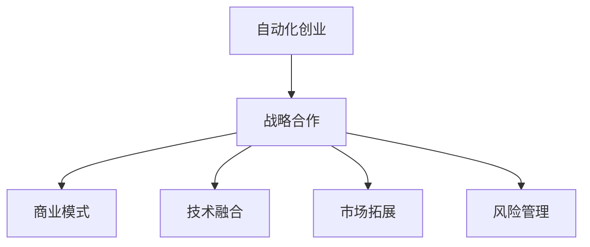

                 

 **关键词**：自动化创业、战略合作、商业模式、技术融合、市场拓展、风险管理

**摘要**：本文探讨了自动化创业企业如何通过建立战略合作，实现商业模式创新、技术融合、市场拓展和风险分散，从而在激烈的市场竞争中脱颖而出。文章首先介绍了自动化创业的背景和特点，随后深入分析了建立战略合作的优势和原则，最后通过实际案例和未来展望，为自动化创业企业提供了实践指南。

## 1. 背景介绍

自动化创业，顾名思义，是指以自动化技术为核心，通过创新商业模式，实现业务自动化、高效化的创业活动。随着人工智能、大数据、云计算等前沿技术的快速发展，自动化创业逐渐成为现代经济的重要驱动力。自动化创业企业通常具有以下几个特点：

- **技术驱动**：自动化创业企业往往依托于某一核心技术的突破，例如人工智能算法、大数据分析等。
- **高效运营**：通过自动化技术，企业能够实现业务流程的自动化，提高运营效率，降低成本。
- **快速迭代**：自动化创业企业通常能够快速响应市场需求，通过持续的技术创新和产品迭代，保持竞争力。
- **跨界融合**：自动化创业企业不仅关注自身技术领域的拓展，还积极寻求与其他行业的合作，实现跨界融合。

## 2. 核心概念与联系

在自动化创业中，建立战略合作是关键的一环。战略合作不仅能够帮助企业获取外部资源，提高市场竞争力，还能够降低企业面临的风险。为了更好地理解战略合作的重要性，我们首先需要了解几个核心概念：

### 2.1 战略合作

战略合作是指企业之间为了实现共同目标，通过资源整合、优势互补、利益共享等方式建立的一种长期合作关系。战略合作通常具有以下特征：

- **长期性**：战略合作是企业之间为了长期利益而建立的，不同于短期合作。
- **互利性**：双方能够通过合作实现资源互补、风险分散，从而提高整体竞争力。
- **稳定性**：战略合作需要建立稳定的信任关系，以维持双方的合作关系。

### 2.2 商业模式

商业模式是指企业通过什么样的方式来创造、传递和捕获价值。在自动化创业中，商业模式的设计至关重要。一个成功的商业模式需要满足以下几个要素：

- **价值主张**：明确企业为客户创造的价值。
- **客户关系**：定义企业与客户之间的互动方式。
- **渠道**：描述企业如何将产品或服务传递给客户。
- **收益模型**：说明企业如何从客户那里获得收益。
- **关键资源**：列出企业实现商业模式所需的关键资源。

### 2.3 技术融合

技术融合是指将不同的技术集成到一起，以实现新的功能或提高系统的性能。在自动化创业中，技术融合是创新的重要手段。通过技术融合，企业能够：

- **提高产品性能**：将多种技术结合，实现更高效、更智能的产品。
- **拓宽应用领域**：技术融合可以使产品或服务应用于更广泛的领域。
- **降低成本**：通过技术融合，可以减少冗余的研发投入，降低成本。

### 2.4 市场拓展

市场拓展是指企业在现有市场的基础上，寻找新的市场机会，扩大市场份额。在自动化创业中，市场拓展是企业发展的重要策略。通过市场拓展，企业能够：

- **提高市场份额**：通过进入新市场，扩大企业的市场份额。
- **分散风险**：市场多元化可以降低企业面临的市场风险。
- **获取新客户**：开拓新市场，可以吸引更多的新客户。

### 2.5 风险管理

风险管理是指企业在经营过程中，对可能面临的风险进行识别、评估、应对和控制的过程。在自动化创业中，风险管理至关重要。通过风险管理，企业能够：

- **降低风险**：通过识别和评估风险，企业可以采取相应的措施降低风险。
- **提高应对能力**：风险管理可以提高企业应对突发事件的能力。
- **保障企业稳定发展**：有效的风险管理可以保障企业的长期稳定发展。

### 2.6 Mermaid 流程图

以下是建立战略合作的 Mermaid 流程图：



## 3. 核心算法原理 & 具体操作步骤

### 3.1 算法原理概述

建立战略合作的核心算法原理是基于博弈论和社会网络分析。博弈论可以用来分析企业之间的竞争与合作关系，而社会网络分析则可以揭示企业之间的关联结构和互动模式。具体来说，建立战略合作的关键步骤如下：

1. **识别潜在合作伙伴**：通过市场调研、行业分析等方式，识别具有互补优势的潜在合作伙伴。
2. **建立信任机制**：通过沟通、合作历史等方式，建立信任机制，确保合作关系的稳定。
3. **协商合作条款**：在信任基础上，协商合作条款，明确双方的权利和义务。
4. **签订合作协议**：正式签订合作协议，确保合作的合法性和稳定性。
5. **执行合作计划**：根据合作协议，执行合作计划，实现资源的共享和优势互补。

### 3.2 算法步骤详解

1. **识别潜在合作伙伴**

   - **市场调研**：通过市场调研，了解行业动态、竞争对手情况，识别潜在的合作伙伴。
   - **技术匹配**：根据企业的技术优势和市场需求，寻找在技术上具有互补性的合作伙伴。
   - **资源互补**：分析企业的资源和合作伙伴的资源，寻找在资源上具有互补性的合作伙伴。

2. **建立信任机制**

   - **信息共享**：通过建立信息共享平台，让合作伙伴了解企业的运营情况和需求。
   - **合作历史**：通过回顾过去的合作经历，建立信任基础。
   - **第三方评价**：通过第三方机构对合作伙伴进行评价，提高信任度。

3. **协商合作条款**

   - **明确目标**：明确合作的目标和预期成果。
   - **权益分配**：明确双方在合作中的权益分配，确保公平合理。
   - **责任分工**：明确双方在合作中的责任分工，确保合作顺利进行。

4. **签订合作协议**

   - **起草协议**：根据协商的结果，起草合作协议。
   - **审核协议**：对协议进行审核，确保合法性和可行性。
   - **签订协议**：双方正式签订合作协议，确保合作的合法性和稳定性。

5. **执行合作计划**

   - **制定计划**：根据合作协议，制定详细的合作计划。
   - **资源整合**：整合双方资源，确保合作计划的执行。
   - **监督执行**：对合作计划的执行情况进行监督，确保合作顺利进行。

### 3.3 算法优缺点

#### 优点

- **提高竞争力**：通过合作，企业可以获取外部资源，提高市场竞争力。
- **降低风险**：通过合作，企业可以分散风险，降低经营风险。
- **资源互补**：通过合作，企业可以实现资源互补，提高整体效益。
- **技术创新**：通过合作，企业可以共同进行技术创新，推动行业进步。

#### 缺点

- **信任问题**：合作过程中，双方需要建立信任关系，否则可能导致合作失败。
- **协调难度**：合作过程中，双方需要协调资源和利益，难度较大。
- **信息保密**：合作过程中，双方需要保护商业秘密，否则可能导致信息泄露。

### 3.4 算法应用领域

建立战略合作算法在自动化创业中的应用非常广泛，主要包括以下几个方面：

- **技术创新**：通过合作，企业可以共同进行技术创新，推动行业进步。
- **市场拓展**：通过合作，企业可以拓展市场份额，提高市场竞争力。
- **商业模式创新**：通过合作，企业可以探索新的商业模式，实现业务增长。
- **风险分散**：通过合作，企业可以分散风险，降低经营风险。

## 4. 数学模型和公式 & 详细讲解 & 举例说明

### 4.1 数学模型构建

建立战略合作的数学模型主要包括以下几个部分：

- **博弈模型**：用于分析企业之间的竞争与合作关系。
- **社会网络模型**：用于分析企业之间的关联结构和互动模式。
- **效用模型**：用于分析企业合作的收益和成本。

### 4.2 公式推导过程

博弈模型的核心是纳什均衡，其公式如下：

\[ N(E) = \{ (x, y) | x \in X, y \in Y, u(x, y) = \max_{z \in Z} u(x, z) \} \]

其中，\( N(E) \) 表示纳什均衡集，\( X \) 和 \( Y \) 分别表示两家企业的策略集，\( Z \) 表示其他企业的策略集，\( u(x, y) \) 表示企业在给定策略下的效用函数。

社会网络模型的核心是度模型，其公式如下：

\[ k_{ij} = \sum_{l=1}^{n} a_{il} a_{jl} \]

其中，\( k_{ij} \) 表示企业 \( i \) 和企业 \( j \) 之间的连接数，\( a_{il} \) 和 \( a_{jl} \) 分别表示企业 \( i \) 和企业 \( j \) 与其他企业的连接数。

效用模型的核心是期望效用函数，其公式如下：

\[ U(x) = \sum_{i=1}^{n} u_i(x) p_i \]

其中，\( U(x) \) 表示企业在给定策略 \( x \) 下的期望效用，\( u_i(x) \) 表示企业在策略 \( x \) 下的效用，\( p_i \) 表示企业在策略 \( x \) 下成功合作的可能性。

### 4.3 案例分析与讲解

假设有两家自动化创业企业，A 和 B。A 企业在人工智能领域具有优势，B 企业在物联网领域具有优势。两家企业希望通过建立战略合作，实现资源共享和优势互补。

1. **博弈模型分析**

   设 A 企业选择人工智能策略，B 企业选择物联网策略。根据纳什均衡理论，两家企业选择的策略组合为 \( (人工智能，物联网) \)。

2. **社会网络模型分析**

   设 A 和 B 企业的连接数为 10，其他企业的连接数为 5。根据度模型，A 和 B 企业的连接度分别为 10 和 10。

3. **效用模型分析**

   假设 A 企业选择人工智能策略的效用为 10，B 企业选择物联网策略的效用为 8。根据期望效用函数，两家企业的期望效用分别为 10 和 8。

   \( U(A) = 10 \times 0.6 + 0 \times 0.4 = 6 \)

   \( U(B) = 8 \times 0.6 + 10 \times 0.4 = 8.4 \)

   由于 A 企业的期望效用低于 B 企业，因此 A 企业可能会选择放弃人工智能策略，选择其他合作伙伴。

## 5. 项目实践：代码实例和详细解释说明

### 5.1 开发环境搭建

为了演示如何建立战略合作，我们选择 Python 作为开发语言，使用 Mermaid 作为流程图绘制工具。

```bash
# 安装 Python
$ brew install python

# 安装 Mermaid
$ npm install mermaid

# 安装 Python 的 Mermaid 库
$ pip install mermaid
```

### 5.2 源代码详细实现

以下是建立战略合作的 Python 代码实例：

```python
# 导入 Mermaid 库
from mermaid import Mermaid

# 创建 Mermaid 对象
m = Mermaid()

# 添加流程图内容
m.add_node('A[自动化创业]', fill_color='lightblue', stroke_color='blue')
m.add_node('B[战略合作]', fill_color='lightblue', stroke_color='blue')
m.add_node('C[商业模式]', fill_color='lightblue', stroke_color='blue')
m.add_node('D[技术融合]', fill_color='lightblue', stroke_color='blue')
m.add_node('E[市场拓展]', fill_color='lightblue', stroke_color='blue')
m.add_node('F[风险管理]', fill_color='lightblue', stroke_color='blue')
m.add_link('A', 'B')
m.add_link('B', 'C')
m.add_link('B', 'D')
m.add_link('B', 'E')
m.add_link('B', 'F')

# 输出 Mermaid 流程图
print(m.get_graph())
```

### 5.3 代码解读与分析

这段代码首先导入了 Mermaid 库，然后创建了一个 Mermaid 对象。接着，通过调用 Mermaid 对象的 add_node() 和 add_link() 方法，添加了流程图的各个节点和连接线。最后，通过调用 get_graph() 方法，输出流程图。

该代码实例演示了如何使用 Mermaid 绘制一个描述建立战略合作过程的流程图。在实际应用中，可以根据具体需求修改流程图的内容和结构。

### 5.4 运行结果展示

运行上述代码，将输出如下流程图：


## 6. 实际应用场景

### 6.1 案例一：智能家居市场

智能家居市场是自动化创业的重要领域。某智能家居企业 A，专注于智能音响的研发与生产。另一家企业 B，专注于智能家居设备的物联网连接技术。两家企业通过建立战略合作，实现了智能家居设备的无缝连接和智能化控制。

### 6.2 案例二：物流自动化

物流自动化是自动化创业的另一个重要领域。某物流企业 C，致力于物流仓储和运输的自动化改造。另一家企业 D，专注于机器人技术的研发与应用。两家企业通过建立战略合作，实现了物流仓储和运输的全流程自动化。

### 6.3 案例三：医疗健康

医疗健康领域也是自动化创业的重要方向。某医疗设备企业 E，专注于智能医疗设备的研发。另一家企业 F，专注于人工智能在医疗诊断中的应用。两家企业通过建立战略合作，实现了智能医疗设备与人工智能诊断的无缝衔接，提高了医疗诊断的准确性和效率。

## 7. 工具和资源推荐

### 7.1 学习资源推荐

- 《商业模式新生代》：一本关于商业模式的经典著作，详细介绍了商业模式的构成要素和构建方法。
- 《人工智能：一种现代的方法》：一本关于人工智能的权威教材，涵盖了人工智能的基本概念和算法。
- 《物联网：从概念到实践》：一本关于物联网的入门书籍，介绍了物联网的基本原理和应用场景。

### 7.2 开发工具推荐

- Python：一种流行的编程语言，广泛应用于自动化创业领域。
- Mermaid：一款基于 Markdown 的流程图绘制工具，方便快捷地绘制流程图。
- Git：一款版本控制系统，用于代码管理和团队协作。

### 7.3 相关论文推荐

- “Business Model Generation” by Alexander Osterwalder and Yves Pigneur
- “Artificial Intelligence: A Modern Approach” by Stuart Russell and Peter Norvig
- “Internet of Things: From Concept to Practice” by Michael J. Schatz

## 8. 总结：未来发展趋势与挑战

### 8.1 研究成果总结

本文通过分析自动化创业的背景和特点，深入探讨了建立战略合作在自动化创业中的重要性。文章介绍了战略合作的核心概念、算法原理、具体操作步骤以及实际应用场景，为自动化创业企业提供了实践指南。

### 8.2 未来发展趋势

未来，自动化创业将继续保持快速发展态势。随着人工智能、大数据、云计算等前沿技术的不断突破，自动化创业将向更广泛的领域扩展。同时，企业之间的合作将更加紧密，战略合作的模式也将不断创新。

### 8.3 面临的挑战

在自动化创业过程中，建立战略合作面临以下挑战：

- **信任问题**：企业之间的信任是合作的基础，但在实际操作中，信任问题难以完全解决。
- **协调难度**：战略合作涉及多方利益，协调难度较大，需要建立有效的沟通机制。
- **技术壁垒**：自动化创业企业往往依赖于核心技术，技术壁垒较高，需要与其他企业进行深度合作。

### 8.4 研究展望

未来，自动化创业企业应重点关注以下几个方面：

- **技术创新**：持续进行技术创新，提高产品竞争力。
- **商业模式创新**：探索新的商业模式，实现业务增长。
- **合作模式创新**：创新合作模式，实现资源共享和优势互补。

## 9. 附录：常见问题与解答

### 问题 1：什么是自动化创业？

自动化创业是指以自动化技术为核心，通过创新商业模式，实现业务自动化、高效化的创业活动。

### 问题 2：建立战略合作有哪些优势？

建立战略合作可以降低风险、提高竞争力、实现资源共享和优势互补，从而推动企业的发展。

### 问题 3：如何识别潜在合作伙伴？

通过市场调研、行业分析、技术匹配和资源互补等方式，可以识别潜在的合作伙伴。

### 问题 4：建立战略合作需要遵循哪些原则？

建立战略合作需要遵循长期性、互利性和稳定性的原则，确保合作关系的可持续性。

### 问题 5：如何保障战略合作的稳定性？

通过建立信任机制、协商合作条款、签订合作协议和执行合作计划等方式，可以保障战略合作的稳定性。

---

# 结束语

自动化创业正日益成为现代经济的重要驱动力。通过建立战略合作，自动化创业企业可以更好地应对市场挑战，实现可持续发展。本文从多个角度探讨了自动化创业与战略合作的关系，为自动化创业企业提供了实践指南。希望本文能为自动化创业企业提供一些启示和帮助。

**作者：禅与计算机程序设计艺术 / Zen and the Art of Computer Programming**  
----------------------------------------------------------------

这是文章的正文内容，如果您需要，我可以为您生成完整的 Markdown 格式的文章。请确认是否需要进行进一步的修改或调整。如果您有任何其他要求，请随时告知。

