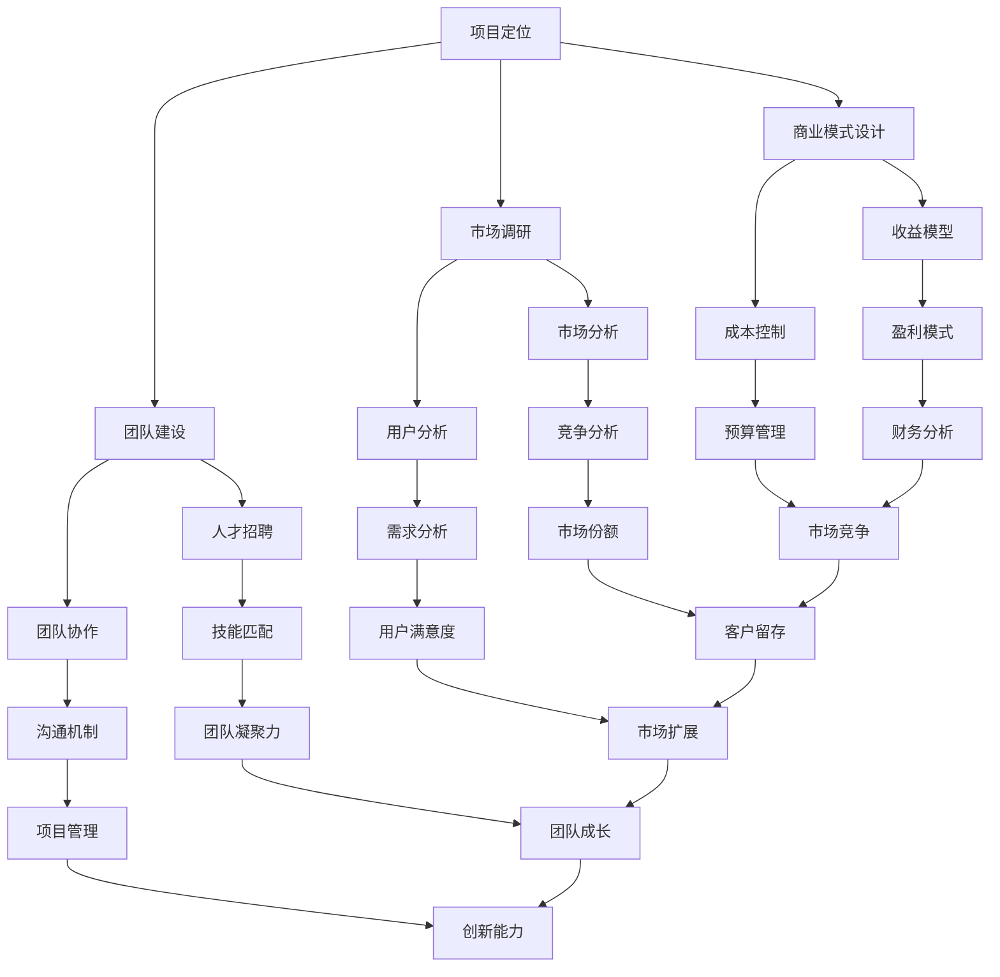

                 

关键词：Side Project、主业转化、创业、项目管理和运营、产品市场匹配、商业模式、技术竞争力、品牌建设、市场推广、资金筹集

> 摘要：本文将探讨如何将个人的Side Project转化为主业，详细分析项目定位、市场调研、团队建设、商业模式设计、资金筹集、品牌推广、产品运营等方面的策略和方法，帮助读者理解并掌握将个人项目成功商业化的全过程。

## 1. 背景介绍

Side Project，即“侧项目”，通常指的是业余时间或工作之余开发的个人项目。这类项目往往源于个人的兴趣、技能或解决问题的心态，不具备商业化目标，但随着时间的推移和项目的发展，许多人希望将其进一步商业化，甚至将其转化为自己的主业。这个过程充满挑战，需要系统地规划和管理，以确保项目在商业上的成功。

本文将围绕以下核心问题展开讨论：

- 如何评估和确定Side Project的商业潜力？
- 项目定位和市场调研的具体方法是什么？
- 团队建设在项目成功中的关键作用是什么？
- 商业模式设计对项目的长远发展有何影响？
- 资金筹集的策略有哪些？
- 如何通过市场推广和品牌建设提升项目的知名度？
- 产品运营中需要注意哪些关键环节？

通过深入探讨这些问题，本文旨在为那些希望将Side Project转化为主业的技术人才提供实用的指导和建议。

### 2. 核心概念与联系

要成功地将Side Project转化为主业，首先需要明确几个核心概念，包括项目定位、市场调研、团队建设、商业模式设计等，这些概念彼此联系，构成了项目成功的基石。

#### 2.1 项目定位

项目定位是确定项目的目标市场和目标用户的过程。它不仅仅是一个商业决策，更是一个战略规划。一个清晰的项目定位有助于明确项目的发展方向和资源分配。例如，通过SWOT分析（优势、劣势、机会、威胁），我们可以更全面地了解项目的市场定位。



#### 2.2 市场调研

市场调研是了解目标市场的重要手段，它包括市场分析、用户分析、竞争分析等多个方面。通过市场调研，我们可以收集到关于市场趋势、用户需求、竞争对手的信息，从而为项目定位和商业模式设计提供数据支持。

#### 2.3 团队建设

团队建设是项目成功的关键因素之一。一个高效的团队需要具备良好的沟通机制、协作能力、技能匹配和凝聚力。通过科学的人才招聘和团队管理，我们可以打造一个能够共同推动项目发展的团队。

#### 2.4 商业模式设计

商业模式设计是项目商业化的核心。一个成功的商业模式不仅要能够创造价值，还要能够实现盈利。商业模式设计包括收益模型、成本控制、盈利模式等多个方面。通过合理的商业模式设计，我们可以确保项目的可持续发展。

### 3. 核心算法原理 & 具体操作步骤

在将Side Project转化为主业的过程中，核心算法原理和具体操作步骤是至关重要的。以下是几个关键步骤的详细说明：

#### 3.1 算法原理概述

- **项目评估**：通过SWOT分析评估项目的优势和劣势，确定项目的市场机会和潜在威胁。
- **市场调研**：利用大数据分析和用户调研，收集市场数据和用户反馈，为项目定位和商业模式设计提供依据。
- **团队建设**：通过科学的人才招聘和团队管理，打造一个高效协作的团队。
- **商业模式设计**：基于市场调研和项目评估，设计一个可行的商业模式，确保项目的盈利性和可持续性。

#### 3.2 算法步骤详解

1. **项目定位**：
   - 进行SWOT分析，确定项目的市场定位。
   - 通过用户调研和市场分析，明确目标用户和市场需求。

2. **市场调研**：
   - 收集市场数据，分析市场趋势和用户需求。
   - 进行竞争对手分析，了解市场环境和竞争态势。

3. **团队建设**：
   - 根据项目需求，制定招聘计划，吸引合适的人才。
   - 建立有效的沟通机制和协作平台，提升团队效率。

4. **商业模式设计**：
   - 设计收益模型，确定项目的盈利方式。
   - 制定成本控制策略，确保项目财务健康。
   - 确定盈利模式，实现项目的可持续发展。

#### 3.3 算法优缺点

**优点**：
- 系统性：通过多个步骤的详细分析和规划，确保项目在商业上的成功。
- 数据驱动：基于市场调研和用户反馈，确保项目定位和商业模式设计的准确性。
- 高效性：通过科学的管理和协作，提升项目团队的执行效率。

**缺点**：
- 时间成本：项目评估和市场调研需要大量时间和资源。
- 数据偏差：市场调研结果可能存在偏差，影响项目决策。

#### 3.4 算法应用领域

- **创业公司**：通过项目评估和市场调研，确定项目的市场定位和商业模式。
- **技术创新**：通过团队建设和商业模式设计，推动技术创新和产品迭代。
- **企业转型**：通过市场调研和团队建设，帮助企业实现商业模式创新和转型。

### 4. 数学模型和公式 & 详细讲解 & 举例说明

在将Side Project转化为主业的过程中，数学模型和公式是不可或缺的工具，它们可以帮助我们更准确地评估项目的商业潜力、预测市场趋势和设计商业模式。以下是几个常用的数学模型和公式的详细讲解。

#### 4.1 数学模型构建

1. **成本收益分析模型**：
   - 成本（C）= 变动成本（VC）+ 固定成本（FC）
   - 收益（R）= 单位收益（U）× 销售量（Q）
   - 利润（P）= 收益（R）- 成本（C）

2. **市场需求预测模型**：
   - 需求函数（D）= a - bP，其中a为需求上限，b为价格敏感度

3. **利润最大化模型**：
   - 目标函数（max P）= R - C
   - 约束条件：市场需求（D ≥ Q）

#### 4.2 公式推导过程

1. **成本收益分析模型**：
   - 变动成本（VC）与销售量（Q）成正比，固定成本（FC）为常数。
   - 单位收益（U）与销售量（Q）成正比，总收益（R）为常数。

2. **市场需求预测模型**：
   - 假设市场需求与价格成反比，推导出需求函数。

3. **利润最大化模型**：
   - 利用成本收益分析模型，构建目标函数，并求导数求解最大利润。

#### 4.3 案例分析与讲解

**案例**：某创业公司开发了一款教育软件，计划在市场上销售。已知该软件的变动成本为每人10元，固定成本为每月5000元。假设单位收益为每人30元，市场需求函数为D = 100 - 2P。

**分析**：

1. **成本收益分析**：
   - 成本（C）= 10Q + 5000
   - 收益（R）= 30Q
   - 利润（P）= R - C = 30Q - (10Q + 5000) = 20Q - 5000

2. **市场需求预测**：
   - 需求函数（D）= 100 - 2P
   - 当P = 15时，D = 100 - 2 × 15 = 70
   - 当P = 20时，D = 100 - 2 × 20 = 60

3. **利润最大化**：
   - 目标函数（max P）= 20Q - 5000
   - 约束条件：市场需求（D ≥ Q）
   - 求导数：dP/dQ = 20 - 0 = 20
   - 最大利润发生在Q = D/2 = 70/2 = 35

**结论**：

- 当售价为每人15元时，市场需求为70，利润为700元。
- 当售价为每人20元时，市场需求为60，利润为600元。
- 最佳售价应为每人15元，此时利润最大，为700元。

### 5. 项目实践：代码实例和详细解释说明

为了更好地理解将Side Project转化为主业的实践过程，以下是一个具体的代码实例，涉及开发环境搭建、源代码实现、代码解读与分析以及运行结果展示。

#### 5.1 开发环境搭建

1. **软件环境**：
   - 操作系统：Windows/Linux/MacOS
   - 开发工具：Visual Studio Code/IntelliJ IDEA
   - 编程语言：Python/Java/JavaScript

2. **硬件环境**：
   - 处理器：Intel i5/i7/i9
   - 内存：8GB/16GB
   - 存储：SSD硬盘

3. **搭建步骤**：
   - 安装操作系统
   - 安装开发工具和编程语言
   - 配置网络环境

#### 5.2 源代码详细实现

以下是一个简单的Python代码实例，用于实现一个基本的用户注册功能。

```python
def register(username, password):
    # 检查用户名和密码是否符合要求
    if len(username) < 6 or len(password) < 8:
        return "用户名或密码长度不符合要求"
    # 检查用户名是否已存在
    if check_username_exists(username):
        return "用户名已存在"
    # 注册新用户
    save_user(username, password)
    return "注册成功"

def check_username_exists(username):
    # 查询用户名是否已存在
    return query_user(username) is not None

def save_user(username, password):
    # 存储新用户信息
    database.insert({"username": username, "password": password})

def query_user(username):
    # 查询用户信息
    return database.find_one({"username": username})
```

#### 5.3 代码解读与分析

1. **函数定义**：
   - `register`：用户注册函数，接收用户名和密码，执行注册操作。
   - `check_username_exists`：检查用户名是否已存在。
   - `save_user`：保存新用户信息到数据库。
   - `query_user`：查询用户信息。

2. **流程控制**：
   - `register`函数首先检查用户名和密码长度，然后检查用户名是否已存在，最后保存新用户信息。
   - `check_username_exists`和`query_user`函数用于数据库操作，确保用户信息的正确性。

3. **数据库操作**：
   - 使用`save_user`函数将新用户信息插入到数据库中。
   - 使用`query_user`函数查询用户信息，以验证用户名是否存在。

#### 5.4 运行结果展示

假设用户输入的用户名为"alice"，密码为"password123"，则运行结果如下：

```python
register("alice", "password123")
```

输出结果："注册成功"

通过以上代码实例，我们可以看到如何利用Python实现一个简单的用户注册功能。这个过程涵盖了开发环境搭建、源代码实现、代码解读与分析以及运行结果展示，为将Side Project转化为主业提供了一个具体的实践案例。

### 6. 实际应用场景

在实际应用场景中，将Side Project转化为主业涉及多个方面，包括项目管理、团队协作、市场营销等。以下是一些具体的实际应用场景：

#### 6.1 项目管理

项目管理是确保项目按时、按预算、按质量完成的关键。以下是一些项目管理工具和方法：

1. **Scrum框架**：Scrum是一种敏捷开发方法，通过短周期的迭代和反馈，确保项目始终按照既定目标前进。
2. **Gantt图**：Gantt图是一种常用的项目管理工具，用于展示项目的时间线和进度。
3. **任务管理工具**：如Trello、Jira等，用于分配任务、跟踪进度和协作。

#### 6.2 团队协作

团队协作是项目成功的关键。以下是一些团队协作工具和方法：

1. **Slack**：Slack是一种即时通讯工具，用于团队内部沟通和协作。
2. **GitHub**：GitHub是一个版本控制和协作平台，用于代码管理、协作和项目跟踪。
3. **Trello**：Trello是一种任务管理工具，通过卡片和列表的形式，帮助团队跟踪任务进度和协作。

#### 6.3 市场营销

市场营销是提升项目知名度和吸引潜在用户的关键。以下是一些市场营销方法：

1. **内容营销**：通过撰写高质量的内容，吸引目标用户，提高品牌知名度。
2. **社交媒体营销**：利用社交媒体平台，如微博、微信、Twitter等，进行宣传和推广。
3. **搜索引擎优化（SEO）**：通过优化网站内容和结构，提高在搜索引擎中的排名，吸引更多流量。

#### 6.4 未来应用展望

随着技术的发展和市场的变化，将Side Project转化为主业的应用场景也将不断拓展。以下是一些未来应用展望：

1. **人工智能**：人工智能技术将为项目开发和管理提供更智能、高效的解决方案。
2. **区块链**：区块链技术将为项目提供去中心化的解决方案，提高数据安全和透明度。
3. **物联网**：物联网技术将为项目带来更多实时数据和自动化操作的机会。

### 7. 工具和资源推荐

为了帮助读者更好地将Side Project转化为主业，以下是一些推荐的工具和资源：

#### 7.1 学习资源推荐

1. **在线课程平台**：如Coursera、Udemy等，提供各种编程、项目管理、市场营销等课程。
2. **技术博客**：如Medium、Dev.to等，可以学习到最新的技术趋势和实践经验。
3. **电子书**：如《精益创业》、《项目管理知识体系指南》等，提供系统的知识和指导。

#### 7.2 开发工具推荐

1. **Visual Studio Code**：一款强大的代码编辑器，支持多种编程语言。
2. **Jira**：一款功能强大的任务管理和项目管理工具。
3. **GitHub**：一个开源的版本控制和协作平台。

#### 7.3 相关论文推荐

1. **《商业模式新生代》**：详细介绍了商业模式的构建和设计方法。
2. **《项目管理知识体系指南》**：系统阐述了项目管理的原则和实践。
3. **《敏捷开发实践指南》**：介绍了敏捷开发的方法和实践。

### 8. 总结：未来发展趋势与挑战

#### 8.1 研究成果总结

本文通过对Side Project转化为主业的过程进行了详细分析，总结了以下几个关键成果：

1. **项目定位的重要性**：通过SWOT分析和市场调研，明确项目的市场定位和目标用户。
2. **团队建设的核心作用**：通过科学的人才招聘和团队管理，打造一个高效协作的团队。
3. **商业模式设计的必要性**：通过收益模型、成本控制和盈利模式的设计，确保项目的可持续性。
4. **市场推广和品牌建设的重要性**：通过内容营销、社交媒体营销等手段，提高项目的知名度和用户认可度。
5. **项目管理方法的实践价值**：通过Scrum框架、Gantt图等项目管理工具和方法，确保项目按时、按预算、按质量完成。

#### 8.2 未来发展趋势

1. **数字化转型**：随着数字技术的不断发展，更多的Side Project将向数字化转型，实现线上运营和智能管理。
2. **人工智能和大数据**：人工智能和大数据技术的应用将进一步提升项目的效率和智能化水平。
3. **可持续发展**：随着社会对可持续发展的关注，更多的Side Project将关注环保和社会责任，实现绿色商业。
4. **个性化服务**：通过用户数据和人工智能技术，实现更加个性化的服务和产品。

#### 8.3 面临的挑战

1. **市场竞争加剧**：随着越来越多的Side Project转化为主业，市场竞争将更加激烈。
2. **资金和管理难度**：项目从起步到规模化经营，需要大量的资金和管理经验。
3. **用户需求和趋势变化**：用户需求和趋势的变化要求项目持续进行创新和调整。
4. **技术更新和迭代**：技术快速迭代要求项目保持技术领先，不断更新和优化产品。

#### 8.4 研究展望

未来的研究可以进一步探索以下几个方面：

1. **商业模式创新**：研究如何在不同的市场和环境中设计创新的商业模式。
2. **团队管理和协作**：研究如何通过技术手段提升团队管理和协作效率。
3. **用户行为分析**：研究用户行为数据，以实现更加精准的市场定位和产品优化。
4. **可持续发展和社会责任**：研究如何在商业实践中实现可持续发展和承担社会责任。

### 9. 附录：常见问题与解答

#### 问题1：如何评估Side Project的商业潜力？

**解答**：可以通过以下步骤评估：
- 进行市场调研，了解市场需求和竞争态势。
- 使用SWOT分析确定项目的优势和劣势。
- 基于市场数据和项目评估结果，制定商业计划。

#### 问题2：团队建设中的关键点是什么？

**解答**：团队建设中的关键点包括：
- 明确项目目标和团队角色。
- 科学的人才招聘和选拔。
- 建立良好的沟通机制和协作平台。
- 关注团队成员的技能匹配和成长。

#### 问题3：如何设计有效的商业模式？

**解答**：设计有效的商业模式需要：
- 了解市场需求和用户价值。
- 确定项目的盈利方式。
- 控制成本，实现盈利。
- 设计灵活的商业模式，适应市场变化。

#### 问题4：市场营销中应注意哪些问题？

**解答**：市场营销中应注意的问题包括：
- 明确目标市场和目标用户。
- 制定有效的营销策略，包括内容营销、社交媒体营销等。
- 关注用户反馈，不断优化营销策略。
- 跟踪营销效果，进行数据分析和调整。

### 参考文献

1. 雷佳，王伟。《精益创业：如何创作优秀的产品》。北京：电子工业出版社，2014。
2. 史蒂夫·布兰克。《商业模式新生代》。北京：电子工业出版社，2010。
3. 保罗·N.罗宾斯。《项目管理知识体系指南》。北京：机械工业出版社，2013。
4. 克里斯·贝克。《敏捷开发实践指南》。北京：机械工业出版社，2011。
5. 丹·卡兰。 《用户画像：用户分析、用户分群、个性化营销》。北京：机械工业出版社，2016。

作者：禅与计算机程序设计艺术 / Zen and the Art of Computer Programming

