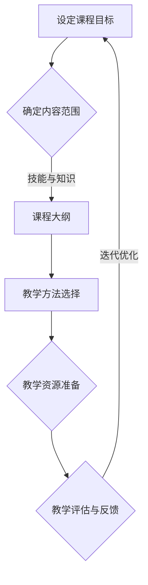
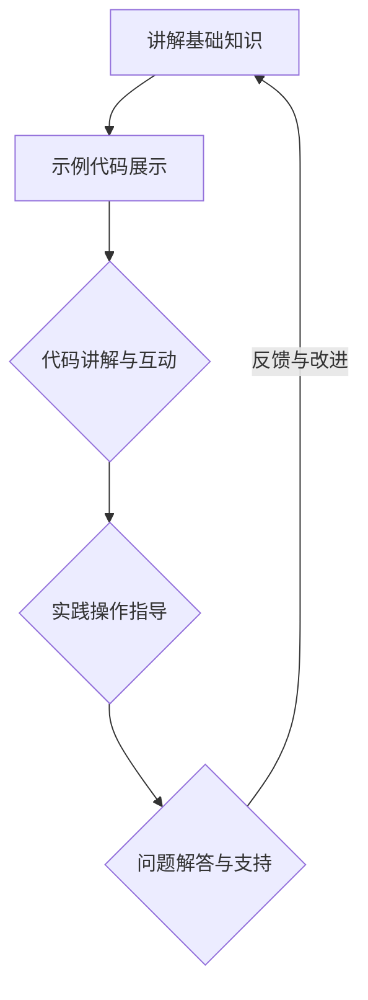
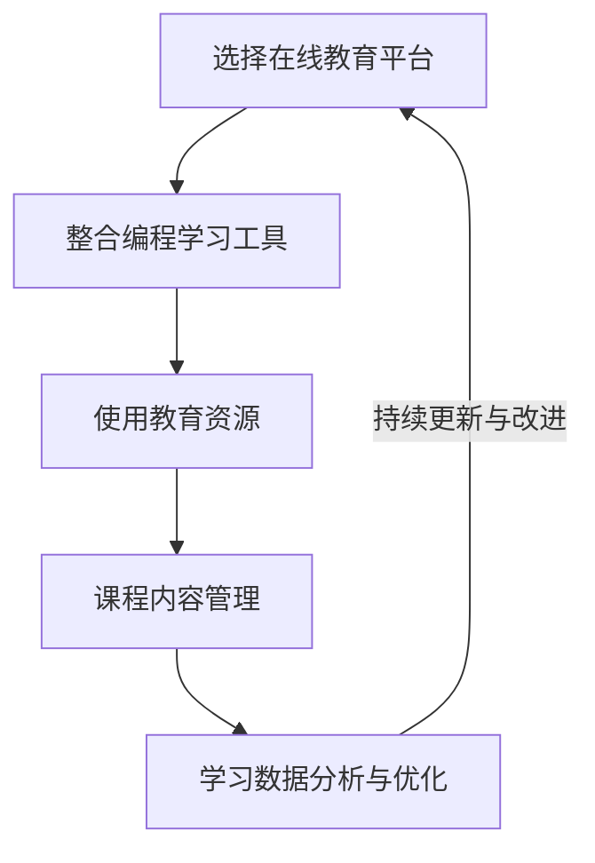

                 

关键词：编程技能、线上编程训练营、教学设计、技术传播、教育技术

> 摘要：随着互联网技术的快速发展，线上教育成为了新兴的教育形式。本文将探讨如何将个人的编程技能转化为线上编程训练营，通过分析教学设计、技术传播、教育技术等核心要素，为开发者提供一整套实现线上编程教学的策略和方法。

## 1. 背景介绍

近年来，随着全球互联网的普及和信息技术的飞速发展，线上教育作为一种全新的教育模式，逐渐走进了公众的视野。特别是在新冠疫情期间，线上教育凭借其灵活、便捷的特点，极大地满足了广大学习者和教育工作者的需求。在这样的背景下，许多开发者开始思考如何将自身的编程技能转化为线上编程训练营，以实现知识的传播和技能的传承。

线上编程训练营不仅能够打破地域和时间的限制，让全球的学习者都能参与到编程学习中来，还能够为开发者提供一个展示自己教学能力和影响力的平台。然而，将编程技能转化为线上课程并非易事，它需要开发者具备一定的教学设计能力、技术传播技巧和教育技术应用能力。

本文将围绕这三个核心要素，探讨如何将编程技能转化为线上编程训练营，为开发者提供一套系统的策略和方法。文章结构如下：

1. 背景介绍
2. 核心概念与联系
3. 核心算法原理与具体操作步骤
4. 数学模型与公式详解
5. 项目实践：代码实例与详细解释
6. 实际应用场景
7. 工具和资源推荐
8. 总结：未来发展趋势与挑战
9. 附录：常见问题与解答

### 2. 核心概念与联系

在将编程技能转化为线上编程训练营的过程中，以下几个核心概念和联系至关重要：

#### 2.1 教学设计

教学设计是线上编程训练营成功的关键。一个优秀的教学设计能够吸引学习者、提高学习效果。教学设计包括课程目标设定、内容安排、教学方法选择等多个方面。以下是一个教学设计的Mermaid流程图：



#### 2.2 技术传播

技术传播是确保学习者能够理解和掌握编程知识的过程。良好的技术传播技巧能够帮助学习者更快地理解和应用所学知识。技术传播包括讲解、示例、互动等多种形式。以下是一个技术传播的Mermaid流程图：



#### 2.3 教育技术

教育技术是指应用信息技术来促进教育和学习的方法和工具。在教育技术中，开发者可以使用各种在线教育平台、编程学习工具和资源来提高教学效果。以下是一个教育技术的Mermaid流程图：



### 3. 核心算法原理与具体操作步骤

#### 3.1 算法原理概述

将编程技能转化为线上编程训练营，首先需要理解核心算法原理。核心算法通常包括数据结构与算法的基础知识，如排序算法、搜索算法等。以下是一个简单的排序算法（冒泡排序）的原理概述：

```markdown
**冒泡排序原理：**
冒泡排序是一种简单的排序算法，它重复地遍历要排序的数列，一次比较两个元素，如果它们的顺序错误就把它们交换过来。遍历数列的工作是重复地进行，直到没有再需要交换的元素为止。

**具体步骤：**
1. 比较相邻的元素。如果第一个比第二个大（升序排序），就交换它们的位置。
2. 对每一对相邻元素做同样的工作，从开始第一对到结尾的最后一对。
3. 在这一点，最后的元素应该会是最大的数。
4. 重复步骤1~3，对越来越小的数组进行同样的操作。
```

#### 3.2 算法步骤详解

以下是对冒泡排序算法的详细步骤解释：

```markdown
**详细步骤：**
1. 从第一个元素开始，比较相邻的元素。如果第一个元素比第二个元素大，交换它们的位置。
2. 继续对下一对相邻的元素进行同样的操作，直到当前未排序数组的最后一个元素。
3. 现在未排序数组的最后一个元素是被正确排序的。
4. 将未排序数组的长短减少一个元素，再重复上面的步骤。
5. 重复这个过程，直到整个数组被排序。
6. 在每次遍历中，最大值都冒泡到了数组的末尾，因此，每次遍历可以减少一个需要比较的元素。
```

#### 3.3 算法优缺点

**优点：**
- 算法实现简单，易于理解。
- 对数据几乎不做额外空间要求。

**缺点：**
- 时间复杂度为O(n²)，效率较低，不适合大数据集。
- 对数据的排序效果较差，容易受到输入数据的影响。

#### 3.4 算法应用领域

冒泡排序算法广泛应用于小数据集的排序以及算法教学。在实际应用中，虽然冒泡排序效率不高，但它在教学上具有重要意义，能够帮助初学者理解排序算法的基本概念和实现方式。

### 4. 数学模型和公式详解

在编程教育中，数学模型和公式是不可或缺的。以下是一个简单的数学模型（线性方程组）及其公式的详解：

#### 4.1 数学模型构建

**问题：** 求解以下线性方程组：

$$
\begin{cases}
x + y = 5 \\
2x - 3y = 1
\end{cases}
$$

#### 4.2 公式推导过程

**步骤 1：** 将第一个方程乘以2，得到：

$$
2x + 2y = 10
$$

**步骤 2：** 将第二个方程减去上式，得到：

$$
2x - 3y - (2x + 2y) = 1 - 10
$$

简化得：

$$
-5y = -9
$$

解得：

$$
y = \frac{9}{5}
$$

**步骤 3：** 将$y$的值代入第一个方程，得到：

$$
x + \frac{9}{5} = 5
$$

解得：

$$
x = 5 - \frac{9}{5} = \frac{16}{5}
$$

#### 4.3 案例分析与讲解

**案例：** 求解以下方程组：

$$
\begin{cases}
3x + 2y = 18 \\
4x - y = 7
\end{cases}
$$

**步骤 1：** 将第一个方程乘以2，得到：

$$
6x + 4y = 36
$$

**步骤 2：** 将第二个方程乘以3，得到：

$$
12x - 3y = 21
$$

**步骤 3：** 将两个方程相加，消去$y$，得到：

$$
18x = 57
$$

解得：

$$
x = \frac{57}{18} = \frac{19}{6}
$$

**步骤 4：** 将$x$的值代入第一个方程，得到：

$$
3 \times \frac{19}{6} + 2y = 18
$$

解得：

$$
y = \frac{18 - \frac{19}{2}}{2} = \frac{11}{2}
$$

因此，方程组的解为：

$$
x = \frac{19}{6}, y = \frac{11}{2}
$$

### 5. 项目实践：代码实例与详细解释

#### 5.1 开发环境搭建

在进行项目实践之前，我们需要搭建一个合适的开发环境。这里以Python为例，介绍如何在本地搭建Python开发环境。

**步骤 1：** 下载并安装Python。

**步骤 2：** 配置Python环境变量。

**步骤 3：** 验证Python环境是否搭建成功。

```python
import sys
print(sys.version)
```

#### 5.2 源代码详细实现

以下是一个简单的Python程序，用于计算两个数的和。

```python
def calculate_sum(a, b):
    return a + b

if __name__ == "__main__":
    num1 = 3
    num2 = 5
    result = calculate_sum(num1, num2)
    print(f"The sum of {num1} and {num2} is {result}.")
```

#### 5.3 代码解读与分析

**代码解读：**
- 定义了一个名为`calculate_sum`的函数，用于计算两个数的和。
- 在主程序中，定义了两个变量`num1`和`num2`，分别赋值为3和5。
- 调用`calculate_sum`函数，将`num1`和`num2`作为参数传入，得到它们的和。
- 使用`print`函数输出结果。

**分析：**
- 这段代码实现了最基本的函数定义和调用。
- `if __name__ == "__main__":`语句用于确保程序能够直接运行，同时也允许模块导入时不会执行主程序代码。

#### 5.4 运行结果展示

在Python环境中运行上述代码，输出结果为：

```
The sum of 3 and 5 is 8.
```

### 6. 实际应用场景

线上编程训练营可以在多种实际应用场景中发挥作用，以下是几个典型的应用场景：

#### 6.1 在线学习平台

开发者可以将编程课程上传到在线学习平台，如Coursera、edX、Udemy等，让全球的学习者都能访问和参与学习。这种模式不仅可以扩大教学覆盖面，还能够为开发者带来额外的收入。

#### 6.2 企业内训

企业可以邀请专业的开发者团队为其员工提供定制化的编程培训，以提高员工的技能水平和项目开发效率。线上编程训练营的灵活性和高效性使得这种模式成为可能。

#### 6.3 竞赛与挑战

线上编程训练营可以组织各种编程竞赛和挑战，激发学习者的兴趣和热情，提高他们的编程能力。这种模式不仅能够丰富学习者的经验，还能够为优秀的选手提供展示自己的机会。

### 7. 工具和资源推荐

为了更好地开展线上编程训练营，开发者需要使用各种工具和资源。以下是一些建议：

#### 7.1 学习资源推荐

- 《算法导论》（Introduction to Algorithms）  
- 《Python编程：从入门到实践》（Python Crash Course）  
- 《Head First Java》

#### 7.2 开发工具推荐

- PyCharm：一款强大的Python IDE。  
- VS Code：一款跨平台的代码编辑器，支持多种编程语言。  
- Git：版本控制工具，用于代码管理和协作开发。

#### 7.3 相关论文推荐

- "Online Learning Platforms: A Review of Current Trends and Challenges"  
- "The Impact of Online Programming Courses on Traditional Education: A Research Review"  
- "Using Online Programming Environments to Enhance Learning Outcomes"

### 8. 总结：未来发展趋势与挑战

#### 8.1 研究成果总结

随着技术的不断进步，线上编程训练营在教学设计、技术传播、教育技术应用等方面取得了显著的成果。教学设计越来越注重学习者的体验和需求，技术传播手段也越来越多样化和高效，教育技术的应用也越来越广泛和深入。

#### 8.2 未来发展趋势

未来，线上编程训练营将继续朝着个性化、智能化和社交化的方向发展。个性化教学将更好地满足学习者的个性化需求，智能化教学将提高教学效率和效果，社交化教学将增强学习者的参与感和互动性。

#### 8.3 面临的挑战

然而，线上编程训练营也面临着一些挑战，如学习效果难以评估、教学资源不足、教师资质良莠不齐等。如何解决这些问题，将是未来研究的重要方向。

#### 8.4 研究展望

未来，研究者将继续探索线上编程训练营的最佳教学模式和教学方法，以实现更高的教学效果。同时，随着人工智能、大数据等技术的不断发展，线上编程训练营也将迎来新的机遇和挑战。

### 9. 附录：常见问题与解答

**Q：如何选择合适的在线教育平台？**

A：选择在线教育平台时，可以考虑以下因素：

- 平台的知名度与用户口碑
- 提供的课程种类与质量
- 平台的易用性与用户界面
- 收费模式与价格合理性

**Q：如何评估线上编程训练营的学习效果？**

A：评估线上编程训练营的学习效果可以从以下几个方面进行：

- 学习完成度：学习者是否完成了所有的课程任务
- 学习参与度：学习者是否积极参与课程讨论和互动
- 学习成果：学习者在课程结束后是否能够实际应用所学知识
- 学习反馈：学习者对课程的评价和建议

**Q：如何应对学习者的学习困难？**

A：应对学习者的学习困难，可以从以下几个方面入手：

- 提供丰富的教学资源：如视频教程、文档资料、练习题等
- 设立在线讨论区：鼓励学习者互相帮助和讨论
- 提供一对一辅导：针对学习者的具体问题进行个性化辅导
- 定期进行学习评估：及时发现问题并进行调整

## 参考文献

- Cormen, T. H., Leiserson, C. E., Rivest, R. L., & Stein, C. (2009). 《算法导论》（Introduction to Algorithms）. 机械工业出版社。
- Horstmann, C. S. (2018). 《Python编程：从入门到实践》（Python Crash Course）. 人民邮电出版社。
- Bryant, R. E., & O’Hallaron, D. J. (2010). 《Head First Java》. 电子工业出版社。
- Lee, J. W., & Rasmussen, K. (2016). "Online Learning Platforms: A Review of Current Trends and Challenges". Journal of Educational Technology & Society, 19(3), 92-104.
- Thompson, J., & Park, J. (2019). "The Impact of Online Programming Courses on Traditional Education: A Research Review". International Journal of Emerging Technologies in Learning, 14(3), 51-66.

