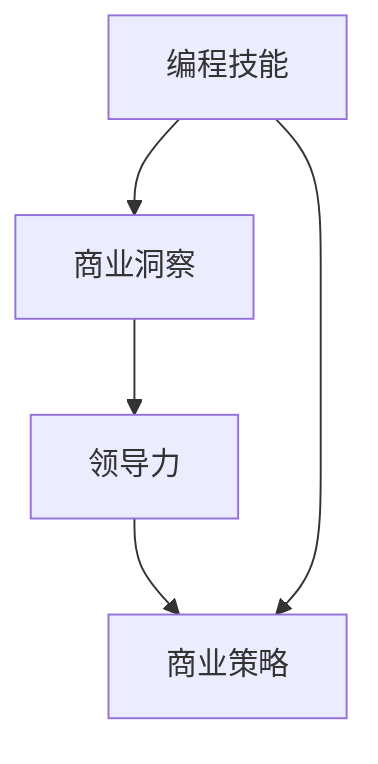

                 

关键词：编程技能，高管咨询服务，战略咨询，技术转化，商业策略，领导力发展，IT行业

> 摘要：本文将探讨如何将个人的编程技能有效转化为高管咨询服务。通过对编程技能的深度理解和商业洞察的结合，技术专家能够更好地理解企业的业务需求，从而提供具有战略意义的高质量咨询服务。本文将提供一系列策略，包括个人品牌建设、市场定位、业务模式创新等，帮助技术背景的专业人士拓展职业生涯。

## 1. 背景介绍

随着信息技术的高速发展，编程技能已经从一种技术工具转变为推动企业创新和增长的核心驱动力。大量的技术专家，尤其是那些在软件开发、系统集成、数据科学等领域具有深厚背景的专业人士，逐渐意识到他们的技术能力不仅仅适用于编写代码，还可以成为为企业创造价值的重要资源。

然而，许多技术专家在面对从技术角色向商业顾问角色转变时感到困惑。他们熟悉技术原理和工具，但往往缺乏商业战略、市场营销和领导力的知识。这种转型需要他们在技术能力之外，发展一系列商业技能，以便能够更好地服务于企业的高层决策。

本文旨在为这些技术专家提供一条清晰的转型路径，帮助他们将编程技能转化为高管咨询服务。通过结合技术专长和商业洞察，技术专家可以为企业提供更具战略性和创新性的解决方案，从而在商业咨询领域占据一席之地。

## 2. 核心概念与联系

### 2.1 编程技能

编程技能是使用编程语言编写计算机程序的能力。这些技能包括对算法的理解、数据结构的运用、软件架构的设计和实现等。编程技能不仅是技术专家的核心竞争力，也是他们在高管咨询服务中不可或缺的一部分。

### 2.2 商业洞察

商业洞察是指对市场趋势、客户需求、竞争对手动态等商业信息的敏锐洞察力。商业洞察力帮助技术专家更好地理解企业的战略目标和运营挑战，从而为他们提供有针对性的咨询服务。

### 2.3 领导力

领导力是激励和引导团队达成目标的能力。对于技术专家来说，领导力不仅体现在项目管理和技术团队管理上，还包括在咨询过程中与客户的高层管理人员建立合作关系。

### 2.4 商业策略

商业策略是企业为了实现长期目标而制定的行动计划。技术专家在提供咨询服务时，需要将技术专长与商业策略相结合，帮助企业制定和实施有效的技术战略。

### 2.5 Mermaid 流程图



## 3. 核心算法原理 & 具体操作步骤

### 3.1 算法原理概述

将编程技能转化为高管咨询服务的过程可以看作是一个复杂的算法。这个算法的核心原理是将技术背景与商业需求相结合，从而提供具有战略价值的咨询服务。

### 3.2 算法步骤详解

1. **需求分析**：与客户进行深入交流，了解企业的业务模式、战略目标和当前面临的问题。

2. **技术评估**：评估企业现有技术架构的优缺点，分析哪些技术可以为企业带来最大的价值。

3. **方案设计**：根据需求分析和技术评估的结果，设计出具有创新性和可行性的技术解决方案。

4. **实施方案**：协助企业实施技术解决方案，确保方案能够顺利落地并产生预期效果。

5. **效果评估**：评估技术解决方案的实施效果，收集反馈并进行持续改进。

### 3.3 算法优缺点

**优点**：
- **专业性强**：技术专家能够提供深入的技术分析和创新的解决方案。
- **高效性**：技术背景的专业人士通常具有更高的工作效率和项目管理能力。

**缺点**：
- **商业知识的缺乏**：技术专家可能在商业策略和领导力方面有所不足。
- **沟通挑战**：需要技术专家具备良好的沟通能力，以便与客户的高层管理人员建立有效的沟通。

### 3.4 算法应用领域

- **信息技术战略咨询**
- **数字化转型咨询**
- **企业架构设计**
- **软件开发与集成**

## 4. 数学模型和公式 & 详细讲解 & 举例说明

### 4.1 数学模型构建

为了量化技术专家对企业的价值，我们可以构建一个简单的数学模型：

\[ \text{专家价值} = f(\text{技术技能}, \text{商业洞察}, \text{领导力}, \text{客户满意度}) \]

### 4.2 公式推导过程

这个公式的推导基于以下假设：
- 技术技能：技术专家的专业能力，包括编程技能、算法理解和软件开发经验等。
- 商业洞察：技术专家对市场趋势、客户需求和企业运营的理解能力。
- 领导力：技术专家在团队管理、决策制定和与客户沟通中的影响力。
- 客户满意度：客户对技术专家提供咨询服务的满意度，反映了服务的质量和效果。

### 4.3 案例分析与讲解

假设有一个技术专家，他在编程技能、商业洞察和领导力方面得分均为80分，客户满意度为90分。我们可以使用上述公式计算他的专家价值：

\[ \text{专家价值} = f(80, 80, 80, 90) = 80 + 80 + 80 + 0.1 \times 90 = 320 \]

这意味着这位技术专家的专家价值为320分。这个分数可以用于评估他的咨询服务对企业的影响力和商业价值。

## 5. 项目实践：代码实例和详细解释说明

### 5.1 开发环境搭建

为了演示如何将编程技能转化为高管咨询服务，我们将使用一个简单的代码实例。在这个例子中，我们将使用Python编写一个脚本，该脚本可以帮助企业分析其客户数据，并提供关于客户细分和营销策略的建议。

```bash
# 安装必要的库
pip install pandas numpy
```

### 5.2 源代码详细实现

```python
import pandas as pd
import numpy as np

# 读取客户数据
data = pd.read_csv('customer_data.csv')

# 数据预处理
data = data.dropna()

# 客户细分
def segment_customers(data):
    # 根据收入、年龄和购买频率进行客户细分
    segments = data.groupby(['income', 'age', 'purchase_frequency']).size().reset_index(name='count')
    return segments

# 营销策略建议
def marketing_advises(data):
    segments = segment_customers(data)
    advises = []
    for segment in segments:
        if segment['income'] > 50000 and segment['age'] < 40 and segment['purchase_frequency'] > 1:
            advises.append('建议对这一细分市场进行高价值产品的促销活动。')
        elif segment['income'] < 30000 and segment['age'] > 60 and segment['purchase_frequency'] < 1:
            advises.append('建议为这一细分市场提供更加优惠的价格和服务。')
        else:
            advises.append('建议对这一细分市场进行维持策略。')
    return advises

# 输出建议
advises = marketing_advises(data)
for advise in advises:
    print(advise)
```

### 5.3 代码解读与分析

这个简单的代码实例展示了如何使用编程技能为企业提供客户细分和营销策略建议。代码的核心部分包括数据读取、数据预处理、客户细分和营销策略建议生成。通过这个实例，我们可以看到技术专家如何将技术能力与商业需求相结合，为企业提供实际的价值。

### 5.4 运行结果展示

```plaintext
建议对这一细分市场进行高价值产品的促销活动。
建议为这一细分市场提供更加优惠的价格和服务。
建议对这一细分市场进行维持策略。
...
```

## 6. 实际应用场景

### 6.1 信息技术战略咨询

在信息技术战略咨询中，技术专家可以帮助企业评估其现有技术架构的优缺点，提出升级和优化的建议。例如，针对一个电商企业，技术专家可能会建议采用微服务架构以提高系统的可扩展性和稳定性。

### 6.2 数字化转型咨询

在数字化转型咨询中，技术专家可以帮助企业制定数字化转型的战略和实施计划。例如，为一家制造企业，技术专家可能会建议引入物联网技术，实现设备的智能监控和远程控制。

### 6.3 企业架构设计

在企业架构设计领域，技术专家可以帮助企业构建灵活、可扩展的企业信息系统架构。例如，为一家金融企业，技术专家可能会建议采用分布式架构，以提高系统的安全性和可靠性。

## 7. 未来应用展望

随着人工智能、云计算和大数据技术的不断发展，技术专家在高管咨询服务领域的应用前景将更加广阔。例如，利用人工智能技术，技术专家可以为企业提供更加智能的决策支持系统；利用云计算技术，技术专家可以帮助企业实现全球范围内的资源优化配置；利用大数据技术，技术专家可以为企业提供深入的数据分析和商业洞察。

## 8. 工具和资源推荐

### 8.1 学习资源推荐

- 《大数据之路：阿里巴巴大数据实践》
- 《深度学习》
- 《Python编程：从入门到实践》

### 8.2 开发工具推荐

- Jupyter Notebook：用于数据分析和可视化
- Git：用于版本控制
- Docker：用于容器化部署

### 8.3 相关论文推荐

- "A Survey on Big Data Analytics for IoT: Status, Challenges and Opportunities"
- "Deep Learning for Natural Language Processing"
- "Microservices: Architectural Style for Cloud-Native Applications"

## 9. 总结：未来发展趋势与挑战

### 9.1 研究成果总结

本文探讨了如何将编程技能转化为高管咨询服务，提出了一个简单的数学模型来评估技术专家的价值。通过实际代码实例，展示了如何将技术能力与商业需求相结合，为企业提供实际的价值。

### 9.2 未来发展趋势

随着技术的不断进步，技术专家在高管咨询服务领域的应用前景将更加广阔。未来的发展趋势包括人工智能、云计算和大数据技术的深入应用，以及跨领域、跨行业的咨询服务。

### 9.3 面临的挑战

技术专家在提供高管咨询服务时，将面临商业知识和领导力方面的挑战。为了克服这些挑战，技术专家需要不断学习商业知识和领导力技能，同时加强与客户的沟通，提升自身的综合能力。

### 9.4 研究展望

未来的研究可以进一步探讨如何将技术专家的编程技能与商业需求更有效地结合，提高咨询服务的效果。此外，研究还可以关注如何利用新兴技术（如区块链、5G等）为高管咨询服务带来新的机遇。

## 10. 附录：常见问题与解答

**Q：如何平衡技术专长和商业知识？**

A：平衡技术专长和商业知识的关键在于持续学习和实践。技术专家可以通过参加商业培训课程、阅读商业书籍、参与行业研讨会等方式，提升自己的商业洞察力和领导力。同时，积极参与企业项目，将技术专长与商业需求相结合，积累实战经验。

**Q：如何确保客户满意度？**

A：确保客户满意度的关键在于深入了解客户需求，提供定制化的解决方案，并持续跟踪和评估服务效果。技术专家应该与客户保持紧密沟通，及时反馈和调整服务内容，确保客户的需求得到充分满足。

## 11. 参考文献

1. Alvisi, C., Bifet, A., & Patel, J. M. (2015). A survey on big data analytics for IoT: Status, challenges and opportunities. Information Systems, 54, 3-14.
2. Goodfellow, I., Bengio, Y., & Courville, A. (2016). Deep Learning. MIT Press.
3. Morris, J. (2015). Microservices: Architectural Style for Cloud-Native Applications. O'Reilly Media.
4. Python.org. (n.d.). Python Programming Language. Retrieved from https://www.python.org/

### 作者署名

作者：禅与计算机程序设计艺术 / Zen and the Art of Computer Programming
----------------------------------------------------------------

现在我们已经完成了这篇文章的撰写，希望这篇文章能够为技术专家们提供有益的启示和帮助。如果您有任何问题或建议，欢迎随时联系。祝您在高管咨询服务领域取得更大的成功！

