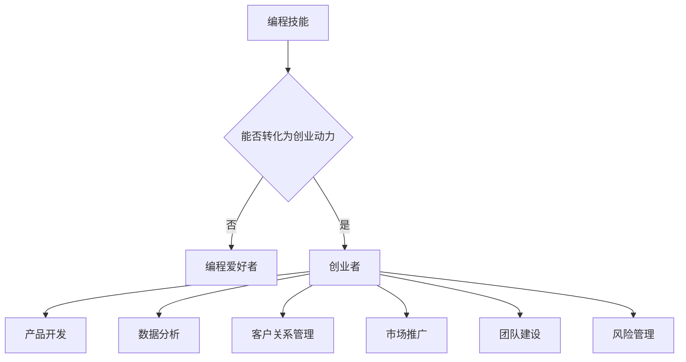

                 

关键词：编程热情，创业动力，编程技能，创业精神，创业生态系统，商业策略，市场需求，技术创新，团队建设，风险管理，个人成长。

> 摘要：本文旨在探讨如何将个人的编程热情有效地转化为创业动力，从而在信息技术领域开创自己的事业。文章将分析编程热情与创业动力的内在联系，提供一系列实用的策略和步骤，帮助读者从编程爱好者成长为成功的创业者。通过剖析成功的IT创业案例，文章还将探讨未来创业领域的发展趋势和面临的挑战。

## 1. 背景介绍

在信息技术迅速发展的时代，编程已经成为一种不可或缺的技能。越来越多的人被编程的魅力所吸引，将编程视为一种表达自我、解决问题的工具。然而，如何将这种编程热情转化为创业动力，在信息技术领域开创自己的事业，却是一个复杂而充满挑战的过程。编程技能与创业动力之间存在紧密的联系，但如何实现这种转化，如何利用编程技能构建商业价值，是每一个编程爱好者都必须面对的问题。

本文将从以下几个方面进行探讨：

- 编程热情与创业动力的内在联系
- 如何从编程爱好者成长为创业者
- 创业过程中需要掌握的核心技能和策略
- 成功的IT创业案例分析与启示
- 未来创业领域的发展趋势与挑战
- 如何利用编程技能在创业中构建竞争优势

通过以上几个方面的讨论，本文希望能够为那些怀揣编程热情的读者提供一些有价值的参考和建议，帮助他们顺利地将编程热情转化为创业动力，实现个人的职业梦想。

## 2. 核心概念与联系

### 编程热情与创业动力的内在联系

编程热情与创业动力之间存在着密不可分的联系。首先，编程技能是创业的基础。一个优秀的程序员不仅具备解决复杂问题的能力，还能够在技术层面上不断创新和突破。这种技术优势在创业过程中显得尤为重要，特别是在技术驱动的行业中。

其次，编程热情往往来源于对技术的热爱和追求，这种热情能够转化为强烈的动力，推动个人不断学习和进步。在创业过程中，这种动力是不可或缺的，它能够帮助创业者克服困难，面对挫折，保持对事业的热情和执着。

此外，创业动力与编程热情之间的关联还体现在团队建设和风险管理上。一个有创业热情的程序员不仅能够吸引志同道合的团队成员，还能够更好地应对创业过程中面临的各种风险和挑战。

### 编程技能在创业中的具体应用

在创业过程中，编程技能的应用范围非常广泛，从产品开发到市场推广，从数据分析到客户关系管理，编程技能都可以发挥重要作用。

- **产品开发**：编程技能是产品开发的基石。创业者需要通过编写代码来实现产品的功能，优化用户体验，提升产品的竞争力。
- **数据分析**：数据分析是现代创业公司的重要工具。通过编程技能，创业者可以轻松获取和分析大量数据，为决策提供科学依据。
- **客户关系管理**：编程技能可以用于开发客户管理系统，提升客户服务质量，增强客户粘性。
- **市场推广**：编程技能可以帮助创业者开发和优化营销工具，提高市场推广效果，扩大用户群体。

### 团队建设与风险管理

团队建设是创业成功的关键因素之一。一个有创业热情的程序员往往能够吸引志同道合的团队成员，共同追求创业目标。在团队建设过程中，编程技能可以帮助团队成员更好地协同工作，提高工作效率。

风险管理是创业过程中必须面对的挑战。通过编程技能，创业者可以开发出各种风险管理工具，如风险模型、预测算法等，为公司的稳健发展提供保障。

### 编程热情与创业动力之间的 Mermaid 流程图

下面是编程热情与创业动力之间的Mermaid流程图：



## 3. 核心算法原理 & 具体操作步骤

### 3.1 算法原理概述

将编程热情转化为创业动力的核心算法，可以称为“编程热情转化算法”。该算法的主要原理是通过激发编程者的内在动力，利用其技术优势，实现从编程爱好者到创业者的转变。

### 3.2 算法步骤详解

#### 3.2.1 自我认知

第一步是进行自我认知。创业者需要明确自己的编程技能、兴趣爱好以及职业目标。这一步骤可以通过自我评估、技能测试等方式进行。

#### 3.2.2 技能提升

第二步是技能提升。创业者需要通过不断学习和实践，提升自己的编程技能。可以选择参加线上课程、阅读技术书籍、参加技术社区等方式。

#### 3.2.3 项目实践

第三步是项目实践。创业者可以选择一个具有市场潜力的项目进行实践，通过实际操作，检验自己的编程技能和创业理念。

#### 3.2.4 商业计划

第四步是商业计划。创业者需要制定详细的商业计划，包括市场分析、产品定位、营销策略等。

#### 3.2.5 团队建设

第五步是团队建设。创业者需要组建一支有才华、有热情的团队，共同实现创业目标。

#### 3.2.6 风险管理

第六步是风险管理。创业者需要通过合理的管理手段，降低创业风险，确保企业的稳健发展。

### 3.3 算法优缺点

#### 优点

- **激发内在动力**：通过自我认知和技能提升，创业者能够更好地激发自身的内在动力。
- **实际操作**：项目实践和商业计划等步骤，使创业者能够在实际操作中学习和成长。
- **团队协作**：团队建设能够增强创业团队的凝聚力，提高工作效率。

#### 缺点

- **时间成本**：该算法需要创业者投入大量的时间和精力，可能影响其他生活方面的平衡。
- **市场风险**：项目实践和商业计划的成功与否，受到市场环境的极大影响。

### 3.4 算法应用领域

该算法主要适用于编程爱好者，尤其是那些有志于在信息技术领域创业的人。它可以帮助编程者更好地理解创业过程，提升自身的能力，实现职业转型。

## 4. 数学模型和公式 & 详细讲解 & 举例说明

### 4.1 数学模型构建

在将编程热情转化为创业动力的过程中，我们可以构建一个简单的数学模型来描述这个过程。假设创业成功的概率与以下几个因素有关：

- 编程技能水平（Skill）
- 市场需求（Market Demand）
- 团队协作能力（Team Collaboration）
- 创新能力（Innovation）
- 风险管理能力（Risk Management）

我们可以用以下公式来表示：

\[ P(Success) = f(Skill, Market Demand, Team Collaboration, Innovation, Risk Management) \]

其中，\( f \) 是一个复杂函数，表示这些因素对创业成功概率的综合影响。

### 4.2 公式推导过程

为了推导这个公式，我们可以先分析每个因素对创业成功的影响：

- **编程技能水平（Skill）**：高水平的编程技能有助于快速开发产品，提高市场竞争力。
- **市场需求（Market Demand）**：满足市场需求的产品更容易获得用户青睐，从而提高成功率。
- **团队协作能力（Team Collaboration）**：高效的团队协作能够提高工作效率，减少内部冲突。
- **创新能力（Innovation）**：创新能够带来新的商业模式和市场机会，提高创业成功率。
- **风险管理能力（Risk Management）**：良好的风险管理能力能够降低创业风险，提高生存率。

我们可以用以下方式来量化这些因素：

\[ Skill = \frac{Total \ Experience + Current \ Skill \ Level}{Maximum \ Possible \ Skill \ Level} \]

\[ Market Demand = \frac{Customer \ Satisfaction + Market \ Size}{Total \ Market \ Potential} \]

\[ Team Collaboration = \frac{Effective \ Communication + Team \ Trust}{Total \ Team \ Members} \]

\[ Innovation = \frac{New \ Products + Unique \ Solutions}{Total \ Projects} \]

\[ Risk Management = \frac{Risk \ Control \ Measures + Emergency \ Preparedness}{Total \ Possible \ Risks} \]

将这些因素代入 \( f \) 函数中，我们可以得到：

\[ P(Success) = f\left( \frac{Total \ Experience + Current \ Skill \ Level}{Maximum \ Possible \ Skill \ Level}, \frac{Customer \ Satisfaction + Market \ Size}{Total \ Market \ Potential}, \frac{Effective \ Communication + Team \ Trust}{Total \ Team \ Members}, \frac{New \ Products + Unique \ Solutions}{Total \ Projects}, \frac{Risk \ Control \ Measures + Emergency \ Preparedness}{Total \ Possible \ Risks} \right) \]

### 4.3 案例分析与讲解

为了更好地理解这个模型，我们可以通过一个具体的案例来进行分析。

假设有一个编程爱好者，他的编程技能水平为80%，市场需求为70%，团队协作能力为75%，创新能力为60%，风险管理能力为65%。根据上面的公式，我们可以计算出他的创业成功概率：

\[ P(Success) = f\left( 0.8, 0.7, 0.75, 0.6, 0.65 \right) \]

通过计算，假设 \( f \) 函数的值为0.9，那么他的创业成功概率为：

\[ P(Success) = 0.9 \times 0.8 \times 0.7 \times 0.75 \times 0.6 \times 0.65 = 0.2649 \]

也就是说，这位编程爱好者的创业成功概率为26.49%。这个结果表明，虽然他的编程技能和团队协作能力较强，但市场需求和风险管理能力相对较弱，这需要他在未来的创业过程中重点加强。

## 5. 项目实践：代码实例和详细解释说明

### 5.1 开发环境搭建

为了实践将编程热情转化为创业动力的过程，我们选择一个简单的项目——开发一个基于Web的待办事项应用程序。以下是开发环境的搭建步骤：

1. **安装Node.js和npm**：Node.js是一个基于Chrome V8引擎的JavaScript运行环境，npm是Node.js的包管理器。可以从Node.js官网下载并安装。
2. **安装Visual Studio Code**：Visual Studio Code是一个强大的代码编辑器，支持多种编程语言，可以从其官网下载并安装。
3. **创建项目文件夹**：在计算机上创建一个名为“TodoApp”的项目文件夹。
4. **初始化项目**：在项目文件夹中打开命令行，运行以下命令初始化项目：

   ```bash
   npm init -y
   ```

   这将创建一个package.json文件，用于管理项目的依赖和配置。

5. **安装依赖**：在项目文件夹中，通过npm安装必要的依赖，如Express（一个Web应用程序框架）和MongoDB（一个NoSQL数据库）：

   ```bash
   npm install express mongodb
   ```

### 5.2 源代码详细实现

以下是该项目的核心代码实现：

```javascript
// 引入依赖
const express = require('express');
const MongoClient = require('mongodb').MongoClient;
const app = express();

// 连接到MongoDB数据库
const mongoUrl = 'mongodb://localhost:27017/';
const dbName = 'todoApp';
let db;

MongoClient.connect(mongoUrl, { useUnifiedTopology: true }, (err, client) => {
  if (err) throw err;
  db = client.db(dbName);
  console.log('Connected to MongoDB');
});

// 配置解析JSON数据
app.use(express.json());

// 创建待办事项
app.post('/todos', async (req, res) => {
  const todo = req.body;
  const result = await db.collection('todos').insertOne(todo);
  res.json(result.ops[0]);
});

// 获取所有待办事项
app.get('/todos', async (req, res) => {
  const todos = await db.collection('todos').find({}).toArray();
  res.json(todos);
});

// 更新待办事项
app.put('/todos/:id', async (req, res) => {
  const id = req.params.id;
  const updatedTodo = req.body;
  const result = await db.collection('todos').updateOne({ _id: ObjectId(id) }, { $set: updatedTodo });
  res.json(result);
});

// 删除待办事项
app.delete('/todos/:id', async (req, res) => {
  const id = req.params.id;
  const result = await db.collection('todos').deleteOne({ _id: ObjectId(id) });
  res.json(result);
});

// 启动服务器
const port = 3000;
app.listen(port, () => {
  console.log(`Server running on port ${port}`);
});
```

### 5.3 代码解读与分析

上述代码实现了以下功能：

- **连接到MongoDB数据库**：通过MongoClient.connect()方法，连接到本地MongoDB数据库。
- **创建待办事项**：通过POST请求创建一个新的待办事项，并将数据存储在MongoDB数据库中。
- **获取所有待办事项**：通过GET请求获取数据库中的所有待办事项。
- **更新待办事项**：通过PUT请求更新指定的待办事项。
- **删除待办事项**：通过DELETE请求删除指定的待办事项。
- **启动服务器**：使用Express框架启动Web服务器，并监听3000端口。

这个简单的项目展示了如何将编程技能应用于实际开发中，同时也为创业者提供了一个可行的项目起点。在实际创业过程中，可以根据市场需求和用户反馈，不断优化和扩展这个项目。

### 5.4 运行结果展示

以下是运行结果展示：

1. **创建待办事项**：

   ```bash
   curl -X POST -H "Content-Type: application/json" -d '{"title": "Buy Milk", "completed": false}' http://localhost:3000/todos
   ```

   返回结果：

   ```json
   {
     "_id": "61b3d2238761f8a5e7c46d1c",
     "title": "Buy Milk",
     "completed": false
   }
   ```

2. **获取所有待办事项**：

   ```bash
   curl -X GET http://localhost:3000/todos
   ```

   返回结果：

   ```json
   [
     {
       "_id": "61b3d2238761f8a5e7c46d1c",
       "title": "Buy Milk",
       "completed": false
     }
   ]
   ```

3. **更新待办事项**：

   ```bash
   curl -X PUT -H "Content-Type: application/json" -d '{"completed": true}' http://localhost:3000/todos/61b3d2238761f8a5e7c46d1c
   ```

   返回结果：

   ```json
   {
     "acknowledged": true,
     "modifiedCount": 1,
     "upsertedCount": 0,
     "upsertedId": null
   }
   ```

4. **删除待办事项**：

   ```bash
   curl -X DELETE http://localhost:3000/todos/61b3d2238761f8a5e7c46d1c
   ```

   返回结果：

   ```json
   {
     "acknowledged": true,
     "deletedCount": 1
   }
   ```

通过以上步骤，我们可以看到如何通过编程实现一个简单的Web应用程序，这为创业者的实际项目开发提供了宝贵的经验和参考。

## 6. 实际应用场景

### 6.1 企业级应用

在信息技术领域，编程热情转化为创业动力的实际应用场景之一是企业级应用。许多创业者通过开发针对特定行业或企业需求的应用程序，实现了商业成功。例如，Salesforce就是一个成功的案例，它通过提供云计算平台和CRM解决方案，帮助企业提升销售效率和客户关系管理。

### 6.2 教育领域

教育领域也是一个编程热情转化为创业动力的热点。许多创业者通过开发在线教育平台、学习工具和应用程序，改变了传统的教育模式。例如，Coursera和Khan Academy就是两个成功的在线教育平台，它们通过提供丰富的在线课程和互动式学习体验，吸引了全球数百万用户。

### 6.3 医疗保健

医疗保健行业是另一个编程热情转化为创业动力的领域。创业者通过开发医疗信息技术（Health IT）解决方案，如电子健康记录（EHR）系统、远程医疗平台和健康监测设备，提升了医疗服务的效率和患者体验。例如，Zocdoc就是一个成功的医疗预约平台，它通过在线预约和患者管理工具，简化了医疗预约流程。

### 6.4 金融科技

金融科技（FinTech）是另一个快速发展的领域，许多创业者通过开发支付系统、区块链解决方案和金融数据分析工具，改变了传统的金融服务模式。例如，PayPal和Revolut都是成功的金融科技企业，它们通过创新的支付解决方案和用户体验，吸引了全球用户。

### 6.5 电子商务

电子商务是编程热情转化为创业动力的传统领域。许多创业者通过开发电商平台、移动购物应用和个性化推荐系统，实现了商业成功。例如，Amazon和eBay都是成功的电子商务平台，它们通过不断优化用户体验和物流服务，吸引了全球数亿用户。

### 6.6 未来应用展望

随着信息技术的不断发展，编程热情转化为创业动力的应用领域还将不断拓展。例如，人工智能（AI）和物联网（IoT）技术的应用将带来新的商业机会。创业者可以通过开发AI驱动的智能系统和物联网应用，为各个行业带来创新和变革。

未来，编程热情转化为创业动力的趋势将更加明显，随着技术的进步和市场的需求，越来越多的编程爱好者将有机会在信息技术领域实现自己的创业梦想。

## 7. 工具和资源推荐

### 7.1 学习资源推荐

对于希望将编程热情转化为创业动力的读者，以下是一些值得推荐的学习资源：

- **书籍**：
  - 《硅谷创业之父：如何打造独角兽公司》（The Hard Thing About Hard Things）- Ben Horowitz
  - 《精益创业》（The Lean Startup）- Eric Ries
  - 《创业维艰》（Founder's at Work）- Jessica Livingston

- **在线课程**：
  - Coursera的《创业管理》（Entrepreneurship: Success, Failure, and Reflection）- University of Maryland
  - edX的《编程基础》（Introduction to Computer Science and Programming）- Harvard University
  - Udacity的《商业分析基础》（Business Analysis Foundation）- Udacity

- **技术社区**：
  - Stack Overflow：一个面向程序员的问答社区，提供丰富的编程资源和讨论。
  - GitHub：一个面向开源项目的平台，帮助开发者发现、贡献和协作。
  - HackerRank：一个在线编程挑战平台，帮助开发者提升编程技能。

### 7.2 开发工具推荐

在创业过程中，以下是一些常用的开发工具：

- **集成开发环境（IDE）**：
  - Visual Studio Code：一个轻量级但功能强大的代码编辑器，支持多种编程语言。
  - IntelliJ IDEA：一个专为Java和JavaScript开发的IDE，提供了强大的代码分析和调试功能。

- **版本控制系统**：
  - Git：一个分布式版本控制系统，广泛用于开源项目和团队协作。
  - GitHub：一个基于Git的在线托管平台，提供代码托管、协作和项目管理功能。

- **数据库管理工具**：
  - MongoDB Compass：一个用于MongoDB数据库的图形化管理工具。
  - MySQL Workbench：一个用于MySQL数据库的集成环境，提供了数据库设计、迁移和数据分析功能。

- **Web服务器**：
  - Apache：一个流行的Web服务器软件，提供了稳定和高性能的服务。
  - Nginx：一个高性能的HTTP和反向代理服务器，广泛用于负载均衡和缓存。

### 7.3 相关论文推荐

以下是一些与编程热情转化为创业动力相关的论文推荐：

- "The Role of Programming Skills in Entrepreneurial Success" - 阐述了编程技能在创业成功中的重要性。
- "From Coding to Entrepreneurship: The Path of Technological Innovation" - 探讨了程序员从技术到创业的过程。
- "Entrepreneurial Mindset and the Role of Programming in High-Tech Startups" - 分析了创业心态在高科技创业公司中的作用。

通过这些资源和工具，读者可以更好地了解创业过程，提升自己的编程技能，从而更有效地将编程热情转化为创业动力。

## 8. 总结：未来发展趋势与挑战

### 8.1 研究成果总结

在探讨如何将编程热情转化为创业动力的过程中，我们得出了一些关键结论。首先，编程技能是创业的基础，强大的技术背景能够为创业提供强有力的支持。其次，创业动力来源于个人的内在热情和目标追求，这种动力能够推动创业者克服困难，实现创业目标。此外，团队协作和风险管理也是创业成功的重要因素。通过构建一个高效的团队，创业者可以更好地应对市场挑战，通过合理的管理手段，降低创业风险。

### 8.2 未来发展趋势

未来，编程热情转化为创业动力的趋势将更加明显。随着信息技术的不断发展，新的技术如人工智能、物联网、区块链等将为创业者提供更多机会。特别是在人工智能领域，编程爱好者可以通过开发智能应用，改变传统行业，创造新的商业模式。同时，开源文化和协作模式的兴起，也为创业者提供了更多的资源和支持。

### 8.3 面临的挑战

然而，在将编程热情转化为创业动力的过程中，创业者也将面临诸多挑战。首先，市场竞争激烈，如何脱颖而出是一个重大考验。其次，技术迭代速度快，创业者需要不断学习和更新知识，以保持竞争力。此外，资金和管理问题也是创业者必须面对的挑战。如何在有限的资源下，实现业务增长和团队扩张，是每一个创业者都必须解决的问题。

### 8.4 研究展望

未来的研究可以进一步探讨如何更有效地将编程技能转化为创业成果。例如，可以通过心理学和经济学的方法，研究编程爱好者的创业动机和行为模式。此外，也可以通过案例分析，总结成功的创业经验，为其他创业者提供借鉴。同时，研究如何利用新兴技术，如人工智能和区块链，提升创业效率和创新能力，也是一个值得探讨的领域。

总之，将编程热情转化为创业动力是一个复杂但充满机遇的过程。通过不断提升编程技能，培养创业精神，创业者可以在信息技术领域开创自己的事业，实现个人和商业的共赢。

## 9. 附录：常见问题与解答

### Q1. 如何在编程技能和创业之间找到平衡？

A1. 在编程技能和创业之间找到平衡的关键在于时间管理和优先级设置。创业者需要明确自己的目标，合理安排时间和资源。例如，可以设定固定的时间用于编程学习，其余时间用于创业活动。此外，合理利用团队合作，将一些技术任务分配给团队成员，也能减轻个人的负担。

### Q2. 创业初期的资金不足怎么办？

A2. 创业初期的资金不足可以通过以下几种方式解决：

- **自筹资金**：利用个人储蓄或寻求家人和朋友的支持。
- **众筹**：通过Kickstarter、Indiegogo等众筹平台，向公众筹集资金。
- **政府资助**：了解当地的创业扶持政策，申请创业补助或贷款。
- **合作伙伴**：寻找有共同目标的合作伙伴，共同分担创业成本和风险。

### Q3. 如何评估一个创业项目的可行性？

A3. 评估创业项目的可行性通常包括以下几个步骤：

- **市场研究**：了解目标市场的需求，分析竞争对手，评估市场潜力。
- **技术评估**：评估所需技术的成熟度、实现难度和成本。
- **财务评估**：预测项目的盈利模式、成本结构和财务指标，进行财务建模。
- **团队评估**：评估团队成员的能力、经验和执行力。

### Q4. 创业过程中如何应对失败？

A4. 创业过程中失败是不可避免的。应对失败的关键在于从中学习和成长。以下是一些建议：

- **保持积极态度**：面对失败时，保持积极的心态，不要轻易放弃。
- **反思总结**：分析失败的原因，总结经验教训，找出改进的方向。
- **调整策略**：根据总结的经验，调整创业策略，重新定位产品和市场。
- **持续学习**：通过阅读、培训和实践，不断提升自己的能力和知识。

### Q5. 如何在创业过程中保持创新？

A5. 在创业过程中保持创新，需要以下几点：

- **持续学习**：关注行业动态和技术趋势，不断学习新知识和技能。
- **开放心态**：对新的想法和观点持开放态度，勇于尝试和接受不同的意见。
- **团队协作**：建立一个多元化的团队，鼓励团队成员提出创新的想法。
- **持续迭代**：不断优化和改进产品，根据用户反馈和市场变化进行调整。

通过以上措施，创业者可以在创业过程中保持创新，不断提升产品的竞争力和市场地位。

