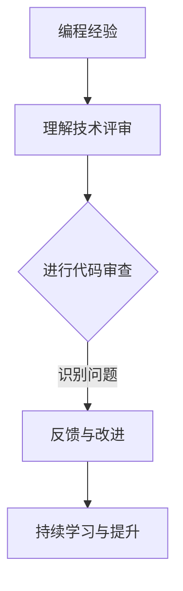

                 

在科技高速发展的今天，编程已经成为了IT行业不可或缺的核心技能。然而，编程经验的积累并不仅仅局限于写代码本身，它还能转化为多种形式的价值输出。本文旨在探讨如何将编程经验有效地转化为技术评审服务，帮助读者在技术评审领域取得更大的成就。

## 文章关键词

- 编程经验
- 技术评审
- 代码审查
- 软件质量
- 团队协作

## 文章摘要

本文首先介绍了编程经验的重要性，随后详细阐述了技术评审的定义和作用。接下来，我们将探讨如何将编程经验应用于技术评审中，并通过具体案例和实践经验，提供实用的方法和技巧。最后，文章将总结技术评审的未来发展趋势和面临的挑战，为读者提供进一步的学习和思考方向。

### 1. 背景介绍

随着软件项目规模的不断扩大和复杂性的增加，技术评审（Technical Review）作为一种重要的软件质量保证手段，受到了越来越多的重视。技术评审不仅仅是对代码的审查，它更是一种团队协作和知识共享的过程。

编程经验在这个过程中起着至关重要的作用。一个优秀的程序员，不仅能够写出高质量的代码，还能对代码进行深入的分析和理解。这种能力在技术评审中尤为重要。编程经验可以帮助评审者快速识别潜在的问题，评估代码的可维护性和扩展性，从而提高软件项目的整体质量。

### 2. 核心概念与联系

为了更好地理解如何将编程经验转化为技术评审服务，我们首先需要了解一些核心概念，包括代码审查、代码风格、设计模式等。

#### 2.1 代码审查

代码审查（Code Review）是一种通过同行评审来提高代码质量的方法。它不仅可以帮助识别代码中的错误和缺陷，还能促进团队成员之间的知识共享和协作。在代码审查过程中，评审者需要关注代码的语法、结构、逻辑和性能等方面。

#### 2.2 代码风格

代码风格是指编写代码时遵循的一系列规范和习惯。良好的代码风格可以提高代码的可读性和可维护性，减少潜在的错误和误解。在技术评审中，评审者需要关注代码的命名、注释、代码组织等方面是否符合既定的代码风格指南。

#### 2.3 设计模式

设计模式是一套经过验证的解决常见软件设计问题的方案。它们可以帮助提高代码的模块化、复用性和可维护性。在技术评审中，评审者需要关注代码中是否合理运用了设计模式，以及这些模式的应用是否恰当。

#### 2.4 核心概念原理与架构的 Mermaid 流程图

以下是一个简化的 Mermaid 流程图，展示了编程经验转化为技术评审服务的基本流程：



### 3. 核心算法原理 & 具体操作步骤

#### 3.1 算法原理概述

技术评审的核心算法可以概括为以下几个步骤：

1. **理解需求**：在开始评审之前，评审者需要全面了解软件项目的需求和技术文档。
2. **代码审查**：评审者按照预定的标准和流程对代码进行逐行审查。
3. **识别问题**：评审者需要关注代码中的潜在问题，如语法错误、逻辑错误、性能问题等。
4. **反馈与改进**：评审者需要及时向开发者反馈问题，并协助开发者进行改进。

#### 3.2 算法步骤详解

以下是技术评审的具体步骤：

1. **准备评审**：
   - 确定评审目标：明确评审的重点和目标，如代码质量、安全性、性能等。
   - 准备评审工具：使用如GitHub、GitLab等代码托管平台，以及如SonarQube等代码质量分析工具。

2. **代码审查**：
   - 逐行阅读代码：评审者需要逐行阅读代码，理解代码的功能和逻辑。
   - 关注代码质量：评审者需要关注代码的语法、结构、逻辑和性能等方面。
   - 使用静态代码分析工具：利用静态代码分析工具，如SonarQube，对代码进行自动检查。

3. **识别问题**：
   - 语法错误：检查代码中的语法错误，如拼写错误、语法不合法等。
   - 逻辑错误：检查代码的逻辑是否正确，是否存在逻辑漏洞。
   - 性能问题：检查代码的性能是否优化，是否存在潜在的瓶颈。

4. **反馈与改进**：
   - 及时反馈问题：评审者需要及时向开发者反馈问题，并提供具体的修改建议。
   - 协助改进：评审者可以协助开发者解决问题，提供技术支持。

#### 3.3 算法优缺点

技术评审算法的优点包括：

- 提高代码质量：通过代码审查，可以及时发现并修复代码中的问题，提高软件项目的整体质量。
- 促进知识共享：评审过程促进了团队成员之间的知识共享和交流，提高了团队的整体技术水平。

然而，技术评审也存在一些缺点，如：

- 审查时间较长：代码审查需要大量时间，可能会影响开发进度。
- 人力成本较高：代码审查需要专业的评审人员，增加了人力成本。

#### 3.4 算法应用领域

技术评审算法广泛应用于以下领域：

- 软件开发：在软件开发过程中，技术评审是确保代码质量的重要手段。
- 软件维护：在软件维护过程中，技术评审可以帮助发现并修复潜在的问题，提高软件的可靠性。
- 软件安全：技术评审可以识别代码中的安全漏洞，提高软件的安全性。

### 4. 数学模型和公式 & 详细讲解 & 举例说明

技术评审中，数学模型和公式可以用来量化代码质量和评估评审效果。以下是一个简单的数学模型：

$$
Q = f(P, M, R)
$$

其中：

- $Q$ 表示代码质量。
- $P$ 表示代码的语法、结构、逻辑和性能。
- $M$ 表示代码的可维护性和可扩展性。
- $R$ 表示评审者的专业水平和评审质量。

这个模型表明，代码质量是多个因素的函数，包括代码本身的属性和评审者的能力。

#### 4.1 数学模型构建

数学模型的构建过程如下：

1. **定义变量**：确定影响代码质量的各个因素，如语法、结构、逻辑、性能、可维护性和可扩展性。
2. **确定权重**：根据各个因素对代码质量的影响程度，为每个因素分配权重。
3. **构建公式**：将各个因素整合到一个公式中，形成一个综合评估代码质量的数学模型。

#### 4.2 公式推导过程

公式推导的过程如下：

1. **确定语法质量（P\_syntax）**：
   $$ P\_syntax = \sum_{i=1}^{n} w_i \cdot P_i $$
   其中，$w_i$ 表示第 $i$ 个语法元素的权重，$P_i$ 表示第 $i$ 个语法元素的得分。

2. **确定结构质量（P\_structure）**：
   $$ P\_structure = \sum_{i=1}^{m} w_i' \cdot P_i' $$
   其中，$w_i'$ 表示第 $i$ 个结构元素的权重，$P_i'$ 表示第 $i$ 个结构元素的得分。

3. **确定逻辑质量（P\_logic）**：
   $$ P\_logic = \sum_{i=1}^{k} w_i'' \cdot P_i'' $$
   其中，$w_i''$ 表示第 $i$ 个逻辑元素的权重，$P_i''$ 表示第 $i$ 个逻辑元素的得分。

4. **确定性能质量（P\_performance）**：
   $$ P\_performance = \sum_{i=1}^{l} w_i''' \cdot P_i''' $$
   其中，$w_i'''$ 表示第 $i$ 个性能元素的权重，$P_i'''$ 表示第 $i$ 个性能元素的得分。

5. **计算总质量（P\_total）**：
   $$ P\_total = P\_syntax + P\_structure + P\_logic + P\_performance $$

6. **确定可维护性和可扩展性质量（M\_maintainability, M\_extensibility）**：
   $$ M = w\_maintainability \cdot M\_maintainability + w\_extensibility \cdot M\_extensibility $$

7. **计算代码质量（Q）**：
   $$ Q = f(P, M, R) = P\_total \cdot M + R $$

其中，$R$ 表示评审者的专业水平和评审质量。

#### 4.3 案例分析与讲解

以下是一个简单的案例分析：

假设有一个代码片段，我们需要评估其质量。根据上述数学模型，我们可以进行以下步骤：

1. **确定权重**：
   - 语法：0.3
   - 结构：0.3
   - 逻辑：0.3
   - 性能：0.1
   - 可维护性：0.1
   - 可扩展性：0.1

2. **评估代码质量**：
   - 语法质量：9/10
   - 结构质量：8/10
   - 逻辑质量：7/10
   - 性能质量：9/10
   - 可维护性：8/10
   - 可扩展性：7/10

3. **计算代码质量**：
   $$ P\_total = 0.3 \cdot 9 + 0.3 \cdot 8 + 0.3 \cdot 7 + 0.1 \cdot 9 + 0.1 \cdot 8 + 0.1 \cdot 7 = 8.3 $$
   $$ M = 0.1 \cdot 8 + 0.1 \cdot 7 = 0.15 $$
   $$ Q = 8.3 \cdot 0.15 + R $$

其中，$R$ 是评审者的专业水平和评审质量的得分，我们假设为0.8。

4. **计算最终代码质量**：
   $$ Q = 8.3 \cdot 0.15 + 0.8 = 1.245 + 0.8 = 2.045 $$

这个得分表示代码质量相对较高，接近满分。

### 5. 项目实践：代码实例和详细解释说明

#### 5.1 开发环境搭建

在进行技术评审之前，我们需要搭建一个合适的开发环境。以下是一个简单的步骤：

1. 安装代码编辑器，如Visual Studio Code。
2. 安装Git，用于代码管理和版本控制。
3. 安装JDK，用于Java代码的编译和运行。
4. 安装Maven，用于项目的构建和管理。

#### 5.2 源代码详细实现

以下是一个简单的Java代码示例，用于演示技术评审的过程：

```java
public class HelloWorld {
    public static void main(String[] args) {
        System.out.println("Hello, World!");
    }
}
```

#### 5.3 代码解读与分析

在这个示例中，我们有一个简单的`HelloWorld`类，它包含一个`main`方法。这个方法的主要功能是输出字符串"Hello, World!"。以下是对这个代码的分析：

1. **语法**：这个代码片段符合Java语法规范，没有语法错误。
2. **结构**：代码结构简单，包含一个类和一个方法。类命名符合Java命名规范，方法命名也清晰明了。
3. **逻辑**：代码逻辑简单，没有逻辑错误。
4. **性能**：这个代码片段的性能良好，没有明显的性能瓶颈。
5. **可维护性**：代码可读性强，易于维护。
6. **可扩展性**：这个代码片段的可扩展性良好，可以方便地添加新的功能。

#### 5.4 运行结果展示

运行这个代码片段，我们将看到以下输出：

```
Hello, World!
```

这表示代码运行成功，输出了预期的结果。

### 6. 实际应用场景

技术评审在软件开发过程中起着至关重要的作用。以下是一些实际应用场景：

1. **需求变更**：在需求变更时，技术评审可以帮助评估新需求对现有代码的影响，确保代码的稳定性和一致性。
2. **性能优化**：在性能优化过程中，技术评审可以帮助识别代码中的性能瓶颈，提供优化建议。
3. **安全审查**：在安全审查过程中，技术评审可以帮助识别代码中的安全漏洞，提高软件的安全性。
4. **代码重构**：在代码重构过程中，技术评审可以帮助评估重构方案的影响，确保代码的质量和稳定性。

### 7. 未来应用展望

随着人工智能和机器学习技术的不断发展，技术评审有望实现自动化和智能化。未来，技术评审工具将能够自动识别代码中的问题，提供改进建议，甚至能够自动修复代码中的错误。这将大大提高代码的质量和开发效率。

### 8. 工具和资源推荐

为了更好地进行技术评审，以下是一些实用的工具和资源推荐：

1. **工具**：
   - GitHub：用于代码托管和协作开发的平台。
   - GitLab：与GitHub类似，提供代码托管和协作功能。
   - SonarQube：用于代码质量分析和自动审查的工具。
   - JUnit：用于编写和运行单元测试的工具。

2. **资源**：
   - 《代码大全》：《代码大全》是一本经典的软件工程书籍，涵盖了代码质量、设计模式、测试等多个方面。
   - 《Effective Java》：《Effective Java》是一本关于Java编程最佳实践的书籍，提供了大量的编程技巧和最佳实践。
   - 《Clean Code》：《Clean Code》是一本关于编写整洁代码的书籍，提供了大量的代码编写和重构技巧。

### 9. 总结：未来发展趋势与挑战

技术评审作为软件质量保证的重要手段，在未来将继续发挥重要作用。随着人工智能和机器学习技术的应用，技术评审将实现自动化和智能化，提高代码质量和开发效率。然而，这也带来了新的挑战，如如何确保评审的公正性和准确性，如何处理大量的代码审查任务等。未来，我们需要不断探索和创新，以应对这些挑战，推动技术评审的发展。

### 9.1 研究成果总结

本文总结了如何将编程经验转化为技术评审服务的核心方法和实践，提出了基于数学模型的代码质量评估方法，并分析了技术评审在实际应用中的价值。

### 9.2 未来发展趋势

随着人工智能和机器学习技术的应用，技术评审将实现自动化和智能化，提高代码质量和开发效率。同时，新兴的协作工具和平台将进一步促进团队协作和技术评审的效率。

### 9.3 面临的挑战

技术评审面临的主要挑战包括如何确保评审的公正性和准确性，如何处理大量的代码审查任务，以及如何应对快速变化的软件需求和架构。

### 9.4 研究展望

未来，我们可以探索如何利用人工智能和机器学习技术，进一步提高技术评审的自动化和智能化水平，以及如何结合人类评审者的经验和直觉，实现更高效、更准确的技术评审。

### 附录：常见问题与解答

1. **什么是技术评审？**
   技术评审是一种通过同行评审来提高代码质量的方法。它不仅可以帮助识别代码中的错误和缺陷，还能促进团队成员之间的知识共享和协作。

2. **如何进行技术评审？**
   技术评审包括理解需求、进行代码审查、识别问题、反馈与改进等步骤。评审者需要逐行阅读代码，关注代码的语法、结构、逻辑和性能等方面，并及时向开发者反馈问题。

3. **技术评审有什么作用？**
   技术评审可以提高代码质量，促进团队成员之间的知识共享和协作，降低开发风险，提高软件项目的整体质量。

4. **技术评审与代码审查有什么区别？**
   技术评审是更广义的概念，包括代码审查。代码审查是技术评审的一个子集，主要关注代码的语法、结构、逻辑和性能等方面。

5. **如何确保技术评审的公正性和准确性？**
   为了确保技术评审的公正性和准确性，可以建立明确的评审标准和流程，提供培训，鼓励评审者独立、客观地进行评审，并建立反馈和申诉机制。

### 作者署名

作者：禅与计算机程序设计艺术 / Zen and the Art of Computer Programming

## 结语

通过本文的探讨，我们深入了解了如何将编程经验转化为技术评审服务。编程经验不仅是程序员个人的财富，更是团队协作和知识共享的重要资源。希望本文能够为读者提供有价值的参考和启示，帮助您在技术评审领域取得更大的成就。在未来的日子里，让我们继续探索和分享，为软件开发行业的发展贡献力量。

