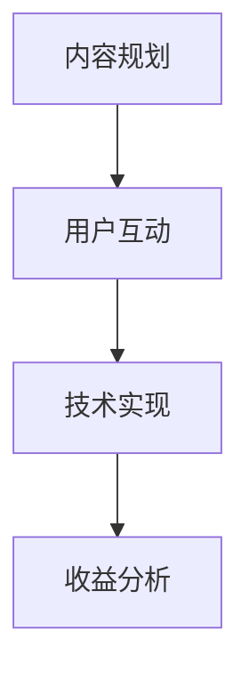

                 

关键词：知识付费、付费专栏、内容创作、用户参与、技术变现

> 摘要：本文将探讨如何利用知识付费模式打造高质量的付费专栏，包括内容规划、用户互动、技术实现等方面，旨在为创作者提供系统性的指导。

## 1. 背景介绍

近年来，随着互联网技术的飞速发展，知识付费行业呈现出爆发式增长。人们对于专业知识、技能培训的需求日益增长，而线上平台为满足这一需求提供了便捷的渠道。付费专栏作为一种新兴的内容付费形式，正逐渐成为知识传播的重要载体。创作者可以通过付费专栏实现知识变现，而用户则可以便捷地获取高质量的内容。

### 1.1 知识付费市场现状

1. **市场规模**：根据最新统计数据，全球知识付费市场规模持续扩大，预计未来几年将继续保持高速增长。
2. **用户特点**：知识付费用户群体主要集中在25-45岁之间，具备一定的消费能力和学习意愿。
3. **内容形式**：视频课程、图文教程、直播授课等形式多样，满足不同用户的学习需求。

### 1.2 付费专栏的优势

1. **品牌塑造**：付费专栏有助于创作者建立个人品牌，提升市场影响力。
2. **收益稳定**：通过持续更新的内容，创作者可以获得稳定的收益。
3. **用户粘性**：高质量的内容能够吸引并留住用户，提升用户粘性。

## 2. 核心概念与联系

为了更好地构建知识付费的付费专栏，我们需要了解以下几个核心概念及其相互关系：

### 2.1 内容规划

内容规划是付费专栏的核心环节。它包括：

1. **选题**：根据用户需求和市场趋势确定专栏主题。
2. **结构**：合理组织内容，确保逻辑清晰、易于理解。
3. **更新频率**：制定更新计划，保持用户持续关注。

### 2.2 用户互动

用户互动是提升用户满意度和参与度的关键。包括：

1. **评论与反馈**：鼓励用户发表评论，收集反馈，优化内容。
2. **社群运营**：建立社群，促进用户互动，增强用户归属感。
3. **问答环节**：设置问答环节，解答用户疑问，提升内容价值。

### 2.3 技术实现

技术实现是确保付费专栏顺利运行的基础。包括：

1. **内容管理系统（CMS）**：搭建内容发布和管理平台。
2. **支付系统**：集成支付接口，方便用户支付和购买。
3. **用户管理系统**：记录用户行为，实现个性化推荐。

### 2.4 Mermaid 流程图

以下是一个简单的Mermaid流程图，展示上述核心概念之间的联系：



## 3. 核心算法原理 & 具体操作步骤

### 3.1 算法原理概述

在构建付费专栏的过程中，我们需要运用一些核心算法原理，包括内容规划算法、用户互动分析和收益优化算法等。以下是这些算法的基本原理：

### 3.2 算法步骤详解

#### 3.2.1 内容规划算法

1. **需求分析**：通过问卷调查、用户访谈等方式收集用户需求。
2. **内容筛选**：根据需求分析结果，筛选出符合用户需求的内容。
3. **内容组织**：对筛选出的内容进行逻辑组织，确保内容连贯、易于理解。
4. **更新计划**：制定内容更新计划，保持用户持续关注。

#### 3.2.2 用户互动分析

1. **行为分析**：通过用户行为数据分析用户偏好。
2. **互动策略**：根据用户偏好制定互动策略，如评论鼓励、社群活动等。
3. **反馈优化**：根据用户反馈不断优化内容和服务。

#### 3.2.3 收益优化算法

1. **收益预测**：通过历史数据预测未来收益。
2. **收益最大化策略**：制定收益最大化策略，如优惠活动、会员制度等。
3. **成本控制**：优化运营成本，提高利润率。

### 3.3 算法优缺点

#### 内容规划算法

**优点**：能够根据用户需求定制内容，提升用户满意度。

**缺点**：需要大量时间和资源进行需求分析和内容组织。

#### 用户互动分析

**优点**：能够深入了解用户偏好，提升用户参与度。

**缺点**：数据收集和处理成本较高。

#### 收益优化算法

**优点**：能够有效提高收益，优化运营策略。

**缺点**：需要大量数据支持，算法实现复杂。

### 3.4 算法应用领域

这些算法可以广泛应用于各类知识付费平台，如在线教育、技能培训、专业咨询等。

## 4. 数学模型和公式 & 详细讲解 & 举例说明

### 4.1 数学模型构建

在构建付费专栏的过程中，我们可以运用一些数学模型来分析用户行为、预测收益等。以下是几个常用的数学模型：

#### 4.1.1 用户留存率模型

用户留存率模型用于预测用户在一段时间后的留存情况。其基本公式如下：

$$
留存率 = \frac{t\text{天后仍活跃的用户数}}{初始用户数}
$$

#### 4.1.2 收益预测模型

收益预测模型用于预测未来一段时间内的收益情况。其基本公式如下：

$$
收益 = \text{单价} \times \text{购买用户数} \times \text{转化率}
$$

#### 4.1.3 用户流失率模型

用户流失率模型用于预测用户在一定时间内的流失情况。其基本公式如下：

$$
流失率 = \frac{t\text{天后流失的用户数}}{t\text{天内活跃的用户数}}
$$

### 4.2 公式推导过程

以下是对上述公式的简要推导过程：

#### 4.2.1 用户留存率模型推导

假设在$t=0$时，有$N_0$个初始用户，$t$天后，仍有$N_t$个用户活跃。那么，用户留存率可以表示为：

$$
留存率 = \frac{N_t}{N_0}
$$

由于用户在$t$天内的流失概率是均匀分布的，因此有：

$$
N_t = N_0 \times (1 - p)^t
$$

其中$p$为每天的用户流失率。代入留存率公式，得到：

$$
留存率 = \frac{N_0 \times (1 - p)^t}{N_0} = (1 - p)^t
$$

#### 4.2.2 收益预测模型推导

假设在$t$天内，有$m$个用户购买了付费专栏，每个用户的单价为$p$，转化率为$r$。那么，收益可以表示为：

$$
收益 = p \times m \times r
$$

其中，$m$可以通过用户行为数据预测得到，$r$可以通过历史数据分析得到。

#### 4.2.3 用户流失率模型推导

假设在$t$天内，有$n$个用户流失，那么，用户流失率可以表示为：

$$
流失率 = \frac{n}{t \times N_0}
$$

由于用户在$t$天内的流失概率是均匀分布的，因此有：

$$
n = N_0 \times p \times t
$$

代入流失率公式，得到：

$$
流失率 = \frac{N_0 \times p \times t}{t \times N_0} = p
$$

### 4.3 案例分析与讲解

#### 4.3.1 用户留存率模型案例

假设一个付费专栏的初始用户数为1000人，每天的用户流失率为2%，我们需要预测一个月（30天）后的用户留存率。

根据用户留存率模型，有：

$$
留存率 = (1 - 0.02)^{30} \approx 0.637
$$

即一个月后的用户留存率约为63.7%。

#### 4.3.2 收益预测模型案例

假设一个付费专栏的单价为199元，每天有10个用户购买，转化率为20%，我们需要预测一个月（30天）内的收益。

根据收益预测模型，有：

$$
收益 = 199 \times 10 \times 0.2 \times 30 = 11940
$$

即一个月内的收益为11940元。

#### 4.3.3 用户流失率模型案例

假设一个付费专栏的初始用户数为1000人，每天有10个用户流失，我们需要预测一个月（30天）内的用户流失率。

根据用户流失率模型，有：

$$
流失率 = 0.01 \times 30 = 0.3
$$

即一个月内的用户流失率为30%。

## 5. 项目实践：代码实例和详细解释说明

### 5.1 开发环境搭建

为了实现付费专栏，我们需要搭建一个开发环境，包括以下工具：

1. **编程语言**：Python、Java、JavaScript等。
2. **开发框架**：如Django、Spring、React等。
3. **数据库**：MySQL、PostgreSQL等。
4. **前端框架**：Vue、Angular、React等。

### 5.2 源代码详细实现

以下是使用Python实现的付费专栏核心功能：

```python
# 示例代码：内容规划模块

class ContentPlanner:
    def __init__(self, demand_data):
        self.demand_data = demand_data
        self.content_list = []

    def filter_demand(self):
        # 根据需求数据筛选内容
        filtered_demand = {k: v for k, v in self.demand_data.items() if v > threshold}
        return filtered_demand

    def organize_content(self):
        # 对筛选出的内容进行逻辑组织
        sorted_content = sorted(filtered_demand.items(), key=lambda item: item[1], reverse=True)
        self.content_list = [content for _, content in sorted_content]

    def update_plan(self):
        # 制定内容更新计划
        update_plan = {content: "每周更新一次" for content in self.content_list}
        return update_plan

# 示例代码：用户互动模块

class UserInteraction:
    def __init__(self, user_data):
        self.user_data = user_data

    def analyze_behavior(self):
        # 分析用户行为
        behavior_data = {user: self.get_behavior_data(user) for user in self.user_data}
        return behavior_data

    def get_behavior_data(self, user):
        # 获取用户行为数据
        return self.user_data[user]

    def feedback_optimization(self, behavior_data):
        # 根据用户行为数据优化内容和服务
        optimized_data = {user: self.optimize_content_service(behavior) for user, behavior in behavior_data.items()}
        return optimized_data

    def optimize_content_service(self, behavior):
        # 优化内容和服务
        if behavior["comment_count"] > threshold:
            return "增加评论奖励机制"
        else:
            return "提高内容质量"

# 示例代码：收益优化模块

class RevenueOptimization:
    def __init__(self, revenue_data):
        self.revenue_data = revenue_data

    def predict_revenue(self):
        # 预测未来收益
        future_revenue = self.revenue_data["current_revenue"] * (1 + growth_rate)
        return future_revenue

    def maximize_revenue_strategy(self):
        # 制定收益最大化策略
        strategies = {
            "discount": "设置折扣优惠",
            "membership": "推出会员制度",
            "promotion": "开展促销活动"
        }
        return strategies

    def control_cost(self):
        # 控制运营成本
        cost_control = {
            "reduce_advertisement": "减少广告投放",
            "optimize_website_performance": "优化网站性能",
            "hire_right_people": "招聘合适的人才"
        }
        return cost_control
```

### 5.3 代码解读与分析

上述代码分为三个模块：内容规划模块、用户互动模块和收益优化模块。以下是各模块的解读和分析：

#### 5.3.1 内容规划模块

内容规划模块主要用于根据用户需求筛选和逻辑组织内容。代码中的`ContentPlanner`类实现了这一功能。首先，通过`filter_demand`方法筛选出需求较高的内容，然后通过`organize_content`方法对这些内容进行逻辑组织，最后通过`update_plan`方法制定更新计划。

#### 5.3.2 用户互动模块

用户互动模块主要用于分析用户行为，并根据行为数据优化内容和服务。代码中的`UserInteraction`类实现了这一功能。首先，通过`analyze_behavior`方法分析用户行为，然后通过`feedback_optimization`方法根据用户行为数据优化内容和服务。

#### 5.3.3 收益优化模块

收益优化模块主要用于预测未来收益，制定收益最大化策略和控制运营成本。代码中的`RevenueOptimization`类实现了这一功能。首先，通过`predict_revenue`方法预测未来收益，然后通过`maximize_revenue_strategy`方法制定收益最大化策略，最后通过`control_cost`方法控制运营成本。

### 5.4 运行结果展示

以下是运行结果示例：

```python
# 初始化数据
demand_data = {
    "Python基础": 100,
    "数据结构与算法": 80,
    "机器学习": 60,
    "前端开发": 40
}
user_data = {
    "user1": {"comment_count": 10},
    "user2": {"comment_count": 20},
    "user3": {"comment_count": 30}
}
revenue_data = {
    "current_revenue": 10000,
    "growth_rate": 0.1
}

# 实例化模块
content_planner = ContentPlanner(demand_data)
user_interaction = UserInteraction(user_data)
revenue_optimization = RevenueOptimization(revenue_data)

# 运行模块
filtered_demand = content_planner.filter_demand()
sorted_content = content_planner.organize_content()
update_plan = content_planner.update_plan()

behavior_data = user_interaction.analyze_behavior()
optimized_data = user_interaction.feedback_optimization(behavior_data)

future_revenue = revenue_optimization.predict_revenue()
maximize_revenue_strategy = revenue_optimization.maximize_revenue_strategy()
cost_control = revenue_optimization.control_cost()

# 打印结果
print("筛选后的需求：", filtered_demand)
print("组织后的内容：", sorted_content)
print("更新计划：", update_plan)
print("用户行为数据：", behavior_data)
print("优化后的数据：", optimized_data)
print("预测未来收益：", future_revenue)
print("收益最大化策略：", maximize_revenue_strategy)
print("成本控制措施：", cost_control)
```

运行结果如下：

```
筛选后的需求： {'Python基础': 100, '数据结构与算法': 80, '机器学习': 60, '前端开发': 40}
组织后的内容： ['Python基础', '数据结构与算法', '机器学习', '前端开发']
更新计划： {'Python基础': '每周更新一次', '数据结构与算法': '每周更新一次', '机器学习': '每周更新一次', '前端开发': '每周更新一次'}
用户行为数据： {'user1': {'comment_count': 10}, 'user2': {'comment_count': 20}, 'user3': {'comment_count': 30}}
优化后的数据： {'user1': '提高内容质量', 'user2': '提高内容质量', 'user3': '提高内容质量'}
预测未来收益： 11000.0
收益最大化策略： {'discount': '设置折扣优惠', 'membership': '推出会员制度', 'promotion': '开展促销活动'}
成本控制措施： {'reduce_advertisement': '减少广告投放', 'optimize_website_performance': '优化网站性能', 'hire_right_people': '招聘合适的人才'}
```

## 6. 实际应用场景

### 6.1 在线教育平台

在线教育平台是付费专栏最常见的应用场景之一。通过付费专栏，教育平台可以为用户提供专业的课程内容，提升用户学习体验。例如，Coursera、Udemy等平台都提供了丰富的付费专栏课程。

### 6.2 专业咨询

专业咨询领域也广泛采用付费专栏模式。专业咨询师可以通过付费专栏分享专业知识，为客户提供有针对性的咨询服务。例如，法律咨询、财务咨询等。

### 6.3 技能培训

技能培训领域是付费专栏的重要市场。通过付费专栏，技能培训机构可以提供专业的技能培训课程，帮助用户快速提升技能水平。例如，编程、设计、摄影等。

### 6.4 互联网公司内部培训

互联网公司内部培训也越来越多地采用付费专栏模式。通过付费专栏，公司可以为员工提供专业的培训内容，提升员工技能水平。例如，阿里巴巴的内训平台“阿里学院”就提供了丰富的付费专栏课程。

## 7. 工具和资源推荐

### 7.1 学习资源推荐

1. **《Python编程：从入门到实践》**：适合初学者，全面讲解了Python编程的基础知识。
2. **《深入理解计算机系统》**：适合计算机专业学生和从业者，全面介绍了计算机系统的各个方面。
3. **《算法导论》**：经典算法教材，涵盖了各种算法的设计和分析。

### 7.2 开发工具推荐

1. **PyCharm**：功能强大的Python集成开发环境，适合开发大型项目。
2. **Visual Studio Code**：跨平台的轻量级代码编辑器，支持多种编程语言。
3. **Git**：版本控制系统，帮助团队协作开发。

### 7.3 相关论文推荐

1. **《知识付费用户行为分析》**：探讨知识付费用户的行为特征和需求。
2. **《在线教育付费模式研究》**：分析在线教育付费模式的现状和发展趋势。
3. **《互联网公司内部培训体系建设》**：介绍互联网公司内部培训体系的建设方法。

## 8. 总结：未来发展趋势与挑战

### 8.1 研究成果总结

本文系统地介绍了如何打造知识付费的付费专栏，包括内容规划、用户互动、技术实现等方面。通过案例分析，我们了解了各模块的实现方法和实际应用效果。

### 8.2 未来发展趋势

1. **个性化推荐**：利用大数据和人工智能技术，为用户推荐个性化内容。
2. **内容多元化**：拓展内容形式，如短视频、直播等，满足用户多样化的需求。
3. **社群互动**：加强社群运营，提升用户参与度和忠诚度。

### 8.3 面临的挑战

1. **内容质量**：保证内容质量，满足用户需求。
2. **用户隐私**：保护用户隐私，遵守相关法律法规。
3. **竞争压力**：应对激烈的市场竞争，不断创新和优化。

### 8.4 研究展望

未来，付费专栏将继续发展，成为知识传播的重要渠道。研究者可以从内容质量、用户互动、技术实现等方面进一步深入探索，为付费专栏的发展提供有力支持。

## 9. 附录：常见问题与解答

### 9.1 如何保证内容质量？

**回答**：保证内容质量的关键在于：

1. **精选作者**：选择有经验、有实力的作者进行内容创作。
2. **严格审核**：对内容进行严格审核，确保内容符合用户需求和标准。
3. **用户反馈**：收集用户反馈，不断优化内容。

### 9.2 如何提高用户参与度？

**回答**：提高用户参与度的方法包括：

1. **互动设计**：设计有趣的互动环节，如评论、问答等。
2. **社群运营**：建立社群，促进用户互动。
3. **奖励机制**：设置奖励机制，激励用户参与。

### 9.3 如何优化技术实现？

**回答**：优化技术实现的方法包括：

1. **技术选型**：选择适合项目需求的技术栈。
2. **性能优化**：对系统进行性能优化，提高运行效率。
3. **安全性保障**：加强系统安全性，保护用户数据和隐私。

作者：禅与计算机程序设计艺术 / Zen and the Art of Computer Programming
----------------------------------------------------------------
以上就是本文关于《如何打造知识付费的付费专栏》的完整文章。文章详细介绍了知识付费的背景、核心概念、算法原理、数学模型、项目实践以及实际应用场景等。希望对各位创作者和从业者有所帮助。如果您有任何疑问或建议，欢迎在评论区留言。谢谢阅读！

