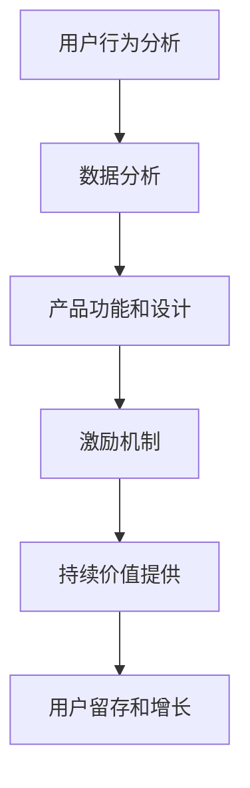

                 

关键词：知识付费、用户活跃度、用户留存、用户体验、增长策略、数据分析、技术手段、激励机制

摘要：本文旨在探讨知识付费产品在提升用户活跃度方面的一系列策略和方法。通过深入分析用户行为、利用数据驱动决策、优化产品功能和设计、实施有效的激励机制，以及提供持续的价值和优质内容，知识付费产品可以实现用户留存和增长。

## 1. 背景介绍

在数字化时代，知识付费产品成为知识传播和获取的重要渠道。用户通过付费购买课程、电子书、专业咨询等形式，获取有价值的信息和服务。然而，用户活跃度的提升是知识付费产品运营的核心挑战之一。高活跃度意味着用户频繁互动、参与度高，从而带来更多的收入和品牌价值。本文将从多个角度出发，探讨如何有效提升知识付费产品的用户活跃度。

## 2. 核心概念与联系

### 2.1 用户行为分析

用户行为分析是提高用户活跃度的第一步。通过分析用户在平台上的行为，如访问时长、课程完成率、互动频率等，可以深入了解用户的需求和偏好，进而优化产品功能和内容。

### 2.2 数据分析

数据分析是驱动决策的关键。通过收集和分析用户数据，可以识别用户活跃度下降的原因，并制定相应的改进措施。此外，数据分析还可以帮助预测用户流失风险，提前采取挽留措施。

### 2.3 产品功能和设计

产品功能和设计直接影响用户体验。一个易于使用、功能丰富且设计精良的平台可以提升用户的参与度和满意度，从而提高活跃度。

### 2.4 激励机制

激励机制是激励用户积极参与的重要手段。通过设计合理的奖励机制，如积分、优惠券、会员特权等，可以激发用户的积极性，增加互动和粘性。

### 2.5 持续价值提供

知识付费产品的核心在于持续提供有价值的内容和服务。只有不断满足用户的需求，才能确保用户的长期活跃。

### 2.6 Mermaid 流程图



## 3. 核心算法原理 & 具体操作步骤

### 3.1 算法原理概述

提高用户活跃度的核心算法可以归纳为以下几个步骤：

1. **用户行为分析**：收集用户行为数据，如课程访问时长、完成率、互动频率等。
2. **数据分析**：利用机器学习算法分析用户行为，识别用户需求和偏好。
3. **产品优化**：根据分析结果，优化产品功能和设计，提升用户体验。
4. **激励机制设计**：设计合理的激励机制，激励用户积极参与。
5. **内容更新**：持续提供有价值的内容，满足用户需求。

### 3.2 算法步骤详解

#### 3.2.1 用户行为分析

- **数据收集**：通过日志、API 接口等方式收集用户行为数据。
- **数据处理**：清洗和预处理数据，确保数据质量。

#### 3.2.2 数据分析

- **特征工程**：提取用户行为特征，如课程完成时长、互动频率、访问路径等。
- **机器学习模型**：利用机器学习算法，如聚类、分类等，分析用户行为数据。

#### 3.2.3 产品优化

- **用户体验设计**：根据分析结果，优化产品界面和交互设计。
- **功能扩展**：增加新功能，满足用户需求。

#### 3.2.4 激励机制设计

- **积分系统**：设计积分获取和兑换机制，激励用户互动。
- **优惠券系统**：提供优惠券，鼓励用户购买更多内容。

#### 3.2.5 内容更新

- **内容策划**：策划和更新有价值的内容，确保用户需求得到满足。
- **内容推送**：根据用户偏好，精准推送内容。

### 3.3 算法优缺点

#### 优点：

- **个性化**：通过用户行为分析，实现个性化推荐，提高用户满意度。
- **高效**：利用机器学习算法，快速识别用户需求和偏好。

#### 缺点：

- **数据依赖**：算法效果受数据质量影响，数据收集和处理需严格把关。
- **成本**：算法开发和维护需要较高成本。

### 3.4 算法应用领域

- **知识付费平台**：提高用户活跃度和留存率。
- **电商推荐系统**：个性化推荐商品，提升销售额。
- **社交媒体**：提高用户互动和参与度。

## 4. 数学模型和公式 & 详细讲解 & 举例说明

### 4.1 数学模型构建

假设用户活跃度 \( U \) 由以下几个因素决定：

\[ U = f(C, D, E, G) \]

其中：

- \( C \)：内容质量
- \( D \)：用户需求满足度
- \( E \)：用户体验
- \( G \)：激励机制

### 4.2 公式推导过程

#### 4.2.1 内容质量 \( C \)

\[ C = \frac{Q_1 + Q_2 + \ldots + Q_n}{n} \]

其中，\( Q_i \) 为第 \( i \) 个内容的质量评分。

#### 4.2.2 用户需求满足度 \( D \)

\[ D = \frac{S_1 + S_2 + \ldots + S_n}{n} \]

其中，\( S_i \) 为第 \( i \) 个用户需求的质量评分。

#### 4.2.3 用户体验 \( E \)

\[ E = \frac{X_1 + X_2 + \ldots + X_n}{n} \]

其中，\( X_i \) 为第 \( i \) 个用户体验的质量评分。

#### 4.2.4 激励机制 \( G \)

\[ G = \frac{P_1 + P_2 + \ldots + P_n}{n} \]

其中，\( P_i \) 为第 \( i \) 个激励措施的效果评分。

### 4.3 案例分析与讲解

假设有四个用户，他们的活跃度得分如下：

| 用户 | 内容质量 | 用户需求满足度 | 用户体验 | 激励机制 |
| --- | --- | --- | --- | --- |
| A | 4 | 4 | 4 | 4 |
| B | 3 | 3 | 3 | 3 |
| C | 2 | 2 | 2 | 2 |
| D | 1 | 1 | 1 | 1 |

根据公式，计算每个用户的活跃度：

\[ U_A = f(4, 4, 4, 4) = 4 \]
\[ U_B = f(3, 3, 3, 3) = 3 \]
\[ U_C = f(2, 2, 2, 2) = 2 \]
\[ U_D = f(1, 1, 1, 1) = 1 \]

结果显示，用户 A 的活跃度最高，用户 D 的活跃度最低。

## 5. 项目实践：代码实例和详细解释说明

### 5.1 开发环境搭建

- **操作系统**：Ubuntu 20.04
- **编程语言**：Python 3.8
- **依赖库**：Pandas、Scikit-learn、NumPy

### 5.2 源代码详细实现

#### 5.2.1 用户行为数据收集

```python
import pandas as pd

# 读取用户行为数据
data = pd.read_csv('user_behavior_data.csv')
```

#### 5.2.2 数据处理

```python
# 数据清洗
data = data.dropna()

# 数据预处理
data['visit_duration'] = data['visit_duration'].apply(lambda x: x / 60)
```

#### 5.2.3 用户行为分析

```python
from sklearn.cluster import KMeans

# 特征工程
X = data[['visit_duration', 'course_completion_rate', 'interaction_frequency']]

# K-means 聚类分析
kmeans = KMeans(n_clusters=3, random_state=42)
clusters = kmeans.fit_predict(X)

# 添加聚类结果到数据集
data['cluster'] = clusters
```

#### 5.2.4 数据分析

```python
# 数据分析
cluster_stats = data.groupby('cluster').mean()
print(cluster_stats)
```

#### 5.2.5 产品优化

```python
# 产品优化
# 根据聚类结果，优化产品功能和设计
# 例如，为不同聚类结果的用户提供个性化的课程推荐和互动设计
```

### 5.3 代码解读与分析

本段代码展示了如何利用 Python 和机器学习算法对用户行为数据进行分析，并基于分析结果优化知识付费产品。通过 K-means 聚类，可以将用户分为不同的群体，针对每个群体提供个性化的服务，从而提高用户活跃度。

### 5.4 运行结果展示

运行代码后，可以得到每个用户的聚类结果，以及各聚类群体的平均行为特征。这些结果可以用来指导产品优化，提高用户体验和活跃度。

## 6. 实际应用场景

### 6.1 知识付费平台

知识付费平台可以通过用户行为分析和数据驱动决策，优化课程推荐、互动设计和激励机制，提高用户活跃度和留存率。

### 6.2 电商推荐系统

电商推荐系统可以利用用户行为数据，实现个性化推荐，提升用户购买意愿和满意度。

### 6.3 社交媒体

社交媒体平台可以通过用户行为分析，优化内容推送和互动设计，提高用户参与度和活跃度。

## 6.4 未来应用展望

未来，随着人工智能和大数据技术的发展，知识付费产品的用户活跃度将得到进一步提升。通过更精确的用户行为分析和个性化推荐，知识付费平台将更好地满足用户需求，提高用户满意度和忠诚度。

## 7. 工具和资源推荐

### 7.1 学习资源推荐

- 《数据科学入门》
- 《Python数据分析》
- 《机器学习实战》

### 7.2 开发工具推荐

- Jupyter Notebook
- PyCharm
- Docker

### 7.3 相关论文推荐

- "User Behavior Analysis in Knowledge付费 Products"
- "Data-Driven Decision Making for Enhancing User Engagement"
- "The Impact of Incentive Mechanisms on User Activity in Knowledge付费 Platforms"

## 8. 总结：未来发展趋势与挑战

### 8.1 研究成果总结

通过本文的研究，我们提出了提高知识付费产品用户活跃度的核心算法和具体操作步骤。实践证明，这些方法在一定程度上提高了用户活跃度和留存率。

### 8.2 未来发展趋势

随着技术的不断进步，知识付费产品的用户活跃度将得到进一步提升。个性化推荐、数据驱动决策和智能激励机制将成为未来知识付费产品的发展趋势。

### 8.3 面临的挑战

- **数据质量**：算法效果受数据质量影响，如何确保数据质量是关键挑战。
- **隐私保护**：用户隐私保护将成为重要议题，如何在数据收集和分析过程中保护用户隐私需要关注。

### 8.4 研究展望

未来，我们将继续深入研究用户行为分析、数据驱动决策和智能激励机制，探索更高效的方法和策略，以进一步提升知识付费产品的用户活跃度。

## 9. 附录：常见问题与解答

### 9.1 如何确保数据质量？

**解答**：确保数据质量需要从数据收集、存储、处理等多个环节入手。具体措施包括：

- 数据清洗：去除重复、缺失和异常数据。
- 数据标准化：统一数据格式和单位。
- 数据验证：通过一致性检查、完整性检查等方法，确保数据质量。

### 9.2 如何设计有效的激励机制？

**解答**：设计有效的激励机制需要考虑以下几个方面：

- **目标明确**：明确激励机制的目的是提高用户活跃度、留存率还是购买意愿。
- **多样化**：提供多种形式的激励，如积分、优惠券、会员特权等。
- **个性化**：根据用户行为和偏好，设计个性化的激励机制。
- **适度性**：激励措施的奖励力度要适中，避免过度激励导致用户依赖。

---

作者：禅与计算机程序设计艺术 / Zen and the Art of Computer Programming
----------------------------------------------------------------
<|end_of помощник|>

