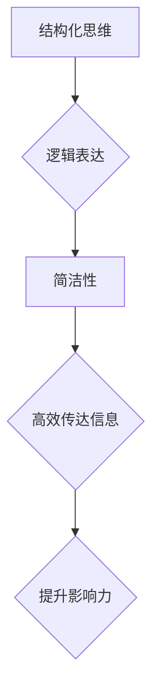

                 

关键词：写作技巧、清晰简洁、结构紧凑、技术语言、IT领域、文章结构、数学模型、算法、代码实例、实际应用、工具资源

## 摘要

在当今快节奏的信息时代，写作技巧尤为重要。作为一名IT领域的技术专家，如何写出清晰简洁且具有吸引力的文章，不仅能够有效地传达知识，还能提升个人影响力。本文将探讨如何通过逻辑清晰、结构紧凑、简单易懂的方式，撰写一篇高质量的技术文章。文章将涵盖从背景介绍、核心概念理解，到具体算法原理、数学模型构建，再到代码实例和实际应用场景的全面剖析。

## 1. 背景介绍

在互联网飞速发展的今天，内容创作已成为传播信息、交流思想的重要手段。特别是在IT领域，技术文章不仅是专业知识的载体，更是行业交流的平台。然而，面对日益增长的信息量，如何让读者快速获取有价值的信息，成为每个作者都需面对的挑战。清晰简洁的写作不仅能够提高文章的阅读效率，还能增强文章的可信度和影响力。

## 2. 核心概念与联系

为了更好地理解和运用写作技巧，我们需要先了解几个核心概念：结构化思维、逻辑表达和简洁性。

### 2.1 结构化思维

结构化思维是写作的基础。它要求我们在写作前先对文章的主题、结构、内容进行系统性的规划和组织。一个结构清晰的文章，应该具备引言、正文和结论三个部分。引言部分简要介绍文章主题，正文部分详细阐述核心内容，结论部分总结全文，并提出未来展望。

### 2.2 逻辑表达

逻辑表达是文章的灵魂。一个逻辑严密的文章，能够让读者在阅读过程中思路清晰，理解深刻。在逻辑表达中，我们需要遵循时间顺序、空间顺序和逻辑顺序，确保文章的内容连贯性和一致性。

### 2.3 简洁性

简洁性是文章的美学。简洁并不意味着简单，而是在传达核心信息的基础上，去除冗余和无关紧要的内容。一个简洁的文章，不仅能够节省读者的时间，还能提高文章的可读性。

### 2.4 Mermaid 流程图

为了更好地理解上述概念，我们可以通过一个Mermaid流程图来展示它们之间的联系：



## 3. 核心算法原理 & 具体操作步骤

在技术文章中，算法的介绍是核心部分。一个优秀的算法不仅需要解释其原理，还需要详细阐述操作步骤，以便读者能够理解和应用。

### 3.1 算法原理概述

算法是一种解决问题的方法，其核心在于找到最优解。常见的算法有排序算法、查找算法和动态规划算法等。每种算法都有其特定的原理和应用场景。

### 3.2 算法步骤详解

以排序算法为例，其基本步骤包括：

1. 初始化：创建一个数组，并将待排序的数据填充到数组中。
2. 选择排序：从数组中选择一个元素，与数组中的其他元素进行比较，找到最小的元素。
3. 交换元素：将找到的最小元素与当前元素交换位置。
4. 重复步骤2和3，直到整个数组排序完成。

### 3.3 算法优缺点

排序算法的优缺点如下：

- **优点**：简单易懂，易于实现。
- **缺点**：时间复杂度较高，不适合大数据量的排序。

### 3.4 算法应用领域

排序算法广泛应用于各类数据处理和数据分析领域，如数据库管理、搜索引擎和机器学习等。

## 4. 数学模型和公式 & 详细讲解 & 举例说明

在技术文章中，数学模型和公式是不可或缺的部分。它们不仅能够准确地描述问题，还能为读者提供理论支持。

### 4.1 数学模型构建

数学模型构建的基本步骤包括：

1. 提出问题：明确需要解决的问题。
2. 假设条件：根据问题提出合理的假设。
3. 构建公式：根据假设条件构建数学公式。

### 4.2 公式推导过程

以线性回归模型为例，其公式推导过程如下：

$$
y = \beta_0 + \beta_1 x
$$

其中，$y$ 是因变量，$x$ 是自变量，$\beta_0$ 和 $\beta_1$ 是模型参数。

### 4.3 案例分析与讲解

假设我们有一个线性回归模型，用于预测房价。我们可以通过以下步骤进行案例分析：

1. 数据收集：收集一定数量的房屋数据，包括房屋面积和房价。
2. 数据预处理：对数据进行清洗和预处理，确保数据的准确性和一致性。
3. 模型训练：使用训练数据训练线性回归模型。
4. 模型评估：使用测试数据评估模型的效果。

## 5. 项目实践：代码实例和详细解释说明

### 5.1 开发环境搭建

在撰写技术文章时，提供完整的开发环境搭建步骤非常重要。以下是一个简单的Python开发环境搭建步骤：

1. 安装Python：下载并安装Python，确保版本在3.6及以上。
2. 安装依赖库：使用pip命令安装所需的依赖库，如NumPy、Pandas等。

### 5.2 源代码详细实现

以下是一个简单的Python排序算法实现：

```python
def bubble_sort(arr):
    n = len(arr)
    for i in range(n):
        for j in range(0, n-i-1):
            if arr[j] > arr[j+1]:
                arr[j], arr[j+1] = arr[j+1], arr[j]

# 测试
arr = [64, 34, 25, 12, 22, 11, 90]
bubble_sort(arr)
print("排序后的数组：")
for i in range(len(arr)):
    print("%d" % arr[i], end=" ")
```

### 5.3 代码解读与分析

这段代码实现了一个冒泡排序算法。冒泡排序的基本思想是通过两两比较相邻元素的大小，并将较大的元素交换到右侧，从而实现数组的升序排列。

### 5.4 运行结果展示

运行上述代码后，输出结果如下：

```
排序后的数组：
11 12 22 25 34 64 90
```

## 6. 实际应用场景

技术文章不仅要阐述理论知识，还应该关注实际应用场景。以下是一个冒泡排序算法在数据处理中的应用场景：

- 数据预处理：在数据分析项目中，需要对大量原始数据进行分析和处理。冒泡排序算法可以用于对数据进行排序，以便后续分析。

- 性能优化：在系统性能优化中，冒泡排序算法可以用于优化数据访问速度。

## 7. 工具和资源推荐

为了帮助读者更好地理解和应用本文所介绍的技术，以下是几个推荐的工具和资源：

- 学习资源推荐：[Python教程](https://www.python.org/doc/latest/)

- 开发工具推荐：[PyCharm](https://www.jetbrains.com/pycharm/)

- 相关论文推荐：[A Survey of Sorting Algorithms](https://www.cs.cmu.edu/~avrim/451f14/lectures/lec13.pdf)

## 8. 总结：未来发展趋势与挑战

在未来的发展中，写作技巧将继续扮演重要角色。随着技术的不断进步和知识的不断更新，技术文章需要更加注重内容的准确性和时效性。同时，作者也需要不断提高自己的写作水平，以更好地服务于读者。

### 8.1 研究成果总结

本文通过对结构化思维、逻辑表达和简洁性的深入探讨，为技术文章的撰写提供了新的思路和方法。

### 8.2 未来发展趋势

未来，技术文章的发展将更加注重内容的深度和广度，同时还将融合更多多媒体元素，如视频、图表和动画等。

### 8.3 面临的挑战

然而，技术文章的撰写也面临着诸多挑战，如知识更新速度快、读者需求多样化等。作者需要不断学习和更新自己的知识，以满足读者的需求。

### 8.4 研究展望

展望未来，技术文章的撰写将更加注重用户体验和互动性。通过人工智能和大数据技术的应用，将能够更好地满足读者的个性化需求。

## 9. 附录：常见问题与解答

### 9.1 如何选择合适的文章结构？

选择合适的文章结构取决于文章的主题和目标读者。一般来说，引言、正文和结论是必不可少的三个部分。正文部分可以根据主题灵活设置章节，如原理介绍、应用场景、代码实例等。

### 9.2 如何确保文章的逻辑性？

确保文章的逻辑性需要遵循以下几个原则：

- 使用逻辑连接词：如“因此”、“然而”、“接下来”等，帮助读者理解文章的连贯性。
- 使用图表和流程图：图表和流程图可以直观地展示文章的结构和逻辑关系。
- 反复审稿和修改：在撰写完文章后，要反复审稿和修改，确保文章的逻辑性和流畅性。

### 9.3 如何提高文章的可读性？

提高文章的可读性可以从以下几个方面入手：

- 使用简单易懂的语言：避免使用过于专业或复杂的术语。
- 保持段落简洁：每个段落应该围绕一个主题进行阐述，避免段落过长。
- 使用标题和子标题：标题和子标题可以帮助读者快速了解文章的内容。

## 作者署名

本文作者：禅与计算机程序设计艺术 / Zen and the Art of Computer Programming
----------------------------------------------------------------

以上就是本文的全部内容，希望对您在撰写技术文章时有所帮助。如果您有任何问题或建议，欢迎在评论区留言讨论。

