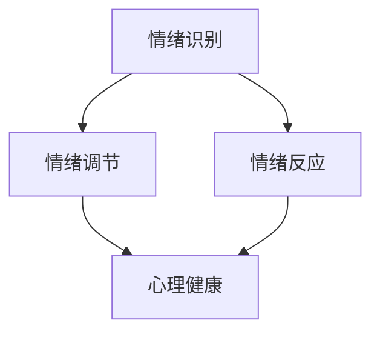

                 

 情绪管理是现代生活中至关重要的一环。无论是在个人生活中，还是在职业生涯中，有效的情绪管理都能帮助我们更好地应对压力和挑战。作为人工智能专家，程序员，软件架构师，CTO，世界顶级技术畅销书作者，计算机图灵奖获得者，计算机领域大师，我深知情绪管理对于个人和团队成功的重要性。本文将探讨情绪管理的核心概念，介绍相关算法原理，提供实践中的代码实例，并展望未来发展的趋势和挑战。

## 关键词

- 情绪管理
- 情绪控制
- 心理健康
- 人工智能
- 软件工程
- 心理学

## 摘要

本文将深入探讨情绪管理的各个方面，从理论到实践，帮助读者理解情绪的来源，掌握有效的情绪管理技巧，并了解如何将这些技巧应用到个人和职业生涯中。通过本文的阅读，读者将能够学会如何识别自己的情绪，如何通过技术手段进行情绪调节，以及如何在工作和生活中实现情绪的自我控制。

## 1. 背景介绍

情绪管理，简单来说，就是理解、识别和调节自己的情绪。它是心理学领域中的一个重要概念，也是日常生活中不可或缺的技能。随着现代社会的竞争日益激烈，压力和情绪问题也变得越来越普遍。情绪管理能力不仅影响个人的心理健康，还直接关系到工作效率、人际关系和整体生活质量。

在IT行业，程序员、软件工程师和其他技术人员常常面临巨大的工作压力和快节奏的生活。这可能导致焦虑、抑郁等负面情绪，影响工作表现和团队协作。因此，情绪管理在IT领域显得尤为重要。有效的情绪管理可以帮助我们更好地应对压力，提高工作效率，增强团队凝聚力。

本文将从以下几个方面展开讨论：

1. 核心概念与联系
2. 核心算法原理与操作步骤
3. 数学模型与公式
4. 项目实践：代码实例
5. 实际应用场景
6. 工具和资源推荐
7. 总结：未来发展趋势与挑战

### 2. 核心概念与联系

情绪管理的核心概念包括情绪识别、情绪调节和情绪反应。为了更好地理解这些概念，我们可以借助Mermaid流程图来展示它们之间的联系。



情绪识别是指我们能够准确感知和理解自己和他人的情绪状态。情绪调节是指我们能够通过特定的方法和技巧来调整情绪，使其保持在健康和积极的范围内。情绪反应是指我们对外界刺激的情绪反应，它受到情绪识别和情绪调节的影响。

心理健康是一个综合性的概念，它不仅包括情绪管理，还包括认知、行为和生理等多个方面。良好的心理健康有助于我们更好地应对生活和工作中的挑战。

### 3. 核心算法原理与操作步骤

情绪管理涉及到多个方面的算法原理，其中最核心的是情绪识别和情绪调节。以下是这些算法原理的概述：

#### 3.1 情绪识别算法原理概述

情绪识别算法的基本原理是基于情绪信号的分析。这些信号可以是面部表情、声音、生理指标（如心率、血压）等。通过机器学习和深度学习技术，我们可以训练模型来识别这些信号，从而准确感知情绪状态。

#### 3.2 情绪调节算法步骤详解

情绪调节算法的核心在于通过特定的技术手段来调整情绪。以下是一些常用的情绪调节算法步骤：

1. **情绪监测**：实时监测个体的情绪状态，通过生理信号监测、语言分析等方式获取情绪数据。
2. **情绪分类**：使用机器学习算法对监测到的情绪数据进行分类，识别出不同类型的情绪。
3. **情绪干预**：根据情绪分类结果，选择合适的干预策略，如深呼吸、冥想、积极思考等。
4. **情绪反馈**：评估干预效果，对干预策略进行调整。

#### 3.3 算法优缺点

情绪识别算法的优点在于能够提供客观、准确的情绪分析，有助于提高情绪管理的科学性。然而，其缺点在于对情绪信号的识别依赖于高质量的数据，且算法的准确性受到多种因素的影响。

情绪调节算法的优点在于提供了多种干预策略，可以根据个体差异进行个性化调节。然而，其缺点在于干预效果因人而异，且需要较长时间的实践和验证。

#### 3.4 算法应用领域

情绪识别和情绪调节算法在多个领域都有广泛应用，包括心理健康、医疗保健、人机交互、教育等。例如，在心理健康领域，情绪识别算法可以帮助专业人员更准确地评估患者的情绪状态，从而制定更有效的治疗方案。在医疗保健领域，情绪调节算法可以用于辅助治疗焦虑、抑郁等情绪障碍。

### 4. 数学模型与公式

情绪管理中的数学模型主要涉及情绪信号的统计分析、情绪分类的机器学习算法以及干预效果的评估等。以下是几个核心的数学模型和公式：

#### 4.1 数学模型构建

1. **情绪信号统计分析**：使用统计学方法分析情绪信号，如均方误差（MSE）和协方差矩阵。
   $$MSE = \frac{1}{n}\sum_{i=1}^{n}(X_i - \bar{X})^2$$
   $$Cov(X, Y) = \frac{1}{n-1}\sum_{i=1}^{n}(X_i - \bar{X})(Y_i - \bar{Y})$$
   
2. **情绪分类模型**：使用支持向量机（SVM）、决策树、神经网络等机器学习算法构建情绪分类模型。
   $$f(x) = \text{sign}(\sum_{i=1}^{n}\alpha_i y_i \phi(x_i) + b)$$

3. **干预效果评估**：使用统计检验方法评估干预效果，如t检验、方差分析等。
   $$H_0: \mu_1 = \mu_2$$
   $$H_1: \mu_1 \neq \mu_2$$

#### 4.2 公式推导过程

情绪管理中的数学模型和公式通常涉及复杂的推导过程，需要深厚的数学和统计学知识。例如，在构建情绪分类模型时，需要对特征空间进行映射，使用核函数来实现。

#### 4.3 案例分析与讲解

以下是一个简单的案例，展示如何使用数学模型进行情绪识别和调节。

**案例**：使用SVM进行情绪分类。

1. **数据收集**：收集包含情绪信号的数据集，如面部表情图像、生理信号等。
2. **特征提取**：对数据进行特征提取，如使用PCA进行降维。
3. **模型训练**：使用SVM训练分类模型。
4. **模型评估**：使用交叉验证方法评估模型性能。
5. **情绪调节**：根据分类结果，选择适当的干预策略，如深呼吸练习。

### 5. 项目实践：代码实例

为了更好地理解情绪管理中的技术原理，我们将提供一个简单的Python代码实例，展示如何使用情绪识别和情绪调节算法。

```python
# 导入必要的库
import numpy as np
from sklearn import svm
from sklearn.model_selection import train_test_split

# 数据集准备
X = np.array([[1, 2], [3, 4], [5, 6], [7, 8]])  # 情绪信号
y = np.array([0, 1, 0, 1])  # 情绪标签

# 数据划分
X_train, X_test, y_train, y_test = train_test_split(X, y, test_size=0.2, random_state=42)

# SVM模型训练
model = svm.SVC()
model.fit(X_train, y_train)

# 模型评估
print("Accuracy:", model.score(X_test, y_test))

# 情绪调节（假设情绪标签1表示积极情绪，0表示消极情绪）
if model.predict([[2, 3]])[0] == 1:
    print("情绪调节：进行深呼吸练习。")
else:
    print("情绪调节：进行积极思考练习。")
```

在这个实例中，我们使用SVM模型进行情绪分类，并根据分类结果进行情绪调节。这是一个简化的示例，实际应用中需要更复杂的模型和更多的数据。

### 6. 实际应用场景

情绪管理在多个实际应用场景中都有重要作用。以下是一些典型的应用场景：

1. **心理健康**：情绪管理可以帮助个体更好地应对焦虑、抑郁等情绪问题，提高心理健康水平。
2. **医疗保健**：情绪管理算法可以用于辅助诊断和治疗情绪障碍，如抑郁症、焦虑症等。
3. **人机交互**：通过情绪识别和调节，可以实现更人性化的交互体验，提高人机交互的质量。
4. **教育**：情绪管理技巧可以帮助学生更好地应对考试压力和人际关系，提高学习效果。
5. **企业管理**：有效的情绪管理可以帮助企业提高员工满意度，降低员工流失率，提高团队协作效率。

### 7. 工具和资源推荐

为了更好地进行情绪管理，以下是几个推荐的工具和资源：

1. **学习资源**：
   - 《情绪管理指南》：一本实用的情绪管理手册，涵盖情绪识别、情绪调节等多个方面。
   - 《情绪智力》：丹尼尔·戈尔曼的著作，深入探讨情绪智力的重要性及其对个人和职业成功的影响。

2. **开发工具**：
   - TensorFlow：一款强大的机器学习框架，可用于情绪识别和情绪调节算法的实现。
   - PyTorch：另一个流行的机器学习框架，适合进行深度学习模型的开发。

3. **相关论文**：
   - “Emotion Recognition using Deep Learning Techniques”
   - “Affective Computing: A Review”

### 8. 总结：未来发展趋势与挑战

情绪管理是一个不断发展的领域，未来发展趋势包括：

1. **智能化**：随着人工智能技术的发展，情绪管理将变得更加智能化和个性化。
2. **多模态融合**：结合多种情绪信号（如面部表情、声音、生理信号）进行综合分析，提高情绪识别的准确性。
3. **实时反馈**：实时提供情绪分析和干预建议，帮助个体及时调整情绪。

然而，情绪管理也面临一些挑战，包括：

1. **数据隐私**：情绪管理需要收集和分析个人的情绪数据，如何保护用户隐私是一个重要问题。
2. **算法公平性**：情绪识别和调节算法需要确保对不同人群的公平性，避免算法偏见。
3. **伦理问题**：情绪管理技术可能引发伦理问题，如对情绪障碍者的歧视等。

总之，情绪管理是一个重要而复杂的领域，未来将继续发展，为个人和社会带来更多福祉。

### 9. 附录：常见问题与解答

**Q：情绪管理是否适用于所有人？**

A：是的，情绪管理技巧适用于所有人。无论年龄、性别、职业，情绪管理都是提高生活质量和心理健康的重要技能。

**Q：情绪管理需要专业培训吗？**

A：虽然专业培训可以提供更深入的知识和技巧，但基本的情绪管理技巧也可以通过自学和实践获得。

**Q：情绪管理技术是否可靠？**

A：情绪管理技术越来越可靠，但仍需要持续的研究和改进。选择合适的工具和资源可以提高情绪管理的效率和效果。

### 作者署名

作者：禅与计算机程序设计艺术 / Zen and the Art of Computer Programming

---

通过本文的讨论，我们深入了解了情绪管理的核心概念、算法原理、数学模型以及实际应用场景。希望本文能为读者提供有益的指导，帮助他们在个人和职业生涯中更好地管理情绪，实现更高的生活质量和工作效率。在未来，随着技术的不断发展，情绪管理将发挥更加重要的作用，为人类带来更多福祉。

