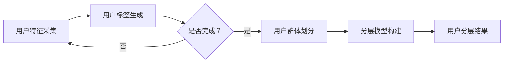

                 

 用户分层是现代商业环境中至关重要的一环，它能够帮助企业和开发者更精准地理解用户需求，提升客户满意度，并优化资源配置。本文将深入探讨如何进行有效的用户分层，包括核心概念、算法原理、数学模型、项目实践和未来展望。

## 文章关键词

用户分层、数据分析、市场营销、个性化服务、机器学习、客户关系管理

## 文章摘要

本文旨在为企业和开发者提供一套全面的用户分层指南。首先，我们将介绍用户分层的背景和重要性。随后，探讨用户分层的关键概念及其相互关系，并利用Mermaid流程图展示用户分层的架构。接下来，我们将详细解析核心算法原理、操作步骤及其优缺点和应用领域。文章的后半部分将介绍数学模型和公式，并通过案例分析和项目实践来加深理解。最后，我们将展望用户分层技术的未来发展趋势和面临的挑战。

## 1. 背景介绍

### 1.1 用户分层的起源

用户分层最早起源于市场营销领域。在传统的市场营销中，企业通过分析消费者的购买行为、兴趣爱好和收入水平等特征，将用户划分为不同的群体，从而进行有针对性的营销活动。随着互联网和大数据技术的发展，用户分层逐渐渗透到各个行业，成为企业精细化运营的重要手段。

### 1.2 用户分层的现代意义

在当今竞争激烈的市场环境中，用户分层具有以下几个方面的现代意义：

1. **提高营销效果**：通过用户分层，企业可以更精准地定位目标客户，制定个性化的营销策略，提高营销转化率。
2. **优化资源配置**：用户分层有助于企业了解不同层级用户的资源需求，合理分配资源，提升运营效率。
3. **增强客户体验**：个性化服务是基于用户分层实现的，能够提升用户满意度，增强用户粘性。
4. **数据驱动决策**：用户分层为数据分析和决策提供了重要依据，帮助企业实现数据驱动运营。

### 1.3 用户分层的应用领域

用户分层在多个领域得到了广泛应用：

1. **电子商务**：电商平台通过对用户行为数据的分析，实现个性化推荐，提升购物体验和销售转化率。
2. **金融行业**：金融机构通过用户分层进行精准营销，提升用户忠诚度和市场份额。
3. **社交媒体**：社交媒体平台利用用户分层，为用户提供定制化内容，增强用户互动和平台活跃度。
4. **健康管理**：健康管理机构通过用户分层，提供个性化的健康建议和医疗服务。

## 2. 核心概念与联系

在进行用户分层之前，需要理解一些核心概念，包括用户特征、用户标签、用户群体和分层模型。

### 2.1 用户特征

用户特征是指用户在行为、偏好、背景等方面的属性，如年龄、性别、地理位置、消费习惯、兴趣爱好等。用户特征是进行用户分层的基础数据。

### 2.2 用户标签

用户标签是对用户特征的高度抽象和总结，通常以键值对的形式存储。例如，一个用户标签可以是“年龄：25-30岁，兴趣爱好：健身、旅游”。

### 2.3 用户群体

用户群体是根据用户特征和标签划分的具有相似属性的用户集合。用户群体可以进一步划分为多个层次，如潜在客户、活跃用户、忠诚用户等。

### 2.4 分层模型

分层模型是对用户群体进行分层的方法和规则。常见的分层模型包括基于用户行为的分层、基于用户价值的分层和基于用户情感的分层等。

### 2.5 Mermaid流程图

下面是一个用户分层架构的Mermaid流程图，展示了用户特征采集、用户标签生成、用户群体划分和分层模型构建的过程。

## 3. 核心算法原理 & 具体操作步骤

### 3.1 算法原理概述

用户分层算法主要基于机器学习和数据分析技术，包括特征提取、模型训练和预测三个阶段。

1. **特征提取**：从用户行为数据、社交数据、交易数据等多维度提取用户特征。
2. **模型训练**：利用特征数据训练机器学习模型，构建用户分层模型。
3. **预测**：将新用户的数据输入模型，预测其所属的用户群体和层级。

### 3.2 算法步骤详解

1. **数据采集与预处理**：
   - 收集用户行为数据、社交数据、交易数据等。
   - 进行数据清洗和预处理，包括数据去重、缺失值填充、异常值处理等。

2. **特征提取**：
   - 利用数据挖掘技术提取用户特征，如用户活跃度、消费频率、浏览时长等。
   - 利用文本挖掘技术提取用户兴趣爱好、情感倾向等。

3. **模型选择与训练**：
   - 选择合适的机器学习模型，如决策树、随机森林、支持向量机等。
   - 使用训练数据集训练模型，调整模型参数，优化模型性能。

4. **分层预测**：
   - 使用训练好的模型对用户数据进行分层预测，确定用户所属的用户群体和层级。
   - 对分层结果进行评估和优化，如调整分层阈值、优化模型参数等。

### 3.3 算法优缺点

1. **优点**：
   - 高效：基于大数据和机器学习技术，能够快速处理海量用户数据。
   - 精准：通过特征提取和模型训练，能够准确划分用户群体和层级。
   - 个性

