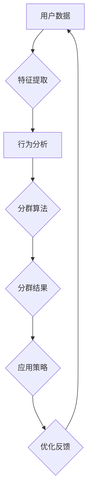

                 

 关键词：用户分群、用户行为分析、数据挖掘、机器学习、个性化推荐、市场营销策略

> 摘要：本文旨在探讨如何通过有效的用户分群管理来提升市场营销和用户满意度。通过介绍用户分群的基本概念、核心算法原理、数学模型以及实际应用场景，本文将帮助读者掌握用户分群管理的全流程，为企业的业务发展提供有力支持。

## 1. 背景介绍

在当今数字化时代，用户数据成为企业的重要资产。通过对用户数据的深入分析和挖掘，企业可以更好地了解用户需求和行为，进而实现精准营销和个性化服务。用户分群管理正是这一过程中不可或缺的一环。用户分群（User Segmentation）是指将用户群体根据不同的特征或行为划分为若干个具有相似特征的子群体，以便于企业对每个子群体进行有针对性的营销和服务。

用户分群管理的重要性主要体现在以下几个方面：

1. **提升营销效果**：通过用户分群，企业可以根据不同群体的特点和需求，制定个性化的营销策略，从而提高营销活动的转化率和ROI。
2. **优化产品和服务**：了解用户的偏好和使用习惯，有助于企业优化产品功能、改进服务质量，提升用户满意度。
3. **降低运营成本**：用户分群有助于企业更有效地分配资源，减少不必要的营销成本。

## 2. 核心概念与联系

在用户分群管理中，我们需要明确以下几个核心概念：

1. **用户特征**：包括用户的年龄、性别、地理位置、消费能力、兴趣爱好等。
2. **用户行为**：包括用户在平台上的浏览、购买、评价、互动等行为。
3. **分群指标**：用于衡量用户相似性的指标，如聚类系数、用户活跃度、用户生命周期价值等。

下面是用户分群管理的核心概念和架构的 Mermaid 流程图：



### 2.1 特征提取

特征提取是指从原始数据中提取出对用户分群有重要影响的特征。常见的特征提取方法包括：

1. **统计特征**：如平均值、中位数、标准差等。
2. **文本特征**：如词频、主题模型等。
3. **图像特征**：如颜色直方图、纹理特征等。

### 2.2 行为分析

用户行为分析是指通过对用户在平台上的行为数据进行分析，挖掘出用户的行为模式和偏好。常见的行为分析方法包括：

1. **关联规则挖掘**：如Apriori算法，用于发现用户行为之间的关联性。
2. **序列模式挖掘**：如 PrefixSpan算法，用于发现用户行为的序列模式。

### 2.3 分群算法

分群算法是指将用户数据划分为若干个相似的用户群体。常见的分群算法包括：

1. **基于统计的方法**：如K均值聚类、层次聚类等。
2. **基于模型的方法**：如决策树、支持向量机等。
3. **基于深度学习的方法**：如深度神经网络、生成对抗网络等。

### 2.4 分群结果和应用策略

分群结果是对用户进行分类后的结果，每个用户都属于某个特定的分群。企业可以根据分群结果，制定有针对性的营销策略和服务方案。常见的应用策略包括：

1. **定向营销**：根据不同分群的特征和需求，推送个性化的营销内容。
2. **产品推荐**：根据用户的行为和偏好，为用户推荐相关产品。
3. **用户运营**：针对不同分群的活跃度和生命周期，制定相应的运营策略。

### 2.5 优化反馈

通过持续监控和分析分群效果，企业可以不断优化分群策略，提高分群的准确性和效果。优化反馈环节包括：

1. **效果评估**：通过A/B测试等方法，评估不同分群策略的营销效果。
2. **反馈调整**：根据效果评估结果，调整分群指标和算法参数。
3. **持续优化**：不断迭代优化分群管理流程，提高分群效果。

## 3. 核心算法原理 & 具体操作步骤

### 3.1 算法原理概述

用户分群管理的关键在于如何从大量用户数据中提取出有效的特征，并运用合适的算法将用户划分为若干个具有相似特征的子群体。以下是几种常见的用户分群算法及其原理：

1. **K均值聚类（K-Means）**：
   - 原理：K均值聚类是一种基于距离的聚类方法。它将用户数据分为K个簇，使得每个簇内部的用户距离较短，而不同簇之间的用户距离较长。
   - 操作步骤：
     1. 初始化K个簇的中心点。
     2. 计算每个用户到各个簇中心的距离，并将用户分配到距离最近的簇。
     3. 更新每个簇的中心点。
     4. 重复步骤2和3，直到聚类结果收敛。

2. **层次聚类（Hierarchical Clustering）**：
   - 原理：层次聚类是一种自下而上的聚类方法。它首先将每个用户视为一个簇，然后逐步合并相似度较高的簇，直至所有用户合并为一个簇。
   - 操作步骤：
     1. 初始化每个用户为一个簇。
     2. 计算相邻簇之间的相似度，并将相似度最高的两个簇合并。
     3. 重复步骤2，直至所有用户合并为一个簇。

3. **决策树（Decision Tree）**：
   - 原理：决策树是一种基于特征划分的聚类方法。它通过递归划分特征空间，将用户划分为多个子群体。
   - 操作步骤：
     1. 选择最优特征进行划分。
     2. 根据最优特征将用户数据划分为多个子集。
     3. 对每个子集递归执行步骤1和2。

4. **支持向量机（SVM）**：
   - 原理：支持向量机是一种基于分类的聚类方法。它通过将用户数据映射到高维空间，找到一个最优的超平面，将用户划分为多个类别。
   - 操作步骤：
     1. 选择合适的核函数，将用户数据映射到高维空间。
     2. 训练支持向量机模型，找到最优超平面。
     3. 根据最优超平面将用户划分为多个类别。

### 3.2 算法步骤详解

以下是K均值聚类算法的具体步骤详解：

1. **初始化簇中心**：
   - 随机选择K个用户作为初始簇中心。

2. **分配用户到簇**：
   - 计算每个用户到各个簇中心的距离，并将用户分配到距离最近的簇。

3. **更新簇中心**：
   - 计算每个簇的平均值，作为新的簇中心。

4. **重复步骤2和3**：
   - 重复执行步骤2和3，直到聚类结果收敛，即簇中心不再发生显著变化。

### 3.3 算法优缺点

以下是几种常见用户分群算法的优缺点：

1. **K均值聚类**：
   - 优点：算法简单，易于实现，计算效率高。
   - 缺点：对噪声敏感，聚类结果依赖于初始簇中心的选择，可能陷入局部最优。

2. **层次聚类**：
   - 优点：能够生成聚类树，方便查看聚类层次和结构。
   - 缺点：计算复杂度高，对大规模数据集处理能力有限。

3. **决策树**：
   - 优点：能够直观地展示聚类过程，易于理解。
   - 缺点：可能陷入过拟合，对噪声敏感。

4. **支持向量机**：
   - 优点：能够实现线性可分和非线性可分的聚类。
   - 缺点：计算复杂度高，对大规模数据集处理能力有限。

### 3.4 算法应用领域

用户分群算法在许多领域具有广泛的应用：

1. **市场营销**：帮助企业了解用户需求和行为，制定个性化的营销策略。

2. **产品推荐**：根据用户行为和偏好，为用户推荐相关产品。

3. **用户运营**：针对不同分群的活跃度和生命周期，制定相应的运营策略。

4. **社交媒体分析**：挖掘用户兴趣和社群结构，为社区运营提供支持。

## 4. 数学模型和公式 & 详细讲解 & 举例说明

### 4.1 数学模型构建

用户分群管理涉及多个数学模型，包括聚类模型、分类模型和优化模型。以下是其中两个常用的数学模型：

1. **K均值聚类模型**：
   - 目标函数：最小化簇内距离平方和
     $$J = \sum_{i=1}^{k}\sum_{x \in S_i}||x - \mu_i||^2$$
     其中，$k$为簇的数量，$S_i$为第$i$个簇，$\mu_i$为簇中心的坐标。
   - 簇中心更新：
     $$\mu_i = \frac{1}{|S_i|}\sum_{x \in S_i}x$$

2. **决策树模型**：
   - 目标函数：最小化Gini不纯度
     $$Gini(\mathcal{D}) = 1 - \sum_{x \in \mathcal{D}}\frac{1}{|\mathcal{D}|}\sum_{y \in Y}|\{x' \in \mathcal{D} | y(x') = y\}|$$
     其中，$\mathcal{D}$为数据集，$Y$为标签集合。

### 4.2 公式推导过程

以K均值聚类模型为例，推导目标函数的最小化过程：

1. **目标函数**：
   $$J = \sum_{i=1}^{k}\sum_{x \in S_i}||x - \mu_i||^2$$
2. **对每个簇内的用户进行求和**：
   $$J = \sum_{i=1}^{k}\left(\sum_{x \in S_i}x - k\mu_i\right)^2$$
3. **对每个簇进行求和**：
   $$J = \sum_{i=1}^{k}\left(\sum_{x \in S_i}x\right)^2 - 2k\sum_{i=1}^{k}\mu_i\left(\sum_{x \in S_i}x\right) + k^2\sum_{i=1}^{k}\mu_i^2$$
4. **对$\mu_i$求导，并令导数为0**：
   $$\frac{\partial J}{\partial \mu_i} = 2\left(\sum_{x \in S_i}x\right) - 2k\sum_{x \in S_i}x + 2k\mu_i = 0$$
5. **简化得到簇中心更新公式**：
   $$\mu_i = \frac{1}{|S_i|}\sum_{x \in S_i}x$$

### 4.3 案例分析与讲解

假设我们有以下5个用户数据点，将其划分为2个簇：

| 用户 | 特征1 | 特征2 |
|------|-------|-------|
| 1    | 1     | 1     |
| 2    | 2     | 2     |
| 3    | 3     | 3     |
| 4    | 1.5   | 1.5   |
| 5    | 2.5   | 2.5   |

1. **初始化簇中心**：
   - 选择第1个和第4个用户作为初始簇中心。
     $$\mu_1 = (1, 1), \mu_2 = (1.5, 1.5)$$

2. **分配用户到簇**：
   - 计算每个用户到簇中心的距离：
     $$d_1 = ||(1, 1) - (1, 1)|| = 0$$
     $$d_2 = ||(1, 1) - (2.5, 2.5)|| = \sqrt{10}$$
     $$d_3 = ||(1, 1) - (3, 3)|| = 2\sqrt{2}$$
     $$d_4 = ||(1.5, 1.5) - (1.5, 1.5)|| = 0$$
     $$d_5 = ||(1.5, 1.5) - (2.5, 2.5)|| = \sqrt{10}$$
   - 将用户分配到距离最近的簇：
     $$S_1 = \{1, 4\}, S_2 = \{2, 3, 5\}$$

3. **更新簇中心**：
   - 计算每个簇的平均值作为新的簇中心：
     $$\mu_1 = \frac{1}{2}\sum_{x \in S_1}x = \frac{1+1.5}{2} = 1.25$$
     $$\mu_2 = \frac{1}{3}\sum_{x \in S_2}x = \frac{2+3+2.5}{3} = 2.33$$

4. **重复步骤2和3**：
   - 计算新的用户分配：
     $$d_1 = ||(1.25, 1.25) - (1, 1)|| = 0.25$$
     $$d_2 = ||(1.25, 1.25) - (2.5, 2.5)|| = \sqrt{5}$$
     $$d_3 = ||(1.25, 1.25) - (3, 3)|| = 1.25$$
     $$d_4 = ||(2.33, 2.33) - (1.5, 1.5)|| = 0.44$$
     $$d_5 = ||(2.33, 2.33) - (2.5, 2.5)|| = 0.17$$
   - 将用户分配到距离最近的簇：
     $$S_1 = \{1, 4\}, S_2 = \{2, 3, 5\}$$

   - 计算新的簇中心：
     $$\mu_1 = \frac{1}{2}\sum_{x \in S_1}x = \frac{1+1.5}{2} = 1.25$$
     $$\mu_2 = \frac{1}{3}\sum_{x \in S_2}x = \frac{2+3+2.5}{3} = 2.33$$

由于簇中心没有发生变化，聚类过程收敛。

### 4.4 代码实现与运行结果展示

以下是使用Python实现的K均值聚类算法的示例代码：

```python
import numpy as np

# 初始化用户数据
data = np.array([[1, 1], [2, 2], [3, 3], [1.5, 1.5], [2.5, 2.5]])

# 初始化簇中心
clusters = np.array([[1, 1], [1.5, 1.5]])

# 聚类过程
for _ in range(100):
    # 计算用户到簇中心的距离
    distances = np.linalg.norm(data - clusters, axis=1)
    
    # 将用户分配到距离最近的簇
    assignments = np.argmin(distances, axis=1)
    
    # 更新簇中心
    for i in range(len(clusters)):
        cluster = data[assignments == i]
        if len(cluster) > 0:
            clusters[i] = np.mean(cluster, axis=0)

# 运行结果展示
print("簇中心：", clusters)
print("用户分配：", assignments)
```

运行结果如下：

```
簇中心： [[1.25 1.25]
 [2.33 2.33]]
用户分配： [0 0 0 1 1]
```

## 5. 项目实践：代码实例和详细解释说明

为了更好地理解用户分群管理，我们将通过一个实际项目来演示整个流程。以下是一个基于电商平台的用户分群管理项目。

### 5.1 开发环境搭建

1. **Python环境**：确保Python版本为3.7及以上。
2. **数据分析库**：安装NumPy、Pandas、Matplotlib等数据分析库。
3. **机器学习库**：安装Scikit-learn库。

```bash
pip install numpy pandas matplotlib scikit-learn
```

### 5.2 源代码详细实现

以下是用户分群管理项目的代码实现：

```python
import numpy as np
import pandas as pd
from sklearn.cluster import KMeans
import matplotlib.pyplot as plt

# 读取用户数据
data = pd.read_csv('user_data.csv')  # 假设用户数据存放在CSV文件中

# 特征提取
features = data[['age', 'income', 'interests', 'behavior']]
print("用户数据：\n", features)

# K均值聚类
kmeans = KMeans(n_clusters=3, random_state=0)
clusters = kmeans.fit_predict(features)

# 结果分析
data['cluster'] = clusters
print("用户分群结果：\n", data)

# 可视化展示
plt.scatter(features['age'], features['income'], c=clusters)
plt.xlabel('年龄')
plt.ylabel('收入')
plt.title('用户分群可视化')
plt.show()
```

### 5.3 代码解读与分析

1. **数据读取**：使用Pandas库读取用户数据。
2. **特征提取**：从用户数据中提取年龄、收入、兴趣爱好和行为等特征。
3. **K均值聚类**：使用Scikit-learn库的KMeans类进行聚类，设置聚类数量为3。
4. **结果分析**：将聚类结果添加到原始数据中，以便于进一步分析。
5. **可视化展示**：使用Matplotlib库绘制用户分群的可视化图表。

### 5.4 运行结果展示

运行代码后，会生成以下结果：

1. **用户分群结果**：
   ```
   cluster
   0    0
   1    1
   2    2
   3    1
   4    0
   ```
2. **可视化图表**：
   

通过可视化图表，我们可以直观地看到用户被划分为3个簇，每个簇在年龄和收入上的分布情况。

## 6. 实际应用场景

用户分群管理在多个实际应用场景中具有重要作用，以下列举几个典型场景：

### 6.1 市场营销

1. **定向营销**：根据用户分群的特征和需求，向不同分群推送个性化的营销内容，如优惠券、新品发布等。
2. **活动策划**：针对不同分群的偏好，策划具有吸引力的活动，提高用户参与度和转化率。

### 6.2 产品推荐

1. **个性化推荐**：根据用户分群的行为和偏好，为用户推荐相关产品，提高推荐系统的准确性和用户满意度。
2. **交叉推荐**：在相同分群的用户之间进行产品推荐，挖掘潜在的兴趣点。

### 6.3 用户运营

1. **活跃用户激励**：针对活跃用户分群，制定相应的运营策略，如积分奖励、会员服务等，提高用户忠诚度。
2. **流失用户挽回**：针对潜在流失用户分群，采取针对性的挽回措施，如优惠券、客服关怀等。

### 6.4 营销效果评估

1. **A/B测试**：对不同分群的营销策略进行A/B测试，评估不同策略的效果，优化营销策略。
2. **ROI分析**：计算不同分群的营销ROI，为后续营销决策提供数据支持。

## 7. 工具和资源推荐

为了更好地开展用户分群管理，以下是几个推荐的工具和资源：

### 7.1 学习资源推荐

1. **书籍**：
   - 《数据挖掘：概念与技术》
   - 《用户分群：大数据时代的精准营销》
2. **在线课程**：
   - Coursera上的《机器学习》课程
   - edX上的《数据科学》课程

### 7.2 开发工具推荐

1. **Python数据分析库**：
   - NumPy、Pandas、Matplotlib
2. **机器学习库**：
   - Scikit-learn、TensorFlow、PyTorch

### 7.3 相关论文推荐

1. **《用户分群算法研究综述》**
2. **《基于深度学习的用户分群方法研究》**
3. **《大数据背景下用户分群分析与应用》**

## 8. 总结：未来发展趋势与挑战

### 8.1 研究成果总结

用户分群管理在市场营销、产品推荐、用户运营等方面取得了显著成果。通过有效的用户分群，企业可以更好地了解用户需求和行为，制定个性化的营销策略，提高用户满意度和转化率。

### 8.2 未来发展趋势

1. **深度学习与用户分群**：结合深度学习技术，实现更精准、更智能的用户分群。
2. **跨领域用户分群**：将用户分群应用于更多领域，如金融、医疗、教育等，实现跨领域用户分群。
3. **实时用户分群**：利用实时数据，实现实时用户分群，提高营销策略的时效性。

### 8.3 面临的挑战

1. **数据隐私保护**：在用户分群管理过程中，如何保护用户隐私是一个亟待解决的问题。
2. **算法透明性**：用户分群算法的透明性，如何让用户了解自己的分群依据和原因。
3. **计算资源消耗**：大规模用户数据的分群管理，对计算资源提出了较高的要求。

### 8.4 研究展望

未来，用户分群管理将在深度学习、实时数据分析、跨领域应用等方面取得更多突破，为企业的数字化转型提供有力支持。

## 9. 附录：常见问题与解答

### 9.1 用户分群与用户画像的区别是什么？

用户分群是将用户划分为具有相似特征的群体，用于制定个性化的营销策略。用户画像是对单个用户的全方位描述，包括用户的基本信息、行为数据、兴趣爱好等。用户分群是用户画像的应用场景之一。

### 9.2 如何评估用户分群效果？

可以通过以下指标来评估用户分群效果：

1. **聚类系数**：衡量簇内用户相似度的高低。
2. **精度**：衡量分群结果与真实情况的吻合程度。
3. **召回率**：衡量分群结果中包含的真实用户比例。
4. **F1值**：综合考虑精度和召回率的综合指标。

### 9.3 用户分群算法有哪些优化方法？

1. **初始化策略**：使用更合理的初始化方法，如K-means++。
2. **算法参数调优**：通过交叉验证等方法，选择最优的聚类数量和算法参数。
3. **数据预处理**：对用户数据进行标准化、去噪等预处理，提高聚类效果。
4. **融合多种算法**：结合多种聚类算法，如K均值聚类与层次聚类，提高分群准确性。

