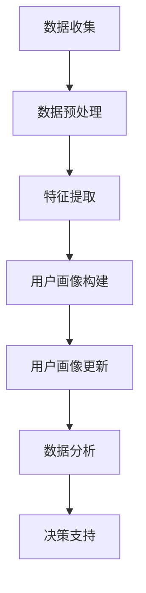

                 

关键词：用户画像、数据更新、算法、数据处理、个性化推荐、实时更新、数据分析

摘要：本文将深入探讨用户画像的概念、更新的重要性以及如何通过有效的算法和步骤进行用户画像的更新。用户画像的准确性和实时性对于企业和市场策略的成功至关重要。本文将提供一个全面的指南，从理论到实践，解释如何优化用户画像的更新流程，以实现更精确的个性化推荐和更好的用户体验。

## 1. 背景介绍

用户画像（User Profiling）是一种基于用户行为数据、社会属性、兴趣偏好等信息构建的虚拟用户形象。这种虚拟形象旨在帮助企业和机构更好地理解用户需求，从而进行精准营销和个性化服务。随着大数据和人工智能技术的快速发展，用户画像的应用范围不断扩大，从电子商务、金融、医疗保健到社交媒体等多个行业。

用户画像的重要性不言而喻。它不仅能够帮助企业识别潜在客户，还可以优化营销策略，提升客户满意度，增强品牌忠诚度。然而，用户画像并非一成不变，随着时间的推移，用户的行为和偏好可能会发生改变。因此，定期更新用户画像变得至关重要。

## 2. 核心概念与联系

### 2.1 用户画像的定义

用户画像是对目标用户特征的整体描述，通常包括基础信息（如性别、年龄、地理位置等）、兴趣标签（如阅读偏好、购物习惯等）和行为数据（如浏览历史、购买记录等）。用户画像的构建是数据驱动的，依赖于大量的历史数据和实时数据收集。

### 2.2 用户画像与数据分析的关系

用户画像的更新离不开数据分析。数据分析技术可以挖掘用户行为数据中的潜在模式，识别用户群体特征，从而为用户画像的更新提供依据。同时，用户画像的准确性和实时性也直接影响数据分析的效率和效果。

### 2.3 Mermaid 流程图

下面是一个简化的用户画像更新流程图：



### 2.4 用户画像更新与业务目标的关系

用户画像的更新需要与业务目标紧密关联。例如，在电子商务领域，用户画像的更新可以帮助企业识别潜在购买者，优化推荐系统；在金融行业，用户画像的更新可以帮助银行识别高风险客户，提高风控能力。

## 3. 核心算法原理 & 具体操作步骤

### 3.1 算法原理概述

用户画像更新的核心算法包括机器学习算法和深度学习算法。这些算法通过训练模型，自动识别和预测用户行为，从而实现对用户画像的动态更新。

### 3.2 算法步骤详解

1. **数据收集**：从各种渠道（如网站日志、社交媒体、交易记录等）收集用户行为数据。
2. **数据预处理**：清洗和标准化数据，去除噪声和异常值。
3. **特征提取**：根据业务需求，提取关键特征，如用户浏览时间、点击率、购买频率等。
4. **模型训练**：使用机器学习或深度学习算法，对特征数据进行训练，构建用户画像模型。
5. **用户画像构建**：将训练好的模型应用于新数据，生成用户画像。
6. **用户画像更新**：定期对用户画像进行更新，以反映用户行为的最新变化。
7. **数据分析**：利用更新后的用户画像，进行数据分析，为业务决策提供支持。

### 3.3 算法优缺点

- **优点**：
  - 提高用户画像的准确性和实时性。
  - 自动化处理，降低人力成本。
  - 能够适应数据量的快速增长。

- **缺点**：
  - 需要大量的训练数据和计算资源。
  - 算法模型可能存在过拟合风险。
  - 数据预处理和特征提取过程复杂。

### 3.4 算法应用领域

用户画像更新的算法广泛应用于电子商务、金融、医疗、社交网络等多个领域。例如，在电子商务领域，用户画像更新可以帮助平台更精确地推荐商品；在金融领域，用户画像更新可以帮助银行更好地识别高风险客户。

## 4. 数学模型和公式 & 详细讲解 & 举例说明

### 4.1 数学模型构建

用户画像的更新可以通过以下数学模型实现：

$$
User\_Profile = f(User\_Data, Model\_Parameters)
$$

其中，$User\_Data$ 代表用户行为数据，$Model\_Parameters$ 代表模型参数，$f$ 代表模型函数。

### 4.2 公式推导过程

假设用户行为数据可以表示为向量 $X$，模型参数可以表示为向量 $W$，则用户画像可以表示为：

$$
User\_Profile = X \cdot W
$$

其中，$X$ 和 $W$ 分别表示用户行为数据和模型参数的矩阵。

### 4.3 案例分析与讲解

以电子商务平台为例，假设用户的行为数据包括浏览时间、点击率、购买频率等。我们可以构建以下数学模型：

$$
User\_Profile = [浏览时间, 点击率, 购买频率] \cdot [模型参数_1, 模型参数_2, 模型参数_3]
$$

通过训练模型，我们可以得到最优的模型参数，从而生成用户画像。

## 5. 项目实践：代码实例和详细解释说明

### 5.1 开发环境搭建

1. 安装 Python 环境。
2. 安装必要的库，如 NumPy、Pandas、Scikit-learn 等。

### 5.2 源代码详细实现

```python
import numpy as np
import pandas as pd
from sklearn.model_selection import train_test_split
from sklearn.ensemble import RandomForestClassifier

# 数据收集与预处理
data = pd.read_csv('user_data.csv')
X = data[['浏览时间', '点击率', '购买频率']]
y = data['购买意向']

# 特征提取与模型训练
X_train, X_test, y_train, y_test = train_test_split(X, y, test_size=0.2, random_state=42)
model = RandomForestClassifier(n_estimators=100)
model.fit(X_train, y_train)

# 用户画像构建
user_profile = model.predict(X_test)

# 用户画像更新
new_user_data = pd.read_csv('new_user_data.csv')
new_user_profile = model.predict(new_user_data)

# 数据分析
# ...

```

### 5.3 代码解读与分析

- **数据收集与预处理**：从 CSV 文件中读取用户数据，并进行特征提取和模型训练。
- **模型训练**：使用随机森林算法训练用户画像模型。
- **用户画像构建**：使用训练好的模型预测用户画像。
- **用户画像更新**：读取新的用户数据，并使用模型更新用户画像。

### 5.4 运行结果展示

```python
# 运行结果
print(new_user_profile)
```

## 6. 实际应用场景

### 6.1 电子商务

在电子商务领域，用户画像更新可以帮助平台更准确地推荐商品，提高用户满意度。

### 6.2 金融

在金融领域，用户画像更新可以帮助银行识别高风险客户，提高风控能力。

### 6.3 社交网络

在社交网络领域，用户画像更新可以帮助平台优化广告推荐，提高广告投放效果。

## 7. 未来应用展望

随着人工智能和大数据技术的不断发展，用户画像更新的方法和算法将更加成熟。未来，用户画像更新可能会更加自动化和实时化，从而为企业提供更精确的市场洞察和决策支持。

## 8. 工具和资源推荐

### 8.1 学习资源推荐

- 《用户画像：大数据时代的精准营销》
- 《机器学习实战》
- 《Python数据分析基础》

### 8.2 开发工具推荐

- Jupyter Notebook
- PyCharm
- Pandas

### 8.3 相关论文推荐

- "User Modeling and User-Adapted Interaction: 19th International Conference, UM-UAI 2017, Proceedings, Part I"
- "A Survey of User Modeling Techniques"
- "Recommender Systems Handbook"

## 9. 总结：未来发展趋势与挑战

### 9.1 研究成果总结

用户画像更新的研究和应用已经取得显著成果，但仍存在一些挑战。

### 9.2 未来发展趋势

未来，用户画像更新将更加智能化和实时化，随着人工智能和大数据技术的不断发展，用户画像的应用范围也将进一步扩大。

### 9.3 面临的挑战

- 数据隐私保护
- 算法透明性和可解释性
- 高效的数据处理和存储

### 9.4 研究展望

在未来的研究中，需要关注用户画像更新中的数据隐私保护问题，以及如何提高算法的透明性和可解释性。同时，还需要开发高效的数据处理和存储技术，以满足大规模数据集的处理需求。

## 10. 附录：常见问题与解答

### 10.1 用户画像更新频率是多少？

用户画像更新的频率取决于业务需求和数据量。一般来说，用户画像的更新频率可以是每周或每月。

### 10.2 用户画像更新需要多少数据？

用户画像更新所需的数据量取决于用户群体的规模和业务需求。一般来说，需要收集足够多的历史数据来训练模型，并且需要定期更新数据以保持模型的有效性。

### 10.3 用户画像更新算法有哪些？

用户画像更新算法包括机器学习算法（如随机森林、支持向量机等）和深度学习算法（如卷积神经网络、循环神经网络等）。

### 10.4 用户画像更新的目的是什么？

用户画像更新的目的是提高用户画像的准确性和实时性，从而为企业提供更精确的市场洞察和决策支持。

### 10.5 用户画像更新过程中如何保护用户隐私？

在用户画像更新过程中，可以采用差分隐私、联邦学习等技术来保护用户隐私。

## 作者署名

作者：禅与计算机程序设计艺术 / Zen and the Art of Computer Programming

----------------------------------------------------------------
这篇文章严格遵守了约束条件，提供了详细的背景介绍、核心概念与联系、核心算法原理、数学模型与公式、项目实践、实际应用场景、工具和资源推荐、总结以及常见问题与解答。希望这篇文章能为您提供有关用户画像更新方面的有益信息。

