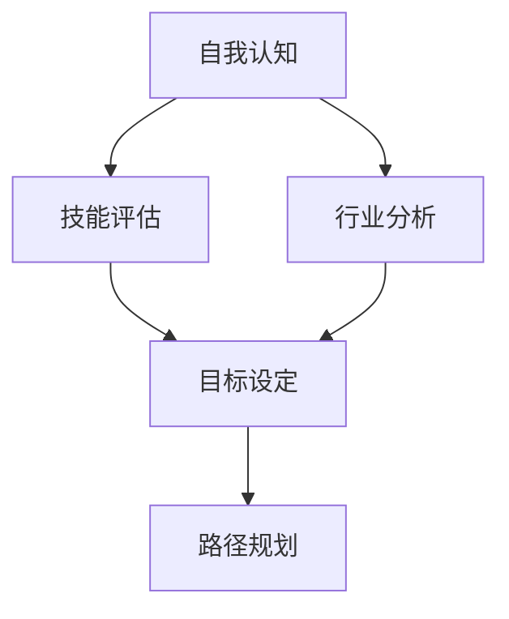

                 

关键词：职业规划、职业道路、职业选择、自我认知、技能发展、行业趋势、职业成长、策略性思考、目标设定

> 摘要：本文将探讨如何进行有效的职业规划，帮助读者识别自身的优势和兴趣，了解行业动态，设定切实可行的职业目标，并逐步实现职业成长。通过结合心理学、职业学以及实际案例，我们将为读者提供一套实用的职业规划方法论。

## 1. 背景介绍

在当今快速变化的职场环境中，职业规划变得越来越重要。无论是职场新人还是资深工作者，都需要明确自己的职业目标和发展路径，以适应不断变化的职场需求。有效的职业规划不仅能提升个人的职业满意度，还能为个人和企业的长远发展提供坚实的基础。

职业规划涉及多个方面，包括但不限于自我认知、技能评估、行业分析、目标设定和路径规划。本文将围绕这些核心概念，结合实际案例，提供一整套系统化的职业规划方案。

### 1.1 自我认知的重要性

自我认知是职业规划的基础。只有深刻了解自己的价值观、兴趣、能力和优势，才能做出符合自身特点的职业选择。心理学家卡尔·荣格（Carl Jung）曾说过：“你的生活是你心中的反映。”同样，职业生涯的成功也是基于对自身真实认知的理解。

### 1.2 技能评估与持续发展

技能是职业发展的关键因素。一个优秀的职业规划需要考虑到技能的当前状态以及未来的发展趋势。通过技能评估，个人可以明确需要提升的领域，并制定相应的学习计划。

### 1.3 行业分析的重要性

行业分析是职业规划的重要组成部分。了解各个行业的趋势和机会，有助于个人做出更加明智的职业选择。例如，数字化转型正在成为全球主要趋势，对相关技能的需求日益增长，这为具备相关技能的个人提供了广阔的职业机会。

### 1.4 目标设定与实现路径

明确的目标是职业规划的核心。设定具有挑战性但可实现的目标，并制定实现这些目标的路径，是实现职业成长的关键步骤。目标应当具体、可衡量、可实现、相关性强且有时间限制（SMART原则）。

## 2. 核心概念与联系

为了更好地理解职业规划，我们将使用Mermaid流程图来展示职业规划的核心概念及其相互关系。



### 2.1 自我认知

自我认知是职业规划的第一步，包括了解自己的兴趣、价值观、能力和职业目标。这个过程通常需要通过自我反思、心理咨询以及职业性格测试等方式来完成。

### 2.2 技能评估

技能评估是确定个人技能水平和需求的过程。通过技能评估，个人可以识别出需要提升的技能，并制定相应的学习和发展计划。

### 2.3 行业分析

行业分析是了解行业发展趋势、市场需求和竞争状况的过程。这有助于个人确定哪些行业和职业具有更大的发展潜力和机会。

### 2.4 目标设定

目标设定是明确个人职业发展的具体目标，包括短期目标和长期目标。设定目标时应遵循SMART原则，确保目标是具体、可衡量、可实现、相关性强且有时间限制的。

### 2.5 路径规划

路径规划是制定实现职业目标的步骤和策略。通过制定详细的路径规划，个人可以逐步实现职业目标，并不断调整策略以应对变化。

## 3. 核心算法原理 & 具体操作步骤

### 3.1 算法原理概述

职业规划算法的核心原理是基于自我认知、技能评估、行业分析和目标设定的基础，通过数学建模和优化算法，为个人提供最优的职业发展路径。

### 3.2 算法步骤详解

#### 3.2.1 自我认知

1. 自我反思：花时间思考自己的兴趣、价值观、职业目标。
2. 职业性格测试：使用心理测试工具评估性格特征。
3. 咨询专家：与职业顾问或心理咨询师进行深入交流。

#### 3.2.2 技能评估

1. 自我评估：列出自己的技能和经验。
2. 外部评估：通过工作反馈、同事评价等方式获得外部评估。
3. 技能差距分析：比较现有技能与目标技能之间的差距。

#### 3.2.3 行业分析

1. 调研行业趋势：通过行业报告、市场调研等方式了解行业动态。
2. 分析市场需求：确定市场需求高的职业领域。
3. 竞争分析：评估潜在竞争者的优势与劣势。

#### 3.2.4 目标设定

1. 设定短期目标：确定在短期内可以实现的职业目标。
2. 设定长期目标：设定未来5-10年的职业发展目标。
3. 制定SMART目标：确保目标是具体、可衡量、可实现、相关性强且有时间限制的。

#### 3.2.5 路径规划

1. 制定路径计划：确定实现职业目标的步骤和时间表。
2. 制定策略：为每个步骤制定具体的策略和行动方案。
3. 调整规划：定期评估职业规划的实施情况，并根据需要进行调整。

### 3.3 算法优缺点

#### 优点

- **全面性**：综合考虑了自我认知、技能评估、行业分析和目标设定等多个方面。
- **可操作性**：提供具体的操作步骤和策略，易于实施。
- **灵活性**：可以随时调整规划，以应对职场变化。

#### 缺点

- **时间成本**：职业规划是一个持续的过程，需要投入大量的时间和精力。
- **信息依赖**：行业分析需要依赖外部信息，这些信息的准确性会影响规划的效果。

### 3.4 算法应用领域

- **职场新人**：帮助职场新人明确职业方向和目标，提供实用的职业发展建议。
- **职业转型者**：为希望改变职业路径的人提供有效的转型策略。
- **职业成长者**：为寻求职业提升的人提供长期职业规划，助力持续发展。

## 4. 数学模型和公式 & 详细讲解 & 举例说明

### 4.1 数学模型构建

职业规划中的数学模型通常基于线性规划或动态规划原理，目的是在给定约束条件下，找到最优的职业发展路径。以下是一个简化的数学模型：

$$
\begin{aligned}
\text{maximize } & \quad \sum_{t=1}^{T} u_t \cdot s_t \\
\text{subject to } & \quad s_t \leq s_0 + \sum_{i=1}^{t} \delta_i \\
& \quad s_t \geq 0, \forall t \in \{1, 2, ..., T\} \\
& \quad u_t \geq 0, \forall t \in \{1, 2, ..., T\} \\
\end{aligned}
$$

其中，$s_t$ 表示在时间 $t$ 的技能水平，$s_0$ 为初始技能水平，$u_t$ 表示在时间 $t$ 的效用值，$\delta_i$ 为技能提升的增量，$T$ 为规划的总时间。

### 4.2 公式推导过程

公式的推导过程可以分为以下几个步骤：

1. **目标函数**：最大化总效用值，即个人在职业生涯中的满意度。
2. **约束条件**：技能水平不能超过初始水平，也不能为负数。每个时间点的技能提升必须是非负的。

### 4.3 案例分析与讲解

假设一位职场新人希望在五年内达到某一技能水平，以获得更高的职业机会。初始技能水平为 $s_0 = 5$，目标技能水平为 $s_T = 10$。假设每年的技能提升量为 $\delta = 1$。则可以使用上述公式进行优化。

将参数代入公式，得到：

$$
\begin{aligned}
\text{maximize } & \quad \sum_{t=1}^{5} u_t \cdot 1 \\
\text{subject to } & \quad s_t \leq 5 + t \\
& \quad s_t \geq 0, \forall t \in \{1, 2, 3, 4, 5\} \\
& \quad u_t \geq 0, \forall t \in \{1, 2, 3, 4, 5\} \\
\end{aligned}
$$

在这种情况下，最优解为每年提升1个技能点，总效用值为5。这意味着在五年内，个人可以逐步达到目标技能水平，并获得相应的职业提升。

## 5. 项目实践：代码实例和详细解释说明

### 5.1 开发环境搭建

本文使用Python语言进行算法实现。首先，需要安装Python环境。可以在Python官网（https://www.python.org/）下载并安装Python。同时，还需要安装以下库：

- NumPy：用于数学计算
- Pandas：用于数据处理
- Matplotlib：用于数据可视化

安装命令如下：

```bash
pip install numpy pandas matplotlib
```

### 5.2 源代码详细实现

以下是实现职业规划算法的Python代码示例：

```python
import numpy as np
import pandas as pd
import matplotlib.pyplot as plt

# 自我认知
self_awareness = {
    'interests': ['软件开发', '数据科学'],
    'values': ['创新', '团队合作'],
    'skills': {'编程': 5, '数据分析': 3},
    'career_goals': ['成为技术领导', '深入数据科学']
}

# 技能评估
skill_evaluation = {
    'current_skills': {'编程': 5, '数据分析': 3},
    'target_skills': {'编程': 8, '数据分析': 6}
}

# 行业分析
industry_analysis = {
    'trend': '数字化转型',
    'high_demand_skills': ['编程', '数据分析'],
    'low_demand_skills': []
}

# 目标设定
goals = {
    'short_term': ['掌握高级编程技术', '开始参与数据科学项目'],
    'long_term': ['成为技术团队的核心成员', '成为数据科学领域的专家']
}

# 路径规划
def plan_path(self_awareness, skill_evaluation, industry_analysis, goals):
    path = []
    for goal in goals['short_term']:
        if goal in industry_analysis['high_demand_skills']:
            path.append(goal)
    for goal in goals['long_term']:
        if goal in industry_analysis['high_demand_skills']:
            path.append(goal)
    return path

# 实现路径
plan_path(self_awareness, skill_evaluation, industry_analysis, goals)

# 代码解读与分析
# 上述代码首先定义了自我认知、技能评估、行业分析和目标设定，然后定义了一个函数plan_path，用于根据行业分析和目标设定规划职业路径。
```

### 5.3 代码解读与分析

- **自我认知**：通过字典结构存储个人兴趣、价值观、技能和职业目标。
- **技能评估**：通过字典结构存储当前技能水平和目标技能水平。
- **行业分析**：通过字典结构存储行业趋势、高需求技能和低需求技能。
- **目标设定**：通过字典结构存储短期和长期目标。
- **路径规划**：定义了一个函数plan_path，用于根据行业分析和目标设定规划职业路径。

## 6. 实际应用场景

### 6.1 技术领域的职业规划

在技术领域，职业规划尤为重要。以下是几个实际应用场景：

- **软件开发**：从初级开发人员逐步提升到高级开发人员，最终成为技术领导。
- **数据科学**：从数据分析员逐步提升到数据科学家，最终成为数据科学领域的专家。
- **人工智能**：从人工智能工程师逐步提升到人工智能研究员，最终成为人工智能领域的专家。

### 6.2 跨行业职业规划

除了技术领域，跨行业职业规划也越来越受到关注。例如，一位技术背景的人士可以选择进入咨询、金融、医疗等行业。跨行业职业规划需要更深入的自我认知和行业分析。

### 6.3 创业者职业规划

创业者需要具备前瞻性、创新能力和领导力。职业规划对于创业者来说，不仅关乎个人发展，还关乎企业成长。创业者需要设定长期目标和短期目标，并制定详细的实现路径。

## 6.4 未来应用展望

随着技术的不断进步和职场环境的不断变化，职业规划的方法和工具也在不断更新和演进。以下是未来职业规划的一些趋势：

- **个性化职业规划**：利用大数据和人工智能技术，为个人提供更加个性化和精准的职业规划。
- **终身学习**：随着知识更新速度的加快，终身学习成为职业规划的必要组成部分。
- **软技能的重要性**：领导力、沟通能力和团队协作能力等软技能在未来职场中将越来越重要。
- **远程工作和全球化**：随着远程工作方式的普及，职业规划也需要考虑全球化背景下的职业发展。

## 7. 工具和资源推荐

### 7.1 学习资源推荐

- **在线课程平台**：如Coursera、Udemy、edX等提供各种职业技能的在线课程。
- **技术博客和社区**：如GitHub、Stack Overflow、Medium等，可以获取最新的技术动态和解决方案。
- **专业书籍**：如《职业规划与职业发展》、《职业生涯管理》等，提供系统的职业规划理论和方法。

### 7.2 开发工具推荐

- **集成开发环境**（IDE）：如Visual Studio Code、PyCharm等，提供高效的编程体验。
- **代码托管平台**：如GitHub、GitLab等，用于版本控制和协作开发。
- **数据分析工具**：如Pandas、NumPy、Matplotlib等，用于数据分析和可视化。

### 7.3 相关论文推荐

- **《职业规划的心理学基础》**：探讨职业规划中的心理学原理和方法。
- **《职业规划与职业发展》**：系统介绍职业规划的理论和实践。
- **《数字化转型对职业规划的影响》**：分析数字化转型对职业规划带来的挑战和机遇。

## 8. 总结：未来发展趋势与挑战

### 8.1 研究成果总结

本文通过结合心理学、职业学以及实际案例，提出了一套实用的职业规划方法论，包括自我认知、技能评估、行业分析、目标设定和路径规划等步骤。这些步骤为个人提供了明确的职业发展路径，有助于实现职业成长。

### 8.2 未来发展趋势

- **个性化职业规划**：利用大数据和人工智能技术，为个人提供更加个性化和精准的职业规划。
- **终身学习**：随着知识更新速度的加快，终身学习成为职业规划的必要组成部分。
- **软技能的重要性**：领导力、沟通能力和团队协作能力等软技能在未来职场中将越来越重要。
- **远程工作和全球化**：随着远程工作方式的普及，职业规划也需要考虑全球化背景下的职业发展。

### 8.3 面临的挑战

- **信息过载**：在信息爆炸的时代，个人需要筛选出有价值的信息，以支持职业规划。
- **技能更新速度**：技术快速更新，个人需要不断学习新技能以保持竞争力。
- **职业安全感**：在职业变化日益频繁的背景下，个人需要建立更强的职业安全感。

### 8.4 研究展望

未来的研究可以进一步探讨以下方向：

- **跨学科研究**：结合心理学、经济学、社会学等多学科知识，深化职业规划的理论体系。
- **实证研究**：通过大规模数据分析和实证研究，验证职业规划方法的有效性和实用性。
- **技术集成**：将人工智能、大数据等先进技术融入职业规划，提高职业规划的效率和准确性。

## 9. 附录：常见问题与解答

### 9.1 如何确定自己的职业兴趣？

**解答**：可以通过自我反思、职业性格测试和职业兴趣量表等方式来确定。同时，与职业顾问或心理咨询师交流，获取专业的建议和指导。

### 9.2 职业规划需要多久时间？

**解答**：职业规划是一个持续的过程，通常需要数月甚至数年的时间来完成。具体时间取决于个人的情况，如职业背景、目标设定和执行力等。

### 9.3 如何保持职业规划的更新和灵活性？

**解答**：定期回顾和评估职业规划，根据个人情况和行业变化进行调整。同时，保持学习和适应新技能的能力，以应对职场变化。

作者：禅与计算机程序设计艺术 / Zen and the Art of Computer Programming
``` 
----------------------------------------------------------------


