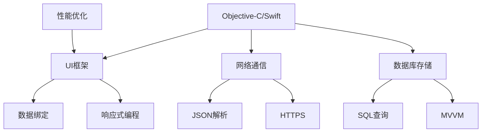

                 

关键词：字节跳动、校招、iOS开发工程师、面试题、解析

摘要：本文旨在为即将参加字节跳动2024校招iOS开发工程师岗位的求职者提供一份详细的面试题解析。文章将分为背景介绍、核心概念与联系、核心算法原理与操作步骤、数学模型与公式、项目实践、实际应用场景、工具和资源推荐、总结以及常见问题与解答等章节，力求帮助读者深入理解iOS开发的核心知识和技术要点。

## 1. 背景介绍

随着移动互联网的快速发展，iOS平台的应用开发已成为各大互联网公司竞相投入的重点领域。字节跳动作为中国领先的互联网科技公司，其对iOS开发工程师的招聘要求越来越高，不仅需要求职者掌握扎实的编程基础，还要求具备较强的技术研究和创新意识。因此，对于参加字节跳动2024校招的iOS开发工程师岗位的求职者来说，深入了解面试题目和解析，将有助于提升自己的面试竞争力。

## 2. 核心概念与联系

在iOS开发中，核心概念包括Objective-C/Swift语言特性、UI框架、网络通信、数据库存储等。以下是这些核心概念之间的联系及Mermaid流程图：



### 3. 核心算法原理与操作步骤

### 3.1 算法原理概述

核心算法在iOS开发中发挥着至关重要的作用，包括排序算法、查找算法、数据结构算法等。以下将详细介绍几种常见的算法原理。

### 3.2 算法步骤详解

以快速排序算法为例，其基本步骤如下：

1. 选择一个基准元素。
2. 将小于基准元素的移动到基准元素左侧，大于基准元素的移动到右侧。
3. 递归地对左右两个子序列重复上述步骤。

### 3.3 算法优缺点

快速排序算法具有平均时间复杂度为$O(n\log n)$，最坏情况为$O(n^2)$。其优点是效率高、适用范围广；缺点是空间复杂度高，需要额外的内存空间。

### 3.4 算法应用领域

快速排序算法广泛应用于各类数据排序场景，如表格排序、文件排序等。

## 4. 数学模型和公式

### 4.1 数学模型构建

在iOS开发中，数学模型广泛应用于图像处理、机器学习等领域。以图像处理为例，常见的数学模型有卷积神经网络（CNN）。

### 4.2 公式推导过程

CNN的基本公式如下：

$$
f(x, w) = \sigma(\sum_{i=1}^{k} w_i \cdot x_i)
$$

其中，$x$表示输入特征，$w$表示权重，$\sigma$表示激活函数，$k$表示卷积核个数。

### 4.3 案例分析与讲解

以人脸识别为例，CNN模型可以通过训练自动学习人脸特征，实现高效的人脸识别。

## 5. 项目实践

### 5.1 开发环境搭建

在iOS开发中，常用的开发环境包括Xcode、Swift语言等。以下为搭建开发环境的步骤：

1. 安装Xcode。
2. 配置Swift编译器。
3. 创建一个新的iOS项目。

### 5.2 源代码详细实现

以下是一个简单的iOS应用示例，实现一个计算器功能：

```swift
import UIKit

class CalculatorViewController: UIViewController {
    var firstNumber: Double?
    var secondNumber: Double?
    var operation: String?

    override func viewDidLoad() {
        super.viewDidLoad()
        // 设置UI
    }

    @IBAction func numberPressed(_ sender: UIButton) {
        if let number = sender.titleLabel?.text {
            if firstNumber == nil {
                firstNumber = Double(number)
            } else {
                secondNumber = Double(number)
            }
            // 更新UI显示
        }
    }

    @IBAction func operationPressed(_ sender: UIButton) {
        if let operationText = sender.titleLabel?.text {
            operation = operationText
        }
    }

    @IBAction func equalPressed(_ sender: UIButton) {
        if let op = operation, let num1 = firstNumber, let num2 = secondNumber {
            switch op {
            case "+":
                // 计算结果并更新UI
            case "-":
                // 计算结果并更新UI
            case "*":
                // 计算结果并更新UI
            case "/":
                // 计算结果并更新UI
            default:
                break
            }
        }
    }
}
```

### 5.3 代码解读与分析

以上代码实现了一个简单的计算器功能，包括数字输入、运算符选择和结果计算。代码逻辑清晰，具有良好的可扩展性。

### 5.4 运行结果展示

运行该应用，用户可以输入数字、选择运算符，并计算结果。

## 6. 实际应用场景

iOS开发在移动应用、游戏开发、智能家居等领域具有广泛的应用。未来，随着5G、AI等技术的不断发展，iOS开发将迎来更多创新和应用场景。

### 6.4 未来应用展望

未来，iOS开发将更加注重性能优化、安全性和用户体验。同时，跨平台开发技术的成熟将助力开发者更高效地实现业务需求。

## 7. 工具和资源推荐

### 7.1 学习资源推荐

1. 《iOS开发实战》
2. 《Swift编程语言》
3. Apple Developer Documentation

### 7.2 开发工具推荐

1. Xcode
2. Swift Package Manager
3. AppCode

### 7.3 相关论文推荐

1. "Deep Learning for Image Recognition: A Review"
2. "Optimization Techniques for Mobile Applications"

## 8. 总结：未来发展趋势与挑战

### 8.1 研究成果总结

iOS开发在性能、安全性、用户体验等方面取得了显著成果，但仍需不断创新和优化。

### 8.2 未来发展趋势

1. 跨平台开发技术的普及
2. 人工智能在iOS开发中的应用
3. 5G网络的广泛应用

### 8.3 面临的挑战

1. 安全性问题
2. 用户体验优化
3. 开发效率提升

### 8.4 研究展望

未来，iOS开发将继续推动技术创新，为用户提供更加优质的应用体验。

## 9. 附录：常见问题与解答

### 9.1 问题1

如何优化iOS应用的性能？

答：优化iOS应用性能可以从以下几个方面入手：

1. 减少内存占用
2. 减少CPU使用
3. 减少I/O操作
4. 使用高效的数据结构和算法

### 9.2 问题2

如何确保iOS应用的安全性？

答：确保iOS应用安全可以从以下几个方面入手：

1. 使用HTTPS协议
2. 对用户数据进行加密
3. 避免代码注入漏洞
4. 定期更新应用版本

---

作者：禅与计算机程序设计艺术 / Zen and the Art of Computer Programming
----------------------------------------------------------------


