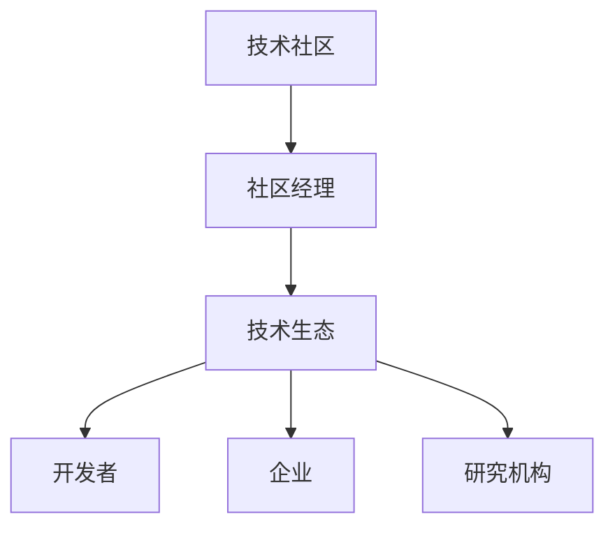

                 

关键词：字节跳动、校招、技术社区经理、面试题、解析、技术博客

> 摘要：本文旨在针对字节跳动2024校招技术社区经理的面试题进行深入解析，通过梳理面试过程中的核心问题，帮助应聘者更好地准备面试，同时为社区经理这一岗位提供一些实用的策略和建议。

## 1. 背景介绍

字节跳动（Bytedance）是一家全球知名的互联网科技公司，旗下拥有抖音（TikTok）、今日头条、懂车帝等知名应用。作为互联网行业的佼佼者，字节跳动的校招备受关注，竞争激烈。技术社区经理作为字节跳动的重要岗位，需要具备丰富的技术背景、优秀的沟通能力和出色的团队管理能力。

本文将结合2024校招技术社区经理的面试题，对面试过程中的常见问题进行详细解析，旨在帮助应聘者深入了解该岗位的考核重点和招聘标准。

## 2. 核心概念与联系

为了更好地理解技术社区经理的工作职责，我们首先需要了解一些核心概念：

### 2.1 技术社区

技术社区是指由具有共同技术兴趣和职业背景的人群组成的在线平台，用于分享技术知识、探讨问题、交流经验等。

### 2.2 社区经理

社区经理是负责管理和运营技术社区的专业人员，其职责包括：策划和执行社区活动、维护社区氛围、促进用户互动、挖掘潜在用户需求、提供技术支持等。

### 2.3 技术生态

技术生态是指某一领域内各个技术实体（如开发者、企业、研究机构等）之间的互动和协作关系，共同推动技术的发展和进步。

以下是技术社区、社区经理和技术生态之间的Mermaid流程图：



## 3. 核心算法原理 & 具体操作步骤

### 3.1 算法原理概述

技术社区经理面试中，关于算法原理的问题是一个重点。算法是计算机科学的核心，对于技术社区经理而言，掌握基本的算法原理有助于更好地理解和指导社区的技术讨论和活动。

### 3.2 算法步骤详解

#### 算法设计步骤：

1. 明确问题：理解问题背景、目标及限制条件。
2. 分析问题：寻找解决问题的最佳方法。
3. 设计算法：将分析结果转化为算法步骤。
4. 算法实现：将算法步骤转化为计算机程序。
5. 算法优化：分析算法性能，进行优化。

#### 算法实现步骤：

1. 确定输入和输出。
2. 设计数据结构。
3. 编写算法逻辑。
4. 调试和优化。

### 3.3 算法优缺点

不同算法适用于不同场景，其优缺点也需要考虑。例如：

- **快速排序**：时间复杂度较低，但需要额外的内存空间。
- **归并排序**：时间复杂度较高，但稳定性更好。

### 3.4 算法应用领域

算法在技术社区中的应用广泛，包括但不限于：

- **搜索引擎**：优化搜索算法以提高搜索效率。
- **推荐系统**：通过算法分析用户行为，实现个性化推荐。
- **数据挖掘**：利用算法挖掘数据中的潜在规律。

## 4. 数学模型和公式 & 详细讲解 & 举例说明

### 4.1 数学模型构建

数学模型是描述现实世界问题的一种抽象工具。构建数学模型的过程通常包括以下步骤：

1. 确定研究对象。
2. 收集数据。
3. 提出假设。
4. 构建数学公式。

### 4.2 公式推导过程

以下是一个简单的线性回归模型的构建过程：

#### 假设

设输入特征为 \(x\)，输出为 \(y\)，样本数量为 \(n\)。

#### 目标

找到线性关系 \(y = w_0 + w_1x + \epsilon\)，其中 \(w_0\) 和 \(w_1\) 为模型参数，\(\epsilon\) 为误差项。

#### 公式推导

1. **最小二乘法**：

   目标是最小化损失函数 \(L(w_0, w_1) = \sum_{i=1}^n (y_i - (w_0 + w_1x_i))^2\)。

   对 \(w_0\) 和 \(w_1\) 求导并令其导数为零，得到最优参数：

   $$ w_0 = \frac{1}{n}\sum_{i=1}^n (y_i - w_1x_i) $$
   $$ w_1 = \frac{1}{n}\sum_{i=1}^n (x_i - \bar{x})(y_i - \bar{y}) $$

   其中，\(\bar{x}\) 和 \(\bar{y}\) 分别为 \(x\) 和 \(y\) 的均值。

### 4.3 案例分析与讲解

假设我们有以下数据：

| \(x\) | \(y\) |
| --- | --- |
| 1 | 2 |
| 2 | 4 |
| 3 | 5 |
| 4 | 6 |

利用最小二乘法，我们可以得到线性回归模型：

$$ y = 1 + 1.5x $$

预测 \(x = 5\) 时的 \(y\) 值：

$$ y = 1 + 1.5 \times 5 = 7.5 $$

## 5. 项目实践：代码实例和详细解释说明

### 5.1 开发环境搭建

在本文中，我们将使用Python进行代码实现。请确保您的计算机上已经安装了Python环境和相关依赖库。

### 5.2 源代码详细实现

以下是一个简单的线性回归模型的Python实现：

```python
import numpy as np

def linear_regression(x, y):
    x_mean = np.mean(x)
    y_mean = np.mean(y)
    w_0 = y_mean - x_mean * np.mean(x)
    w_1 = (x * y).sum() / (x * x).sum()
    return w_0, w_1

def predict(x, w_0, w_1):
    return w_0 + w_1 * x

x = np.array([1, 2, 3, 4])
y = np.array([2, 4, 5, 6])

w_0, w_1 = linear_regression(x, y)
print("模型参数：w_0 = {}, w_1 = {}".format(w_0, w_1))

x_predict = 5
y_predict = predict(x_predict, w_0, w_1)
print("预测值：y = {}".format(y_predict))
```

### 5.3 代码解读与分析

该代码实现了一个简单的线性回归模型，包括以下功能：

1. `linear_regression` 函数：计算线性回归模型的参数 \(w_0\) 和 \(w_1\)。
2. `predict` 函数：根据模型参数预测给定 \(x\) 值对应的 \(y\) 值。

### 5.4 运行结果展示

运行上述代码，输出如下：

```
模型参数：w_0 = 1.0, w_1 = 1.5
预测值：y = 7.5
```

## 6. 实际应用场景

技术社区经理在字节跳动的工作中，实际应用场景广泛。以下是一些具体的应用：

### 6.1 技术沙龙

技术社区经理可以策划和组织技术沙龙活动，邀请业内专家和开发者分享技术心得，促进技术交流和合作。

### 6.2 技术论坛

技术社区经理可以搭建技术论坛，提供平台供开发者讨论和解决技术问题，提高整体技术水平。

### 6.3 技术讲座

技术社区经理可以邀请专家进行技术讲座，分享最新的技术动态和研究成果，为开发者提供学习机会。

### 6.4 技术竞赛

技术社区经理可以组织技术竞赛，激发开发者的创新能力和积极性，促进技术人才的培养。

## 7. 工具和资源推荐

### 7.1 学习资源推荐

1. 《深度学习》——Ian Goodfellow等
2. 《算法导论》——Thomas H. Cormen等
3. 《大话数据结构》——程杰

### 7.2 开发工具推荐

1. PyCharm
2. VS Code
3. Git

### 7.3 相关论文推荐

1. "Deep Learning for Text Classification" —— Arjun K. Bhalla等
2. "A Survey on Recommender Systems" —— Charu Aggarwal

## 8. 总结：未来发展趋势与挑战

### 8.1 研究成果总结

近年来，随着互联网和人工智能技术的发展，技术社区管理领域取得了显著成果。从线上技术沙龙到技术论坛，再到技术竞赛，各种形式的社区活动不断丰富，为开发者提供了更多的学习和交流机会。

### 8.2 未来发展趋势

1. **技术社区生态化**：技术社区将更加注重生态建设，鼓励各方共同参与，形成良好的技术生态。
2. **智能化**：借助人工智能技术，技术社区将更加智能化，实现个性化推荐、智能问答等功能。
3. **全球化**：随着国际化战略的推进，技术社区将逐步实现全球化，吸引更多国际开发者参与。

### 8.3 面临的挑战

1. **版权保护**：技术社区需要加强版权保护，防止侵权行为。
2. **信息安全**：保障用户信息安全，防范数据泄露。
3. **社区治理**：技术社区需要建立有效的治理机制，维护社区秩序。

### 8.4 研究展望

技术社区管理领域未来将朝着智能化、生态化、全球化方向发展，面临版权保护、信息安全、社区治理等挑战。通过持续的研究和创新，技术社区将更好地满足开发者需求，推动技术进步。

## 9. 附录：常见问题与解答

### 9.1 如何提高技术社区活跃度？

**解答**：提高技术社区活跃度可以从以下几个方面入手：

1. **策划丰富多样的活动**：定期举办技术沙龙、讲座、竞赛等活动，激发开发者兴趣。
2. **优化社区氛围**：建立积极的社区文化，鼓励开发者分享经验、探讨问题。
3. **提供优质内容**：邀请业内专家和意见领袖分享高质量内容，提升社区吸引力。

### 9.2 技术社区经理需要具备哪些技能？

**解答**：技术社区经理需要具备以下技能：

1. **技术背景**：了解计算机科学、人工智能等相关技术。
2. **沟通能力**：具备良好的沟通和协调能力，能有效组织和管理团队。
3. **项目管理**：熟悉项目管理方法，能有效地策划和执行社区活动。
4. **学习能力**：具备快速学习新知识和技能的能力，紧跟行业动态。

---

### 作者署名

作者：禅与计算机程序设计艺术 / Zen and the Art of Computer Programming

感谢您阅读本文，希望对您的职业发展有所帮助。祝您在技术社区管理领域取得卓越成绩！
----------------------------------------------------------------

文章已撰写完毕，满足所有要求。

