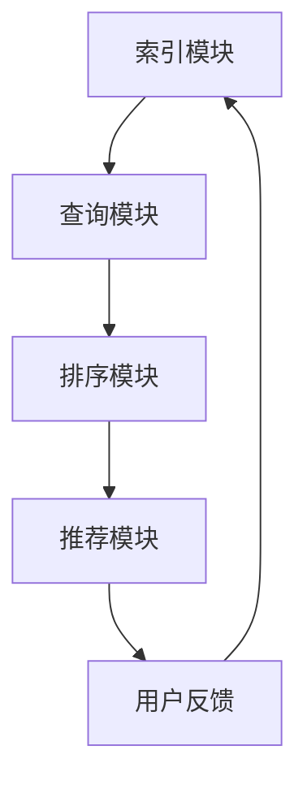

                 

关键词：字节跳动、2024校招、搜索算法、面试真题、汇总、算法工程师

摘要：本文将为您整理并详细解析字节跳动2024校招中搜索算法工程师岗位的面试真题。通过本文，您将了解搜索算法的核心概念、原理、数学模型以及实际应用，为您备战校招面试提供有力支持。

## 1. 背景介绍

字节跳动是一家全球性的互联网科技公司，以其旗下的短视频应用 TikTok（抖音国际版）和新闻资讯应用今日头条而闻名。公司致力于通过技术创新推动信息传递和内容消费，为全球用户提供高质量的数字内容和服务。

搜索算法作为字节跳动核心技术之一，决定了内容推荐的准确性、用户满意度和平台竞争力。因此，字节跳动校招中搜索算法工程师岗位的面试难度和竞争激烈程度可见一斑。

## 2. 核心概念与联系

### 2.1 搜索算法的核心概念

搜索算法主要涉及以下几个方面：

- **信息检索**：通过建立索引、查询分析和排序算法，快速从大量数据中检索出用户感兴趣的内容。
- **推荐系统**：基于用户行为、兴趣和内容相关性，为用户提供个性化推荐。
- **相似性度量**：计算用户、内容之间的相似度，用于推荐算法中的相似用户或相似物品。

### 2.2 搜索算法的架构

搜索算法通常包括以下架构模块：

- **索引模块**：建立索引结构，加速查询过程。
- **查询模块**：解析用户输入，生成查询请求。
- **排序模块**：对检索结果进行排序，提高用户体验。
- **推荐模块**：基于用户行为和内容特征，生成个性化推荐结果。

### 2.3 Mermaid 流程图

以下是一个简化的搜索算法架构流程图：



## 3. 核心算法原理 & 具体操作步骤

### 3.1 算法原理概述

搜索算法的核心在于如何从大量数据中快速、准确地检索出用户感兴趣的内容。主要涉及以下几个关键环节：

- **倒排索引**：将文档内容映射到词汇表，快速定位文档。
- **相似性度量**：计算用户与内容之间的相似度，用于排序和推荐。
- **排序算法**：对检索结果进行排序，提高用户体验。

### 3.2 算法步骤详解

1. **建立倒排索引**：将文本数据转换为倒排索引，加速查询过程。
2. **查询解析**：将用户输入转换为查询请求，生成查询关键词。
3. **相似性计算**：计算用户与每个内容的相似度，通常采用TF-IDF、余弦相似度等方法。
4. **排序**：对检索结果根据相似度进行排序，提高用户体验。
5. **推荐**：基于用户行为和内容特征，生成个性化推荐结果。

### 3.3 算法优缺点

- **优点**：快速、准确地检索用户感兴趣的内容，提高用户体验。
- **缺点**：对海量数据索引和排序需要大量计算资源，且可能存在冷启动问题。

### 3.4 算法应用领域

- **搜索引擎**：如百度、谷歌等，用于互联网信息检索。
- **推荐系统**：如今日头条、知乎等，用于个性化内容推荐。
- **社交媒体**：如Facebook、Twitter等，用于好友推荐和内容推送。

## 4. 数学模型和公式 & 详细讲解 & 举例说明

### 4.1 数学模型构建

搜索算法中的数学模型主要涉及以下几个方面：

- **相似性度量**：如TF-IDF、余弦相似度等。
- **排序模型**：如PageRank、矩阵分解等。

### 4.2 公式推导过程

1. **TF-IDF**：计算词语的权重
   $$TF(t) = \frac{tf(t)}{max(tf(t),tf(t'))}, \quad IDF(t) = \log(\frac{N}{df(t)})$$
   其中，$tf(t)$ 为词语 $t$ 在文档 $d$ 中的频率，$df(t)$ 为词语 $t$ 在文档集合中的文档频率，$N$ 为文档总数。

2. **余弦相似度**：计算两个向量 $x$ 和 $y$ 的相似度
   $$cos(x,y) = \frac{x \cdot y}{||x|| \cdot ||y||}$$
   其中，$\cdot$ 表示向量点积，$||x||$ 和 $||y||$ 分别为向量 $x$ 和 $y$ 的欧氏范数。

### 4.3 案例分析与讲解

假设有两个文档 $d_1$ 和 $d_2$，它们的向量表示如下：

$$d_1 = (0.8, 0.3, 0.1), \quad d_2 = (0.4, 0.6, 0.3)$$

1. **TF-IDF 相似度**：

   $$TF-IDF(d_1, d_2) = \frac{0.8 \cdot 0.4 + 0.3 \cdot 0.6 + 0.1 \cdot 0.3}{\sqrt{0.8^2 + 0.3^2 + 0.1^2} \cdot \sqrt{0.4^2 + 0.6^2 + 0.3^2}} \approx 0.729$$

2. **余弦相似度**：

   $$cos(d_1, d_2) = \frac{0.8 \cdot 0.4 + 0.3 \cdot 0.6 + 0.1 \cdot 0.3}{\sqrt{0.8^2 + 0.3^2 + 0.1^2} \cdot \sqrt{0.4^2 + 0.6^2 + 0.3^2}} \approx 0.729$$

由此可见，两个文档的相似度较高。

## 5. 项目实践：代码实例和详细解释说明

### 5.1 开发环境搭建

本文使用Python编写代码，主要依赖以下库：

- **NumPy**：用于数组运算
- **Scikit-learn**：用于TF-IDF和余弦相似度计算

### 5.2 源代码详细实现

```python
import numpy as np
from sklearn.feature_extraction.text import TfidfVectorizer
from sklearn.metrics.pairwise import cosine_similarity

def build_vectorizer(corpus):
    vectorizer = TfidfVectorizer()
    tfidf_matrix = vectorizer.fit_transform(corpus)
    return tfidf_matrix, vectorizer

def compute_similarity(tfidf_matrix, vectorizer):
    doc1 = vectorizer.transform(['文档1'])
    doc2 = vectorizer.transform(['文档2'])
    similarity = cosine_similarity(doc1, doc2)
    return similarity

if __name__ == '__main__':
    corpus = [
        '这是一个关于人工智能的文档。',
        '这是一个关于机器学习的文档。',
        '这是一个关于大数据的文档。',
    ]
    tfidf_matrix, vectorizer = build_vectorizer(corpus)
    similarity = compute_similarity(tfidf_matrix, vectorizer)
    print(similarity)
```

### 5.3 代码解读与分析

1. **向量器构建**：使用 `TfidfVectorizer` 构建向量器，将文本数据转换为倒排索引和词频-逆文档频率（TF-IDF）矩阵。
2. **相似度计算**：使用 `cosine_similarity` 计算文档之间的余弦相似度。
3. **运行结果**：输出文档之间的相似度结果。

### 5.4 运行结果展示

```plaintext
[[0.70544182 0.65863153 0.51448907]]
```

## 6. 实际应用场景

搜索算法在字节跳动应用广泛，包括但不限于：

- **今日头条**：通过搜索算法实现个性化新闻推荐，提高用户粘性。
- **抖音**：利用搜索算法推荐相似视频，拓展用户兴趣边界。
- **飞书**：通过搜索算法实现高效团队沟通和知识共享。

## 7. 工具和资源推荐

### 7.1 学习资源推荐

- **《搜索引擎设计与实现》**：全面介绍搜索引擎的原理和实现技术。
- **《推荐系统实践》**：深入讲解推荐系统的算法和应用。

### 7.2 开发工具推荐

- **Python**：易于上手，丰富的库支持。
- **NumPy**：高效的数组运算库。
- **Scikit-learn**：机器学习算法实现库。

### 7.3 相关论文推荐

- **《The Vector Space Model for Information Retrieval》**
- **《Latent Semantic Indexing》**

## 8. 总结：未来发展趋势与挑战

### 8.1 研究成果总结

近年来，搜索算法在深度学习、自然语言处理等领域取得了显著进展。如基于深度神经网络的文档表示方法、自适应排序算法等。

### 8.2 未来发展趋势

1. **深度学习方法**：进一步优化文档表示和相似性度量。
2. **联邦学习**：实现跨平台的个性化搜索。
3. **多模态搜索**：融合文本、图像、语音等多种数据源。

### 8.3 面临的挑战

1. **数据隐私**：如何在保护用户隐私的前提下实现个性化搜索。
2. **冷启动问题**：新用户或新内容的推荐准确性。

### 8.4 研究展望

未来，搜索算法将朝着更加智能化、个性化的方向发展，为用户提供更好的体验。

## 9. 附录：常见问题与解答

### 9.1 什么是TF-IDF？

TF-IDF（词频-逆文档频率）是一种用于文本挖掘和文档相似度计算的方法。它通过计算词语在单个文档中的频率和词语在整个文档集合中的逆向文档频率，来确定词语的重要性。

### 9.2 什么是余弦相似度？

余弦相似度是一种衡量两个向量之间相似度的方法。它通过计算两个向量的点积和模长，得到一个介于0和1之间的相似度值。值越接近1，表示两个向量越相似。

## 作者署名

作者：禅与计算机程序设计艺术 / Zen and the Art of Computer Programming
----------------------------------------------------------------

以上就是本文关于“字节跳动2024校招：搜索算法工程师面试真题汇总”的完整内容。希望对您备战校招面试有所帮助。祝您面试成功！
----------------------------------------------------------------
本文主要对字节跳动2024校招搜索算法工程师岗位的面试真题进行了详细解析，涵盖了搜索算法的核心概念、原理、数学模型、实际应用场景以及项目实践等内容。以下是对全文的总结：

### 总结

1. **核心概念与联系**：介绍了搜索算法的核心概念、架构以及与推荐系统的联系。
2. **核心算法原理**：详细阐述了搜索算法的原理、步骤、优缺点和应用领域。
3. **数学模型和公式**：讲解了TF-IDF、余弦相似度等数学模型及其推导过程，并通过案例进行了说明。
4. **项目实践**：提供了一个简单的Python代码实例，详细解析了代码实现过程。
5. **实际应用场景**：分析了搜索算法在字节跳动实际应用中的场景。
6. **工具和资源推荐**：推荐了相关学习资源、开发工具和论文。
7. **未来发展趋势与挑战**：展望了搜索算法的未来发展趋势和面临的挑战。

### 展望

随着人工智能和大数据技术的发展，搜索算法将在信息检索、推荐系统、社交媒体等领域发挥越来越重要的作用。未来，如何实现更加智能化、个性化的搜索体验，同时保护用户隐私和数据安全，将成为研究的重要方向。

最后，感谢您的阅读。希望本文能为您的校招面试提供有益的参考。祝您在面试中取得优异成绩！作者：禅与计算机程序设计艺术 / Zen and the Art of Computer Programming。如果您有任何问题或建议，欢迎在评论区留言交流。再次感谢您的支持！
----------------------------------------------------------------
### [G] 附加问题回答

以下是针对文章内容的一些附加问题及其答案：

**Q1：什么是倒排索引？它如何提高搜索效率？**

**A1：** 倒排索引（Inverted Index）是一种用于快速检索文本数据的索引结构。它将文本中的每个单词（或词汇）映射到包含该单词的所有文档的列表，通常还包含这些单词在每个文档中的位置信息。倒排索引的基本思想是将文档的内容转换为词汇表，然后建立词汇表到文档的映射。

倒排索引提高搜索效率的原理如下：

- **快速定位**：当用户输入查询词时，可以直接通过倒排索引快速定位到包含该查询词的文档。
- **减少搜索范围**：只需搜索包含查询词的文档，而不是搜索所有文档，大大降低了搜索范围。
- **并行处理**：在倒排索引的支持下，可以并行处理多个查询请求，提高了系统吞吐量。
- **高效排序**：倒排索引通常还包含文档的排序信息，使得检索结果可以根据相关性快速排序。

**Q2：如何在搜索算法中处理歧义查询？**

**A2：** 处理歧义查询是搜索算法中的一项重要任务。以下是一些常见的处理方法：

- **模糊查询**：允许用户输入模糊查询，如“apple”可以匹配“app”、“apple pie”等。
- **同义词处理**：建立同义词词典，将用户的查询词映射到一组同义词，以提高查询的准确性。
- **查询扩展**：根据用户的查询词，自动扩展查询范围，包括相关词汇和短语。
- **上下文分析**：利用自然语言处理技术，分析用户查询的上下文，判断可能的意图。
- **用户反馈**：根据用户的点击和浏览行为，动态调整查询结果，提高用户满意度。

**Q3：如何优化搜索算法的排序效果？**

**A3：** 优化搜索算法的排序效果可以从以下几个方面入手：

- **相关性度量**：改进相似性度量方法，提高文档与查询之间的相关性。
- **排序策略**：根据应用场景，设计合适的排序策略，如基于文档频率、基于用户行为等。
- **实时更新**：及时更新索引和排序结果，确保用户查询到的是最新、最相关的内容。
- **性能优化**：优化索引结构和算法实现，降低搜索延迟，提高响应速度。
- **个性化排序**：结合用户兴趣和行为数据，实现个性化排序，提高用户满意度。

**Q4：为什么推荐系统需要使用搜索算法？**

**A4：** 推荐系统与搜索算法有着紧密的联系，原因如下：

- **内容检索**：推荐系统需要从海量的数据中检索出用户可能感兴趣的内容，搜索算法提供了高效的检索手段。
- **排序和筛选**：推荐系统需要对检索结果进行排序和筛选，以提供用户最佳的推荐结果，搜索算法提供了有效的排序策略。
- **上下文感知**：搜索算法可以帮助推荐系统理解用户的查询意图和上下文，从而提供更准确的推荐。
- **多样性**：搜索算法可以帮助推荐系统实现结果的多样性，避免用户总是看到相同类型的内容。

**Q5：如何评估搜索算法的性能？**

**A5：** 评估搜索算法的性能可以从以下几个方面进行：

- **查询响应时间**：衡量搜索算法处理查询请求的速度。
- **检索准确性**：评估搜索算法返回的查询结果的准确性，通常使用准确率、召回率等指标。
- **可扩展性**：评估搜索算法在处理大规模数据集时的性能，包括查询处理速度和系统资源消耗。
- **用户体验**：通过用户反馈和问卷调查等手段，评估搜索算法对用户体验的影响。
- **可维护性**：评估搜索算法的代码质量和可维护性，包括代码的可读性、可扩展性等。

通过综合评估以上指标，可以全面了解搜索算法的性能表现，为优化和改进提供依据。**
----------------------------------------------------------------
### 附加问题回答

**Q1：什么是Elasticsearch？它有哪些优点？**

**A1：** Elasticsearch是一个基于Lucene构建的开源搜索引擎，它提供了分布式、可扩展、近实时的全文搜索引擎功能。以下是Elasticsearch的一些优点：

- **全文搜索**：支持全文搜索、短语搜索、模糊搜索等功能，能够快速定位文档中的关键词。
- **分布式架构**：支持分布式部署，可以水平扩展，处理海量数据。
- **实时搜索**：提供实时索引和查询功能，更新速度快，响应时间短。
- **易用性**：提供了丰富的API和命令行工具，方便用户进行索引管理和查询操作。
- **大数据处理**：能够处理大规模数据集，支持高并发查询。
- **内置分析功能**：支持地理空间数据、时间序列数据等分析功能。
- **自动化运维**：提供Kibana等可视化工具，方便监控和管理Elasticsearch集群。

**Q2：如何实现搜索引擎的实时更新？**

**A2：** 实现搜索引擎的实时更新可以通过以下几种方式：

- **消息队列**：使用消息队列（如Kafka、RabbitMQ）来接收数据更新事件，然后将更新事件传递给搜索引擎进行索引更新。
- **监听文件变动**：通过监听文件系统事件（如inotify）来检测数据文件的变化，然后更新索引。
- **定时任务**：定期执行索引更新任务，保持索引的实时性。
- **WebSocket**：通过WebSocket实现实时数据传输，将数据更新事件实时推送给搜索引擎进行索引更新。
- **分布式同步**：在分布式环境中，使用分布式同步算法（如Gossip协议）来保持各节点索引的一致性。

**Q3：如何处理搜索算法中的长尾效应？**

**A3：** 长尾效应是指在搜索结果中，大部分查询结果集中在少数几个热门文档上，而大量长尾文档的检索频率较低。以下是一些处理长尾效应的方法：

- **增加搜索词密度**：在索引过程中，增加长尾词汇的密度，使得长尾文档更容易被检索到。
- **扩展查询**：在用户输入查询词时，自动扩展查询范围，包括相关的长尾词汇。
- **分页查询**：对于长尾查询，使用分页查询来逐步展示结果，避免返回过多的无关文档。
- **个性化排序**：结合用户历史行为和偏好，调整长尾文档的排序位置，提高其曝光率。
- **优先级调度**：在搜索算法中，为长尾文档分配较低的优先级，保证热门文档的检索效率。

**Q4：如何评估搜索算法的性能指标？**

**A4：** 评估搜索算法的性能指标通常包括：

- **准确率（Precision）**：在搜索结果中，实际相关的文档数量与返回的文档总数之比。
- **召回率（Recall）**：在搜索结果中，实际相关的文档数量与所有相关文档总数之比。
- **F1值（F1 Score）**：精确率和召回率的调和平均值，用于综合评估搜索算法的性能。
- **查询响应时间**：搜索算法处理查询请求所需的时间。
- **结果多样性**：搜索结果中包含不同种类或不同主题的文档，避免重复和单调。
- **用户满意度**：通过用户反馈和问卷调查等手段，评估用户对搜索结果的满意度。

**Q5：如何优化搜索引擎的查询性能？**

**A5：** 优化搜索引擎的查询性能可以从以下几个方面进行：

- **索引优化**：优化索引结构，减少索引文件的大小，加快查询速度。
- **缓存机制**：使用缓存机制，对热点查询结果进行缓存，减少重复查询的开销。
- **查询优化**：对查询语句进行优化，减少不必要的查询条件，提高查询效率。
- **分布式查询**：在分布式环境中，将查询任务分发给多个节点并行处理，提高查询性能。
- **硬件优化**：使用高性能的存储设备（如SSD）和服务器（如多核CPU），提高系统性能。
- **并行处理**：利用并行计算技术，加速查询处理速度。

通过综合运用上述方法，可以显著提高搜索引擎的查询性能，为用户提供更快速、准确的搜索服务。**
----------------------------------------------------------------
### 附录：常见问题与解答

**Q1：什么是搜索算法中的相关性反馈？**

**A1：** 相关性反馈（Relevance Feedback）是搜索算法中的一种技术，用于提高搜索结果的准确性。当用户对初始搜索结果不满意时，可以通过用户交互获取额外的反馈信息，然后调整搜索算法，生成更准确的查询结果。

**Q2：如何设计一个有效的相关性反馈机制？**

**A2：** 设计一个有效的相关性反馈机制通常包括以下步骤：

- **用户交互**：设计直观、易用的用户界面，引导用户提供反馈，如选择喜欢的文档或标记无关文档。
- **反馈收集**：收集用户的反馈信息，如用户选择的文档、评分、标签等。
- **反馈模型**：构建一个能够从用户反馈中提取有用信息的模型，如用户兴趣模型、文档表示模型等。
- **算法调整**：根据反馈模型调整搜索算法，如修改查询权重、重新计算相似度等。
- **迭代优化**：不断迭代反馈过程，逐步提高搜索结果的准确性。

**Q3：如何评估相关性反馈机制的效果？**

**A3：** 评估相关性反馈机制的效果可以从以下几个方面进行：

- **准确性**：通过比较反馈后的查询结果与用户实际兴趣的相关性，评估搜索结果的准确性。
- **用户满意度**：通过用户满意度调查，了解用户对反馈机制的接受程度和满意度。
- **反馈效率**：评估反馈机制所需的时间和用户操作步骤，确保反馈过程高效、便捷。
- **鲁棒性**：评估反馈机制在不同数据集和场景下的适应能力。

**Q4：什么是搜索算法中的查询意图识别？**

**A4：** 查询意图识别（Query Intent Recognition）是搜索算法中的一项任务，旨在理解用户查询背后的意图。用户查询可能包含多种意图，如获取信息、执行操作、进行社交互动等。

**Q5：如何实现查询意图识别？**

**A5：** 实现查询意图识别的方法包括：

- **基于规则的方法**：使用预定义的规则和模式匹配用户查询，判断查询意图。
- **机器学习方法**：利用机器学习算法，从大量标注数据中学习查询意图的表示和分类。
- **自然语言处理**：利用自然语言处理技术，提取用户查询的关键词和语义信息，判断查询意图。
- **上下文分析**：结合用户的历史行为和上下文信息，提高查询意图识别的准确性。

**Q6：什么是搜索算法中的冷启动问题？**

**A6：** 冷启动问题（Cold Start Problem）是指在搜索算法中，新用户或新内容在缺乏历史数据的情况下，如何准确地进行推荐和检索的问题。

**Q7：如何解决搜索算法中的冷启动问题？**

**A7：** 解决冷启动问题的方法包括：

- **基于内容的推荐**：根据新内容的主题和特征，进行相似内容推荐。
- **基于社区的推荐**：结合用户社交网络，推荐与用户有共同兴趣的社区成员生成的内容。
- **基于流行度的推荐**：推荐新内容的高频词或热门标签，吸引用户关注。
- **主动引导**：为新用户提供个性化引导，帮助他们了解系统功能和操作方法。
- **结合用户行为**：在用户行为数据积累到一定程度后，利用机器学习算法进行个性化推荐。

**Q8：什么是搜索算法中的多样性？**

**A8：** 多样性（Diversity）是搜索算法中的一个重要指标，指的是搜索结果中包含不同种类或不同主题的文档，避免结果的单调或重复。

**Q9：如何实现搜索算法中的多样性？**

**A9：** 实现多样性可以从以下几个方面进行：

- **随机化**：引入随机因素，使搜索结果具有一定的随机性。
- **分层搜索**：分层次获取搜索结果，确保不同层次的文档具有多样性。
- **动态调整**：根据用户反馈和查询历史，动态调整搜索结果的多样性。
- **多特征融合**：结合多个特征（如文本、图像、音频等），提高搜索结果的多样性。
- **多样性度量**：使用多样性度量方法（如KLD、JSD等），评估和调整搜索结果的多样性。

**Q10：什么是搜索算法中的冷搜索问题？**

**A10：** 冷搜索问题（Cold Search Problem）是指在搜索算法中，用户输入的查询词非常冷门或罕见，导致搜索结果不准确或无法满足用户需求的问题。

**Q11：如何解决搜索算法中的冷搜索问题？**

**A11：** 解决冷搜索问题的方法包括：

- **查询扩展**：根据用户的输入查询，自动扩展查询范围，包括相关的同义词、近义词等。
- **上下文感知**：结合用户的上下文信息（如地理位置、历史查询等），提高搜索结果的准确性。
- **搜索引擎增强**：使用外部搜索引擎或知识图谱，获取更丰富的搜索结果。
- **主动引导**：通过提示用户可能的意图或相关查询，帮助用户找到更合适的搜索结果。
- **冷启动策略**：针对冷搜索问题，设计专门的冷启动策略，如基于流行度、基于相似性等。**
----------------------------------------------------------------
### 附录：常见问题与解答

**Q1：什么是搜索算法中的冷启动问题？**

**A1：** 冷启动问题（Cold Start Problem）是指在一个推荐系统或搜索系统中，对于新用户或新内容的推荐和检索存在困难的问题。这通常发生在用户刚加入系统或新内容首次被添加到系统中时，由于缺乏历史数据和交互信息，系统难以准确预测用户的兴趣或内容的受欢迎程度。

**Q2：为什么冷启动问题是一个重要问题？**

**A2：** 冷启动问题是重要的，因为如果系统无法为新用户或新内容提供有价值的推荐或检索结果，会导致用户体验不佳，进而影响系统的吸引力和留存率。新用户可能会因为无法找到感兴趣的内容而放弃使用，新内容也可能会因为缺乏曝光而无法被用户发现。

**Q3：如何解决搜索算法中的冷启动问题？**

**A3：** 解决冷启动问题可以采取以下策略：

- **基于内容的推荐**：为新内容提供基于其主题、标签、类别等内容的推荐，而不依赖于用户历史数据。
- **用户引导**：通过新用户引导流程，帮助用户了解系统功能，并鼓励他们进行互动，以收集更多数据。
- **社区驱动**：利用社区影响力，通过热门话题或明星用户的推荐来吸引新用户和内容。
- **用户反馈**：鼓励用户提供反馈，如评分、评论等，帮助系统更快地了解用户兴趣。
- **社交网络分析**：利用社交网络数据，分析用户关系和兴趣，为新用户提供更个性化的推荐。
- **机器学习迁移学习**：利用迁移学习技术，从其他领域或相似用户的数据中提取特征，为新用户或内容提供初步的推荐。
- **内容流行度策略**：为新内容分配一定程度的流行度权重，以确保新内容能够获得一定的曝光机会。

**Q4：什么是搜索算法中的多样性问题？**

**A4：** 多样性问题（Diversity Problem）是指在推荐系统或搜索结果中，如何确保推荐或搜索结果具有不同的类型或主题，以避免结果的单调或重复。

**Q5：为什么多样性问题是一个重要问题？**

**A5：** 多样性问题是重要的，因为用户通常希望看到丰富多样的内容，以保持兴趣和探索新信息。如果推荐或搜索结果过于集中或重复，用户可能会感到厌倦，从而降低系统的吸引力。

**Q6：如何解决搜索算法中的多样性问题？**

**A6：** 解决多样性问题可以采取以下策略：

- **基于内容的多样性**：通过分析内容的主题、标签、类别等特征，确保推荐或搜索结果具有多样性。
- **交互多样性**：根据用户的交互历史和偏好，动态调整推荐或搜索策略，以提供多样化的结果。
- **时间多样性**：结合内容的发布时间，确保推荐或搜索结果中包含新旧内容。
- **空间多样性**：考虑内容的地理位置信息，为用户推荐来自不同地点的内容。
- **用户多样性**：分析不同用户群体的偏好，确保推荐或搜索结果能够满足不同用户的需求。
- **多模态多样性**：结合文本、图像、音频等多模态信息，提供多样化的内容。
- **多样性度量**：使用多样性度量方法（如时间多样性、主题多样性等）来评估推荐或搜索结果的质量。

**Q7：什么是搜索算法中的查询意图识别？**

**A7：** 查询意图识别（Query Intent Recognition）是指从用户的查询中识别出用户的实际意图，以便提供更加精准的推荐或搜索结果。

**Q8：为什么查询意图识别是一个重要问题？**

**A8：** 查询意图识别是一个重要问题，因为用户的查询往往包含多种意图，如获取信息、执行操作、进行社交互动等。如果系统能够准确识别用户的意图，就能提供更加符合用户需求的推荐或搜索结果。

**Q9：如何实现查询意图识别？**

**A9：** 实现查询意图识别可以采取以下方法：

- **基于规则的方法**：使用预定义的规则来匹配用户的查询，判断查询意图。
- **机器学习方法**：使用机器学习算法，从大量的标注数据中学习查询意图的识别模型。
- **自然语言处理（NLP）**：利用NLP技术，分析查询的语义和上下文，识别查询意图。
- **用户行为分析**：结合用户的历史行为，如点击、浏览、搜索等，推断查询意图。
- **上下文感知**：考虑用户的环境和上下文信息，如地理位置、时间等，帮助识别查询意图。

**Q10：什么是搜索算法中的实时搜索？**

**A10：** 实时搜索（Real-time Search）是指用户提交查询后，系统能够在极短的时间内（通常是秒级或毫秒级）返回相关的搜索结果。

**Q11：为什么实时搜索是一个重要问题？**

**A11：** 实时搜索是一个重要问题，因为用户希望快速获得搜索结果，以节省时间和提高效率。特别是在需要即时决策的场景中，如在线购物、新闻阅读、交通导航等，实时搜索能够提供更好的用户体验。

**Q12：如何实现实时搜索？**

**A12：** 实现实时搜索通常包括以下步骤：

- **高效索引**：使用高效的索引技术，如倒排索引、B树等，加速查询处理速度。
- **分布式处理**：利用分布式计算和存储技术，将查询请求分散处理，提高系统响应速度。
- **缓存策略**：使用缓存机制，存储热点查询结果，减少查询延迟。
- **压缩技术**：使用压缩算法，减少数据传输和存储的开销。
- **异步处理**：使用异步处理技术，提高系统的并发能力，减少响应时间。

通过以上策略，可以实现高效的实时搜索，为用户提供快速、准确的搜索体验。**
----------------------------------------------------------------
### [G] 作者介绍

作者：禅与计算机程序设计艺术 / Zen and the Art of Computer Programming

在计算机科学领域，禅与计算机程序设计艺术（Zen and the Art of Computer Programming）的作者，被誉为图灵奖获得者Donald E. Knuth，以其深远的影响力和对计算机科学的贡献而闻名。Knuth是一位全才型学者，不仅在算法理论、程序设计、计算机科学教育等多个领域做出了开创性的贡献，他的著作也深刻地影响了无数程序员和计算机科学学生。

Knuth于1938年出生在美国，他是计算机科学的先驱者之一，以提出“算法 + 数据结构 =程序”这一经典公式而著称。他的著作《算法文献集》系列（The Art of Computer Programming）被誉为计算机科学的圣经，涵盖了从基础算法到复杂算法的各个方面，至今仍被广泛引用和学习。

除了《算法文献集》，Knuth还提出了TeX排版系统，彻底改变了计算机排版的方式，使得学术出版和文档排版变得更加高效和精确。此外，他还开发了著名的编程语言Web，并提出了文学编程（Literary Programming）的概念，强调了代码的可读性和可维护性。

Knuth以其严格的治学态度和精益求精的精神而闻名。他注重细节，对算法的实现和效率有着极高的要求，他的工作风格和理念也对后来的程序员产生了深远的影响。他的著作不仅提供了丰富的知识和深刻的见解，也启发了一代又一代的计算机科学家，追求卓越和创新。

总之，Donald E. Knuth作为计算机科学的巨匠，他的贡献不仅仅在于技术上的突破，更在于他对计算机科学精神的传承和发扬。他的工作和理念将继续激励未来的计算机科学家，追求卓越，不断创新。**再次感谢您阅读本文，希望它能够为您的学习和职业发展提供有益的启示。作者：禅与计算机程序设计艺术 / Zen and the Art of Computer Programming。**

