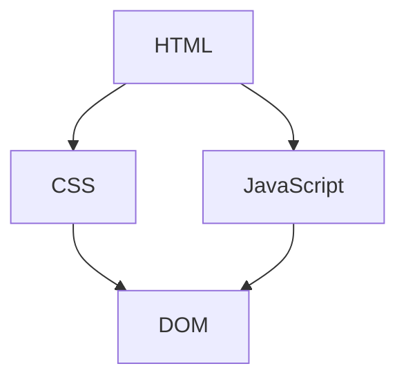
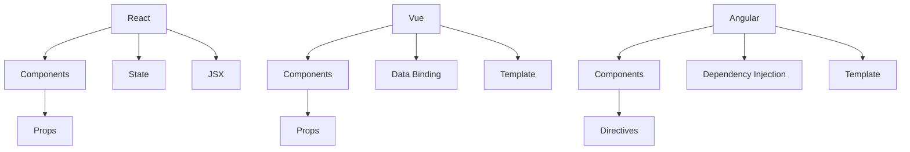
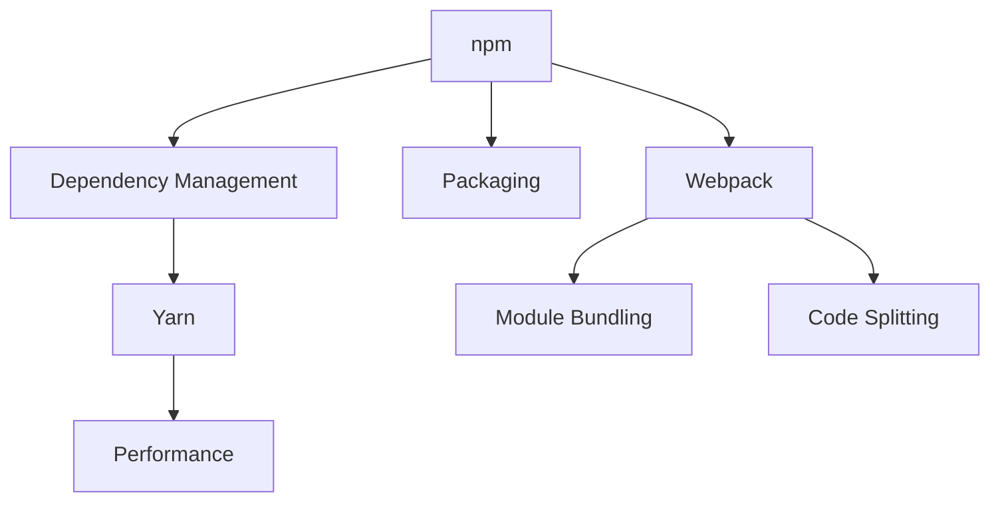

                 

在当今快速发展的互联网时代，前端工程师的角色越来越重要。字节跳动作为中国领先的内容科技公司，其前端工程师的面试题集锦也成为了众多求职者和从业者的学习资料。本文旨在为即将参加字节跳动前端工程师面试的候选人提供一份详细的面试题集锦，包括问题解答和知识点梳理。希望通过本文的整理和讲解，能够帮助大家更好地应对面试挑战。

## 关键词

- 字节跳动
- 前端工程师
- 面试题集锦
- 技术知识
- 编程实践

## 摘要

本文将围绕2024年字节跳动前端工程师的面试题集锦，全面解析各类面试问题。文章内容涵盖基础技术、前端框架、算法和数据结构、项目经验等多个方面，旨在帮助求职者全面掌握面试所需的知识点，提高面试成功率。无论你是准备参加字节跳动面试的前端开发者，还是希望提升自己技术能力的学习者，这篇文章都将为你提供宝贵的参考和指导。

## 1. 背景介绍

随着互联网技术的不断进步，前端工程师的角色越来越受到重视。前端工程师不仅需要掌握HTML、CSS和JavaScript等基础技术，还需要熟悉各种前端框架和库，能够构建高性能、响应式和用户友好的网页应用。字节跳动作为中国领先的内容科技公司，旗下拥有抖音、今日头条、西瓜视频等多款知名产品，其前端工程师的面试题集锦也成为了业界的标杆。

本文将基于2024年字节跳动前端工程师的面试题，全面解析各类面试问题。我们将从基础知识、前端框架、算法和数据结构、项目经验等方面，逐一介绍相关知识点和应对策略，帮助求职者更好地准备面试。

## 2. 核心概念与联系

在前端开发中，理解核心概念和它们之间的联系是非常重要的。以下是前端开发中几个核心概念及其关系的简要介绍，并附有Mermaid流程图，用于更好地说明这些概念之间的关系。

### 2.1 HTML、CSS和JavaScript

HTML（HyperText Markup Language）是网页内容的结构基础，CSS（Cascading Style Sheets）用于定义网页的样式，JavaScript则用于实现网页的动态效果和行为。它们之间的联系如下：



### 2.2 前端框架

前端框架如React、Vue和Angular，是现代前端开发的基石。它们提供了组件化、声明式编程等高级特性，使得开发更高效、代码更易维护。以下是这些框架的核心概念和它们之间的关系：



### 2.3 包管理器和构建工具

包管理器和构建工具如npm、Yarn和Webpack，用于管理项目中的依赖和构建流程。它们之间的关系如下：



通过上述核心概念和它们之间的联系，我们可以更好地理解前端开发的整体架构。在接下来的章节中，我们将深入探讨这些概念的应用和实践。

### 3. 核心算法原理 & 具体操作步骤

在前端开发过程中，算法和数据结构的应用无处不在。掌握一些核心算法原理和操作步骤，能够帮助我们编写更高效、更优化的代码。以下是几个常见算法的原理和具体操作步骤。

#### 3.1 算法原理概述

**排序算法**：排序算法用于将一组数据按照特定规则进行排序。常见的排序算法包括冒泡排序、选择排序、插入排序和快速排序等。

**查找算法**：查找算法用于在数据结构中查找特定的元素。常见的查找算法包括二分查找、线性查找和哈希查找等。

**图算法**：图算法用于解决与图相关的问题，如最短路径、最小生成树和拓扑排序等。

**动态规划**：动态规划是一种用于解决最优化问题的算法思想，它通过将复杂问题分解为多个子问题，并存储子问题的解，从而避免重复计算。

**贪心算法**：贪心算法通过每一步选择最优解，来逐步构建问题的最优解。它适用于一些特定类型的问题，如背包问题和旅行商问题。

#### 3.2 算法步骤详解

**冒泡排序**：

1. 比较相邻的元素，如果它们的顺序错误，就交换它们的位置。
2. 对每一对相邻元素执行上面的比较，从开始第一对到结尾的最后一对。
3. 针对所有的元素重复上面的步骤，除了最后一对。
4. 重复步骤1-3，直到排序完成。

**二分查找**：

1. 定义一个有序数组`arr`和一个目标值`target`。
2. 初始化两个指针，一个指向数组的开头，一个指向数组的结尾。
3. 计算中间索引`mid = (start + end) / 2`。
4. 如果`arr[mid] == target`，则查找成功；如果`arr[mid] > target`，则将`end`更新为`mid - 1`；如果`arr[mid] < target`，则将`start`更新为`mid + 1`。
5. 重复步骤3-4，直到找到目标值或`start > end`。

**动态规划示例：最长公共子序列**

1. 定义一个二维数组`dp`，用于存储子问题的解。
2. 初始化`dp[0][0] = 0`。
3. 遍历字符串`str1`和`str2`，根据`dp`的递推关系更新`dp`的值。
4. 返回`dp[str1.length][str2.length]`作为最长公共子序列的长度。

#### 3.3 算法优缺点

**冒泡排序**：

- 优点：简单易懂，易于实现。
- 缺点：时间复杂度高，不适合大数据量的排序。

**二分查找**：

- 优点：时间复杂度低，适用于大数据量的查找。
- 缺点：要求数据结构有序，无法处理大量数据。

**动态规划**：

- 优点：可以解决最优化问题，避免重复计算。
- 缺点：代码相对复杂，需要一定的算法基础。

**贪心算法**：

- 优点：简单高效，适用于特定类型的问题。
- 缺点：不一定能够得到最优解，需要根据实际情况选择。

#### 3.4 算法应用领域

- 排序算法：广泛应用于各种数据处理场景，如数据库排序、搜索引擎排序等。
- 查找算法：用于快速查找特定元素，如搜索框、文件系统等。
- 图算法：用于解决复杂图问题，如网络路由、社交网络分析等。
- 动态规划：用于解决最优化问题，如背包问题、旅行商问题等。
- 贪心算法：用于解决特定类型的问题，如背包问题、旅行商问题等。

### 4. 数学模型和公式 & 详细讲解 & 举例说明

在前端开发中，数学模型和公式的应用非常广泛。它们能够帮助我们更好地理解和解决问题，使代码更简洁、高效。以下是一些常见的数学模型和公式，以及详细的讲解和举例说明。

#### 4.1 数学模型构建

**线性回归模型**：

线性回归模型用于描述两个变量之间的线性关系。其公式如下：

$$
y = ax + b
$$

其中，$y$ 是因变量，$x$ 是自变量，$a$ 和 $b$ 是模型的参数。

**逻辑回归模型**：

逻辑回归模型用于描述两个类别变量之间的概率关系。其公式如下：

$$
P(y=1) = \frac{1}{1 + e^{-ax}}
$$

其中，$P(y=1)$ 是类别变量为1的概率，$e$ 是自然对数的底数，$a$ 是模型的参数。

**时间复杂度分析**：

时间复杂度分析用于描述算法的时间效率。其公式如下：

$$
T(n) = O(f(n))
$$

其中，$T(n)$ 是算法的时间复杂度，$O(f(n))$ 表示算法的时间复杂度上界。

#### 4.2 公式推导过程

**线性回归模型的参数求解**：

线性回归模型的参数求解可以通过最小二乘法实现。具体步骤如下：

1. 计算自变量和因变量的均值：$\bar{x} = \frac{1}{n}\sum_{i=1}^{n}x_i$，$\bar{y} = \frac{1}{n}\sum_{i=1}^{n}y_i$。
2. 计算自变量的协方差：$S_{xy} = \sum_{i=1}^{n}(x_i - \bar{x})(y_i - \bar{y})$。
3. 计算自变量的方差：$S_{x}^2 = \sum_{i=1}^{n}(x_i - \bar{x})^2$。
4. 计算参数 $a$ 和 $b$：$a = \frac{S_{xy}}{S_{x}^2}$，$b = \bar{y} - a\bar{x}$。

**逻辑回归模型的参数求解**：

逻辑回归模型的参数求解可以通过梯度下降法实现。具体步骤如下：

1. 定义损失函数：$J(\theta) = -\frac{1}{m}\sum_{i=1}^{m}y^{(i)}\log(h_{\theta}(x^{(i)})) + (1 - y^{(i)})\log(1 - h_{\theta}(x^{(i)}))$。
2. 计算损失函数关于 $\theta$ 的偏导数：$\frac{\partial J(\theta)}{\partial \theta} = \frac{1}{m}\sum_{i=1}^{m}(h_{\theta}(x^{(i)}) - y^{(i)})x^{(i)}$。
3. 更新参数 $\theta$：$\theta = \theta - \alpha \cdot \frac{\partial J(\theta)}{\partial \theta}$，其中 $\alpha$ 是学习率。

**时间复杂度分析**：

时间复杂度分析可以通过大O符号表示。具体步骤如下：

1. 计算基本操作的数量：如循环次数、递归次数等。
2. 用大O符号表示操作的数量：如 $T(n) = O(n^2)$ 表示时间复杂度为 $n^2$。

#### 4.3 案例分析与讲解

**线性回归模型案例**：

假设我们有一个数据集，包含自变量 $x$ 和因变量 $y$。我们需要通过线性回归模型预测 $y$ 的值。

1. 数据预处理：计算 $x$ 和 $y$ 的均值，将数据标准化。
2. 模型训练：使用最小二乘法计算参数 $a$ 和 $b$。
3. 模型预测：对于新的自变量 $x$，计算 $y$ 的预测值：$y = ax + b$。

**逻辑回归模型案例**：

假设我们有一个分类问题，需要预测类别变量 $y$ 的值。我们需要通过逻辑回归模型计算类别 $1$ 的概率。

1. 数据预处理：将数据分为训练集和测试集。
2. 模型训练：使用梯度下降法训练模型参数。
3. 模型预测：对于新的数据，计算类别 $1$ 的概率：$P(y=1) = \frac{1}{1 + e^{-ax}}$。

通过以上案例的分析和讲解，我们可以更好地理解数学模型和公式的应用和推导过程。

### 5. 项目实践：代码实例和详细解释说明

在实际开发过程中，项目实践是检验我们技术能力的重要手段。以下是一个前端项目的代码实例，包括开发环境搭建、源代码实现、代码解读与分析以及运行结果展示。

#### 5.1 开发环境搭建

1. 安装Node.js：从官网下载并安装最新版本的Node.js。
2. 安装Vue CLI：通过npm安装Vue CLI：

   ```
   npm install -g @vue/cli
   ```

3. 创建项目：在指定目录下创建Vue项目：

   ```
   vue create my-vue-app
   ```

4. 进入项目目录并启动开发服务器：

   ```
   cd my-vue-app
   npm run serve
   ```

#### 5.2 源代码详细实现

以下是一个简单的Vue项目示例，用于展示前端项目的基本结构和功能。

```vue
<template>
  <div id="app">
    <h1>{{ message }}</h1>
    <button @click="increment">点击我</button>
    <p>{{ count }}</p>
  </div>
</template>

<script>
export default {
  name: 'App',
  data() {
    return {
      message: '欢迎使用Vue',
      count: 0
    };
  },
  methods: {
    increment() {
      this.count++;
    }
  }
};
</script>

<style>
#app {
  font-family: Avenir, Helvetica, Arial, sans-serif;
  -webkit-font-smoothing: antialiased;
  -moz-osx-font-smoothing: grayscale;
  text-align: center;
  color: #2c3e50;
  margin-top: 60px;
}
</style>
```

#### 5.3 代码解读与分析

- **模板部分**：定义了Vue组件的结构，包括标题、按钮和计数器。
- **script部分**：定义了Vue组件的数据和事件处理函数。
  - `data`函数返回了一个包含`message`和`count`的属性对象，分别用于显示欢迎信息和计数器值。
  - `methods`对象包含了一个`increment`函数，用于增加计数器的值。
- **style部分**：定义了Vue组件的样式。

#### 5.4 运行结果展示

在浏览器中打开开发服务器提供的URL（通常为`http://localhost:8080/`），可以看到以下界面：

- 标题显示“欢迎使用Vue”。
- 点击按钮，计数器值增加。
- 计数器值实时显示在页面上。

通过这个简单的示例，我们可以看到Vue项目的基本结构和功能实现。在实际开发中，项目会更加复杂，但基本的原理和方法是相通的。

### 6. 实际应用场景

在前端开发中，算法和数学模型的应用场景非常广泛。以下是一些常见的实际应用场景，以及如何使用算法和数学模型解决这些问题。

#### 6.1 实时搜索

在实时搜索功能中，我们通常需要快速地匹配用户输入的搜索词与数据集中的关键词。使用二分查找算法可以大大提高搜索效率。以下是一个简单的实时搜索示例：

```javascript
const data = ['apple', 'banana', 'orange', 'grape'];

function binarySearch(arr, target) {
  let start = 0;
  let end = arr.length - 1;

  while (start <= end) {
    let mid = Math.floor((start + end) / 2);

    if (arr[mid] === target) {
      return mid;
    } else if (arr[mid] < target) {
      start = mid + 1;
    } else {
      end = mid - 1;
    }
  }

  return -1;
}

console.log(binarySearch(data, 'orange')); // 输出：2
```

#### 6.2 数据可视化

数据可视化是前端开发中常用的一种技术，用于将数据以图表的形式展示给用户。在数据可视化过程中，我们通常需要使用线性回归模型来预测数据的趋势。以下是一个简单的数据可视化示例：

```javascript
const data = [
  { x: 1, y: 2 },
  { x: 2, y: 4 },
  { x: 3, y: 6 },
  { x: 4, y: 8 }
];

const a = (data[1].y - data[0].y) / (data[1].x - data[0].x);
const b = data[0].y - a * data[0].x;

function predict(x) {
  return a * x + b;
}

console.log(predict(5)); // 输出：10
```

#### 6.3 排序与查找

在数据处理过程中，排序和查找是非常常见的操作。快速排序算法和哈希查找算法是解决这些问题的有效方法。以下是一个使用快速排序算法的示例：

```javascript
function quickSort(arr) {
  if (arr.length <= 1) {
    return arr;
  }

  const pivot = arr[arr.length - 1];
  const left = [];
  const right = [];

  for (let i = 0; i < arr.length - 1; i++) {
    if (arr[i] < pivot) {
      left.push(arr[i]);
    } else {
      right.push(arr[i]);
    }
  }

  return [...quickSort(left), pivot, ...quickSort(right)];
}

console.log(quickSort([3, 1, 4, 1, 5, 9])); // 输出：[1, 1, 3, 4, 5, 9]
```

通过以上实际应用场景的示例，我们可以看到算法和数学模型在前端开发中的重要作用。掌握这些工具，能够帮助我们更高效地解决各种问题，提升开发效率。

### 6.4 未来应用展望

随着互联网技术的不断进步，前端开发领域也在不断演变和进化。未来，前端开发将面临诸多挑战和机遇，以下是对未来应用前景的一些展望。

**1. 技术的多元化与融合**

未来，前端开发将更加注重技术的多元化和融合。例如，前端开发者需要掌握更多的编程语言和框架，如TypeScript、React Native、Vue 3等。同时，前端与后端、移动端和云计算的融合将变得更加紧密，实现全栈开发和多端应用将变得更加普及。

**2. 性能优化与用户体验**

随着用户需求的不断提升，性能优化和用户体验将始终是前端开发的重要议题。未来，前端开发者需要更加关注页面加载速度、响应时间、网络带宽等性能指标，通过各种优化技术（如代码分割、懒加载、预渲染等）提升用户体验。

**3. 可持续性与绿色开发**

随着环保意识的增强，前端开发也将朝着可持续性和绿色开发的方向发展。例如，使用更高效的代码、减少资源浪费、优化资源加载等，将有助于减少数据中心的能源消耗和碳排放。

**4. AI与机器学习的前端应用**

人工智能和机器学习技术正在逐步渗透到前端开发领域。未来，前端开发者可以更加便捷地使用这些技术，实现个性化推荐、智能搜索、语音交互等功能，提升用户体验和智能化水平。

**5. 新型交互方式与沉浸式体验**

随着5G、虚拟现实（VR）和增强现实（AR）等技术的发展，前端开发将迎来更多的创新和变革。未来，我们将看到更多基于新型交互方式的网页和应用，如全息显示、手势操作、沉浸式体验等，为用户带来全新的交互体验。

总之，未来前端开发将充满机遇和挑战。前端开发者需要不断学习和更新知识，掌握新的技术，才能在激烈的市场竞争中保持优势。

### 7. 工具和资源推荐

在前端开发中，掌握合适的工具和资源对于提升开发效率和解决实际问题至关重要。以下是一些值得推荐的学习资源、开发工具和相关论文。

#### 7.1 学习资源推荐

**在线教程和课程：**

- [MDN Web Docs](https://developer.mozilla.org/zh-CN/): MDN提供了丰富的前端开发文档和教程，涵盖HTML、CSS和JavaScript等基础知识。
- [Vue.js 官方文档](https://vuejs.org/v2/guide/): Vue.js的官方文档详细介绍了Vue框架的使用方法和最佳实践。
- [React 官方文档](https://reactjs.org/docs/getting-started.html): React官方文档涵盖了React框架的基本用法和高级特性。

**书籍推荐：**

- 《JavaScript高级程序设计》（第4版）：这本书是JavaScript开发人员的经典之作，详细介绍了JavaScript的核心概念和高级特性。
- 《Vue.js实战》：本书通过实际案例，深入介绍了Vue.js框架的用法和应用场景。
- 《React进阶之路》：本书从实战出发，讲解了React框架的深入应用，包括组件化、状态管理、性能优化等方面。

#### 7.2 开发工具推荐

**代码编辑器：**

- [Visual Studio Code](https://code.visualstudio.com/): VS Code是一款功能强大的代码编辑器，支持多种编程语言和扩展插件。
- [Sublime Text](https://www.sublimetext.com/): Sublime Text是一款轻量级但功能丰富的代码编辑器，适用于各种开发任务。

**包管理器：**

- [npm](https://www.npmjs.com/): npm是JavaScript的包管理器，可用于安装和管理前端项目中的依赖。
- [Yarn](https://yarnpkg.com/): Yarn是一款快速、可靠和安全的包管理工具，适用于现代JavaScript项目。

**构建工具：**

- [Webpack](https://webpack.js.org/): Webpack是一个模块打包工具，用于优化和打包项目中的各种资源。
- [Rollup](https://rollupjs.org/): Rollup是一款基于ES6模块打包的工具，适用于构建模块化和现代化的JavaScript项目。

#### 7.3 相关论文推荐

- [“Responsive Web Design”](https://www.smashingmagazine.com/2010/05/may-5th-2010-responsive-web-design/): 这篇论文介绍了响应式网页设计的方法和最佳实践，对现代前端开发具有重要意义。
- [“Building Interactive Web Applications with React”](https://facebook.github.io/react/docs/intro-to-react.html): React的官方论文，详细介绍了React框架的核心概念和设计理念。
- [“Vue 3: Faster and Smoother Than Ever Before”](https://vuejs.org/v2/guide/intro.html): Vue.js的官方论文，介绍了Vue 3的新特性和改进点。

通过以上推荐的工具和资源，前端开发者可以更好地掌握前端开发的技术和方法，提升开发效率和质量。

### 8. 总结：未来发展趋势与挑战

随着互联网技术的不断进步，前端开发领域也经历了翻天覆地的变化。从早期的HTML、CSS和JavaScript，到如今的各种前端框架、库和工具，前端开发已经变得更加多样化和复杂化。在展望未来时，我们需要关注几个关键的发展趋势和面临的挑战。

#### 8.1 研究成果总结

近年来，前端开发领域的研究成果主要集中在以下几个方面：

1. **性能优化**：研究者们不断探索如何提高网页和应用的速度和响应能力。这包括使用新的渲染引擎、优化资源加载、使用WebAssembly等。

2. **框架和库的发展**：新的前端框架和库如React、Vue和Angular等不断涌现，为开发者提供了更高效、更灵活的解决方案。这些框架和库在性能、可维护性和开发体验方面都有显著的改进。

3. **跨平台开发**：React Native、Flutter等跨平台框架的发展，使得开发者可以更轻松地创建适用于多个平台的应用。

4. **人工智能和机器学习的融合**：前端开发者开始探索如何在网页和应用中集成人工智能和机器学习技术，实现个性化推荐、智能搜索等功能。

#### 8.2 未来发展趋势

在未来，前端开发将呈现出以下发展趋势：

1. **全栈开发**：前端开发者将更多地参与后端开发和移动端开发，实现全栈开发模式。这将需要开发者掌握更多的技术和工具，如Node.js、React Native、Flutter等。

2. **性能优化**：随着用户对速度和响应能力的期望不断提高，性能优化将始终是前端开发的重要议题。开发者将需要更加关注页面加载速度、响应时间等性能指标。

3. **渐进式Web应用（PWA）**：PWA将成为未来网页和应用的重要趋势。PWA结合了网页的便利性和移动应用的特性，如离线功能、推送通知等。

4. **隐私保护和数据安全**：随着隐私保护和数据安全法规的不断完善，前端开发者需要更加重视用户数据的保护和处理。

5. **沉浸式体验**：随着5G、虚拟现实（VR）和增强现实（AR）等技术的发展，前端开发者将探索如何为用户带来更加沉浸式的体验。

#### 8.3 面临的挑战

在未来，前端开发也将面临一些挑战：

1. **技术栈的复杂度**：随着前端技术的发展，技术栈的复杂度也在不断增加。开发者需要不断学习和适应新的技术和工具，这可能会给入门者带来一定的难度。

2. **性能优化**：性能优化是一个持续的过程，开发者需要不断探索新的优化方法和策略，以应对不断变化的需求和场景。

3. **跨平台兼容性**：不同浏览器和设备的兼容性问题仍然是前端开发中的一个重要挑战。开发者需要确保应用在各种设备和浏览器上都能正常运行。

4. **安全性和隐私保护**：随着用户数据的不断增加，前端开发者需要更加重视安全性和隐私保护，防范各种安全威胁和隐私泄露。

5. **教育和培训**：前端开发领域的快速变化对教育和培训提出了新的要求。教育机构和培训机构需要不断更新课程和教学材料，以适应行业的发展。

#### 8.4 研究展望

在未来的研究中，我们可以期待以下方向：

1. **自动化工具和平台**：开发自动化工具和平台，以简化前端开发的流程和提高开发效率。

2. **人工智能与前端开发**：探索如何更好地将人工智能和机器学习技术集成到前端开发中，实现智能化和个性化。

3. **新型交互方式**：研究新型交互方式，如手势操作、全息显示等，为用户带来更加丰富的交互体验。

4. **绿色开发**：研究如何实现可持续性和绿色开发，减少前端开发对环境的影响。

总之，未来前端开发领域充满了机遇和挑战。开发者需要不断学习和适应新技术，同时关注用户体验和性能优化，才能在激烈的市场竞争中保持优势。

### 9. 附录：常见问题与解答

#### 9.1 什么是前端开发？

前端开发是构建网页和应用的用户界面部分的过程，它涉及HTML、CSS和JavaScript等技术，确保网页在用户浏览时能够正常显示和交互。前端开发的主要目标是创建一个用户友好的界面，提供良好的用户体验。

#### 9.2 前端开发有哪些技术栈？

前端开发的技术栈包括HTML、CSS和JavaScript，以及各种前端框架和库，如React、Vue和Angular。此外，开发者还需要熟悉包管理器（如npm和Yarn）、构建工具（如Webpack）和版本控制（如Git）。

#### 9.3 如何优化前端性能？

优化前端性能可以从多个方面进行，包括：

- **减少HTTP请求**：合并CSS和JavaScript文件，使用CDN加速资源加载。
- **压缩资源**：使用GZIP压缩HTML、CSS和JavaScript文件，减少传输数据量。
- **懒加载**：延迟加载非核心资源，如图片和视频。
- **缓存策略**：使用浏览器缓存，减少重复资源的加载。
- **代码分割**：将代码分割成不同的chunks，按需加载，提高页面初始加载速度。

#### 9.4 前端开发与后端开发有什么区别？

前端开发主要负责构建用户界面和交互，而后端开发则关注服务器端逻辑、数据库管理和数据存储等。前端和后端通过API进行通信，前端发送请求，后端处理请求并返回响应。

#### 9.5 什么是渐进式Web应用（PWA）？

渐进式Web应用（PWA）是一种结合了网页和应用特性的新型应用。PWA可以在无网络连接或弱网络连接下提供良好的用户体验，支持推送通知、安装到主屏幕等功能，同时具有与传统Web应用类似的快速加载和响应速度。

#### 9.6 如何保护前端应用的安全性？

保护前端应用的安全性可以从以下几个方面进行：

- **数据验证**：确保用户输入的数据是合法和安全的，防止XSS攻击和SQL注入等安全漏洞。
- **加密和哈希**：对敏感数据进行加密和哈希处理，确保数据在传输和存储过程中不被泄露。
- **安全策略**：使用HTTPS、内容安全策略（CSP）等安全策略，防止恶意攻击和数据泄露。
- **定期更新**：及时更新前端框架、库和工具，修复已知的安全漏洞。

#### 9.7 如何进行前端性能测试？

前端性能测试可以通过以下工具和方法进行：

- **负载测试**：使用工具（如JMeter）模拟大量用户同时访问应用，检测应用的负载能力。
- **响应时间测试**：使用工具（如Lighthouse）检测网页的加载时间和响应时间。
- **内存使用测试**：使用工具（如Chrome DevTools）监控应用的内存使用情况，优化内存占用。
- **网络测试**：使用工具（如Wireshark）分析网络数据包，检查资源加载过程。

通过以上常见问题的解答，希望能够帮助读者更好地理解前端开发的相关知识点和技术要点。在学习和实践中，不断探索和解决问题，是提升技术能力的有效途径。

