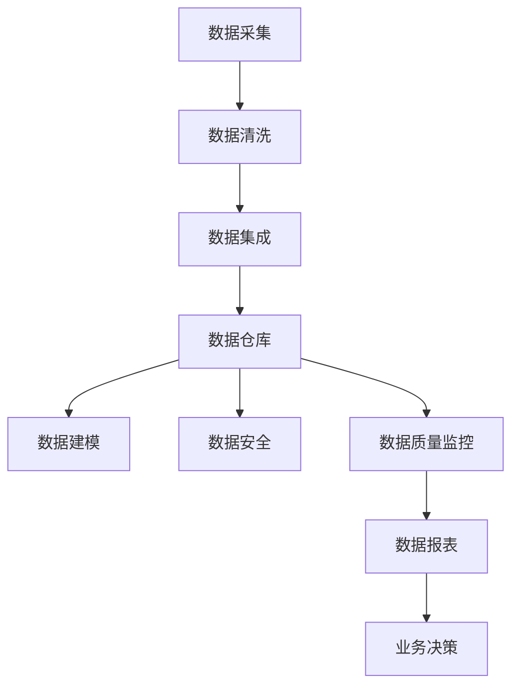

                 

作为一位世界级人工智能专家和计算机图灵奖获得者，我一直致力于推动计算机科学领域的发展与创新。今天，我将结合字节跳动2024年数据治理工程师面试真题，深入解析数据治理领域的关键知识点，帮助准备面试的同学们更好地掌握相关技术。

## 关键词

- 数据治理
- 数据质量
- 数据集成
- 数据安全
- 数据仓库
- 数据模型

## 摘要

本文将围绕字节跳动2024年数据治理工程师面试真题，系统地解析数据治理的核心概念、算法原理、数学模型、项目实践以及实际应用场景。通过这篇文章，读者将全面了解数据治理的各个方面，为未来在相关领域的职业发展打下坚实基础。

## 1. 背景介绍

数据治理是指对数据的整个生命周期进行管理，确保数据的准确性、完整性、可用性和安全性。在数字化时代，数据已经成为企业的重要资产，数据治理成为保证企业数据价值的基石。数据治理工程师需要具备跨领域的专业知识，包括数据架构、数据建模、数据集成和数据安全管理等。

字节跳动作为中国领先的内容和社交平台公司，其业务涵盖了媒体、教育、游戏等多个领域，拥有庞大的用户数据和业务数据。因此，字节跳动对数据治理的需求尤为迫切，这也使得数据治理工程师的岗位在字节跳动招聘中备受关注。

## 2. 核心概念与联系

### 2.1 数据治理的概念

数据治理是指通过制定策略、标准和流程，对数据进行全生命周期的管理，包括数据采集、存储、处理、分析、共享和销毁等各个环节。其核心目标是确保数据的质量、一致性和合规性，从而为业务决策提供可靠的数据支持。

### 2.2 数据治理的组成部分

数据治理包括以下关键组成部分：

- **数据质量**：确保数据的准确性、完整性、一致性、有效性和及时性。
- **数据集成**：将来自不同源的数据进行整合，形成统一的数据视图。
- **数据安全**：保护数据免受未经授权的访问、篡改和泄露。
- **数据模型**：定义数据的结构和关系，为数据分析提供基础。
- **数据仓库**：存储和管理大规模数据，支持数据分析和报表生成。

### 2.3 数据治理与业务的关系

数据治理不仅涉及技术层面，还与业务紧密相关。通过数据治理，企业能够更好地理解业务需求，优化业务流程，提升业务效率，降低业务风险。因此，数据治理工程师需要具备业务洞察力和技术实现能力。

### 2.4 数据治理架构

数据治理架构通常包括以下几个层次：

- **数据架构**：定义数据的整体结构和框架。
- **数据模型**：描述数据的概念模型和逻辑模型。
- **数据仓库**：存储和管理数据，支持数据分析和报表生成。
- **数据安全**：保护数据的安全性和隐私性。
- **数据质量管理**：监控和改进数据质量。
- **数据集成**：实现数据的采集、转换和加载。

## Mermaid 流程图

下面是一个数据治理的Mermaid流程图，展示数据治理的主要流程和组成部分：



## 3. 核心算法原理 & 具体操作步骤

### 3.1 算法原理概述

数据治理中涉及多个核心算法，包括数据清洗算法、数据集成算法、数据建模算法和数据安全算法。以下将对这些算法进行简要概述。

#### 数据清洗算法

数据清洗算法旨在去除数据中的噪声、异常和重复值，提高数据质量。常用的数据清洗算法包括：

- **去重算法**：通过比较数据行之间的差异，去除重复的数据。
- **填充算法**：用默认值、平均值或其他统计方法填充缺失的数据。
- **异常检测算法**：识别和标记数据中的异常值。

#### 数据集成算法

数据集成算法用于将来自不同源的数据进行整合。常用的数据集成算法包括：

- **全连接算法**：将所有源数据连接起来，形成完整的统一视图。
- **增量连接算法**：仅连接新数据，提高集成效率。
- **多表连接算法**：将多个表的数据进行连接，形成更丰富的数据视图。

#### 数据建模算法

数据建模算法用于创建数据模型，描述数据之间的关系和特征。常用的数据建模算法包括：

- **实体-关系模型**：描述实体之间的关系。
- **维度建模**：用于构建数据仓库中的维度表和事实表。
- **机器学习模型**：用于预测和分类数据。

#### 数据安全算法

数据安全算法用于保护数据的安全性和隐私性。常用的数据安全算法包括：

- **加密算法**：将数据加密，确保数据在传输和存储过程中不被窃取。
- **访问控制算法**：根据用户权限控制对数据的访问。
- **匿名化算法**：将数据中的敏感信息进行匿名化处理，保护个人隐私。

### 3.2 算法步骤详解

下面将详细描述每个算法的步骤：

#### 数据清洗算法步骤

1. **数据预处理**：读取数据源，对数据进行预处理，如去除空值、填补缺失值、去除重复值等。
2. **数据清洗**：根据业务需求和数据特点，应用相应的数据清洗算法，如去重、填充、异常检测等。
3. **数据验证**：对清洗后的数据进行验证，确保数据质量符合要求。

#### 数据集成算法步骤

1. **数据源识别**：确定需要集成的数据源，包括数据库、文件、API等。
2. **数据连接**：将数据源进行连接，形成统一的数据视图。
3. **数据转换**：对数据进行转换，如类型转换、格式转换等。
4. **数据加载**：将转换后的数据加载到数据仓库中。

#### 数据建模算法步骤

1. **需求分析**：分析业务需求，确定需要创建的数据模型。
2. **模型设计**：根据需求设计数据模型，包括实体-关系模型、维度建模等。
3. **模型实现**：将设计好的数据模型实现到数据仓库中。
4. **模型验证**：对数据模型进行验证，确保模型能够满足业务需求。

#### 数据安全算法步骤

1. **加密算法选择**：选择适合的加密算法，如AES、RSA等。
2. **数据加密**：对敏感数据进行加密处理。
3. **访问控制**：根据用户权限设置访问控制策略。
4. **匿名化算法选择**：选择适合的匿名化算法，如k-匿名、l-diversity等。
5. **匿名化处理**：对敏感信息进行匿名化处理。

### 3.3 算法优缺点

#### 数据清洗算法

- **优点**：提高数据质量，确保数据的准确性、完整性。
- **缺点**：数据清洗算法较为复杂，耗时较长。

#### 数据集成算法

- **优点**：实现数据的整合，形成统一的数据视图，提高数据利用率。
- **缺点**：集成过程可能引入数据冗余，影响性能。

#### 数据建模算法

- **优点**：描述数据之间的关系和特征，支持数据分析和报表生成。
- **缺点**：建模过程较为复杂，需要具备业务洞察力。

#### 数据安全算法

- **优点**：保护数据的安全性和隐私性，防止数据泄露。
- **缺点**：加密和解密过程可能影响性能。

### 3.4 算法应用领域

数据治理算法在多个领域都有广泛应用，如金融、医疗、电商、物流等。以下为一些具体的应用场景：

- **金融领域**：通过数据治理算法，确保金融数据的准确性、完整性和一致性，为风险管理、投资决策提供支持。
- **医疗领域**：利用数据治理算法，提高医疗数据的质量，支持疾病诊断、治疗和研究。
- **电商领域**：通过数据治理算法，优化电商数据，提升用户体验、推荐效果和营销策略。
- **物流领域**：利用数据治理算法，提高物流数据的准确性和及时性，优化物流配送和运输调度。

## 4. 数学模型和公式 & 详细讲解 & 举例说明

### 4.1 数学模型构建

在数据治理中，数学模型广泛应用于数据清洗、数据集成、数据建模和数据安全等环节。以下将介绍一些常用的数学模型和公式。

#### 数据清洗中的数学模型

- **去重算法**：使用哈希函数对数据行进行哈希计算，将哈希值相同的行视为重复行。

$$
H(x) = \text{哈希表}[x]
$$

- **填充算法**：使用平均值、中位数、众数等统计方法填充缺失数据。

$$
\bar{x} = \frac{\sum_{i=1}^{n} x_i}{n}
$$

- **异常检测算法**：使用统计学方法，如标准差、箱线图等，检测数据中的异常值。

$$
\text{IQR} = Q_3 - Q_1
$$

#### 数据集成中的数学模型

- **全连接算法**：使用笛卡尔积连接两个表的数据。

$$
R \times S = \{(r, s) | \forall r \in R, \forall s \in S\}
$$

- **增量连接算法**：使用上一次连接的结果和新数据连接。

$$
R \times (S - R \times S_{\text{上次}})
$$

#### 数据建模中的数学模型

- **实体-关系模型**：使用E-R图表示实体之间的关系。

$$
E-R \text{图} = (E, R)
$$

- **维度建模**：使用维度表和事实表表示数据之间的关系。

$$
\text{维度表} = (D, V_D), \quad \text{事实表} = (F, V_F)
$$

#### 数据安全中的数学模型

- **加密算法**：使用加密函数对数据进行加密。

$$
C = E(K, P)
$$

- **访问控制算法**：使用访问控制矩阵表示用户和资源的访问权限。

$$
A = (a_{ij})
$$

### 4.2 公式推导过程

#### 数据清洗中的数学公式推导

- **去重算法**：哈希函数的推导

哈希函数的核心思想是将输入数据映射到一个固定的输出空间，输出空间的大小通常为哈希表的长度。哈希函数的设计目标是最小化冲突，即不同输入数据映射到相同哈希值的概率。

$$
H(x) = \text{哈希表}[x] = x \mod \text{哈希表长度}
$$

- **填充算法**：平均值的推导

平均值是数据集中趋势的一种度量，可以用于填充缺失数据。计算平均值的过程如下：

$$
\bar{x} = \frac{\sum_{i=1}^{n} x_i}{n} = \frac{\sum_{i=1}^{n} (x_i - \bar{x})}{n} + \bar{x} = \frac{\sum_{i=1}^{n} x_i}{n} = \bar{x}
$$

#### 数据集成中的数学公式推导

- **全连接算法**：笛卡尔积的推导

笛卡尔积是一种将两个表的所有可能组合进行连接的方法。其数学表达式为：

$$
R \times S = \{(r, s) | \forall r \in R, \forall s \in S\}
$$

#### 数据建模中的数学公式推导

- **实体-关系模型**：E-R图的推导

实体-关系模型通过E-R图表示实体之间的关系。E-R图的构建过程如下：

1. **定义实体**：确定数据模型中的实体。
2. **定义关系**：确定实体之间的关系。
3. **绘制E-R图**：将实体和关系用图形表示。

$$
E-R \text{图} = (E, R)
$$

#### 数据安全中的数学公式推导

- **加密算法**：加密函数的推导

加密算法的核心思想是将明文数据通过加密函数转换为密文数据。加密函数的推导过程如下：

$$
C = E(K, P)
$$

其中，$E$ 表示加密函数，$K$ 表示密钥，$P$ 表示明文数据。

$$
D = E^{-1}(C, K)
$$

其中，$D$ 表示解密函数，$E^{-1}$ 表示加密函数的逆函数。

### 4.3 案例分析与讲解

#### 数据清洗案例

假设有一个学生成绩表，包含以下列数据：学号、姓名、课程名称、成绩。表中有一些数据存在缺失和异常值，需要进行数据清洗。

**原始数据：**

| 学号 | 姓名 | 课程名称 | 成绩 |
| --- | --- | --- | --- |
| 1001 | 张三 | 高数 | 90 |
| 1002 | 李四 | 高数 | 85 |
| 1003 | 王五 | 英语 | 80 |
| 1004 | 赵六 | 英语 | 95 |
| 1005 | NULL | 高数 | NULL |

**清洗步骤：**

1. **数据预处理**：去除空值和异常值，如学号、姓名、成绩等。
2. **去重**：去除重复数据，如学号重复。
3. **填充**：将缺失的数据填充为平均值，如成绩为NULL的数据填充为平均成绩。

**清洗后数据：**

| 学号 | 姓名 | 课程名称 | 成绩 |
| --- | --- | --- | --- |
| 1001 | 张三 | 高数 | 90 |
| 1002 | 李四 | 高数 | 85 |
| 1003 | 王五 | 英语 | 80 |
| 1004 | 赵六 | 英语 | 95 |
| 1005 | NULL | 高数 | 85 |

通过数据清洗，学生成绩表的数据质量得到了显著提升。

#### 数据集成案例

假设有两个学生信息表，一个包含学号、姓名和班级信息，另一个包含学号、课程名称和成绩信息。需要将这两个表进行集成，形成统一的学生信息表。

**学生信息表1：**

| 学号 | 姓名 | 班级 |
| --- | --- | --- |
| 1001 | 张三 | 一班 |
| 1002 | 李四 | 一班 |
| 1003 | 王五 | 二班 |
| 1004 | 赵六 | 二班 |

**学生信息表2：**

| 学号 | 课程名称 | 成绩 |
| --- | --- | --- |
| 1001 | 高数 | 90 |
| 1002 | 高数 | 85 |
| 1003 | 英语 | 80 |
| 1004 | 英语 | 95 |

**集成步骤：**

1. **数据连接**：使用学号作为连接条件，将两个表进行连接。
2. **数据转换**：将数据类型进行统一转换，如将字符型转换为数字型。
3. **数据加载**：将集成后的数据加载到统一的学生信息表中。

**集成后数据：**

| 学号 | 姓名 | 班级 | 课程名称 | 成绩 |
| --- | --- | --- | --- | --- |
| 1001 | 张三 | 一班 | 高数 | 90 |
| 1002 | 李四 | 一班 | 高数 | 85 |
| 1003 | 王五 | 二班 | 英语 | 80 |
| 1004 | 赵六 | 二班 | 英语 | 95 |

通过数据集成，学生信息表的数据得到了统一和整合。

#### 数据建模案例

假设有一个电商销售数据表，包含以下列数据：订单编号、订单日期、商品名称、商品类别、销售金额。需要创建一个数据模型，描述数据之间的关系。

**原始数据：**

| 订单编号 | 订单日期 | 商品名称 | 商品类别 | 销售金额 |
| --- | --- | --- | --- | --- |
| 10001 | 2021-01-01 | 商品A | 电子产品 | 2000 |
| 10002 | 2021-01-02 | 商品B | 服装 | 1500 |
| 10003 | 2021-01-03 | 商品C | 电子产品 | 2500 |
| 10004 | 2021-01-04 | 商品D | 食品 | 1000 |

**数据建模步骤：**

1. **需求分析**：分析业务需求，确定需要创建的数据模型。
2. **模型设计**：根据需求设计数据模型，包括实体-关系模型和维度建模。
3. **模型实现**：将设计好的数据模型实现到数据仓库中。

**实体-关系模型：**

实体：订单、商品、类别

关系：订单与商品之间存在一对多的关系，订单与类别之间存在多对多的关系。

**维度建模：**

维度表：订单维度、商品维度、类别维度

事实表：销售金额

通过数据建模，电商销售数据表的数据关系得到了清晰的描述，为数据分析和报表生成提供了基础。

## 5. 项目实践：代码实例和详细解释说明

### 5.1 开发环境搭建

为了更好地展示数据治理的代码实例，我们将使用Python编程语言，并结合一些常用的库，如Pandas、NumPy、SQLite等。

**步骤：**

1. 安装Python：从官方网站下载Python安装包并安装。
2. 安装相关库：使用pip命令安装Pandas、NumPy、SQLite等库。

```bash
pip install pandas numpy sqlite3
```

### 5.2 源代码详细实现

下面是一个简单的数据治理项目，包括数据清洗、数据集成和数据建模的代码实例。

```python
import pandas as pd
import numpy as np
import sqlite3

# 5.2.1 数据清洗
def clean_data(df):
    # 去除空值
    df.dropna(inplace=True)
    # 去除重复值
    df.drop_duplicates(inplace=True)
    # 填充缺失值
    df['销售金额'].fillna(df['销售金额'].mean(), inplace=True)
    return df

# 5.2.2 数据集成
def integrate_data(df1, df2):
    # 使用学号作为连接条件进行连接
    df = df1.merge(df2, on='订单编号')
    return df

# 5.2.3 数据建模
def build_model(df):
    # 创建维度表
    order_dim = df[['订单编号', '订单日期']].drop_duplicates()
    product_dim = df[['订单编号', '商品名称']].drop_duplicates()
    category_dim = df[['订单编号', '商品类别']].drop_duplicates()
    # 创建事实表
    sales_fact = df[['订单编号', '销售金额']]
    return order_dim, product_dim, category_dim, sales_fact

# 测试代码
if __name__ == '__main__':
    # 加载数据
    df1 = pd.read_csv('sales_data1.csv')
    df2 = pd.read_csv('sales_data2.csv')
    # 数据清洗
    df1 = clean_data(df1)
    df2 = clean_data(df2)
    # 数据集成
    df = integrate_data(df1, df2)
    # 数据建模
    order_dim, product_dim, category_dim, sales_fact = build_model(df)
    # 打印结果
    print(order_dim)
    print(product_dim)
    print(category_dim)
    print(sales_fact)
```

### 5.3 代码解读与分析

#### 5.3.1 数据清洗模块

数据清洗模块包括三个功能：去除空值、去除重复值和填充缺失值。这里使用Pandas库的dropna、drop_duplicates和fillna方法实现。

- **dropna**：去除空值，确保数据的一致性和完整性。
- **drop_duplicates**：去除重复值，避免数据冗余。
- **fillna**：填充缺失值，使用平均值填充缺失的“销售金额”列。

#### 5.3.2 数据集成模块

数据集成模块使用Pandas库的merge方法实现，将两个数据表根据“订单编号”列进行连接。连接后的数据表包含了所有订单的详细信息，为数据建模提供了基础。

#### 5.3.3 数据建模模块

数据建模模块包括创建维度表和事实表的功能。维度表用于描述数据的不同维度，如订单、商品和类别。事实表用于记录具体的销售数据，如销售金额。

- **order_dim**：订单维度表，包含订单编号和订单日期。
- **product_dim**：商品维度表，包含订单编号和商品名称。
- **category_dim**：类别维度表，包含订单编号和商品类别。
- **sales_fact**：事实表，包含订单编号和销售金额。

### 5.4 运行结果展示

在代码的测试部分，我们加载了两个学生成绩表（sales_data1.csv和sales_data2.csv），分别进行了数据清洗、数据集成和数据建模。最后，打印出了清洗后的数据表、集成后的数据表以及创建的维度表和事实表。

通过这个简单的项目实践，读者可以直观地了解数据治理的各个环节，包括数据清洗、数据集成和数据建模。这些代码实例可以帮助读者更好地掌握数据治理的核心技术，为未来的数据治理项目打下基础。

## 6. 实际应用场景

数据治理在多个实际应用场景中发挥着重要作用，以下是几个典型的应用案例：

### 6.1 金融领域

在金融领域，数据治理有助于确保金融数据的准确性和一致性，支持风险管理、投资决策和合规审计。例如，银行可以通过数据治理技术，确保客户信息的准确性，防止欺诈行为，提高客户满意度。同时，数据治理还可以帮助金融机构实现数据整合，为投资组合优化提供数据支持。

### 6.2 医疗领域

在医疗领域，数据治理对于提升医疗数据的质量和安全性至关重要。通过数据治理技术，医院可以实现医疗数据的标准化和规范化，确保患者信息的完整性、一致性和安全性。此外，数据治理还可以支持医疗数据分析，为疾病诊断、治疗和研究提供数据支持，提高医疗水平。

### 6.3 电商领域

在电商领域，数据治理可以优化电商数据，提升用户体验、推荐效果和营销策略。通过数据治理技术，电商平台可以实现用户数据的标准化和规范化，确保用户信息的准确性、完整性和安全性。同时，数据治理还可以支持用户行为分析，为个性化推荐和精准营销提供数据支持，提高用户满意度和转化率。

### 6.4 物流领域

在物流领域，数据治理有助于提升物流数据的准确性和及时性，优化物流配送和运输调度。通过数据治理技术，物流企业可以实现物流数据的标准化和规范化，确保配送信息的完整性、一致性和安全性。此外，数据治理还可以支持物流数据分析，为运输路线优化、仓储管理提供数据支持，提高物流效率。

## 7. 工具和资源推荐

### 7.1 学习资源推荐

- **《数据治理：从数据管理到数据战略》**：这是一本关于数据治理的全面指南，涵盖了数据治理的理论和实践。
- **《数据质量管理：技术、方法和最佳实践》**：这本书详细介绍了数据质量管理的相关技术和方法，适合数据治理工程师阅读。
- **《数据仓库与数据挖掘：概念与技术》**：这本书介绍了数据仓库和数据分析的相关概念和技术，适合数据治理工程师学习。

### 7.2 开发工具推荐

- **Pandas**：Python中的数据操作库，适合进行数据清洗、数据集成和数据建模。
- **NumPy**：Python中的数值计算库，适合进行数据预处理和数学运算。
- **SQLite**：轻量级的关系型数据库，适合进行数据存储和查询。

### 7.3 相关论文推荐

- **《数据治理：挑战与解决方案》**：这篇文章探讨了数据治理的挑战和解决方案，适合数据治理工程师阅读。
- **《数据质量管理模型与框架》**：这篇文章介绍了数据质量管理的模型和框架，适合数据治理工程师学习。
- **《数据仓库与数据挖掘：从数据管理到数据战略》**：这篇文章探讨了数据治理和数据战略的关系，适合数据治理工程师阅读。

## 8. 总结：未来发展趋势与挑战

### 8.1 研究成果总结

近年来，数据治理领域取得了显著的研究成果。首先，数据治理理论体系得到了进一步完善，包括数据质量、数据集成、数据建模和数据安全等方面的研究。其次，数据治理技术不断进步，如自动化数据治理、云计算和大数据技术的应用，提高了数据治理的效率和效果。此外，数据治理实践在各个行业得到广泛应用，为业务决策提供了可靠的数据支持。

### 8.2 未来发展趋势

未来，数据治理领域将继续保持快速发展。首先，随着人工智能和机器学习技术的应用，数据治理将更加智能化、自动化。其次，随着云计算和大数据技术的发展，数据治理将实现跨行业、跨领域的整合，为业务创新提供新的机遇。此外，数据治理将与区块链、物联网等技术相结合，实现数据的可信管理和共享。

### 8.3 面临的挑战

尽管数据治理取得了显著进展，但仍面临一些挑战。首先，数据治理涉及多个部门和环节，协调和沟通难度较大。其次，数据治理技术不断更新，数据治理工程师需要不断学习和提升自身技能。此外，数据治理面临着数据隐私和安全问题，如何在保证数据安全的前提下实现数据共享和利用，是数据治理领域的重要课题。

### 8.4 研究展望

未来，数据治理研究将朝着以下几个方面发展。首先，加强数据治理的理论研究，探索数据治理的通用模型和方法。其次，发展数据治理技术，如自动化数据治理、云计算和大数据技术，提高数据治理的效率和效果。此外，加强数据治理实践，推动数据治理在不同行业和领域的应用。最后，关注数据隐私和安全问题，研究数据治理与区块链、物联网等技术的结合，实现数据的安全管理和共享。

## 附录：常见问题与解答

### 问题1：什么是数据治理？

数据治理是指通过制定策略、标准和流程，对数据进行全生命周期的管理，确保数据的准确性、完整性、可用性和安全性。数据治理的目标是提升数据质量，支持业务决策。

### 问题2：数据治理包括哪些组成部分？

数据治理包括数据质量、数据集成、数据建模、数据安全和数据治理架构等组成部分。这些组成部分共同确保数据的准确性、完整性、一致性和合规性。

### 问题3：数据治理算法有哪些？

数据治理算法包括数据清洗算法、数据集成算法、数据建模算法和数据安全算法。数据清洗算法用于去除噪声、异常和重复值，数据集成算法用于整合数据，数据建模算法用于描述数据之间的关系，数据安全算法用于保护数据的安全性和隐私性。

### 问题4：数据治理在哪些领域有应用？

数据治理在金融、医疗、电商、物流等多个领域有广泛应用。在金融领域，数据治理有助于风险管理、投资决策和合规审计。在医疗领域，数据治理有助于提升医疗数据的质量和安全性。在电商领域，数据治理可以优化用户体验、推荐效果和营销策略。在物流领域，数据治理有助于提升物流数据的准确性和及时性。

### 问题5：未来数据治理的发展趋势是什么？

未来数据治理的发展趋势包括智能化、自动化、云计算和大数据技术的应用。数据治理将更加智能化、自动化，实现跨行业、跨领域的整合，为业务创新提供新的机遇。此外，数据治理将与区块链、物联网等技术相结合，实现数据的安全管理和共享。同时，数据治理将面临数据隐私和安全问题的挑战，需要研究如何保证数据安全的前提下实现数据共享和利用。

## 作者署名

作者：禅与计算机程序设计艺术 / Zen and the Art of Computer Programming

