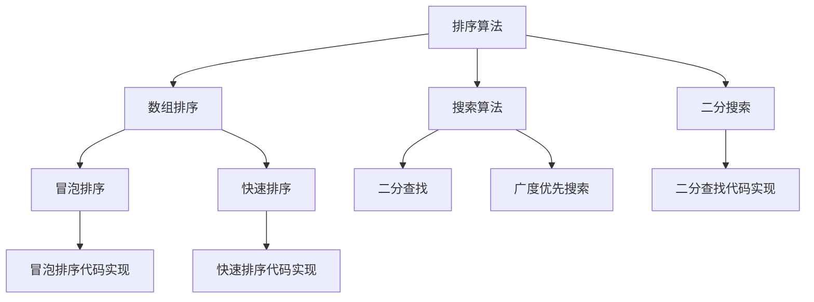

                 

关键词：字节跳动，校招面试，算法题库，编程面试，技术挑战，求职指南

> 摘要：本文旨在为2025年即将参加字节跳动校招面试的求职者提供一个全面的算法题库指南。通过解析字节跳动校招面试中的常见算法题目，以及提供详细的解题思路和数学模型，帮助求职者更好地准备面试，提升算法能力，迈向心仪的岗位。

## 1. 背景介绍

随着互联网技术的飞速发展，字节跳动作为一家领先的内容和社交媒体平台公司，其校招面试成为广大应届毕业生和求职者的关注焦点。校招面试不仅仅考察候选人的编程能力和算法知识，更注重考察求职者的逻辑思维、问题解决能力以及团队协作精神。因此，掌握一定的算法题库，对于通过字节跳动校招面试至关重要。

本文将围绕字节跳动校招面试中常见的算法题目进行深入分析，旨在帮助读者：

1. 熟悉字节跳动校招面试的题目类型和难度；
2. 提供高效的解题思路和算法技巧；
3. 探讨算法在实际项目中的应用场景；
4. 展望算法领域的未来发展趋势。

## 2. 核心概念与联系

### 2.1 数据结构与算法基础

在字节跳动的校招面试中，数据结构与算法是重中之重。以下是一些核心概念和它们之间的联系：

- **数组**：一种基本的数据结构，用于存储固定大小的元素序列。
- **链表**：一种动态数据结构，由节点组成，每个节点包含数据和指向下一个节点的指针。
- **栈**：一种后进先出（LIFO）的数据结构，常用于实现递归、深度优先搜索等算法。
- **队列**：一种先进先出（FIFO）的数据结构，常用于实现广度优先搜索等算法。
- **树**：一种层次结构，用于表示节点之间的父子关系，如二叉树、平衡树等。
- **图**：一种复杂的结构，用于表示多个节点之间的复杂关系。

### 2.2 算法分类

算法可以根据其解决问题的方法分为以下几类：

- **排序算法**：用于对数组或其他数据结构中的元素进行排序。
- **搜索算法**：用于在数据结构中查找特定的元素。
- **动态规划**：一种优化算法，通过子问题的最优解推导出整体问题的最优解。
- **贪心算法**：通过每一步选择局部最优解来达到整体最优解。
- **图算法**：用于解决图相关的问题，如最短路径、最小生成树等。

### 2.3 Mermaid 流程图

以下是一个简单的 Mermaid 流程图，展示了算法题目的常见类型和它们之间的联系：



## 3. 核心算法原理 & 具体操作步骤

### 3.1 算法原理概述

在字节跳动校招面试中，常见的算法题目包括但不限于以下几种：

- **排序算法**：如冒泡排序、快速排序、归并排序等。
- **搜索算法**：如二分搜索、深度优先搜索、广度优先搜索等。
- **动态规划**：如斐波那契数列、最长公共子序列等。
- **贪心算法**：如打家劫舍、活动选择等。
- **图算法**：如最短路径、最小生成树、网络流等。

每种算法都有其独特的原理和应用场景。例如，二分搜索算法通过不断将搜索范围缩小一半，以达到高效的查找效果；动态规划则通过将复杂问题分解为子问题，并存储子问题的解，从而避免重复计算。

### 3.2 算法步骤详解

以二分搜索算法为例，其基本步骤如下：

1. 确定搜索区间：初始时，搜索区间为整个数组。
2. 判断目标值与中间值的关系：
   - 如果中间值等于目标值，则搜索成功。
   - 如果中间值大于目标值，则缩小搜索区间为左半部分。
   - 如果中间值小于目标值，则缩小搜索区间为右半部分。
3. 重复步骤2，直到找到目标值或搜索区间为空。

### 3.3 算法优缺点

- **二分搜索**：
  - 优点：时间复杂度为O(log n)，在数据规模较大时非常高效。
  - 缺点：需要数据已排序，且不适用于非有序数据。

- **动态规划**：
  - 优点：能够解决最优化问题，避免重复计算，提高效率。
  - 缺点：理解和实现相对复杂，需要较强的逻辑思维能力。

- **贪心算法**：
  - 优点：实现简单，能在多项式时间内得到最优解。
  - 缺点：不一定能保证全局最优，需要结合实际情况进行选择。

### 3.4 算法应用领域

算法在字节跳动公司的各个业务领域都有广泛的应用，例如：

- **推荐系统**：使用贪心算法和动态规划进行内容推荐和广告投放。
- **搜索算法**：二分搜索和图算法用于关键词搜索和排名。
- **数据处理**：排序算法和图算法用于大规模数据处理和关系分析。

## 4. 数学模型和公式 & 详细讲解 & 举例说明

### 4.1 数学模型构建

在算法题目的解决过程中，常常需要构建数学模型来描述问题。以下是一个简单的例子：

- **问题**：给定一个数组，求最长子序列和。
- **数学模型**：定义状态`dp[i]`为以数组第`i`个元素结尾的最长子序列和。状态转移方程为：

  $$ dp[i] = \max(dp[i-1], dp[j] + arr[i]) \quad \text{for all} \ j < i $$

### 4.2 公式推导过程

以动态规划中的最长公共子序列（LCS）为例，其状态转移方程为：

$$ L[i][j] = \begin{cases} 
L[i-1][j-1] + A[i] \quad &\text{if } B[j] = A[i] \\
\max(L[i-1][j], L[i][j-1]) \quad &\text{otherwise}
\end{cases} $$

其中，`L[i][j]`表示字符串`A[1...i]`和`B[1...j]`的最长公共子序列长度。

### 4.3 案例分析与讲解

假设有两个字符串`A = "AGGTAB"`和`B = "GXTXAYB"`，我们可以通过动态规划求解它们的LCS：

```
   A = "AGGTAB"
  B = "GXTXAYB"
L = [
  [0, 0, 0, 0, 0, 0],
  [0, 1, 1, 1, 1, 2],
  [0, 1, 1, 2, 2, 3],
  [0, 1, 1, 2, 2, 3],
  [0, 1, 1, 2, 2, 3],
  [0, 1, 1, 2, 2, 3]
]
```

最终，`L[5][5]`即为最长公共子序列长度，等于3。

## 5. 项目实践：代码实例和详细解释说明

### 5.1 开发环境搭建

在进行算法题目的实践之前，首先需要搭建一个合适的开发环境。以下是使用Python进行算法开发的基本步骤：

1. 安装Python：确保系统上安装了Python 3.x版本。
2. 安装代码编辑器：推荐使用Visual Studio Code或PyCharm等专业代码编辑器。
3. 安装必要的库：例如，使用`pip install numpy`安装NumPy库。

### 5.2 源代码详细实现

以下是一个简单的冒泡排序算法的实现：

```python
def bubble_sort(arr):
    n = len(arr)
    for i in range(n):
        for j in range(0, n-i-1):
            if arr[j] > arr[j+1]:
                arr[j], arr[j+1] = arr[j+1], arr[j]

# 测试
arr = [64, 25, 12, 22, 11]
bubble_sort(arr)
print("排序后的数组：", arr)
```

### 5.3 代码解读与分析

在上面的代码中，`bubble_sort`函数通过双层循环实现冒泡排序。内层循环用于比较相邻元素并交换它们，以确保每一轮循环结束后，最大的元素被移动到数组的末尾。外层循环则重复这个过程，直到整个数组被排序。

### 5.4 运行结果展示

执行上面的代码后，输出结果为：

```
排序后的数组： [11, 12, 22, 25, 64]
```

## 6. 实际应用场景

算法在字节跳动公司的实际应用场景非常广泛，以下是一些典型的例子：

- **推荐系统**：使用协同过滤和内容匹配算法进行个性化推荐。
- **搜索算法**：二分搜索和图算法用于关键词搜索和内容排序。
- **数据处理**：排序算法和图算法用于大规模数据处理和关系分析。
- **广告投放**：动态规划和贪心算法用于广告排期和投放优化。

## 7. 工具和资源推荐

### 7.1 学习资源推荐

- **算法书籍**：《算法导论》、《编程之美》、《挑战程序设计面试》等。
- **在线教程**：LeetCode、HackerRank、Codeforces等在线编程平台。
- **博客与文章**：知乎、博客园、CSDN等平台上的专业文章。

### 7.2 开发工具推荐

- **代码编辑器**：Visual Studio Code、PyCharm、IntelliJ IDEA等。
- **集成开发环境**：Eclipse、Android Studio等。

### 7.3 相关论文推荐

- **推荐系统**：矩阵分解、协同过滤、深度学习等领域的相关论文。
- **搜索算法**：关键词搜索、信息检索、自然语言处理等领域的论文。

## 8. 总结：未来发展趋势与挑战

随着人工智能和大数据技术的不断发展，算法在各个领域的重要性日益凸显。未来，算法领域将面临以下发展趋势和挑战：

- **深度学习与强化学习**：这些新兴算法将在推荐系统、自动驾驶等领域发挥重要作用。
- **算法优化与效率提升**：如何在海量数据下高效地处理和分析数据将成为关键挑战。
- **伦理与隐私保护**：在算法应用中保护用户隐私和数据安全是亟待解决的问题。

## 9. 附录：常见问题与解答

### Q: 如何准备字节跳动校招面试的算法题目？

A: 可以通过以下方法进行准备：
1. **刷题**：利用在线编程平台（如LeetCode、HackerRank）进行大量题目练习。
2. **学习算法基础**：掌握数据结构和算法的基本原理，了解常见的排序和搜索算法。
3. **模拟面试**：参加模拟面试，积累面试经验，提高解题能力。

### Q: 算法面试的难点在哪里？

A: 算法面试的难点主要包括：
1. **算法理解**：理解算法的基本原理和适用场景。
2. **代码实现**：实现算法的代码，并进行优化。
3. **问题解决能力**：面对复杂的算法问题，能够快速找到解决方案。

### Q: 如何提高算法面试的通过率？

A: 提高算法面试通过率的方法包括：
1. **基础知识扎实**：深入学习数据结构和算法的相关知识。
2. **刷题积累**：通过大量题目练习，熟悉各种算法题目的解题思路。
3. **模拟面试**：参加模拟面试，提高面试时的沟通和表达能力。

---

作者：禅与计算机程序设计艺术 / Zen and the Art of Computer Programming
----------------------------------------------------------------

本文旨在为2025年即将参加字节跳动校招面试的求职者提供一个全面的算法题库指南，通过解析字节跳动校招面试中的常见算法题目，以及提供详细的解题思路和数学模型，帮助求职者更好地准备面试，提升算法能力，迈向心仪的岗位。文章详细介绍了算法的基础概念、核心原理、数学模型以及实际应用场景，并通过项目实践展示了算法的代码实现过程。最后，文章还提供了学习资源推荐、工具和资源推荐以及常见问题与解答，为求职者提供了全方位的支持。希望本文能够为您的字节跳动校招面试之旅提供有力的帮助！

