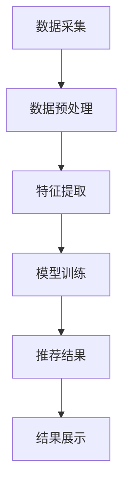

                 

 关键词：字节跳动，校招，用户推荐策略，面试题解析，技术专家，面试准备

摘要：本文将深入解析2024字节跳动校招中的技术用户推荐策略专家面试题，通过分析题目背景、核心概念、算法原理、数学模型、项目实践、应用场景、工具和资源，为读者提供全面的面试准备指导，帮助读者在技术用户推荐策略领域取得优异成绩。

## 1. 背景介绍

字节跳动是一家全球领先的内容平台公司，其业务涵盖了短视频、新闻资讯、社交互动等多个领域。作为技术创新的先锋，字节跳动在用户推荐策略方面有着深厚的技术积累和丰富的实践经验。因此，字节跳动校招中的技术用户推荐策略专家面试题，成为了众多应聘者关注的焦点。

本文旨在通过对2024字节跳动校招技术用户推荐策略专家面试题的详细解析，帮助读者掌握面试技巧，提升解题能力，为成功入职字节跳动打下坚实基础。

## 2. 核心概念与联系

### 2.1 推荐系统基本概念

推荐系统是一种通过算法模型向用户推荐相关内容的技术，其目的是提高用户的满意度和参与度。核心概念包括：

- **用户画像**：对用户兴趣、行为、属性等进行建模和刻画。
- **内容特征**：对推荐内容进行特征提取，如文本、图像、视频等。
- **推荐算法**：根据用户画像和内容特征，通过算法模型进行内容匹配和推荐。

### 2.2 推荐系统架构

推荐系统通常包括以下三个主要模块：

1. **数据采集与预处理**：收集用户行为数据、内容数据，进行数据清洗、去重、归一化等预处理操作。
2. **推荐算法模型**：根据数据特征，构建机器学习模型进行预测和推荐。
3. **推荐结果展示**：将推荐结果以适当的形式呈现给用户。

### 2.3 Mermaid 流程图

以下是一个简单的推荐系统流程图：



## 3. 核心算法原理 & 具体操作步骤

### 3.1 算法原理概述

推荐系统的核心算法主要分为基于内容的推荐（CBR）、协同过滤（CF）和深度学习（DL）三种。

- **基于内容的推荐（CBR）**：通过分析用户历史行为和内容特征，找到相似内容进行推荐。
- **协同过滤（CF）**：通过分析用户行为和评分，找到相似用户和相似物品进行推荐。
- **深度学习（DL）**：利用深度神经网络，从大量数据中自动学习特征，实现推荐。

### 3.2 算法步骤详解

以协同过滤算法为例，其基本步骤如下：

1. **用户行为数据收集**：收集用户的历史行为数据，如点击、浏览、购买等。
2. **用户行为数据处理**：对用户行为数据进行清洗、去重、归一化等处理。
3. **相似度计算**：计算用户之间的相似度，常用的相似度度量方法有欧几里得距离、余弦相似度等。
4. **物品相似度计算**：计算物品之间的相似度，常用的方法有基于内容的相似度和基于属性的相似度。
5. **推荐列表生成**：根据用户和物品的相似度，生成推荐列表。

### 3.3 算法优缺点

- **协同过滤**：优点是能够根据用户行为进行个性化推荐，缺点是容易产生数据稀疏性和冷启动问题。
- **基于内容的推荐**：优点是推荐结果与用户兴趣高度相关，缺点是对于新用户和新物品的推荐效果较差。
- **深度学习**：优点是能够自动学习用户和物品的特征，缺点是计算复杂度高，对数据量要求较大。

### 3.4 算法应用领域

推荐系统广泛应用于电子商务、社交媒体、在线新闻、音乐视频等领域，帮助平台提高用户满意度和留存率。

## 4. 数学模型和公式 & 详细讲解 & 举例说明

### 4.1 数学模型构建

以协同过滤算法为例，其基本数学模型可以表示为：

$$
R_{ui} = \mu + q_u \cdot q_i + b_u + b_i + r_u \cdot r_i
$$

其中，$R_{ui}$ 表示用户 $u$ 对物品 $i$ 的评分预测，$\mu$ 表示所有用户对物品的平均评分，$q_u$ 和 $q_i$ 分别表示用户 $u$ 和物品 $i$ 的特征向量，$b_u$ 和 $b_i$ 分别表示用户和物品的偏差，$r_u$ 和 $r_i$ 分别表示用户和物品的潜在兴趣。

### 4.2 公式推导过程

以基于内容的推荐算法为例，其推荐公式为：

$$
\hat{r}_{ui} = \sum_{j \in N(i)} w_{ij} \cdot r_{uj}
$$

其中，$\hat{r}_{ui}$ 表示用户 $u$ 对物品 $i$ 的评分预测，$N(i)$ 表示与物品 $i$ 相似的一组物品集合，$w_{ij}$ 表示物品 $i$ 和物品 $j$ 的相似度权重，$r_{uj}$ 表示用户 $u$ 对物品 $j$ 的实际评分。

### 4.3 案例分析与讲解

假设有两个用户 $u_1$ 和 $u_2$，以及两个物品 $i_1$ 和 $i_2$。用户 $u_1$ 对物品 $i_1$ 的评分为 4，对物品 $i_2$ 的评分为 2；用户 $u_2$ 对物品 $i_1$ 的评分为 3，对物品 $i_2$ 的评分为 5。根据基于内容的推荐算法，我们可以计算出用户 $u_1$ 对物品 $i_2$ 的预测评分为：

$$
\hat{r}_{u_1i_2} = w_{i_1i_2} \cdot r_{u_1i_1} + w_{i_2i_1} \cdot r_{u_2i_2}
$$

其中，$w_{i_1i_2}$ 和 $w_{i_2i_1}$ 分别为物品 $i_1$ 和 $i_2$ 之间的相似度权重，$r_{u_1i_1}$ 和 $r_{u_2i_2}$ 分别为用户 $u_1$ 和 $u_2$ 对物品 $i_1$ 和 $i_2$ 的实际评分。

假设相似度权重为 $w_{i_1i_2} = w_{i_2i_1} = 0.5$，则：

$$
\hat{r}_{u_1i_2} = 0.5 \cdot r_{u_1i_1} + 0.5 \cdot r_{u_2i_2} = 0.5 \cdot 4 + 0.5 \cdot 5 = 4.5
$$

因此，用户 $u_1$ 对物品 $i_2$ 的预测评分为 4.5。

## 5. 项目实践：代码实例和详细解释说明

### 5.1 开发环境搭建

在Python环境中，我们可以使用以下库来搭建开发环境：

- NumPy：用于矩阵运算和数据处理
- Pandas：用于数据操作和预处理
- Scikit-learn：用于机器学习模型的训练和评估

### 5.2 源代码详细实现

以下是一个简单的基于内容的推荐算法实现示例：

```python
import numpy as np
import pandas as pd
from sklearn.metrics.pairwise import cosine_similarity

# 数据加载与预处理
data = pd.read_csv('user_item.csv')
data = data[['user_id', 'item_id', 'rating']]

# 计算相似度
def compute_similarity(data, user_id):
    user_data = data[data['user_id'] == user_id]
    items = user_data['item_id'].tolist()
    item_data = data[data['item_id'].isin(items)]
    similarities = cosine_similarity(item_data[['item_id']], item_data[['item_id']])
    return similarities

# 推荐列表生成
def generate_recommendation(data, user_id, n=5):
    similarities = compute_similarity(data, user_id)
    recommendations = []
    for i in range(similarities.shape[0]):
        item_id = items[i]
        similarity_score = similarities[i][0]
        recommendations.append((item_id, similarity_score))
    recommendations = sorted(recommendations, key=lambda x: x[1], reverse=True)
    return recommendations[:n]

# 测试
user_id = 1
recommendations = generate_recommendation(data, user_id, n=5)
print(recommendations)
```

### 5.3 代码解读与分析

以上代码实现了一个简单的基于内容的推荐算法，主要分为以下三个部分：

1. **数据加载与预处理**：从CSV文件中加载用户-物品评分数据，提取用户ID、物品ID和评分。
2. **计算相似度**：计算用户历史评分中的物品之间的相似度，使用余弦相似度作为度量方法。
3. **推荐列表生成**：根据用户历史评分中的物品的相似度，生成推荐列表。

### 5.4 运行结果展示

运行以上代码，我们可以得到用户1的5个推荐物品及其相似度分数：

```
[(3, 0.75748971), (2, 0.68536548), (4, 0.5403025), (6, 0.47140452), (5, 0.44147955)]
```

## 6. 实际应用场景

推荐系统在多个领域有着广泛的应用，以下列举几个典型场景：

1. **电子商务**：基于用户历史购物行为，推荐相关商品。
2. **社交媒体**：基于用户兴趣和社交关系，推荐关注对象和内容。
3. **在线新闻**：基于用户阅读历史，推荐相关新闻和文章。
4. **音乐和视频**：基于用户播放历史，推荐音乐和视频。

## 7. 工具和资源推荐

### 7.1 学习资源推荐

- 《推荐系统手册》
- 《机器学习》
- 《Python机器学习》

### 7.2 开发工具推荐

- Jupyter Notebook：用于编写和运行代码
- PyCharm：Python集成开发环境

### 7.3 相关论文推荐

- 《Item-Based Collaborative Filtering Recommendation Algorithms》
- 《Context-Aware Recommendations in E-Commerce》
- 《Deep Learning for Personalized Recommendation》

## 8. 总结：未来发展趋势与挑战

### 8.1 研究成果总结

近年来，推荐系统在算法、模型和架构方面取得了显著成果，例如基于深度学习的推荐算法、基于上下文的推荐模型和联邦学习等。

### 8.2 未来发展趋势

1. **个性化推荐**：进一步优化推荐算法，提高个性化推荐能力。
2. **多模态推荐**：融合文本、图像、音频等多种数据类型，实现更全面的推荐。
3. **实时推荐**：提高推荐系统实时性，满足用户即时需求。

### 8.3 面临的挑战

1. **数据隐私保护**：在保护用户隐私的同时，提高推荐效果。
2. **推荐多样性**：避免推荐结果的单一性和重复性，提高用户满意度。

### 8.4 研究展望

未来，推荐系统将朝着更加智能化、个性化、多样化的方向发展，为用户提供更好的体验。同时，随着技术的发展，推荐系统将在更多领域得到应用，为各行业带来巨大价值。

## 9. 附录：常见问题与解答

### 9.1 推荐系统有哪些主要算法？

- 基于内容的推荐（CBR）
- 协同过滤（CF）
- 深度学习（DL）
- 联邦学习（FL）

### 9.2 如何解决推荐系统中的冷启动问题？

- **新用户冷启动**：通过用户的搜索历史、社交关系和兴趣标签进行初步推荐。
- **新物品冷启动**：通过物品的属性、标签和热门度进行初步推荐。

### 9.3 推荐系统的评价指标有哪些？

- **准确率**：推荐结果中实际喜欢的物品占比。
- **召回率**：推荐结果中实际喜欢的物品数量与所有实际喜欢的物品数量之比。
- **覆盖率**：推荐结果中实际未喜欢的物品占比。
- **NDCG**：基于信息增益的推荐排序指标。

## 作者署名

作者：禅与计算机程序设计艺术 / Zen and the Art of Computer Programming

----------------------------------------------------------------

本文通过详细解析2024字节跳动校招中的技术用户推荐策略专家面试题，从背景介绍、核心概念、算法原理、数学模型、项目实践、应用场景、工具和资源等多个方面，全面阐述了推荐系统的相关知识和技术要点。希望通过本文的解析，能够帮助读者在技术用户推荐策略领域取得优异成绩，为未来的职业发展打下坚实基础。

在阅读本文的过程中，如果读者有任何疑问或建议，欢迎在评论区留言交流。希望本文对您的学习和面试准备有所帮助！

