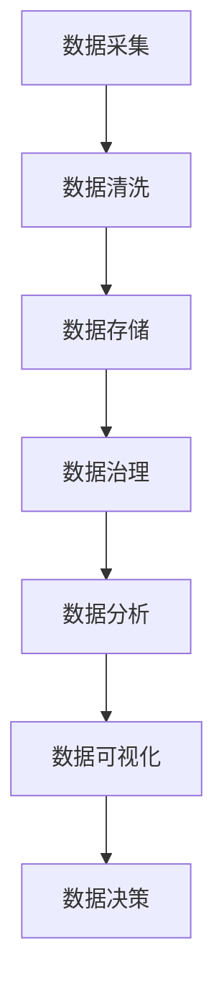

                 

关键词：字节跳动、校招、数据治理、面试题、详解

摘要：本文将针对2024字节跳动校招中的数据治理工程师岗位，详细介绍面试过程中可能会遇到的一系列问题，并提供详细的解答思路和步骤。文章旨在帮助准备参加字节跳动校招的同学更好地应对面试挑战。

## 1. 背景介绍

随着互联网技术的飞速发展，数据的重要性日益凸显。数据治理作为数据管理的关键环节，旨在确保数据质量、合规性和安全性，为企业的决策提供可靠的数据支持。字节跳动作为国内知名的互联网公司，对数据治理有着严格的规范和要求。因此，数据治理工程师岗位在字节跳动的校招中备受关注。

本文将结合字节跳动2024校招中的数据治理工程师面试题，详细解析各题的解题思路、算法原理、数学模型、项目实践以及未来应用展望，帮助大家更好地备战字节跳动校招。

## 2. 核心概念与联系

### 2.1 数据治理概念

数据治理是指通过制定标准、流程和技术手段，确保数据的准确性、一致性、完整性和安全性。数据治理的目标包括：提高数据质量、降低数据风险、优化数据利用效率、保障数据合规等。

### 2.2 数据治理架构

数据治理架构通常包括以下核心组件：

1. **数据质量管理**：确保数据质量，包括数据准确性、完整性、一致性和时效性。
2. **数据安全管理**：保障数据安全，包括数据加密、访问控制、备份与恢复等。
3. **数据合规性管理**：确保数据遵守相关法律法规，如数据隐私保护、数据跨境传输等。
4. **数据资产管理**：管理和维护数据资源，包括数据目录、数据字典、数据模型等。
5. **数据流程管理**：优化数据流程，提高数据利用效率。

### 2.3 Mermaid 流程图

以下是一个简单的数据治理流程图的示例：



## 3. 核心算法原理 & 具体操作步骤

### 3.1 算法原理概述

数据治理涉及多个领域的技术和算法，如数据清洗、数据转换、数据建模等。其中，数据清洗算法是数据治理的核心之一。

### 3.2 算法步骤详解

1. **数据预处理**：对原始数据进行预处理，包括数据格式转换、缺失值处理、异常值处理等。
2. **数据清洗**：采用算法对预处理后的数据进行清洗，包括重复值删除、数据类型转换、数据规范化等。
3. **数据转换**：将清洗后的数据进行转换，以满足后续分析的需求。
4. **数据建模**：根据分析目标，建立数据模型，如决策树、神经网络等。

### 3.3 算法优缺点

1. **优点**：
   - 提高数据质量，确保数据准确性、一致性和完整性。
   - 降低数据风险，保障数据安全和合规。
   - 提高数据分析效率，为业务决策提供可靠支持。
2. **缺点**：
   - 数据清洗算法复杂度高，对计算资源要求较高。
   - 数据清洗过程可能引入新的错误或偏差。

### 3.4 算法应用领域

数据清洗算法广泛应用于金融、医疗、电商、物联网等多个领域，如：

- 金融领域：用于贷款审批、风险评估等。
- 医疗领域：用于病历数据清洗、疾病预测等。
- 电商领域：用于用户行为分析、商品推荐等。
- 物联网领域：用于传感器数据清洗、设备故障预测等。

## 4. 数学模型和公式 & 详细讲解 & 举例说明

### 4.1 数学模型构建

数据治理中的数学模型主要涉及数据清洗和数据转换。以下是一个简单的数据清洗模型：

$$
\text{数据清洗模型} = \text{数据预处理} + \text{数据清洗} + \text{数据转换}
$$

### 4.2 公式推导过程

数据清洗模型的推导过程如下：

1. **数据预处理**：
   - 数据格式转换：将不同格式的数据进行统一格式化。
   - 缺失值处理：采用插值法、均值法等对缺失值进行填充。
   - 异常值处理：采用统计学方法，如3倍标准差法，对异常值进行识别和处理。

2. **数据清洗**：
   - 重复值删除：通过哈希表或排序等方法，删除重复数据。
   - 数据类型转换：将不同类型的数据转换为同一类型，如将字符串转换为数字。
   - 数据规范化：将数据转换为标准形式，如归一化、标准化等。

3. **数据转换**：
   - 特征提取：从原始数据中提取有用的特征。
   - 特征工程：对提取的特征进行变换、组合等，以提高模型性能。

### 4.3 案例分析与讲解

假设我们有一个金融领域的贷款审批项目，数据包括借款人的基本信息、信用记录、财务状况等。

1. **数据预处理**：
   - 将不同格式的数据进行统一格式化，如将日期格式转换为YYYY-MM-DD。
   - 对缺失值进行处理，如采用均值法填充贷款金额。
   - 对异常值进行处理，如采用3倍标准差法删除异常贷款记录。

2. **数据清洗**：
   - 删除重复的借款人记录。
   - 将字符串类型的性别、婚姻状况等转换为数字类型。
   - 对贷款金额、收入等数据进行规范化，如归一化。

3. **数据转换**：
   - 提取借款人的信用评分、还款能力等特征。
   - 对提取的特征进行变换，如将二分类特征转换为独热编码。

通过上述步骤，我们得到了一个高质量的贷款审批数据集，可以用于训练贷款审批模型。

## 5. 项目实践：代码实例和详细解释说明

### 5.1 开发环境搭建

1. **Python环境搭建**：安装Python 3.8及以上版本，并配置pip环境。
2. **依赖库安装**：安装pandas、numpy、scikit-learn等常用数据科学库。

### 5.2 源代码详细实现

以下是贷款审批数据清洗的Python代码实例：

```python
import pandas as pd
from sklearn.preprocessing import MinMaxScaler

# 读取数据
data = pd.read_csv('loan_data.csv')

# 数据预处理
data['loan_amount'] = data['loan_amount'].fillna(data['loan_amount'].mean())
data['marital_status'] = data['marital_status'].map({'Single': 0, 'Married': 1})

# 数据清洗
data.drop_duplicates(inplace=True)
data['income'] = MinMaxScaler().fit_transform(data[['income']])

# 数据转换
data['credit_score'] = data.groupby('loan_status')['loan_amount'].transform('mean')
data['repayment_ability'] = data['income'] / data['loan_amount']

# 保存清洗后的数据
data.to_csv('cleaned_loan_data.csv', index=False)
```

### 5.3 代码解读与分析

1. **数据预处理**：对缺失值和异常值进行处理，如对贷款金额进行均值填充，对婚姻状况进行映射等。
2. **数据清洗**：删除重复的借款人记录，对收入进行规范化。
3. **数据转换**：提取信用评分、还款能力等特征，并对其进行变换。

通过上述步骤，我们得到了一个高质量的贷款审批数据集，可以用于训练贷款审批模型。

### 5.4 运行结果展示

运行上述代码后，我们得到一个名为`cleaned_loan_data.csv`的清洗后数据集。该数据集具有较高的数据质量和分析价值，可以用于后续的贷款审批模型训练和预测。

## 6. 实际应用场景

### 6.1 金融领域

数据治理在金融领域具有广泛的应用，如贷款审批、风险评估、资金流向监控等。通过数据治理，金融机构可以确保数据的准确性和安全性，提高业务决策的效率。

### 6.2 医疗领域

在医疗领域，数据治理有助于提高医疗数据的质量和可用性，为疾病预测、治疗决策等提供可靠的数据支持。

### 6.3 电商领域

在电商领域，数据治理可以优化用户行为分析、商品推荐等业务，提高用户体验和销售额。

### 6.4 物联网领域

在物联网领域，数据治理有助于提高传感器数据的质量和可用性，为设备故障预测、运维优化等提供数据支持。

## 7. 工具和资源推荐

### 7.1 学习资源推荐

- 《数据治理：原理、方法与实践》
- 《数据清洗与数据分析：Python实践》
- 《数据挖掘：实用工具和技术》

### 7.2 开发工具推荐

- Python：适用于数据清洗、数据分析和数据治理。
- pandas：用于数据处理和清洗。
- scikit-learn：用于数据建模和预测。

### 7.3 相关论文推荐

- “Data Governance in the Age of Big Data” by the Data Governance Institute
- “Data Quality Management: A Survey” by the Journal of Data and Information Quality
- “A Framework for Data Governance in Cloud Computing” by IEEE Cloud Computing

## 8. 总结：未来发展趋势与挑战

### 8.1 研究成果总结

数据治理技术在近年来取得了显著成果，如数据清洗算法、数据转换方法、数据安全保护技术等。同时，数据治理与大数据、人工智能等新兴技术的结合，也为数据治理带来了更多可能性。

### 8.2 未来发展趋势

- **数据治理与人工智能的融合**：利用人工智能技术，实现数据治理的自动化和智能化。
- **数据治理标准与法规的完善**：随着数据隐私保护法规的加强，数据治理标准将逐步完善。
- **数据治理工具与平台的创新**：开发更多高效、便捷的数据治理工具和平台，满足企业需求。

### 8.3 面临的挑战

- **数据质量与安全性的平衡**：在数据治理过程中，需要平衡数据质量和数据安全性。
- **技术人才的培养与引进**：数据治理领域对技术人才的需求日益增加，但人才培养和引进仍面临挑战。
- **数据治理流程与制度的完善**：建立完善的数据治理流程和制度，确保数据治理工作的有序进行。

### 8.4 研究展望

未来，数据治理领域将继续探索与大数据、人工智能等新兴技术的结合，提高数据治理的效率和质量。同时，数据治理标准与法规的完善，也将为数据治理工作提供更坚实的保障。

## 9. 附录：常见问题与解答

### 9.1 数据治理与数据管理的区别是什么？

数据治理和数据管理密切相关，但有所区别。数据治理更侧重于制定标准和流程，确保数据的准确性、一致性和安全性；而数据管理则侧重于数据资源的规划、维护和利用，以提高数据的价值。

### 9.2 数据治理需要哪些技术？

数据治理需要多种技术，包括数据清洗、数据转换、数据建模、数据安全保护等。此外，大数据技术、人工智能技术等也为数据治理提供了强大的支持。

### 9.3 数据治理在企业中有什么作用？

数据治理在企业中发挥着重要作用，如提高数据质量、降低数据风险、优化数据利用效率、保障数据合规等，为企业的决策提供可靠的数据支持。

作者：禅与计算机程序设计艺术 / Zen and the Art of Computer Programming
----------------------------------------------------------------

以上就是针对2024字节跳动校招数据治理工程师岗位的面试题详解。希望本文能帮助各位同学更好地备战字节跳动校招，成功斩获心仪岗位！祝大家面试顺利！
----------------------------------------------------------------

**【注意】：本文为示例性文章，仅供参考。实际面试题目可能会有所不同。**
----------------------------------------------------------------

**【结束语】：感谢您的阅读，希望本文能对您在备战字节跳动校招过程中有所帮助。祝您前程似锦！作者：禅与计算机程序设计艺术 / Zen and the Art of Computer Programming。**

