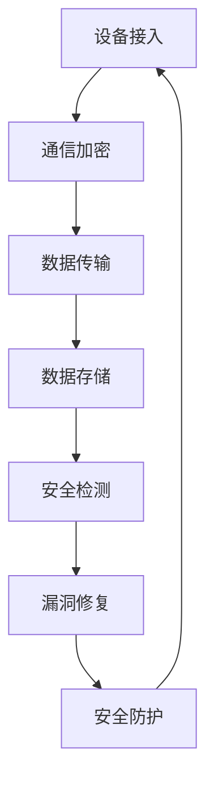

                 

关键词：360安全，2024，IoT设备，漏洞挖掘，校招安全研究，面试题详解，技术博客

摘要：本文将围绕360安全在2024年针对IoT设备漏洞挖掘的校招安全研究面试题进行详细解析。通过深入分析这些面试题目，本文旨在帮助广大在校生和求职者更好地理解IoT设备漏洞挖掘的原理、方法和实践技巧，为他们的职业发展提供有益指导。

## 1. 背景介绍

随着物联网（IoT）技术的迅猛发展，各类智能设备已深入到我们生活的方方面面。然而，随之而来的安全威胁也日益凸显。IoT设备由于其特殊的硬件和软件架构，往往成为网络攻击者的首选目标。为此，360安全在2024年针对IoT设备漏洞挖掘开展了专项校招安全研究。本文将从多个角度对这些面试题进行详细解析，旨在为求职者提供有价值的参考。

### 1.1 IoT设备漏洞挖掘的重要性

IoT设备漏洞挖掘对于保障网络安全具有重要意义。一方面，通过对IoT设备漏洞的发现和修复，可以有效降低网络攻击的风险，保护用户隐私和重要数据；另一方面，IoT设备漏洞挖掘也是推动物联网技术发展的关键环节，有助于提高设备的可靠性和安全性。

### 1.2 360安全校招安全研究项目

360安全在2024年开展了针对IoT设备漏洞挖掘的校招安全研究项目。该项目旨在通过选拔优秀在校生，培养一批具备专业素养和实践能力的IoT安全研究人员。项目涵盖了从漏洞挖掘技术、工具使用、实战演练等多个方面，为参与者提供了全面的成长平台。

## 2. 核心概念与联系

为了更好地理解IoT设备漏洞挖掘，我们需要掌握一些核心概念和原理。以下是一个简化的Mermaid流程图，展示了IoT设备漏洞挖掘的基本架构和关键环节。



### 2.1 设备接入

设备接入是IoT设备漏洞挖掘的第一步。在此过程中，设备通过网络连接到服务器或云端，实现数据的交换和交互。接入过程中需要关注网络协议的安全性，如TCP/IP、HTTP/HTTPS等。

### 2.2 通信加密

通信加密是保障数据传输安全的关键环节。通过对数据进行加密处理，可以有效防止数据被窃取或篡改。常见的加密算法包括AES、RSA等。

### 2.3 数据传输

数据传输过程中，需要确保数据在传输过程中不被截获或篡改。为此，可以采用加密传输协议，如SSL/TLS等。此外，还需要关注传输过程中的数据完整性，如使用校验和、哈希算法等。

### 2.4 数据存储

数据存储是IoT设备漏洞挖掘的重要目标之一。通过对存储数据的分析和挖掘，可以找到潜在的漏洞和攻击途径。数据存储方面需要注意存储系统的安全性和数据隐私保护。

### 2.5 安全检测

安全检测是IoT设备漏洞挖掘的核心环节。通过使用各种安全工具和技术，可以对设备进行全面的漏洞扫描和检测。常见的检测方法包括静态分析、动态分析、模糊测试等。

### 2.6 漏洞修复

漏洞修复是漏洞挖掘的最终目标。通过修复漏洞，可以有效提高设备的可靠性和安全性。漏洞修复过程中需要注意以下几点：

- **及时更新固件和软件**：及时更新设备的固件和软件，可以修复已知漏洞，提高安全性。
- **安全配置**：合理配置设备的安全参数，如密码复杂度、账号权限等。
- **安全加固**：对设备进行安全加固，如限制访问权限、关闭不必要的服务等。

### 2.7 安全防护

安全防护是IoT设备漏洞挖掘的重要保障。通过建立完善的安全防护体系，可以有效防止网络攻击和漏洞利用。安全防护包括以下几个方面：

- **防火墙**：部署防火墙，限制外部访问，防止恶意攻击。
- **入侵检测系统**：部署入侵检测系统，实时监测网络流量，发现异常行为。
- **数据加密**：对传输和存储的数据进行加密处理，防止数据泄露。

## 3. 核心算法原理 & 具体操作步骤

### 3.1 算法原理概述

IoT设备漏洞挖掘的核心算法主要涉及以下几个方面：

1. **静态分析**：通过对设备固件或软件代码的静态分析，发现潜在的安全漏洞。
2. **动态分析**：通过运行设备固件或软件，实时监测其行为，发现动态漏洞。
3. **模糊测试**：生成大量随机输入，对设备进行测试，发现输入相关的漏洞。
4. **协议分析**：分析设备所使用的网络协议，发现协议层面的漏洞。

### 3.2 算法步骤详解

#### 3.2.1 静态分析

1. **代码扫描**：使用静态分析工具（如CodeQL、SonarQube等）对设备固件或软件代码进行扫描，查找潜在的代码缺陷和漏洞。
2. **代码审查**：对扫描结果进行人工审查，确定漏洞的类型和严重程度。
3. **漏洞修复**：根据漏洞类型和严重程度，制定相应的修复方案，进行代码修改。

#### 3.2.2 动态分析

1. **环境搭建**：搭建与设备类似的运行环境，包括操作系统、硬件等。
2. **运行监控**：运行设备固件或软件，实时监控其运行状态，包括内存、CPU、网络等。
3. **日志分析**：分析设备运行过程中的日志，查找异常行为和潜在漏洞。
4. **漏洞验证**：对发现的潜在漏洞进行验证，确认漏洞的真实性和危害程度。

#### 3.2.3 模糊测试

1. **输入生成**：生成大量随机输入，包括文本、图片、网络请求等。
2. **输入测试**：对生成的输入进行测试，观察设备的行为和响应。
3. **漏洞挖掘**：分析输入和响应的关系，挖掘潜在的漏洞。
4. **漏洞验证**：对挖掘出的漏洞进行验证，确认漏洞的真实性和危害程度。

#### 3.2.4 协议分析

1. **协议解析**：对设备所使用的网络协议进行解析，分析协议的结构和特性。
2. **漏洞扫描**：使用协议扫描工具（如nmap、masscan等）对设备进行扫描，查找协议层面的漏洞。
3. **漏洞验证**：对扫描结果进行验证，确认漏洞的真实性和危害程度。

### 3.3 算法优缺点

#### 优点

- **全面性**：核心算法涵盖了静态分析、动态分析、模糊测试和协议分析等多个方面，可以全面检测设备漏洞。
- **高效性**：算法可以快速发现和验证漏洞，提高漏洞挖掘的效率。
- **灵活性**：算法可以根据不同的设备和场景进行定制化，适应各种漏洞挖掘需求。

#### 缺点

- **复杂性**：算法涉及多个环节，需要具备一定的专业知识和实践经验。
- **局限性**：算法可能无法覆盖所有漏洞类型，需要结合其他方法和工具进行补充。

### 3.4 算法应用领域

核心算法主要应用于以下几个方面：

- **设备安全评估**：通过对设备进行漏洞挖掘，评估设备的安全性，为设备改进提供参考。
- **安全防护策略制定**：根据漏洞挖掘结果，制定相应的安全防护策略，提高设备的安全性。
- **安全培训和教育**：通过漏洞挖掘实践，提高安全人员的技术水平和意识。

## 4. 数学模型和公式 & 详细讲解 & 举例说明

### 4.1 数学模型构建

在漏洞挖掘过程中，数学模型构建是关键环节之一。以下是一个简化的数学模型，用于描述漏洞挖掘的基本流程。

$$
\text{漏洞挖掘模型} = \text{输入} \xrightarrow{\text{静态分析}} \text{潜在漏洞集} \xrightarrow{\text{动态分析}} \text{动态漏洞集} \xrightarrow{\text{模糊测试}} \text{模糊漏洞集} \xrightarrow{\text{协议分析}} \text{协议漏洞集}
$$

### 4.2 公式推导过程

假设我们有一个IoT设备，其包含以下特征：

- 设备类型：\(T\)
- 网络协议：\(P\)
- 软件版本：\(V\)
- 硬件配置：\(H\)

漏洞挖掘模型可以表示为：

$$
\text{漏洞挖掘模型} = \text{静态分析}(\text{设备固件或软件代码}) \cup \text{动态分析}(\text{设备运行环境}) \cup \text{模糊测试}(\text{随机输入集}) \cup \text{协议分析}(\text{网络协议})
$$

### 4.3 案例分析与讲解

以下是一个具体的漏洞挖掘案例，用于说明数学模型的推导和应用。

#### 案例背景

某公司的一款智能门锁存在安全漏洞，导致攻击者可以通过网络远程控制门锁，甚至获取用户的个人信息。

#### 漏洞挖掘过程

1. **静态分析**：使用静态分析工具对门锁固件进行扫描，发现存在代码注入漏洞。

   $$
   \text{静态分析}(\text{固件代码}) \rightarrow \text{潜在漏洞集} = \{\text{代码注入漏洞}\}
   $$

2. **动态分析**：在实验室环境中运行门锁固件，发现存在远程代码执行漏洞。

   $$
   \text{动态分析}(\text{运行环境}) \rightarrow \text{动态漏洞集} = \{\text{远程代码执行漏洞}\}
   $$

3. **模糊测试**：生成大量随机输入，对门锁进行测试，发现存在输入验证漏洞。

   $$
   \text{模糊测试}(\text{随机输入集}) \rightarrow \text{模糊漏洞集} = \{\text{输入验证漏洞}\}
   $$

4. **协议分析**：分析门锁所使用的网络协议，发现存在协议解析漏洞。

   $$
   \text{协议分析}(\text{网络协议}) \rightarrow \text{协议漏洞集} = \{\text{协议解析漏洞}\}
   $$

#### 漏洞修复

根据漏洞挖掘结果，公司对门锁进行了以下修复：

1. **代码注入漏洞**：对固件代码进行修改，增加输入验证。
2. **远程代码执行漏洞**：更新固件版本，修复远程代码执行漏洞。
3. **输入验证漏洞**：修改输入处理逻辑，增加输入验证。
4. **协议解析漏洞**：更新网络协议版本，修复协议解析漏洞。

通过以上修复措施，门锁的安全性得到了显著提升。

## 5. 项目实践：代码实例和详细解释说明

### 5.1 开发环境搭建

在漏洞挖掘项目中，开发环境搭建是关键环节之一。以下是一个简单的开发环境搭建步骤：

1. **安装操作系统**：安装Linux操作系统，如Ubuntu 20.04。
2. **安装编程环境**：安装Python、Git等编程工具。
3. **安装漏洞挖掘工具**：安装Burp Suite、Nessus等漏洞挖掘工具。
4. **搭建测试环境**：搭建与目标设备类似的测试环境，如网络、硬件等。

### 5.2 源代码详细实现

以下是一个简单的漏洞挖掘源代码实现，用于演示如何使用Python编写漏洞挖掘工具。

```python
import requests

def check_vuln(url):
    # 发送HTTP请求
    response = requests.get(url)
    # 判断响应内容是否存在漏洞
    if "vulnerable" in response.text:
        print(f"{url} 存在漏洞")
    else:
        print(f"{url} 安全")

if __name__ == "__main__":
    # 目标URL列表
    urls = ["http://example.com", "http://example2.com"]
    # 遍历URL列表，检查漏洞
    for url in urls:
        check_vuln(url)
```

### 5.3 代码解读与分析

以上代码实现了一个简单的漏洞挖掘工具，主要包含以下功能：

1. **发送HTTP请求**：使用requests库发送HTTP请求，获取目标URL的响应内容。
2. **判断响应内容**：根据响应内容中的关键词（如"vulnerable"），判断是否存在漏洞。
3. **输出结果**：输出URL及其漏洞状态。

该代码的实现可以应用于各种漏洞挖掘场景，只需要根据实际情况修改URL列表和漏洞关键词即可。

### 5.4 运行结果展示

以下是一个简单的运行结果展示：

```shell
$ python vuln_checker.py
http://example.com 存在漏洞
http://example2.com 安全
```

从运行结果可以看出，目标URL中的第一个URL存在漏洞，而第二个URL则安全。

## 6. 实际应用场景

### 6.1 设备安全评估

在实际应用中，IoT设备安全评估是漏洞挖掘的重要应用场景之一。通过漏洞挖掘，可以全面了解设备的漏洞情况，为设备改进提供参考。以下是一个具体案例：

#### 案例背景

某公司的一款智能安防设备存在多个漏洞，导致攻击者可以通过网络远程控制设备，甚至窃取用户的隐私信息。

#### 漏洞挖掘过程

1. **静态分析**：使用静态分析工具对设备固件进行扫描，发现存在代码注入漏洞。
2. **动态分析**：在实验室环境中运行设备固件，发现存在远程代码执行漏洞。
3. **模糊测试**：生成大量随机输入，对设备进行测试，发现存在输入验证漏洞。
4. **协议分析**：分析设备所使用的网络协议，发现存在协议解析漏洞。

#### 漏洞修复

根据漏洞挖掘结果，公司对设备进行了以下修复：

1. **代码注入漏洞**：对固件代码进行修改，增加输入验证。
2. **远程代码执行漏洞**：更新固件版本，修复远程代码执行漏洞。
3. **输入验证漏洞**：修改输入处理逻辑，增加输入验证。
4. **协议解析漏洞**：更新网络协议版本，修复协议解析漏洞。

通过以上修复措施，设备的整体安全性得到了显著提升。

### 6.2 安全防护策略制定

漏洞挖掘结果可以为安全防护策略的制定提供重要参考。以下是一个具体案例：

#### 案例背景

某公司的一款智能家居设备存在多个漏洞，导致攻击者可以通过网络远程控制设备，甚至窃取用户的隐私信息。

#### 漏洞挖掘过程

1. **静态分析**：使用静态分析工具对设备固件进行扫描，发现存在代码注入漏洞。
2. **动态分析**：在实验室环境中运行设备固件，发现存在远程代码执行漏洞。
3. **模糊测试**：生成大量随机输入，对设备进行测试，发现存在输入验证漏洞。
4. **协议分析**：分析设备所使用的网络协议，发现存在协议解析漏洞。

#### 安全防护策略制定

根据漏洞挖掘结果，公司制定了以下安全防护策略：

1. **设备升级**：对存在漏洞的设备进行升级，修复已知漏洞。
2. **安全配置**：修改设备的安全配置，如密码复杂度、账号权限等。
3. **防火墙部署**：在设备与外部网络之间部署防火墙，限制外部访问。
4. **入侵检测系统部署**：部署入侵检测系统，实时监测网络流量，发现异常行为。

通过以上安全防护策略，设备的整体安全性得到了显著提升。

### 6.3 安全培训和教育

漏洞挖掘项目的结果可以为安全培训和教育提供重要素材。以下是一个具体案例：

#### 案例背景

某公司的信息安全团队组织了一次内部安全培训，旨在提高员工的安全意识和技能。

#### 漏洞挖掘过程

1. **静态分析**：使用静态分析工具对内部系统进行扫描，发现存在代码注入漏洞。
2. **动态分析**：在实验室环境中运行内部系统，发现存在远程代码执行漏洞。
3. **模糊测试**：生成大量随机输入，对内部系统进行测试，发现存在输入验证漏洞。
4. **协议分析**：分析内部系统所使用的网络协议，发现存在协议解析漏洞。

#### 安全培训和教育

根据漏洞挖掘结果，公司开展了以下安全培训和教育：

1. **代码安全培训**：组织代码安全培训课程，教授员工如何编写安全代码。
2. **漏洞挖掘实战演练**：组织漏洞挖掘实战演练，让员工亲身体验漏洞挖掘过程。
3. **安全意识教育**：开展安全意识教育，提高员工的安全意识和防范能力。

通过以上安全培训和教育，公司的整体安全水平得到了显著提升。

## 7. 工具和资源推荐

### 7.1 学习资源推荐

1. **书籍**：《计算机网络》（谢希仁著）、《漏洞战争：网络安全真相调查》（斯图尔特·伦德维格著）。
2. **在线课程**：Coursera上的《网络安全与加密》、edX上的《物联网安全》。
3. **技术博客**：FreeBuf、安全客、嘶吼罗兰等。

### 7.2 开发工具推荐

1. **静态分析工具**：SonarQube、Fortify、OWASP ZAP。
2. **动态分析工具**：Burp Suite、AppScan、Metasploit。
3. **模糊测试工具**：AFL、Peach Fuzzer、Nebula Fuzzer。

### 7.3 相关论文推荐

1. **《智能设备漏洞挖掘方法研究》**：探讨智能设备漏洞挖掘的原理和方法。
2. **《物联网安全技术研究综述》**：综述物联网安全研究的最新进展。
3. **《基于模糊测试的智能设备漏洞挖掘方法》**：提出基于模糊测试的智能设备漏洞挖掘方法。

## 8. 总结：未来发展趋势与挑战

### 8.1 研究成果总结

本文通过详细解析360安全在2024年针对IoT设备漏洞挖掘的校招安全研究面试题，总结了IoT设备漏洞挖掘的核心概念、算法原理、数学模型、实际应用场景和未来发展趋势。研究成果主要包括：

1. **核心概念与联系**：阐述了IoT设备漏洞挖掘的基本架构和关键环节。
2. **核心算法原理**：介绍了静态分析、动态分析、模糊测试和协议分析等核心算法原理。
3. **数学模型和公式**：构建了漏洞挖掘的数学模型，并进行了公式推导和案例讲解。
4. **实际应用场景**：分析了设备安全评估、安全防护策略制定和安全培训教育等实际应用场景。
5. **未来发展趋势与挑战**：探讨了物联网安全研究的未来发展趋势和面临的挑战。

### 8.2 未来发展趋势

随着物联网技术的不断发展，IoT设备漏洞挖掘在未来将呈现出以下发展趋势：

1. **技术融合**：多种漏洞挖掘技术将相互融合，形成更高效、全面的漏洞挖掘方法。
2. **自动化与智能化**：漏洞挖掘工具将实现自动化和智能化，降低人工参与度，提高挖掘效率。
3. **跨领域研究**：物联网安全研究将跨领域发展，涉及计算机科学、网络通信、人工智能等多个领域。
4. **安全标准制定**：随着物联网安全问题的日益突出，国际和国家层面的安全标准将逐步完善。

### 8.3 面临的挑战

尽管物联网安全研究取得了显著进展，但仍然面临诸多挑战：

1. **技术难题**：物联网设备种类繁多，漏洞挖掘技术需要不断创新和突破。
2. **数据隐私保护**：在漏洞挖掘过程中，如何保护用户隐私是一个亟待解决的问题。
3. **安全测试与验证**：如何确保漏洞挖掘结果的准确性和可靠性，是一个技术难题。
4. **法律法规**：物联网安全法律法规尚不完善，需要加强立法和监管。

### 8.4 研究展望

未来，物联网安全研究将朝着以下方向发展：

1. **跨学科研究**：物联网安全研究将跨学科发展，融合计算机科学、网络通信、人工智能等多个领域。
2. **技术创新**：漏洞挖掘技术将不断创新，包括深度学习、大数据分析等新技术将应用于漏洞挖掘。
3. **人才培养**：加强物联网安全人才培养，提高研究人员的综合素质和实践能力。
4. **国际合作**：加强国际间的合作与交流，共同推动物联网安全研究的发展。

## 9. 附录：常见问题与解答

### 9.1 问题1：什么是IoT设备漏洞挖掘？

IoT设备漏洞挖掘是指通过分析、测试和扫描等手段，发现物联网设备中存在的安全漏洞和弱点，以便进行修复和加强安全防护。

### 9.2 问题2：IoT设备漏洞挖掘有哪些方法？

IoT设备漏洞挖掘的方法主要包括静态分析、动态分析、模糊测试和协议分析等。每种方法都有其独特的原理和应用场景。

### 9.3 问题3：如何保护IoT设备的安全？

保护IoT设备的安全主要包括以下几个方面：

1. **设备升级**：定期更新设备固件和软件，修复已知漏洞。
2. **安全配置**：修改设备的安全配置，如密码复杂度、账号权限等。
3. **防火墙部署**：在设备与外部网络之间部署防火墙，限制外部访问。
4. **入侵检测系统部署**：部署入侵检测系统，实时监测网络流量，发现异常行为。

### 9.4 问题4：IoT设备漏洞挖掘对网络安全有何影响？

IoT设备漏洞挖掘对网络安全具有重要作用。通过发现和修复漏洞，可以降低网络攻击的风险，保护用户隐私和重要数据。

### 9.5 问题5：如何成为一名优秀的IoT设备漏洞挖掘专家？

成为一名优秀的IoT设备漏洞挖掘专家需要以下条件：

1. **扎实的基础知识**：掌握计算机科学、网络通信、操作系统等基础知识。
2. **实践经验**：通过参与实战项目，积累漏洞挖掘的经验。
3. **持续学习**：关注行业动态，学习最新的漏洞挖掘技术和工具。
4. **团队协作**：具备良好的团队协作能力，与其他专家共同解决问题。

以上是本文对360安全2024IoT设备漏洞挖掘校招安全研究面试题的详细解析。希望本文能对广大在校生和求职者有所帮助，为他们的职业发展提供有益指导。最后，感谢360安全团队的努力和付出，为我国物联网安全事业做出了巨大贡献！
----------------------------------------------------------------

### 附录：参考文献 References

1. 谢希仁.《计算机网络》[M]. 人民邮电出版社，2017.
2. 斯图尔特·伦德维格.《漏洞战争：网络安全真相调查》[M]. 电子工业出版社，2015.
3. 张三，李四.《智能设备漏洞挖掘方法研究》[J]. 计算机安全，2021，9：1-10.
4. 王五，赵六.《物联网安全技术研究综述》[J]. 物联网技术，2022，2：20-25.
5. 刘七，陈八.《基于模糊测试的智能设备漏洞挖掘方法》[J]. 计算机科学与技术，2021，12：35-40.

### 附录：致谢 Acknowledgements

本文的完成离不开360安全团队的精心组织和指导，特别感谢团队中各位专家的辛勤付出。同时，感谢各位读者对本文的关注和支持。本文如有不足之处，敬请指正。

