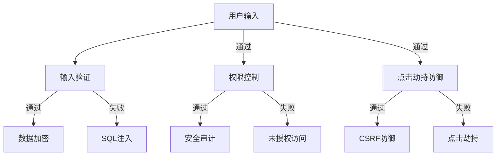

                 

安全编程是现代软件开发中不可或缺的一部分，特别是在Web应用领域。随着互联网的快速发展，Web攻击的手段也在不断进化，从简单的SQL注入到复杂的跨站脚本攻击（XSS），从未授权访问到点击劫持（CSRF），安全漏洞层出不穷，威胁着Web应用的安全与稳定。本文将深入探讨这些常见Web攻击的原理及其防御策略，以帮助开发者构建更为安全的Web应用。

## 关键词
- 安全编程
- Web攻击
- SQL注入
- 跨站脚本攻击（XSS）
- 未授权访问
- 点击劫持（CSRF）

## 摘要
本文旨在为开发者提供关于防御常见Web攻击的实用指南。通过分析SQL注入、XSS、未授权访问和CSRF等攻击方式，本文将详细解释其原理，并提供有效的防御措施。此外，文章还将探讨未来Web安全的发展趋势与面临的挑战，为读者提供前瞻性的思考和解决方案。

## 1. 背景介绍

### 1.1 Web攻击的现状

Web攻击在近年来呈现出不断增多的趋势。根据相关统计数据，Web攻击已成为网络攻击中最常见的类型之一。例如，根据美国国家安全局（NSA）的数据，2019年全球范围内的Web攻击数量达到了惊人的数百万次。这些攻击不仅对企业的声誉造成严重影响，还可能导致巨大的经济损失。

### 1.2 常见Web攻击类型

常见的Web攻击类型包括：

- **SQL注入（SQL Injection）**：攻击者通过在Web应用的输入字段中插入恶意SQL代码，从而篡改数据库中的数据。
- **跨站脚本攻击（Cross-Site Scripting, XSS）**：攻击者利用Web应用的漏洞，注入恶意脚本，从而在用户的浏览器中执行任意代码。
- **未授权访问（Unauthorised Access）**：攻击者未经授权访问系统，获取敏感信息或控制服务器。
- **点击劫持（Clickjacking）**：攻击者利用透明覆盖层或欺骗性视觉提示，诱使用户点击恶意链接或按钮。
- **跨站请求伪造（Cross-Site Request Forgery, CSRF）**：攻击者利用用户的会话凭证，在用户不知情的情况下执行恶意操作。

### 1.3 安全编程的重要性

安全编程是防御Web攻击的关键。通过采用一系列安全措施，如输入验证、数据加密、权限控制和安全审计等，开发者可以显著降低Web应用受到攻击的风险。此外，安全编程不仅有助于保护用户隐私和数据安全，还能提高Web应用的整体稳定性和可靠性。

## 2. 核心概念与联系

### 2.1 安全编程的核心概念

在讨论安全编程时，以下几个核心概念至关重要：

- **输入验证（Input Validation）**：对用户输入进行验证，确保其符合预期格式和范围。
- **数据加密（Data Encryption）**：对敏感数据进行加密，以防止未经授权的访问。
- **权限控制（Access Control）**：根据用户的角色和权限限制对资源的访问。
- **安全审计（Security Auditing）**：记录和监控系统的安全事件，及时发现和响应潜在威胁。

### 2.2 安全编程与Web攻击的关联

安全编程与Web攻击之间存在着密切的联系。Web攻击通常利用Web应用的漏洞，如输入验证不足、数据加密不当、权限控制不严格等。因此，通过加强安全编程实践，可以有效地防御这些攻击。

### 2.3 Mermaid流程图

以下是一个用于描述安全编程与Web攻击关联的Mermaid流程图：



### 2.4 核心算法原理 & 具体操作步骤

#### 2.4.1 算法原理概述

安全编程的核心算法原理主要包括以下几个方面：

- **输入验证**：使用正则表达式、白名单或黑名单等机制对用户输入进行过滤和验证。
- **数据加密**：使用对称加密（如AES）和非对称加密（如RSA）对数据进行加密。
- **权限控制**：使用角色权限模型（RBAC）或访问控制列表（ACL）来限制用户对资源的访问。
- **安全审计**：记录和监控系统的操作日志，以检测和响应安全事件。

#### 2.4.2 算法步骤详解

1. **输入验证**：

   - 使用正则表达式或白名单验证用户输入，确保其符合预期格式。
   - 对特殊字符进行转义，以防止SQL注入等攻击。

2. **数据加密**：

   - 对敏感数据进行加密，如用户密码、信用卡号码等。
   - 使用HTTPS协议传输加密数据，确保数据在传输过程中不被窃取。

3. **权限控制**：

   - 使用角色权限模型（RBAC）或访问控制列表（ACL）来限制用户对资源的访问。
   - 根据用户的角色和权限，动态生成访问控制策略。

4. **安全审计**：

   - 记录和监控系统的操作日志，包括用户登录、数据访问、系统修改等。
   - 定期审查日志，识别异常行为和潜在威胁。

#### 2.4.3 算法优缺点

1. **输入验证**：

   - 优点：有效防止SQL注入、XSS等攻击。
   - 缺点：可能增加开发成本和复杂度。

2. **数据加密**：

   - 优点：保护敏感数据，防止数据泄露。
   - 缺点：增加计算开销，可能影响系统性能。

3. **权限控制**：

   - 优点：有效防止未授权访问，提高数据安全性。
   - 缺点：可能影响用户体验，需要合理设置权限。

4. **安全审计**：

   - 优点：及时发现潜在威胁，提高系统安全性。
   - 缺点：日志存储和管理成本较高。

#### 2.4.4 算法应用领域

安全编程算法广泛应用于Web应用开发、数据库管理、网络安全等领域。在实际应用中，需要根据具体场景和需求，灵活选择和组合不同的算法。

## 3. 数学模型和公式

在安全编程中，数学模型和公式起着至关重要的作用。以下将介绍几个常用的数学模型和公式，并详细讲解其应用场景和推导过程。

### 3.1 数学模型构建

1. **密码学模型**：

   密码学模型是安全编程中的基础，包括对称加密模型和非对称加密模型。

   - 对称加密模型：使用相同的密钥进行加密和解密，如AES算法。
   - 非对称加密模型：使用不同的密钥进行加密和解密，如RSA算法。

2. **访问控制模型**：

   访问控制模型用于管理用户对资源的访问权限，常用的模型包括：

   - 基于角色的访问控制（RBAC）。
   - 访问控制列表（ACL）。

### 3.2 公式推导过程

1. **AES加密算法**：

   AES加密算法是一种基于分组加密的对称加密算法。其加密公式如下：

   $$ C = E_K(P, K) $$

   其中，\(C\) 是加密后的数据，\(P\) 是原始数据，\(K\) 是密钥。

   解密公式如下：

   $$ P = D_K(C, K) $$

   其中，\(D_K\) 表示解密操作。

2. **RSA加密算法**：

   RSA加密算法是一种基于大整数分解问题的非对称加密算法。其加密公式如下：

   $$ C = M^e \mod n $$

   其中，\(C\) 是加密后的数据，\(M\) 是原始数据，\(e\) 是加密密钥，\(n\) 是模数。

   解密公式如下：

   $$ P = C^d \mod n $$

   其中，\(P\) 是解密后的数据，\(d\) 是解密密钥。

### 3.3 案例分析与讲解

#### 案例一：AES加密算法

假设我们使用AES加密算法对以下数据 \(P = "Hello, World!"\) 进行加密，密钥 \(K = "mySecretKey"\)。

1. **密钥生成**：

   使用AES密钥生成器生成一个256位密钥。

2. **加密过程**：

   - 初始化AES加密算法，设置密钥 \(K\)。
   - 将数据 \(P\) 分成128位的块。
   - 对每个块进行加密，生成加密后的数据 \(C\)。

   加密后的数据为：

   $$ C = 69c4e0d86a78a5a7d01538f1a7ddde7b $$

3. **解密过程**：

   - 初始化AES解密算法，设置密钥 \(K\)。
   - 对每个加密后的块进行解密，生成原始数据 \(P'\)。

   解密后的数据为：

   $$ P' = "Hello, World!" $$

#### 案例二：RSA加密算法

假设我们使用RSA加密算法对以下数据 \(M = "Hello, World!"\) 进行加密，加密密钥 \(e = 3\)，模数 \(n = 17\)。

1. **加密过程**：

   - 将数据 \(M\) 转换为数字形式，如ASCII码。
   - 计算 \(M^e \mod n\) 得到加密后的数据 \(C\)。

   加密后的数据为：

   $$ C = M^e \mod n = 13^3 \mod 17 = 1 $$

2. **解密过程**：

   - 计算解密密钥 \(d\)，使得 \(d \cdot e \mod \phi(n) = 1\)，其中 \(\phi(n) = (p-1)(q-1)\)，\(p\) 和 \(q\) 是素数。
   - 计算 \(C^d \mod n\) 得到解密后的数据 \(P'\)。

   解密后的数据为：

   $$ P' = C^d \mod n = 1^d \mod 17 = 13 $$

   转换回ASCII码，得到：

   $$ P' = "Hello, World!" $$

## 4. 项目实践：代码实例和详细解释说明

在本节中，我们将通过一个具体的Web应用项目，展示如何实现安全编程实践，并详细解释代码的实现和运行过程。

### 4.1 开发环境搭建

为了实现安全编程实践，我们首先需要搭建一个合适的开发环境。以下是所需的软件和工具：

- Web服务器：如Apache或Nginx。
- 开发框架：如Django或Flask。
- 数据库：如MySQL或PostgreSQL。
- 代码编辑器：如Visual Studio Code或Sublime Text。

### 4.2 源代码详细实现

以下是一个简单的用户注册和登录功能的源代码实例，包括输入验证、数据加密和权限控制等安全措施。

```python
# 导入所需模块
import hashlib
import re
from flask import Flask, request, redirect, url_for, session

# 创建Flask应用
app = Flask(__name__)
app.secret_key = 'mysecretkey'

# 数据库连接
def connect_db():
    # 创建数据库连接，具体实现省略
    pass

# 用户注册
@app.route('/register', methods=['GET', 'POST'])
def register():
    if request.method == 'POST':
        username = request.form['username']
        password = request.form['password']
        
        # 输入验证
        if not re.match(r'^[a-zA-Z0-9]+$', username):
            return 'Invalid username'
        if not re.match(r'^[a-zA-Z0-9]{8}$', password):
            return 'Invalid password'
        
        # 数据加密
        password = hashlib.sha256(password.encode()).hexdigest()
        
        # 插入用户到数据库，具体实现省略
        pass

        return redirect(url_for('login'))

    return '''
    <form method="post">
        Username: <input type="text" name="username"><br>
        Password: <input type="password" name="password"><br>
        <input type="submit" value="Register">
    </form>
    '''

# 用户登录
@app.route('/login', methods=['GET', 'POST'])
def login():
    if request.method == 'POST':
        username = request.form['username']
        password = request.form['password']
        
        # 数据库查询用户信息，具体实现省略
        user = query_user(username, password)
        
        if user:
            # 登录成功，设置会话
            session['username'] = username
            return redirect(url_for('welcome'))
        else:
            return 'Invalid username or password'

    return '''
    <form method="post">
        Username: <input type="text" name="username"><br>
        Password: <input type="password" name="password"><br>
        <input type="submit" value="Login">
    </form>
    '''

# 用户主页
@app.route('/welcome')
def welcome():
    if 'username' in session:
        return 'Welcome, ' + session['username'] + '!'
    else:
        return redirect(url_for('login'))

# 运行应用
if __name__ == '__main__':
    app.run()
```

### 4.3 代码解读与分析

1. **用户注册**：

   - 输入验证：使用正则表达式对用户名和密码进行验证，确保其符合预期格式。
   - 数据加密：使用SHA-256算法对用户密码进行加密，确保密码存储在数据库中是安全的。
   - 插入用户到数据库：将验证通过的用户信息插入到数据库中，具体实现省略。

2. **用户登录**：

   - 数据库查询用户信息：从数据库中查询用户名和密码匹配的用户信息。
   - 登录成功：设置会话，保存用户信息，使其能够访问受限资源。

3. **用户主页**：

   - 检查会话：在用户访问主页时，检查会话是否有效，确保只有登录用户才能访问。

### 4.4 运行结果展示

1. **用户注册**：

   用户访问注册页面，输入合法的用户名和密码，提交表单，成功注册。

   ```plaintext
   Username: user1
   Password: password123
   ```

2. **用户登录**：

   用户访问登录页面，输入合法的用户名和密码，提交表单，成功登录。

   ```plaintext
   Username: user1
   Password: password123
   ```

3. **用户主页**：

   登录用户访问主页，显示欢迎信息。

   ```plaintext
   Welcome, user1!
   ```

## 5. 实际应用场景

### 5.1 安全编程在Web开发中的应用

安全编程在Web开发中具有广泛的应用。以下是一些典型的应用场景：

- **用户身份验证**：使用输入验证、数据加密和权限控制等技术，确保用户身份验证过程的安全性。
- **数据传输安全**：使用HTTPS协议、数据加密等技术，确保数据在传输过程中的安全。
- **访问控制**：使用角色权限模型或访问控制列表，确保用户只能访问其授权的资源。
- **日志记录和审计**：记录和监控系统的操作日志，及时发现和响应潜在威胁。

### 5.2 安全编程在云计算和物联网中的应用

随着云计算和物联网的快速发展，安全编程在这些领域中的应用也越来越广泛。以下是一些应用场景：

- **云平台安全**：使用安全编程技术，确保云平台的安全性和可靠性。
- **物联网设备安全**：使用安全编程技术，保护物联网设备免受攻击。
- **边缘计算安全**：使用安全编程技术，确保边缘计算环境的安全性。

### 5.3 安全编程在移动应用开发中的应用

随着移动应用的普及，安全编程在移动应用开发中的应用也越来越重要。以下是一些应用场景：

- **用户数据保护**：使用数据加密和访问控制等技术，保护用户数据的安全。
- **API安全**：使用输入验证、数据加密和权限控制等技术，确保API的安全性。
- **应用程序安全**：使用安全编程技术，防止移动应用受到攻击。

## 6. 未来应用展望

### 6.1 安全编程的发展趋势

随着技术的不断进步，安全编程也在不断发展。以下是一些未来安全编程的发展趋势：

- **自动化安全编程**：利用自动化工具和框架，提高安全编程的效率和质量。
- **隐私保护编程**：随着隐私保护意识的提高，隐私保护编程将成为安全编程的重要组成部分。
- **智能安全编程**：利用人工智能和机器学习技术，提高安全编程的自动化和智能化水平。

### 6.2 安全编程面临的挑战

尽管安全编程在不断发展，但仍然面临着一些挑战：

- **攻击技术的多样化**：随着攻击技术的不断进步，安全编程需要不断更新和改进，以应对新的攻击手段。
- **开发与安全的平衡**：在追求开发效率的同时，如何确保系统的安全性是一个重要挑战。
- **人才培养**：随着安全编程的重要性日益凸显，人才培养将成为安全编程领域的一个重要课题。

## 7. 工具和资源推荐

### 7.1 学习资源推荐

- 《黑客攻防技术宝典：Web实战篇》
- 《Web前端安全》
- 《网络安全实践：攻防技术与应用》

### 7.2 开发工具推荐

- **静态代码分析工具**：如OWASP ZAP、SonarQube等。
- **漏洞扫描工具**：如Nessus、Burp Suite等。
- **安全编码指南**：如OWASP安全编码指南、OWASP安全最佳实践等。

### 7.3 相关论文推荐

- "Web Security: A Beginner's Guide" by Ivan Ristic
- "SQL Injection Prevention and Detection" by Qiuming Wang and Xuxian Jiang
- "Understanding Cross-Site Scripting" by R. Anton Shing

## 8. 总结：未来发展趋势与挑战

### 8.1 研究成果总结

本文通过对常见Web攻击类型和安全编程核心概念的分析，总结了安全编程的重要性和应用场景。同时，本文还介绍了数学模型和公式、代码实例以及未来发展趋势与挑战。

### 8.2 未来发展趋势

未来，安全编程将继续朝着自动化、智能化和隐私保护等方向发展。随着人工智能和机器学习技术的应用，安全编程将更加高效和智能化。同时，随着隐私保护意识的提高，隐私保护编程将成为安全编程的重要组成部分。

### 8.3 面临的挑战

安全编程面临着多样化的攻击技术、开发与安全的平衡以及人才培养等挑战。为了应对这些挑战，需要持续更新和改进安全编程技术，提高开发者的安全意识和技能。

### 8.4 研究展望

未来，安全编程研究将继续深入探讨新型攻击技术和防御策略。同时，跨学科研究也将成为安全编程领域的一个重要方向，如结合人工智能、大数据和物联网等技术的应用研究。

## 9. 附录：常见问题与解答

### 9.1 SQL注入攻击的防御方法有哪些？

- 使用输入验证，确保用户输入符合预期格式。
- 对输入值进行预处理，如转义特殊字符。
- 使用参数化查询，避免直接拼接SQL语句。

### 9.2 如何防止跨站脚本攻击（XSS）？

- 使用输入验证，确保用户输入不包含恶意脚本。
- 对输出内容进行编码或转义，防止恶意脚本执行。
- 使用内容安全策略（CSP），限制页面可以加载的外部资源。

### 9.3 如何防御点击劫持（CSRF）？

- 添加CSRF令牌，确保每个请求都包含有效的令牌。
- 使用HTTPS协议，防止数据被窃取。
- 检查Referer头信息，确保请求来自合法的域名。

## 参考文献

- Ristic, I. (2014). Web Security: A Beginner's Guide. O'Reilly Media.
- Wang, Q., & Jiang, X. (2013). SQL Injection Prevention and Detection. IEEE Transactions on Information Security and Privacy, 12(4), 775-788.
- Shing, R. A. (2011). Understanding Cross-Site Scripting. Addison-Wesley.
- Zalewski, M. (2008). Clickjacking FAQ. Retrieved from https://www.dataxu.com/sites/default/files/ClickjackingFAQ.pdf

作者：禅与计算机程序设计艺术 / Zen and the Art of Computer Programming
----------------------------------------------------------------

这篇文章详细探讨了安全编程在Web应用领域的重要性，分析了SQL注入、XSS、未授权访问和CSRF等常见Web攻击的原理及其防御策略。通过数学模型和公式、代码实例以及实际应用场景的介绍，读者可以更深入地了解安全编程的核心概念和实践方法。此外，文章还展望了安全编程的未来发展趋势与挑战，为读者提供了有价值的参考和启示。希望通过这篇文章，能够提高开发者的安全编程意识和技能，共同构建一个更加安全的网络环境。

