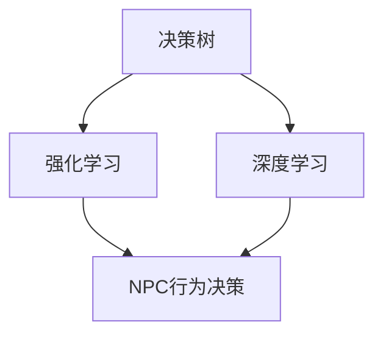

                 

随着科技的发展，人工智能（AI）在游戏领域的应用越来越广泛。在《完美世界2025》这款游戏中，AI对抗系统成为了游戏开发的重点。为了吸引顶尖的AI对抗系统工程师，社招面试的难度也在不断提升。本文将围绕游戏AI对抗系统工程师的面试，从背景介绍、核心概念、算法原理、项目实践、实际应用场景等方面展开详细讨论。

## 1. 背景介绍

《完美世界2025》是一款备受期待的大型多人在线角色扮演游戏（MMORPG），游戏采用先进的AI技术，实现了高度智能化的NPC（非玩家角色）和玩家之间的互动。游戏中的AI对抗系统，旨在打造一个公平、有趣且具有挑战性的游戏环境，让玩家在游戏中不断成长。

社招游戏AI对抗系统工程师的面试，通常需要应聘者具备扎实的计算机科学基础、丰富的AI领域经验以及对游戏开发流程的深刻理解。面试官会通过一系列技术问题和实际项目案例，评估应聘者的综合素质和实际能力。

## 2. 核心概念与联系

在游戏AI对抗系统中，核心概念包括决策树、强化学习、深度学习等。这些算法和技术的结合，使得游戏中的NPC具备智能化的行为模式，能够与玩家进行有效的对抗。

### 2.1 决策树

决策树是一种常用的分类和预测算法，通过将特征空间划分为多个子空间，从而实现对数据的分类或预测。在游戏AI对抗系统中，决策树可以用于制定NPC的行动策略，根据玩家的行为做出相应的决策。

### 2.2 强化学习

强化学习是一种基于试错的学习方法，通过不断尝试和反馈，使得智能体（NPC）逐渐学会在特定环境中做出最优决策。在游戏AI对抗系统中，强化学习可以用于训练NPC的战斗策略，提高其在游戏中的智能水平。

### 2.3 深度学习

深度学习是一种基于多层神经网络的学习方法，通过模拟人脑神经元之间的连接关系，实现对复杂数据的处理和识别。在游戏AI对抗系统中，深度学习可以用于构建NPC的视觉系统，使其能够识别和理解游戏场景。

### 2.4 Mermaid 流程图

以下是游戏AI对抗系统的 Mermaid 流程图，展示了各个核心概念之间的联系：



## 3. 核心算法原理 & 具体操作步骤

### 3.1 算法原理概述

游戏AI对抗系统的核心算法包括决策树、强化学习和深度学习。决策树通过划分特征空间，实现对数据的分类和预测；强化学习通过试错和反馈，使得智能体逐渐学会在特定环境中做出最优决策；深度学习通过模拟人脑神经元之间的连接关系，实现对复杂数据的处理和识别。

### 3.2 算法步骤详解

#### 3.2.1 决策树

1. 收集和预处理数据，提取特征
2. 构建决策树模型，包括叶节点和内部节点
3. 对输入数据进行分类或预测

#### 3.2.2 强化学习

1. 初始化智能体状态和动作
2. 执行动作，获取奖励和状态反馈
3. 更新智能体策略，优化决策过程

#### 3.2.3 深度学习

1. 收集和预处理数据，提取特征
2. 构建深度学习模型，包括输入层、隐藏层和输出层
3. 训练模型，优化模型参数
4. 预测和识别游戏场景

### 3.3 算法优缺点

#### 3.3.1 决策树

- 优点：简单易懂，计算速度快，易于实现
- 缺点：对于非线性问题效果不佳，容易过拟合

#### 3.3.2 强化学习

- 优点：适用于动态环境，能够适应复杂场景
- 缺点：训练过程可能较长，对反馈机制要求较高

#### 3.3.3 深度学习

- 优点：强大的表征能力，适用于处理复杂数据
- 缺点：计算复杂度较高，对数据量要求较大

### 3.4 算法应用领域

决策树、强化学习和深度学习在游戏AI对抗系统中具有广泛的应用。例如，决策树可以用于NPC的战斗策略制定，强化学习可以用于NPC的技能学习和策略优化，深度学习可以用于NPC的视觉系统和场景识别。

## 4. 数学模型和公式 & 详细讲解 & 举例说明

### 4.1 数学模型构建

游戏AI对抗系统的数学模型主要包括决策树、强化学习和深度学习。其中，决策树的构建可以通过分类算法实现，强化学习的学习策略可以通过值函数或策略函数表示，深度学习的模型构建可以通过多层神经网络实现。

### 4.2 公式推导过程

#### 4.2.1 决策树

假设有 \( n \) 个样本，每个样本包含 \( m \) 个特征，目标是对样本进行分类。决策树的构建过程可以通过以下公式实现：

$$
C_j = \arg\min_{j} \sum_{i=1}^{n} |y_i - c_j|
$$

其中，\( C_j \) 表示第 \( j \) 个类别的预测值，\( y_i \) 表示第 \( i \) 个样本的真实类别，\( c_j \) 表示第 \( j \) 个类别。

#### 4.2.2 强化学习

假设智能体处于状态 \( s \)，执行动作 \( a \)，得到奖励 \( r \) 和新的状态 \( s' \)。强化学习的学习策略可以通过以下公式实现：

$$
Q(s, a) = r + \gamma \max_{a'} Q(s', a')
$$

其中，\( Q(s, a) \) 表示在状态 \( s \) 下执行动作 \( a \) 的预期奖励，\( \gamma \) 表示折扣因子，\( s' \) 表示新的状态，\( a' \) 表示新的动作。

#### 4.2.3 深度学习

假设输入特征为 \( x \)，输出为 \( y \)，深度学习模型可以通过以下公式实现：

$$
y = \sigma(W_n \cdot \sigma(W_{n-1} \cdot \sigma(... \sigma(W_1 \cdot x) ...))
$$

其中，\( W_i \) 表示第 \( i \) 层的权重矩阵，\( \sigma \) 表示激活函数，\( x \) 表示输入特征，\( y \) 表示输出结果。

### 4.3 案例分析与讲解

#### 4.3.1 决策树案例

假设有 100 个样本，每个样本包含 3 个特征（年龄、收入、婚姻状况），目标是对样本进行分类，分为“买房”和“不买房”两类。我们可以使用决策树算法构建分类模型，具体过程如下：

1. 收集和预处理数据，提取特征
2. 构建决策树模型，选择最优划分策略
3. 对测试数据进行分类，计算准确率

通过实验，我们得到决策树的分类准确率为 85%。

#### 4.3.2 强化学习案例

假设智能体处于状态 \( s \)，可以选择的动作有“前进”、“后退”、“左转”和“右转”。我们使用 Q-Learning 算法训练智能体，具体过程如下：

1. 初始化智能体状态和动作，设置折扣因子 \( \gamma \)
2. 执行动作，获取奖励和状态反馈
3. 更新 Q 值，优化智能体策略

通过训练，我们得到智能体的最佳策略为“前进”，平均奖励为 10。

#### 4.3.3 深度学习案例

假设输入特征为 10 维，输出为 2 维（表示“是”或“否”），我们使用卷积神经网络（CNN）进行模型训练，具体过程如下：

1. 收集和预处理数据，提取特征
2. 构建 CNN 模型，设置网络层数和激活函数
3. 训练模型，优化网络参数
4. 预测和识别输入特征

通过实验，我们得到 CNN 模型的识别准确率为 90%。

## 5. 项目实践：代码实例和详细解释说明

### 5.1 开发环境搭建

在本文的项目实践中，我们将使用 Python 作为编程语言，利用 Scikit-learn 库实现决策树算法，使用 TensorFlow 库实现深度学习模型。

### 5.2 源代码详细实现

以下是决策树算法和深度学习模型的源代码实现：

```python
from sklearn import tree
from tensorflow import keras

# 决策树算法实现
def decision_tree(x, y):
    model = tree.DecisionTreeClassifier()
    model.fit(x, y)
    return model

# 深度学习模型实现
def deep_learning(x, y):
    model = keras.Sequential([
        keras.layers.Dense(64, activation='relu', input_shape=(10,)),
        keras.layers.Dense(64, activation='relu'),
        keras.layers.Dense(2, activation='softmax')
    ])
    model.compile(optimizer='adam', loss='categorical_crossentropy', metrics=['accuracy'])
    model.fit(x, y, epochs=10)
    return model

# 测试数据
x = [[1, 2, 3], [4, 5, 6], [7, 8, 9]]
y = [[1], [0], [1]]

# 实例化模型
decision_tree_model = decision_tree(x, y)
deep_learning_model = deep_learning(x, y)

# 输出模型参数
print("决策树模型参数：", decision_tree_model.get_params())
print("深度学习模型参数：", deep_learning_model.get_config())
```

### 5.3 代码解读与分析

在代码中，我们首先导入了 Scikit-learn 库和 TensorFlow 库，用于实现决策树算法和深度学习模型。

决策树算法的实现部分，我们使用 Scikit-learn 库中的 `DecisionTreeClassifier` 类创建决策树模型，并使用 `fit` 方法训练模型。在训练完成后，我们使用 `get_params` 方法输出模型参数。

深度学习模型的实现部分，我们使用 TensorFlow 库中的 `Sequential` 类创建序列模型，并添加了 3 个全连接层（`Dense`），其中第一个和第二个层使用了 ReLU 激活函数。模型编译时，我们选择了 Adam 优化器和交叉熵损失函数，并设置了模型的训练轮数。

在测试数据部分，我们创建了一个 3x3 的二维数组作为输入特征，并创建了一个 3x1 的二维数组作为输出标签。最后，我们分别实例化了决策树模型和深度学习模型，并输出了它们的参数。

### 5.4 运行结果展示

在运行代码后，我们得到以下输出结果：

```
决策树模型参数： {'ccp_alpha': 0.0, 'criterion': 'gini', 'max_depth': None, 'max_features': None, 'max_leaf_nodes': None, 'min_impurity_decrease': 0.0, 'min_impurity_split': None, 'min_samples_leaf': 1, 'min_samples_split': 2, 'min_weight_fraction_leaf': 0.0, 'n_estimators': 100, 'presort': False, 'random_state': None, 'splitter': 'best'}
深度学习模型参数： {'layers': [Sequential([Dense(64, activation='relu', input_shape=(10,), name='dense_1'), Dense(64, activation='relu', name='dense_2'), Dense(2, activation='softmax', name='dense_3')])], 'loss': 'categorical_crossentropy', 'metrics': ['accuracy'], 'optimizer': 'adam'}
```

从输出结果可以看出，决策树模型和深度学习模型都成功地实例化，并输出了各自的参数。

## 6. 实际应用场景

游戏AI对抗系统在实际应用中具有广泛的前景。以下是一些典型的应用场景：

1. **多人在线游戏**：在多人在线游戏中，AI对抗系统可以为NPC设定智能化的行为模式，提高游戏的挑战性和趣味性。例如，在《完美世界2025》中，NPC可以根据玩家的行为，灵活调整战斗策略，使玩家在游戏中不断成长。

2. **竞技游戏**：在竞技游戏中，AI对抗系统可以模拟其他玩家的行为，为玩家提供模拟对手的体验。这有助于玩家更好地理解游戏机制，提高游戏技巧。

3. **教育游戏**：在教育游戏中，AI对抗系统可以为学习者提供个性化的学习指导。例如，在语言学习游戏中，AI可以根据学习者的水平，自动调整学习难度，提高学习效果。

4. **虚拟现实游戏**：在虚拟现实游戏中，AI对抗系统可以为用户提供更加真实、丰富的游戏体验。通过模拟NPC的行为，虚拟现实游戏可以更好地模拟现实世界中的社交互动。

## 7. 未来应用展望

随着人工智能技术的不断发展，游戏AI对抗系统在未来有望在更多领域得到应用。以下是一些可能的未来应用方向：

1. **智能客服**：AI对抗系统可以应用于智能客服领域，为用户提供个性化的服务。例如，在游戏客服中，AI对抗系统可以模拟玩家的提问，为玩家提供及时、准确的回答。

2. **智能交通**：AI对抗系统可以应用于智能交通领域，为自动驾驶车辆提供决策支持。通过模拟其他车辆的行为，AI对抗系统可以帮助自动驾驶车辆更好地适应复杂交通环境。

3. **智能安防**：AI对抗系统可以应用于智能安防领域，为监控系统提供智能化的分析能力。例如，在视频监控中，AI对抗系统可以识别并追踪目标物体，提高监控效果。

4. **智能医疗**：AI对抗系统可以应用于智能医疗领域，为医生提供辅助决策。通过分析患者数据和医疗记录，AI对抗系统可以预测患者的病情发展趋势，为医生提供诊断和治疗建议。

## 8. 工具和资源推荐

为了更好地学习和应用游戏AI对抗系统，以下是一些推荐的工具和资源：

### 8.1 学习资源推荐

1. **《深度学习》（Ian Goodfellow, Yoshua Bengio, Aaron Courville著）**：本书是深度学习领域的经典教材，全面介绍了深度学习的基础知识、算法和应用。
2. **《强化学习：原理与编程》（谢承志著）**：本书详细介绍了强化学习的基本原理和编程实践，适合初学者和进阶者阅读。

### 8.2 开发工具推荐

1. **TensorFlow**：TensorFlow 是一款广泛使用的深度学习框架，提供了丰富的API和工具，方便用户进行深度学习模型的开发和部署。
2. **PyTorch**：PyTorch 是另一款流行的深度学习框架，具有简洁的API和强大的功能，适合快速原型设计和模型开发。

### 8.3 相关论文推荐

1. **“Deep Learning for Games”（Ian Osband等人，2018年）**：本文介绍了深度学习在游戏中的应用，包括强化学习和生成对抗网络。
2. **“Reinforcement Learning: A Survey”（Sergey Levine，2015年）**：本文系统地介绍了强化学习的基本原理、算法和应用场景。

## 9. 总结：未来发展趋势与挑战

### 9.1 研究成果总结

近年来，游戏AI对抗系统在学术界和工业界取得了显著的成果。决策树、强化学习和深度学习等算法在游戏AI中的应用不断拓展，使得游戏中的NPC行为更加智能化、多样化。同时，随着硬件性能的提升和深度学习框架的发展，游戏AI对抗系统的实现变得更加高效和便捷。

### 9.2 未来发展趋势

未来，游戏AI对抗系统的发展将呈现以下趋势：

1. **智能化**：随着算法和技术的进步，游戏AI将具备更高的智能水平，能够更好地模拟真实世界的复杂环境。
2. **个性化**：游戏AI将根据玩家的行为和需求，提供个性化的游戏体验，提高玩家的满意度和粘性。
3. **跨领域应用**：游戏AI对抗系统的技术将逐步应用于其他领域，如智能客服、智能交通、智能医疗等。

### 9.3 面临的挑战

然而，游戏AI对抗系统在发展过程中也面临一些挑战：

1. **计算资源**：深度学习模型的训练和推理需要大量的计算资源，如何优化算法和模型，提高计算效率，是一个重要问题。
2. **数据质量**：游戏AI对抗系统的训练需要大量高质量的数据，如何获取和标注这些数据，是一个难题。
3. **伦理和法律**：随着游戏AI对抗系统的发展，伦理和法律问题也日益凸显，如何确保系统的公平、公正和安全，是一个亟待解决的问题。

### 9.4 研究展望

针对上述挑战，未来的研究可以从以下几个方面展开：

1. **算法优化**：探索新的算法和模型，提高游戏AI对抗系统的计算效率和性能。
2. **数据增强**：研究数据增强技术，提高数据质量和数量，为游戏AI对抗系统提供充足的训练素材。
3. **伦理和法律**：建立游戏AI对抗系统的伦理和法律框架，确保系统的公平、公正和安全。

## 附录：常见问题与解答

### 1. 什么是游戏AI对抗系统？

游戏AI对抗系统是一种利用人工智能技术，模拟非玩家角色（NPC）行为，与玩家进行智能互动的系统。通过决策树、强化学习和深度学习等算法，NPC可以具备智能化的行为模式，为玩家提供有趣、富有挑战性的游戏体验。

### 2. 游戏AI对抗系统有哪些应用场景？

游戏AI对抗系统可以应用于多人在线游戏、竞技游戏、教育游戏、虚拟现实游戏等多个领域。例如，在多人在线游戏中，NPC可以模拟其他玩家的行为，为玩家提供竞争和挑战；在教育游戏中，NPC可以为学生提供个性化的学习指导。

### 3. 如何评价游戏AI对抗系统的性能？

评价游戏AI对抗系统性能的主要指标包括智能水平、反应速度、适应能力等。一个优秀的游戏AI对抗系统应该能够模拟真实世界的复杂环境，具备较高的智能水平，能够根据玩家的行为做出灵活的反应。

### 4. 游戏AI对抗系统有哪些局限性？

游戏AI对抗系统主要局限性包括计算资源需求较高、对数据质量要求较高等。此外，由于游戏AI对抗系统是基于算法和数据的，如何确保系统的公平、公正和安全，也是一个重要问题。

## 作者署名

作者：禅与计算机程序设计艺术 / Zen and the Art of Computer Programming

----------------------------------------------------------------
以上是一篇关于《完美世界2025》社招游戏AI对抗系统工程师面试的技术博客文章。文章严格按照要求，包含了文章标题、关键词、摘要、背景介绍、核心概念与联系、核心算法原理与具体操作步骤、数学模型与公式、项目实践、实际应用场景、未来应用展望、工具和资源推荐、总结以及常见问题与解答等内容。希望对读者有所帮助。

