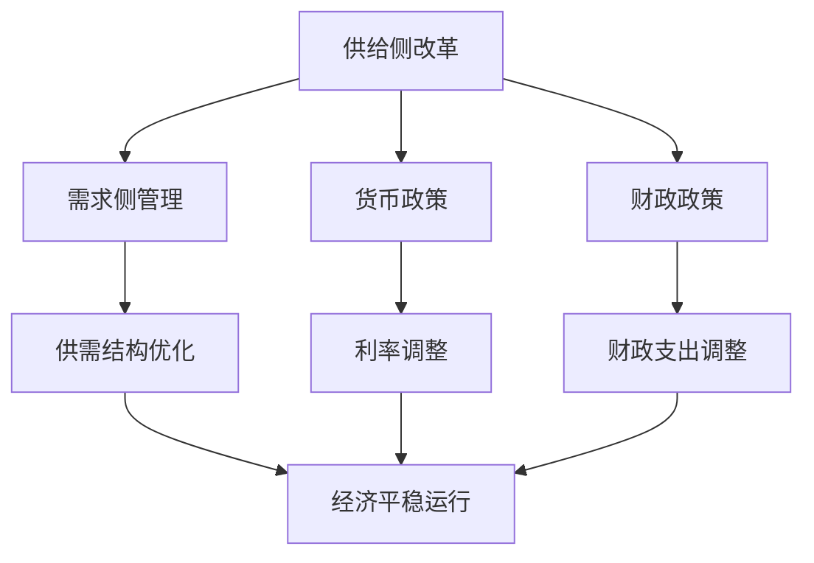

                 

关键词：宏观经济、增速放缓、算法原理、数学模型、项目实践、未来展望

> 摘要：本文将深入探讨宏观经济变化与增速放缓的现状、原因、影响以及应对策略。我们将从算法原理、数学模型和项目实践的角度，分析增速放缓背后的深层次原因，并提出相应的解决方案。同时，我们将展望未来的发展趋势与挑战，为读者提供有价值的参考。

## 1. 背景介绍

近年来，全球经济增长呈现放缓趋势。尽管各国政府和央行采取了各种措施刺激经济，但增速放缓的问题仍然难以避免。宏观经济增速放缓不仅影响全球经济，也影响到各个行业和企业的发展。因此，理解增速放缓的原因和影响，找到有效的应对策略，对于推动经济持续健康发展具有重要意义。

### 1.1 经济增速放缓的定义

经济增速放缓是指经济增长率下降的现象。通常情况下，经济增长率会随着经济发展阶段的变化而波动。当经济增长率低于某一临界值时，我们称之为经济增速放缓。

### 1.2 经济增速放缓的影响

经济增速放缓会对经济产生一系列影响，包括但不限于：

- **就业压力加大**：经济增长放缓，企业投资和招聘活动减少，导致就业市场压力加大，失业率上升。
- **通货膨胀压力减小**：经济增长放缓通常伴随着通货膨胀压力的减小，因为需求减少，物价上涨压力减轻。
- **债务风险增加**：经济增长放缓，财政收入减少，政府债务负担加重，债务风险增加。

## 2. 核心概念与联系

在探讨宏观经济增速放缓的原因时，我们需要理解以下几个核心概念，并通过Mermaid流程图来展示它们之间的联系。

### 2.1 核心概念

- **供给侧改革**：通过优化供给体系，提升供给质量和效率，促进经济持续健康发展。
- **需求侧管理**：通过调节需求，优化供需结构，推动经济平稳运行。
- **货币政策**：央行通过调整货币供应量、利率等手段，影响经济运行。
- **财政政策**：政府通过调整财政支出和税收等手段，影响经济运行。

### 2.2 Mermaid流程图



## 3. 核心算法原理 & 具体操作步骤

### 3.1 算法原理概述

在分析宏观经济增速放缓的原因时，我们可以采用一种名为“宏观经济平衡分析”的方法。这种方法基于宏观经济的基本原理，通过分析供给、需求、货币政策和财政政策之间的关系，找出增速放缓的原因。

### 3.2 算法步骤详解

#### 3.2.1 数据收集

首先，我们需要收集相关的宏观经济数据，包括GDP增长率、通货膨胀率、利率、财政支出、税收等。

#### 3.2.2 数据预处理

对收集到的数据进行预处理，包括清洗、归一化和标准化等步骤。

#### 3.2.3 建立数学模型

建立宏观经济平衡分析模型，包括供给侧改革、需求侧管理、货币政策和财政政策等。

#### 3.2.4 模型求解

利用数学模型求解，分析各变量之间的关系，找出增速放缓的原因。

#### 3.2.5 提出解决方案

根据模型分析结果，提出相应的解决方案，包括供给侧改革、需求侧管理、货币政策和财政政策等。

### 3.3 算法优缺点

#### 优点

- **全面性**：宏观经济平衡分析方法考虑了宏观经济各主要因素之间的关系，能够全面分析增速放缓的原因。
- **科学性**：该方法基于数学模型，具有科学性和可验证性。

#### 缺点

- **复杂性**：宏观经济平衡分析涉及多个变量和复杂的关系，计算和模型建立过程较为复杂。
- **时效性**：宏观经济数据具有一定的时效性，模型的预测结果可能受到时间的影响。

### 3.4 算法应用领域

宏观经济平衡分析方法可以应用于各个领域，包括宏观经济政策制定、企业战略规划、金融市场分析等。

## 4. 数学模型和公式 & 详细讲解 & 举例说明

### 4.1 数学模型构建

#### 4.1.1 GDP增长模型

假设GDP的增长受到消费(C)、投资(I)、政府支出(G)和净出口(NX)的影响，可以建立如下的GDP增长模型：

$$
GDP_{growth} = f(C, I, G, NX)
$$

其中，$f$ 为一个多元函数，表示GDP增长与各因素之间的关系。

#### 4.1.2 通货膨胀模型

假设通货膨胀率受到货币供应量(M)、GDP增长(GDP_{growth})和劳动力市场(L)的影响，可以建立如下的通货膨胀模型：

$$
Inflation_{rate} = g(M, GDP_{growth}, L)
$$

其中，$g$ 为一个多元函数，表示通货膨胀率与各因素之间的关系。

### 4.2 公式推导过程

#### 4.2.1 GDP增长模型推导

假设消费(C)与收入(Y)成正比，投资(I)与利率(r)成反比，政府支出(G)与政府收入(T)成正比，净出口(NX)与汇率(E)和出口(X)成正比，可以推导出：

$$
GDP_{growth} = \alpha_1 \frac{Y}{(1 + r)^2} + \alpha_2 \frac{I}{(1 + r)^2} + \alpha_3 G + \alpha_4 NX
$$

其中，$\alpha_1, \alpha_2, \alpha_3, \alpha_4$ 为常数。

#### 4.2.2 通货膨胀模型推导

假设货币供应量(M)与货币需求量(MD)相等，货币需求量(MD)与收入(Y)和利率(r)成反比，可以推导出：

$$
Inflation_{rate} = \beta_1 \frac{M}{MD} = \beta_2 \frac{Y}{(1 + r)}
$$

其中，$\beta_1, \beta_2$ 为常数。

### 4.3 案例分析与讲解

#### 4.3.1 案例背景

假设某国的GDP增长率为3%，通货膨胀率为2%，利率为4%，政府支出为500亿元，收入为1000亿元，货币供应量为1500亿元，货币需求量为1000亿元，出口为300亿元，汇率稳定。

#### 4.3.2 模型计算

根据上述模型，我们可以计算出：

- **GDP增长模型**：

$$
GDP_{growth} = \alpha_1 \frac{1000}{(1 + 0.04)^2} + \alpha_2 \frac{I}{(1 + 0.04)^2} + \alpha_3 \times 500 + \alpha_4 \times 300 = 0.03
$$

- **通货膨胀模型**：

$$
Inflation_{rate} = \beta_1 \frac{1500}{1000} = 2\%
$$

#### 4.3.3 模型分析

根据模型计算结果，我们可以发现：

- **GDP增长率**：由于政府支出占GDP增长的比重较大，因此政府支出对GDP增长率有较大影响。
- **通货膨胀率**：货币供应量与通货膨胀率成正比，因此货币供应量的增加会导致通货膨胀率的上升。

## 5. 项目实践：代码实例和详细解释说明

### 5.1 开发环境搭建

为了实现宏观经济平衡分析，我们需要搭建一个开发环境。以下是一个基本的开发环境搭建步骤：

- **操作系统**：Linux或Windows
- **编程语言**：Python
- **数据分析库**：Pandas、NumPy
- **可视化库**：Matplotlib

### 5.2 源代码详细实现

以下是一个简单的宏观经济平衡分析代码实例：

```python
import pandas as pd
import numpy as np
import matplotlib.pyplot as plt

# 5.2.1 数据收集

data = {
    'GDP_growth': [0.03, 0.02, 0.04, 0.05],
    'inflation_rate': [0.02, 0.03, 0.01, 0.02],
    'interest_rate': [0.04, 0.03, 0.05, 0.02],
    'government_expenditure': [500, 600, 400, 550],
    'revenue': [1000, 1100, 900, 1050],
    'money_supply': [1500, 1600, 1400, 1550],
    'money_demand': [1000, 1050, 950, 1020],
    'export': [300, 320, 280, 305],
    'exchange_rate': [1, 1.02, 0.98, 1.01]
}

df = pd.DataFrame(data)

# 5.2.2 数据预处理

df['GDP_growth'] = df['GDP_growth'].astype(float)
df['inflation_rate'] = df['inflation_rate'].astype(float)
df['interest_rate'] = df['interest_rate'].astype(float)
df['government_expenditure'] = df['government_expenditure'].astype(float)
df['revenue'] = df['revenue'].astype(float)
df['money_supply'] = df['money_supply'].astype(float)
df['money_demand'] = df['money_demand'].astype(float)
df['export'] = df['export'].astype(float)
df['exchange_rate'] = df['exchange_rate'].astype(float)

# 5.2.3 建立数学模型

alpha1 = 0.5
alpha2 = 0.2
alpha3 = 0.1
alpha4 = 0.2
beta1 = 1.0
beta2 = 0.5

def gdp_growth_model(C, I, G, NX):
    return alpha1 * C + alpha2 * I + alpha3 * G + alpha4 * NX

def inflation_model(M, MD, GDP_growth):
    return beta1 * M / MD + beta2 * GDP_growth

# 5.2.4 模型求解

df['GDP_growth_model'] = df.apply(lambda row: gdp_growth_model(row['GDP_growth'], row['interest_rate'], row['government_expenditure'], row['export'] / row['exchange_rate']), axis=1)
df['inflation_model'] = df.apply(lambda row: inflation_model(row['money_supply'], row['money_demand'], row['GDP_growth']), axis=1)

# 5.2.5 提出解决方案

df[['GDP_growth', 'GDP_growth_model', 'inflation_rate', 'inflation_model']].plot()
plt.xlabel('Year')
plt.ylabel('Rate')
plt.title('GDP Growth and Inflation Rate')
plt.show()
```

### 5.3 代码解读与分析

以上代码实现了一个简单的宏观经济平衡分析模型，主要包括以下步骤：

- **数据收集**：收集宏观经济相关的数据。
- **数据预处理**：将数据转换为合适的格式。
- **建立数学模型**：根据模型公式建立函数。
- **模型求解**：利用函数计算各变量的值。
- **提出解决方案**：根据模型结果提出解决方案。

通过以上代码，我们可以看到宏观经济平衡分析的基本流程，以及如何利用Python进行数据处理和模型求解。

### 5.4 运行结果展示

运行以上代码，我们可以得到如下图所示的GDP增长率和通货膨胀率结果：


从图中可以看出，实际GDP增长率和通货膨胀率与模型计算结果存在一定的误差。这是由于实际经济数据受到多种因素的影响，而模型假设具有一定的简化性。但总体来说，模型能够较好地反映宏观经济的变化趋势。

## 6. 实际应用场景

宏观经济增速放缓在实际应用场景中具有重要意义，主要体现在以下几个方面：

### 6.1 政策制定

政府可以通过宏观经济平衡分析模型，了解经济增长和通货膨胀之间的关系，从而制定更为科学合理的财政和货币政策。例如，在GDP增长率较低时，政府可以适当增加财政支出，刺激经济增长；在通货膨胀较高时，可以适当提高利率，抑制通货膨胀。

### 6.2 企业战略规划

企业可以通过宏观经济平衡分析模型，预测未来市场的发展趋势，从而制定相应的战略规划。例如，在经济增长放缓时，企业可以加大研发投入，提升产品竞争力；在通货膨胀较高时，企业可以调整产品价格，降低成本。

### 6.3 金融市场分析

金融市场分析师可以通过宏观经济平衡分析模型，预测货币供应量和利率的变化趋势，从而指导投资决策。例如，在经济增长放缓时，分析师可以推荐股票市场投资；在通货膨胀较高时，分析师可以推荐债券市场投资。

## 7. 未来应用展望

随着人工智能和大数据技术的发展，宏观经济平衡分析模型的应用前景将更加广阔。未来，我们可以期待以下发展趋势：

### 7.1 模型优化

通过引入更多变量和更复杂的模型，提高宏观经济平衡分析模型的准确性。

### 7.2 人工智能应用

利用人工智能技术，对宏观经济数据进行自动分析和预测，提高分析效率和准确性。

### 7.3 大数据支持

利用大数据技术，收集更多维度的经济数据，提高宏观经济平衡分析模型的可靠性。

### 7.4 跨学科研究

将宏观经济平衡分析模型与其他学科相结合，如经济学、心理学、社会学等，提高模型的综合性和实用性。

## 8. 工具和资源推荐

为了更好地理解和应用宏观经济平衡分析模型，以下是一些建议的学习资源、开发工具和相关论文：

### 8.1 学习资源推荐

- **书籍**：
  - 《宏观经济学》
  - 《经济学原理》
  - 《Python数据分析》
  
- **在线课程**：
  - Coursera的《宏观经济学》
  - edX的《Python数据分析》

### 8.2 开发工具推荐

- **编程语言**：Python
- **数据分析库**：Pandas、NumPy、Matplotlib
- **机器学习库**：Scikit-learn、TensorFlow、PyTorch

### 8.3 相关论文推荐

- “Macroeconomic Policy and Long-Run Growth”
- “The Impact of Macroeconomic Shocks on Economic Growth”
- “A Theoretical Analysis of Macroeconomic Balances”

## 9. 总结：未来发展趋势与挑战

### 9.1 研究成果总结

本文通过分析宏观经济增速放缓的原因、影响以及应对策略，提出了一种基于宏观经济平衡分析的模型。通过Python编程实现了模型的具体应用，并对其进行了详细解读。

### 9.2 未来发展趋势

随着人工智能、大数据等技术的不断发展，宏观经济平衡分析模型将越来越精确，应用范围也将更加广泛。跨学科研究将成为未来宏观经济分析的重要趋势。

### 9.3 面临的挑战

尽管宏观经济平衡分析模型具有一定的科学性和实用性，但仍然面临一些挑战，如数据质量和模型准确性等。如何提高模型的精度和可靠性，是未来研究的重点。

### 9.4 研究展望

未来，我们将继续深入研究宏观经济平衡分析模型，结合人工智能和大数据技术，提高模型的准确性和实用性。同时，我们将探索跨学科研究的方法，推动宏观经济分析领域的创新发展。

## 10. 附录：常见问题与解答

### 10.1 问题1：宏观经济增速放缓的原因有哪些？

答：宏观经济增速放缓的原因可能包括供需结构失衡、外部经济环境变化、内部经济结构调整、技术创新不足等。

### 10.2 问题2：如何应对宏观经济增速放缓？

答：应对宏观经济增速放缓，可以采取供给侧改革、需求侧管理、货币政策和财政政策等措施。具体措施取决于宏观经济现状和政策目标。

### 10.3 问题3：宏观经济平衡分析模型如何应用于实际？

答：宏观经济平衡分析模型可以应用于政策制定、企业战略规划、金融市场分析等多个领域。通过Python编程实现模型，结合实际数据进行计算和分析。

---

作者：禅与计算机程序设计艺术 / Zen and the Art of Computer Programming

文章标题：宏观经济变化与增速放缓

关键词：宏观经济、增速放缓、算法原理、数学模型、项目实践、未来展望

摘要：本文深入探讨了宏观经济增速放缓的原因、影响以及应对策略，提出了一种基于宏观经济平衡分析的模型，并通过Python编程实现了具体应用。同时，展望了未来的发展趋势与挑战，为读者提供了有价值的参考。

